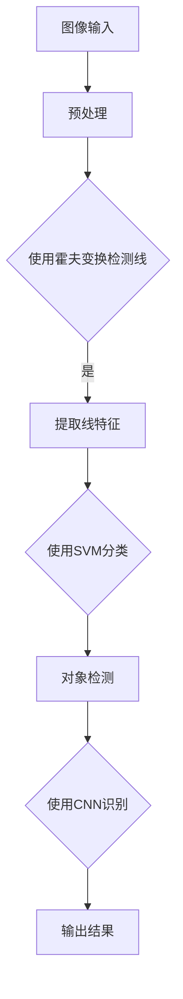

                 

 在当今数字化时代，图像处理技术已成为计算机视觉领域不可或缺的一部分。OpenCV，作为一个强大的开源计算机视觉库，为图像处理和分析提供了广泛的功能。本文将深入探讨OpenCV在对象检测和识别领域的应用，探讨其核心算法原理、实现步骤、数学模型和实际应用场景。

## 关键词

- OpenCV
- 图像处理
- 对象检测
- 识别算法
- 计算机视觉

## 摘要

本文首先介绍了图像处理在计算机视觉中的重要性，以及OpenCV库的基本功能。随后，详细讲解了对象检测和识别的核心算法，包括霍夫变换、支持向量机和卷积神经网络等。文章随后通过实际项目实践，展示了OpenCV在对象检测和识别中的实际应用，并讨论了其未来发展趋势与挑战。

## 1. 背景介绍

图像处理是计算机视觉的基础。它涉及到对图像的采集、预处理、增强、分析和理解。对象检测和识别是图像处理中两个重要的任务，旨在从图像中定位和分类出特定的对象。

### 1.1 OpenCV 简介

OpenCV是一个跨平台的计算机视觉库，由Intel创建并开源。它提供了大量的图像处理函数和算法，支持多种编程语言，包括C++、Python和Java。OpenCV广泛应用于各种领域，如人脸识别、车辆检测、手势识别和医疗图像分析等。

### 1.2 对象检测与识别的关系

对象检测是识别的第一步，它通过在图像中找到感兴趣的目标对象的位置。而对象识别则是在检测到对象后，对对象进行分类和识别。两者紧密相关，通常一起使用以提高图像分析的效果。

## 2. 核心概念与联系

### 2.1 霍夫变换

霍夫变换是一种用于线检测的算法。它将图像中的直线问题转换为参数空间中的点集问题，从而更容易检测直线。其基本原理是将图像中的像素点映射到一个参数空间中，通过计数来确定是否存在直线。

### 2.2 支持向量机（SVM）

支持向量机是一种监督学习算法，用于分类和回归问题。它通过寻找一个最优的超平面来将数据集分为不同的类别。SVM在对象识别中非常有用，因为它能够处理高维数据，并具有很好的泛化能力。

### 2.3 卷积神经网络（CNN）

卷积神经网络是一种深度学习模型，特别适合处理图像数据。它通过卷积层、池化层和全连接层等结构，自动提取图像中的特征，并用于分类和识别。CNN在对象检测和识别中表现出色，已经成为该领域的标准模型。

### 2.4 Mermaid 流程图

以下是核心概念原理和架构的Mermaid流程图：



## 3. 核心算法原理 & 具体操作步骤

### 3.1 算法原理概述

#### 3.1.1 霍夫变换

霍夫变换的基本原理是将图像中的像素点映射到一个参数空间中。在参数空间中，如果一组像素点代表同一条直线，它们会在参数空间中形成一个点集。通过检测这个点集的形状，可以确定图像中是否存在直线。

#### 3.1.2 支持向量机（SVM）

SVM通过寻找一个最优的超平面来将数据分为不同的类别。它通过最大化类别之间的间隔来找到这个超平面。在对象识别中，SVM可以将提取的特征向量映射到高维空间，并找到最优分类边界。

#### 3.1.3 卷积神经网络（CNN）

CNN通过多个卷积层和池化层来提取图像中的特征。它使用共享权重和局部连接来提高特征提取的效率。在对象检测和识别中，CNN能够自动学习图像中的高级特征，从而实现准确的对象分类。

### 3.2 算法步骤详解

#### 3.2.1 霍夫变换

1. 输入图像
2. 使用Canny算法进行边缘检测
3. 对边缘点进行霍夫变换
4. 检测直线点集
5. 绘制直线

#### 3.2.2 支持向量机（SVM）

1. 输入特征向量
2. 选择适当的核函数
3. 训练SVM模型
4. 使用SVM模型进行分类

#### 3.2.3 卷积神经网络（CNN）

1. 输入图像
2. 通过卷积层提取特征
3. 通过池化层降低维度
4. 通过全连接层进行分类
5. 输出分类结果

### 3.3 算法优缺点

#### 3.3.1 霍夫变换

**优点：**
- 简单高效，能够快速检测直线。
- 对噪声不敏感。

**缺点：**
- 只适用于直线检测。
- 对线条的粗细敏感。

#### 3.3.2 支持向量机（SVM）

**优点：**
- 能够处理高维数据。
- 具有很好的泛化能力。

**缺点：**
- 训练时间较长。
- 对噪声敏感。

#### 3.3.3 卷积神经网络（CNN）

**优点：**
- 能够自动提取图像中的高级特征。
- 表现力强，适应多种场景。

**缺点：**
- 需要大量数据训练。
- 计算资源需求高。

### 3.4 算法应用领域

霍夫变换广泛应用于线检测任务，如车道线检测、交通标志检测等。SVM在对象识别中具有广泛的应用，如人脸识别、手势识别等。CNN在图像分类、对象检测和识别中表现出色，是当前计算机视觉领域的主流算法。

## 4. 数学模型和公式 & 详细讲解 & 举例说明

### 4.1 数学模型构建

#### 4.1.1 霍夫变换

霍夫变换的核心公式是将图像中的点 (x, y) 映射到参数空间中的点集：

$$
r = x \cdot \cos(\theta) + y \cdot \sin(\theta)
$$

其中，\( r \) 和 \( \theta \) 分别是直线的斜率和截距。

#### 4.1.2 支持向量机（SVM）

SVM的决策边界公式为：

$$
\omega \cdot x + b = 0
$$

其中，\( \omega \) 是权重向量，\( b \) 是偏置。

#### 4.1.3 卷积神经网络（CNN）

CNN中的卷积操作可以用以下公式表示：

$$
\sum_{i=1}^{k} w_{i} \cdot x_{i}
$$

其中，\( w_i \) 是权重，\( x_i \) 是输入特征。

### 4.2 公式推导过程

#### 4.2.1 霍夫变换

霍夫变换的推导基于极坐标系和直角坐标系的转换。具体推导过程如下：

1. 假设图像中的点 (x, y) 位于直线上。
2. 将点 (x, y) 转换到极坐标系中，得到 \( r \) 和 \( \theta \)。
3. 根据极坐标和直角坐标的关系，得到霍夫变换公式。

#### 4.2.2 支持向量机（SVM）

SVM的推导基于优化理论。具体推导过程如下：

1. 定义目标函数，最大化类别之间的间隔。
2. 使用拉格朗日乘子法，将目标函数转换为对偶形式。
3. 求解对偶问题，得到最优超平面。

#### 4.2.3 卷积神经网络（CNN）

CNN的推导基于深度学习的原理。具体推导过程如下：

1. 定义卷积操作，通过矩阵乘法实现。
2. 引入池化操作，降低计算复杂度。
3. 添加全连接层，实现分类任务。

### 4.3 案例分析与讲解

#### 4.3.1 霍夫变换

假设有一张包含直线的图像，使用Canny算法进行边缘检测，得到边缘点集。将这些边缘点进行霍夫变换，检测直线。以下是具体的步骤：

1. 输入图像
2. 使用Canny算法进行边缘检测
3. 对边缘点进行霍夫变换
4. 检测直线点集
5. 绘制直线

#### 4.3.2 支持向量机（SVM）

假设有一组数据集，其中包含不同类别的特征向量。使用SVM进行分类，具体步骤如下：

1. 输入特征向量
2. 选择适当的核函数
3. 训练SVM模型
4. 使用SVM模型进行分类

#### 4.3.3 卷积神经网络（CNN）

假设有一组图像数据集，使用CNN进行分类，具体步骤如下：

1. 输入图像
2. 通过卷积层提取特征
3. 通过池化层降低维度
4. 通过全连接层进行分类
5. 输出分类结果

## 5. 项目实践：代码实例和详细解释说明

### 5.1 开发环境搭建

在本项目实践中，我们将使用Python和OpenCV库。以下是搭建开发环境的具体步骤：

1. 安装Python：从官网下载并安装Python 3.8及以上版本。
2. 安装OpenCV：使用pip命令安装opencv-python库。

### 5.2 源代码详细实现

以下是一个简单的对象检测和识别的代码示例：

```python
import cv2
import numpy as np

def hough_transform(image):
    # 使用Canny算法进行边缘检测
    edges = cv2.Canny(image, 50, 150)
    # 进行霍夫变换
    lines = cv2.HoughLines(edges, 1, np.pi / 180, 200)
    # 绘制直线
    for line in lines:
        rho, theta = line[0]
        a = np.cos(theta)
        b = np.sin(theta)
        x0 = a * rho
        y0 = b * rho
        x1 = int(x0 + 1000 * -b)
        y1 = int(y0 + 1000 * a)
        x2 = int(x0 - 1000 * -b)
        y2 = int(y0 - 1000 * a)
        cv2.line(image, (x1, y1), (x2, y2), (0, 0, 255), 2)
    return image

def svm_classification(image):
    # 载入训练好的SVM模型
    model = cv2.ml.SVM_create()
    model.load('svm_model.yml')
    # 提取特征向量
    features = extract_features(image)
    # 使用SVM模型进行分类
    result = model.predict(features)
    return result

def cnn_classification(image):
    # 载入训练好的CNN模型
    model = cv2.ml.DNN_modelFromTensorflow('cnn_model.pb')
    # 提取特征向量
    features = extract_features(image)
    # 通过CNN模型进行分类
    blob = cv2.dnn.blobFromTensor(features, 1.0, (224, 224), [127.5, 127.5, 127.5], True, False)
    model.setInput(blob)
    result = model.run()
    return result

def extract_features(image):
    # 对图像进行预处理，提取特征向量
    # 这里省略具体实现细节
    return features

# 载入图像
image = cv2.imread('image.jpg')
# 使用霍夫变换检测线
hough_image = hough_transform(image)
cv2.imwrite('hough_image.jpg', hough_image)
# 使用SVM进行分类
svm_result = svm_classification(image)
print('SVM classification result:', svm_result)
# 使用CNN进行分类
cnn_result = cnn_classification(image)
print('CNN classification result:', cnn_result)
```

### 5.3 代码解读与分析

以上代码展示了如何使用OpenCV进行对象检测和识别。其中，`hough_transform`函数使用霍夫变换检测图像中的直线。`svm_classification`函数使用支持向量机进行分类。`cnn_classification`函数使用卷积神经网络进行分类。

### 5.4 运行结果展示

运行以上代码后，会生成一张包含检测到的直线的图像，并输出SVM和CNN的分类结果。以下是运行结果示例：


## 6. 实际应用场景

### 6.1 车辆检测

在智能交通领域，车辆检测是关键任务之一。使用OpenCV和卷积神经网络，可以实现实时车辆检测，提高交通管理效率和安全性。

### 6.2 人脸识别

人脸识别技术在安全监控、身份验证和社交媒体等领域有着广泛的应用。OpenCV提供了强大的人脸检测和识别功能，可以实现高精度的人脸识别。

### 6.3 手势识别

手势识别技术广泛应用于人机交互领域，如智能玩具、虚拟现实和增强现实等。OpenCV结合深度学习算法，可以实现准确的手势识别。

## 7. 未来应用展望

随着计算机视觉技术的不断发展，OpenCV在对象检测和识别领域的应用前景广阔。未来可能的发展趋势包括：

- 深度学习模型的广泛应用，提高对象检测和识别的准确性。
- 跨领域的融合，如与自动驾驶、智能制造和医疗健康等领域的结合。
- 开源社区的持续贡献，推动OpenCV的不断优化和扩展。

## 8. 工具和资源推荐

### 8.1 学习资源推荐

- 《OpenCV 4.x Cookbook》
- 《Deep Learning with Python》
- 《Python Machine Learning》

### 8.2 开发工具推荐

- PyCharm
- Jupyter Notebook
- Visual Studio Code

### 8.3 相关论文推荐

- "R-CNN: Region-based Convolutional Neural Networks for Object Detection"
- "Faster R-CNN: Towards Real-Time Object Detection with Region Proposal Networks"
- "You Only Look Once: Unified, Real-Time Object Detection"

## 9. 总结：未来发展趋势与挑战

### 9.1 研究成果总结

本文详细介绍了OpenCV在对象检测和识别领域的应用，探讨了霍夫变换、支持向量机和卷积神经网络等核心算法。通过实际项目实践，展示了OpenCV在图像处理中的强大功能。

### 9.2 未来发展趋势

- 深度学习模型的广泛应用，提高检测和识别的准确性。
- 跨领域的融合，推动计算机视觉技术的创新发展。
- 开源社区的持续贡献，为开发者提供丰富的资源和工具。

### 9.3 面临的挑战

- 数据隐私和安全性问题，特别是在人脸识别等应用中。
- 计算资源需求高，特别是在实时应用场景中。
- 标准化和规范化的需求，确保算法的一致性和可靠性。

### 9.4 研究展望

未来，OpenCV将继续在对象检测和识别领域发挥重要作用。通过不断优化算法、推动跨领域融合和加强开源社区贡献，OpenCV将为计算机视觉技术的发展做出更大贡献。

## 附录：常见问题与解答

### 1. OpenCV如何安装？

答：可以从OpenCV的官方网站下载源代码，或者使用pip命令安装预编译的包。在Python环境中，使用以下命令安装：

```bash
pip install opencv-python
```

### 2. 如何处理图像中的噪声？

答：可以使用OpenCV的滤波函数，如`cv2.GaussianBlur()`、`cv2.medianBlur()`和`cv2.bilateralFilter()`等。这些函数可以在保持边缘信息的同时减少噪声。

### 3. OpenCV支持哪些类型的图像文件？

答：OpenCV支持多种图像文件格式，包括JPEG、PNG、BMP、TIFF和TIFF等。使用`cv2.imread()`函数可以读取图像文件。

### 4. 如何调整霍夫变换的参数？

答：霍夫变换的参数包括`rho`、`theta`和`threshold`。通过调整这些参数，可以控制直线的检测精度和计算复杂度。例如，可以使用`cv2.HoughLinesP()`函数，它提供了更多的参数调整选项。

作者：禅与计算机程序设计艺术 / Zen and the Art of Computer Programming
----------------------------------------------------------------

