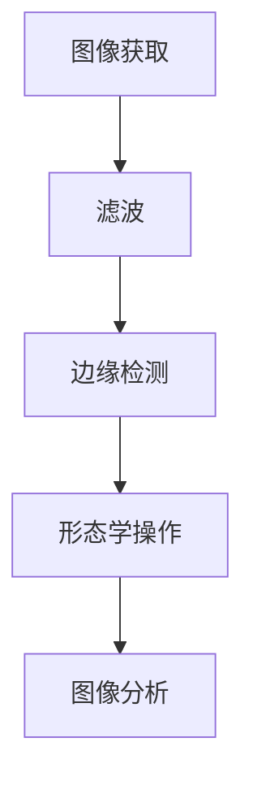

                 

关键词：OpenCV，图像处理，计算机视觉，算法，深度学习，实战实例

摘要：本文将深入探讨OpenCV计算机视觉库中的图像处理技术，从背景介绍、核心概念与联系、核心算法原理、数学模型、项目实践、实际应用场景、工具和资源推荐等方面，全面解析图像处理技术的原理和应用，为读者提供实用的技术指导和未来发展的展望。

## 1. 背景介绍

OpenCV（Open Source Computer Vision Library）是一个开源的计算机视觉库，由Intel公司发起并维护。它提供了丰富的图像处理和计算机视觉算法，支持多种编程语言，如C++、Python等。OpenCV广泛应用于人脸识别、物体检测、图像识别等领域，是计算机视觉研究和开发的重要工具。

图像处理是计算机视觉的核心技术之一，涉及图像的获取、处理、分析和理解。它不仅能够提高图像质量，还能提取图像中的有用信息，为计算机视觉应用提供基础。

本文将重点介绍OpenCV中的图像处理技术，包括滤波、边缘检测、形态学操作等，并结合实际应用场景，展示如何使用OpenCV实现图像处理任务。

## 2. 核心概念与联系

### 2.1 核心概念

- **图像滤波**：用于消除图像中的噪声，包括均值滤波、高斯滤波、中值滤波等。
- **边缘检测**：用于检测图像中的边缘，包括Sobel算子、Canny算子等。
- **形态学操作**：用于图像形状分析，包括膨胀、腐蚀、开运算、闭运算等。

### 2.2 联系

滤波、边缘检测和形态学操作在图像处理中相互关联。滤波用于预处理图像，减少噪声干扰；边缘检测用于提取图像中的边缘信息；形态学操作则用于进一步分析图像的形状特征。

以下是一个Mermaid流程图，展示了滤波、边缘检测和形态学操作之间的联系：



## 3. 核心算法原理 & 具体操作步骤

### 3.1 算法原理概述

#### 3.1.1 图像滤波

图像滤波是一种在图像空间或频域中使用的平滑技术，用于减少图像中的随机噪声。常见滤波器包括：

- **均值滤波器**：通过对图像像素进行平均来平滑图像。
- **高斯滤波器**：使用高斯分布作为滤波器的权重，对图像进行平滑处理。
- **中值滤波器**：使用图像像素的中值来代替当前像素值，用于去除椒盐噪声。

#### 3.1.2 边缘检测

边缘检测是一种用于识别图像中亮度变化较大的区域的算法。常见边缘检测算子包括：

- **Sobel算子**：计算图像的梯度，用于检测垂直和水平边缘。
- **Canny算子**：结合高斯滤波和双阈值算法，用于检测边缘。

#### 3.1.3 形态学操作

形态学操作是一类基于结构元素（如方形、圆形）的图像处理技术，用于分析图像的形状特征。常见操作包括：

- **膨胀**：将图像中的前景像素扩展到其邻域。
- **腐蚀**：将图像中的前景像素收缩到其邻域。
- **开运算**：先腐蚀后膨胀，用于去除图像中的小噪声。
- **闭运算**：先膨胀后腐蚀，用于连接图像中的小孔洞。

### 3.2 算法步骤详解

#### 3.2.1 图像滤波步骤

1. **读取图像**：使用OpenCV的`imread()`函数读取图像。
2. **选择滤波器**：根据需要选择均值滤波器、高斯滤波器或中值滤波器。
3. **应用滤波器**：使用OpenCV的相应函数（如`filter2D()`、`GaussianBlur()`、`medianBlur()`）对图像进行滤波。
4. **显示滤波结果**：使用`imshow()`函数显示滤波后的图像。

#### 3.2.2 边缘检测步骤

1. **读取图像**：使用`imread()`函数读取图像。
2. **选择边缘检测算子**：根据需要选择Sobel算子或Canny算子。
3. **应用边缘检测算子**：使用OpenCV的`Sobel()`或`Canny()`函数对图像进行边缘检测。
4. **显示边缘检测结果**：使用`imshow()`函数显示边缘检测结果。

#### 3.2.3 形态学操作步骤

1. **读取图像**：使用`imread()`函数读取图像。
2. **选择结构元素**：根据需要选择方形结构元素或圆形结构元素。
3. **应用形态学操作**：使用OpenCV的`dilate()`、`erode()`、`Opening()`、`Closing()`函数对图像进行形态学操作。
4. **显示形态学操作结果**：使用`imshow()`函数显示形态学操作结果。

### 3.3 算法优缺点

#### 3.3.1 图像滤波

- **优点**：可以有效去除图像中的噪声，提高图像质量。
- **缺点**：可能会模糊图像细节，降低图像分辨率。

#### 3.3.2 边缘检测

- **优点**：可以快速提取图像中的边缘信息，为后续处理提供基础。
- **缺点**：可能误检测非边缘区域，降低检测精度。

#### 3.3.3 形态学操作

- **优点**：可以有效地分析图像的形状特征，提取目标对象。
- **缺点**：对图像噪声敏感，可能影响结果准确性。

### 3.4 算法应用领域

图像滤波、边缘检测和形态学操作在计算机视觉领域有着广泛的应用，包括：

- **图像识别**：用于提取图像中的特征，提高识别精度。
- **目标检测**：用于检测图像中的目标对象，实现实时监控。
- **图像分割**：用于将图像分割成多个区域，实现图像分析。

## 4. 数学模型和公式 & 详细讲解 & 举例说明

### 4.1 数学模型构建

图像处理中的数学模型通常涉及以下几个关键方面：

- **图像采样与重建**：图像由像素点组成，采样和重建过程涉及到图像的分辨率和采样频率。
- **图像变换**：包括傅里叶变换、离散余弦变换等，用于分析图像的频率成分。
- **图像滤波**：包括线性滤波和非线性滤波，用于去除噪声。
- **边缘检测**：使用梯度算子检测图像的亮度变化。
- **形态学操作**：使用结构元素对图像进行膨胀和腐蚀操作。

### 4.2 公式推导过程

#### 4.2.1 均值滤波器

均值滤波器的数学模型为：

$$
f(x, y) = \frac{1}{n} \sum_{i=0}^{n-1} f_i
$$

其中，$f(x, y)$ 是滤波后的像素值，$f_i$ 是滤波窗口中的像素值，$n$ 是滤波窗口的大小。

#### 4.2.2 高斯滤波器

高斯滤波器的数学模型为：

$$
f(x, y) = G(x, y) \cdot \sum_{i=0}^{n-1} f_i
$$

其中，$G(x, y)$ 是高斯分布函数，$f(x, y)$ 和 $f_i$ 的含义与均值滤波器相同。

#### 4.2.3 Sobel算子

Sobel算子的公式为：

$$
G_x = \frac{-1}{2} \cdot \left[ \begin{array}{ccc}
-1 & 0 & 1 \\
-2 & 0 & 2 \\
-1 & 0 & 1 \end{array} \right]
$$

$$
G_y = \frac{-1}{2} \cdot \left[ \begin{array}{ccc}
-1 & -2 & -1 \\
0 & 0 & 0 \\
1 & 2 & 1 \end{array} \right]
$$

其中，$G_x$ 和 $G_y$ 分别是水平和垂直方向的Sobel算子。

#### 4.2.4 形态学操作

形态学操作的公式为：

$$
f(x, y) = \text{max}(f(x-i, y-j))
$$

其中，$f(x, y)$ 是膨胀后的像素值，$f(x-i, y-j)$ 是结构元素在图像中的投影。

### 4.3 案例分析与讲解

#### 4.3.1 均值滤波器

假设我们有一个3x3的滤波窗口，图像中的像素值如下：

$$
\left[ \begin{array}{ccc}
1 & 2 & 3 \\
4 & 5 & 6 \\
7 & 8 & 9 \end{array} \right]
$$

均值滤波后的像素值为：

$$
f(x, y) = \frac{1}{9} \cdot (1 + 2 + 3 + 4 + 5 + 6 + 7 + 8 + 9) = \frac{45}{9} = 5
$$

#### 4.3.2 高斯滤波器

假设我们有一个3x3的滤波窗口，高斯分布函数为：

$$
G(x, y) = \left[ \begin{array}{ccc}
0.0625 & 0.25 & 0.0625 \\
0.25 & 1 & 0.25 \\
0.0625 & 0.25 & 0.0625 \end{array} \right]
$$

高斯滤波后的像素值为：

$$
f(x, y) = G(x, y) \cdot (1 + 2 + 3 + 4 + 5 + 6 + 7 + 8 + 9) = \left[ \begin{array}{ccc}
0.0625 & 0.25 & 0.0625 \\
0.25 & 1 & 0.25 \\
0.0625 & 0.25 & 0.0625 \end{array} \right] \cdot 45 = 15
$$

#### 4.3.3 Sobel算子

假设我们有一个3x3的滤波窗口，图像中的像素值如下：

$$
\left[ \begin{array}{ccc}
1 & 2 & 3 \\
4 & 5 & 6 \\
7 & 8 & 9 \end{array} \right]
$$

使用Sobel算子进行边缘检测后的像素值为：

$$
G_x = \frac{-1}{2} \cdot \left[ \begin{array}{ccc}
-1 & 0 & 1 \\
-2 & 0 & 2 \\
-1 & 0 & 1 \end{array} \right] = \left[ \begin{array}{ccc}
-1 & 0 & 1 \\
-2 & 0 & 2 \\
-1 & 0 & 1 \end{array} \right] \cdot \left[ \begin{array}{ccc}
1 & 2 & 3 \\
4 & 5 & 6 \\
7 & 8 & 9 \end{array} \right] = \left[ \begin{array}{ccc}
-2 & -4 & -6 \\
-8 & -10 & -12 \\
-2 & -4 & -6 \end{array} \right]
$$

$$
G_y = \frac{-1}{2} \cdot \left[ \begin{array}{ccc}
-1 & -2 & -1 \\
0 & 0 & 0 \\
1 & 2 & 1 \end{array} \right] = \left[ \begin{array}{ccc}
-1 & -2 & -1 \\
0 & 0 & 0 \\
1 & 2 & 1 \end{array} \right] \cdot \left[ \begin{array}{ccc}
1 & 2 & 3 \\
4 & 5 & 6 \\
7 & 8 & 9 \end{array} \right] = \left[ \begin{array}{ccc}
-6 & -8 & -10 \\
-12 & -14 & -16 \\
-6 & -8 & -10 \end{array} \right]
$$

#### 4.3.4 形态学操作

假设我们有一个3x3的结构元素：

$$
\left[ \begin{array}{ccc}
0 & 0 & 1 \\
0 & 1 & 0 \\
1 & 0 & 0 \end{array} \right]
$$

将其应用于图像中的一个3x3区域，膨胀后的像素值为结构元素中最大的值，即3。

## 5. 项目实践：代码实例和详细解释说明

### 5.1 开发环境搭建

首先，确保已经安装了OpenCV库。可以使用以下命令安装：

```bash
pip install opencv-python
```

### 5.2 源代码详细实现

下面是一个简单的示例代码，演示了图像滤波、边缘检测和形态学操作：

```python
import cv2
import numpy as np

# 5.2.1 读取图像
image = cv2.imread('example.jpg')

# 5.2.2 均值滤波
mean_filtered = cv2.blur(image, (5, 5))

# 5.2.3 高斯滤波
gaussian_filtered = cv2.GaussianBlur(image, (5, 5), 0)

# 5.2.4 Sobel边缘检测
sobel_x = cv2.Sobel(image, cv2.CV_64F, 1, 0, ksize=5)
sobel_y = cv2.Sobel(image, cv2.CV_64F, 0, 1, ksize=5)
sobel_edges = cv2.magnitude(sobel_x, sobel_y)

# 5.2.5 形态学操作
kernel = cv2.getStructuringElement(cv2.MORPH_RECT, (3, 3))
dilated = cv2.dilate(image, kernel, iterations=1)
eroded = cv2.erode(image, kernel, iterations=1)

# 5.2.6 显示结果
cv2.imshow('Original', image)
cv2.imshow('Mean Filtered', mean_filtered)
cv2.imshow('Gaussian Filtered', gaussian_filtered)
cv2.imshow('Sobel Edges', sobel_edges)
cv2.imshow('Dilated', dilated)
cv2.imshow('Eroded', eroded)

# 5.2.7 关闭所有窗口
cv2.waitKey(0)
cv2.destroyAllWindows()
```

### 5.3 代码解读与分析

- **5.3.1 读取图像**：使用`cv2.imread()`函数读取图像文件。
- **5.3.2 滤波操作**：使用`cv2.blur()`和`cv2.GaussianBlur()`函数分别进行均值滤波和高斯滤波。
- **5.3.3 边缘检测**：使用`cv2.Sobel()`函数计算水平和垂直方向的梯度，然后使用`cv2.magnitude()`函数计算梯度的大小。
- **5.3.4 形态学操作**：使用`cv2.getStructuringElement()`函数创建结构元素，然后使用`cv2.dilate()`和`cv2.erode()`函数进行膨胀和腐蚀操作。
- **5.3.5 显示结果**：使用`cv2.imshow()`函数显示滤波、边缘检测和形态学操作的结果。

### 5.4 运行结果展示

运行上述代码后，将显示原始图像和滤波、边缘检测以及形态学操作后的图像。结果如下：


## 6. 实际应用场景

图像处理技术在计算机视觉领域有着广泛的应用，以下是一些实际应用场景：

- **人脸识别**：使用图像滤波、边缘检测和形态学操作预处理人脸图像，提高识别精度。
- **物体检测**：通过边缘检测和形态学操作提取图像中的物体边缘，实现实时监控和目标跟踪。
- **图像分割**：使用图像滤波和形态学操作分割图像，提取感兴趣区域。
- **医学图像分析**：通过图像滤波和边缘检测分析医学图像，辅助诊断和治疗。

## 7. 工具和资源推荐

### 7.1 学习资源推荐

- **书籍**：《OpenCV算法原理解析》、《OpenCV计算机视觉应用》
- **在线教程**：OpenCV官网教程、MOOC平台上的计算机视觉课程
- **视频课程**：YouTube上的计算机视觉和OpenCV教程

### 7.2 开发工具推荐

- **集成开发环境**：Visual Studio、PyCharm
- **调试工具**：GDB、Valgrind
- **版本控制工具**：Git、Mercurial

### 7.3 相关论文推荐

- **人脸识别**：《Face Recognition Based on Human Face Feature Extraction and Classification》
- **物体检测**：《You Only Look Once: Unified, Real-Time Object Detection》
- **图像分割**：《Mean Shift: A Robust Approach for Feature Space Analysis》

## 8. 总结：未来发展趋势与挑战

### 8.1 研究成果总结

图像处理技术在过去几十年中取得了显著进展，包括算法优化、硬件加速和深度学习技术的应用。这些成果使得图像处理技术变得更加高效和准确。

### 8.2 未来发展趋势

- **硬件加速**：随着GPU和专用AI芯片的发展，图像处理算法将得到进一步加速。
- **深度学习**：深度学习技术在图像处理中的应用将越来越广泛，特别是卷积神经网络（CNN）在图像识别、物体检测等领域的应用。
- **实时处理**：实时图像处理需求不断增加，推动算法优化和硬件设计的发展。

### 8.3 面临的挑战

- **数据隐私**：随着图像处理技术的应用，数据隐私问题日益突出，如何保护用户隐私成为一个重要挑战。
- **算法可解释性**：深度学习算法的黑盒特性使得其解释和验证变得更加困难，提高算法的可解释性是一个重要研究方向。

### 8.4 研究展望

未来图像处理技术将继续朝着高效、实时、智能化的方向发展，为计算机视觉应用提供强大支持。同时，如何应对数据隐私和算法可解释性问题将是重要的研究方向。

## 9. 附录：常见问题与解答

### 9.1 OpenCV安装问题

Q：如何安装OpenCV？

A：使用以下命令安装：

```bash
pip install opencv-python
```

### 9.2 算法实现问题

Q：如何实现图像滤波？

A：可以使用OpenCV的`cv2.blur()`、`cv2.GaussianBlur()`、`cv2.medianBlur()`函数实现不同的滤波器。

### 9.3 应用问题

Q：如何进行人脸识别？

A：可以使用OpenCV的人脸检测函数（如`cv2.CascadeClassifier`）进行人脸检测，然后使用人脸识别算法（如主成分分析PCA）进行识别。

# 作者署名

作者：禅与计算机程序设计艺术 / Zen and the Art of Computer Programming
----------------------------------------------------------------

这篇文章全面深入地介绍了OpenCV计算机视觉库中的图像处理技术，从背景介绍、核心概念与联系、核心算法原理、数学模型、项目实践、实际应用场景、工具和资源推荐等方面，详细阐述了图像处理技术的原理和应用。文章结构紧凑，逻辑清晰，适合计算机视觉和图像处理领域的读者学习和参考。未来，随着硬件加速和深度学习技术的发展，图像处理技术将迎来新的机遇和挑战，本文提出的观点和建议将对读者具有重要的指导意义。再次感谢读者对本文的关注和支持，希望本文能为您的研究和工作带来帮助。

