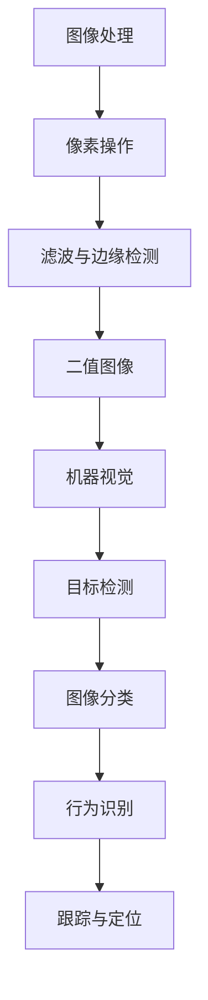

                 

关键词：OpenCV、计算机视觉、图像处理、机器视觉、实践、算法原理、数学模型、项目实例、应用场景、未来展望

摘要：本文将深入探讨OpenCV在计算机视觉领域中的应用，包括图像处理和机器视觉的基本概念、核心算法原理、数学模型以及项目实践。通过详细讲解和实例分析，帮助读者掌握OpenCV的使用方法和技巧，为实际应用提供指导。

## 1. 背景介绍

计算机视觉作为人工智能的重要分支，近年来取得了飞速发展。随着深度学习和图像处理技术的不断进步，计算机视觉已经广泛应用于安防监控、自动驾驶、医疗影像分析、智能家居等多个领域。OpenCV（Open Source Computer Vision Library）是一个开源的计算机视觉库，提供了一系列强大的图像处理和机器视觉功能，使其成为了计算机视觉研究和开发中的重要工具。

OpenCV最初由Intel公司开发，目前已经成为全球最广泛使用的计算机视觉库之一。其具有跨平台、高性能、易于扩展等特点，涵盖了从基本的图像处理到复杂的机器学习算法，为各种计算机视觉应用提供了丰富的资源和工具。

本文将围绕OpenCV的核心内容展开，通过详细介绍其基本概念、算法原理、数学模型和实际项目实践，帮助读者全面掌握OpenCV的使用方法，并在计算机视觉领域取得实际应用。

## 2. 核心概念与联系

### 2.1 图像处理

图像处理是计算机视觉的基础，旨在对图像进行操作和转换，以提取有用的信息。图像处理主要包括以下核心概念：

1. **像素**：图像的基本单元，由像素值表示。
2. **灰度图像**：每个像素用单通道灰度值表示，范围从0（黑色）到255（白色）。
3. **二值图像**：将像素值转换为0或1，用于图像分割和目标检测。
4. **边缘检测**：通过检测像素值的变化，提取图像的边缘信息。
5. **滤波**：通过卷积操作去除噪声，增强图像的清晰度。

### 2.2 机器视觉

机器视觉旨在使计算机能够理解和解释图像信息，从而进行自动化任务。机器视觉包括以下核心概念：

1. **目标检测**：识别图像中的特定目标并定位其位置。
2. **图像分类**：将图像划分为不同的类别，如人脸、车辆等。
3. **图像识别**：识别图像中的特定对象或场景，如文字识别、场景分割等。
4. **行为识别**：通过视频序列分析，识别人的行为和动作。
5. **跟踪与定位**：跟踪图像中的目标运动轨迹，并确定其位置。

### 2.3 核心概念与联系

图像处理和机器视觉相互关联，共同构成了计算机视觉的完整体系。图像处理为机器视觉提供了基本的数据输入和预处理，而机器视觉则利用图像处理技术提取有用信息，实现各种计算机视觉任务。以下是一个简化的 Mermaid 流程图，展示了这两个核心概念之间的联系：



## 3. 核心算法原理 & 具体操作步骤

### 3.1 算法原理概述

OpenCV提供了丰富的图像处理和机器视觉算法，包括：

1. **滤波算法**：如均值滤波、高斯滤波、中值滤波等，用于去除噪声和增强图像。
2. **边缘检测算法**：如Sobel算子、Canny算子等，用于检测图像的边缘。
3. **图像变换算法**：如傅里叶变换、HOG（直方图方向梯度）变换等，用于图像特征提取。
4. **目标检测算法**：如HOG+SVM、Haar级联分类器等，用于识别和定位图像中的目标。
5. **图像分类算法**：如KNN、SVM、神经网络等，用于将图像分类为不同的类别。

### 3.2 算法步骤详解

#### 3.2.1 滤波算法

滤波算法通过卷积操作对图像进行平滑处理，去除噪声。以下是一个简单的滤波算法步骤：

1. 创建一个卷积核（滤波器），如3x3的均值滤波器。
2. 将卷积核与图像进行卷积操作，计算每个像素的新值。
3. 应用边界填充策略，如复制边缘或镜像边缘。
4. 输出平滑后的图像。

以下是一个使用OpenCV实现均值滤波的示例代码：

```python
import cv2
import numpy as np

# 加载图像
img = cv2.imread('image.jpg', cv2.IMREAD_GRAYSCALE)

# 创建3x3的均值滤波器
kernel = np.ones((3, 3), np.float32) / 9

# 应用均值滤波
filtered_img = cv2.filter2D(img, -1, kernel)

# 显示结果
cv2.imshow('Original Image', img)
cv2.imshow('Filtered Image', filtered_img)
cv2.waitKey(0)
cv2.destroyAllWindows()
```

#### 3.2.2 边缘检测算法

边缘检测是图像处理中的重要步骤，用于提取图像中的显著边缘。以下是一个使用Canny算子的边缘检测步骤：

1. 将图像转换为灰度图像。
2. 应用高斯滤波器进行去噪。
3. 应用Canny算子进行边缘检测。
4. 调整Canny算子的阈值，以优化边缘检测结果。

以下是一个使用OpenCV实现Canny边缘检测的示例代码：

```python
import cv2

# 加载图像
img = cv2.imread('image.jpg', cv2.IMREAD_GRAYSCALE)

# 应用高斯滤波
blurred_img = cv2.GaussianBlur(img, (5, 5), 0)

# 应用Canny算子
edges = cv2.Canny(blurred_img, threshold1=50, threshold2=150)

# 显示结果
cv2.imshow('Original Image', img)
cv2.imshow('Edges', edges)
cv2.waitKey(0)
cv2.destroyAllWindows()
```

#### 3.2.3 图像变换算法

图像变换是图像特征提取的重要步骤，用于提取图像的频率信息。以下是一个使用傅里叶变换的图像变换步骤：

1. 将图像转换为频域。
2. 应用傅里叶变换。
3. 对频域图像进行操作，如滤波。
4. 应用傅里叶逆变换，将图像恢复到时域。

以下是一个使用OpenCV实现傅里叶变换的示例代码：

```python
import cv2
import numpy as np

# 加载图像
img = cv2.imread('image.jpg', cv2.IMREAD_GRAYSCALE)

# 将图像转换为频域
f = np.fft.fft2(img)
fshift = np.fft.fftshift(f)

# 显示频域图像
magnitude_spectrum = 20 * np.log(np.abs(fshift))
cv2.imshow('Magnitude Spectrum', magnitude_spectrum)
cv2.waitKey(0)
cv2.destroyAllWindows()

# 应用傅里叶逆变换
f_ishift = np.fft.ifftshift(fshift)
f_inv = np.fft.ifft2(f_ishift)
img_back = np.abs(f_inv)

# 显示恢复的图像
cv2.imshow('Image after FFT', img_back)
cv2.waitKey(0)
cv2.destroyAllWindows()
```

#### 3.2.4 目标检测算法

目标检测是计算机视觉中的重要任务，用于识别图像中的特定目标并定位其位置。以下是一个使用HOG+SVM目标检测的步骤：

1. 提取图像的HOG特征。
2. 使用SVM分类器进行目标检测。
3. 根据检测结果，绘制边界框并输出目标位置。

以下是一个使用OpenCV实现HOG+SVM目标检测的示例代码：

```python
import cv2
import numpy as np

# 加载训练数据和标签
train_data = cv2.imread('train_data.jpg', cv2.IMREAD_GRAYSCALE)
train_labels = np.array([0, 1, 0, 1])

# 提取HOG特征
ho

