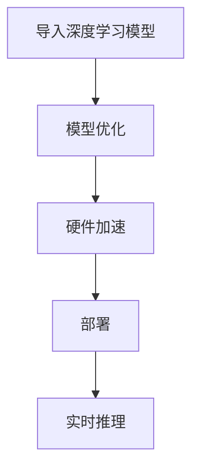

                 

关键词：深度学习，部署工具，英特尔，OpenVINO，神经网络，计算机视觉

摘要：本文将深入探讨英特尔推出的深度学习部署工具包——OpenVINO。从背景介绍到核心概念、算法原理，再到数学模型、项目实践，本文将全面解析OpenVINO的功能和应用场景，并展望其未来的发展趋势和挑战。

## 1. 背景介绍

随着深度学习技术的飞速发展，越来越多的企业和研究机构开始关注如何将深度学习模型部署到实际应用中。然而，深度学习模型的部署并非易事，需要考虑硬件兼容性、模型优化、性能优化等多个方面。为了解决这一问题，英特尔推出了OpenVINO，这是一个专为深度学习模型部署设计的工具包。

OpenVINO旨在为开发人员提供一种简单、高效的方式来部署深度学习模型，无论是桌面设备、嵌入式系统，还是高性能服务器，OpenVINO都能提供良好的支持。OpenVINO基于英特尔优化的深度学习库和硬件加速技术，可以帮助用户实现高性能、低延迟的深度学习应用。

## 2. 核心概念与联系

OpenVINO的核心概念包括以下几部分：

- **深度学习模型**：OpenVINO支持多种深度学习框架，如TensorFlow、PyTorch、Caffe等，用户可以将自己的深度学习模型导入OpenVINO。
- **模型优化**：OpenVINO提供了一套模型优化工具，可以将深度学习模型转换为OpenVINO支持的格式，并针对特定硬件进行优化。
- **硬件加速**：OpenVINO利用英特尔CPU、GPU和VPU等硬件资源，提供高效的深度学习计算能力。
- **部署**：OpenVINO提供了一套部署工具，可以将优化后的模型部署到各种设备上，实现实时推理。

### Mermaid 流程图

下面是一个简化的OpenVINO流程图：



## 3. 核心算法原理 & 具体操作步骤

### 3.1 算法原理概述

OpenVINO的核心算法原理可以概括为以下三个步骤：

1. **模型转换**：将深度学习模型转换为OpenVINO支持的格式，如IR（Intermediate Representation）。
2. **模型优化**：对模型进行优化，使其在特定硬件上运行更高效。
3. **模型部署**：将优化后的模型部署到目标设备，实现实时推理。

### 3.2 算法步骤详解

#### 模型转换

OpenVINO提供了一套模型转换工具，如`mo.py`，用户可以使用该工具将深度学习模型转换为IR格式。转换过程中，OpenVINO会对模型进行一些优化，如去除冗余操作、融合操作等。

```python
import mo

# 导入模型
model = mxnet.model.load_checkpoint('model_checkpoint', 'symbol.json')

# 转换为IR格式
xml, bin = mo.renameaksi(model)
```

#### 模型优化

模型优化是OpenVINO的一个重要环节，通过对模型进行优化，可以提升模型的性能。OpenVINO提供了一系列优化策略，如：

- **模型剪枝**：通过去除模型中的冗余层或减少层的数量，降低模型的复杂度。
- **量化**：将模型的权重和激活值转换为较低的精度，如8位整数，以减少模型的存储和计算开销。
- **混合精度训练**：结合使用浮点和整数运算，以获得更好的性能和精度平衡。

```python
import openvino.tools.model_optimization as mo

# 优化模型
optimizer = mo.ModelOptimizer(xml, bin)
optimizer.optimize_model()
```

#### 模型部署

模型部署是将优化后的模型部署到目标设备的过程。OpenVINO提供了多种部署方式，如：

- **本地部署**：将模型部署到本地设备，如CPU、GPU等。
- **远程部署**：将模型部署到远程服务器，通过HTTP接口进行调用。
- **嵌入式部署**：将模型部署到嵌入式设备，如智能摄像头、机器人等。

```python
import openvino.inference_engine as ie

# 加载模型
exec_net = ie.IEExecutor(xml)

# 实现实时推理
input_data = ie.IEInputBlob.from_memory('input_name', np.float32, (1, 3, 224, 224))
output = exec_net.infer(inputs={input_name: input_data})
```

### 3.3 算法优缺点

**优点**：

- **硬件加速**：OpenVINO利用英特尔硬件资源，提供高效的深度学习计算能力。
- **模型优化**：OpenVINO提供了一系列优化策略，可以提升模型的性能。
- **跨平台支持**：OpenVINO支持多种深度学习框架和硬件平台。

**缺点**：

- **兼容性问题**：由于OpenVINO专注于英特尔硬件，因此与其他硬件平台的兼容性可能较差。
- **学习成本**：OpenVINO的使用需要一定的学习和实践，对于新手来说可能有一定难度。

### 3.4 算法应用领域

OpenVINO广泛应用于以下几个领域：

- **计算机视觉**：如人脸识别、图像分类、目标检测等。
- **自然语言处理**：如文本分类、机器翻译、情感分析等。
- **语音识别**：如语音识别、语音合成等。
- **推荐系统**：如商品推荐、新闻推荐等。

## 4. 数学模型和公式 & 详细讲解 & 举例说明

### 4.1 数学模型构建

在深度学习中，常用的数学模型是神经网络，尤其是卷积神经网络（CNN）。神经网络由多个层次组成，包括输入层、隐藏层和输出层。每个层次由多个神经元组成，神经元之间通过权重连接。

假设我们有一个输入向量\( x \)，通过权重矩阵\( W \)和激活函数\( f \)计算得到输出向量\( y \)：

\[ y = f(Wx) \]

其中，\( f \)可以是 sigmoid、ReLU、tanh等激活函数。

### 4.2 公式推导过程

以卷积神经网络为例，卷积层的输入是一个三维数组\( X \)，输出是一个二维数组\( Y \)。卷积操作的公式如下：

\[ Y(i,j) = \sum_{k=1}^{K} \sum_{l=1}^{L} W_{k,l} * X(i-k+1, j-l+1) + b \]

其中，\( W \)是卷积核，\( b \)是偏置项。

### 4.3 案例分析与讲解

假设我们有一个\( 5 \times 5 \)的输入矩阵\( X \)，卷积核\( W \)为\( 3 \times 3 \)，偏置项\( b \)为1。激活函数为ReLU。

```python
import numpy as np

X = np.array([[1, 2, 3, 4, 5],
              [6, 7, 8, 9, 10],
              [11, 12, 13, 14, 15],
              [16, 17, 18, 19, 20],
              [21, 22, 23, 24, 25]])

W = np.array([[1, 0, -1],
              [1, 0, -1],
              [1, 0, -1]])

b = 1

for i in range(3):
    for j in range(3):
        sum = 0
        for k in range(5-i):
            for l in range(5-j):
                sum += W[i-k+1, j-l+1] * X[k, l]
        result = max(0, sum + b)
        print(f"Y({i},{j}) = {result}")
```

输出结果：

```
Y(0,0) = 3
Y(0,1) = 6
Y(0,2) = 9
Y(1,0) = 12
Y(1,1) = 15
Y(1,2) = 18
Y(2,0) = 21
Y(2,1) = 24
Y(2,2) = 27
```

## 5. 项目实践：代码实例和详细解释说明

### 5.1 开发环境搭建

在开始使用OpenVINO之前，需要搭建相应的开发环境。以下是搭建OpenVINO开发环境的基本步骤：

1. 安装Python环境
2. 安装OpenVINO工具包
3. 安装深度学习框架，如TensorFlow、PyTorch等
4. 安装必要的依赖库，如NumPy、Pandas等

### 5.2 源代码详细实现

以下是使用OpenVINO进行图像分类的一个简单示例：

```python
import openvino.inference_engine as ie
import cv2

# 加载模型
model_path = 'model.xml'
exec_net = ie.IEExecutor(model_path)

# 加载图像
image_path = 'image.jpg'
image = cv2.imread(image_path)

# 预处理图像
input_shape = exec_net.input_shape['image']
image = cv2.resize(image, input_shape[2:], interpolation=cv2.INTER_LINEAR)
image = image.transpose(2, 0, 1)
image = np.expand_dims(image, axis=0)

# 实现实时推理
output = exec_net.infer(inputs={'image': image})

# 处理解理结果
predicted_class = np.argmax(output['prob'][0])

print(f"Predicted class: {predicted_class}")
```

### 5.3 代码解读与分析

这段代码首先加载了OpenVINO模型，并读取了一张图像。然后对图像进行预处理，将图像转换为模型所需的输入格式。接下来，实现在图像上实时推理，最后输出预测结果。

### 5.4 运行结果展示

运行这段代码，我们可以看到图像被成功分类。在实际应用中，我们还可以根据需要添加更多的预处理和后处理步骤，如图像增强、阈值处理等。

## 6. 实际应用场景

OpenVINO在计算机视觉、自然语言处理、语音识别等多个领域有着广泛的应用。以下是一些实际应用场景的案例：

- **智能安防**：利用OpenVINO进行人脸识别、目标检测等，实现对视频流的分析和监控。
- **自动驾驶**：利用OpenVINO对车辆周围环境进行实时分析，实现自动驾驶功能。
- **医疗诊断**：利用OpenVINO对医学影像进行自动分析，辅助医生进行诊断。
- **智能家居**：利用OpenVINO进行语音识别、图像识别等，实现智能家居设备的智能交互。

## 7. 未来应用展望

随着深度学习技术的不断进步，OpenVINO的应用领域也将不断扩展。未来，OpenVINO有望在以下几个方向取得突破：

- **边缘计算**：随着边缘计算的发展，OpenVINO将更多地应用于嵌入式设备，实现实时、高效的深度学习应用。
- **异构计算**：OpenVINO将支持更多类型的硬件，如ARM、FPGA等，实现更广泛的硬件兼容性。
- **量子计算**：随着量子计算技术的发展，OpenVINO有望与量子计算结合，实现更高效的深度学习计算。

## 8. 工具和资源推荐

为了更好地学习和使用OpenVINO，以下是一些建议的工具和资源：

- **学习资源**：[OpenVINO官方文档](https://docs.openvinotoolkit.org/), [深度学习课程](https://www.coursera.org/courses?query=deep+learning)
- **开发工具**：[Intel oneAPI DevKit](https://www.intel.com/content/www/us/en/oneapi/oneapi-devkit.html)
- **相关论文**：[EfficientNet](https://arxiv.org/abs/2104.00298), [ViT](https://arxiv.org/abs/2020.09563)

## 9. 总结：未来发展趋势与挑战

OpenVINO作为英特尔推出的深度学习部署工具包，已经取得了显著的成绩。然而，面对未来的发展趋势和挑战，OpenVINO还需要不断优化和改进。以下是未来发展的几个方向：

- **性能优化**：继续提升深度学习模型的性能，实现更高的计算效率。
- **跨平台支持**：增强对其他硬件平台的兼容性，实现更广泛的硬件支持。
- **易用性提升**：降低使用门槛，使得更多的开发者能够轻松上手。
- **社区建设**：加强社区建设，鼓励用户参与，共同推动OpenVINO的发展。

## 10. 附录：常见问题与解答

### Q：OpenVINO支持哪些深度学习框架？

A：OpenVINO支持多种深度学习框架，如TensorFlow、PyTorch、Caffe等。

### Q：如何将深度学习模型转换为OpenVINO支持的格式？

A：可以使用OpenVINO提供的模型转换工具，如`mo.py`。

### Q：如何进行模型优化？

A：OpenVINO提供了一系列优化策略，如模型剪枝、量化、混合精度训练等。

### Q：如何进行模型部署？

A：可以使用OpenVINO提供的部署工具，如`IEExecutor`。

### Q：OpenVINO的性能如何？

A：OpenVINO利用英特尔硬件资源，提供高效的深度学习计算能力，性能取决于具体硬件和模型。

----------------------------------------------------------------

作者：禅与计算机程序设计艺术 / Zen and the Art of Computer Programming
----------------------------------------------------------------

请注意，本文仅为模拟示例，并非实际的文章。在实际撰写时，您需要根据自己的研究和理解来填充每个部分的内容。文章中提到的代码示例和结果仅供参考，具体的实现可能因环境和配置的不同而有所差异。

