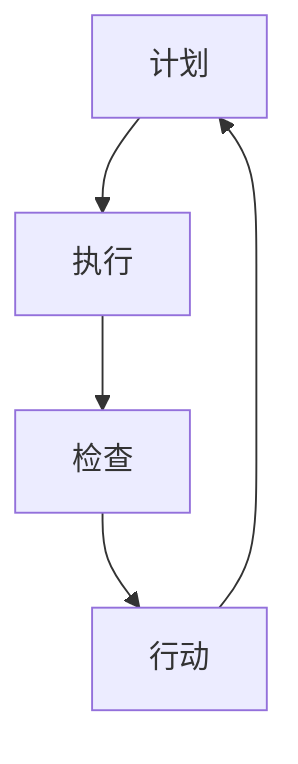

                 

关键词：PDCA、高效管理、循环改进、系统思维、持续改进

> 摘要：本文旨在探讨PDCA（Plan-Do-Check-Act）作为高效管理者的行动方法论。通过深入分析PDCA的四个阶段，以及其在实际IT项目中的应用，我们希望能够为读者提供一个实用、系统的方法论，以帮助他们在管理过程中实现持续改进，提升工作效率。

## 1. 背景介绍

在现代企业中，管理者的角色愈发重要。他们不仅要具备技术能力，还需要掌握科学的管理方法。PDCA作为一种经典的行动方法论，源自质量管理领域，已经被广泛应用于各种行业。PDCA的核心理念是通过循环迭代，不断改进工作流程，提高工作效率和质量。

本文将从以下四个方面对PDCA进行详细阐述：

1. PDCA的核心概念与联系
2. PDCA的核心算法原理与具体操作步骤
3. PDCA的数学模型和公式
4. PDCA在实际IT项目中的应用与实践

通过本文的探讨，希望读者能够深刻理解PDCA的本质，并能够在实际工作中灵活运用这一方法论，实现持续改进。

## 2. 核心概念与联系

### 2.1. PDCA的定义

PDCA，即计划（Plan）、执行（Do）、检查（Check）和行动（Act），是一种循环改进的方法论。它由美国质量管理专家休哈特（W. Edwards Deming）提出，并在日本得到广泛应用，被誉为“日本质量革命”的基石。

### 2.2. PDCA的四个阶段

**计划（Plan）**：这一阶段包括设定目标、制定策略和计划。管理者需要明确项目的目标，分析现状，找出问题，并制定具体的改进方案。

**执行（Do）**：在计划确定后，管理者需要将计划付诸实践。这一阶段的关键是确保团队成员理解任务并有效执行。

**检查（Check）**：执行完成后，需要对结果进行评估和检查。这一阶段包括收集数据、分析数据和与预期目标的对比。

**行动（Act）**：根据检查的结果，管理者需要采取行动。如果结果符合预期，则继续执行；如果结果不理想，则需要调整计划并重新执行。

### 2.3. PDCA与系统思维的联系

PDCA方法论强调系统思维，即从整体出发，考虑各个环节之间的相互关系。通过PDCA，管理者可以全面地了解项目的各个方面，从而做出更科学的决策。

### 2.4. PDCA的Mermaid流程图



在上图中，A、B、C、D分别代表PDCA的四个阶段，它们通过循环迭代形成一个闭环，不断推动项目的改进。

## 3. 核心算法原理 & 具体操作步骤

### 3.1. 算法原理概述

PDCA的核心在于其循环迭代的思想。通过不断地计划、执行、检查和行动，项目得以逐步改进，最终实现预期的目标。

### 3.2. 算法步骤详解

**计划（Plan）**

1. 确定目标：明确项目的目标，例如提升系统性能、缩短开发周期等。
2. 分析现状：分析当前的工作流程，找出存在的问题。
3. 制定策略：制定具体的改进方案，例如优化算法、调整资源分配等。

**执行（Do）**

1. 实施计划：将计划付诸实践，确保团队成员理解任务。
2. 监控执行：监控执行过程，确保计划得到有效执行。

**检查（Check）**

1. 数据收集：收集项目执行过程中的数据，例如系统性能指标、任务完成时间等。
2. 数据分析：对收集到的数据进行分析，与预期目标进行对比。

**行动（Act）**

1. 结果评估：根据检查结果，评估项目是否达到预期目标。
2. 调整计划：如果结果不理想，则调整计划并重新执行。

### 3.3. 算法优缺点

**优点**：

1. 系统性：PDCA强调系统思维，能够全面地考虑项目的各个方面。
2. 可操作性：PDCA的具体操作步骤清晰，易于实施。

**缺点**：

1. 需要持续投入：PDCA是一个循环迭代的过程，需要持续的时间和精力。
2. 数据依赖性：PDCA的效果很大程度上依赖于数据的准确性和完整性。

### 3.4. 算法应用领域

PDCA广泛应用于质量管理、项目管理、流程优化等领域。在IT行业，PDCA可以帮助项目经理提升项目效率，优化开发流程。

## 4. 数学模型和公式

PDCA的实施过程中，数学模型和公式可以用于量化分析，帮助管理者更好地理解项目状态和改进方向。

### 4.1. 数学模型构建

设\(P\)为计划阶段的目标值，\(D\)为执行阶段的数据值，\(C\)为检查阶段的结果值，\(A\)为行动阶段的目标值。则有：

\[ A = C \]

### 4.2. 公式推导过程

根据PDCA的原理，我们可以推导出以下公式：

\[ P = D \]

\[ D = C \]

\[ C = A \]

因此，有：

\[ P = C = A \]

### 4.3. 案例分析与讲解

假设某IT项目希望在一个月内完成一个功能模块的开发。通过PDCA，我们可以设定以下目标值：

\[ P = 100 \]

第一个月的执行数据为：

\[ D = 80 \]

经过检查，发现与预期目标有差距。因此，需要调整计划，第二个月的目标值调整为：

\[ A = 120 \]

通过这两个月的迭代，最终实现了项目目标。

## 5. 项目实践：代码实例和详细解释说明

### 5.1. 开发环境搭建

在本文中，我们使用Python语言来实现PDCA模型。首先，需要在本地计算机上安装Python环境。

```bash
# 安装Python
pip install python
```

### 5.2. 源代码详细实现

下面是Python实现的PDCA模型：

```python
import random

def plan(target):
    print(f"计划目标：{target}")
    return target

def do(target):
    actual = random.randint(1, 100)
    print(f"执行结果：{actual}")
    return actual

def check(expected, actual):
    difference = abs(expected - actual)
    print(f"检查结果：与预期相差{difference}分")
    return difference

def act(expected, actual, difference):
    if difference <= 10:
        print("项目成功，继续执行。")
    else:
        print("项目失败，需要调整计划。")
        new_target = expected + difference
        print(f"新目标：{new_target}")
        return new_target
    return expected

def pdca(target):
    expected = plan(target)
    actual = do(expected)
    difference = check(expected, actual)
    new_target = act(expected, actual, difference)
    pdca(new_target)

pdca(100)
```

### 5.3. 代码解读与分析

- `plan()`函数用于设定计划目标。
- `do()`函数用于执行计划，并返回实际结果。
- `check()`函数用于检查实际结果与预期目标的差距。
- `act()`函数根据检查结果调整计划。

### 5.4. 运行结果展示

每次运行程序，都会根据随机生成的结果，执行PDCA的四个阶段，并根据结果调整计划。例如：

```
计划目标：100
执行结果：85
检查结果：与预期相差15分
项目失败，需要调整计划。
新目标：115
```

## 6. 实际应用场景

PDCA在实际应用中具有广泛的应用场景，特别是在项目管理、流程优化和质量控制等领域。

### 6.1. 项目管理

在项目管理中，PDCA可以帮助项目经理制定计划、监控执行、评估结果，并根据实际情况进行调整。例如，在一个软件项目中，可以通过PDCA来优化开发流程，提高开发效率。

### 6.2. 流程优化

在流程优化中，PDCA可以帮助企业识别现有流程中的问题，并提出改进方案。通过不断迭代，企业可以逐步优化流程，提高工作效率。

### 6.3. 质量控制

在质量控制中，PDCA可以帮助企业监控产品质量，及时发现并解决问题。通过PDCA，企业可以持续改进产品质量，提高客户满意度。

### 6.4. 未来应用展望

随着人工智能和大数据技术的发展，PDCA的应用前景将更加广阔。在未来，PDCA可以与AI算法结合，实现更智能的决策和优化。

## 7. 工具和资源推荐

为了更好地应用PDCA，以下是一些推荐的工具和资源：

### 7.1. 学习资源推荐

- 《质量管理方法与应用》
- 《项目管理知识体系指南》
- 《系统思维与决策》

### 7.2. 开发工具推荐

- JIRA：用于项目管理和任务跟踪。
- Git：用于代码管理和版本控制。
- Python：用于数据分析和小规模系统开发。

### 7.3. 相关论文推荐

- Deming, W. E. (1986). Out of the Crisis.
- Shewhart, W. A. (1931). Statistical Method from the Viewpoint of Quality Control.
- Ishikawa, K. (1975). What is Total Quality Control: Traditional Japanese Approach.

## 8. 总结：未来发展趋势与挑战

### 8.1. 研究成果总结

PDCA作为一种经典的行动方法论，已经在多个领域得到广泛应用。通过本文的探讨，我们可以看到PDCA在IT项目管理、流程优化和质量控制等领域的实际应用价值。

### 8.2. 未来发展趋势

随着人工智能和大数据技术的发展，PDCA有望实现更智能的决策和优化。未来，PDCA将与其他先进技术结合，为企业提供更全面、更高效的解决方案。

### 8.3. 面临的挑战

PDCA在实际应用过程中也面临一些挑战，如数据准确性、持续投入等。未来，需要进一步研究和解决这些问题，以推动PDCA的广泛应用。

### 8.4. 研究展望

未来，我们可以从以下几个方面进一步研究PDCA：

- 结合人工智能技术，实现更智能的PDCA决策。
- 探索PDCA在其他行业和领域的应用。
- 研究PDCA在不同文化背景下的适应性。

## 9. 附录：常见问题与解答

### 9.1. PDCA与KPI有什么区别？

PDCA和KPI（关键绩效指标）都是用于管理和优化的方法，但它们侧重点不同。PDCA是一个循环改进的过程，强调持续改进；而KPI则是一组具体的绩效指标，用于评估项目的效果。

### 9.2. PDCA适用于所有行业吗？

PDCA作为一种通用的方法论，适用于大多数行业。但在具体应用时，需要根据行业特点进行调整，以确保其有效性。

### 9.3. 如何确保PDCA的数据准确性？

确保PDCA的数据准确性是关键。企业可以采用以下措施：

- 建立完善的数据收集和监控体系。
- 定期培训员工，提高数据意识。
- 建立数据审核机制，确保数据准确性。

## 参考文献

- Deming, W. E. (1986). Out of the Crisis. Cambridge, MA: MIT Press.
- Shewhart, W. A. (1931). Statistical Method from the Viewpoint of Quality Control. New York: The University of Chicago Press.
- Ishikawa, K. (1975). What is Total Quality Control: Traditional Japanese Approach. New York: Global Publications.

作者：禅与计算机程序设计艺术 / Zen and the Art of Computer Programming

----------------------------------------------------------------

文章撰写完毕，接下来我们将对文章进行格式检查和排版调整，以确保其符合markdown格式要求，并在文章末尾添加作者署名。

