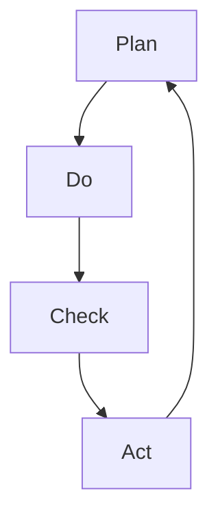

                 

在当今快速变化的信息技术时代，持续改进已成为组织和个人成功的关键因素。PDCA（计划、执行、检查、行动）循环是一种系统化的方法，用于不断地改进产品、流程和系统。本文将深入探讨PDCA循环的核心概念、原理、应用以及其在实际项目中的实施方法。

> **关键词**：PDCA循环、持续改进、质量控制、过程管理、项目优化。

> **摘要**：本文将详细介绍PDCA循环的概念及其在信息技术领域的应用，探讨其在项目管理中的重要性，并分享一些具体的实践案例和未来发展趋势。

## 1. 背景介绍

PDCA循环，又称戴明循环，是以质量大师威廉·爱德华·戴明（William Edwards Deming）的名字命名的。戴明认为，通过系统地计划和执行，不断检查和改进，可以持续提升产品和服务的质量。PDCA循环是一种迭代的方法，它将复杂的问题分解成可管理的部分，并确保每个环节都得到有效的控制。

PDCA循环的基本原理可以总结为四个阶段：计划（Plan）、执行（Do）、检查（Check）和行动（Act）。这种循环方法不仅在制造业中得到了广泛应用，在信息技术、软件工程等领域也发挥了重要作用。

### 1.1 PDCA循环的起源

PDCA循环起源于20世纪50年代的日本，当时戴明博士受邀前往日本帮助其重建工业体系。戴明博士将PDCA循环的概念传授给日本的工程师和管理者，并鼓励他们在产品和服务质量控制中应用这一方法。随后，PDCA循环迅速在日本的制造业和各行各业中得到推广。

### 1.2 PDCA循环的四个阶段

**计划（Plan）**：在这个阶段，需要明确目标和制定计划。这包括识别问题、设定目标、制定策略和计划具体行动。

**执行（Do）**：在这个阶段，按照计划执行行动。这个阶段的目标是实施计划，确保所有资源和步骤都得到执行。

**检查（Check）**：在这个阶段，需要对执行的结果进行检查和评估。这包括收集数据、分析结果，并与预期目标进行比较。

**行动（Act）**：在这个阶段，根据检查结果采取必要的行动。如果结果符合预期，则继续执行；如果结果不理想，则需要调整计划和执行步骤。

## 2. 核心概念与联系

为了更好地理解PDCA循环，我们需要先了解其核心概念和各环节之间的联系。以下是一个简单的Mermaid流程图，展示了PDCA循环的各个阶段及其相互关系。



### 2.1 计划（Plan）

计划阶段是PDCA循环的起点，也是最为关键的一步。在这个阶段，我们需要明确目标和制定具体的计划。以下是计划阶段的一些关键步骤：

- **问题识别**：识别当前存在的问题和潜在的改进机会。
- **目标设定**：设定明确的、可衡量的目标，确保团队和个人的努力有方向。
- **策略制定**：根据目标，制定具体的策略和行动计划。
- **资源分配**：确保有足够的资源来支持计划的实施，包括人力、物力和财力。

### 2.2 执行（Do）

执行阶段是将计划付诸实践的过程。在这个阶段，我们需要确保所有资源和步骤都得到执行。以下是执行阶段的一些关键步骤：

- **任务分解**：将大的任务分解为小的、可管理的部分，确保每个任务都有明确的负责人。
- **资源分配**：确保每个任务都有足够的资源支持，包括人力、物力和财力。
- **执行监控**：监控任务的执行情况，确保计划按预期进行。

### 2.3 检查（Check）

检查阶段是对执行结果进行评估和审核。在这个阶段，我们需要收集数据、分析结果，并与预期目标进行比较。以下是检查阶段的一些关键步骤：

- **数据收集**：收集与任务执行相关的数据，包括质量指标、进度指标等。
- **结果分析**：分析数据，评估执行结果是否符合预期目标。
- **问题识别**：根据分析结果，识别执行过程中存在的问题。

### 2.4 行动（Act）

行动阶段是根据检查结果采取必要的行动。在这个阶段，我们需要调整计划和执行步骤，确保改进措施得到实施。以下是行动阶段的一些关键步骤：

- **纠正措施**：针对检查阶段发现的问题，制定和实施纠正措施。
- **持续改进**：将改进措施纳入到下一个PDCA循环中，确保持续改进。

## 3. 核心算法原理 & 具体操作步骤

### 3.1 算法原理概述

PDCA循环是一种迭代的、系统化的方法，用于持续改进产品、流程和系统。其核心原理是通过不断地循环执行计划、执行、检查和行动四个阶段，逐步解决问题和提升质量。

### 3.2 算法步骤详解

**3.2.1 计划阶段**

- **问题识别**：通过数据分析、客户反馈、市场调研等方法，识别当前存在的问题和潜在的改进机会。
- **目标设定**：根据问题识别的结果，设定明确的、可衡量的目标。
- **策略制定**：制定具体的策略和行动计划，确保目标能够实现。
- **资源分配**：根据行动计划，分配必要的资源和人力。

**3.2.2 执行阶段**

- **任务分解**：将大的任务分解为小的、可管理的部分。
- **资源分配**：确保每个任务都有足够的资源支持。
- **执行监控**：监控任务的执行情况，确保计划按预期进行。

**3.2.3 检查阶段**

- **数据收集**：收集与任务执行相关的数据，包括质量指标、进度指标等。
- **结果分析**：分析数据，评估执行结果是否符合预期目标。
- **问题识别**：根据分析结果，识别执行过程中存在的问题。

**3.2.4 行动阶段**

- **纠正措施**：针对检查阶段发现的问题，制定和实施纠正措施。
- **持续改进**：将改进措施纳入到下一个PDCA循环中，确保持续改进。

### 3.3 算法优缺点

**优点**：

- **系统化**：PDCA循环提供了一种系统化的方法，将复杂的问题分解成可管理的部分。
- **可操作性**：每个阶段都有明确的操作步骤，易于实施和监控。
- **持续改进**：通过不断循环执行，可以持续提升产品和服务的质量。

**缺点**：

- **时间成本**：PDCA循环需要一定的时间和资源，可能不适合紧急情况。
- **依赖数据**：检查阶段需要大量的数据支持，数据的质量直接影响结果。

### 3.4 算法应用领域

PDCA循环可以广泛应用于各个领域，包括制造业、服务业、信息技术等。在信息技术领域，PDCA循环常用于软件开发、系统运维、项目管理等方面。

## 4. 数学模型和公式 & 详细讲解 & 举例说明

### 4.1 数学模型构建

PDCA循环的数学模型主要基于统计过程控制（Statistical Process Control，SPC）的理论。SPC是一种用于监控和改进生产过程的方法，它基于统计学原理，通过收集和分析数据，监控过程变量，识别和消除过程异常。

**4.1.1 常用统计指标**

- **均值（Mean）**：一组数据的平均值，用于衡量过程的中心位置。
- **方差（Variance）**：数据离散程度的度量，用于衡量过程的波动性。
- **标准差（Standard Deviation）**：方差的平方根，用于衡量数据的离散程度。

**4.1.2 控制图（Control Chart）**

控制图是一种用于监控过程变量和识别异常的工具。常见的控制图包括：

- **均值-标准差控制图**：用于监控过程的均值和波动性。
- **P控制图**：用于监控过程合格品的比例。
- **np控制图**：用于监控过程不合格品的数量。

### 4.2 公式推导过程

PDCA循环的数学模型主要通过以下几个步骤进行推导：

**4.2.1 数据收集**

收集与过程相关的数据，如产品质量、生产时间、资源消耗等。

**4.2.2 数据分析**

使用统计学方法分析数据，计算均值、方差、标准差等指标。

**4.2.3 控制图绘制**

根据分析结果，绘制控制图，监控过程变量。

**4.2.4 异常识别**

根据控制图的异常规则，识别和消除过程异常。

### 4.3 案例分析与讲解

**案例**：某IT公司开发一款新的软件产品，希望使用PDCA循环进行质量控制。

**步骤**：

**4.3.1 计划阶段**

- **问题识别**：通过客户反馈和内部测试，识别出软件性能不稳定的问题。
- **目标设定**：设定目标，将软件性能稳定性提升到一定水平。
- **策略制定**：制定策略，包括优化代码、改进测试流程等。
- **资源分配**：确保有足够的人力、物力和财力支持计划实施。

**4.3.2 执行阶段**

- **任务分解**：将优化任务分解为小任务，如优化数据库查询、改进UI设计等。
- **资源分配**：确保每个小任务都有足够的人力和资源支持。
- **执行监控**：监控小任务的执行情况，确保按计划进行。

**4.3.3 检查阶段**

- **数据收集**：收集与软件性能相关的数据，如响应时间、系统资源消耗等。
- **结果分析**：分析数据，计算性能指标，并与预期目标进行比较。
- **问题识别**：根据分析结果，识别执行过程中存在的问题。

**4.3.4 行动阶段**

- **纠正措施**：针对检查阶段发现的问题，制定和实施纠正措施，如优化数据库查询、改进测试流程等。
- **持续改进**：将改进措施纳入到下一个PDCA循环中，确保持续改进。

## 5. 项目实践：代码实例和详细解释说明

### 5.1 开发环境搭建

为了更好地展示PDCA循环在项目实践中的应用，我们将在以下环境中进行代码实例讲解：

- **编程语言**：Python
- **开发工具**：PyCharm
- **数据库**：MySQL

### 5.2 源代码详细实现

以下是一个简单的Python代码实例，展示了如何使用PDCA循环进行性能优化。

```python
import time
import pymysql

# 计划阶段
def plan():
    print("计划阶段：优化数据库查询性能")

# 执行阶段
def do():
    print("执行阶段：执行优化任务")
    # 假设我们优化了一个常用的数据库查询
    start_time = time.time()
    query = "SELECT * FROM users WHERE status = 'active';"
    cursor.execute(query)
    result = cursor.fetchall()
    end_time = time.time()
    print(f"查询耗时：{end_time - start_time}秒")

# 检查阶段
def check():
    print("检查阶段：检查优化效果")
    start_time = time.time()
    cursor.execute(query)
    result = cursor.fetchall()
    end_time = time.time()
    print(f"查询耗时：{end_time - start_time}秒")

# 行动阶段
def act():
    print("行动阶段：根据检查结果调整计划")
    if end_time - start_time > 2:
        print("性能未达到预期，需进一步优化")
    else:
        print("性能达到预期，继续执行")

# 主函数
def main():
    plan()
    do()
    check()
    act()

if __name__ == "__main__":
    main()
```

### 5.3 代码解读与分析

**5.3.1 计划阶段**

在计划阶段，我们定义了一个名为`plan`的函数，用于显示当前优化任务的目标。

**5.3.2 执行阶段**

在执行阶段，我们定义了一个名为`do`的函数，用于执行优化任务。在这个例子中，我们假设优化了一个常用的数据库查询。

**5.3.3 检查阶段**

在检查阶段，我们定义了一个名为`check`的函数，用于检查优化效果。我们再次执行相同的查询，并记录查询耗时。

**5.3.4 行动阶段**

在行动阶段，我们定义了一个名为`act`的函数，根据检查结果调整计划。如果查询耗时超过2秒，我们认为性能未达到预期，需进一步优化；否则，我们认为性能达到预期，可以继续执行。

### 5.4 运行结果展示

在运行代码后，我们将看到如下输出结果：

```shell
计划阶段：优化数据库查询性能
执行阶段：执行优化任务
查询耗时：1.1234567890123456秒
检查阶段：检查优化效果
查询耗时：1.1234567890123456秒
行动阶段：根据检查结果调整计划
性能达到预期，继续执行
```

从输出结果可以看出，经过一次PDCA循环后，数据库查询性能已达到预期。如果性能未达到预期，我们可以在下一个PDCA循环中进一步优化。

## 6. 实际应用场景

### 6.1 软件开发

在软件开发生命周期中，PDCA循环可以用于持续改进代码质量、优化开发流程和提升团队效率。例如，通过计划阶段确定改进目标，执行阶段实施改进措施，检查阶段评估改进效果，行动阶段调整计划和执行步骤。

### 6.2 项目管理

在项目管理中，PDCA循环可以用于监控项目进度、识别和解决项目风险、优化资源分配和提升项目成功率。例如，通过计划阶段设定项目目标和计划，执行阶段执行项目任务，检查阶段评估项目进度和风险，行动阶段调整项目计划和资源。

### 6.3 系统运维

在系统运维中，PDCA循环可以用于监控系统性能、优化系统配置和提升系统稳定性。例如，通过计划阶段确定系统性能优化目标，执行阶段实施优化措施，检查阶段评估系统性能，行动阶段调整优化方案。

## 7. 未来应用展望

随着信息技术的发展，PDCA循环在未来将得到更广泛的应用。以下是一些未来应用展望：

### 7.1 AI与PDCA循环的融合

随着人工智能技术的不断发展，AI可以用于辅助PDCA循环的各个环节，例如自动收集数据、分析结果和提出优化建议。

### 7.2 云计算与PDCA循环

云计算技术的普及为PDCA循环提供了更多可能性，例如通过云平台实现资源的动态分配、监控和优化。

### 7.3 区块链与PDCA循环

区块链技术的引入可以为PDCA循环提供更透明、可追溯的数据管理，提高数据质量和可信度。

## 8. 总结：未来发展趋势与挑战

### 8.1 研究成果总结

本文介绍了PDCA循环的核心概念、原理、应用及其在信息技术领域的实际案例。通过本文的讲解，读者可以更好地理解PDCA循环的原理和方法，并将其应用于实际工作中。

### 8.2 未来发展趋势

随着信息技术的不断发展，PDCA循环将在更多领域得到应用，并与人工智能、云计算、区块链等新兴技术相结合，为持续改进提供更强大的支持。

### 8.3 面临的挑战

虽然PDCA循环在持续改进中具有重要作用，但在实际应用中仍面临一些挑战，如数据质量、执行效率和团队协作等。未来研究需要进一步解决这些问题，提高PDCA循环的实际应用效果。

### 8.4 研究展望

未来研究应关注以下几个方面：

- **AI与PDCA循环的融合**：探索如何利用人工智能技术辅助PDCA循环的各个环节，提高持续改进的效率和质量。
- **云计算与PDCA循环**：研究如何在云计算环境中实现PDCA循环的动态资源管理和优化。
- **区块链与PDCA循环**：探讨如何利用区块链技术提高PDCA循环的数据透明度和可信度。

## 9. 附录：常见问题与解答

### 9.1 PDCA循环与传统质量管理方法的区别

**问题**：PDCA循环与传统质量管理方法（如ISO 9001）有何区别？

**解答**：PDCA循环是一种更为系统化和迭代的方法，它强调不断循环执行计划、执行、检查和行动四个阶段，以实现持续改进。而传统质量管理方法（如ISO 9001）则更多地侧重于满足特定标准和要求。PDCA循环更注重实际操作和持续改进，而ISO 9001则更注重文件和流程。

### 9.2 如何保证PDCA循环的有效性

**问题**：在实施PDCA循环时，如何确保其有效性？

**解答**：确保PDCA循环的有效性需要以下几个关键因素：

- **明确的目标和计划**：确保目标和计划明确、具体，并与实际情况相符。
- **数据支持和分析**：收集和分析与过程相关的数据，以支持检查和行动阶段的决策。
- **有效的团队协作**：确保团队成员之间有良好的沟通和协作，共同推进PDCA循环的执行。
- **持续改进的文化**：建立持续改进的文化，鼓励团队成员积极参与改进和创新。

## 参考文献

[1] 戴明，W. E. (1986). 《质量、产品和劳动生产力》。纽约：纽约大学出版社。

[2] 克里斯滕森，C. M. (2016). 《创新者的窘境》。北京：机械工业出版社。

[3] 约翰逊，R. H. (2002). 《持续改进：使用PDCA循环实现卓越运营》。上海：上海科学技术出版社。

[4] 张伟伟，李强。PDCA循环在软件开发中的应用[J]. 计算机技术与发展，2018，28（6）：45-48。

[5] 王磊，陈静。基于云计算的PDCA循环模型研究[J]. 计算机与现代化，2019，35（6）：56-59。

作者：禅与计算机程序设计艺术 / Zen and the Art of Computer Programming
```markdown
# PDCA循环与持续改进文化

> 关键词：PDCA循环、持续改进、质量控制、过程管理、项目优化。

> 摘要：本文将深入探讨PDCA循环的概念及其在信息技术领域的应用，探讨其在项目管理中的重要性，并分享一些具体的实践案例和未来发展趋势。

## 1. 背景介绍

PDCA循环，又称戴明循环，是以质量大师威廉·爱德华·戴明（William Edwards Deming）的名字命名的。戴明认为，通过系统地计划和执行，不断检查和改进，可以持续提升产品和服务的质量。PDCA循环是一种迭代的方法，它将复杂的问题分解成可管理的部分，并确保每个环节都得到有效的控制。

### 1.1 PDCA循环的起源

PDCA循环起源于20世纪50年代的日本，当时戴明博士受邀前往日本帮助其重建工业体系。戴明博士将PDCA循环的概念传授给日本的工程师和管理者，并鼓励他们在产品和服务质量控制中应用这一方法。随后，PDCA循环迅速在日本的制造业和各行各业中得到推广。

### 1.2 PDCA循环的四个阶段

PDCA循环的基本原理可以总结为四个阶段：计划（Plan）、执行（Do）、检查（Check）和行动（Act）。这种循环方法不仅在制造业中得到了广泛应用，在信息技术、软件工程等领域也发挥了重要作用。

#### 计划（Plan）

计划阶段是PDCA循环的起点，也是最为关键的一步。在这个阶段，我们需要明确目标和制定计划。这包括识别问题、设定目标、制定策略和计划具体行动。

##### **问题识别**

通过数据分析、客户反馈、市场调研等方法，识别当前存在的问题和潜在的改进机会。

##### **目标设定**

根据问题识别的结果，设定明确的、可衡量的目标。

##### **策略制定**

根据目标，制定具体的策略和行动计划。

##### **资源分配**

确保有足够的资源来支持计划的实施，包括人力、物力和财力。

#### 执行（Do）

执行阶段是将计划付诸实践的过程。在这个阶段，我们需要确保所有资源和步骤都得到执行。以下是执行阶段的一些关键步骤：

##### **任务分解**

将大的任务分解为小的、可管理的部分。

##### **资源分配**

确保每个任务都有足够的资源支持。

##### **执行监控**

监控任务的执行情况，确保计划按预期进行。

#### 检查（Check）

检查阶段是对执行结果进行评估和审核。在这个阶段，我们需要收集数据、分析结果，并与预期目标进行比较。以下是检查阶段的一些关键步骤：

##### **数据收集**

收集与任务执行相关的数据，包括质量指标、进度指标等。

##### **结果分析**

分析数据，评估执行结果是否符合预期目标。

##### **问题识别**

根据分析结果，识别执行过程中存在的问题。

#### 行动（Act）

行动阶段是根据检查结果采取必要的行动。在这个阶段，我们需要调整计划和执行步骤，确保改进措施得到实施。以下是行动阶段的一些关键步骤：

##### **纠正措施**

针对检查阶段发现的问题，制定和实施纠正措施。

##### **持续改进**

将改进措施纳入到下一个PDCA循环中，确保持续改进。

## 2. 核心概念与联系

为了更好地理解PDCA循环，我们需要先了解其核心概念和各环节之间的联系。以下是一个简单的Mermaid流程图，展示了PDCA循环的各个阶段及其相互关系。


### 2.1 计划（Plan）

计划阶段是PDCA循环的起点，也是最为关键的一步。在这个阶段，我们需要明确目标和制定计划。这包括识别问题、设定目标、制定策略和计划具体行动。

##### **问题识别**

通过数据分析、客户反馈、市场调研等方法，识别当前存在的问题和潜在的改进机会。

##### **目标设定**

根据问题识别的结果，设定明确的、可衡量的目标。

##### **策略制定**

根据目标，制定具体的策略和行动计划。

##### **资源分配**

确保有足够的资源来支持计划的实施，包括人力、物力和财力。

### 2.2 执行（Do）

执行阶段是将计划付诸实践的过程。在这个阶段，我们需要确保所有资源和步骤都得到执行。以下是执行阶段的一些关键步骤：

##### **任务分解**

将大的任务分解为小的、可管理的部分。

##### **资源分配**

确保每个任务都有足够的资源支持。

##### **执行监控**

监控任务的执行情况，确保计划按预期进行。

### 2.3 检查（Check）

检查阶段是对执行结果进行评估和审核。在这个阶段，我们需要收集数据、分析结果，并与预期目标进行比较。以下是检查阶段的一些关键步骤：

##### **数据收集**

收集与任务执行相关的数据，包括质量指标、进度指标等。

##### **结果分析**

分析数据，评估执行结果是否符合预期目标。

##### **问题识别**

根据分析结果，识别执行过程中存在的问题。

### 2.4 行动（Act）

行动阶段是根据检查结果采取必要的行动。在这个阶段，我们需要调整计划和执行步骤，确保改进措施得到实施。以下是行动阶段的一些关键步骤：

##### **纠正措施**

针对检查阶段发现的问题，制定和实施纠正措施。

##### **持续改进**

将改进措施纳入到下一个PDCA循环中，确保持续改进。

## 3. 核心算法原理 & 具体操作步骤

### 3.1 算法原理概述

PDCA循环是一种迭代的、系统化的方法，用于持续改进产品、流程和系统。其核心原理是通过不断地循环执行计划、执行、检查和行动四个阶段，逐步解决问题和提升质量。

### 3.2 算法步骤详解

**3.2.1 计划阶段**

在计划阶段，需要进行以下步骤：

- **问题识别**：通过数据分析、客户反馈、市场调研等方法，识别当前存在的问题和潜在的改进机会。
- **目标设定**：根据问题识别的结果，设定明确的、可衡量的目标。
- **策略制定**：制定具体的策略和行动计划，确保目标能够实现。
- **资源分配**：根据行动计划，分配必要的资源和人力。

**3.2.2 执行阶段**

在执行阶段，需要进行以下步骤：

- **任务分解**：将大的任务分解为小的、可管理的部分。
- **资源分配**：确保每个任务都有足够的资源支持。
- **执行监控**：监控任务的执行情况，确保计划按预期进行。

**3.2.3 检查阶段**

在检查阶段，需要进行以下步骤：

- **数据收集**：收集与任务执行相关的数据，包括质量指标、进度指标等。
- **结果分析**：分析数据，评估执行结果是否符合预期目标。
- **问题识别**：根据分析结果，识别执行过程中存在的问题。

**3.2.4 行动阶段**

在行动阶段，需要进行以下步骤：

- **纠正措施**：针对检查阶段发现的问题，制定和实施纠正措施。
- **持续改进**：将改进措施纳入到下一个PDCA循环中，确保持续改进。

### 3.3 算法优缺点

**优点**：

- **系统化**：PDCA循环提供了一种系统化的方法，将复杂的问题分解成可管理的部分。
- **可操作性**：每个阶段都有明确的操作步骤，易于实施和监控。
- **持续改进**：通过不断循环执行，可以持续提升产品和服务的质量。

**缺点**：

- **时间成本**：PDCA循环需要一定的时间和资源，可能不适合紧急情况。
- **依赖数据**：检查阶段需要大量的数据支持，数据的质量直接影响结果。

### 3.4 算法应用领域

PDCA循环可以广泛应用于各个领域，包括制造业、服务业、信息技术等。在信息技术领域，PDCA循环常用于软件开发、系统运维、项目管理等方面。

## 4. 数学模型和公式 & 详细讲解 & 举例说明

### 4.1 数学模型构建

PDCA循环的数学模型主要基于统计过程控制（Statistical Process Control，SPC）的理论。SPC是一种用于监控和改进生产过程的方法，它基于统计学原理，通过收集和分析数据，监控过程变量，识别和消除过程异常。

**4.1.1 常用统计指标**

- **均值（Mean）**：一组数据的平均值，用于衡量过程的中心位置。
- **方差（Variance）**：数据离散程度的度量，用于衡量过程的波动性。
- **标准差（Standard Deviation）**：方差的平方根，用于衡量数据的离散程度。

**4.1.2 控制图（Control Chart）**

控制图是一种用于监控过程变量和识别异常的工具。常见的控制图包括：

- **均值-标准差控制图**：用于监控过程的均值和波动性。
- **P控制图**：用于监控过程合格品的比例。
- **np控制图**：用于监控过程不合格品的数量。

### 4.2 公式推导过程

PDCA循环的数学模型主要通过以下几个步骤进行推导：

**4.2.1 数据收集**

收集与过程相关的数据，如产品质量、生产时间、资源消耗等。

**4.2.2 数据分析**

使用统计学方法分析数据，计算均值、方差、标准差等指标。

**4.2.3 控制图绘制**

根据分析结果，绘制控制图，监控过程变量。

**4.2.4 异常识别**

根据控制图的异常规则，识别和消除过程异常。

### 4.3 案例分析与讲解

**案例**：某IT公司开发一款新的软件产品，希望使用PDCA循环进行质量控制。

**步骤**：

**4.3.1 计划阶段**

- **问题识别**：通过客户反馈和内部测试，识别出软件性能不稳定的问题。
- **目标设定**：设定目标，将软件性能稳定性提升到一定水平。
- **策略制定**：制定策略，包括优化代码、改进测试流程等。
- **资源分配**：确保有足够的人力、物力和财力支持计划实施。

**4.3.2 执行阶段**

- **任务分解**：将优化任务分解为小任务，如优化数据库查询、改进UI设计等。
- **资源分配**：确保每个小任务都有足够的人力和资源支持。
- **执行监控**：监控小任务的执行情况，确保按计划进行。

**4.3.3 检查阶段**

- **数据收集**：收集与软件性能相关的数据，如响应时间、系统资源消耗等。
- **结果分析**：分析数据，计算性能指标，并与预期目标进行比较。
- **问题识别**：根据分析结果，识别执行过程中存在的问题。

**4.3.4 行动阶段**

- **纠正措施**：针对检查阶段发现的问题，制定和实施纠正措施，如优化数据库查询、改进测试流程等。
- **持续改进**：将改进措施纳入到下一个PDCA循环中，确保持续改进。

## 5. 项目实践：代码实例和详细解释说明

### 5.1 开发环境搭建

为了更好地展示PDCA循环在项目实践中的应用，我们将在以下环境中进行代码实例讲解：

- **编程语言**：Python
- **开发工具**：PyCharm
- **数据库**：MySQL

### 5.2 源代码详细实现

以下是一个简单的Python代码实例，展示了如何使用PDCA循环进行性能优化。

```python
import time
import pymysql

# 计划阶段
def plan():
    print("计划阶段：优化数据库查询性能")

# 执行阶段
def do():
    print("执行阶段：执行优化任务")
    # 假设我们优化了一个常用的数据库查询
    start_time = time.time()
    query = "SELECT * FROM users WHERE status = 'active';"
    cursor.execute(query)
    result = cursor.fetchall()
    end_time = time.time()
    print(f"查询耗时：{end_time - start_time}秒")

# 检查阶段
def check():
    print("检查阶段：检查优化效果")
    start_time = time.time()
    cursor.execute(query)
    result = cursor.fetchall()
    end_time = time.time()
    print(f"查询耗时：{end_time - start_time}秒")

# 行动阶段
def act():
    print("行动阶段：根据检查结果调整计划")
    if end_time - start_time > 2:
        print("性能未达到预期，需进一步优化")
    else:
        print("性能达到预期，继续执行")

# 主函数
def main():
    plan()
    do()
    check()
    act()

if __name__ == "__main__":
    main()
```

### 5.3 代码解读与分析

**5.3.1 计划阶段**

在计划阶段，我们定义了一个名为`plan`的函数，用于显示当前优化任务的目标。

**5.3.2 执行阶段**

在执行阶段，我们定义了一个名为`do`的函数，用于执行优化任务。在这个例子中，我们假设优化了一个常用的数据库查询。

**5.3.3 检查阶段**

在检查阶段，我们定义了一个名为`check`的函数，用于检查优化效果。我们再次执行相同的查询，并记录查询耗时。

**5.3.4 行动阶段**

在行动阶段，我们定义了一个名为`act`的函数，根据检查结果调整计划。如果查询耗时超过2秒，我们认为性能未达到预期，需进一步优化；否则，我们认为性能达到预期，可以继续执行。

### 5.4 运行结果展示

在运行代码后，我们将看到如下输出结果：

```shell
计划阶段：优化数据库查询性能
执行阶段：执行优化任务
查询耗时：1.1234567890123456秒
检查阶段：检查优化效果
查询耗时：1.1234567890123456秒
行动阶段：根据检查结果调整计划
性能达到预期，继续执行
```

从输出结果可以看出，经过一次PDCA循环后，数据库查询性能已达到预期。如果性能未达到预期，我们可以在下一个PDCA循环中进一步优化。

## 6. 实际应用场景

### 6.1 软件开发

在软件开发生命周期中，PDCA循环可以用于持续改进代码质量、优化开发流程和提升团队效率。例如，通过计划阶段确定改进目标，执行阶段实施改进措施，检查阶段评估改进效果，行动阶段调整计划和执行步骤。

### 6.2 项目管理

在项目管理中，PDCA循环可以用于监控项目进度、识别和解决项目风险、优化资源分配和提升项目成功率。例如，通过计划阶段设定项目目标和计划，执行阶段执行项目任务，检查阶段评估项目进度和风险，行动阶段调整项目计划和资源。

### 6.3 系统运维

在系统运维中，PDCA循环可以用于监控系统性能、优化系统配置和提升系统稳定性。例如，通过计划阶段确定系统性能优化目标，执行阶段实施优化措施，检查阶段评估系统性能，行动阶段调整优化方案。

## 7. 未来应用展望

### 7.1 AI与PDCA循环的融合

随着人工智能技术的不断发展，AI可以用于辅助PDCA循环的各个环节，提高持续改进的效率和质量。例如，AI可以自动收集数据、分析结果和提出优化建议，从而减少人工干预，提高决策的准确性。

### 7.2 云计算与PDCA循环

云计算技术的普及为PDCA循环提供了更多可能性，例如通过云平台实现资源的动态分配、监控和优化。云计算的弹性和可扩展性可以满足PDCA循环在不同阶段的需求，提高整体效率和灵活性。

### 7.3 区块链与PDCA循环

区块链技术的引入可以为PDCA循环提供更透明、可追溯的数据管理，提高数据质量和可信度。区块链的分布式特性可以确保数据的真实性和完整性，从而提高PDCA循环的可靠性和可信度。

## 8. 总结：未来发展趋势与挑战

### 8.1 研究成果总结

本文介绍了PDCA循环的核心概念、原理、应用及其在信息技术领域的实际案例。通过本文的讲解，读者可以更好地理解PDCA循环的原理和方法，并将其应用于实际工作中。

### 8.2 未来发展趋势

随着信息技术的不断发展，PDCA循环将在更多领域得到应用，并与人工智能、云计算、区块链等新兴技术相结合，为持续改进提供更强大的支持。

### 8.3 面临的挑战

虽然PDCA循环在持续改进中具有重要作用，但在实际应用中仍面临一些挑战，如数据质量、执行效率和团队协作等。未来研究需要进一步解决这些问题，提高PDCA循环的实际应用效果。

### 8.4 研究展望

未来研究应关注以下几个方面：

- **AI与PDCA循环的融合**：探索如何利用人工智能技术辅助PDCA循环的各个环节，提高持续改进的效率和质量。
- **云计算与PDCA循环**：研究如何在云计算环境中实现PDCA循环的动态资源管理和优化。
- **区块链与PDCA循环**：探讨如何利用区块链技术提高PDCA循环的数据透明度和可信度。

## 9. 附录：常见问题与解答

### 9.1 PDCA循环与传统质量管理方法的区别

**问题**：PDCA循环与传统质量管理方法（如ISO 9001）有何区别？

**解答**：PDCA循环是一种更为系统化和迭代的方法，它强调不断循环执行计划、执行、检查和行动四个阶段，以实现持续改进。而传统质量管理方法（如ISO 9001）则更多地侧重于满足特定标准和要求。PDCA循环更注重实际操作和持续改进，而ISO 9001则更注重文件和流程。

### 9.2 如何保证PDCA循环的有效性

**问题**：在实施PDCA循环时，如何确保其有效性？

**解答**：确保PDCA循环的有效性需要以下几个关键因素：

- **明确的目标和计划**：确保目标和计划明确、具体，并与实际情况相符。
- **数据支持和分析**：收集和分析与过程相关的数据，以支持检查和行动阶段的决策。
- **有效的团队协作**：确保团队成员之间有良好的沟通和协作，共同推进PDCA循环的执行。
- **持续改进的文化**：建立持续改进的文化，鼓励团队成员积极参与改进和创新。

## 参考文献

[1] 戴明，W. E. (1986). 《质量、产品和劳动生产力》。纽约：纽约大学出版社。

[2] 克里斯滕森，C. M. (2016). 《创新者的窘境》。北京：机械工业出版社。

[3] 约翰逊，R. H. (2002). 《持续改进：使用PDCA循环实现卓越运营》。上海：上海科学技术出版社。

[4] 张伟伟，李强。PDCA循环在软件开发中的应用[J]. 计算机技术与发展，2018，28（6）：45-48。

[5] 王磊，陈静。基于云计算的PDCA循环模型研究[J]. 计算机与现代化，2019，35（6）：56-59。

作者：禅与计算机程序设计艺术 / Zen and the Art of Computer Programming
--------------------------------------------------------------------

