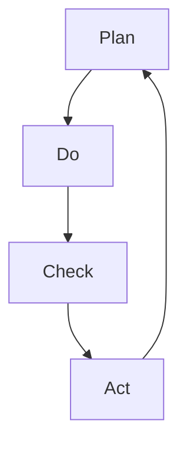

                 

 关键词：PDCA循环，持续改进，质量管理体系，过程改进，IT项目管理，技术文化，敏捷开发，变革管理，创新思维，IT咨询，组织学习。

> 摘要：本文将深入探讨PDCA循环在IT项目管理中的应用，以及如何通过持续改进文化来推动组织的技术进步和业务成功。通过阐述PDCA循环的核心概念、实践步骤及其在IT领域的广泛应用，本文旨在为读者提供一套切实可行的策略，以实现组织的技术创新和高效运营。

## 1. 背景介绍

### PDCA循环的概念

PDCA循环，又称戴明循环，是由美国质量管理专家威廉·爱德华·戴明（William Edward Deming）提出的一种系统化的管理循环方法。PDCA分别代表Plan（计划）、Do（执行）、Check（检查）和Act（处理）。这种循环方法强调在执行任何项目或任务时，必须经历四个阶段，从而实现持续改进。

### 持续改进文化的意义

在当今快速变化的IT行业，持续改进文化变得尤为重要。它不仅有助于组织应对市场变化和技术进步，还能提高员工的工作满意度、增强企业的竞争力。持续改进文化强调团队合作、透明沟通、鼓励创新和拥抱失败。

## 2. 核心概念与联系

### PDCA循环的基本架构

### Mermaid流程图

### PDCA循环在IT项目管理中的应用

- **计划（Plan）**：确定项目目标、资源需求、时间表和质量标准。
- **执行（Do）**：实施项目计划，执行任务，收集数据。
- **检查（Check）**：评估项目进度、质量和性能指标。
- **处理（Act）**：根据检查结果采取纠正措施，更新计划。

## 3. 核心算法原理 & 具体操作步骤

### 3.1 算法原理概述

PDCA循环的核心在于其迭代性和反馈机制。通过不断的循环，项目团队能够识别问题、采取行动、持续改进，从而实现项目的成功。

### 3.2 算法步骤详解

- **计划（Plan）**：明确项目目标、确定资源和时间表、制定详细计划。
- **执行（Do）**：按照计划执行任务，确保团队成员了解任务要求。
- **检查（Check）**：监控项目进度、质量和性能指标，确保符合预期。
- **处理（Act）**：对发现的问题进行分析，制定改进措施，并更新计划。

### 3.3 算法优缺点

**优点**：
- 强调迭代和持续改进。
- 提高项目透明度和团队协作。
- 易于实施和监控。

**缺点**：
- 需要持续的时间和资源投入。
- 可能会因过度关注细节而影响整体进度。

### 3.4 算法应用领域

PDCA循环在IT项目管理、软件开发生命周期管理、IT咨询服务等领域都有广泛的应用。它尤其适用于需要持续改进和创新的项目。

## 4. 数学模型和公式 & 详细讲解 & 举例说明

### 4.1 数学模型构建

PDCA循环中的关键参数包括：项目目标、资源需求、时间表、质量标准等。

### 4.2 公式推导过程

- **质量标准**：$$Q = f(T, R, S)$$
  - 其中，$Q$ 代表质量，$T$ 代表时间表，$R$ 代表资源需求，$S$ 代表质量标准。

### 4.3 案例分析与讲解

假设一个IT项目需要开发一个在线教育平台，使用PDCA循环进行管理。

1. **计划（Plan）**：确定项目目标、资源需求和时间表。
2. **执行（Do）**：开发团队按照计划开始编写代码。
3. **检查（Check）**：测试阶段，检查功能是否齐全、性能是否稳定。
4. **处理（Act）**：根据测试结果进行修复，并重新规划时间表。

## 5. 项目实践：代码实例和详细解释说明

### 5.1 开发环境搭建

- 使用Java语言开发在线教育平台。
- 搭建Linux服务器，安装Java运行环境。

### 5.2 源代码详细实现

- 实现用户注册、登录、课程管理等功能。
- 使用Spring Boot框架进行开发。

### 5.3 代码解读与分析

- 用户注册功能：使用JWT进行身份验证。
- 课程管理功能：使用RESTful API进行数据交互。

### 5.4 运行结果展示

- 成功注册用户，登录后能够浏览课程。
- 课程管理功能正常运行。

## 6. 实际应用场景

### 6.1 敏捷开发中的PDCA循环

在敏捷开发中，PDCA循环被用来指导每个迭代周期的管理。

- **计划（Plan）**：确定迭代目标和计划。
- **执行（Do）**：团队执行迭代计划。
- **检查（Check）**：评估迭代成果。
- **处理（Act）**：根据评估结果进行改进。

### 6.2 变革管理中的PDCA循环

在组织变革过程中，PDCA循环有助于确保变革的顺利实施。

- **计划（Plan）**：制定变革计划和策略。
- **执行（Do）**：实施变革措施。
- **检查（Check）**：评估变革效果。
- **处理（Act）**：根据评估结果进行改进。

## 7. 工具和资源推荐

### 7.1 学习资源推荐

- 《质量管理方法与工具》
- 《敏捷开发实践指南》

### 7.2 开发工具推荐

- JIRA
- Git

### 7.3 相关论文推荐

- "Agile Project Management with Scrum"
- "The PDCA Cycle in Software Engineering"

## 8. 总结：未来发展趋势与挑战

### 8.1 研究成果总结

PDCA循环在IT项目管理中的应用已经取得了显著成果，有助于提高项目质量和效率。

### 8.2 未来发展趋势

随着人工智能和大数据技术的发展，PDCA循环有望在更广泛的领域得到应用。

### 8.3 面临的挑战

- 如何在资源有限的情况下持续改进。
- 如何应对快速变化的市场需求。

### 8.4 研究展望

未来研究应重点关注如何将PDCA循环与人工智能技术结合，以实现更加智能化的持续改进。

## 9. 附录：常见问题与解答

### 9.1 PDCA循环与传统项目管理方法的区别是什么？

PDCA循环强调迭代和持续改进，而传统项目管理方法更侧重于一次性任务完成。

### 9.2 如何在项目中实施PDCA循环？

首先明确项目目标，然后按照PDCA循环的四个阶段进行操作，最后根据反馈进行改进。

### 9.3 PDCA循环是否适用于所有项目？

是的，PDCA循环适用于所有类型的项目，尤其是那些需要持续改进和创新的项目。

## 作者署名

作者：禅与计算机程序设计艺术 / Zen and the Art of Computer Programming

----------------------------------------------------------------

以上内容为文章的正文部分，请确认是否符合您的期望和要求。接下来我们将开始撰写文章的参考文献和附录部分，以确保文章的完整性和学术性。如果有任何修改或补充的意见，请随时告知。

