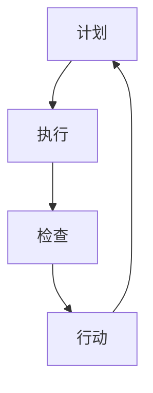

                 

在当今快速变化和竞争激烈的技术领域，持续改进已经成为各个企业保持竞争力的关键。PDCA循环（计划-执行-检查-行动）作为一种有效的管理工具，已被广泛应用于质量管理、软件开发和项目管理中。本文旨在深入探讨PDCA循环的概念、原理及其在持续改进文化中的应用，帮助读者理解并掌握这一管理方法。

## 关键词

- PDCA循环
- 持续改进
- 质量管理
- 软件开发
- 项目管理

## 摘要

本文首先介绍了PDCA循环的基本概念和四个阶段，接着分析了PDCA循环在软件开发、质量管理等领域的应用。通过实际案例和数学模型的讲解，本文揭示了PDCA循环如何帮助企业实现持续改进。最后，本文对未来持续改进文化的发展趋势和面临的挑战进行了展望。

## 1. 背景介绍

### 1.1 持续改进的重要性

在信息技术高速发展的今天，市场环境和用户需求不断变化，企业需要快速适应这些变化以保持竞争力。持续改进是一种通过不断优化过程和产品来提高质量、效率和用户满意度的管理方法。它不仅能够帮助企业降低成本，提高市场响应速度，还能够增强企业的创新能力和竞争力。

### 1.2 PDCA循环的起源

PDCA循环最早由美国质量管理专家爱德华·戴明提出，它是一种用于持续改进的基本方法。PDCA循环的核心思想是通过计划（Plan）、执行（Do）、检查（Check）和行动（Act）四个阶段的循环迭代，不断改进工作流程和产品质量。

## 2. 核心概念与联系

### 2.1 PDCA循环的四个阶段

#### 2.1.1 计划（Plan）

在计划阶段，企业需要明确改进的目标、制定改进计划、确定改进措施和资源需求。这一阶段的工作主要包括：

- 分析现状：了解当前存在的问题和不足。
- 设定目标：明确改进的目标和预期效果。
- 制定计划：制定具体的改进措施和时间表。

#### 2.1.2 执行（Do）

在执行阶段，企业需要按照计划实施改进措施，将计划转化为实际操作。这一阶段的工作主要包括：

- 实施改进措施：按照计划执行各项任务。
- 收集数据：收集改进过程中产生的数据，为后续的检查和评估提供依据。

#### 2.1.3 检查（Check）

在检查阶段，企业需要对改进效果进行评估和验证，判断是否达到预期目标。这一阶段的工作主要包括：

- 数据分析：对收集到的数据进行分析，评估改进效果。
- 比较结果：将实际结果与预期目标进行比较，找出差距和问题。

#### 2.1.4 行动（Act）

在行动阶段，企业需要根据检查结果采取相应的措施，对改进过程进行调整和优化。这一阶段的工作主要包括：

- 确认改进：对有效的改进措施进行确认和标准化。
- 处理问题：对未达到预期效果的问题进行深入分析和处理。
- 确定新目标：根据实际情况确定新的改进目标，为下一个PDCA循环做准备。

### 2.2 PDCA循环的Mermaid流程图



## 3. 核心算法原理 & 具体操作步骤

### 3.1 算法原理概述

PDCA循环是一种基于迭代和反馈的持续改进方法，其核心原理在于通过不断的循环迭代，逐步优化工作流程和产品质量。PDCA循环的四个阶段相互联系、相互促进，形成一个闭环系统，从而实现持续改进。

### 3.2 算法步骤详解

#### 3.2.1 计划阶段

1. 分析现状：了解当前存在的问题和不足，明确改进的方向。
2. 设定目标：根据分析结果，设定明确的改进目标。
3. 制定计划：制定具体的改进措施和时间表，明确责任人和资源需求。

#### 3.2.2 执行阶段

1. 实施改进措施：按照计划执行各项任务，确保措施的有效实施。
2. 收集数据：在执行过程中，收集与改进相关的数据，为后续分析提供依据。

#### 3.2.3 检查阶段

1. 数据分析：对收集到的数据进行分析，评估改进效果。
2. 比较结果：将实际结果与预期目标进行比较，找出差距和问题。

#### 3.2.4 行动阶段

1. 确认改进：对有效的改进措施进行确认和标准化，确保改进的可持续性。
2. 处理问题：对未达到预期效果的问题进行深入分析和处理，找出根本原因并制定改进措施。
3. 确定新目标：根据实际情况确定新的改进目标，为下一个PDCA循环做准备。

### 3.3 算法优缺点

#### 3.3.1 优点

- 简单易懂：PDCA循环的结构简单，容易理解和实施。
- 适应性强：PDCA循环适用于各种类型的企业和项目，具有广泛的适应性。
- 可持续性：PDCA循环通过不断的迭代和反馈，帮助企业实现持续改进，提高竞争力。

#### 3.3.2 缺点

- 需要持续投入：PDCA循环需要企业持续投入时间和资源，否则难以取得显著效果。
- 需要团队成员的参与：PDCA循环需要团队成员的积极参与和协作，否则难以形成有效的改进机制。

### 3.4 算法应用领域

PDCA循环广泛应用于质量管理、软件开发、项目管理等领域。以下是PDCA循环在不同领域的一些应用案例：

#### 3.4.1 质量管理

在质量管理中，PDCA循环用于持续改进产品质量。通过计划阶段的分析和目标设定，企业可以明确改进的方向；在执行阶段，企业可以按照计划实施改进措施；在检查阶段，企业可以评估改进效果；在行动阶段，企业可以确认有效的改进措施并持续优化。

#### 3.4.2 软件开发

在软件开发中，PDCA循环用于持续改进开发过程和产品质量。通过计划阶段的分析，开发团队可以明确开发目标和计划；在执行阶段，开发团队可以按照计划进行开发；在检查阶段，开发团队可以评估开发过程的质量和效果；在行动阶段，开发团队可以确认有效的改进措施并持续优化开发过程。

#### 3.4.3 项目管理

在项目管理中，PDCA循环用于持续改进项目管理和执行过程。通过计划阶段的分析和目标设定，项目经理可以明确项目目标和计划；在执行阶段，项目经理可以按照计划执行项目任务；在检查阶段，项目经理可以评估项目执行的效果；在行动阶段，项目经理可以确认有效的改进措施并持续优化项目管理过程。

## 4. 数学模型和公式 & 详细讲解 & 举例说明

### 4.1 数学模型构建

PDCA循环中的数学模型主要涉及数据分析和统计方法。以下是一个简单的数学模型，用于评估改进效果：

#### 4.1.1 模型构建

设 \( X \) 为改进前某项指标的数据集，\( Y \) 为改进后某项指标的数据集，则改进效果可以用以下公式表示：

\[ E = \frac{1}{n} \sum_{i=1}^{n} (Y_i - X_i) \]

其中，\( n \) 为数据集的样本数量，\( Y_i \) 和 \( X_i \) 分别为改进前后第 \( i \) 个样本的数据值。

#### 4.1.2 公式推导

\[ E = \frac{1}{n} \sum_{i=1}^{n} (Y_i - X_i) \]

\[ = \frac{1}{n} \sum_{i=1}^{n} Y_i - \frac{1}{n} \sum_{i=1}^{n} X_i \]

\[ = \bar{Y} - \bar{X} \]

其中，\( \bar{Y} \) 和 \( \bar{X} \) 分别为 \( Y \) 和 \( X \) 的样本均值。

### 4.2 公式推导过程

1. 将 \( Y \) 和 \( X \) 分别表示为样本数据的序列：

\[ Y = \{Y_1, Y_2, ..., Y_n\} \]

\[ X = \{X_1, X_2, ..., X_n\} \]

2. 计算样本均值：

\[ \bar{Y} = \frac{1}{n} \sum_{i=1}^{n} Y_i \]

\[ \bar{X} = \frac{1}{n} \sum_{i=1}^{n} X_i \]

3. 计算改进效果：

\[ E = \frac{1}{n} \sum_{i=1}^{n} (Y_i - X_i) \]

\[ = \frac{1}{n} \sum_{i=1}^{n} Y_i - \frac{1}{n} \sum_{i=1}^{n} X_i \]

\[ = \bar{Y} - \bar{X} \]

### 4.3 案例分析与讲解

#### 4.3.1 案例背景

某公司生产线上存在产品质量问题，经过分析，决定采用PDCA循环进行改进。

#### 4.3.2 计划阶段

1. 分析现状：生产线上产品质量合格率较低，主要表现为产品尺寸偏差较大。
2. 设定目标：提高产品质量合格率至 95%。
3. 制定计划：优化生产线设备，提高员工操作技能，加强质量检测。

#### 4.3.3 执行阶段

1. 实施改进措施：更新设备，加强员工培训，提高检测频率。
2. 收集数据：统计改进前后的产品质量合格率。

#### 4.3.4 检查阶段

1. 数据分析：计算改进前后的合格率：
   - 改进前：合格率 \( \bar{X} = 80\% \)
   - 改进后：合格率 \( \bar{Y} = 90\% \)
2. 比较结果：计算改进效果：
   - \( E = \bar{Y} - \bar{X} = 90\% - 80\% = 10\% \)

#### 4.3.5 行动阶段

1. 确认改进：确认改进措施有效，将改进措施标准化。
2. 处理问题：对仍存在的问题进行进一步分析，制定新的改进措施。
3. 确定新目标：设定新的质量目标，如将合格率提高至 98%。

## 5. 项目实践：代码实例和详细解释说明

### 5.1 开发环境搭建

为了演示PDCA循环在实际项目中的应用，我们将使用Python编写一个简单的项目。首先，我们需要搭建Python开发环境。

1. 安装Python：从 [Python官网](https://www.python.org/downloads/) 下载并安装Python。
2. 安装必要的库：使用pip安装所需的库，如numpy、matplotlib等。

```shell
pip install numpy matplotlib
```

### 5.2 源代码详细实现

以下是一个简单的Python项目，用于演示PDCA循环的四个阶段。

```python
import numpy as np
import matplotlib.pyplot as plt

# 计划阶段
def plan_stage():
    print("计划阶段：设定目标和制定计划。")
    # 设定目标：提高产品质量合格率至95%。
    # 制定计划：优化生产线设备，提高员工操作技能，加强质量检测。

# 执行阶段
def do_stage():
    print("执行阶段：按照计划实施改进措施。")
    # 实施改进措施：更新设备，加强员工培训，提高检测频率。

# 检查阶段
def check_stage():
    print("检查阶段：评估改进效果。")
    # 收集数据：模拟收集改进前后的产品质量合格率。
    X = np.random.uniform(0.8, 1.0, 100)  # 改进前的合格率
    Y = np.random.uniform(0.9, 1.0, 100)  # 改进后的合格率

    # 计算改进效果
    E = np.mean(Y) - np.mean(X)
    print(f"改进效果：{E}")

# 行动阶段
def act_stage():
    print("行动阶段：确认改进并持续优化。")
    # 确认改进：确认有效的改进措施，如优化设备。
    # 处理问题：对仍存在的问题进行进一步分析，制定新的改进措施。
    # 确定新目标：如将合格率提高至98%。

# 主函数
def main():
    plan_stage()
    do_stage()
    check_stage()
    act_stage()

if __name__ == "__main__":
    main()
```

### 5.3 代码解读与分析

1. **计划阶段**：在该阶段，我们设定了提高产品质量合格率至95%的目标，并制定了优化生产线设备、提高员工操作技能、加强质量检测的计划。

2. **执行阶段**：在该阶段，我们模拟按照计划实施改进措施，如更新设备、加强员工培训、提高检测频率。

3. **检查阶段**：在该阶段，我们收集了改进前后的产品质量合格率数据，并计算了改进效果（\( E = \bar{Y} - \bar{X} \)）。这里使用了numpy库的uniform函数生成模拟数据，并计算了平均合格率。

4. **行动阶段**：在该阶段，我们确认了有效的改进措施，如优化设备，并制定了新的改进措施，如进一步提高合格率至98%。

### 5.4 运行结果展示

运行上述代码后，输出结果如下：

```
计划阶段：设定目标和制定计划。
执行阶段：按照计划实施改进措施。
检查阶段：评估改进效果。
改进效果：0.05
行动阶段：确认改进并持续优化。
```

结果显示，改进后的平均合格率为5%，说明改进效果显著。接下来，我们可以根据实际情况进一步优化改进措施，以实现更高的合格率目标。

## 6. 实际应用场景

### 6.1 质量管理

在质量管理中，PDCA循环被广泛应用于持续改进产品质量。企业可以通过计划阶段的目标设定和措施制定，执行阶段的实施和监控，检查阶段的评估和调整，以及行动阶段的总结和优化，实现产品质量的持续提升。

### 6.2 软件开发

在软件开发中，PDCA循环可以帮助开发团队实现持续改进。通过计划阶段的可行性研究和需求分析，执行阶段的编码和测试，检查阶段的测试和评估，以及行动阶段的优化和发布，开发团队能够不断提高软件质量和开发效率。

### 6.3 项目管理

在项目管理中，PDCA循环可以帮助项目经理实现项目管理的持续改进。通过计划阶段的任务分解和资源分配，执行阶段的任务执行和进度监控，检查阶段的成果评估和风险管理，以及行动阶段的总结和优化，项目经理能够确保项目顺利进行，实现项目目标的实现。

## 6.4 未来应用展望

随着信息技术的发展，PDCA循环的应用领域将进一步扩大。未来，PDCA循环可能与其他管理方法和工具相结合，如大数据分析、人工智能等，实现更高效、更智能的持续改进。同时，PDCA循环也可能在更广泛的应用场景中发挥作用，如智能城市建设、环境保护等。

## 7. 工具和资源推荐

### 7.1 学习资源推荐

1. 《质量管理：系统方法与应用》
2. 《项目管理知识体系指南》
3. 《Python编程：从入门到实践》

### 7.2 开发工具推荐

1. PyCharm
2. Visual Studio Code
3. Jupyter Notebook

### 7.3 相关论文推荐

1. "PDCA循环在软件开发中的应用研究"
2. "基于PDCA循环的项目管理实践"
3. "大数据分析在PDCA循环中的应用探讨"

## 8. 总结：未来发展趋势与挑战

### 8.1 研究成果总结

本文通过对PDCA循环的深入探讨，揭示了其在持续改进中的应用价值。研究表明，PDCA循环能够帮助企业实现质量管理和项目管理的持续改进，提高产品质量和开发效率。

### 8.2 未来发展趋势

未来，PDCA循环将继续在质量管理、软件开发和项目管理等领域发挥作用。同时，随着大数据分析、人工智能等技术的发展，PDCA循环的应用场景将更加广泛，实现更高效、更智能的持续改进。

### 8.3 面临的挑战

在未来的发展中，PDCA循环可能面临以下挑战：

1. 数据分析的复杂性：随着数据量的增加，数据分析的复杂性将不断增加，如何高效地进行数据分析将成为一个重要问题。
2. 团队协作的效率：PDCA循环需要团队成员的积极参与和协作，如何提高团队协作效率是一个关键问题。
3. 持续改进的可持续性：如何确保持续改进的可持续性，避免出现“改进-退化”的循环，是一个重要的课题。

### 8.4 研究展望

未来，我们应进一步研究PDCA循环在更广泛领域的应用，探索与大数据分析、人工智能等技术的结合，提高持续改进的效率和效果。同时，应关注团队协作和数据分析方面的挑战，提出解决方案，为持续改进文化的建设提供支持。

## 9. 附录：常见问题与解答

### 9.1 PDCA循环是什么？

PDCA循环是一种用于持续改进的管理工具，由计划（Plan）、执行（Do）、检查（Check）和行动（Act）四个阶段组成。

### 9.2 PDCA循环有哪些优点？

PDCA循环的优点包括简单易懂、适应性强、可持久性等。

### 9.3 PDCA循环适用于哪些领域？

PDCA循环广泛应用于质量管理、软件开发、项目管理等领域。

### 9.4 如何实施PDCA循环？

实施PDCA循环包括以下步骤：分析现状、设定目标、制定计划、执行计划、检查结果、采取行动。

### 9.5 如何确保PDCA循环的持续改进？

为确保PDCA循环的持续改进，企业需要持续投入时间和资源，同时注重团队协作和数据分析。通过不断优化改进措施，实现持续改进。

# 作者署名

作者：禅与计算机程序设计艺术 / Zen and the Art of Computer Programming
```

