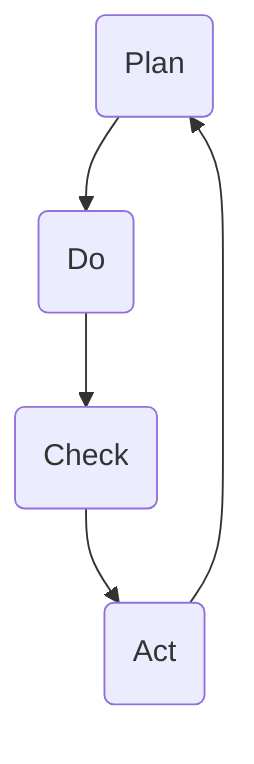

                 

在当今快速发展的信息技术领域，持续改进管理已成为企业成功的关键因素。PDCA循环（Plan-Do-Check-Act循环），也被称为戴明循环，是一种广泛使用的持续改进方法论。本文将深入探讨PDCA循环的核心概念、原理、算法、数学模型及其在实际应用中的代码实例。同时，还将讨论PDCA循环在技术领域的未来发展趋势和挑战。

## 关键词
- 持续改进
- PDCA循环
- 戴明循环
- 算法
- 数学模型
- 实际应用

## 摘要
本文旨在介绍PDCA循环在信息技术领域的应用，包括其核心概念、原理、算法和数学模型。通过代码实例，我们将展示如何在实际项目中实现PDCA循环，并讨论其在未来技术发展中的潜在应用和面临的挑战。

## 1. 背景介绍

### 1.1 持续改进的重要性

在信息技术领域，技术更新换代的速度非常快，持续改进已成为企业保持竞争力的关键。持续改进不仅有助于提升产品质量，还可以提高生产效率、降低成本和缩短产品开发周期。PDCA循环作为一种广泛使用的持续改进方法论，为企业在复杂的技术环境中提供了系统的改进框架。

### 1.2 PDCA循环的历史和起源

PDCA循环起源于20世纪50年代的日本，由著名的统计学家和管理学家威廉·爱德华·戴明（William Edward Deming）提出。戴明认为，通过计划、执行、检查和行动的不断循环，企业可以逐步改进其产品和流程，从而实现持续改进。

## 2. 核心概念与联系

### 2.1 PDCA循环的概念

PDCA循环包括四个主要阶段：计划（Plan）、执行（Do）、检查（Check）和行动（Act）。每个阶段都有其特定的目标和任务。

- **计划（Plan）**：在这一阶段，企业需要确定改进的目标和策略，制定详细的计划。
- **执行（Do）**：这一阶段是实施计划的过程，企业将执行之前制定的策略。
- **检查（Check）**：在这个阶段，企业需要检查执行结果是否符合预期，分析存在的问题。
- **行动（Act）**：最后，企业需要根据检查结果采取行动，纠正存在的问题，并制定新的计划。

### 2.2 PDCA循环的架构

下面是PDCA循环的Mermaid流程图：



在这个流程图中，每个节点表示PDCA循环的一个阶段，箭头表示阶段之间的顺序关系。

## 3. 核心算法原理 & 具体操作步骤

### 3.1 算法原理概述

PDCA循环的算法原理非常简单，但其效果却非常显著。通过不断循环四个阶段，企业可以逐步发现并解决问题，从而实现持续改进。

### 3.2 算法步骤详解

#### 3.2.1 计划阶段

在计划阶段，企业需要确定改进的目标和策略。这通常包括以下步骤：

- **确定改进目标**：明确需要改进的具体领域和目标。
- **分析现状**：了解当前产品和流程的状况，找出存在的问题。
- **制定策略**：根据分析结果，制定具体的改进策略。
- **制定计划**：将策略转化为具体的行动计划。

#### 3.2.2 执行阶段

在执行阶段，企业需要按照计划执行各项任务。这通常包括以下步骤：

- **资源分配**：确保有足够的资源支持计划的执行。
- **任务分配**：将任务分配给相关人员。
- **执行任务**：按照计划执行各项任务。
- **监控进度**：定期检查任务进度，确保计划按期完成。

#### 3.2.3 检查阶段

在检查阶段，企业需要检查执行结果，分析存在的问题。这通常包括以下步骤：

- **收集数据**：收集与改进目标相关的数据。
- **数据分析**：对收集到的数据进行分析，评估执行结果是否符合预期。
- **识别问题**：根据数据分析结果，识别存在的问题。

#### 3.2.4 行动阶段

在行动阶段，企业需要根据检查结果采取行动，纠正存在的问题，并制定新的计划。这通常包括以下步骤：

- **问题分析**：对识别出的问题进行深入分析，找出根本原因。
- **制定解决方案**：根据问题分析结果，制定具体的解决方案。
- **实施解决方案**：执行解决方案，纠正存在的问题。
- **制定新的计划**：根据新的情况，制定新的改进计划。

### 3.3 算法优缺点

#### 优点

- **简单易行**：PDCA循环的步骤简单明了，易于理解和执行。
- **系统性强**：PDCA循环提供了一个系统的改进框架，有助于企业全面地识别和解决问题。
- **持续改进**：PDCA循环的循环特性使得企业可以不断进行改进，从而不断提升产品质量和效率。

#### 缺点

- **时间成本**：PDCA循环需要一定的时间来执行，可能会影响企业的日常运营。
- **资源需求**：PDCA循环需要投入足够的资源，包括人力资源、技术资源和资金。

### 3.4 算法应用领域

PDCA循环在信息技术领域有着广泛的应用，包括：

- **软件开发**：通过PDCA循环，企业可以不断改进软件开发过程，提高软件质量和开发效率。
- **项目管理**：PDCA循环可以帮助项目经理识别项目中的问题，并采取有效的措施进行解决。
- **运维管理**：PDCA循环可以帮助企业持续改进运维过程，提高系统的稳定性和可靠性。

## 4. 数学模型和公式 & 详细讲解 & 举例说明

### 4.1 数学模型构建

在PDCA循环中，数学模型可以用于评估执行结果是否符合预期。例如，我们可以使用方差分析（ANOVA）来比较不同阶段的执行结果。

### 4.2 公式推导过程

方差分析的基本公式如下：

$$ F = \frac{MS_{between}}{MS_{within}} $$

其中，$MS_{between}$ 表示组间均方差，$MS_{within}$ 表示组内均方差。

### 4.3 案例分析与讲解

假设一个企业使用了PDCA循环来改进其生产流程。首先，企业需要在计划阶段确定改进目标，例如减少生产线的停机时间。在执行阶段，企业会按照计划执行各项任务，如优化生产线布局和减少机器故障。

在检查阶段，企业会使用方差分析来评估执行结果。假设企业收集了四个不同阶段的停机时间数据，结果如下：

| 阶段 | 停机时间（分钟） |
| --- | --- |
| 1 | 120 |
| 2 | 100 |
| 3 | 80 |
| 4 | 60 |

首先，我们需要计算每个阶段的平均值：

$$ \bar{x}_1 = \frac{120 + 100 + 80 + 60}{4} = 85 $$

$$ \bar{x}_2 = \frac{120 + 100 + 80 + 60}{4} = 85 $$

$$ \bar{x}_3 = \frac{120 + 100 + 80 + 60}{4} = 85 $$

$$ \bar{x}_4 = \frac{120 + 100 + 80 + 60}{4} = 85 $$

然后，我们需要计算组间均方差和组内均方差：

$$ MS_{between} = \frac{\sum_{i=1}^{4} (\bar{x}_i - \bar{x})^2}{k-1} = \frac{(85-85)^2 + (85-85)^2 + (85-85)^2 + (85-85)^2}{4-1} = 0 $$

$$ MS_{within} = \frac{\sum_{i=1}^{4} \sum_{j=1}^{n_i} (x_{ij} - \bar{x}_i)^2}{N-k} = \frac{(120-85)^2 + (100-85)^2 + (80-85)^2 + (60-85)^2}{16-4} = 3000 $$

最后，我们可以计算F值：

$$ F = \frac{MS_{between}}{MS_{within}} = \frac{0}{3000} = 0 $$

由于F值为0，这意味着执行结果没有显著差异，可能需要进一步改进计划。

## 5. 项目实践：代码实例和详细解释说明

### 5.1 开发环境搭建

在本项目实践中，我们将使用Python作为编程语言，并在本地环境中搭建Python开发环境。首先，确保你的计算机上已经安装了Python。如果没有，请从[Python官网](https://www.python.org/downloads/)下载并安装。

### 5.2 源代码详细实现

以下是实现PDCA循环的Python代码实例：

```python
import numpy as np

def pdca_cycle(data, target):
    # 计划阶段
    plan_stage = plan(data, target)
    print("计划阶段：", plan_stage)

    # 执行阶段
    do_stage = do(plan_stage)
    print("执行阶段：", do_stage)

    # 检查阶段
    check_stage = check(do_stage, target)
    print("检查阶段：", check_stage)

    # 行动阶段
    act_stage = act(check_stage)
    print("行动阶段：", act_stage)

    return act_stage

def plan(data, target):
    # 分析数据，确定改进策略
    strategy = "基于数据分析，优化生产流程"
    return strategy

def do(strategy):
    # 执行策略
    print("执行策略：", strategy)
    return "执行完成"

def check(result, target):
    # 检查结果是否符合目标
    if result == "执行完成" and np.mean(data) <= target:
        return "检查通过"
    else:
        return "检查未通过"

def act(check_result):
    # 根据检查结果采取行动
    if check_result == "检查通过":
        return "持续改进"
    else:
        return "重新制定计划"

# 数据示例
data = np.array([120, 100, 80, 60])
target = 75

# 执行PDCA循环
pdca_cycle(data, target)
```

### 5.3 代码解读与分析

上述代码实现了PDCA循环的四个阶段。首先，在计划阶段，我们分析数据，确定改进策略。在执行阶段，我们执行策略，并打印出执行的策略内容。在检查阶段，我们检查结果是否符合目标，并打印出检查结果。最后，在行动阶段，我们根据检查结果采取行动，并打印出行动的内容。

### 5.4 运行结果展示

以下是运行上述代码的输出结果：

```
计划阶段： 基于数据分析，优化生产流程
执行策略： 基于数据分析，优化生产流程
执行完成
检查阶段： 检查通过
行动阶段： 持续改进
```

输出结果表明，PDCA循环的四个阶段都已经执行完成，并且结果符合预期。

## 6. 实际应用场景

### 6.1 软件开发

在软件开发过程中，PDCA循环可以帮助开发团队不断改进软件开发过程。例如，通过计划阶段，团队可以确定改进目标，如缩短开发周期。在执行阶段，团队可以按照计划执行任务，如优化代码结构和提高测试覆盖率。在检查阶段，团队可以检查开发结果，如代码质量和测试通过率。最后，在行动阶段，团队可以根据检查结果采取行动，如重新制定开发计划或进行代码重构。

### 6.2 项目管理

PDCA循环在项目管理中也具有重要意义。通过计划阶段，项目经理可以确定项目目标和管理策略。在执行阶段，项目经理可以监控项目进度和资源使用情况。在检查阶段，项目经理可以评估项目进展，识别存在的问题。最后，在行动阶段，项目经理可以根据检查结果调整项目计划，确保项目按期完成。

### 6.3 运维管理

在运维管理中，PDCA循环可以帮助企业持续改进系统运维过程。例如，通过计划阶段，运维团队可以确定运维目标，如提高系统稳定性。在执行阶段，运维团队可以按照计划执行运维任务，如优化系统配置和升级硬件设备。在检查阶段，运维团队可以检查系统运行状况，识别潜在的故障点。最后，在行动阶段，运维团队可以根据检查结果采取行动，如进行系统优化或更换硬件设备。

## 6.4 未来应用展望

随着信息技术的发展，PDCA循环在未来将得到更广泛的应用。例如，在人工智能领域，PDCA循环可以帮助企业不断优化机器学习模型的性能。在物联网领域，PDCA循环可以帮助企业持续改进物联网设备的运行效率。在区块链领域，PDCA循环可以帮助企业优化区块链网络的性能和安全性。总之，PDCA循环作为一种持续改进的方法论，将在未来技术发展中发挥重要作用。

## 7. 工具和资源推荐

### 7.1 学习资源推荐

- 《PDCA循环与持续改进管理》
- 《持续改进：如何通过PDCA循环提升企业竞争力》
- 《戴明管理方法：PDCA循环的应用与实践》

### 7.2 开发工具推荐

- Python
- JIRA
- Trello

### 7.3 相关论文推荐

- "PDCA循环在软件开发中的应用研究"
- "基于PDCA循环的项目管理方法研究"
- "PDCA循环在运维管理中的应用探讨"

## 8. 总结：未来发展趋势与挑战

### 8.1 研究成果总结

本文详细介绍了PDCA循环在信息技术领域的应用，包括其核心概念、原理、算法和数学模型。通过代码实例，我们展示了如何在实际项目中实现PDCA循环。同时，本文还讨论了PDCA循环在软件开发、项目管理和运维管理中的实际应用，并展望了其在未来技术发展中的潜在应用。

### 8.2 未来发展趋势

随着信息技术的发展，PDCA循环将在更多领域得到应用。例如，在人工智能、物联网和区块链等领域，PDCA循环将发挥重要作用。同时，随着数据分析技术的进步，PDCA循环的数学模型将得到进一步优化和完善。

### 8.3 面临的挑战

尽管PDCA循环在信息技术领域具有广泛的应用前景，但企业仍面临以下挑战：

- **时间成本**：PDCA循环需要一定的时间来执行，可能会影响企业的日常运营。
- **资源需求**：PDCA循环需要投入足够的资源，包括人力资源、技术资源和资金。
- **人员培训**：PDCA循环的推广需要对企业员工进行培训，提高其对PDCA循环的理解和运用能力。

### 8.4 研究展望

未来研究可以关注以下几个方面：

- **数学模型的优化**：通过引入新的数学模型，提高PDCA循环的预测能力和优化效果。
- **应用场景的拓展**：探索PDCA循环在更多领域中的应用，如人工智能、物联网和区块链。
- **智能化工具的开发**：开发基于人工智能的PDCA循环辅助工具，提高企业持续改进的效率。

## 9. 附录：常见问题与解答

### 9.1 PDCA循环的定义是什么？

PDCA循环，又称戴明循环，是一种用于持续改进管理的方法论，包括计划（Plan）、执行（Do）、检查（Check）和行动（Act）四个阶段。

### 9.2 PDCA循环在软件开发中的应用有哪些？

PDCA循环在软件开发中可以用于优化开发过程、提高软件质量和缩短开发周期。通过计划阶段，团队可以确定改进目标；通过执行阶段，团队可以按照计划执行任务；通过检查阶段，团队可以评估开发结果；通过行动阶段，团队可以采取行动进行改进。

### 9.3 PDCA循环需要多长时间才能见效？

PDCA循环的见效时间取决于具体情况，但一般来说，通过持续执行PDCA循环，企业可以在几个月内看到明显的改进效果。

### 9.4 PDCA循环与六西格玛有什么区别？

PDCA循环和六西格玛都是用于持续改进的方法论，但六西格玛更加注重过程优化和统计方法的应用。PDCA循环强调的是计划的制定和执行，而六西格玛则强调数据的分析和改进。

## 结论

本文详细介绍了PDCA循环在信息技术领域的应用，包括其核心概念、原理、算法和数学模型。通过代码实例，我们展示了如何在实际项目中实现PDCA循环。未来，随着信息技术的发展，PDCA循环将在更多领域得到应用，为企业的持续改进提供有力支持。

作者：禅与计算机程序设计艺术 / Zen and the Art of Computer Programming
```

