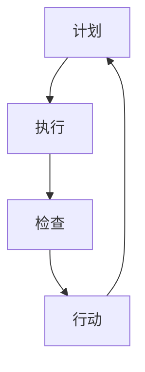

                 

关键词：PDCA循环，管理，持续改进，质量，效率

> 摘要：本文探讨了PDCA循环（计划-执行-检查-行动）在企业管理中的应用，以及它如何促进持续改进。通过深入分析PDCA循环的核心概念、应用步骤、数学模型，以及实际项目中的应用案例，本文揭示了PDCA循环在提升组织管理效率和产品质量方面的关键作用，并对其未来发展趋势和挑战进行了展望。

## 1. 背景介绍

在当今快速变化的市场环境中，企业需要不断调整和优化其管理策略，以保持竞争力。PDCA循环，作为一种广泛应用于企业管理的方法，通过四个步骤——计划（Plan）、执行（Do）、检查（Check）和行动（Act），帮助企业实现持续改进，提升质量和效率。

### 1.1 PDCA循环的历史与发展

PDCA循环起源于20世纪初的美国，由质量管理大师戴明（W. Edwards Deming）提出，并广泛应用于日本企业管理。自那时以来，PDCA循环已经成为了全球范围内广泛采用的品质管理工具。随着信息技术的发展，PDCA循环的应用领域也在不断拓展，从传统制造业到现代服务业，从企业管理到个人生活，都可见PDCA循环的身影。

### 1.2 PDCA循环的核心概念

PDCA循环的核心概念包括四个阶段：

- **计划（Plan）**：在这一阶段，企业需要明确目标、制定策略和计划，以及分配资源和责任。

- **执行（Do）**：执行阶段是将计划付诸实践的过程，涉及到具体的操作和执行。

- **检查（Check）**：在检查阶段，企业需要对执行过程进行监控和评估，以确定是否达到预期目标。

- **行动（Act）**：行动阶段是对检查结果的分析和反馈，根据实际情况采取改进措施，为下一个循环做准备。

## 2. 核心概念与联系

为了更好地理解PDCA循环在企业中的应用，我们使用Mermaid流程图来展示PDCA循环的原理和架构。



### 2.1 计划阶段

在计划阶段，企业需要明确目标和制定详细的行动计划。这包括：

- **目标设定**：根据企业的愿景和战略，设定具体、可衡量的目标。

- **资源分配**：合理分配人力、物力、财力等资源，确保计划的可行性。

- **责任分配**：明确每个团队成员的职责和任务，确保计划能够有效执行。

### 2.2 执行阶段

执行阶段是PDCA循环的核心，涉及到具体的操作和执行。这包括：

- **执行过程**：根据计划，进行具体的操作和执行。

- **监控与反馈**：实时监控执行过程，收集反馈信息，及时调整计划。

### 2.3 检查阶段

在检查阶段，企业需要对执行结果进行评估，以确定是否达到预期目标。这包括：

- **数据收集**：收集与执行过程相关的数据，包括质量数据、效率数据等。

- **结果分析**：对收集的数据进行分析，识别问题和不足之处。

### 2.4 行动阶段

行动阶段是对检查结果的分析和反馈，根据实际情况采取改进措施。这包括：

- **问题解决**：针对检查阶段发现的问题，制定解决方案并实施。

- **经验总结**：总结执行过程中的经验和教训，为下一个循环提供参考。

## 3. 核心算法原理 & 具体操作步骤

### 3.1 算法原理概述

PDCA循环是一种迭代改进方法，通过不断循环执行计划、执行、检查和行动四个阶段，实现持续改进。其核心原理可以概括为：

- **目标导向**：以明确的目标为驱动，确保每个阶段都有明确的目标和方向。

- **数据驱动**：通过数据收集和分析，识别问题和不足之处，制定改进措施。

- **持续迭代**：通过不断循环，逐步优化和改进，实现长期目标。

### 3.2 算法步骤详解

PDCA循环的具体操作步骤如下：

1. **计划阶段**：设定目标、制定计划、分配资源、明确责任。

2. **执行阶段**：按照计划执行、实时监控、收集反馈。

3. **检查阶段**：收集数据、分析结果、识别问题。

4. **行动阶段**：解决问题、总结经验、为下一个循环做准备。

### 3.3 算法优缺点

**优点**：

- **简单易用**：PDCA循环结构简单，易于理解和操作。

- **灵活性强**：PDCA循环适用于各种类型的企业和组织，具有很高的适应性。

- **持续改进**：通过不断循环，实现持续改进，提高管理效率和产品质量。

**缺点**：

- **执行难度**：在执行阶段，需要严格按照计划执行，否则容易偏离目标。

- **数据依赖**：PDCA循环依赖于数据的收集和分析，数据不准确会影响结果。

### 3.4 算法应用领域

PDCA循环广泛应用于企业管理、项目管理、质量管理等多个领域。以下是一些典型应用场景：

- **企业管理**：通过PDCA循环，企业可以持续优化管理流程，提高运营效率。

- **项目管理**：在项目执行过程中，PDCA循环可以帮助项目团队识别问题和风险，及时调整项目计划。

- **质量管理**：PDCA循环可以帮助企业持续改进产品质量，降低质量风险。

## 4. 数学模型和公式 & 详细讲解 & 举例说明

### 4.1 数学模型构建

PDCA循环的数学模型可以表示为：

$$
\text{目标} = \text{执行效率} \times \text{质量水平}
$$

其中，执行效率和质量水平分别为：

$$
\text{执行效率} = \frac{\text{实际产出}}{\text{计划产出}}
$$

$$
\text{质量水平} = \frac{\text{合格产品}}{\text{总产品}}
$$

### 4.2 公式推导过程

假设企业计划产出为Q，实际产出为R，合格产品为G，总产品为T。

则执行效率为：

$$
\text{执行效率} = \frac{\text{实际产出}}{\text{计划产出}} = \frac{R}{Q}
$$

质量水平为：

$$
\text{质量水平} = \frac{\text{合格产品}}{\text{总产品}} = \frac{G}{T}
$$

将两个公式相乘，得到：

$$
\text{目标} = \text{执行效率} \times \text{质量水平} = \frac{R}{Q} \times \frac{G}{T}
$$

### 4.3 案例分析与讲解

假设某企业计划生产1000个产品，实际生产了950个产品，其中900个产品合格。

则执行效率为：

$$
\text{执行效率} = \frac{\text{实际产出}}{\text{计划产出}} = \frac{950}{1000} = 0.95
$$

质量水平为：

$$
\text{质量水平} = \frac{\text{合格产品}}{\text{总产品}} = \frac{900}{950} = 0.947
$$

将两个值代入数学模型，得到目标为：

$$
\text{目标} = \text{执行效率} \times \text{质量水平} = 0.95 \times 0.947 = 0.896
$$

这意味着，该企业的目标实现率为89.6%。

### 5. 项目实践：代码实例和详细解释说明

#### 5.1 开发环境搭建

在本案例中，我们将使用Python语言实现PDCA循环的代码。首先，需要安装Python环境和相关库。

```bash
pip install numpy matplotlib
```

#### 5.2 源代码详细实现

以下是一个简单的Python代码示例，用于实现PDCA循环的四个阶段。

```python
import numpy as np
import matplotlib.pyplot as plt

def plan阶段（目标，计划产出）:
    执行效率 = 0
    质量水平 = 0
    return 执行效率，质量水平

def 执行阶段（执行效率，质量水平）:
    实际产出 = 执行效率 * 计划产出
    合格产品 = 质量水平 * 实际产出
    return 实际产出，合格产品

def 检查阶段（实际产出，合格产品）:
    执行效率 = 实际产出 / 计划产出
    质量水平 = 合格产品 / 实际产出
    return 执行效率，质量水平

def 行动阶段（执行效率，质量水平）:
    if 执行效率 < 1 or 质量水平 < 1:
        # 根据执行效率和质量水平，调整计划或采取措施
        pass
    else:
        # 计划达成，结束循环
        pass

# 示例数据
计划产出 = 1000
目标 = 0.9  # 目标实现率90%

# PDCA循环
执行效率，质量水平 = plan阶段（目标，计划产出）
实际产出，合格产品 = 执行阶段（执行效率，质量水平）
执行效率，质量水平 = 检查阶段（实际产出，合格产品）
行动阶段（执行效率，质量水平）

# 绘制图表
x = [0, 1, 2, 3]
y = [执行效率，质量水平，执行效率，质量水平]
plt.plot(x, y, marker='o')
plt.xlabel('阶段')
plt.ylabel('指标')
plt.title('PDCA循环示例')
plt.grid()
plt.show()
```

#### 5.3 代码解读与分析

上述代码实现了PDCA循环的四个阶段，具体解读如下：

- **plan阶段**：输入目标实现率和计划产出，输出执行效率和初始质量水平。

- **执行阶段**：根据执行效率和计划产出，计算实际产出和合格产品。

- **检查阶段**：根据实际产出和合格产品，重新计算执行效率和质量水平。

- **行动阶段**：根据执行效率和

