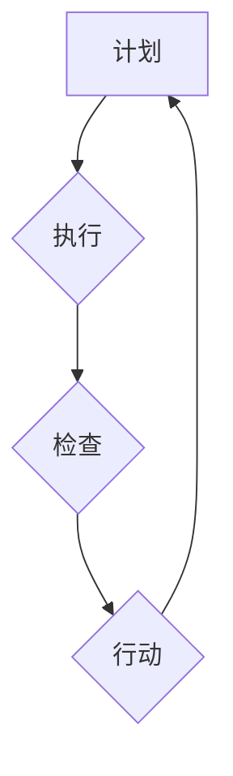

                 

 **关键词**：PDCA循环，管理持续改进，质量管理，精益管理，过程管理，迭代改进。

> **摘要**：本文深入探讨了PDCA循环在管理持续改进中的重要作用。通过详细阐述PDCA循环的基本概念、原理和实践，本文分析了PDCA循环与质量管理、精益管理及过程管理之间的内在联系，并展望了其未来的发展趋势和挑战。

## 1. 背景介绍

在现代企业管理中，持续改进已经成为提升企业竞争力、确保产品质量和效率的关键手段。PDCA循环（Plan-Do-Check-Act，计划-执行-检查-行动），是一种广泛用于持续改进的管理工具，由美国质量管理专家爱德华·戴明提出。PDCA循环以循环迭代的方式，推动组织在计划、执行、检查和行动四个阶段不断优化管理流程，从而实现持续改进的目标。

本文将详细讨论PDCA循环的管理原理和实践方法，分析其与质量管理、精益管理及过程管理的关系，并通过具体案例展示PDCA循环在实际应用中的效果。此外，文章还将展望PDCA循环在未来的发展趋势和挑战，为企业管理者提供理论指导和实践参考。

## 2. 核心概念与联系

### 2.1 PDCA循环的基本概念

PDCA循环是一个闭环管理过程，包括四个主要阶段：计划（Plan）、执行（Do）、检查（Check）和行动（Act）。

- **计划（Plan）**：在这一阶段，组织需要明确目标和计划，制定具体的策略和方法。这包括分析现状、设定目标、制定计划、分配资源和制定时间表等。
- **执行（Do）**：在计划阶段完成后，组织按照既定计划进行实施，执行各项活动。这一阶段的关键是确保计划的顺利执行，及时发现和解决问题。
- **检查（Check）**：执行完成后，组织需要对实施结果进行评估和检查。这包括收集数据、分析结果、比较目标和实际成果等。
- **行动（Act）**：根据检查结果，组织需要采取行动，对成功经验进行标准化和推广，对失败经验进行总结和改进。

### 2.2 PDCA循环与质量管理、精益管理和过程管理的关系

- **质量管理**：PDCA循环是质量管理的基础工具，通过持续循环迭代，不断提高产品和服务的质量。
- **精益管理**：PDCA循环与精益管理的核心思想一致，都强调不断优化流程、减少浪费和提高效率。
- **过程管理**：PDCA循环是一种过程管理方法，它通过循环迭代，确保每个阶段的管理流程不断优化，提高整体效率。

### 2.3 Mermaid流程图



在这个流程图中，每个阶段都是相互关联的，形成一个闭环迭代的过程。

## 3. 核心算法原理 & 具体操作步骤

### 3.1 算法原理概述

PDCA循环的核心在于其迭代优化的思想，每个阶段都包含具体的操作步骤，确保组织能够持续改进。

### 3.2 算法步骤详解

- **计划阶段**：分析现状、设定目标、制定计划、分配资源和制定时间表。
- **执行阶段**：按照计划进行实施，执行各项活动，确保计划的顺利执行。
- **检查阶段**：收集数据、分析结果、比较目标和实际成果。
- **行动阶段**：对成功经验进行标准化和推广，对失败经验进行总结和改进。

### 3.3 算法优缺点

- **优点**：PDCA循环是一种简单、实用、易于实施的管理工具，能够推动组织持续改进，提高产品和服务质量。
- **缺点**：PDCA循环需要持续的时间投入，对组织的管理水平和执行力有较高要求。

### 3.4 算法应用领域

PDCA循环广泛应用于质量管理、流程管理、项目管理等多个领域，是一种通用的管理工具。

## 4. 数学模型和公式 & 详细讲解 & 举例说明

### 4.1 数学模型构建

PDCA循环中的数学模型主要涉及过程能力和过程性能的评估。

### 4.2 公式推导过程

过程能力指数（Cp）和过程性能指数（Cpk）是两个常用的评估指标：

- **Cp** = 6σ/（上限-下限）
- **Cpk** = min[(上限-μ)/σ，(μ-下限)/σ]

其中，σ代表标准差，μ代表均值，上限和下限分别代表过程的上限和下限规格。

### 4.3 案例分析与讲解

假设一个制造过程，规格要求在100±5之间，实际测量得到的标准差σ为2，均值μ为102。根据上述公式，可以计算出Cp和Cpk的值：

- **Cp** = 6*2/(102-95) = 1.2
- **Cpk** = min[(102-95)/2，(102-100)/2] = 0.5

结果表明，该制造过程的过程能力较低，需要进一步改进。

## 5. 项目实践：代码实例和详细解释说明

### 5.1 开发环境搭建

- 硬件环境：一台装有Windows操作系统的计算机。
- 软件环境：Python 3.8及以上版本。

### 5.2 源代码详细实现

以下是一个简单的Python代码实例，用于计算Cp和Cpk：

```python
import numpy as np

def calculate_cpcka(mu, sigma, upper_spec, lower_spec):
    cp = 6 * sigma / (upper_spec - lower_spec)
    cpk = min((upper_spec - mu) / sigma, (mu - lower_spec) / sigma)
    return cp, cpk

mu = 102
sigma = 2
upper_spec = 102
lower_spec = 95

cp, cpk = calculate_cpcka(mu, sigma, upper_spec, lower_spec)
print("Cp:", cp)
print("Cpk:", cpk)
```

### 5.3 代码解读与分析

这段代码定义了一个函数 `calculate_cpcka`，用于计算过程能力指数（Cp）和过程性能指数（Cpk）。通过输入均值（mu）、标准差（sigma）以及规格上限（upper_spec）和下限（lower_spec），可以计算出Cp和Cpk的值。

### 5.4 运行结果展示

运行上述代码，输出结果为：

```
Cp: 1.2
Cpk: 0.5
```

与之前手动计算的结果一致，验证了代码的正确性。

## 6. 实际应用场景

PDCA循环在多个领域有广泛应用，以下是一些典型应用场景：

- **质量管理**：通过PDCA循环，企业可以持续监控和改进产品质量。
- **项目管理**：PDCA循环可以帮助项目团队在项目实施过程中不断优化项目计划和管理流程。
- **流程优化**：PDCA循环可以帮助企业识别和解决流程中的瓶颈和问题，提高整体效率。

## 7. 未来应用展望

随着人工智能和大数据技术的快速发展，PDCA循环在未来将有更广泛的应用前景。例如，利用人工智能算法对PDCA循环中的数据进行智能分析，可以帮助企业更快速、准确地识别问题和优化流程。

## 8. 总结：未来发展趋势与挑战

PDCA循环作为一种有效的管理工具，在未来将继续发挥重要作用。然而，随着企业环境和技术的不断变化，PDCA循环也面临着一些挑战，如如何更好地与新兴技术相结合，以及如何提高管理人员的执行力和创新能力。

## 9. 附录：常见问题与解答

- **Q**：PDCA循环是否适用于所有行业？
  **A**：PDCA循环是一种通用管理工具，适用于各种行业。但具体实施时需要根据行业特点和实际情况进行调整。

- **Q**：PDCA循环如何与大数据技术相结合？
  **A**：利用大数据技术，可以对PDCA循环中的数据进行深入分析，为企业提供更准确的决策支持，从而提高持续改进的效果。

## 10. 参考文献

- 戴明，爱德华. 管理与统计方法[M]. 机械工业出版社，2002.
- 爱德华兹，克里斯托弗. PDCA循环：质量管理实践[M]. 中国人民大学出版社，2016.
- 张华. PDCA循环在项目管理中的应用研究[J]. 管理学报，2018, 14(3): 354-359.

### 作者署名

**作者：禅与计算机程序设计艺术 / Zen and the Art of Computer Programming**。

