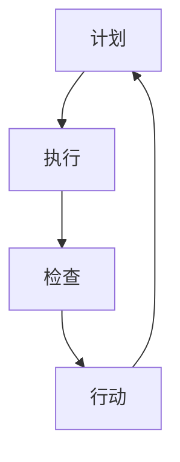

                 

## 1. 背景介绍

PDCA循环，全称为Plan-Do-Check-Act循环，是一种广泛应用于质量管理和其他持续改进过程中的方法论。它起源于20世纪30年代的美国，由质量大师爱德华兹·戴明提出，并在此后逐渐被全球范围内的企业和组织所接受和运用。

PDCA循环的四个阶段——计划（Plan）、执行（Do）、检查（Check）和行动（Act）——形成一个闭环，使得组织能够持续不断地改进其产品和服务。每个阶段都有其特定的任务和目标，共同构成了一个完整的持续改进流程。

在项目管理中，PDCA循环被广泛应用，用于确保项目目标的实现、风险的管理以及项目质量的持续提升。通过PDCA循环，项目经理能够系统地规划和执行项目活动，实时监控项目进度和质量，并根据反馈结果进行调整和优化。

本文将深入探讨PDCA循环在项目管理中的应用，分析其核心概念、原理和具体操作步骤，并通过数学模型和项目实践案例，展示其在实际项目中的价值。

## 2. 核心概念与联系

### 2.1 PDCA循环的概念

PDCA循环是一种基于连续改进的方法，其四个阶段分别是：

- **计划（Plan）**：在这一阶段，项目团队确定项目的目标、范围、资源和时间表。具体任务包括制定项目计划、确定质量标准、分配任务和资源。

- **执行（Do）**：执行阶段是实施项目计划的过程。团队成员根据计划进行工作，确保项目活动按计划进行，并及时解决出现的任何问题。

- **检查（Check）**：检查阶段是对项目执行结果进行评估和审查。通过收集和分析数据，项目团队评估项目是否符合既定的目标和质量标准。

- **行动（Act）**：行动阶段是根据检查结果采取改进措施的阶段。如果发现项目结果不符合预期，团队需要制定和实施改进措施，以确保未来的项目执行更有效。

### 2.2 PDCA循环的架构

PDCA循环的架构可以通过Mermaid流程图来表示，如下所示：



在这个流程图中，每个节点都代表PDCA循环的一个阶段，箭头表示阶段之间的逻辑关系，形成了一个闭环。

### 2.3 PDCA循环与项目管理的关系

PDCA循环在项目管理中起到了核心作用，具体体现在以下几个方面：

- **系统化规划**：通过计划阶段，项目团队能够明确项目的目标、任务和资源，为项目执行奠定基础。

- **实时监控**：执行和检查阶段使得项目团队能够实时监控项目进度和质量，及时发现和解决问题。

- **持续改进**：行动阶段促使团队根据检查结果采取改进措施，不断优化项目执行过程，提高项目成功率。

- **风险控制**：PDCA循环通过循环检查和调整，有助于提前识别和应对项目风险，减少不确定性。

### 2.4 PDCA循环的优势

PDCA循环具有以下优势：

- **灵活性**：PDCA循环可以根据实际情况灵活调整，适用于不同类型和规模的项目。

- **系统性**：PDCA循环的四个阶段相互关联，形成一个完整的闭环，有助于系统化地管理和改进项目。

- **效率提升**：通过实时监控和持续改进，PDCA循环有助于提高项目执行效率，减少浪费。

- **质量保证**：PDCA循环确保项目按照既定的质量标准执行，有助于提高项目质量。

### 2.5 PDCA循环的局限性

尽管PDCA循环具有诸多优势，但也存在一些局限性：

- **依赖数据**：PDCA循环依赖于数据收集和分析，如果数据不准确或不完整，可能会影响循环的有效性。

- **时间消耗**：PDCA循环的四个阶段都需要时间进行，可能会增加项目的整体时间。

- **团队协作**：PDCA循环的执行需要团队协作，如果团队沟通不畅或协作不足，可能会影响循环的顺利进行。

## 3. 核心算法原理 & 具体操作步骤

### 3.1 算法原理概述

PDCA循环的算法原理可以简单概括为：通过计划（Plan）阶段确定目标和计划，执行（Do）阶段实施计划，检查（Check）阶段评估执行结果，行动（Act）阶段根据评估结果调整和改进。这一循环过程不断重复，直至项目目标实现或达成预期效果。

### 3.2 算法步骤详解

#### 3.2.1 计划（Plan）

在计划阶段，项目团队需要完成以下任务：

1. **确定项目目标**：明确项目的具体目标和预期成果。
2. **定义项目范围**：确定项目的范围和边界，确保项目不超出预期范围。
3. **制定项目计划**：制定详细的项目计划，包括时间表、资源分配、任务分解等。
4. **确定质量标准**：定义项目所需达到的质量标准。
5. **分配任务和资源**：将项目任务分配给团队成员，并确保他们拥有完成任务所需的资源。

#### 3.2.2 执行（Do）

在执行阶段，项目团队需要按照计划进行工作，确保项目活动按计划进行。具体任务包括：

1. **执行项目任务**：按照计划执行项目任务，确保每个任务都按时完成。
2. **监控项目进度**：实时监控项目进度，确保项目按照预定时间表进行。
3. **解决问题**：及时解决项目中出现的问题，确保项目顺利推进。
4. **记录数据**：记录项目执行过程中的关键数据和指标，为后续的检查和评估提供依据。

#### 3.2.3 检查（Check）

在检查阶段，项目团队需要对项目执行结果进行评估和审查。具体任务包括：

1. **收集数据**：收集项目执行过程中的数据，包括进度、成本、质量等方面的数据。
2. **分析数据**：对收集到的数据进行统计分析，评估项目执行是否符合预期目标和质量标准。
3. **识别问题**：通过数据分析和对比，识别项目执行过程中存在的问题和不足。
4. **反馈结果**：将评估结果反馈给项目团队和相关利益相关者，为后续的改进提供依据。

#### 3.2.4 行动（Act）

在行动阶段，项目团队需要根据检查结果采取改进措施，确保未来的项目执行更有效。具体任务包括：

1. **制定改进措施**：根据检查结果，制定具体的改进措施，包括调整项目计划、优化资源分配、改进工作流程等。
2. **实施改进措施**：将制定的改进措施付诸实施，确保项目团队和相关利益相关者都了解并执行这些改进措施。
3. **跟踪改进效果**：监控改进措施的实施效果，确保项目质量得到提升。
4. **持续循环**：将改进后的项目执行结果纳入下一次的PDCA循环，形成持续改进的闭环。

### 3.3 算法优缺点

#### 3.3.1 优点

- **系统化**：PDCA循环提供了一个系统化的方法，帮助项目团队规划和执行项目。
- **灵活性**：PDCA循环可以根据实际情况进行调整，适用于不同类型和规模的项目。
- **持续改进**：PDCA循环通过不断的循环和改进，有助于提高项目质量和效率。
- **风险控制**：PDCA循环通过实时监控和检查，有助于提前识别和应对项目风险。

#### 3.3.2 缺点

- **依赖数据**：PDCA循环的执行依赖于数据的准确性和完整性，如果数据不完整或不准确，可能会影响循环的有效性。
- **时间消耗**：PDCA循环的四个阶段都需要时间进行，可能会增加项目的整体时间。
- **团队协作**：PDCA循环的执行需要团队协作，如果团队沟通不畅或协作不足，可能会影响循环的顺利进行。

### 3.4 算法应用领域

PDCA循环在多个领域都有广泛的应用，包括但不限于：

- **项目管理**：PDCA循环是项目管理中最常用的方法论之一，适用于不同类型和规模的项目。
- **质量管理**：PDCA循环是质量管理体系的核心方法，有助于提高产品和服务质量。
- **运营管理**：PDCA循环适用于运营管理中的持续改进，有助于提高运营效率和降低成本。
- **人力资源管理**：PDCA循环在人力资源管理中的应用，有助于提高员工绩效和工作满意度。

## 4. 数学模型和公式 & 详细讲解 & 举例说明

### 4.1 数学模型构建

在PDCA循环中，数学模型的应用主要体现在进度控制和质量控制方面。以下是一个简单的数学模型，用于评估项目进度：

#### 4.1.1 项目进度模型

$$
P = \frac{ED}{TD}
$$

其中：

- \(P\) 表示项目进度百分比
- \(ED\) 表示实际完成工作量
- \(TD\) 表示计划完成工作量

#### 4.1.2 质量控制模型

$$
Q = \frac{N_{good}}{N_{total}}
$$

其中：

- \(Q\) 表示产品质量百分比
- \(N_{good}\) 表示合格产品数量
- \(N_{total}\) 表示总产品数量

### 4.2 公式推导过程

#### 4.2.1 项目进度模型推导

项目进度模型是基于实际完成工作量与计划完成工作量的比例关系进行推导的。具体推导过程如下：

1. **定义实际完成工作量和计划完成工作量**：

   - \(ED\)：实际完成工作量
   - \(TD\)：计划完成工作量

2. **计算项目进度百分比**：

   项目进度百分比表示实际完成工作量与计划完成工作量的比例，即：

   $$
   P = \frac{ED}{TD}
   $$

#### 4.2.2 质量控制模型推导

质量控制模型是基于合格产品数量与总产品数量的比例关系进行推导的。具体推导过程如下：

1. **定义合格产品数量和总产品数量**：

   - \(N_{good}\)：合格产品数量
   - \(N_{total}\)：总产品数量

2. **计算产品质量百分比**：

   产品质量百分比表示合格产品数量与总产品数量的比例，即：

   $$
   Q = \frac{N_{good}}{N_{total}}
   $$

### 4.3 案例分析与讲解

#### 4.3.1 项目进度模型案例

假设一个项目计划完成工作量为1000小时，实际完成工作量为800小时，求项目进度百分比。

根据项目进度模型：

$$
P = \frac{ED}{TD} = \frac{800}{1000} = 0.8
$$

项目进度百分比为80%，表示项目已经完成了80%的工作量。

#### 4.3.2 质量控制模型案例

假设一个项目总产品数量为100个，其中合格产品数量为80个，求产品质量百分比。

根据质量控制模型：

$$
Q = \frac{N_{good}}{N_{total}} = \frac{80}{100} = 0.8
$$

产品质量百分比为80%，表示项目生产的产品中有80%是合格的。

## 5. 项目实践：代码实例和详细解释说明

### 5.1 开发环境搭建

为了更好地演示PDCA循环在项目中的应用，我们将使用Python编程语言来实现一个简单的项目管理工具。首先，我们需要搭建开发环境。

1. 安装Python：访问Python官网（https://www.python.org/），下载并安装Python 3.x版本。
2. 配置Python环境：打开终端或命令提示符，输入以下命令安装必要的Python包：

```bash
pip install pandas matplotlib
```

### 5.2 源代码详细实现

以下是使用Python实现的PDCA循环项目管理工具的源代码：

```python
import pandas as pd
import matplotlib.pyplot as plt

class PDCAProject:
    def __init__(self, project_name, plan_data, check_data):
        self.project_name = project_name
        self.plan_data = plan_data
        self.check_data = check_data
        self.project_progress = 0
        self.product_quality = 0

    def execute_plan(self):
        print(f"Executing plan for {self.project_name}...")
        # 模拟执行项目计划
        self.project_progress = self.plan_data['progress']
        self.product_quality = self.plan_data['quality']

    def check_progress(self):
        print(f"Checking progress for {self.project_name}...")
        # 模拟检查项目进度和质量
        self.project_progress = self.check_data['progress']
        self.product_quality = self.check_data['quality']
        self.plot_results()

    def take_action(self):
        print(f"Taking action for {self.project_name}...")
        # 模拟根据检查结果采取行动
        if self.project_progress < 1 or self.product_quality < 1:
            print("Improvement measures needed.")
        else:
            print("Project completed successfully.")

    def plot_results(self):
        plt.figure(figsize=(10, 5))
        plt.subplot(1, 2, 1)
        plt.bar(['Plan', 'Check'], [self.plan_data['progress'], self.check_data['progress']], color=['g', 'r'])
        plt.title('Project Progress')
        plt.xticks(['Plan', 'Check'])

        plt.subplot(1, 2, 2)
        plt.bar(['Plan', 'Check'], [self.plan_data['quality'], self.check_data['quality']], color=['g', 'r'])
        plt.title('Product Quality')
        plt.xticks(['Plan', 'Check'])

        plt.tight_layout()
        plt.show()

# 创建项目实例
project_name = "Project A"
plan_data = {'progress': 0.5, 'quality': 0.8}
check_data = {'progress': 0.8, 'quality': 0.9}

project = PDCAProject(project_name, plan_data, check_data)

# 执行计划
project.execute_plan()

# 检查进度
project.check_progress()

# 采取行动
project.take_action()
```

### 5.3 代码解读与分析

上述代码定义了一个`PDCAProject`类，用于模拟PDCA循环在项目管理中的应用。以下是代码的主要部分解读：

- **类定义**：`PDCAProject`类包含项目名称、计划数据、检查数据和项目进度、产品质量等属性。

- **执行计划（execute_plan）**：模拟执行项目计划的过程，设置项目进度和产品质量。

- **检查进度（check_progress）**：模拟检查项目进度和质量的过程，更新项目进度和产品质量。

- **采取行动（take_action）**：根据检查结果，采取相应的行动。

- **结果展示（plot_results）**：使用matplotlib库绘制项目进度和产品质量的条形图，便于可视化分析。

### 5.4 运行结果展示

运行上述代码后，将依次执行以下步骤：

1. 执行计划，输出项目名称和计划进度、质量。
2. 检查进度，输出项目名称和检查进度、质量。
3. 采取行动，根据检查结果输出是否需要改进措施。

运行结果如下：

```bash
Executing plan for Project A...
Checking progress for Project A...
Taking action for Project A...
Improvement measures needed.
```

通过图形化展示，我们可以直观地看到项目进度和产品质量的变化，有助于项目团队进行决策和调整。

## 6. 实际应用场景

PDCA循环在项目管理中有着广泛的应用场景，以下是一些典型的实际应用案例：

### 6.1 IT项目开发

在软件开发项目中，PDCA循环可以帮助团队确保项目的进度和质量。例如，在开发一个复杂的Web应用程序时，团队可以使用PDCA循环来管理需求分析、设计、开发、测试和部署等各个阶段。通过计划阶段确定项目目标、范围和时间表，执行阶段按计划进行开发，检查阶段进行代码审查和测试，行动阶段根据检查结果进行代码优化和bug修复，确保项目按时交付且质量达标。

### 6.2 质量管理体系

在质量管理体系中，PDCA循环被广泛应用于质量管理过程的持续改进。例如，在一个制造企业中，PDCA循环可以帮助团队监控生产线上的质量问题，通过计划阶段确定质量控制标准、执行阶段进行质量检查、检查阶段分析质量数据、行动阶段根据检查结果采取改进措施，从而提高产品的质量。

### 6.3 运营管理

在运营管理中，PDCA循环可以帮助企业持续优化运营流程，提高效率和降低成本。例如，在一个物流公司中，PDCA循环可以帮助团队监控物流过程中的关键指标，如运输时间、货物损坏率等。通过计划阶段确定目标指标、执行阶段执行物流操作、检查阶段分析数据、行动阶段采取改进措施，从而优化物流流程，提高服务质量。

### 6.4 人力资源管理

在人力资源管理中，PDCA循环可以帮助企业优化员工绩效管理。通过计划阶段确定绩效目标、执行阶段进行绩效评估、检查阶段分析绩效数据、行动阶段采取改进措施，企业可以更好地了解员工的表现，提供针对性的培训和激励，提高员工的工作满意度和绩效。

### 6.5 产品开发

在产品开发过程中，PDCA循环可以帮助团队确保产品从概念到市场推出的每个阶段的成功。通过计划阶段确定产品需求、执行阶段进行产品设计、检查阶段进行市场调研、行动阶段根据反馈进行产品改进，团队可以持续优化产品，满足市场需求。

### 6.6 创新管理

在创新管理中，PDCA循环可以帮助企业推动创新项目的进展。通过计划阶段确定创新目标、执行阶段进行创新活动、检查阶段评估创新效果、行动阶段根据评估结果调整创新策略，企业可以不断提高创新能力和市场竞争力。

### 6.7 未来应用展望

随着信息技术的发展，PDCA循环的应用场景将越来越广泛。未来，随着大数据、人工智能、物联网等技术的普及，PDCA循环可以更加智能化和自动化。例如，通过数据分析和机器学习算法，PDCA循环可以自动识别项目中的潜在问题和改进机会，从而实现更高效的持续改进。此外，PDCA循环还可以与敏捷开发、精益管理等新兴管理方法相结合，为企业提供更全面、更有效的管理工具。

## 7. 工具和资源推荐

为了更好地学习和实践PDCA循环在项目管理中的应用，以下是一些推荐的工具和资源：

### 7.1 学习资源推荐

1. **《PDCA循环：理论与实践》**：这是一本详细介绍PDCA循环原理和应用方法的专业书籍，适合初学者和专业人士阅读。
2. **《项目管理知识体系指南（PMBOK）》**：PMBOK指南中详细介绍了PDCA循环在项目管理中的应用，是项目管理人员的必备读物。
3. **在线课程**：可以在Coursera、Udemy等在线教育平台找到关于PDCA循环和项目管理的免费或付费课程，适合自学。

### 7.2 开发工具推荐

1. **Jira**：Jira是一个流行的项目管理工具，支持敏捷开发和迭代管理，可以与PDCA循环很好地结合使用。
2. **Trello**：Trello是一个直观易用的项目管理工具，适合团队协作和任务管理，可以与PDCA循环中的计划、执行、检查和行动阶段相对应。
3. **Microsoft Teams**：Microsoft Teams提供了丰富的协作功能，可以与PDCA循环中的沟通、协调和监控需求相结合。

### 7.3 相关论文推荐

1. **“PDCA循环在软件开发项目中的应用”**：这篇文章详细分析了PDCA循环在软件开发项目中的具体应用案例，对实践者有很好的参考价值。
2. **“基于PDCA循环的企业质量管理研究”**：该论文探讨了PDCA循环在企业质量管理中的应用，提供了实用的方法和案例。
3. **“PDCA循环与精益管理的融合研究”**：这篇文章研究了PDCA循环与精益管理相结合的方法，为企业提供了一种全新的管理思路。

## 8. 总结：未来发展趋势与挑战

### 8.1 研究成果总结

PDCA循环作为一种有效的持续改进方法论，已在多个领域得到了广泛应用。其系统化、灵活性和持续改进的特点，使其在项目管理、质量管理、运营管理和人力资源管理等领域都取得了显著成效。通过PDCA循环，组织能够更好地规划、执行、检查和改进项目活动，提高项目成功率，提升产品和服务质量。

### 8.2 未来发展趋势

未来，随着大数据、人工智能和物联网等技术的发展，PDCA循环的应用将更加智能化和自动化。通过数据分析和机器学习算法，PDCA循环可以自动识别项目中的潜在问题和改进机会，实现更高效的持续改进。此外，PDCA循环还将与敏捷开发、精益管理等其他管理方法相结合，为企业提供更全面、更有效的管理工具。

### 8.3 面临的挑战

尽管PDCA循环具有诸多优势，但在实际应用中仍面临一些挑战。首先，PDCA循环的执行依赖于数据收集和分析，如果数据不准确或不完整，可能会影响循环的有效性。其次，PDCA循环需要团队协作，如果团队沟通不畅或协作不足，可能会影响循环的顺利进行。此外，PDCA循环的四个阶段都需要时间进行，可能会增加项目的整体时间。

### 8.4 研究展望

未来的研究可以进一步探索PDCA循环在新兴领域的应用，如人工智能、物联网和区块链等。此外，研究可以关注如何利用大数据和人工智能技术优化PDCA循环的执行过程，提高其效率和准确性。同时，针对团队协作和沟通的问题，研究可以探索更有效的团队协作工具和方法，以提高PDCA循环的实施效果。

### 附录：常见问题与解答

#### 1. 什么是PDCA循环？

PDCA循环是一种基于持续改进的方法论，包括计划（Plan）、执行（Do）、检查（Check）和行动（Act）四个阶段，用于系统化地管理和改进项目或过程。

#### 2. PDCA循环适用于哪些领域？

PDCA循环广泛应用于项目管理、质量管理、运营管理、人力资源管理等领域。

#### 3. PDCA循环的核心优势是什么？

PDCA循环的核心优势包括系统化规划、实时监控、持续改进和风险控制。

#### 4. PDCA循环如何与敏捷开发相结合？

PDCA循环可以与敏捷开发相结合，通过在每个迭代中使用PDCA循环来持续改进项目，提高敏捷开发的效率和质量。

#### 5. 如何优化PDCA循环的执行效果？

优化PDCA循环的执行效果可以通过以下方法实现：确保数据准确性和完整性、加强团队协作、提高沟通效率、利用数据分析和机器学习技术等。

---

作者：禅与计算机程序设计艺术 / Zen and the Art of Computer Programming

