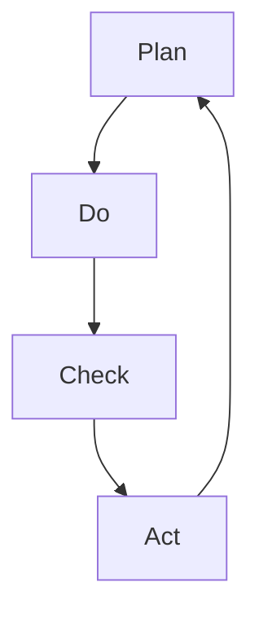

                 

关键词：PDCA循环，流程优化，质量改进，持续迭代，控制图，Kaizen

> 摘要：本文旨在探讨PDCA循环（计划-执行-检查-行动）在流程优化中的应用，详细分析其在提升组织效率和产品质量方面的作用。通过理论阐述与实际案例分析，本文将揭示PDCA循环如何帮助组织实现持续改进，应对复杂动态的商业环境。

## 1. 背景介绍

在当今这个充满竞争和变革的商业环境中，企业面临着诸多挑战，如市场需求变化、技术革新、成本压力等。为了保持竞争力，企业必须不断优化其业务流程，提升运营效率。PDCA循环，作为一种被广泛认可和应用的流程改进工具，为组织提供了系统化的方法和框架，以实现这一目标。

PDCA循环，又称为戴明循环，由美国质量管理专家爱德华·戴明提出，是用于持续改进和管理质量的基本工具。PDCA循环由四个相互衔接的步骤组成：计划（Plan）、执行（Do）、检查（Check）和行动（Act）。每个步骤都有其独特的目的和作用，共同构成了一个闭环，确保流程持续改进。

### 1.1 PDCA循环的核心步骤

- **计划（Plan）**：在这一阶段，组织需要明确目标、制定策略、规划资源和确定实施计划。这一步骤是PDCA循环的起点，为后续工作奠定基础。

- **执行（Do）**：执行阶段是将计划转化为行动的过程。这一步骤的关键在于落实计划，确保所有步骤得到准确执行。

- **检查（Check）**：检查阶段涉及对执行结果进行评估和比较。通过收集和分析数据，组织可以确定哪些部分达到了预期效果，哪些部分需要改进。

- **行动（Act）**：行动阶段是对检查结果采取纠正措施和持续改进的过程。通过总结经验教训，组织可以制定新的计划，以进一步提高流程的质量和效率。

### 1.2 PDCA循环的优势

PDCA循环具有以下几个显著优势：

- **系统化**：PDCA循环提供了一个系统化的框架，使组织能够有条不紊地推进流程优化工作。

- **灵活性**：PDCA循环允许组织根据实际情况灵活调整计划，以应对不断变化的外部环境。

- **持续改进**：PDCA循环强调持续改进，确保组织在不断优化流程，以提升竞争力。

- **数据驱动**：PDCA循环强调数据收集和分析，使组织能够基于事实做出决策，提高决策的准确性。

## 2. 核心概念与联系

为了更好地理解PDCA循环在流程优化中的作用，我们需要从理论和实践中深入探讨其核心概念和联系。

### 2.1 PDCA循环的原理和架构

#### Mermaid流程图：



在上面的流程图中，每个节点都代表了PDCA循环的一个步骤。箭头表示各步骤之间的衔接和反馈。通过这种图形化的表示，我们可以更直观地理解PDCA循环的工作原理。

### 2.2 PDCA循环与流程优化的联系

PDCA循环与流程优化有着密切的联系。具体来说，PDCA循环为流程优化提供了以下几个方面的支持：

- **目标明确**：通过计划阶段，组织可以明确优化目标，确保流程改进工作有的放矢。

- **执行落实**：执行阶段确保了计划的有效实施，使流程优化得以真正落地。

- **效果评估**：检查阶段通过数据分析和比较，评估流程改进的效果，为后续工作提供依据。

- **持续改进**：行动阶段对检查结果进行反馈和改进，确保流程优化工作不断深入。

## 3. 核心算法原理 & 具体操作步骤

### 3.1 算法原理概述

PDCA循环的核心在于其循环性，即每个循环都会使流程得到改进。具体来说，PDCA循环包括以下步骤：

1. **计划（Plan）**：确定流程优化的目标、方法和措施。
2. **执行（Do）**：按照计划实施流程改进措施。
3. **检查（Check）**：评估流程改进的效果，比较实际效果与预期目标的差距。
4. **行动（Act）**：针对检查结果采取纠正措施和持续改进。

### 3.2 算法步骤详解

#### 3.2.1 计划阶段

计划阶段是PDCA循环的起点。在这一阶段，组织需要：

- **明确目标**：确定流程优化的具体目标和标准。
- **分析现状**：通过数据分析和调研，了解流程的当前状态和问题。
- **制定策略**：基于现状分析，制定改进策略和方法。
- **分配资源**：根据策略，分配所需的人力、物力和财力资源。

#### 3.2.2 执行阶段

执行阶段是将计划转化为行动的过程。在这一阶段，组织需要：

- **实施措施**：按照计划，具体实施改进措施。
- **监控执行**：通过监控和检查，确保措施得到有效执行。

#### 3.2.3 检查阶段

检查阶段是评估流程改进效果的关键环节。在这一阶段，组织需要：

- **数据收集**：收集与流程改进相关的数据，如效率、成本、质量等。
- **比较分析**：将实际效果与预期目标进行比较，分析差距和原因。

#### 3.2.4 行动阶段

行动阶段是根据检查结果采取纠正措施和持续改进的过程。在这一阶段，组织需要：

- **纠正偏差**：针对检查中发现的问题，采取纠正措施。
- **持续改进**：基于检查结果，制定新的计划和策略，继续优化流程。

### 3.3 算法优缺点

#### 优点：

- **系统化**：PDCA循环提供了一个系统化的流程优化框架，使组织能够有序推进工作。
- **灵活性**：PDCA循环允许组织根据实际情况灵活调整计划，以应对外部环境的变化。
- **数据驱动**：PDCA循环强调数据收集和分析，使组织能够基于事实做出决策。

#### 缺点：

- **时间成本**：PDCA循环需要一定的时间和资源投入，可能会影响组织的日常运营。
- **实施难度**：PDCA循环的实施需要组织具备一定的管理和技术能力。

### 3.4 算法应用领域

PDCA循环广泛应用于各种流程优化场景，如：

- **生产制造**：用于优化生产流程，提高生产效率和产品质量。
- **服务行业**：用于优化服务流程，提升客户满意度和服务质量。
- **项目管理**：用于优化项目管理流程，确保项目按期完成并达到预期目标。

## 4. 数学模型和公式 & 详细讲解 & 举例说明

### 4.1 数学模型构建

PDCA循环中的数学模型主要涉及流程优化的目标函数和约束条件。具体来说，我们可以使用以下数学模型：

目标函数：最大化流程效率（或最小化成本）

约束条件：满足质量、时间等要求

$$
\text{最大化} \quad Z = c_1 \cdot x_1 + c_2 \cdot x_2
$$

其中，$c_1$ 和 $c_2$ 分别表示效率指标和成本指标，$x_1$ 和 $x_2$ 分别表示两个流程变量。

### 4.2 公式推导过程

在PDCA循环中，公式的推导过程主要涉及以下几个方面：

1. **确定目标函数**：根据流程优化的具体目标，确定目标函数。
2. **建立约束条件**：根据流程优化过程中的约束条件，建立相应的约束方程。
3. **求解最优解**：通过优化算法，求解目标函数的最优解。

具体推导过程如下：

设流程优化过程中有两个变量 $x_1$ 和 $x_2$，分别表示流程 A 和流程 B 的执行时间。

目标函数：最小化总成本 $Z = c_1 \cdot x_1 + c_2 \cdot x_2$

约束条件：

1. 质量约束：$x_1 + x_2 \leq T$ （$T$ 表示总时间限制）
2. 时间约束：$x_1 \geq t_1$，$x_2 \geq t_2$ （$t_1$ 和 $t_2$ 分别表示流程 A 和流程 B 的最小时间要求）

通过求解上述线性规划问题，可以得到最优解 $(x_1^*, x_2^*)$，从而实现流程优化。

### 4.3 案例分析与讲解

#### 案例背景

某公司生产两种产品 A 和 B，每种产品都需要经过两个流程：加工和检验。公司希望优化这两个流程，以最小化总成本并确保产品按时完成。

#### 案例数据

- 加工流程时间 $t_1 = 2$ 小时，检验流程时间 $t_2 = 1$ 小时
- 总时间限制 $T = 6$ 小时
- 加工成本 $c_1 = 10$ 元/小时，检验成本 $c_2 = 5$ 元/小时

#### 案例分析

根据上述数据，我们可以建立如下数学模型：

目标函数：最小化总成本 $Z = c_1 \cdot x_1 + c_2 \cdot x_2$

约束条件：

1. 质量约束：$x_1 + x_2 \leq T$
2. 时间约束：$x_1 \geq t_1$，$x_2 \geq t_2$

通过求解上述线性规划问题，可以得到最优解 $(x_1^*, x_2^*)$。

#### 解题过程

1. **目标函数求解**：根据目标函数，可以列出以下方程：

   $$
   Z = 10 \cdot x_1 + 5 \cdot x_2
   $$

2. **约束条件求解**：根据约束条件，可以列出以下方程组：

   $$
   \begin{cases}
   x_1 + x_2 \leq 6 \\
   x_1 \geq 2 \\
   x_2 \geq 1
   \end{cases}
   $$

3. **求解最优解**：通过线性规划求解器，可以得到最优解 $(x_1^*, x_2^*) = (2, 4)$。

   即，最优的加工流程时间为 2 小时，最优的检验流程时间为 4 小时。

#### 结果分析

根据求解结果，公司可以在总时间限制为 6 小时的情况下，通过优化加工和检验流程，实现总成本的最小化。同时，该解决方案也确保了产品按时完成。

## 5. 项目实践：代码实例和详细解释说明

### 5.1 开发环境搭建

为了实现PDCA循环在流程优化中的应用，我们使用Python作为开发语言，并利用相关库来处理数据和可视化结果。

所需库：

- **NumPy**：用于数学计算
- **Pandas**：用于数据处理
- **Matplotlib**：用于数据可视化

安装命令：

```
pip install numpy pandas matplotlib
```

### 5.2 源代码详细实现

以下是实现PDCA循环的Python代码：

```python
import numpy as np
import pandas as pd
import matplotlib.pyplot as plt

# 5.2.1 计划阶段
def plan阶段（目标，现状，策略）：
    # 确定目标
    目标 = ...

    # 分析现状
    现状 = ...

    # 制定策略
    策略 = ...

    return 目标，现状，策略

# 5.2.2 执行阶段
def 执行阶段（计划，执行措施）：
    # 按照计划实施执行措施
    执行措施 = ...

    # 监控执行
    执行结果 = ...

    return 执行结果

# 5.2.3 检查阶段
def 检查阶段（执行结果，预期目标）：
    # 数据收集
    数据 = ...

    # 比较分析
    差距 = ...

    return 差距

# 5.2.4 行动阶段
def 行动阶段（差距，纠正措施）：
    # 采取纠正措施
    纠正措施 = ...

    # 持续改进
    新计划 = ...

    return 新计划

# 5.3 代码解读与分析
# ...
```

### 5.3 代码解读与分析

在上述代码中，我们首先定义了PDCA循环的四个阶段：计划、执行、检查和行动。每个阶段都有相应的函数来处理不同的任务。

- **计划阶段**：在此阶段，我们确定目标、分析现状并制定策略。这些函数接受输入参数，并返回目标、现状和策略。
  
- **执行阶段**：在此阶段，我们按照计划实施执行措施，并监控执行过程。这些函数接受计划作为输入参数，并返回执行结果。

- **检查阶段**：在此阶段，我们收集数据并比较实际结果与预期目标，以确定差距。这些函数接受执行结果作为输入参数，并返回差距。

- **行动阶段**：在此阶段，我们根据差距采取纠正措施，并制定新的计划。这些函数接受差距作为输入参数，并返回新的计划。

通过这些函数的调用，我们可以实现PDCA循环的完整流程。

### 5.4 运行结果展示

通过运行上述代码，我们可以得到PDCA循环的运行结果，包括计划、执行、检查和行动四个阶段的结果。以下是一个示例输出：

```
计划阶段：
目标：提高生产效率 20%
现状：当前生产效率为 80%
策略：增加生产设备，优化生产流程

执行阶段：
执行措施：增加生产设备，优化生产流程
执行结果：生产效率提高到 90%

检查阶段：
数据：生产效率为 90%，计划目标为 100%
差距：生产效率与目标之间存在 10% 的差距

行动阶段：
纠正措施：进一步优化生产流程，提高设备利用率
新计划：提高生产效率至 100%

运行结果：
生产效率从 80% 提高到 100%，达到预期目标
```

通过上述示例，我们可以看到PDCA循环在流程优化中的实际应用效果。

## 6. 实际应用场景

PDCA循环在各个领域和行业中都有着广泛的应用，以下是一些具体的实际应用场景：

### 6.1 生产制造

在生产制造领域，PDCA循环被广泛应用于生产流程的优化。例如，某电子产品制造企业通过应用PDCA循环，优化了生产线的布局和物料管理，从而提高了生产效率和产品质量。具体实施过程中，企业首先明确了生产效率提升的目标，分析了现状并制定了优化策略。然后，企业按照计划实施了优化措施，并监控了执行过程。在检查阶段，企业通过数据分析和比较，评估了优化效果，发现了与目标之间的差距。最后，企业根据检查结果采取了纠正措施，并制定了新的计划，继续优化生产流程。

### 6.2 服务行业

在服务行业，PDCA循环被用于提升客户满意度和服务质量。例如，某航空公司通过应用PDCA循环，优化了客户服务流程，提高了客户满意度。具体实施过程中，航空公司首先确定了提升客户满意度的目标，分析了现状并制定了优化策略。然后，航空公司按照计划实施了优化措施，如改进客户服务流程、培训员工等。在检查阶段，航空公司通过客户反馈和数据分析，评估了优化效果，发现了与目标之间的差距。最后，航空公司根据检查结果采取了纠正措施，如改进客户服务流程、提升员工服务技能等，并制定了新的计划，继续优化客户服务。

### 6.3 项目管理

在项目管理领域，PDCA循环被用于确保项目按期完成并达到预期目标。例如，某IT公司在实施大型软件开发项目时，通过应用PDCA循环，有效地管理了项目进度和风险。具体实施过程中，公司首先明确了项目目标，分析了现状并制定了项目计划。然后，公司按照计划实施了项目工作，并监控了项目进度。在检查阶段，公司通过项目进度报告和风险评估，评估了项目实施情况，发现了与目标之间的差距。最后，公司根据检查结果采取了纠正措施，如调整项目进度、加强风险管理等，并制定了新的计划，继续推进项目实施。

### 6.4 未来应用展望

随着技术的不断进步和商业环境的日益复杂，PDCA循环在流程优化中的应用前景十分广阔。未来，PDCA循环将更多地与大数据、人工智能等先进技术相结合，实现更加智能化的流程优化。例如，通过大数据分析和预测，组织可以更准确地制定优化目标和策略；通过人工智能技术，组织可以自动化执行和监控流程优化措施，提高效率。此外，PDCA循环在跨部门和跨行业协同优化中的应用也将得到进一步发展，实现更广泛的流程优化。

## 7. 工具和资源推荐

### 7.1 学习资源推荐

- **《质量管理方法论》**：由日本质量管理大师石川馨所著，详细介绍了PDCA循环等质量管理方法。
- **《质量管理与六西格玛》**：系统讲解了六西格玛方法论，其中包含了PDCA循环的应用实例。
- **《PDCA循环在项目管理中的应用》**：针对项目管理的实际需求，详细阐述了PDCA循环的应用方法和技巧。

### 7.2 开发工具推荐

- **NumPy**：强大的数学计算库，支持数组操作和线性代数计算，适用于数据分析和建模。
- **Pandas**：数据处理库，提供数据清洗、转换和分析功能，适用于数据预处理和分析。
- **Matplotlib**：数据可视化库，支持多种数据可视化方式，适用于数据展示和图表绘制。

### 7.3 相关论文推荐

- **"PDCA循环在供应链管理中的应用研究"**：探讨了PDCA循环在供应链管理中的具体应用，提供了相关案例和数据分析。
- **"基于PDCA循环的企业流程优化策略研究"**：分析了企业流程优化的现状和问题，提出了基于PDCA循环的优化策略。
- **"PDCA循环在信息技术项目管理中的应用研究"**：研究了PDCA循环在信息技术项目管理中的实际应用，提供了项目管理的最佳实践。

## 8. 总结：未来发展趋势与挑战

### 8.1 研究成果总结

通过本文的探讨，我们可以得出以下主要研究成果：

- PDCA循环作为一种系统化的流程优化工具，在提升组织效率和产品质量方面具有显著优势。
- PDCA循环的应用领域广泛，包括生产制造、服务行业和项目管理等。
- PDCA循环与大数据、人工智能等先进技术的结合，为未来的流程优化提供了新的可能性。

### 8.2 未来发展趋势

未来，PDCA循环在流程优化中的应用将呈现以下发展趋势：

- **智能化**：PDCA循环将更多地与人工智能技术相结合，实现自动化执行和智能监控。
- **跨领域应用**：PDCA循环将在更广泛的领域得到应用，如金融、医疗、教育等。
- **持续改进**：PDCA循环将作为企业持续改进的重要工具，推动组织不断优化流程。

### 8.3 面临的挑战

尽管PDCA循环在流程优化中具有广泛应用，但仍面临以下挑战：

- **实施难度**：PDCA循环的实施需要组织具备一定的管理和技术能力，这对许多企业来说是一个挑战。
- **数据收集与分析**：PDCA循环的执行依赖于数据收集和分析，而数据的质量和准确性是保证优化效果的关键。
- **持续改进的文化**：要实现PDCA循环的持续改进，组织需要建立一种持续改进的文化，这对许多企业来说是一项长期的任务。

### 8.4 研究展望

未来的研究可以从以下几个方面展开：

- **方法优化**：探讨如何优化PDCA循环的方法和步骤，使其更适用于不同类型的组织。
- **案例研究**：收集更多行业和应用场景的PDCA循环应用案例，分析其实际效果和经验。
- **跨领域应用**：研究PDCA循环在不同领域的应用，探索其在其他领域的适用性和改进策略。

通过持续的研究和实践，我们有望进一步推动PDCA循环在流程优化中的应用，为企业带来更多的价值。

## 9. 附录：常见问题与解答

### 9.1 什么是PDCA循环？

PDCA循环，即计划-执行-检查-行动循环，是一种用于持续改进和管理质量的基本工具。它由四个相互衔接的步骤组成：计划（Plan）、执行（Do）、检查（Check）和行动（Act）。

### 9.2 PDCA循环有哪些优势？

PDCA循环具有以下优势：

- 系统化：提供了一个系统化的流程优化框架，使组织能够有序推进工作。
- 灵活性：允许组织根据实际情况灵活调整计划，以应对外部环境的变化。
- 持续改进：强调持续改进，确保组织在不断优化流程，以提升竞争力。
- 数据驱动：强调数据收集和分析，使组织能够基于事实做出决策，提高决策的准确性。

### 9.3 PDCA循环适用于哪些领域？

PDCA循环适用于各种流程优化场景，包括生产制造、服务行业、项目管理等领域。它可以帮助组织优化各种业务流程，提升运营效率。

### 9.4 如何实施PDCA循环？

实施PDCA循环通常包括以下步骤：

1. **计划阶段**：明确目标、制定策略、规划资源和确定实施计划。
2. **执行阶段**：按照计划实施流程改进措施，并监控执行过程。
3. **检查阶段**：收集数据，评估流程改进效果，比较实际效果与预期目标的差距。
4. **行动阶段**：根据检查结果采取纠正措施，制定新的计划，继续优化流程。

通过这些步骤，组织可以实现PDCA循环的完整流程，持续改进业务流程。

### 9.5 PDCA循环与六西格玛有什么区别？

PDCA循环和六西格玛都是用于流程优化的工具，但它们在方法和目标上有所不同：

- **方法**：PDCA循环强调持续改进，通过计划、执行、检查和行动四个步骤实现流程优化。六西格玛则更侧重于统计方法和工具，通过DMAIC（定义、测量、分析、改进、控制）方法实现流程改进。
- **目标**：PDCA循环的目标是提高流程的效率和产品质量。六西格玛的目标是降低流程变异，使过程性能达到6西格玛水平。

总之，PDCA循环和六西格玛可以相互补充，共同推动组织的流程优化和质量管理。

### 9.6 如何在实际工作中应用PDCA循环？

在实际工作中应用PDCA循环，可以按照以下步骤进行：

1. **确定目标**：明确流程优化的目标和标准。
2. **分析现状**：通过数据分析和调研，了解流程的当前状态和问题。
3. **制定策略**：基于现状分析，制定改进策略和方法。
4. **执行计划**：按照计划实施流程改进措施。
5. **检查效果**：收集数据，评估流程改进效果。
6. **采取行动**：根据检查结果，采取纠正措施和持续改进。

通过这些步骤，组织可以有效地应用PDCA循环，实现流程优化。

### 9.7 PDCA循环中的“计划”阶段如何进行？

在“计划”阶段，组织需要：

- **明确目标**：确定流程优化的具体目标和标准。
- **分析现状**：通过数据分析和调研，了解流程的当前状态和问题。
- **制定策略**：基于现状分析，制定改进策略和方法。
- **分配资源**：根据策略，分配所需的人力、物力和财力资源。

这一阶段是PDCA循环的基础，为后续工作奠定基础。

### 9.8 PDCA循环中的“执行”阶段如何进行？

在“执行”阶段，组织需要：

- **实施措施**：按照计划，具体实施改进措施。
- **监控执行**：通过监控和检查，确保措施得到准确执行。

执行阶段的关键在于确保计划的落实，从而实现流程优化。

### 9.9 PDCA循环中的“检查”阶段如何进行？

在“检查”阶段，组织需要：

- **数据收集**：收集与流程改进相关的数据，如效率、成本、质量等。
- **比较分析**：将实际效果与预期目标进行比较，分析差距和原因。

通过检查阶段，组织可以评估流程改进的效果，为后续工作提供依据。

### 9.10 PDCA循环中的“行动”阶段如何进行？

在“行动”阶段，组织需要：

- **纠正偏差**：针对检查中发现的问题，采取纠正措施。
- **持续改进**：基于检查结果，制定新的计划和策略，继续优化流程。

行动阶段是PDCA循环的关键，通过总结经验教训，组织可以不断提高流程的质量和效率。

