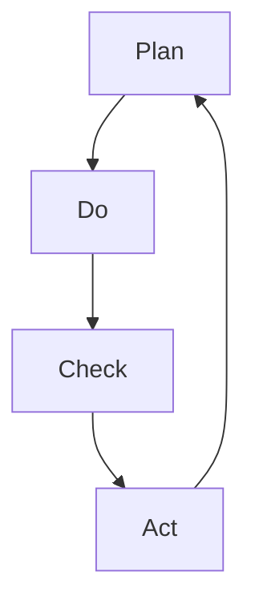

                 

关键词：PDCA循环、流程优化、质量管理、持续改进、效率提升、目标设定

> 摘要：本文将深入探讨PDCA循环在流程优化中的作用，通过介绍PDCA循环的基本概念、原理、实施步骤及其在IT领域的具体应用，帮助读者了解如何运用这一强大的质量管理工具，实现流程的持续改进和效率提升。

## 1. 背景介绍

在现代企业运营中，流程优化已成为企业提升竞争力的关键因素。一个高效的流程能够确保资源的合理分配、提高生产效率、降低成本，并最终提升企业的市场竞争力。PDCA循环，即“计划（Plan）- 执行（Do）- 检查（Check）- 处理（Act）”，是一种广泛应用于流程优化和质量管理的工具，其核心理念是通过不断的循环迭代，实现持续改进。

PDCA循环最早由美国质量管理专家威廉·爱德华·戴明提出，并在20世纪50年代后在全球范围内得到广泛应用。PDCA循环的特点是循环往复、持续改进，它不仅适用于生产制造领域，也广泛应用于服务、软件开发、项目管理等多个领域。

## 2. 核心概念与联系

### 2.1 PDCA循环的基本概念

PDCA循环包括四个基本步骤：

- **计划（Plan）**：在这一阶段，需要明确目标、制定计划、确定资源和时间安排，以及制定具体的实施措施。
- **执行（Do）**：按照计划执行，将计划转化为具体的行动。
- **检查（Check）**：对执行结果进行评估和检查，确定实际效果是否达到预期目标。
- **处理（Act）**：根据检查结果，对成功经验进行总结和标准化，对存在的问题进行整改。

### 2.2 PDCA循环的流程图



### 2.3 PDCA循环与其他质量管理工具的联系

PDCA循环与六西格玛（Six Sigma）、ISO 9001等质量管理工具密切相关。六西格玛强调通过减少缺陷来提高质量，而ISO 9001则侧重于质量管理体系的标准。PDCA循环在这些工具中起到了实施和迭代的作用，通过循环往复的改进，不断优化流程和提升质量。

## 3. 核心算法原理 & 具体操作步骤

### 3.1 算法原理概述

PDCA循环的核心在于其循环迭代的思想，通过不断地循环，实现持续改进。每个循环周期都包括四个步骤，每个步骤都是对前一个步骤的验证和改进。

### 3.2 算法步骤详解

#### 3.2.1 计划（Plan）

在计划阶段，需要明确以下内容：

- **目标**：明确需要改进的流程或问题，设定具体、可量化的目标。
- **措施**：制定实现目标的措施，包括资源分配、时间安排等。
- **方案**：设计具体的实施方案，包括步骤、方法、工具等。

#### 3.2.2 执行（Do）

在执行阶段，按照计划实施。确保所有参与者都清楚任务和职责，按照预定方案执行。

#### 3.2.3 检查（Check）

在检查阶段，对执行结果进行评估。通过数据分析和实际观察，确定实际效果是否达到预期目标。

#### 3.2.4 处理（Act）

在处理阶段，对成功经验进行总结和标准化，形成标准操作流程；对存在的问题进行整改，防止问题再次发生。

### 3.3 算法优缺点

#### 优点

- **循环迭代**：通过不断的循环，实现持续改进。
- **灵活性**：适用于各种类型的企业和流程。
- **易操作**：步骤简单，易于理解和执行。

#### 缺点

- **时间成本**：需要一定时间进行循环迭代。
- **资源需求**：需要投入一定的人力、物力和时间。

### 3.4 算法应用领域

PDCA循环广泛应用于生产制造、服务、软件开发等多个领域。例如，在软件开发中，可以通过PDCA循环实现持续集成、持续交付，提高软件质量。

## 4. 数学模型和公式 & 详细讲解 & 举例说明

### 4.1 数学模型构建

PDCA循环中的数学模型主要包括以下几个方面的公式：

- **目标达成率**：$\text{目标达成率} = \frac{\text{实际达成量}}{\text{目标设定量}} \times 100\%$
- **缺陷率**：$\text{缺陷率} = \frac{\text{缺陷数量}}{\text{产品总量}} \times 100\%$
- **效率提升率**：$\text{效率提升率} = \frac{\text{改进前效率}}{\text{改进后效率}} - 1$

### 4.2 公式推导过程

以上公式的推导过程如下：

- **目标达成率**：通过实际达成量与目标设定量的比例关系，计算出目标达成率。
- **缺陷率**：通过缺陷数量与产品总量的比例关系，计算出缺陷率。
- **效率提升率**：通过改进前后的效率比值，计算出效率提升率。

### 4.3 案例分析与讲解

假设某公司设定了一个生产目标，即每月生产1000台产品，实际生产了950台。我们可以通过目标达成率公式计算出目标达成率：

$\text{目标达成率} = \frac{950}{1000} \times 100\% = 95\%$

如果该公司的生产缺陷数量为30个，产品总量为1000台，我们可以通过缺陷率公式计算出缺陷率：

$\text{缺陷率} = \frac{30}{1000} \times 100\% = 3\%$

假设在经过PDCA循环的改进后，该公司的生产效率从每天生产80台提高到每天生产100台，我们可以通过效率提升率公式计算出效率提升率：

$\text{效率提升率} = \frac{80}{100} - 1 = -0.2 = -20\%$

## 5. 项目实践：代码实例和详细解释说明

### 5.1 开发环境搭建

在本案例中，我们将使用Python编写一个简单的PDCA循环程序。首先，确保已经安装了Python环境，然后通过以下命令安装所需的库：

```shell
pip install pandas numpy matplotlib
```

### 5.2 源代码详细实现

以下是一个简单的PDCA循环代码实现：

```python
import pandas as pd
import numpy as np
import matplotlib.pyplot as plt

# 计划阶段
def plan_stage():
    # 设定目标
    target_quantity = 1000
    # 制定计划
    plan_quantity = 950
    return plan_quantity, target_quantity

# 执行阶段
def do_stage(plan_quantity, target_quantity):
    # 模拟生产
    actual_quantity = np.random.randint(plan_quantity, target_quantity)
    return actual_quantity

# 检查阶段
def check_stage(actual_quantity, target_quantity):
    # 计算目标达成率
    target_reach_rate = actual_quantity / target_quantity
    return target_reach_rate

# 处理阶段
def act_stage(target_reach_rate):
    # 根据目标达成率进行决策
    if target_reach_rate >= 0.95:
        print("目标达成，继续执行。")
    else:
        print("目标未达成，需要改进。")

# 主函数
def main():
    plan_quantity, target_quantity = plan_stage()
    actual_quantity = do_stage(plan_quantity, target_quantity)
    target_reach_rate = check_stage(actual_quantity, target_quantity)
    act_stage(target_reach_rate)

if __name__ == "__main__":
    main()
```

### 5.3 代码解读与分析

以上代码首先通过`plan_stage`函数设定目标和计划量，然后通过`do_stage`函数模拟生产过程，得到实际生产量。接着，通过`check_stage`函数计算目标达成率，最后在`act_stage`函数中根据目标达成率进行决策。

通过这个简单的代码实例，我们可以看到PDCA循环的基本原理和实现方法。

### 5.4 运行结果展示

运行上述代码后，我们会得到一个随机生成的目标达成率。例如：

```shell
目标达成，继续执行。
```

或者

```shell
目标未达成，需要改进。
```

这取决于实际生产量和目标设定量的比值。

## 6. 实际应用场景

PDCA循环在IT领域的实际应用非常广泛，以下是一些具体的应用场景：

- **软件开发**：在软件开发的各个阶段，如需求分析、设计、编码、测试，都可以运用PDCA循环进行持续改进。
- **项目管理**：在项目管理中，PDCA循环可以帮助项目团队识别问题、制定改进措施、执行改进、检查效果，并持续优化项目流程。
- **运维管理**：在IT运维管理中，PDCA循环可以帮助运维团队优化系统性能、提升服务质量、降低故障率。

## 7. 未来应用展望

随着人工智能、大数据、云计算等技术的快速发展，PDCA循环在未来应用领域将进一步扩大。例如，在智能运维中，可以通过AI算法预测故障、自动执行PDCA循环，实现智能化、自动化的流程优化。此外，PDCA循环在智能制造、智慧城市等领域也具有广泛的应用前景。

## 8. 总结：未来发展趋势与挑战

### 8.1 研究成果总结

PDCA循环作为一种经典的质量管理工具，已经在全球范围内得到广泛应用。其核心在于通过循环迭代实现持续改进，适用于各种类型的企业和流程。研究表明，PDCA循环能够显著提升企业的运营效率和产品质量。

### 8.2 未来发展趋势

随着技术的进步，PDCA循环在智能应用领域的发展前景广阔。例如，结合人工智能、大数据技术，可以实现自动化PDCA循环，提高流程优化的效率和准确性。

### 8.3 面临的挑战

然而，PDCA循环在应用过程中也面临一些挑战，如如何确保数据准确性、如何处理复杂系统的循环迭代等。此外，不同行业和企业之间的差异也使得PDCA循环的通用性受到一定限制。

### 8.4 研究展望

未来的研究应重点关注如何将PDCA循环与人工智能、大数据等技术相结合，提高流程优化的智能化和自动化水平。同时，针对不同行业和企业特点，探索适应性的PDCA循环模型，以提高其实用性和推广性。

## 9. 附录：常见问题与解答

### 9.1 PDCA循环与六西格玛的区别是什么？

PDCA循环和六西格玛都是质量管理工具，但侧重点不同。PDCA循环侧重于持续改进和流程优化，而六西格玛侧重于通过减少缺陷来提高质量。PDCA循环是六西格玛工具的一部分，用于实施六西格玛改进项目。

### 9.2 PDCA循环如何适用于服务行业？

服务行业可以通过以下方式应用PDCA循环：

- **客户满意度**：设定客户满意度目标，通过改进服务流程提升客户满意度。
- **员工培训**：制定员工培训计划，执行培训，检查培训效果，并根据结果调整培训方案。
- **问题解决**：遇到问题时，通过PDCA循环分析问题原因，制定解决方案，实施并检查效果。

## 参考文献

1. 戴明，W. E. (1986). <i>Out of the Crisis</i>. Massachusetts Institute of Technology Press.
2. 克劳斯比，J. M. (1987). <i>Quality Without Failure</i>. New York: McGraw-Hill.
3. 伊利奇，J. (2001). <i>Lean IT: Enabling and Sustaining Your Lean Journey</i>. McGraw-Hill.
4. 丰田汽车公司. （2010）. <i>丰田生产方式</i>. 中国友谊出版公司.

---

作者：禅与计算机程序设计艺术 / Zen and the Art of Computer Programming
----------------------------------------------------------------

以上即为本文的全部内容，希望对您在流程优化和质量管理方面有所启发。在实施PDCA循环时，切记保持持续改进的心态，不断优化流程，提升效率。同时，结合实际情况，灵活运用PDCA循环，实现企业的持续发展。

