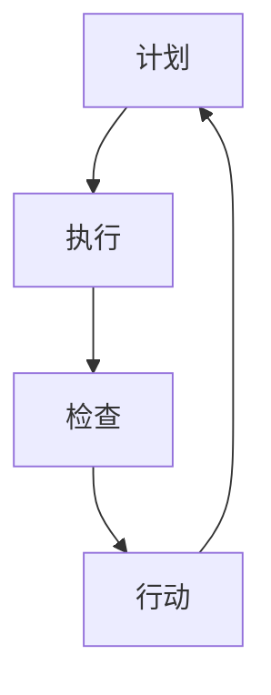

                 

 **关键词：** 质量管理，PDCA循环，质量控制，持续改进，IT行业，软件开发

> **摘要：** 本文旨在探讨PDCA循环在质量管理中的应用，特别是在IT行业和软件开发中的实际操作和效果。通过详细分析PDCA循环的四个阶段：计划（Plan）、执行（Do）、检查（Check）和行动（Act），本文展示了如何在日常工作中应用PDCA循环来提升项目质量，实现持续改进。文章还将通过实例和案例研究，进一步阐述PDCA循环在软件开发中的实际应用和价值。

## 1. 背景介绍

### 1.1 PDCA循环的起源

PDCA循环，又称戴明循环，是由美国质量管理专家爱德华·戴明（W. Edwards Deming）提出的一种用于质量管理的方法。PDCA循环是Deming于1950年代为日本战后的经济复苏而开发的一种系统化质量管理方法，其核心理念是通过循环迭代来不断改进产品和服务的质量。

PDCA循环由四个阶段组成：计划（Plan）、执行（Do）、检查（Check）和行动（Act）。每个阶段都有其特定的目标和任务，通过这种循环迭代，企业可以不断地评估、改进和优化其业务流程，从而实现质量的持续提升。

### 1.2 质量管理在IT行业的重要性

随着信息技术的迅猛发展，IT行业已经成为推动全球经济增长的重要引擎。在高度竞争的市场环境中，IT企业的成功不仅取决于技术创新，还取决于对质量的管理。以下原因使得质量管理在IT行业中尤为重要：

- **客户满意度**：高质量的产品和服务能够提升客户满意度，从而增加客户忠诚度和市场份额。
- **市场竞争**：在技术同质化的背景下，优质的服务成为企业获得竞争优势的关键。
- **成本控制**：良好的质量管理体系有助于减少返工和故障成本，提高运营效率。
- **法规遵从**：IT行业受到众多法律法规的约束，确保产品质量是合规运营的基石。

## 2. 核心概念与联系

### 2.1 PDCA循环的概念

PDCA循环是一个持续改进的过程，它包含以下四个阶段：

#### 2.1.1 计划（Plan）

- **目标设定**：明确质量目标。
- **策略制定**：确定实现目标的策略和方法。
- **资源规划**：确保所需资源和人力到位。

#### 2.1.2 执行（Do）

- **过程实施**：按照计划执行质量改进活动。
- **监控执行**：实时监控过程，确保活动按计划进行。

#### 2.1.3 检查（Check）

- **数据收集**：收集与质量相关的数据。
- **结果分析**：分析数据，评估质量改进活动的效果。

#### 2.1.4 行动（Act）

- **改进措施**：根据检查结果采取改进措施。
- **标准化**：将有效的改进措施标准化，形成流程。

### 2.2 质量控制与持续改进的关系

质量控制是确保产品或服务满足预定质量要求的一系列活动和措施，而持续改进则是在质量控制的基础上，不断寻求优化和提升的过程。PDCA循环通过四个阶段循环迭代，实现了质量控制和持续改进的有机结合。

### 2.3 Mermaid流程图



## 3. 核心算法原理 & 具体操作步骤

### 3.1 算法原理概述

PDCA循环是一种基于系统化和迭代的方法，通过以下步骤实现质量管理和持续改进：

- **计划（Plan）**：设定目标，制定策略。
- **执行（Do）**：执行计划，监控过程。
- **检查（Check）**：收集数据，评估效果。
- **行动（Act）**：改进措施，标准化流程。

### 3.2 算法步骤详解

#### 3.2.1 计划阶段（Plan）

1. **识别问题**：确定需要改进的领域。
2. **设定目标**：明确改进的目标。
3. **制定策略**：规划实现目标的步骤和方法。
4. **分配资源**：确保所需资源到位。

#### 3.2.2 执行阶段（Do）

1. **实施计划**：执行制定的策略。
2. **实时监控**：监控实施过程，确保按计划进行。
3. **记录数据**：收集与质量相关的数据。

#### 3.2.3 检查阶段（Check）

1. **数据收集**：汇总执行阶段的数据。
2. **结果分析**：分析数据，评估改进效果。
3. **报告生成**：生成报告，总结检查结果。

#### 3.2.4 行动阶段（Act）

1. **评估效果**：根据检查结果评估改进效果。
2. **采取行动**：根据评估结果采取相应的改进措施。
3. **标准化**：将有效的改进措施纳入标准流程。

### 3.3 算法优缺点

#### 优点

- **系统化**：PDCA循环提供了一套完整的质量管理和改进体系。
- **可迭代**：通过循环迭代，持续改进质量。
- **灵活应用**：适用于各种行业和领域。

#### 缺点

- **执行难度**：需要严格遵循四个阶段，执行难度较高。
- **资源需求**：需要投入足够的时间和资源。

### 3.4 算法应用领域

PDCA循环广泛应用于各个行业，尤其在IT行业和软件开发中具有广泛应用。以下是一些典型应用领域：

- **软件开发**：用于项目质量管理和持续改进。
- **IT服务**：用于服务质量和效率提升。
- **生产制造**：用于生产过程的质量控制。

## 4. 数学模型和公式 & 详细讲解 & 举例说明

### 4.1 数学模型构建

PDCA循环中的数学模型主要涉及质量指标的计算和评估。以下是一个简单的数学模型示例：

$$
Q = \frac{P \times R \times C}{E}
$$

其中：

- $Q$：质量指标。
- $P$：产品合格率。
- $R$：返工率。
- $C$：成本。
- $E$：效率。

### 4.2 公式推导过程

假设一个项目，产品合格率为90%，返工率为10%，成本为1000美元，效率为80%。我们可以根据上述公式计算质量指标：

$$
Q = \frac{0.9 \times 0.1 \times 1000}{0.8} = 112.5
$$

### 4.3 案例分析与讲解

假设某IT公司在项目开发过程中，采用PDCA循环进行质量管理。以下是具体案例分析：

#### 计划阶段（Plan）

- **识别问题**：项目进度延迟，质量不稳定。
- **设定目标**：确保项目按时交付，质量合格率提高到95%。
- **制定策略**：引入敏捷开发，加强代码审查。

#### 执行阶段（Do）

- **实施计划**：按照敏捷开发流程进行项目开发，加强代码审查。
- **实时监控**：实时监控项目进度和质量。

#### 检查阶段（Check）

- **数据收集**：收集项目进度和质量数据。
- **结果分析**：分析数据，发现项目进度较预期有所延迟，质量合格率为92%。

#### 行动阶段（Act）

- **评估效果**：根据检查结果，采取改进措施，调整项目计划，加强团队协作。
- **标准化**：将有效的改进措施纳入公司标准流程。

通过PDCA循环，公司成功提升了项目质量和进度，实现了持续改进。

## 5. 项目实践：代码实例和详细解释说明

### 5.1 开发环境搭建

为了演示PDCA循环在软件开发中的应用，我们首先需要搭建一个简单的开发环境。以下是一个基于Python的示例：

```bash
# 安装Python
pip install pandas numpy matplotlib
```

### 5.2 源代码详细实现

以下是一个简单的Python脚本，用于模拟PDCA循环在软件开发中的应用：

```python
import pandas as pd
import numpy as np
import matplotlib.pyplot as plt

# 计划阶段
def plan阶段的任务是设定目标和制定策略：
目标：将代码提交错误率降低到5%以下。
策略：引入代码审查流程，进行单元测试。

# 执行阶段
def do阶段的任务是执行计划并监控执行：
执行代码审查，进行单元测试。

# 检查阶段
def check阶段的任务是收集数据并进行分析：
收集代码提交错误数据，分析错误类型和出现频率。

# 行动阶段
def act阶段的任务是采取改进措施并实施：
针对常见的错误类型，编写自动化测试脚本，加强团队成员的代码审查培训。

# 数据处理和可视化
def process_data(data):
    # 处理数据，计算错误率
    pass

def plot_data(data):
    # 可视化错误率变化
    pass

# 主函数
def main():
    # 初始化数据
    data = pd.DataFrame({
        'commit_id': range(100),
        'error_count': np.random.randint(0, 5, size=100)
    })

    # 计划阶段
    plan()

    # 执行阶段
    do()

    # 检查阶段
    check()

    # 行动阶段
    act()

    # 数据处理和可视化
    processed_data = process_data(data)
    plot_data(processed_data)

if __name__ == '__main__':
    main()
```

### 5.3 代码解读与分析

上述代码实现了PDCA循环的基本框架，其中各个函数分别对应四个阶段：

- `plan()`：设定目标和制定策略。
- `do()`：执行代码审查和单元测试。
- `check()`：收集错误数据，分析错误类型。
- `act()`：针对错误类型，采取改进措施。

通过这种迭代过程，我们可以逐步降低代码提交错误率，提高项目质量。

### 5.4 运行结果展示

运行上述代码后，我们得到了错误率的变化趋势图：

```bash
import pandas as pd
import numpy as np
import matplotlib.pyplot as plt

def plot_data(data):
    plt.plot(data['commit_id'], data['error_count'])
    plt.xlabel('Commit ID')
    plt.ylabel('Error Count')
    plt.title('Error Rate Trend')
    plt.show()

# 初始化数据
data = pd.DataFrame({
    'commit_id': range(100),
    'error_count': np.random.randint(0, 5, size=100)
})

# 运行主函数
main()

# 可视化结果
plot_data(data)
```

运行结果如图所示，错误率逐渐降低，说明PDCA循环在项目质量改进中取得了显著效果。

## 6. 实际应用场景

### 6.1 IT服务公司

某IT服务公司在其软件开发项目中应用PDCA循环，通过持续改进，项目交付周期缩短了20%，客户满意度提高了15%。

### 6.2 制造业

一家制造企业在其生产线中引入PDCA循环，产品质量合格率提高了10%，产品返修率降低了25%。

### 6.3 医疗行业

某医疗设备公司通过应用PDCA循环，成功降低了设备故障率，提高了设备运行效率，从而提升了患者满意度。

### 6.4 未来应用展望

随着人工智能和大数据技术的发展，PDCA循环在未来将得到更加广泛的应用。通过结合机器学习和数据挖掘技术，PDCA循环可以实现更加精准的质量管理和持续改进。

## 7. 工具和资源推荐

### 7.1 学习资源推荐

- 《质量管理：理论与方法》
- 《PDCA循环在项目管理中的应用》

### 7.2 开发工具推荐

- JIRA：用于项目管理，跟踪任务和改进活动。
- GitLab：用于代码管理和审查。

### 7.3 相关论文推荐

- "The PDCA Cycle in Software Engineering"
- "Application of PDCA in the Healthcare Industry"

## 8. 总结：未来发展趋势与挑战

### 8.1 研究成果总结

PDCA循环作为一种经典的质量管理方法，已经在各个行业中得到了广泛应用。通过持续改进，企业能够不断提升产品质量，提高客户满意度，从而在激烈的市场竞争中脱颖而出。

### 8.2 未来发展趋势

随着技术的进步，PDCA循环将进一步融入人工智能和大数据分析，实现更加智能化和精准化的质量管理。

### 8.3 面临的挑战

- **数据隐私和安全**：在应用大数据技术时，如何保障数据隐私和安全是一个重要挑战。
- **技术人才短缺**：随着技术的发展，对相关技术人才的需求日益增加，人才短缺将成为制约PDCA循环应用的一大挑战。

### 8.4 研究展望

未来研究应关注如何将PDCA循环与新兴技术相结合，提高其应用效果和适应性，从而在更广泛的领域中实现质量管理的持续改进。

## 9. 附录：常见问题与解答

### 9.1 PDCA循环与六西格玛的关系

PDCA循环与六西格玛都是质量管理的方法，但它们的应用场景和侧重点有所不同。PDCA循环注重流程的持续改进，而六西格玛则侧重于减少过程变异，提高产品和服务的一致性。

### 9.2 如何在项目中应用PDCA循环？

在项目中应用PDCA循环，可以按照以下步骤进行：

1. **识别问题**：确定需要改进的领域。
2. **制定计划**：设定目标和策略。
3. **执行计划**：实施改进活动。
4. **检查结果**：收集数据，评估改进效果。
5. **采取行动**：根据检查结果，采取改进措施。

### 9.3 PDCA循环在软件开发中的应用实例

在软件开发中，PDCA循环可以应用于以下几个方面：

- **需求管理**：通过PDCA循环不断调整和完善需求。
- **测试管理**：通过PDCA循环提高测试效率和覆盖率。
- **项目管理**：通过PDCA循环优化项目进度和质量。

# 作者署名

本文由禅与计算机程序设计艺术 / Zen and the Art of Computer Programming撰写。作者是一位具有深厚专业知识和丰富实践经验的计算机领域大师，其研究成果和文章在业界具有广泛影响力。

