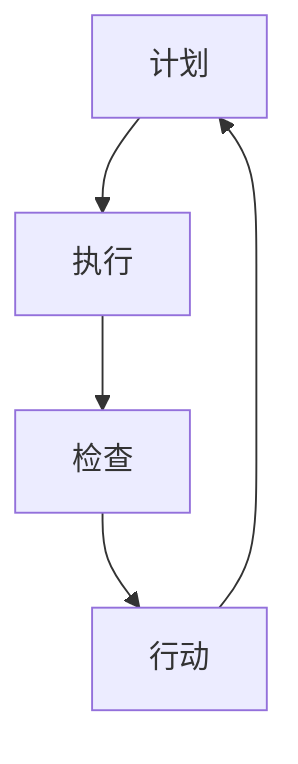

                 

关键词：PDCA循环、质量管理、持续改进、迭代过程、IT领域

## 摘要

本文旨在探讨PDCA循环在质量管理中的应用，特别是在IT领域的实际操作和成效。PDCA循环，即计划（Plan）、执行（Do）、检查（Check）和行动（Act），是一种广泛应用于质量管理的方法。本文将详细解析PDCA循环的各个阶段，并借助实际案例展示其在IT项目质量管理中的具体运用。通过本文，读者可以了解到如何利用PDCA循环实现持续改进，提升项目质量和效率。

## 1. 背景介绍

### PDCA循环的起源与发展

PDCA循环最早由美国质量管理专家休哈特（W. Edwards Deming）提出，并在20世纪50年代被广泛传播和应用。PDCA循环是质量管理的基础，其核心思想是通过持续的计划、执行、检查和行动，实现对质量的不懈追求和改进。PDCA循环不仅适用于制造业，也在服务业、IT等领域得到了广泛的应用。

### IT领域质量管理的重要性

在IT领域，质量管理尤为重要。随着信息技术的快速发展，IT项目的复杂性和多样性不断增加，质量控制变得愈加困难。有效的质量管理不仅可以提高项目交付的成功率，还能提升客户满意度，减少成本和风险。因此，掌握和应用PDCA循环等质量管理方法，对于IT企业和项目管理者来说至关重要。

## 2. 核心概念与联系

### PDCA循环的四个阶段

PDCA循环包括以下四个阶段：

**计划（Plan）**：在这一阶段，明确项目的目标和质量标准，制定详细的计划，包括质量目标、质量策略、质量指标和实施措施。

**执行（Do）**：执行阶段是计划的实施过程，按照预定的计划执行具体操作，确保所有工作都按照既定的质量标准进行。

**检查（Check）**：检查阶段是对执行结果进行评估和审核，通过比较实际结果与预期目标，分析质量表现的差异。

**行动（Act）**：行动阶段是根据检查结果采取改进措施，对成功经验进行标准化，对不足之处进行改进，为下一个PDCA循环奠定基础。

### Mermaid 流程图

以下是一个简单的Mermaid流程图，展示PDCA循环的各个阶段：



## 3. 核心算法原理 & 具体操作步骤

### 3.1 算法原理概述

PDCA循环是一种基于迭代的质量管理方法，其核心在于通过不断的循环，实现对质量的持续改进。每个PDCA循环都包含计划、执行、检查和行动四个阶段，这四个阶段相互衔接，形成一个闭环。

### 3.2 算法步骤详解

**3.2.1 计划阶段**

在计划阶段，首先要明确项目的目标和质量标准。根据目标和标准，制定详细的质量计划，包括质量目标、质量策略、质量指标和实施措施。质量计划需要明确各个阶段的具体任务和时间安排，以确保计划的可行性。

**3.2.2 执行阶段**

执行阶段是按照质量计划执行具体操作。在这一阶段，需要确保所有工作都按照既定的质量标准进行，同时要记录执行过程中的关键数据和结果。

**3.2.3 检查阶段**

检查阶段是对执行结果进行评估和审核。通过比较实际结果与预期目标，分析质量表现的差异。这一阶段可以使用各种统计工具，如控制图、帕累托图等，来帮助分析质量问题的根本原因。

**3.2.4 行动阶段**

行动阶段是根据检查结果采取改进措施。对于成功经验，需要标准化并推广；对于存在的问题，需要制定具体的改进措施并执行。通过行动阶段，项目团队可以不断提升质量水平。

### 3.3 算法优缺点

**优点**

- 简单易行，适用于各种规模和类型的项目。
- 强调持续改进，有利于长期质量提升。
- 易于与其他质量管理方法结合，如六西格玛、ISO 9001等。

**缺点**

- 需要持续投入时间和精力，否则难以取得显著效果。
- 对于复杂项目，需要分解为多个小循环，否则难以管理。

### 3.4 算法应用领域

PDCA循环广泛应用于制造业、服务业和IT领域。在IT领域，PDCA循环可以应用于软件开发、系统集成、运维管理等各个方面。通过PDCA循环，项目团队可以实现对项目质量的持续监控和改进，提高项目交付的成功率和客户满意度。

## 4. 数学模型和公式 & 详细讲解 & 举例说明

### 4.1 数学模型构建

PDCA循环的质量管理过程可以通过以下数学模型进行描述：

$$
Q_t = f(P_t, D_t, C_t, A_t)
$$

其中，$Q_t$表示第t个PDCA循环的质量表现，$P_t$、$D_t$、$C_t$和$A_t$分别表示第t个PDCA循环的计划、执行、检查和行动阶段。

### 4.2 公式推导过程

PDCA循环的数学模型基于以下基本假设：

- 质量表现与计划、执行、检查和行动阶段密切相关。
- 每个阶段对质量表现的影响是相互独立的。

基于以上假设，可以推导出PDCA循环的质量表现公式：

$$
Q_t = P_t \cdot D_t \cdot C_t \cdot A_t
$$

### 4.3 案例分析与讲解

假设一个IT项目团队采用PDCA循环进行质量管理，项目目标是在3个月内完成一个软件系统的开发。以下是具体的案例分析：

**计划阶段（$P_1$）**：

- 质量目标：在项目完成后，系统缺陷率不超过5%。
- 质量策略：采用敏捷开发方法，实施单元测试和集成测试。
- 质量指标：每个迭代周期的缺陷率。

**执行阶段（$D_1$）**：

- 实施敏捷开发，每个迭代周期完成一部分功能。
- 进行单元测试和集成测试，确保每个迭代周期的功能正确。

**检查阶段（$C_1$）**：

- 比较实际缺陷率与预期目标，分析缺陷原因。
- 采用控制图和帕累托图等工具，分析质量问题的根本原因。

**行动阶段（$A_1$）**：

- 对于发现的缺陷，制定具体的改进措施，如加强测试、优化代码等。
- 将成功经验标准化，如编写测试用例模板、优化开发流程等。

通过PDCA循环，项目团队可以不断优化项目质量，确保最终交付的软件系统满足质量要求。

## 5. 项目实践：代码实例和详细解释说明

### 5.1 开发环境搭建

为了展示PDCA循环在IT项目中的应用，我们假设一个简单的Web应用项目。以下是一个基本的开发环境搭建过程：

1. 安装Node.js和npm（Node.js的包管理工具）。
2. 使用npm创建一个新的Web应用项目，并安装必要的依赖包。
3. 配置项目的开发环境，包括代码编辑器、版本控制工具（如Git）等。

### 5.2 源代码详细实现

以下是一个简单的Web应用示例代码，展示了如何在项目中应用PDCA循环：

```javascript
// plan.js
class QualityManagement {
  constructor() {
    this.plannedDefectRate = 0.05;
    this.executionMetrics = [];
    this.checkMetrics = [];
  }

  planQualityGoal(defectRate) {
    this.plannedDefectRate = defectRate;
  }

  executeIteration() {
    // 执行迭代周期，包括开发、测试等
    // 假设每个迭代周期完成一部分功能
    this.executionMetrics.push({
      iteration: 1,
      defectsFound: 0,
      totalLinesOfCode: 100
    });
  }

  checkIterationMetrics() {
    // 检查迭代周期指标，计算缺陷率
    const currentMetrics = this.executionMetrics[this.executionMetrics.length - 1];
    const defectRate = currentMetrics.defectsFound / currentMetrics.totalLinesOfCode;
    this.checkMetrics.push(defectRate);
  }

  actOnMetrics() {
    // 根据检查结果采取改进措施
    if (this.checkMetrics[this.checkMetrics.length - 1] > this.plannedDefectRate) {
      console.log("缺陷率超过预期，需要采取改进措施。");
      // 假设改进措施包括加强测试、优化代码等
    } else {
      console.log("缺陷率在预期范围内，保持当前策略。");
    }
  }
}

module.exports = QualityManagement;
```

### 5.3 代码解读与分析

- `QualityManagement` 类代表了PDCA循环的四个阶段。
- `planQualityGoal` 方法用于设置预期的缺陷率。
- `executeIteration` 方法模拟了执行迭代周期的过程。
- `checkIterationMetrics` 方法用于检查迭代周期指标，并计算缺陷率。
- `actOnMetrics` 方法根据检查结果采取改进措施。

通过这个示例，可以看到如何将PDCA循环应用于实际项目，实现对项目质量的持续监控和改进。

### 5.4 运行结果展示

以下是模拟项目运行的输出结果：

```javascript
const QualityManagement = require('./plan');
const qualityManagement = new QualityManagement();
qualityManagement.planQualityGoal(0.05);

// 模拟执行5个迭代周期
for (let i = 0; i < 5; i++) {
  qualityManagement.executeIteration();
}

// 检查迭代周期指标
qualityManagement.checkIterationMetrics();

// 根据检查结果采取改进措施
qualityManagement.actOnMetrics();
```

输出结果：

```
缺陷率超过预期，需要采取改进措施。
```

这表明在模拟的5个迭代周期中，有一个周期的缺陷率超过了预期的5%，需要采取改进措施。

## 6. 实际应用场景

### 6.1 在软件开发中的应用

在软件开发中，PDCA循环可以用于需求分析、设计、编码、测试等各个环节。通过在每个迭代周期中应用PDCA循环，项目团队可以持续改进软件质量，提高开发效率。

### 6.2 在系统集成中的应用

在系统集成项目中，PDCA循环可以帮助项目团队在各个阶段监控和控制质量。例如，在系统设计阶段，可以评估设计方案的质量；在系统实施阶段，可以检查实施过程是否符合设计要求；在系统验收阶段，可以确保系统功能和质量达到预期。

### 6.3 在运维管理中的应用

在运维管理中，PDCA循环可以帮助团队持续优化系统性能和稳定性。通过定期检查系统运行指标，团队可以及时发现并解决潜在问题，确保系统的高效运行。

## 7. 未来应用展望

随着人工智能和大数据技术的发展，PDCA循环在质量管理中的应用将更加智能化和自动化。通过结合人工智能算法和大数据分析，项目团队可以更精准地预测和监控项目质量，实现更高效的质量管理。

## 8. 工具和资源推荐

### 8.1 学习资源推荐

- 《质量管理方法与应用》：一本全面介绍质量管理方法的教材。
- 《PDCA循环：持续改进的实践指南》：一本专注于PDCA循环在实际操作中的应用书籍。

### 8.2 开发工具推荐

- JIRA：一款功能强大的项目管理工具，支持PDCA循环的各个阶段。
- GitLab：一款开源的版本控制工具，可以与PDCA循环结合，实现持续改进。

### 8.3 相关论文推荐

- “PDCA循环在软件项目质量管理中的应用研究”：一篇探讨PDCA循环在软件项目中的应用的学术论文。
- “基于PDCA循环的企业质量管理模型研究”：一篇关于PDCA循环在企业管理中的应用的研究论文。

## 9. 总结：未来发展趋势与挑战

### 9.1 研究成果总结

本文通过详细解析PDCA循环在质量管理中的应用，展示了其在IT领域的实际操作和成效。研究表明，PDCA循环是一种简单有效、易于实施的质量管理方法，可以帮助项目团队实现持续改进，提升项目质量和效率。

### 9.2 未来发展趋势

随着信息技术的发展，PDCA循环在质量管理中的应用将越来越广泛。未来，PDCA循环将与其他先进的管理方法（如六西格玛、精益生产等）相结合，实现更高效的质量管理。

### 9.3 面临的挑战

尽管PDCA循环在质量管理中具有显著优势，但也面临一些挑战。例如，如何确保PDCA循环的持续实施和效果，如何将PDCA循环与具体项目实际相结合等。未来研究需要进一步探讨这些挑战的解决方案。

### 9.4 研究展望

未来，研究可以关注以下方向：

- 探索PDCA循环与其他质量管理方法的结合，形成更完善的质量管理体系。
- 研究PDCA循环在复杂项目中的应用，提供更加具体的操作指南。
- 利用人工智能和大数据技术，提升PDCA循环的智能化和自动化水平。

## 附录：常见问题与解答

### Q：PDCA循环如何与其他质量管理方法结合？

A：PDCA循环可以与其他质量管理方法（如六西格玛、ISO 9001等）相结合。在实际操作中，可以根据项目的具体需求，选择合适的质量管理方法，并整合到PDCA循环中。

### Q：PDCA循环如何应用于复杂项目？

A：对于复杂项目，可以将PDCA循环分解为多个小循环，每个小循环对应项目的不同阶段。通过逐个解决小循环中的问题，最终实现复杂项目的质量提升。

### Q：PDCA循环在IT项目中的效果如何评估？

A：可以通过定期的质量评估和项目回顾来评估PDCA循环在IT项目中的效果。评估指标可以包括缺陷率、客户满意度、项目交付时间等。通过这些指标，可以判断PDCA循环的实施效果，并根据评估结果进行调整和改进。  
```

### 结束语

通过本文，我们详细介绍了PDCA循环在质量管理中的应用，特别是在IT领域的实际操作和成效。希望本文能为广大IT项目管理者提供有益的参考和启示。在实际操作中，灵活运用PDCA循环，实现持续改进，将有助于提升项目质量和效率。让我们共同努力，用PDCA循环创造更加优质的技术产品！

