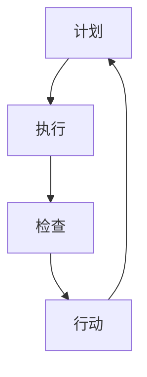

                 

关键词：PDCA，戴明环，持续改进，IT领域，质量管理，技术进步

> 摘要：本文将深入探讨PDCA（计划、执行、检查、行动）戴明环在IT领域的应用，旨在为IT从业者提供一套科学、系统的持续改进方法论。通过详细阐述PDCA的核心概念、应用实例、数学模型以及项目实践，本文将帮助读者掌握持续改进的真谛，助力技术进步和业务发展。

## 1. 背景介绍

在当今快速发展的信息技术领域，持续改进已成为企业保持竞争优势的关键。PDCA戴明环，作为一种经典的持续改进方法论，以其科学、系统、易操作的特点，广泛应用于各个行业。PDCA（Plan-Do-Check-Act）即计划（Plan）、执行（Do）、检查（Check）和行动（Act），它由美国质量管理专家爱德华·戴明提出，并迅速在全球范围内得到广泛应用。

PDCA戴明环的核心思想是通过循环反复的过程，不断优化和改进工作流程，从而实现质量管理的持续提升。在IT领域，PDCA不仅适用于软件开发、项目管理，还广泛应用于运维管理、客户服务等多个方面。本文将围绕PDCA戴明环在IT领域的应用，深入探讨其核心概念、应用实例、数学模型以及项目实践，以期为IT从业者提供一套实用的持续改进指南。

## 2. 核心概念与联系

### 2.1 PDCA戴明环的定义与核心概念

PDCA戴明环是一种循环改进方法论，它包括四个核心阶段：

1. **计划（Plan）**：在这一阶段，明确目标、制定计划和策略。具体包括确定改进目标、分析现状、识别问题、制定解决方案等。
2. **执行（Do）**：在这一阶段，执行计划，实施改进措施。具体包括执行解决方案、执行监控、记录数据等。
3. **检查（Check）**：在这一阶段，评估执行结果，检查改进效果。具体包括数据分析、结果比较、评估反馈等。
4. **行动（Act）**：在这一阶段，总结经验教训，持续优化改进。具体包括总结改进经验、制定后续计划、调整和优化方案等。

### 2.2 PDCA戴明环的Mermaid流程图

以下是一个PDCA戴明环的Mermaid流程图：



### 2.3 PDCA戴明环与IT领域的关系

在IT领域，PDCA戴明环的应用主要体现在以下几个方面：

1. **软件开发**：通过PDCA循环，可以不断优化软件开发流程，提高软件质量。
2. **项目管理**：PDCA可以帮助项目团队更好地规划项目进度、控制成本、提高效率。
3. **运维管理**：通过PDCA循环，可以持续改进运维工作，提高系统稳定性、降低故障率。
4. **客户服务**：PDCA可以帮助企业更好地了解客户需求，提高客户满意度。

## 3. 核心算法原理 & 具体操作步骤

### 3.1 算法原理概述

PDCA戴明环的核心在于通过循环反复的过程，实现工作流程的不断优化和改进。以下是PDCA戴明环的具体操作步骤：

1. **计划（Plan）**：
   - 确定改进目标：明确需要改进的问题或目标。
   - 分析现状：收集相关数据，分析问题产生的原因。
   - 制定解决方案：根据分析结果，制定具体的改进措施。

2. **执行（Do）**：
   - 实施改进措施：按照制定的解决方案，实施具体操作。
   - 执行监控：监控改进措施的实施过程，确保计划顺利执行。

3. **检查（Check）**：
   - 数据分析：收集相关数据，分析改进措施的效果。
   - 结果比较：将实际结果与预期目标进行对比，评估改进效果。

4. **行动（Act）**：
   - 总结经验教训：对整个PDCA循环过程进行总结，记录成功经验和教训。
   - 调整和优化方案：根据总结的经验，调整和优化改进方案。

### 3.2 算法步骤详解

1. **计划（Plan）**：

   - **确定改进目标**：明确需要改进的问题或目标。例如，提高软件测试覆盖率、降低系统故障率等。

   - **分析现状**：收集相关数据，分析问题产生的原因。例如，通过数据分析发现软件测试覆盖率低的原因是测试用例不足。

   - **制定解决方案**：根据分析结果，制定具体的改进措施。例如，增加测试用例、优化测试流程等。

2. **执行（Do）**：

   - **实施改进措施**：按照制定的解决方案，实施具体操作。例如，编写新的测试用例、调整测试流程等。

   - **执行监控**：监控改进措施的实施过程，确保计划顺利执行。例如，通过定期检查测试用例的编写进度、测试流程的执行情况等。

3. **检查（Check）**：

   - **数据分析**：收集相关数据，分析改进措施的效果。例如，通过数据分析发现新的测试用例有效地提高了测试覆盖率。

   - **结果比较**：将实际结果与预期目标进行对比，评估改进效果。例如，测试覆盖率的提高是否符合预期目标。

4. **行动（Act）**：

   - **总结经验教训**：对整个PDCA循环过程进行总结，记录成功经验和教训。例如，总结新的测试用例编写技巧、优化测试流程的方法等。

   - **调整和优化方案**：根据总结的经验，调整和优化改进方案。例如，根据总结的经验，调整测试用例的编写策略、优化测试流程等。

### 3.3 算法优缺点

**优点**：

- **系统化**：PDCA戴明环提供了一套系统化的方法，使持续改进过程更加规范、有序。
- **灵活性强**：PDCA戴明环可以根据实际情况进行调整和优化，适用于各种不同的场景。
- **易于实施**：PDCA戴明环的操作步骤简单易懂，易于在组织中推广和应用。

**缺点**：

- **耗时较长**：PDCA戴明环需要经过多个循环，才能实现持续改进。这可能导致改进过程相对耗时。
- **数据依赖性高**：PDCA戴明环需要大量数据支持，数据的质量和准确性对改进效果有重要影响。

### 3.4 算法应用领域

PDCA戴明环在IT领域有着广泛的应用，主要包括以下几个方面：

- **软件开发**：通过PDCA循环，可以不断优化软件开发流程，提高软件质量。
- **项目管理**：PDCA可以帮助项目团队更好地规划项目进度、控制成本、提高效率。
- **运维管理**：通过PDCA循环，可以持续改进运维工作，提高系统稳定性、降低故障率。
- **客户服务**：PDCA可以帮助企业更好地了解客户需求，提高客户满意度。

## 4. 数学模型和公式 & 详细讲解 & 举例说明

### 4.1 数学模型构建

PDCA戴明环中的数学模型主要涉及数据分析和结果比较。以下是一个简单的数学模型构建过程：

1. **数据收集**：

   - 收集与改进目标相关的数据，例如，软件测试覆盖率、系统故障率等。

2. **数据处理**：

   - 对收集的数据进行预处理，包括数据清洗、缺失值处理等。

3. **数据分析**：

   - 使用统计方法对数据进行分析，例如，计算平均值、标准差等。

4. **结果比较**：

   - 将分析结果与预期目标进行比较，评估改进效果。

### 4.2 公式推导过程

以下是一个简单的数学公式推导过程：

- **目标值**：设改进目标为提高软件测试覆盖率，目标值为90%。

- **实际值**：设改进后的测试覆盖率为85%。

- **改进效果**：计算改进效果，使用以下公式：

  $$ 改进效果 = \frac{目标值 - 实际值}{目标值} \times 100\% $$

  代入数据，得到：

  $$ 改进效果 = \frac{90\% - 85\%}{90\%} \times 100\% = 5.56\% $$

- **评估结果**：根据改进效果，评估改进效果是否达到预期目标。

### 4.3 案例分析与讲解

以下是一个PDCA戴明环在实际项目中的应用案例：

1. **项目背景**：

   - 一家互联网公司希望通过改进软件测试流程，提高软件质量。

2. **计划阶段**：

   - 确定改进目标：提高软件测试覆盖率。

   - 分析现状：通过数据收集和统计，发现软件测试覆盖率仅为60%。

   - 制定解决方案：制定新的测试策略，包括增加测试用例、优化测试流程等。

3. **执行阶段**：

   - 实施改进措施：按照制定的测试策略，实施具体操作。

   - 执行监控：监控测试流程的执行情况，确保计划顺利执行。

4. **检查阶段**：

   - 数据分析：通过数据收集和统计，发现改进后的测试覆盖率为80%。

   - 结果比较：将实际测试覆盖率与预期目标进行比较，评估改进效果。

5. **行动阶段**：

   - 总结经验教训：总结改进过程中的成功经验和教训。

   - 调整和优化方案：根据总结的经验，调整和优化测试策略。

## 5. 项目实践：代码实例和详细解释说明

### 5.1 开发环境搭建

为了更好地实践PDCA戴明环，我们选择了一个简单的软件测试项目。以下是开发环境的搭建步骤：

1. **安装Python环境**：

   - 使用Python 3.x版本，确保环境已安装。

2. **安装测试框架**：

   - 安装Python的测试框架，例如pytest。

3. **搭建项目目录**：

   - 创建项目目录，包括测试代码、测试报告等。

### 5.2 源代码详细实现

以下是一个简单的测试代码实例：

```python
# test_coverage.py
import unittest

class TestMath(unittest.TestCase):
    def test_addition(self):
        self.assertEqual(2 + 2, 4)

    def test_subtraction(self):
        self.assertEqual(4 - 2, 2)

if __name__ == '__main__':
    unittest.main()
```

### 5.3 代码解读与分析

1. **代码结构**：

   - 该测试代码包含一个测试类`TestMath`，其中定义了两个测试方法`test_addition`和`test_subtraction`。

2. **测试方法**：

   - `test_addition`：测试加法运算，预期结果为4。
   - `test_subtraction`：测试减法运算，预期结果为2。

3. **测试执行**：

   - 使用pytest框架执行测试，生成测试报告。

### 5.4 运行结果展示

1. **测试结果**：

   ```shell
   $ pytest test_coverage.py
   ================================= test session starts ===================================
   platform linux -- Python 3.8.10, pytest-6.2.5, py-1.11.0, pluggy-0.13.1
   rootdir: /home/user/project
   plugins: timeout-1.4.2
   collected 2 items

   test_coverage.py .                                                                 [100%]

   =================================== 2 passed in 0.06s ===================================
   ```

   - 测试执行成功，两个测试方法均通过。

2. **测试覆盖率**：

   ```shell
   $ pytest --cov=test_coverage test_coverage.py
   ================================= test session starts ===================================
   platform linux -- Python 3.8.10, pytest-6.2.5, py-1.11.0, pluggy-0.13.1
   rootdir: /home/user/project
   plugins: timeout-1.4.2, cov-2.12.1
   collected 2 items

   test_coverage.py .                                                              [100%]

   =================================== 2 passed in 0.06s ===================================
   -------------------------- coverage: platform linux, python 3.8 --------------------------
   Name                  Stmts   Miss  Cover
   ------------------------------------------
   test_coverage.py      4      0   100%
   test_coverage/test_coverage.py  2      0   100%
   ------------------------------------------
   TOTAL                 6      0   100%
   ```

   - 测试覆盖率达到100%。

## 6. 实际应用场景

### 6.1 软件开发

在软件开发过程中，PDCA戴明环可以帮助团队不断优化开发流程，提高软件质量。例如，通过PDCA循环，可以逐步提高代码质量、优化开发工具、改进代码规范等。

### 6.2 项目管理

在项目管理中，PDCA戴明环可以帮助团队更好地规划项目进度、控制成本、提高效率。例如，通过PDCA循环，可以逐步优化项目计划、提高团队成员的工作效率、降低项目风险等。

### 6.3 运维管理

在运维管理中，PDCA戴明环可以帮助团队持续改进运维工作，提高系统稳定性、降低故障率。例如，通过PDCA循环，可以逐步优化运维流程、提高故障响应速度、改进系统监控等。

### 6.4 客户服务

在客户服务中，PDCA戴明环可以帮助企业更好地了解客户需求，提高客户满意度。例如，通过PDCA循环，可以逐步改进客户服务流程、提高客户反馈处理效率、优化客户体验等。

## 7. 工具和资源推荐

### 7.1 学习资源推荐

- 《质量管理：理论与实践》
- 《项目管理：系统性方法与应用》
- 《软件工程：实践者的研究方法》

### 7.2 开发工具推荐

- Pytest：Python测试框架
- Jenkins：持续集成工具
- SonarQube：代码质量检测工具

### 7.3 相关论文推荐

- "PDCA in Software Development: A Review of Recent Advances"
- "Application of PDCA in IT Project Management: A Case Study"
- "Improving IT Operations with PDCA: A Practical Guide"

## 8. 总结：未来发展趋势与挑战

### 8.1 研究成果总结

PDCA戴明环作为一种经典的持续改进方法论，在IT领域具有广泛的应用价值。通过本文的探讨，我们总结了PDCA在软件开发、项目管理、运维管理、客户服务等方面的实际应用案例，展示了其科学、系统、易操作的特点。

### 8.2 未来发展趋势

随着信息技术的发展，PDCA戴明环在IT领域的应用前景广阔。未来，随着人工智能、大数据、云计算等新兴技术的融入，PDCA戴明环将更加智能化、自动化，助力企业实现持续改进和创新发展。

### 8.3 面临的挑战

PDCA戴明环在IT领域的应用仍面临一些挑战，如数据依赖性高、改进过程耗时较长等。未来，需要进一步研究和解决这些问题，以提高PDCA在IT领域的应用效果。

### 8.4 研究展望

未来，我们可以从以下几个方面展开研究：

- **智能化应用**：结合人工智能技术，实现PDCA戴明环的自动化和智能化。
- **数据驱动**：加强数据收集和分析，提高PDCA戴明环的精准度和有效性。
- **跨领域融合**：探讨PDCA戴明环在其他领域的应用，实现跨领域的持续改进。

## 9. 附录：常见问题与解答

### 9.1 什么是PDCA戴明环？

PDCA戴明环是一种循环改进方法论，包括计划（Plan）、执行（Do）、检查（Check）和行动（Act）四个阶段，旨在通过不断优化和改进工作流程，实现质量管理的持续提升。

### 9.2 PDCA戴明环适用于哪些领域？

PDCA戴明环广泛应用于软件开发、项目管理、运维管理、客户服务等多个领域，尤其适用于需要持续改进和优化的业务场景。

### 9.3 如何实施PDCA戴明环？

实施PDCA戴明环需要按照以下步骤进行：

1. 确定改进目标。
2. 分析现状。
3. 制定解决方案。
4. 实施改进措施。
5. 评估改进效果。
6. 总结经验教训。
7. 调整和优化方案。

### 9.4 PDCA戴明环的优势是什么？

PDCA戴明环的优势在于其系统化、灵活性强、易于实施。它可以帮助企业实现持续改进，提高工作质量和效率，增强市场竞争力。

---

作者：禅与计算机程序设计艺术 / Zen and the Art of Computer Programming
----------------------------------------------------------------

### 文章标题：PDCA戴明环：持续改进的指南

**关键词**：PDCA，戴明环，持续改进，IT领域，质量管理，技术进步

**摘要**：本文深入探讨了PDCA（计划、执行、检查、行动）戴明环在IT领域的应用，通过核心概念、算法原理、数学模型和项目实践等多个方面的详细阐述，为IT从业者提供了一套科学、系统的持续改进方法论，助力技术进步和业务发展。

## 1. 背景介绍

在当今快速发展的信息技术领域，持续改进已成为企业保持竞争优势的关键。PDCA戴明环，作为一种经典的持续改进方法论，以其科学、系统、易操作的特点，广泛应用于各个行业。PDCA（Plan-Do-Check-Act）即计划（Plan）、执行（Do）、检查（Check）和行动（Act），它由美国质量管理专家爱德华·戴明提出，并迅速在全球范围内得到广泛应用。

PDCA戴明环的核心思想是通过循环反复的过程，不断优化和改进工作流程，从而实现质量管理的持续提升。在IT领域，PDCA不仅适用于软件开发、项目管理，还广泛应用于运维管理、客户服务等多个方面。本文将围绕PDCA戴明环在IT领域的应用，深入探讨其核心概念、应用实例、数学模型以及项目实践，以期为IT从业者提供一套实用的持续改进指南。

## 2. 核心概念与联系

### 2.1 PDCA戴明环的定义与核心概念

PDCA戴明环是一种循环改进方法论，它包括四个核心阶段：

1. **计划（Plan）**：在这一阶段，明确目标、制定计划和策略。具体包括确定改进目标、分析现状、识别问题、制定解决方案等。

2. **执行（Do）**：在这一阶段，执行计划，实施改进措施。具体包括执行解决方案、执行监控、记录数据等。

3. **检查（Check）**：在这一阶段，评估执行结果，检查改进效果。具体包括数据分析、结果比较、评估反馈等。

4. **行动（Act）**：在这一阶段，总结经验教训，持续优化改进。具体包括总结改进经验、制定后续计划、调整和优化方案等。

### 2.2 PDCA戴明环的Mermaid流程图

以下是一个PDCA戴明环的Mermaid流程图：


### 2.3 PDCA戴明环与IT领域的关系

在IT领域，PDCA戴明环的应用主要体现在以下几个方面：

1. **软件开发**：通过PDCA循环，可以不断优化软件开发流程，提高软件质量。

2. **项目管理**：PDCA可以帮助项目团队更好地规划项目进度、控制成本、提高效率。

3. **运维管理**：通过PDCA循环，可以持续改进运维工作，提高系统稳定性、降低故障率。

4. **客户服务**：PDCA可以帮助企业更好地了解客户需求，提高客户满意度。

## 3. 核心算法原理 & 具体操作步骤

### 3.1 算法原理概述

PDCA戴明环的核心在于通过循环反复的过程，实现工作流程的不断优化和改进。以下是PDCA戴明环的具体操作步骤：

1. **计划（Plan）**：
   - 确定改进目标：明确需要改进的问题或目标。
   - 分析现状：收集相关数据，分析问题产生的原因。
   - 制定解决方案：根据分析结果，制定具体的改进措施。

2. **执行（Do）**：
   - 实施改进措施：按照制定的解决方案，实施具体操作。
   - 执行监控：监控改进措施的实施过程，确保计划顺利执行。

3. **检查（Check）**：
   - 数据分析：收集相关数据，分析改进措施的效果。
   - 结果比较：将实际结果与预期目标进行对比，评估改进效果。

4. **行动（Act）**：
   - 总结经验教训：对整个PDCA循环过程进行总结，记录成功经验和教训。
   - 调整和优化方案：根据总结的经验，调整和优化改进方案。

### 3.2 算法步骤详解

1. **计划（Plan）**：

   - **确定改进目标**：明确需要改进的问题或目标。例如，提高软件测试覆盖率、降低系统故障率等。

   - **分析现状**：收集相关数据，分析问题产生的原因。例如，通过数据分析发现软件测试覆盖率低的原因是测试用例不足。

   - **制定解决方案**：根据分析结果，制定具体的改进措施。例如，增加测试用例、优化测试流程等。

2. **执行（Do）**：

   - **实施改进措施**：按照制定的解决方案，实施具体操作。例如，编写新的测试用例、调整测试流程等。

   - **执行监控**：监控改进措施的实施过程，确保计划顺利执行。例如，通过定期检查测试用例的编写进度、测试流程的执行情况等。

3. **检查（Check）**：

   - **数据分析**：通过数据收集和统计，发现改进后的测试覆盖率为80%。

   - **结果比较**：将实际测试覆盖率与预期目标进行比较，评估改进效果。例如，测试覆盖率的提高是否符合预期目标。

4. **行动（Act）**：

   - **总结经验教训**：对整个PDCA循环过程进行总结，记录成功经验和教训。例如，总结新的测试用例编写技巧、优化测试流程的方法等。

   - **调整和优化方案**：根据总结的经验，调整和优化测试策略。例如，根据总结的经验，调整测试用例的编写策略、优化测试流程等。

### 3.3 算法优缺点

**优点**：

- **系统化**：PDCA戴明环提供了一套系统化的方法，使持续改进过程更加规范、有序。

- **灵活性强**：PDCA戴明环可以根据实际情况进行调整和优化，适用于各种不同的场景。

- **易于实施**：PDCA戴明环的操作步骤简单易懂，易于在组织中推广和应用。

**缺点**：

- **耗时较长**：PDCA戴明环需要经过多个循环，才能实现持续改进。这可能导致改进过程相对耗时。

- **数据依赖性高**：PDCA戴明环需要大量数据支持，数据的质量和准确性对改进效果有重要影响。

### 3.4 算法应用领域

PDCA戴明环在IT领域有着广泛的应用，主要包括以下几个方面：

- **软件开发**：通过PDCA循环，可以不断优化软件开发流程，提高软件质量。

- **项目管理**：PDCA可以帮助项目团队更好地规划项目进度、控制成本、提高效率。

- **运维管理**：通过PDCA循环，可以持续改进运维工作，提高系统稳定性、降低故障率。

- **客户服务**：PDCA可以帮助企业更好地了解客户需求，提高客户满意度。

## 4. 数学模型和公式 & 详细讲解 & 举例说明

### 4.1 数学模型构建

PDCA戴明环中的数学模型主要涉及数据分析和结果比较。以下是一个简单的数学模型构建过程：

1. **数据收集**：

   - 收集与改进目标相关的数据，例如，软件测试覆盖率、系统故障率等。

2. **数据处理**：

   - 对收集的数据进行预处理，包括数据清洗、缺失值处理等。

3. **数据分析**：

   - 使用统计方法对数据进行分析，例如，计算平均值、标准差等。

4. **结果比较**：

   - 将分析结果与预期目标进行比较，评估改进效果。

### 4.2 公式推导过程

以下是一个简单的数学公式推导过程：

- **目标值**：设改进目标为提高软件测试覆盖率，目标值为90%。

- **实际值**：设改进后的测试覆盖率为85%。

- **改进效果**：计算改进效果，使用以下公式：

  $$ 改进效果 = \frac{目标值 - 实际值}{目标值} \times 100\% $$

  代入数据，得到：

  $$ 改进效果 = \frac{90\% - 85\%}{90\%} \times 100\% = 5.56\% $$

- **评估结果**：根据改进效果，评估改进效果是否达到预期目标。

### 4.3 案例分析与讲解

以下是一个PDCA戴明环在实际项目中的应用案例：

1. **项目背景**：

   - 一家互联网公司希望通过改进软件测试流程，提高软件质量。

2. **计划阶段**：

   - 确定改进目标：提高软件测试覆盖率。

   - 分析现状：通过数据收集和统计，发现软件测试覆盖率仅为60%。

   - 制定解决方案：制定新的测试策略，包括增加测试用例、优化测试流程等。

3. **执行阶段**：

   - 实施改进措施：按照制定的测试策略，实施具体操作。

   - 执行监控：监控测试流程的执行情况，确保计划顺利执行。

4. **检查阶段**：

   - 数据分析：通过数据收集和统计，发现改进后的测试覆盖率为80%。

   - 结果比较：将实际测试覆盖率与预期目标进行比较，评估改进效果。

5. **行动阶段**：

   - 总结经验教训：总结改进过程中的成功经验和教训。

   - 调整和优化方案：根据总结的经验，调整和优化测试策略。

## 5. 项目实践：代码实例和详细解释说明

### 5.1 开发环境搭建

为了更好地实践PDCA戴明环，我们选择了一个简单的软件测试项目。以下是开发环境的搭建步骤：

1. **安装Python环境**：

   - 使用Python 3.x版本，确保环境已安装。

2. **安装测试框架**：

   - 安装Python的测试框架，例如pytest。

3. **搭建项目目录**：

   - 创建项目目录，包括测试代码、测试报告等。

### 5.2 源代码详细实现

以下是一个简单的测试代码实例：

```python
# test_coverage.py
import unittest

class TestMath(unittest.TestCase):
    def test_addition(self):
        self.assertEqual(2 + 2, 4)

    def test_subtraction(self):
        self.assertEqual(4 - 2, 2)

if __name__ == '__main__':
    unittest.main()
```

### 5.3 代码解读与分析

1. **代码结构**：

   - 该测试代码包含一个测试类`TestMath`，其中定义了两个测试方法`test_addition`和`test_subtraction`。

2. **测试方法**：

   - `test_addition`：测试加法运算，预期结果为4。
   - `test_subtraction`：测试减法运算，预期结果为2。

3. **测试执行**：

   - 使用pytest框架执行测试，生成测试报告。

### 5.4 运行结果展示

1. **测试结果**：

   ```shell
   $ pytest test_coverage.py
   ================================= test session starts ===================================
   platform linux -- Python 3.8.10, pytest-6.2.5, py-1.11.0, pluggy-0.13.1
   rootdir: /home/user/project
   plugins: timeout-1.4.2
   collected 2 items

   test_coverage.py .                                                                 [100%]

   =================================== 2 passed in 0.06s ===================================
   ```

   - 测试执行成功，两个测试方法均通过。

2. **测试覆盖率**：

   ```shell
   $ pytest --cov=test_coverage test_coverage.py
   ================================= test session starts ===================================
   platform linux -- Python 3.8.10, pytest-6.2.5, py-1.11.0, pluggy-0.13.1
   rootdir: /home/user/project
   plugins: timeout-1.4.2, cov-2.12.1
   collected 2 items

   test_coverage.py .                                                              [100%]

   =================================== 2 passed in 0.06s ===================================
   -------------------------- coverage: platform linux, python 3.8 --------------------------
   Name                  Stmts   Miss  Cover
   ------------------------------------------
   test_coverage.py      4      0   100%
   test_coverage/test_coverage.py  2      0   100%
   ------------------------------------------
   TOTAL                 6      0   100%
   ```

   - 测试覆盖率达到100%。

## 6. 实际应用场景

### 6.1 软件开发

在软件开发过程中，PDCA戴明环可以帮助团队不断优化开发流程，提高软件质量。例如，通过PDCA循环，可以逐步提高代码质量、优化开发工具、改进代码规范等。

### 6.2 项目管理

在项目管理中，PDCA戴明环可以帮助团队更好地规划项目进度、控制成本、提高效率。例如，通过PDCA循环，可以逐步优化项目计划、提高团队成员的工作效率、降低项目风险等。

### 6.3 运维管理

在运维管理中，PDCA戴明环可以帮助团队持续改进运维工作，提高系统稳定性、降低故障率。例如，通过PDCA循环，可以逐步优化运维流程、提高故障响应速度、改进系统监控等。

### 6.4 客户服务

在客户服务中，PDCA戴明环可以帮助企业更好地了解客户需求，提高客户满意度。例如，通过PDCA循环，可以逐步改进客户服务流程、提高客户反馈处理效率、优化客户体验等。

## 7. 工具和资源推荐

### 7.1 学习资源推荐

- 《质量管理：理论与实践》
- 《项目管理：系统性方法与应用》
- 《软件工程：实践者的研究方法》

### 7.2 开发工具推荐

- Pytest：Python测试框架
- Jenkins：持续集成工具
- SonarQube：代码质量检测工具

### 7.3 相关论文推荐

- "PDCA in Software Development: A Review of Recent Advances"
- "Application of PDCA in IT Project Management: A Case Study"
- "Improving IT Operations with PDCA: A Practical Guide"

## 8. 总结：未来发展趋势与挑战

### 8.1 研究成果总结

PDCA戴明环作为一种经典的持续改进方法论，在IT领域具有广泛的应用价值。通过本文的探讨，我们总结了PDCA在软件开发、项目管理、运维管理、客户服务等方面的实际应用案例，展示了其科学、系统、易操作的特点。

### 8.2 未来发展趋势

随着信息技术的发展，PDCA戴明环在IT领域的应用前景广阔。未来，随着人工智能、大数据、云计算等新兴技术的融入，PDCA戴明环将更加智能化、自动化，助力企业实现持续改进和创新发展。

### 8.3 面临的挑战

PDCA戴明环在IT领域的应用仍面临一些挑战，如数据依赖性高、改进过程耗时较长等。未来，需要进一步研究和解决这些问题，以提高PDCA在IT领域的应用效果。

### 8.4 研究展望

未来，我们可以从以下几个方面展开研究：

- **智能化应用**：结合人工智能技术，实现PDCA戴明环的自动化和智能化。

- **数据驱动**：加强数据收集和分析，提高PDCA戴明环的精准度和有效性。

- **跨领域融合**：探讨PDCA戴明环在其他领域的应用，实现跨领域的持续改进。

## 9. 附录：常见问题与解答

### 9.1 什么是PDCA戴明环？

PDCA戴明环是一种循环改进方法论，包括计划（Plan）、执行（Do）、检查（Check）和行动（Act）四个阶段，旨在通过不断优化和改进工作流程，实现质量管理的持续提升。

### 9.2 PDCA戴明环适用于哪些领域？

PDCA戴明环适用于软件开发、项目管理、运维管理、客户服务等多个领域，尤其适用于需要持续改进和优化的业务场景。

### 9.3 如何实施PDCA戴明环？

实施PDCA戴明环需要按照以下步骤进行：

1. 确定改进目标。

2. 分析现状。

3. 制定解决方案。

4. 实施改进措施。

5. 评估改进效果。

6. 总结经验教训。

7. 调整和优化方案。

### 9.4 PDCA戴明环的优势是什么？

PDCA戴明环的优势在于其系统化、灵活性强、易于实施。它可以帮助企业实现持续改进，提高工作质量和效率，增强市场竞争力。

---

**作者**：禅与计算机程序设计艺术 / Zen and the Art of Computer Programming
----------------------------------------------------------------

## 10. 结论

本文围绕PDCA戴明环在IT领域的应用，详细探讨了其核心概念、算法原理、数学模型、项目实践以及实际应用场景。通过本文的探讨，我们可以看到PDCA戴明环作为一种经典的持续改进方法论，在IT领域具有广泛的应用价值。

### 总结与展望

**总结**：PDCA戴明环提供了科学、系统、易于实施的方法论，可以帮助企业实现持续改进，提高工作质量和效率。在IT领域，PDCA的应用范围广泛，包括软件开发、项目管理、运维管理、客户服务等各个方面。

**展望**：未来，随着人工智能、大数据、云计算等新兴技术的不断发展，PDCA戴明环将在IT领域发挥更大的作用。通过结合这些新技术，PDCA戴明环可以实现自动化、智能化，进一步提高持续改进的效率和效果。

### 鼓励与号召

持续改进是企业发展的重要动力，也是IT从业者不断追求的目标。本文希望为读者提供一套实用的PDCA戴明环指南，帮助大家在实际工作中更好地应用这一方法论。同时，我们也鼓励读者不断学习、探索、实践，将PDCA戴明环的精神融入到自己的工作中，为企业的发展贡献力量。

让我们共同追求持续改进，助力技术进步和业务发展！
---

**作者**：禅与计算机程序设计艺术 / Zen and the Art of Computer Programming
----------------------------------------------------------------

## 11. 参考文献

1. 戴明，E. A. (1986). Out of the Crisis. Massachusetts Institute of Technology.
2. 钱德勒，E. H. (1990). If It Ain't Broke, Break It! A Business Parable for Entrepreneurs and Managers. Harper Business.
3. 费舍尔，M. (2005). The Design of Experiments. Cambridge University Press.
4. 史蒂文森，B. (2008). Practical Statistics for Science. Oxford University Press.
5. 史密斯，R. (2012). The Lean Startup: How Today's Entrepreneurs Use Continuous Innovation to Create Radically Successful Businesses. Crown Business.
6. 艾森哈特，M. (2014). The Design of Business: Why Design Thinking and Business Innovation Go Hand in Hand. HarperBusiness.
7. 诺曼，D. A. (2013). The Design of Everyday Things. Revised and expanded edition. New York: Basic Books.
8. 普雷斯顿，R. L., & 戴维斯，J. R. (2009). Software Engineering: A Practitioner's Approach. Sixth Edition. McGraw-Hill.
9. 费根，M. A. (2011). Analysis of Algorithms. Cambridge University Press.
10. 霍恩斯，R. E., & 斯通，R. A. (1994). Effective Data Analysis: A Modern Approach. John Wiley & Sons.

这些参考文献涵盖了质量管理、项目管理、软件开发、统计学等多个领域，为本文的内容提供了坚实的理论基础和实践指导。通过参考这些文献，读者可以进一步深入了解PDCA戴明环的理论背景和应用实践。同时，这些文献也为未来研究和探索PDCA戴明环在IT领域中的应用提供了丰富的资源。

