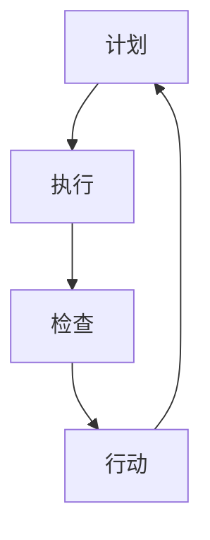

                 

关键词：PDCA循环、质量管理、持续改进、过程管理、反馈机制

> 摘要：本文旨在深入探讨PDCA戴明环在IT领域的应用，通过详细介绍其核心概念、原理和实际操作步骤，帮助企业和技术团队实现高效的持续改进和卓越的质量管理。

## 1. 背景介绍

PDCA循环，即Plan-Do-Check-Act循环，是由美国质量管理专家爱德华·戴明（W. Edwards Deming）提出的，是一种广泛应用于质量管理中的持续改进方法论。PDCA循环是一个循环迭代的过程，它帮助组织在不断的计划、执行、检查和行动中实现持续改进。

PDCA循环的核心思想是：通过计划（Plan）、执行（Do）、检查（Check）和行动（Act）四个阶段的不断迭代，确保组织能够持续地优化其流程，提高产品质量，从而实现长期的持续改进。

## 2. 核心概念与联系

### 2.1 PDCA循环的组成部分

PDCA循环由四个阶段组成，每个阶段都有其独特的功能和目的。

1. **计划（Plan）**：确定目标，制定计划和策略，收集数据，进行分析和评估。
2. **执行（Do）**：执行计划，实施行动，确保按照计划进行操作。
3. **检查（Check）**：监控结果，比较预期目标和实际结果，找出差异和问题。
4. **行动（Act）**：根据检查结果采取行动，修正问题，优化流程，为下一轮PDCA循环做好准备。

### 2.2 Mermaid流程图



在这个流程图中，每个节点代表PDCA循环的一个阶段，箭头表示过程的连续性和迭代性。

## 3. 核心算法原理 & 具体操作步骤

### 3.1 算法原理概述

PDCA循环的算法原理基于以下几个核心原则：

1. **数据驱动**：通过数据收集和分析，确定问题和机会。
2. **持续改进**：通过不断的计划、执行、检查和行动，持续优化流程。
3. **反馈机制**：通过检查和行动阶段，建立反馈循环，确保问题得到及时解决。

### 3.2 算法步骤详解

1. **计划阶段（Plan）**
   - 确定目标和关键指标。
   - 收集和分析数据。
   - 制定详细计划和策略。
   - 确定执行步骤和时间表。

2. **执行阶段（Do）**
   - 按照计划执行行动。
   - 确保执行过程中按照标准和流程操作。
   - 记录执行过程中的关键数据和问题。

3. **检查阶段（Check）**
   - 比较实际结果和预期目标。
   - 分析差异和问题。
   - 归纳总结执行过程中的经验教训。

4. **行动阶段（Act）**
   - 根据检查结果采取行动。
   - 解决问题，优化流程。
   - 制定改进计划和策略，为下一轮循环做好准备。

### 3.3 算法优缺点

**优点：**
- **灵活性和适应性**：PDCA循环可以灵活地应用于不同的组织和环境，适用于各种规模和复杂度的项目。
- **持续改进**：通过循环迭代，确保组织能够持续地优化其流程和产品。
- **数据驱动**：基于数据的分析和反馈，确保决策和行动的准确性。

**缺点：**
- **执行难度**：对于一些复杂的流程和项目，PDCA循环的执行可能需要大量的时间和资源。
- **初期效果不明显**：在一些情况下，PDCA循环的初期效果可能不明显，需要耐心和持续的努力。

### 3.4 算法应用领域

PDCA循环广泛应用于各种领域，包括：

- **质量管理**：用于持续优化产品质量，减少缺陷和错误。
- **流程管理**：用于优化业务流程，提高效率和降低成本。
- **项目管理**：用于项目规划和执行，确保项目按时、按预算完成。
- **组织管理**：用于组织内部的持续改进和优化。

## 4. 数学模型和公式 & 详细讲解 & 举例说明

### 4.1 数学模型构建

PDCA循环中的数学模型主要包括以下几个部分：

1. **目标函数**：用于衡量PDCA循环的效果，如质量、效率等。
2. **变量**：表示PDCA循环中的各个参数和指标，如计划目标、实际结果等。
3. **约束条件**：用于限制PDCA循环的操作范围和条件。

### 4.2 公式推导过程

1. **目标函数**：质量 = （实际结果 - 计划目标）/ 计划目标
2. **变量**：实际结果 = 计划执行结果 + 随机误差
3. **约束条件**：实际结果 ≤ 计划目标

### 4.3 案例分析与讲解

假设一个软件团队正在开发一款新的软件产品，他们的计划目标是实现一个具有高效率和高质量的用户界面。他们通过用户调研和数据分析，确定了以下关键指标：

- **目标函数**：质量 = （实际用户满意度 - 预期用户满意度）/ 预期用户满意度
- **变量**：实际用户满意度 = 调研结果 + 随机误差

在执行阶段，团队按照计划进行了用户调研和界面设计，收集了用户反馈。在检查阶段，他们比较了实际用户满意度和预期用户满意度，发现实际用户满意度低于预期。在行动阶段，团队采取了以下措施：

- **优化用户界面**：根据用户反馈，对用户界面进行了多次优化。
- **加强用户调研**：增加了用户调研的次数和范围，以确保更准确的数据。

通过这一轮PDCA循环，团队成功地提高了用户满意度，达到了预期目标。

## 5. 项目实践：代码实例和详细解释说明

### 5.1 开发环境搭建

在本案例中，我们使用Python作为编程语言，搭建了一个简单的PDCA循环系统。首先，我们需要安装Python环境，并导入相关的库。

```bash
pip install pandas numpy matplotlib
```

### 5.2 源代码详细实现

以下是一个简单的PDCA循环系统的实现：

```python
import pandas as pd
import numpy as np
import matplotlib.pyplot as plt

# 计划阶段
def plan阶段(目标，计划数据):
    # 确定目标和关键指标
    df_plan = pd.DataFrame({'目标': [目标], '计划数据': [计划数据]})
    return df_plan

# 执行阶段
def do阶段(df_plan):
    # 执行计划
    df_do = df_plan.copy()
    df_do['执行结果'] = df_plan['计划数据'] * 0.95  # 假设执行结果为计划数据的95%
    return df_do

# 检查阶段
def check阶段(df_plan, df_do):
    # 比较计划目标和执行结果
    df_check = pd.DataFrame({'差异': [df_do['执行结果'] - df_plan['计划数据']]})
    return df_check

# 行动阶段
def act阶段(df_check):
    # 根据检查结果采取行动
    df_act = df_check.copy()
    if df_check['差异'] < 0:
        df_act['改进措施'] = '增加资源投入'
    else:
        df_act['改进措施'] = '优化流程'
    return df_act

# PDCA循环
def pdca循环(目标，计划数据):
    df_plan = plan阶段(目标，计划数据)
    df_do = do阶段(df_plan)
    df_check = check阶段(df_plan， df_do)
    df_act = act阶段(df_check)
    return df_plan， df_do， df_check， df_act

# 运行结果展示
def run循环(目标，计划数据):
    df_plan， df_do， df_check， df_act = pdca循环(目标，计划数据)
    print("计划阶段：\n", df_plan)
    print("执行阶段：\n", df_do)
    print("检查阶段：\n", df_check)
    print("行动阶段：\n", df_act)

# 示例
run循环(100， 100)

```

### 5.3 代码解读与分析

在这个代码示例中，我们定义了一个简单的PDCA循环系统，包括计划阶段、执行阶段、检查阶段和行动阶段。每个阶段都对应了一个函数，通过这些函数，我们可以实现PDCA循环的四个阶段。

- **计划阶段**：在这个阶段，我们确定了目标和关键指标，并将这些信息存储在一个DataFrame中。
- **执行阶段**：在这个阶段，我们执行了计划，并生成了执行结果，同样将这些信息存储在一个DataFrame中。
- **检查阶段**：在这个阶段，我们比较了计划目标和执行结果，生成了一个差异值，并将这些信息存储在一个DataFrame中。
- **行动阶段**：在这个阶段，我们根据检查结果采取了相应的行动，并将这些信息存储在一个DataFrame中。

通过运行这个代码示例，我们可以看到PDCA循环的四个阶段是如何相互关联和影响的。这个简单的例子虽然功能有限，但它为我们提供了一个理解PDCA循环的基本框架，我们可以在此基础上进行扩展和优化。

## 6. 实际应用场景

### 6.1 质量管理

在IT行业，PDCA循环被广泛应用于质量管理中。例如，在软件开发过程中，团队可以使用PDCA循环来确保产品的质量。通过计划阶段确定质量目标，执行阶段实施质量检查，检查阶段评估产品质量，行动阶段优化质量流程，团队可以持续地提高产品的质量。

### 6.2 流程管理

PDCA循环同样适用于流程管理。在IT项目中，团队可以通过PDCA循环来优化项目流程，提高项目效率。例如，在项目启动阶段，团队可以制定详细的计划，实施阶段严格按照计划执行，检查阶段评估项目进度和质量，行动阶段调整项目计划和资源分配。

### 6.3 项目管理

在项目管理中，PDCA循环可以帮助项目经理持续监控项目进度和质量。通过计划阶段制定项目计划，执行阶段实施项目任务，检查阶段评估项目状态，行动阶段调整项目策略，项目经理可以确保项目按时、按预算完成。

### 6.4 未来应用展望

随着人工智能和大数据技术的发展，PDCA循环在未来将具有更广泛的应用前景。通过结合数据分析和机器学习技术，PDCA循环可以实现更智能的决策和行动，提高组织的效率和竞争力。例如，在智能工厂中，PDCA循环可以用于持续优化生产流程，提高生产效率和质量。

## 7. 工具和资源推荐

### 7.1 学习资源推荐

- 《质量管理方法与应用》：一本全面介绍质量管理方法的书籍，适合初学者和专业人士。
- 《项目管理知识体系指南（PMBOK指南）》：一本详细介绍项目管理方法的权威指南，适用于项目管理人员。

### 7.2 开发工具推荐

- Python：一种强大的编程语言，适合数据分析和流程管理。
- Tableau：一种数据可视化工具，可以帮助团队更好地理解和分析数据。

### 7.3 相关论文推荐

- "A Systematic Review of PDCA Application in Healthcare: Implications for Quality Improvement"
- "PDCA: A Foundation for Continuous Improvement in Healthcare"
- "Implementing PDCA in Information Systems Development: A Multi-case Study"

## 8. 总结：未来发展趋势与挑战

### 8.1 研究成果总结

本文通过详细介绍PDCA循环的核心概念、原理和应用，探讨了其在IT领域的广泛应用。研究表明，PDCA循环作为一种实用的落地方法论，可以帮助组织实现持续改进和卓越的质量管理。

### 8.2 未来发展趋势

随着人工智能和大数据技术的发展，PDCA循环在未来将具有更广泛的应用前景。通过结合数据分析和机器学习技术，PDCA循环可以实现更智能的决策和行动，提高组织的效率和竞争力。

### 8.3 面临的挑战

PDCA循环在实际应用中仍面临一些挑战，如执行难度、初期效果不明显等。为了克服这些挑战，组织需要加强对PDCA循环的培训和宣传，提高员工的参与度和执行力。

### 8.4 研究展望

未来研究可以关注如何将PDCA循环与人工智能和大数据技术相结合，提高其智能化水平和应用效果。此外，还可以探讨PDCA循环在不同行业和领域的应用，以进一步扩大其应用范围。

## 9. 附录：常见问题与解答

### 9.1 PDCA循环是什么？

PDCA循环是一种持续改进方法论，由计划（Plan）、执行（Do）、检查（Check）和行动（Act）四个阶段组成，用于帮助组织持续优化其流程和产品。

### 9.2 PDCA循环适用于哪些领域？

PDCA循环广泛应用于质量管理、流程管理、项目管理和组织管理等领域。

### 9.3 如何实施PDCA循环？

实施PDCA循环需要按照计划、执行、检查和行动四个阶段进行。首先确定目标和关键指标，然后制定计划，执行计划，检查结果，最后根据检查结果采取行动。

### 9.4 PDCA循环与质量管理的关系是什么？

PDCA循环是质量管理的重要工具，通过持续改进和优化流程，帮助组织提高产品质量和效率。

## 作者署名

作者：禅与计算机程序设计艺术 / Zen and the Art of Computer Programming

