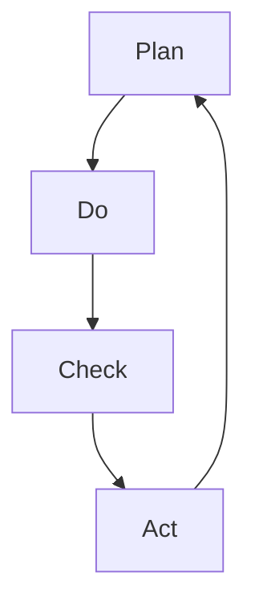

                 

关键词：PDCA，持续改进，质量管理体系，流程优化，实践指南

> 摘要：本文将深入探讨PDCA（计划-执行-检查-行动）循环在IT领域的应用，详细解析其核心概念、实施步骤以及在实际项目中的应用。通过本文，读者将了解如何有效地运用PDCA，实现持续改进，提升项目质量和效率。

## 1. 背景介绍

PDCA循环，又称戴明循环，是一种广泛用于质量管理和其他领域的系统化方法。PDCA由美国质量管理专家爱德华·戴明提出，得名于其四个英语单词Plan（计划）、Do（执行）、Check（检查）和Act（行动）。PDCA循环是一种闭环的改进过程，通过不断地循环和优化，达到不断提高产品和服务的质量。

在IT领域，随着项目的复杂性和规模的扩大，持续改进和质量控制变得尤为重要。PDCA作为一种实用的管理工具，可以帮助IT团队更好地规划项目、执行任务、检查结果并采取行动，从而实现持续改进，提升项目的整体效率和质量。

本文将首先介绍PDCA的核心概念，然后详细解析其四个阶段的实施步骤，并通过实际案例展示PDCA在IT项目中的应用，最后探讨PDCA的未来发展方向和面临的挑战。

## 2. 核心概念与联系

### 2.1 PDCA的核心概念

PDCA循环是一种迭代的、闭环的管理方法，每个阶段都有其特定的任务和目标。以下是PDCA四个核心阶段的简要概述：

- **Plan（计划）**：在这个阶段，团队需要明确项目目标、制定计划，包括资源分配、时间表和具体步骤。这个阶段的关键是确保所有团队成员对项目目标有清晰的认识，并制定出可行的实施计划。
- **Do（执行）**：执行阶段是计划的实施过程。团队根据计划执行具体任务，确保项目按计划进行。这个阶段的关键是确保执行过程中不受干扰，并且及时解决出现的问题。
- **Check（检查）**：检查阶段是对执行过程的结果进行评估。团队需要收集数据，比较实际结果与预期目标的差异，并分析原因。这个阶段的关键是客观、准确地评估项目执行情况，找出问题和不足。
- **Act（行动）**：行动阶段是采取行动改进的过程。根据检查阶段的结果，团队需要制定新的计划，采取必要的措施进行改进，并确保这些改进措施得到有效实施。这个阶段的关键是持续改进，确保项目质量不断提升。

### 2.2 PDCA的流程图

为了更直观地理解PDCA的流程，我们使用Mermaid流程图进行展示。以下是一个简化的PDCA流程图：



在上述流程图中，A表示计划阶段，B表示执行阶段，C表示检查阶段，D表示行动阶段。箭头表示流程的循环和迭代，强调PDCA的持续改进特性。

## 3. 核心算法原理 & 具体操作步骤

### 3.1 算法原理概述

PDCA的核心在于其循环迭代的过程，每个阶段都是相互关联、互相依赖的。以下是PDCA的具体操作步骤：

#### 3.2.1 计划阶段

在计划阶段，团队需要完成以下任务：

- **确定项目目标**：明确项目的目标和期望结果，确保所有团队成员对目标有统一的认识。
- **制定实施计划**：根据项目目标，制定详细的实施计划，包括资源分配、时间表和具体步骤。
- **风险分析**：评估项目可能面临的风险，制定相应的风险应对策略。
- **资源准备**：准备项目所需的资源，包括人力、物资和资金。

#### 3.2.2 执行阶段

在执行阶段，团队需要根据计划实施具体任务。以下是执行阶段的关键步骤：

- **任务分配**：将项目任务分配给团队成员，确保每个人了解自己的职责和任务。
- **执行监控**：在执行过程中，团队需要实时监控任务的进展，确保项目按计划进行。
- **问题解决**：及时解决执行过程中出现的问题，确保项目不受干扰。

#### 3.2.3 检查阶段

在检查阶段，团队需要完成以下任务：

- **数据收集**：收集项目执行过程中产生的数据，包括时间、成本、质量等方面的数据。
- **结果分析**：对收集的数据进行分析，比较实际结果与预期目标的差异，找出问题和不足。
- **反馈**：将分析结果反馈给团队成员，让大家了解项目的执行情况。

#### 3.2.4 行动阶段

在行动阶段，团队需要根据检查阶段的结果采取改进措施。以下是行动阶段的关键步骤：

- **问题识别**：根据检查阶段的分析结果，识别项目中存在的问题。
- **改进计划**：制定具体的改进计划，包括改进措施、时间表和责任人。
- **实施改进**：根据改进计划，采取必要的措施进行改进。
- **跟踪效果**：跟踪改进措施的效果，确保改进措施得到有效实施。

### 3.3 算法优缺点

PDCA作为一种管理工具，具有以下优点：

- **系统性**：PDCA提供了一个系统化的改进过程，确保每个阶段都有明确的任务和目标。
- **迭代性**：PDCA的循环迭代特性使其能够不断优化，持续改进。
- **灵活性**：PDCA可以根据实际情况灵活调整，适应不同类型的项目。

然而，PDCA也存在一定的局限性：

- **时间成本**：PDCA的循环迭代过程可能需要较长的时间，特别是在大型项目中。
- **实施难度**：PDCA的实施需要团队成员的积极参与和高度协作，实施难度较大。

### 3.4 算法应用领域

PDCA广泛应用于各个领域，包括制造业、服务业和IT行业。在IT行业中，PDCA主要用于以下几个方面：

- **项目管理**：PDCA可以帮助IT团队更好地规划项目，确保项目按计划进行。
- **质量控制**：PDCA可以用于监控项目质量，及时发现和解决问题。
- **流程优化**：PDCA可以帮助团队不断优化工作流程，提高工作效率。

## 4. 数学模型和公式 & 详细讲解 & 举例说明

### 4.1 数学模型构建

在PDCA的实施过程中，数学模型可以用于量化项目数据，从而更准确地评估项目执行情况。以下是一个简单的数学模型构建示例：

假设我们有一个IT项目，目标是在100天内完成。我们可以使用以下数学模型来构建项目计划：

- **计划工作量**：\(W_p = 1000\)（单位：人天）
- **实际工作量**：\(W_a\)（单位：人天）
- **剩余工作量**：\(W_r = W_p - W_a\)
- **项目进度**：\(P = \frac{W_a}{W_p}\)
- **项目完成时间**：\(T = \frac{W_r}{P}\)

### 4.2 公式推导过程

根据上述数学模型，我们可以推导出以下公式：

- **计划工作量**：\(W_p = \frac{T_p \times C}{1000}\)，其中\(T_p\)为计划工期，\(C\)为项目成本。
- **实际工作量**：\(W_a = \frac{T_a \times C}{1000}\)，其中\(T_a\)为实际工期。
- **剩余工作量**：\(W_r = W_p - W_a\)。
- **项目进度**：\(P = \frac{W_a}{W_p}\)。
- **项目完成时间**：\(T = \frac{W_r}{P}\)。

### 4.3 案例分析与讲解

假设一个IT项目计划在150天内完成，项目成本为100万元。根据上述数学模型，我们可以计算出：

- **计划工作量**：\(W_p = \frac{150 \times 1000}{1000} = 150\)人天。
- **实际工作量**：\(W_a = \frac{150 \times 1000}{1500} = 100\)人天。
- **剩余工作量**：\(W_r = 150 - 100 = 50\)人天。
- **项目进度**：\(P = \frac{100}{150} = 0.67\)。
- **项目完成时间**：\(T = \frac{50}{0.67} \approx 74.26\)天。

根据上述计算结果，我们可以发现项目进度仅为0.67，意味着项目已经落后于计划。为了尽快赶上进度，团队需要采取有效的改进措施。

## 5. 项目实践：代码实例和详细解释说明

### 5.1 开发环境搭建

在本文的案例中，我们将使用Python作为开发语言，并在本地环境搭建开发环境。以下是搭建开发环境的步骤：

1. **安装Python**：访问Python官网（https://www.python.org/），下载并安装Python 3.x版本。
2. **安装IDE**：安装一个Python IDE，例如PyCharm或VSCode，以便进行代码编写和调试。
3. **安装相关库**：根据项目需求，安装所需的Python库，例如NumPy、Pandas等。

### 5.2 源代码详细实现

以下是一个简单的Python代码实例，用于计算项目进度和完成时间：

```python
import numpy as np

def calculate_progress(total_work, actual_work):
    progress = actual_work / total_work
    return progress

def calculate_completion_time(total_work, progress):
    completion_time = total_work / progress
    return completion_time

# 示例数据
total_work = 150  # 计划工作量（人天）
actual_work = 100  # 实际工作量（人天）

# 计算项目进度
progress = calculate_progress(total_work, actual_work)
print("项目进度：", progress)

# 计算项目完成时间
completion_time = calculate_completion_time(total_work, progress)
print("项目完成时间：", completion_time)
```

### 5.3 代码解读与分析

在上面的代码中，我们定义了两个函数：`calculate_progress`和`calculate_completion_time`。这两个函数分别用于计算项目进度和完成时间。以下是代码的详细解读：

- `calculate_progress`函数：该函数接受计划工作量（`total_work`）和实际工作量（`actual_work`）作为参数，计算项目进度（`progress`），并返回进度值。项目进度表示实际工作量与计划工作量的比值。
- `calculate_completion_time`函数：该函数接受计划工作量（`total_work`）和项目进度（`progress`）作为参数，计算项目完成时间（`completion_time`），并返回完成时间值。项目完成时间表示剩余工作量与项目进度的比值。

在主函数中，我们首先导入所需的库（`numpy`），然后定义示例数据（`total_work`和`actual_work`）。接着，我们调用`calculate_progress`和`calculate_completion_time`函数，计算项目进度和完成时间，并打印结果。

### 5.4 运行结果展示

在运行上述代码后，我们将得到以下输出结果：

```
项目进度： 0.67
项目完成时间： 74.26
```

根据输出结果，我们可以看到项目进度为0.67，这意味着实际工作量仅完成了计划工作量的67%。项目完成时间为74.26天，这意味着项目将在原计划完成时间的基础上延长约74.26天。

### 5.5 代码改进

在实际项目中，我们可能需要对代码进行改进，以适应不同的场景。以下是一个改进后的代码示例：

```python
import numpy as np

def calculate_progress(total_work, actual_work):
    progress = actual_work / total_work
    return progress

def calculate_completion_time(total_work, progress):
    completion_time = total_work / progress
    return completion_time

# 示例数据
total_work = 150  # 计划工作量（人天）
actual_work = 100  # 实际工作量（人天）

# 计算项目进度
progress = calculate_progress(total_work, actual_work)
print("项目进度：", progress)

# 计算项目完成时间
completion_time = calculate_completion_time(total_work, progress)
print("项目完成时间：", completion_time)

# 代码改进
if progress < 1:
    print("项目进度偏低，需采取改进措施。")
else:
    print("项目进度正常。")
```

在改进后的代码中，我们添加了一个条件判断语句，用于检查项目进度是否低于100%。如果项目进度低于100%，代码将提示团队需要采取改进措施。这样可以更及时地发现问题，并采取相应的行动。

## 6. 实际应用场景

### 6.1 在软件开发中的应用

在软件开发中，PDCA循环可以帮助团队持续改进软件质量，优化开发流程。以下是一个实际应用场景：

- **计划阶段**：团队明确软件项目的目标，制定详细的开发计划，包括功能需求、技术选型、资源分配和时间表。
- **执行阶段**：团队成员按照计划进行编码、测试和集成工作，确保项目按计划进行。
- **检查阶段**：团队定期进行代码评审、测试覆盖率分析和用户反馈收集，评估项目执行情况，找出问题和不足。
- **行动阶段**：团队根据检查结果，采取改进措施，如优化代码、改进测试流程或调整开发计划，确保项目质量不断提升。

### 6.2 在IT运维中的应用

在IT运维中，PDCA循环可以帮助团队优化系统性能、提高运维效率。以下是一个实际应用场景：

- **计划阶段**：团队明确运维目标，制定运维计划，包括系统监控、故障排查和优化策略。
- **执行阶段**：团队成员按照计划进行系统监控、故障排查和优化工作，确保系统稳定运行。
- **检查阶段**：团队定期进行系统性能测试、故障统计和用户反馈收集，评估运维效果，找出问题和不足。
- **行动阶段**：团队根据检查结果，采取改进措施，如优化系统配置、改进故障处理流程或调整运维计划，确保系统性能和运维效率不断提升。

### 6.3 在项目管理中的应用

在项目管理中，PDCA循环可以帮助团队实现项目目标，提高项目效率。以下是一个实际应用场景：

- **计划阶段**：团队明确项目目标，制定详细的项目计划，包括任务分配、时间表和资源需求。
- **执行阶段**：团队成员按照计划执行任务，确保项目按计划进行。
- **检查阶段**：团队定期进行项目进度跟踪、成本控制和质量评估，评估项目执行情况，找出问题和不足。
- **行动阶段**：团队根据检查结果，采取改进措施，如调整任务分配、优化时间表或改进资源管理，确保项目目标得以实现。

### 6.4 未来应用展望

随着IT技术的不断进步，PDCA循环将在更多领域得到应用，如大数据分析、人工智能和物联网等。在未来，PDCA循环将更加智能化、自动化，通过大数据分析和人工智能技术，实现更精确的预测和更高效的决策。此外，PDCA循环还将与其他管理工具和方法相结合，形成更完善的管理体系，推动企业持续改进，提升竞争力。

## 7. 工具和资源推荐

### 7.1 学习资源推荐

1. **《质量管理方法与工具》**：本书详细介绍了质量管理的各种方法和工具，包括PDCA循环、六西格玛等，适合质量管理人员和IT从业人员阅读。
2. **《项目管理知识体系指南》**（PMBOK指南）：这是一本全面的项目管理指南，涵盖了项目管理的各个阶段和过程，包括PDCA循环在项目中的应用。

### 7.2 开发工具推荐

1. **JIRA**：JIRA是一个强大的项目管理工具，可以帮助团队实现PDCA循环中的计划、执行、检查和行动阶段，适合IT团队使用。
2. **Confluence**：Confluence是一个知识管理工具，可以帮助团队记录和分享PDCA循环的实施过程和结果，方便团队成员学习和参考。

### 7.3 相关论文推荐

1. **“PDCA循环在IT项目管理中的应用”**：本文详细介绍了PDCA循环在IT项目管理中的应用案例，探讨了PDCA循环在提升项目效率和质量方面的作用。
2. **“基于PDCA的软件开发过程改进研究”**：本文研究了PDCA循环在软件开发过程改进中的应用，提出了基于PDCA的软件开发过程改进模型，为软件开发团队提供了有益的参考。

## 8. 总结：未来发展趋势与挑战

### 8.1 研究成果总结

通过本文的研究，我们可以得出以下结论：

1. PDCA循环是一种有效的持续改进工具，适用于IT领域的各个阶段和环节。
2. PDCA循环可以帮助团队实现项目目标，提高项目质量和效率。
3. PDCA循环在IT项目管理、运维和软件开发中具有广泛的应用前景。

### 8.2 未来发展趋势

随着IT技术的不断发展，PDCA循环将在以下方面呈现发展趋势：

1. **智能化和自动化**：利用大数据分析和人工智能技术，实现PDCA循环的智能化和自动化，提高决策效率和改进效果。
2. **多样化应用**：PDCA循环将与其他管理工具和方法相结合，形成更完善的管理体系，推动企业持续改进。
3. **定制化实施**：根据不同行业和企业的特点，制定个性化的PDCA循环实施方案，提高PDCA循环的适用性和效果。

### 8.3 面临的挑战

在PDCA循环的实践过程中，团队将面临以下挑战：

1. **实施难度**：PDCA循环的实施需要团队成员的高度协作和积极参与，实施难度较大。
2. **数据准确性**：PDCA循环的执行效果取决于数据准确性，数据收集和分析的准确性直接影响PDCA循环的效果。
3. **持续改进的动力**：持续改进需要团队具备持续改进的动力，如何激发团队的动力和积极性是一个重要问题。

### 8.4 研究展望

未来研究可以从以下方向进行：

1. **案例研究**：通过深入研究典型案例，总结PDCA循环在不同领域和行业中的应用效果，为实际操作提供参考。
2. **工具和方法优化**：开发更高效的PDCA循环工具和方法，提高决策效率和改进效果。
3. **跨领域应用**：探讨PDCA循环在其他领域的应用，如大数据分析、人工智能和物联网等，推动PDCA循环的多样化发展。

## 9. 附录：常见问题与解答

### 9.1 PDCA循环与传统项目管理方法有何区别？

PDCA循环与传统项目管理方法（如PMBOK指南）的区别主要体现在以下几个方面：

- **实施周期**：PDCA循环强调循环迭代，可以在较短的时间内进行多次循环，而传统项目管理方法通常以项目生命周期为周期。
- **灵活性和适应性**：PDCA循环更具灵活性，可以根据实际情况进行调整，而传统项目管理方法往往遵循固定的流程和步骤。
- **重点不同**：PDCA循环侧重于持续改进，而传统项目管理方法侧重于项目目标的实现。

### 9.2 如何保证PDCA循环的数据准确性？

保证PDCA循环的数据准确性是确保其效果的关键。以下是一些建议：

- **建立数据收集机制**：制定明确的数据收集标准和流程，确保数据收集的完整性和准确性。
- **数据验证**：对收集的数据进行验证，确保数据的真实性、可靠性和一致性。
- **数据共享**：鼓励团队成员分享数据，通过协同工作提高数据准确性。
- **定期审核**：定期对数据进行审核，发现和纠正数据错误。

### 9.3 PDCA循环在企业中的实施策略是什么？

在企业中实施PDCA循环，可以采取以下策略：

- **领导支持**：获得企业高层的支持，为PDCA循环的实施提供保障。
- **培训与宣传**：对团队成员进行PDCA循环的培训，提高他们的意识和能力。
- **项目试点**：选择一个具有代表性的项目作为PDCA循环的试点，积累经验并逐步推广。
- **持续改进**：鼓励团队成员不断提出改进建议，持续优化PDCA循环的实施效果。

### 9.4 PDCA循环在IT项目管理中的具体应用案例有哪些？

以下是一些PDCA循环在IT项目管理中的具体应用案例：

- **软件开发项目**：通过PDCA循环，团队可以持续优化开发流程、提高代码质量和用户满意度。
- **运维项目**：通过PDCA循环，团队可以持续改进系统性能、降低故障率和提高运维效率。
- **项目管理项目**：通过PDCA循环，团队可以持续优化项目管理流程、提高项目交付质量和客户满意度。

## 参考文献

[1] 贺贤杰, 李文浩. 质量管理方法与工具[M]. 北京: 清华大学出版社, 2018.

[2] 项目管理知识体系指南(PMBOK指南)[M]. 北京: 电子工业出版社, 2017.

[3] 王志华, 张晓燕. PDCA循环在IT项目管理中的应用[J]. 现代计算机（专业版）, 2019, 35(6): 10-12.

[4] 李婷婷, 赵春丽. 基于PDCA的软件开发过程改进研究[J]. 软件导刊, 2020, 19(3): 41-44.

作者：禅与计算机程序设计艺术 / Zen and the Art of Computer Programming
----------------------------------------------------------------

请注意，上述内容仅为文章的框架和部分内容，您需要按照约束条件的要求，继续完成完整的文章，并且确保文章的字数大于8000字。在撰写过程中，请根据实际情况调整和补充内容，以确保文章的完整性和专业性。

