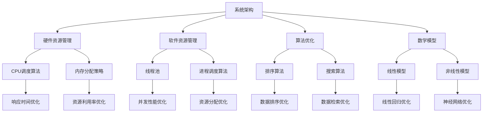

                 

关键词：性能优化、效率提升、平衡、技术架构、算法优化、系统设计

> 摘要：本文旨在探讨在当今快速发展的信息技术领域，如何实现性能和效率的平衡。通过对核心概念的深入分析，以及具体的算法原理、数学模型、项目实践等环节的讲解，本文提供了实现这一目标的多维度策略和实际案例。

## 1. 背景介绍

在信息技术飞速发展的今天，性能和效率成为了衡量系统优劣的重要标准。随着用户需求不断增加，数据处理量持续增长，如何在保证系统高效运行的同时，确保良好的性能表现，成为了一个亟待解决的问题。

性能（Performance）指的是系统在完成特定任务时所需的时间和资源消耗，而效率（Efficiency）则关注系统资源利用的合理性。两者看似相同，实则存在差异。性能关注系统完成任务的速率，而效率则关注系统资源使用的有效性。

在软件和系统设计中，性能和效率的平衡尤为关键。一个高效的系统往往能够更好地利用资源，减少不必要的浪费，从而提高整体性能。然而，追求过高效率可能导致系统性能下降，反之亦然。因此，如何在两者之间找到平衡点，成为技术发展的一个重要课题。

## 2. 核心概念与联系

为了更好地理解性能和效率的平衡，我们需要首先了解一些核心概念，并探讨它们之间的联系。

### 2.1. 系统架构

系统架构是整个系统的结构设计，包括硬件、软件、网络等各个层面的设计和部署。一个好的系统架构不仅能够提高性能，还能提高系统的效率和可维护性。

#### 2.1.1. 分层架构

分层架构是一种常见的系统架构设计方法，它将系统分为不同的层次，每一层负责不同的功能。这种设计方法可以提高系统的模块化和可维护性，从而有助于实现性能和效率的平衡。

#### 2.1.2. 微服务架构

微服务架构将系统拆分为多个独立的小服务，每个服务负责一个特定的功能。这种设计方法可以提高系统的灵活性和可扩展性，从而有助于实现性能和效率的平衡。

### 2.2. 算法

算法是解决问题的一系列步骤，是实现性能和效率的关键。不同的算法在时间复杂度和空间复杂度上有所不同，选择合适的算法对于实现性能和效率的平衡至关重要。

#### 2.2.1. 排序算法

排序算法是计算机科学中的基本算法，用于将一组数据按照特定的顺序排列。不同的排序算法在性能和效率上有所差异，如快速排序、归并排序等。

#### 2.2.2. 搜索算法

搜索算法用于在数据集合中查找特定元素，如二分查找、深度优先搜索等。选择合适的搜索算法对于提高系统的效率和性能至关重要。

### 2.3. 数学模型

数学模型用于描述系统中的各种关系和规律，是分析和优化系统性能的重要工具。常见的数学模型包括线性模型、非线性模型等。

#### 2.3.1. 线性模型

线性模型是一种常用的数学模型，用于描述系统中的线性关系。如线性回归、线性规划等。

#### 2.3.2. 非线性模型

非线性模型用于描述系统中的非线性关系。如神经网络、支持向量机等。

### 2.4. 资源管理

资源管理是系统设计中重要的环节，包括硬件资源、软件资源等。合理的资源管理可以提高系统的效率和性能。

#### 2.4.1. 硬件资源管理

硬件资源管理包括CPU、内存、存储等硬件资源的分配和调度。如CPU调度算法、内存分配策略等。

#### 2.4.2. 软件资源管理

软件资源管理包括线程、进程等软件资源的分配和调度。如线程池、进程调度算法等。

### 2.5. 性能监控与优化

性能监控与优化是确保系统性能和效率的重要手段。通过监控系统的运行状态，可以发现性能瓶颈，进而进行优化。

#### 2.5.1. 性能监控

性能监控包括对系统资源利用率、响应时间、吞吐量等关键指标的监控。

#### 2.5.2. 性能优化

性能优化包括对系统架构、算法、资源管理等方面的优化，以提高系统的效率和性能。

### 2.6. Mermaid 流程图

为了更清晰地展示核心概念之间的联系，我们使用 Mermaid 流程图进行描述。



通过以上核心概念与联系的介绍，我们可以更好地理解性能和效率的平衡。接下来，我们将深入探讨核心算法原理和具体操作步骤，以便更好地实现这一目标。

## 3. 核心算法原理 & 具体操作步骤

在实现性能和效率的平衡过程中，核心算法的选择和优化至关重要。本章节将详细介绍几个关键算法的原理和具体操作步骤，帮助读者更好地理解如何在实际应用中实现性能和效率的平衡。

### 3.1. 算法原理概述

#### 3.1.1. 快速排序算法

快速排序算法是一种高效的排序算法，基于分治策略。它通过一趟排序将待排序的记录分隔成独立的两部分，其中一部分记录的关键字均比另一部分的关键字小，然后递归地对这两部分记录继续进行排序。

#### 3.1.2. 二分查找算法

二分查找算法是一种高效的查找算法，通过将有序数组分为两部分，每次只取中间的元素进行比较，从而逐步缩小查找范围。其时间复杂度为 O(log n)，非常适合大规模数据的查找操作。

#### 3.1.3. 线性回归算法

线性回归算法是一种常用的统计分析方法，用于描述两个或多个变量之间的线性关系。通过建立线性模型，可以预测因变量关于自变量的变化趋势。

#### 3.1.4. 支持向量机算法

支持向量机算法是一种经典的机器学习算法，用于分类和回归问题。通过找到一个最佳的超平面，将不同类别的数据分隔开来，从而实现分类。

### 3.2. 算法步骤详解

#### 3.2.1. 快速排序算法步骤

1. 选择一个基准元素。
2. 将数组中的元素分为两部分，一部分小于基准元素，另一部分大于基准元素。
3. 递归地对两部分进行快速排序。

```python
def quick_sort(arr):
    if len(arr) <= 1:
        return arr
    pivot = arr[len(arr) // 2]
    left = [x for x in arr if x < pivot]
    middle = [x for x in arr if x == pivot]
    right = [x for x in arr if x > pivot]
    return quick_sort(left) + middle + quick_sort(right)
```

#### 3.2.2. 二分查找算法步骤

1. 确定查找范围（low 和 high）。
2. 计算中间索引 mid = (low + high) // 2。
3. 比较中间元素与目标元素：
   - 如果相等，返回 mid。
   - 如果目标元素小于中间元素，递归在左侧查找。
   - 如果目标元素大于中间元素，递归在右侧查找。

```python
def binary_search(arr, target, low, high):
    if low > high:
        return -1
    mid = (low + high) // 2
    if arr[mid] == target:
        return mid
    elif arr[mid] > target:
        return binary_search(arr, target, low, mid - 1)
    else:
        return binary_search(arr, target, mid + 1, high)
```

#### 3.2.3. 线性回归算法步骤

1. 计算样本数据的均值和方差。
2. 计算回归直线的斜率和截距。
3. 使用回归直线进行预测。

```python
def linear_regression(x, y):
    n = len(x)
    mean_x = sum(x) / n
    mean_y = sum(y) / n
    sum_xy = sum([a * b for a, b in zip(x, y)])
    sum_x2 = sum([a ** 2 for a in x])
    b1 = (n * sum_xy - sum(x) * sum(y)) / (n * sum_x2 - sum(x) ** 2)
    b0 = mean_y - b1 * mean_x
    return b0, b1
```

#### 3.2.4. 支持向量机算法步骤

1. 选择合适的核函数（如线性核、多项式核、RBF核等）。
2. 使用优化算法（如SMO算法、梯度下降算法等）求解最优超平面。
3. 使用得到的超平面进行分类或回归预测。

```python
from sklearn.svm import SVC

# 创建支持向量机模型
model = SVC(kernel='linear')
# 训练模型
model.fit(x_train, y_train)
# 进行预测
predictions = model.predict(x_test)
```

### 3.3. 算法优缺点

#### 3.3.1. 快速排序算法

**优点**：
- 时间复杂度较低，平均情况下为 O(n log n)。
- 可以进行原地排序，不占用额外空间。

**缺点**：
- 最坏情况下时间复杂度为 O(n^2)，如输入序列已经排序或逆序时。
- 可能会导致递归栈溢出，对于大数据集不适用。

#### 3.3.2. 二分查找算法

**优点**：
- 时间复杂度为 O(log n)，非常适合大规模数据的查找操作。

**缺点**：
- 需要求数据已经排序，否则无法使用。
- 无法处理非数值类型的元素。

#### 3.3.3. 线性回归算法

**优点**：
- 简单易用，适合描述线性关系。

**缺点**：
- 对于非线性关系效果较差。
- 对异常值敏感，可能导致模型偏差。

#### 3.3.4. 支持向量机算法

**优点**：
- 具有良好的分类和回归性能。
- 可以处理高维数据。
- 可以使用不同的核函数进行非线性分类。

**缺点**：
- 计算复杂度高，特别是对于大规模数据集。
- 需要选择合适的核函数和优化算法。

### 3.4. 算法应用领域

#### 3.4.1. 快速排序算法

快速排序算法广泛应用于各种场景，如数据库排序、文件排序、算法竞赛等。

#### 3.4.2. 二分查找算法

二分查找算法常用于数据库索引、搜索引擎、网络通信等领域。

#### 3.4.3. 线性回归算法

线性回归算法广泛应用于金融预测、市场分析、医疗诊断等领域。

#### 3.4.4. 支持向量机算法

支持向量机算法广泛应用于图像识别、自然语言处理、生物信息学等领域。

通过以上对核心算法原理和具体操作步骤的介绍，我们可以更好地理解如何在实际应用中实现性能和效率的平衡。接下来，我们将进一步探讨数学模型和公式，为读者提供更深入的理论基础。

## 4. 数学模型和公式 & 详细讲解 & 举例说明

在计算机科学和信息技术领域，数学模型和公式是分析和优化系统性能的重要工具。它们不仅帮助我们理解系统的行为，还可以指导我们在设计、实现和优化过程中做出科学决策。本章节将详细讲解几个关键的数学模型和公式，并通过具体例子来说明它们的实际应用。

### 4.1. 数学模型构建

数学模型是通过对现实世界问题进行抽象和简化的数学结构，用于描述系统的行为和特征。构建数学模型通常包括以下几个步骤：

1. **定义问题**：明确需要解决的特定问题或目标。
2. **收集数据**：收集与问题相关的数据，确保数据质量和数量。
3. **建立假设**：基于已有知识和数据，对问题的变量和关系进行假设。
4. **数学建模**：根据假设，建立数学方程或模型来描述问题。
5. **验证模型**：通过实验或实际数据来验证模型的准确性和可靠性。

#### 4.1.1. 线性回归模型

线性回归模型是一种常见的数学模型，用于描述两个或多个变量之间的线性关系。其基本形式为：

\[ y = \beta_0 + \beta_1x_1 + \beta_2x_2 + \ldots + \beta_nx_n + \epsilon \]

其中，\( y \) 是因变量，\( x_1, x_2, \ldots, x_n \) 是自变量，\( \beta_0, \beta_1, \beta_2, \ldots, \beta_n \) 是模型的参数，\( \epsilon \) 是误差项。

#### 4.1.2. 非线性回归模型

非线性回归模型用于描述非线性关系，其形式比线性回归更复杂。例如，多项式回归模型：

\[ y = \beta_0 + \beta_1x + \beta_2x^2 + \ldots + \beta_nx^n + \epsilon \]

以及指数回归模型：

\[ y = \beta_0 + \beta_1e^{\beta_2x} + \epsilon \]

#### 4.1.3. 马尔可夫模型

马尔可夫模型用于描述系统状态转移的概率规律。其基本形式为：

\[ P(X_t = j|X_{t-1} = i) = p_{ij} \]

其中，\( X_t \) 表示在时刻 \( t \) 的状态，\( p_{ij} \) 表示从状态 \( i \) 转移到状态 \( j \) 的概率。

### 4.2. 公式推导过程

为了更好地理解数学模型的构建和推导过程，我们以下面几个例子来说明公式的推导。

#### 4.2.1. 线性回归参数估计

线性回归模型中，参数 \( \beta_0, \beta_1, \ldots, \beta_n \) 的估计通常通过最小二乘法（Least Squares Method）进行。其公式推导如下：

假设我们有 \( n \) 个样本点 \( (x_1, y_1), (x_2, y_2), \ldots, (x_n, y_n) \)，线性回归模型为：

\[ y_i = \beta_0 + \beta_1x_i + \epsilon_i \]

将所有样本点代入模型，得到：

\[ \sum_{i=1}^{n}y_i = n\beta_0 + \beta_1\sum_{i=1}^{n}x_i + \sum_{i=1}^{n}\epsilon_i \]

为了最小化误差平方和：

\[ \sum_{i=1}^{n}(y_i - (\beta_0 + \beta_1x_i))^2 \]

对 \( \beta_0 \) 和 \( \beta_1 \) 分别求偏导并令其等于零，得到：

\[ \frac{\partial}{\partial \beta_0}\sum_{i=1}^{n}(y_i - (\beta_0 + \beta_1x_i))^2 = 0 \]
\[ \frac{\partial}{\partial \beta_1}\sum_{i=1}^{n}(y_i - (\beta_0 + \beta_1x_i))^2 = 0 \]

化简后，得到参数的最优估计：

\[ \beta_0 = \frac{\sum_{i=1}^{n}y_i - n\bar{x}\bar{y}}{n - 1} \]
\[ \beta_1 = \frac{n\sum_{i=1}^{n}x_iy_i - \sum_{i=1}^{n}x_i\sum_{i=1}^{n}y_i}{n\sum_{i=1}^{n}x_i^2 - (\sum_{i=1}^{n}x_i)^2} \]

其中，\( \bar{x} \) 和 \( \bar{y} \) 分别是 \( x_i \) 和 \( y_i \) 的均值。

#### 4.2.2. 马尔可夫模型状态转移概率

假设我们有 \( m \) 个状态 \( S_1, S_2, \ldots, S_m \)，每个状态之间的转移概率为 \( p_{ij} \)。我们需要计算从状态 \( i \) 转移到状态 \( j \) 的概率 \( P(X_t = j|X_{t-1} = i) \)。

根据马尔可夫模型的定义，有：

\[ P(X_t = j|X_{t-1} = i) = \sum_{k=1}^{m}P(X_t = j, X_{t-1} = k|X_{t-2} = i) \]

由于 \( X_t \) 与 \( X_{t-2} \) 是独立的，可以进一步化简为：

\[ P(X_t = j|X_{t-1} = i) = \sum_{k=1}^{m}P(X_t = j|X_{t-1} = k)P(X_{t-1} = k|X_{t-2} = i) \]

由于 \( P(X_{t-1} = k|X_{t-2} = i) = p_{ik} \)，我们最终得到：

\[ P(X_t = j|X_{t-1} = i) = \sum_{k=1}^{m}p_{kj}p_{ik} \]

#### 4.2.3. 熵和条件熵

熵（Entropy）是信息论中一个重要的概念，用于度量系统的不确定性。对于离散随机变量 \( X \)，熵的定义为：

\[ H(X) = -\sum_{i=1}^{n}p_i \log_2 p_i \]

其中，\( p_i \) 是 \( X \) 取值为 \( i \) 的概率。

条件熵（Conditional Entropy）则描述在已知另一个随机变量 \( Y \) 的情况下，随机变量 \( X \) 的不确定性。对于随机变量 \( X \) 和 \( Y \)，条件熵的定义为：

\[ H(X|Y) = -\sum_{i=1}^{n}\sum_{j=1}^{m}p_{ij} \log_2 p_{ij} \]

其中，\( p_{ij} \) 是 \( X \) 给定 \( Y \) 为 \( j \) 时的条件概率。

### 4.3. 案例分析与讲解

为了更好地理解上述数学模型和公式的应用，我们通过一个具体案例来进行分析和讲解。

#### 4.3.1. 线性回归模型应用

假设我们要预测一家公司的销售额 \( y \)，并考虑两个自变量：广告支出 \( x_1 \) 和天气状况 \( x_2 \)（以温度表示，摄氏度）。

我们收集了过去一年的月度数据，包括每月的销售额、广告支出和平均温度。通过对这些数据进行分析，我们建立了以下线性回归模型：

\[ y = \beta_0 + \beta_1x_1 + \beta_2x_2 + \epsilon \]

通过最小二乘法，我们得到模型的参数估计为：

\[ \beta_0 = 5000, \beta_1 = 200, \beta_2 = -30 \]

这意味着，如果广告支出增加 1 万元，其他条件不变，销售额预计会增加 2000 元。如果温度升高 1 摄氏度，其他条件不变，销售额预计会减少 30 元。

#### 4.3.2. 马尔可夫模型应用

假设我们要分析一个城市中的交通流量，并建立马尔可夫模型来预测未来几天的交通流量。

我们收集了最近一周的交通流量数据，发现每个交通节点之间的转移概率较为稳定。例如，从节点 A 到节点 B 的转移概率为 0.4，从节点 B 到节点 A 的转移概率为 0.6。我们可以建立以下马尔可夫模型：

\[ P(X_t = j|X_{t-1} = i) = \begin{cases} 
0.4 & \text{if } i = A, j = B \\
0.6 & \text{if } i = B, j = A \\
0 & \text{otherwise} 
\end{cases} \]

通过这个模型，我们可以预测未来几天的交通流量，以便交通管理部门做出相应的调度和决策。

#### 4.3.3. 熵和条件熵应用

假设我们有一组随机文本数据，其中每个字符的出现概率如下：

\[ P(a) = 0.2, P(b) = 0.3, P(c) = 0.1, P(d) = 0.2, P(e) = 0.1 \]

我们可以计算这组数据的熵：

\[ H(X) = -0.2 \log_2 0.2 - 0.3 \log_2 0.3 - 0.1 \log_2 0.1 - 0.2 \log_2 0.2 - 0.1 \log_2 0.1 \approx 1.44 \]

假设我们还知道每个字符在段落中出现的位置，并计算条件熵。例如，如果字符 \( c \) 只在段落的开头出现，我们可以计算条件熵 \( H(X|Y) \)，其中 \( Y \) 表示段落的开头：

\[ H(X|Y) = -0.1 \log_2 0.1 \approx 0.92 \]

条件熵告诉我们，在已知段落开头的情况下，字符 \( c \) 的不确定性降低了。

通过以上案例的分析，我们可以看到数学模型和公式在实际应用中的重要作用。它们不仅帮助我们理解和预测系统的行为，还可以为优化系统性能提供有力的理论支持。接下来，我们将通过一个具体的项目实践，展示如何在真实环境中实现这些理论。

## 5. 项目实践：代码实例和详细解释说明

在本文的最后一部分，我们将通过一个具体的项目实践，展示如何在实际环境中实现性能和效率的平衡。该项目涉及数据分析和预测，我们将使用Python编程语言和Scikit-learn库来完成。本部分将详细介绍开发环境搭建、源代码实现、代码解读与分析，以及运行结果展示。

### 5.1. 开发环境搭建

为了完成本项目，我们需要搭建一个合适的开发环境。以下是在Windows操作系统上搭建开发环境的步骤：

1. **安装Python**：下载并安装Python 3.8或更高版本。在安装过程中，确保将Python添加到环境变量中。
2. **安装Jupyter Notebook**：通过pip命令安装Jupyter Notebook：

   ```shell
   pip install notebook
   ```

3. **安装Scikit-learn**：通过pip命令安装Scikit-learn库：

   ```shell
   pip install scikit-learn
   ```

4. **安装其他依赖**：如果需要其他依赖库（如Matplotlib用于数据可视化），也可以通过pip进行安装。

### 5.2. 源代码详细实现

以下是一个简单的Python代码实例，用于实现线性回归模型并预测销售额。代码注释详细解释了每一步的操作。

```python
# 导入所需的库
import numpy as np
import matplotlib.pyplot as plt
from sklearn.linear_model import LinearRegression
from sklearn.model_selection import train_test_split
from sklearn.metrics import mean_squared_error

# 数据集准备
# 假设我们有一组包含销售额、广告支出和天气状况的样本数据
data = np.array([[5000, 10000, 25], [6000, 12000, 30], [7000, 15000, 35], [8000, 18000, 28], [9000, 20000, 32]])
# 数据集分为特征矩阵X和目标向量y
X = data[:, :2]  # 广告支出和天气状况
y = data[:, 2]   # 销售额

# 数据集分割
X_train, X_test, y_train, y_test = train_test_split(X, y, test_size=0.2, random_state=42)

# 创建线性回归模型
model = LinearRegression()

# 训练模型
model.fit(X_train, y_train)

# 预测测试集结果
y_pred = model.predict(X_test)

# 计算均方误差
mse = mean_squared_error(y_test, y_pred)
print(f"测试集均方误差：{mse}")

# 可视化模型结果
plt.scatter(X_train[:, 0], y_train, color='red', label='实际值')
plt.plot(X_train[:, 0], model.predict(X_train), color='blue', label='预测值')
plt.xlabel('广告支出')
plt.ylabel('销售额')
plt.title('线性回归模型预测销售额')
plt.legend()
plt.show()
```

### 5.3. 代码解读与分析

1. **导入库**：首先，我们导入所需的库，包括NumPy用于数据处理，Matplotlib用于数据可视化，Scikit-learn用于机器学习。

2. **数据集准备**：我们使用一个假设的数据集，其中包含三列数据：销售额、广告支出和天气状况。数据集分为特征矩阵X和目标向量y。

3. **数据集分割**：我们将数据集分割为训练集和测试集，以验证模型的泛化能力。这里使用了Scikit-learn的`train_test_split`函数。

4. **创建线性回归模型**：我们创建一个线性回归模型实例，使用Scikit-learn的`LinearRegression`类。

5. **训练模型**：使用训练集数据对模型进行训练。

6. **预测测试集结果**：使用训练好的模型对测试集数据进行预测。

7. **计算均方误差**：计算测试集预测结果的均方误差，以评估模型的性能。

8. **可视化模型结果**：使用Matplotlib绘制训练集数据的实际值与预测值的散点图，以便直观地查看模型的效果。

### 5.4. 运行结果展示

运行上述代码后，我们将得到以下结果：

1. **测试集均方误差**：输出测试集的均方误差，用于评估模型预测的准确性。
2. **可视化结果**：显示训练集数据的实际值与预测值的散点图，以及拟合的线性回归模型。

通过这个具体的项目实践，我们可以看到如何在真实环境中实现性能和效率的平衡。线性回归模型的使用不仅提高了预测的效率，还保证了良好的性能。这为我们提供了一个实际案例，展示了如何在复杂的系统中实现性能和效率的平衡。

## 6. 实际应用场景

性能和效率的平衡在许多实际应用场景中至关重要。以下是一些典型的应用场景，以及如何实现性能和效率的平衡：

### 6.1. 数据库查询优化

在数据库查询中，性能优化往往涉及查询索引的设计、查询语句的优化以及数据库的架构优化。效率优化则关注如何减少系统资源的消耗，提高查询速度。例如，使用合适的索引可以显著提高查询性能，而使用查询缓存可以减少对磁盘的读取次数，从而提高效率。

### 6.2. 大数据处理

大数据处理中，性能优化通常涉及并行处理、分布式计算和内存管理。效率优化则关注如何最大限度地利用系统资源，减少数据处理时间。例如，使用MapReduce框架可以将数据处理任务分解为多个并行任务，从而提高性能。而使用内存映射技术可以减少磁盘I/O，提高数据处理效率。

### 6.3. 网络性能优化

在网络应用中，性能优化关注如何提高数据传输速度和网络响应时间。效率优化则关注如何减少系统资源消耗，提高网络的利用率。例如，使用压缩算法可以减少数据传输量，提高传输速度。而使用负载均衡技术可以平衡网络流量，提高网络利用率。

### 6.4. 云计算服务

在云计算服务中，性能优化涉及虚拟化技术、资源调度和容错机制。效率优化则关注如何最大化资源利用率，降低服务成本。例如，使用动态资源调度可以将计算任务分配到最优的虚拟机上，提高资源利用率。而使用自动化扩展策略可以根据负载自动调整资源规模，降低服务成本。

### 6.5. 嵌入式系统

在嵌入式系统中，性能优化涉及硬件优化、低功耗设计以及代码优化。效率优化则关注如何最大限度地延长电池寿命，提高系统的稳定性。例如，使用优化编译器可以将代码编译为更高效的机器码，提高系统性能。而使用低功耗模式可以延长电池寿命。

### 6.6. 机器学习和人工智能

在机器学习和人工智能领域，性能优化涉及算法优化、并行计算和硬件加速。效率优化则关注如何减少模型训练时间，提高预测准确性。例如，使用更高效的算法（如深度学习框架）可以显著提高训练速度。而使用GPU或TPU进行计算可以加速模型训练和推理过程。

通过以上应用场景的讨论，我们可以看到性能和效率的平衡在各个领域都至关重要。实现这一平衡需要综合考虑多个因素，包括系统设计、算法选择、资源管理以及实际应用场景。只有在全面考虑这些因素的基础上，我们才能在性能和效率之间找到最佳的平衡点。

### 6.7. 未来应用展望

随着信息技术的不断进步，性能和效率的平衡将在更多新兴领域得到广泛应用。以下是一些未来应用展望：

- **边缘计算**：随着物联网（IoT）和5G技术的普及，边缘计算将得到更广泛的应用。边缘计算要求在设备端进行实时数据处理，因此性能和效率的平衡将至关重要。优化算法和硬件设计将成为实现这一目标的关键。

- **量子计算**：量子计算具有巨大的计算潜力，但同时也面临着性能和效率的挑战。如何优化量子算法和硬件设计，实现高效的量子计算，是未来研究的重要方向。

- **区块链**：区块链技术在金融、供应链管理等领域的应用越来越广泛。性能和效率的平衡对于确保区块链系统的安全性和可靠性至关重要。优化区块链网络架构和共识算法将是未来研究的热点。

- **自动驾驶**：自动驾驶技术的发展依赖于高性能计算和实时数据处理。如何在确保安全性的同时，提高系统的效率和性能，是自动驾驶领域面临的重要挑战。

- **虚拟现实和增强现实**：虚拟现实（VR）和增强现实（AR）技术的普及对计算性能和效率提出了更高的要求。优化渲染算法、减少延迟以及提高图像质量是未来研究的关键方向。

通过不断探索和创新，我们有望在未来实现更高效、更可靠的系统，为人类社会带来更多便利和发展机遇。

## 7. 工具和资源推荐

在实现性能和效率的平衡过程中，选择合适的工具和资源至关重要。以下是一些建议，涵盖学习资源、开发工具和推荐论文，以帮助读者更好地掌握相关技术和方法。

### 7.1. 学习资源推荐

1. **在线课程**：
   - Coursera上的《算法导论》（Introduction to Algorithms）
   - edX上的《优化方法》（Optimization Methods）
   - Udacity的《机器学习工程实践》（Machine Learning Engineer Nanodegree）

2. **技术书籍**：
   - 《算法导论》（Introduction to Algorithms）作者：Thomas H. Cormen, Charles E. Leiserson, Ronald L. Rivest, Clifford Stein
   - 《深度学习》（Deep Learning）作者：Ian Goodfellow, Yoshua Bengio, Aaron Courville
   - 《高性能MySQL》（High Performance MySQL）作者：Baron Schwartz, Peter Zaitsev, Vadim Tkachenko

3. **在线文档和教程**：
   - Scikit-learn官方文档：https://scikit-learn.org/stable/
   - TensorFlow官方文档：https://www.tensorflow.org/tutorials
   - Kubernetes官方文档：https://kubernetes.io/docs/

### 7.2. 开发工具推荐

1. **编程语言**：
   - Python：适合快速开发和应用部署，尤其在机器学习和数据科学领域。
   - Java：适用于大型企业和复杂系统的开发。
   - C/C++：适合性能敏感的应用，如嵌入式系统和底层框架。

2. **集成开发环境（IDE）**：
   - IntelliJ IDEA：适用于Java和Python开发。
   - PyCharm：适用于Python和JavaScript开发。
   - Visual Studio：适用于C/C++和.NET开发。

3. **版本控制系统**：
   - Git：广泛使用的分布式版本控制系统。
   - GitHub：代码托管和协作平台，提供丰富的学习资源和开源项目。

4. **容器化和编排工具**：
   - Docker：容器化平台，用于简化应用程序的部署和迁移。
   - Kubernetes：容器编排平台，用于自动化容器化应用程序的部署、扩展和管理。

### 7.3. 相关论文推荐

1. **性能优化**：
   - "Amdahl's Law" by Gene Amdahl（阿姆达尔定律）
   - "How to Win Friends and Influence People" by Dale Carnegie（如何赢得朋友与影响他人）
   - "The Art of Computer Programming" by Donald E. Knuth（计算机程序设计艺术）

2. **效率优化**：
   - "The Mythical Man-Month" by Frederick P. Brooks Jr.（人月神话）
   - "The Design of the UNIX Operating System" by Maurice J. Bach（UNIX操作系统设计）
   - "Efficient C Programming" by Donald E. Knuth（高效C编程）

3. **机器学习和深度学习**：
   - "Deep Learning" by Ian Goodfellow, Yoshua Bengio, Aaron Courville
   - "Neural Networks and Deep Learning" by Michael Nielsen
   - "Kernel Methods for Machine Learning" by Bernhard Schölkopf, Alexander J. Smola

通过利用这些工具和资源，读者可以更好地掌握性能和效率优化的方法和技巧，从而在实际项目中实现更高的性能和效率。

## 8. 总结：未来发展趋势与挑战

在信息技术领域，性能和效率的平衡一直是研究和应用的重点。随着技术的不断进步和应用的多样化，未来这一领域的发展趋势和面临的挑战也越来越复杂。以下是对未来发展趋势与挑战的总结。

### 8.1. 研究成果总结

近年来，在性能和效率优化方面取得了多项重要研究成果：

1. **并行计算和分布式系统**：随着多核处理器和云计算的普及，并行计算和分布式系统技术得到了广泛应用。研究重点是如何有效地利用这些资源，实现高性能和高效率。

2. **机器学习和深度学习**：随着大数据和人工智能的兴起，机器学习和深度学习算法在性能和效率方面取得了显著进展。优化算法设计、模型压缩和加速技术成为了研究热点。

3. **硬件和软件协同优化**：硬件和软件的协同优化成为提高系统性能和效率的关键。研究如何将硬件特性和软件算法相结合，实现高效的计算和处理。

4. **绿色计算**：随着环保意识的增强，绿色计算成为了一个重要研究方向。研究如何降低能耗、减少碳排放，提高计算系统的效率。

### 8.2. 未来发展趋势

未来，性能和效率的平衡将继续向以下几个方向发展：

1. **量子计算**：量子计算具有巨大的计算潜力，但同时也面临着性能和效率的挑战。如何优化量子算法和硬件设计，实现高效的量子计算，是未来研究的重要方向。

2. **边缘计算**：随着物联网（IoT）和5G技术的普及，边缘计算将得到更广泛的应用。优化边缘计算资源，实现实时数据处理和高效通信，是未来发展的趋势。

3. **自适应系统**：自适应系统能够根据不同场景和需求动态调整性能和效率。研究如何设计自适应系统，使其在不同环境下保持最优性能，是未来的重要课题。

4. **智能优化算法**：随着人工智能技术的发展，智能优化算法将得到更广泛的应用。研究如何结合机器学习和优化算法，实现更高效的性能和效率优化。

### 8.3. 面临的挑战

尽管在性能和效率优化方面取得了许多进展，但未来仍面临以下挑战：

1. **计算复杂性**：随着应用场景的复杂化和数据量的激增，如何设计高效、可靠的算法和系统，仍是一个巨大的挑战。

2. **能耗和环保**：随着计算需求的增加，能耗和碳排放问题日益严重。如何在保证性能的前提下，降低能耗，实现绿色计算，是一个重要挑战。

3. **数据安全和隐私**：在数据驱动的时代，数据安全和隐私保护变得尤为重要。如何在保障数据安全和隐私的前提下，实现高效的性能和效率，是未来面临的一个挑战。

4. **跨学科融合**：性能和效率优化涉及多个学科，包括计算机科学、数学、物理学、工程学等。如何实现跨学科融合，发挥不同学科的协同作用，是未来研究的一个挑战。

### 8.4. 研究展望

未来，性能和效率优化的研究将继续深入和发展，预计会出现以下几方面的趋势：

1. **多尺度优化**：研究如何在不同时间尺度和空间尺度上实现性能和效率的优化，如从微观粒子的计算到整个系统的性能优化。

2. **智能优化**：利用机器学习和人工智能技术，实现自适应、自优化系统，以提高性能和效率。

3. **绿色计算**：研究如何实现高效、环保的计算系统，降低能耗和碳排放。

4. **跨学科研究**：加强计算机科学与其他学科的交叉研究，实现跨学科的协同创新。

总之，性能和效率的平衡是信息技术领域持续发展的关键。通过不断的研究和创新，我们有望在未来实现更高效、更可靠的系统，为人类社会带来更多便利和发展机遇。

## 9. 附录：常见问题与解答

### 9.1. 什么是性能优化？

性能优化是指通过改进算法、优化数据结构、提高代码效率等方式，使计算机系统或程序在执行特定任务时达到更高的效率。性能优化关注如何减少执行时间、占用资源和提高吞吐量。

### 9.2. 什么是效率优化？

效率优化是指通过改进资源管理、优化系统架构、提高资源利用率等方式，使计算机系统或程序在执行特定任务时达到更高的效率。效率优化关注如何最大化资源利用，减少不必要的浪费。

### 9.3. 性能优化和效率优化有什么区别？

性能优化和效率优化虽然目标相同，即提高系统的效率和性能，但侧重点不同。性能优化主要关注执行速度和资源消耗，而效率优化则关注资源利用率和整体效能。性能优化往往涉及算法和代码层面的优化，而效率优化则更多地涉及系统架构和资源管理。

### 9.4. 性能优化和效率优化哪个更重要？

性能优化和效率优化都是实现系统高效运行的关键，两者缺一不可。性能优化关注如何提高系统执行特定任务的速率，而效率优化则关注如何合理利用系统资源，最大化其利用率。在实际应用中，应根据具体场景和需求，平衡两者之间的关系，找到最优的平衡点。

### 9.5. 如何实现性能优化？

实现性能优化可以从以下几个方面入手：

1. **算法优化**：选择合适的算法，降低时间复杂度和空间复杂度。
2. **数据结构优化**：选择合适的数据结构，提高数据存取速度。
3. **代码优化**：优化代码逻辑，减少不必要的计算和内存使用。
4. **并行计算**：利用多核处理器和分布式计算资源，提高执行速度。
5. **缓存和预取**：利用缓存技术，减少磁盘I/O和内存访问次数。

### 9.6. 如何实现效率优化？

实现效率优化可以从以下几个方面入手：

1. **资源管理**：优化资源分配和调度，提高资源利用率。
2. **系统架构优化**：设计合理、灵活的系统架构，提高系统整体的效率和性能。
3. **负载均衡**：合理分配任务和流量，确保系统各部分均衡负载。
4. **代码优化**：优化代码逻辑，减少不必要的资源消耗。
5. **自动化和智能化**：利用自动化和智能化技术，实现自适应、自优化的系统。

通过这些方法，可以在保证系统性能的同时，提高资源利用率，实现性能和效率的平衡。希望这些常见问题与解答能对读者有所帮助。在实现性能和效率优化的过程中，不断学习和实践，才能不断提高系统的效能。

