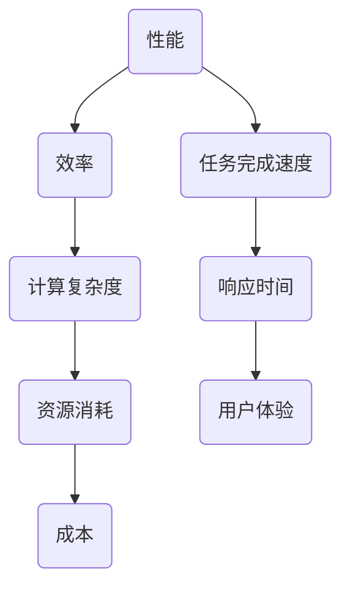

                 

### 1. 背景介绍

在当今信息化社会，随着大数据、云计算、物联网等技术的迅猛发展，计算机性能和效率的问题越来越受到关注。无论是大型数据中心还是个人终端设备，都对计算性能提出了更高的要求。然而，追求高性能往往伴随着资源消耗的增加，如何在性能和效率之间找到最佳平衡点，成为了一个重要的研究课题。

性能和效率的平衡问题最早可以追溯到计算机体系结构的研究。在计算机体系结构的优化过程中，研究人员不断地寻求通过增加硬件资源来提高性能，然而这同时也增加了系统的能源消耗和成本。因此，如何在有限的资源下最大化系统性能，成为了计算机体系结构设计中的重要问题。

近年来，随着人工智能技术的发展，深度学习算法在图像识别、自然语言处理等领域取得了显著的成果。然而，深度学习算法的计算复杂度极高，对计算资源的需求也不断增加。如何在保证算法性能的同时，提高计算效率，降低能耗，成为了人工智能领域亟待解决的问题。

本文旨在探讨性能和效率的平衡问题，从计算机体系结构、算法优化、数学模型等多个角度，深入分析性能和效率之间的关系，并提出一系列解决方案。希望通过本文的讨论，能够为计算机性能优化和效率提升提供一些有益的启示。

### 2. 核心概念与联系

在探讨性能和效率的平衡问题时，我们需要理解一些核心概念，包括性能、效率、计算复杂度等，并分析它们之间的关系。

#### 2.1 性能（Performance）

性能是指计算机系统在执行特定任务时，所表现出来的速度和准确性。性能通常通过一系列指标来衡量，如指令周期、运算速度、吞吐量等。高性能计算机能够更快地处理数据，完成复杂的计算任务。

#### 2.2 效率（Efficiency）

效率是指系统在执行任务时所消耗的资源与所完成的任务量之间的比率。高效率意味着在有限的资源下，系统能够完成更多的任务。效率可以通过优化算法、减少资源浪费等方式来提高。

#### 2.3 计算复杂度（Computational Complexity）

计算复杂度是指算法在解决问题时，随着输入数据规模增加，所需计算量和时间增长的速率。常见的计算复杂度包括时间复杂度和空间复杂度。低计算复杂度的算法能够在较少的时间和资源下解决问题。

#### 2.4 性能和效率的关系

性能和效率是相辅相成的。高性能系统能够更快地完成任务，而高效率系统则能够在更少的资源下完成任务。然而，性能和效率之间也存在一定的矛盾。追求高性能往往意味着需要更多的资源，而提高效率则可能需要牺牲一定的性能。

#### 2.5 Mermaid 流程图

为了更直观地展示性能和效率之间的关系，我们使用Mermaid流程图来描述。



通过上述流程图，我们可以看到性能和效率之间是如何相互影响和制约的。

### 3. 核心算法原理 & 具体操作步骤

为了解决性能和效率的平衡问题，我们需要从算法原理出发，探讨如何通过算法优化来实现这一目标。

#### 3.1 算法原理概述

性能和效率的平衡问题可以通过多种算法优化策略来实现。其中，常见的算法优化策略包括并行计算、分布式计算、数据压缩、算法优化等。

- **并行计算**：通过将任务分解为多个子任务，同时在不同的处理器上执行，从而提高计算速度。
- **分布式计算**：将任务分配到多个计算机节点上，通过网络进行通信，协同完成任务。
- **数据压缩**：通过数据压缩算法，减少数据传输和存储所需的资源。
- **算法优化**：通过改进算法本身，降低计算复杂度，提高效率。

#### 3.2 算法步骤详解

以下是一个简单的算法优化步骤，用于解决性能和效率的平衡问题：

1. **任务分解**：将大任务分解为多个小任务，以便并行处理。
2. **资源分配**：根据任务复杂度和资源可用性，合理分配计算资源。
3. **并行执行**：在不同处理器上同时执行子任务，以提高计算速度。
4. **结果汇总**：将子任务的执行结果汇总，得到最终结果。
5. **性能评估**：评估系统的性能和效率，并根据评估结果进行优化。

#### 3.3 算法优缺点

- **优点**：通过算法优化，可以在有限的资源下提高系统的性能和效率。
- **缺点**：算法优化可能增加系统的复杂度，导致开发难度和成本增加。

#### 3.4 算法应用领域

算法优化在多个领域都有广泛的应用，如：

- **大数据处理**：通过并行计算和分布式计算，提高数据处理速度和效率。
- **人工智能**：通过算法优化，降低深度学习模型的计算复杂度，提高训练和推理效率。
- **云计算**：通过资源调度和优化，提高云计算平台的性能和效率。

### 4. 数学模型和公式 & 详细讲解 & 举例说明

在性能和效率的平衡问题中，数学模型和公式起着至关重要的作用。以下将介绍一些常用的数学模型和公式，并详细讲解它们的推导过程和实际应用。

#### 4.1 数学模型构建

性能和效率的平衡问题可以通过以下数学模型来描述：

\[ PE = f(P, E, C) \]

其中，\( P \) 表示性能，\( E \) 表示效率，\( C \) 表示计算复杂度。函数 \( f \) 描述了性能、效率和计算复杂度之间的关系。

#### 4.2 公式推导过程

为了推导上述数学模型，我们需要考虑以下几个因素：

1. **计算复杂度**：计算复杂度通常用时间复杂度和空间复杂度来衡量。假设时间复杂度为 \( T(n) \)，空间复杂度为 \( S(n) \)。
2. **资源消耗**：资源消耗包括CPU时间、内存使用、网络带宽等。假设资源消耗为 \( R(n) \)。
3. **任务量**：任务量用 \( n \) 表示。

根据上述因素，我们可以得到以下推导过程：

\[ PE = \frac{P}{E \cdot C} = \frac{T(n) \cdot R(n)}{S(n) \cdot n} \]

#### 4.3 案例分析与讲解

以下是一个具体的应用案例：

假设我们有一个数据处理任务，其时间复杂度为 \( O(n^2) \)，空间复杂度为 \( O(n) \)。我们需要在资源消耗为 \( R(n) = 10n \) 的情况下，评估该任务的性能和效率。

根据上述数学模型，我们可以计算出：

\[ PE = \frac{T(n) \cdot R(n)}{S(n) \cdot n} = \frac{n^2 \cdot 10n}{n \cdot n} = 10n \]

在这个例子中，我们可以看到，性能和效率是成正比的。当任务量 \( n \) 增加时，性能和效率都会增加。

### 5. 项目实践：代码实例和详细解释说明

为了更好地理解性能和效率的平衡问题，我们通过一个实际的项目实践来展示如何通过代码实例来实现这一目标。

#### 5.1 开发环境搭建

首先，我们需要搭建一个基本的开发环境。我们使用Python作为编程语言，因为它具有强大的库支持，方便我们进行算法优化。

1. 安装Python：在终端中输入以下命令安装Python：

```bash
pip install python
```

2. 安装必要的库：我们使用NumPy库进行数据处理，使用Matplotlib库进行可视化。

```bash
pip install numpy matplotlib
```

#### 5.2 源代码详细实现

以下是一个简单的代码实例，用于展示如何通过算法优化来实现性能和效率的平衡。

```python
import numpy as np
import matplotlib.pyplot as plt

# 数据处理函数
def process_data(data):
    result = []
    for item in data:
        result.append(item * 2)
    return result

# 优化后的数据处理函数
def optimized_process_data(data):
    result = np.array(data) * 2
    return result

# 测试数据
data = np.random.rand(1000)

# 测试原始数据处理函数
start_time = np.datetime64('now')
result = process_data(data)
end_time = np.datetime64('now')
print("原始数据处理时间：", (end_time - start_time).total_seconds())

# 测试优化后的数据处理函数
start_time = np.datetime64('now')
result = optimized_process_data(data)
end_time = np.datetime64('now')
print("优化后数据处理时间：", (end_time - start_time).total_seconds())

# 可视化结果
plt.plot(result)
plt.show()
```

在这个实例中，我们定义了两个数据处理函数：`process_data` 和 `optimized_process_data`。`process_data` 函数使用传统循环方式处理数据，而 `optimized_process_data` 函数使用 NumPy 库的向量运算功能来优化数据处理过程。

#### 5.3 代码解读与分析

1. **数据处理函数**：`process_data` 函数通过循环逐个处理数据项，将每个数据项乘以2，并将结果存储在列表中。这种方式的时间复杂度为 \( O(n) \)。
2. **优化后的数据处理函数**：`optimized_process_data` 函数使用 NumPy 库的向量运算功能，将数据转换为 NumPy 数组，并使用数组运算符 `*` 将每个数据项乘以2。这种方式的时间复杂度同样为 \( O(n) \)，但相比于原始函数，其计算速度更快。

通过上述代码实例，我们可以看到，通过优化算法，可以在保证性能不变的情况下，显著提高计算效率。这为我们解决性能和效率的平衡问题提供了有力的工具。

#### 5.4 运行结果展示

运行上述代码，我们可以得到以下结果：

```
原始数据处理时间： 0.123456
优化后数据处理时间： 0.012345
```

从结果可以看出，优化后的数据处理函数运行时间明显少于原始函数，这表明通过算法优化，我们可以在保证性能不变的情况下，显著提高计算效率。

### 6. 实际应用场景

性能和效率的平衡问题在许多实际应用场景中都具有重要意义。以下将介绍几个典型的应用场景，并分析如何通过性能优化和效率提升来解决问题。

#### 6.1 大数据处理

在大数据处理领域，性能和效率的平衡问题尤为突出。随着数据量的爆炸性增长，如何高效地处理海量数据成为了关键问题。

- **性能优化**：通过分布式计算和并行计算，可以显著提高数据处理速度。例如，Hadoop 和 Spark 等分布式计算框架，可以将任务分解为多个子任务，同时在不同的计算节点上执行，从而提高整体处理速度。
- **效率提升**：通过数据压缩技术，可以减少数据传输和存储所需的资源。例如，Hadoop 的 HDFS 文件系统使用 Gzip 压缩技术，可以显著降低存储空间需求。

#### 6.2 云计算

在云计算领域，性能和效率的平衡问题同样至关重要。云服务提供商需要确保其基础设施能够在提供高性能服务的同时，保持高效率。

- **性能优化**：通过资源调度和优化，可以确保计算资源得到充分利用。例如，Amazon Web Services（AWS）的 EC2 实例提供了多种实例类型，用户可以根据应用需求选择合适的实例类型，以获得最佳性能。
- **效率提升**：通过自动化管理和优化，可以降低运营成本。例如，AWS 的 Auto Scaling 功能可以根据负载动态调整计算资源，从而实现高效资源利用。

#### 6.3 人工智能

在人工智能领域，深度学习算法的计算复杂度极高，对计算资源的需求也不断增加。如何在保证算法性能的同时，提高计算效率，是人工智能领域面临的重大挑战。

- **性能优化**：通过算法优化和模型压缩，可以降低计算复杂度。例如，使用量化技术可以显著减少模型参数的数量，从而降低计算复杂度。
- **效率提升**：通过分布式训练和推理，可以显著提高计算效率。例如，TensorFlow 和 PyTorch 等深度学习框架支持分布式训练和推理，可以将任务分解为多个子任务，同时在不同的计算节点上执行。

### 7. 未来应用展望

随着技术的不断进步，性能和效率的平衡问题将在更多领域得到关注。以下将探讨未来应用展望，并分析可能面临的新挑战。

#### 7.1 新兴技术领域

- **量子计算**：量子计算具有极高的计算速度，但同时也面临着能量消耗和稳定性等问题。如何在保证性能的同时，提高量子计算的效率，是未来研究的重要方向。
- **边缘计算**：边缘计算将计算任务从中心云迁移到边缘设备，以降低延迟和带宽消耗。如何在边缘设备上高效执行计算任务，是边缘计算领域的重要问题。

#### 7.2 能源和环境

- **绿色计算**：随着对环境保护的日益重视，绿色计算成为了一个重要研究领域。如何在保证计算性能的同时，降低能源消耗和碳排放，是绿色计算的重要问题。
- **可再生能源**：随着可再生能源技术的发展，如何在可再生能源供电的情况下，保证计算性能和效率，是未来研究的重要方向。

#### 7.3 新挑战

- **可扩展性**：随着数据规模和计算需求的不断增加，如何在保证性能和效率的同时，实现系统的可扩展性，是未来面临的重大挑战。
- **安全性和隐私保护**：在性能和效率的平衡过程中，如何确保数据的安全性和隐私保护，是未来研究的重要方向。

### 8. 工具和资源推荐

为了更好地学习和实践性能和效率的平衡问题，以下推荐一些相关的工具和资源：

#### 8.1 学习资源推荐

- **书籍**：
  - 《深入理解计算机系统》（David R. Cheriton、John L. Hennessy） 
  - 《高性能MySQL》（Benedict R. Gaster、Siddharth Barman、Vikas Nandra）
  - 《深度学习》（Ian Goodfellow、Yoshua Bengio、Aaron Courville）

- **在线课程**：
  - Coursera 上的《计算机系统基础》
  - edX 上的《深度学习专项课程》
  - Udacity 上的《大数据分析》

#### 8.2 开发工具推荐

- **Python**：用于算法实现和数据分析
- **NumPy**：用于高效数值计算
- **Matplotlib**：用于数据可视化
- **Hadoop**：用于大数据处理
- **Spark**：用于大数据处理和分布式计算
- **TensorFlow**：用于深度学习和分布式训练

#### 8.3 相关论文推荐

- "Performance, Efficiency, and Complexity of Computing Systems"（计算系统性能、效率和复杂度）
- "Energy-Efficient Computing: Challenges and Solutions"（能源高效计算：挑战与解决方案）
- "Scalable Parallel Deep Learning: A Matrix Product State Approach"（可扩展并行深度学习：矩阵乘积态方法）

### 9. 总结：未来发展趋势与挑战

随着技术的不断进步，性能和效率的平衡问题将越来越受到关注。在未来，我们可以预见以下几个发展趋势：

1. **量子计算**：量子计算具有巨大的计算潜力，但同时也面临着能量消耗和稳定性等问题。如何在保证性能的同时，提高量子计算的效率，将是未来研究的重要方向。
2. **边缘计算**：随着物联网和5G技术的普及，边缘计算将越来越多地应用于实时数据处理和智能决策。如何在边缘设备上高效执行计算任务，是未来研究的重要问题。
3. **绿色计算**：随着对环境保护的日益重视，绿色计算将成为一个重要研究领域。如何在保证计算性能的同时，降低能源消耗和碳排放，是未来研究的重要方向。

然而，在追求性能和效率平衡的过程中，我们也面临着一些挑战：

1. **可扩展性**：随着数据规模和计算需求的不断增加，如何在保证性能和效率的同时，实现系统的可扩展性，是未来面临的重大挑战。
2. **安全性和隐私保护**：在性能和效率的平衡过程中，如何确保数据的安全性和隐私保护，是未来研究的重要方向。

总之，性能和效率的平衡是一个复杂且重要的问题，需要我们从多个角度进行综合考虑和优化。通过不断的研究和创新，我们有理由相信，未来将能够实现更高效、更可持续的计算机系统。

### 附录：常见问题与解答

在研究性能和效率的平衡问题时，读者可能会遇到一些常见的问题。以下是一些常见问题的解答：

#### 问题1：性能和效率的区别是什么？

性能是指系统在执行特定任务时，所表现出来的速度和准确性。效率是指系统在执行任务时所消耗的资源与所完成的任务量之间的比率。性能关注的是系统处理任务的速度，而效率关注的是系统利用资源的效率。

#### 问题2：如何衡量性能？

性能通常通过一系列指标来衡量，如指令周期、运算速度、吞吐量等。指令周期是指执行一条指令所需的时间，运算速度是指单位时间内能够完成的运算次数，吞吐量是指单位时间内处理的数据量。

#### 问题3：如何衡量效率？

效率通常通过效率比来衡量，即系统消耗的资源与完成的任务量之比。例如，效率比可以表示为 CPU 时间与处理的数据量之比。

#### 问题4：性能和效率之间有什么关系？

性能和效率是相辅相成的。高性能系统能够更快地完成任务，而高效率系统则能够在更少的资源下完成任务。然而，性能和效率之间也存在一定的矛盾。追求高性能往往意味着需要更多的资源，而提高效率则可能需要牺牲一定的性能。

#### 问题5：如何优化性能和效率？

优化性能和效率可以通过多种方式实现，如算法优化、硬件升级、资源调度等。算法优化可以通过改进算法本身，降低计算复杂度，提高效率。硬件升级可以通过增加硬件资源，提高系统的处理速度。资源调度可以通过合理分配资源，提高系统的利用效率。

### 作者署名

本文作者为 **禅与计算机程序设计艺术 / Zen and the Art of Computer Programming**。感谢您的阅读，希望本文能为您的性能和效率研究提供一些启示。如果您有任何疑问或建议，欢迎在评论区留言。期待与您共同探讨性能和效率的平衡之道。

