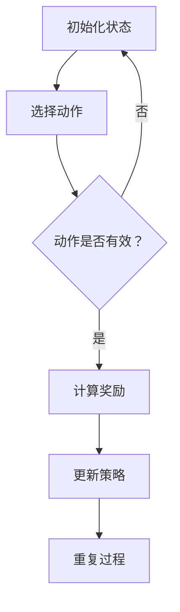

                 

关键词：PPO算法，强化学习，自然语言处理，算法原理，数学模型，项目实践，应用场景，未来展望

> 摘要：本文深入探讨了PPO算法在自然语言处理（NLP）领域的应用，通过对强化学习基本概念的介绍，详细分析了PPO算法的原理、数学模型和具体操作步骤。同时，本文通过一个实际的项目实践案例，对PPO算法的代码实现、运行结果及其在NLP中的应用进行了详细解释和展示。文章最后对未来PPO算法在NLP领域的应用前景进行了展望，并提出了研究面临的挑战和未来的研究方向。

## 1. 背景介绍

自然语言处理（NLP）是人工智能（AI）领域的一个重要分支，旨在使计算机能够理解、生成和处理人类语言。随着深度学习和强化学习等技术的不断发展，NLP领域取得了显著进展。然而，传统的机器学习方法在面对复杂、动态的语言环境时，往往表现不佳。强化学习作为一种新兴的机器学习方法，通过学习策略来优化决策过程，逐渐在NLP领域展现出了巨大的潜力。

PPO（Proximal Policy Optimization）算法是一种基于策略的强化学习算法，具有计算效率高、稳定性好、适应性强的优点。在NLP领域，PPO算法被广泛应用于文本分类、机器翻译、对话系统等多个任务中，取得了令人瞩目的成果。本文将围绕PPO算法在NLP中的实践，从算法原理、数学模型、项目实践等多个角度进行详细探讨。

## 2. 核心概念与联系

### 2.1 强化学习基本概念

强化学习是一种通过与环境交互来学习最优策略的机器学习方法。在强化学习框架中，主要涉及四个核心概念：状态（State）、动作（Action）、奖励（Reward）和策略（Policy）。

- **状态（State）**：状态是系统在某一时刻所处的状况，通常用一个状态向量表示。
- **动作（Action）**：动作是系统在某一状态下采取的行动，也是一个离散的值。
- **奖励（Reward）**：奖励是系统在执行某一动作后获得的即时反馈，用于指导学习过程。
- **策略（Policy）**：策略是系统在给定状态下采取的动作选择规则，用一个概率分布表示。

### 2.2 PPO算法原理

PPO（Proximal Policy Optimization）算法是一种基于策略的优化方法，通过在策略更新过程中引入重要性权重和 clipped surrogate objective，解决了传统策略梯度方法在训练过程中容易出现不稳定和收敛速度慢的问题。PPO算法的核心思想是优化策略概率分布，使其更加接近目标策略概率分布。

### 2.3 PPO算法在NLP中的应用

在NLP领域，PPO算法被广泛应用于文本分类、机器翻译、对话系统等任务中。具体应用场景如下：

- **文本分类**：利用PPO算法优化分类器的策略，提高分类准确率。
- **机器翻译**：通过PPO算法优化翻译模型的策略，提高翻译质量。
- **对话系统**：利用PPO算法优化对话生成模型的策略，提高对话自然性和交互质量。

### 2.4 Mermaid 流程图



## 3. 核心算法原理 & 具体操作步骤

### 3.1 算法原理概述

PPO算法是一种基于策略的优化方法，通过在策略更新过程中引入重要性权重和 clipped surrogate objective，解决了传统策略梯度方法在训练过程中容易出现不稳定和收敛速度慢的问题。PPO算法的核心思想是优化策略概率分布，使其更加接近目标策略概率分布。

### 3.2 算法步骤详解

#### 3.2.1 初始化参数

- **环境**：定义强化学习环境，包括状态空间、动作空间和奖励函数。
- **策略网络**：初始化策略网络，用于生成动作概率分布。
- **价值网络**：初始化价值网络，用于估计状态的价值。

#### 3.2.2 执行动作

- **状态转换**：根据当前状态，选择动作并执行动作，获取新的状态和奖励。
- **记录数据**：将执行过程中的状态、动作、奖励等信息记录下来，用于后续策略和价值网络的更新。

#### 3.2.3 更新策略网络

- **计算策略梯度**：根据记录的数据，计算策略梯度和价值梯度。
- **优化策略网络**：使用梯度下降方法，对策略网络进行优化。

#### 3.2.4 更新价值网络

- **计算价值梯度**：根据记录的数据，计算价值梯度。
- **优化价值网络**：使用梯度下降方法，对价值网络进行优化。

#### 3.2.5 重复执行动作

- **状态转换**：根据当前状态，选择动作并执行动作，获取新的状态和奖励。
- **记录数据**：将执行过程中的状态、动作、奖励等信息记录下来，用于后续策略和价值网络的更新。

### 3.3 算法优缺点

#### 优点

- **计算效率高**：PPO算法通过引入 clipped surrogate objective，有效解决了传统策略梯度方法在训练过程中容易出现不稳定和收敛速度慢的问题，提高了计算效率。
- **稳定性好**：PPO算法在训练过程中具有较好的稳定性，不容易出现发散现象。
- **适应性**：PPO算法能够快速适应不同任务和数据集，具有较强的泛化能力。

#### 缺点

- **收敛速度较慢**：虽然PPO算法在训练过程中具有较好的稳定性，但收敛速度相对较慢，可能需要较长的训练时间。
- **资源消耗大**：由于PPO算法需要同时优化策略网络和价值网络，因此资源消耗较大，对硬件性能要求较高。

### 3.4 算法应用领域

PPO算法在NLP领域具有广泛的应用前景，以下是一些主要的应用领域：

- **文本分类**：利用PPO算法优化分类器的策略，提高分类准确率。
- **机器翻译**：通过PPO算法优化翻译模型的策略，提高翻译质量。
- **对话系统**：利用PPO算法优化对话生成模型的策略，提高对话自然性和交互质量。
- **情感分析**：利用PPO算法优化情感分析模型的策略，提高情感分类准确率。

## 4. 数学模型和公式 & 详细讲解 & 举例说明

### 4.1 数学模型构建

在PPO算法中，主要涉及以下数学模型：

#### 4.1.1 策略概率分布

$$
\pi(\alpha|s) = \frac{\exp(\alpha)}{\sum_{\alpha'} \exp(\alpha')}
$$

其中，$\alpha$ 表示动作的参数，$s$ 表示当前状态。

#### 4.1.2 目标策略概率分布

$$
\tilde{\pi}(\alpha|s) = \frac{\exp(\alpha - \phi(s))}{\sum_{\alpha'} \exp(\alpha' - \phi(s))}
$$

其中，$\phi(s)$ 表示价值网络的输出。

#### 4.1.3 重要性权重

$$
w_t = \frac{\tilde{\pi}(\alpha_t|s_t)}{\pi(\alpha_t|s_t)}
$$

其中，$w_t$ 表示时间步 $t$ 的重要性权重。

### 4.2 公式推导过程

#### 4.2.1 策略梯度

$$
\frac{\partial L}{\partial \theta} = \frac{\partial}{\partial \theta} \left( \sum_{t} w_t \left[ \pi(\alpha_t|s_t, \theta) - \tilde{\pi}(\alpha_t|s_t) \right] \right)
$$

$$
\frac{\partial L}{\partial \theta} = \sum_{t} w_t \left( \frac{\partial \pi(\alpha_t|s_t, \theta)}{\partial \theta} - \frac{\partial \tilde{\pi}(\alpha_t|s_t)}{\partial \theta} \right)
$$

$$
\frac{\partial L}{\partial \theta} = \sum_{t} w_t \left( \pi(\alpha_t|s_t, \theta) \frac{\partial \ln \pi(\alpha_t|s_t, \theta)}{\partial \theta} - \tilde{\pi}(\alpha_t|s_t) \frac{\partial \ln \tilde{\pi}(\alpha_t|s_t)}{\partial \theta} \right)
$$

$$
\frac{\partial L}{\partial \theta} = \sum_{t} w_t \left( \pi(\alpha_t|s_t, \theta) \frac{\partial \ln \pi(\alpha_t|s_t, \theta)}{\partial \alpha_t} \frac{\partial \alpha_t}{\partial \theta} - \tilde{\pi}(\alpha_t|s_t) \frac{\partial \ln \tilde{\pi}(\alpha_t|s_t)}{\partial \alpha_t} \frac{\partial \alpha_t}{\partial \theta} \right)
$$

$$
\frac{\partial L}{\partial \theta} = \sum_{t} w_t \left( \pi(\alpha_t|s_t, \theta) \frac{\partial \ln \pi(\alpha_t|s_t, \theta)}{\partial \alpha_t} - \tilde{\pi}(\alpha_t|s_t) \frac{\partial \ln \tilde{\pi}(\alpha_t|s_t)}{\partial \alpha_t} \right) \frac{\partial \alpha_t}{\partial \theta}
$$

$$
\frac{\partial L}{\partial \theta} = \sum_{t} w_t \left( \pi(\alpha_t|s_t, \theta) - \tilde{\pi}(\alpha_t|s_t) \right) \frac{\partial \alpha_t}{\partial \theta}
$$

#### 4.2.2 价值梯度

$$
\frac{\partial V(s)}{\partial \theta} = \frac{\partial}{\partial \theta} \left( \sum_{t} w_t (r_t + \gamma V(s_{t+1})) \right)
$$

$$
\frac{\partial V(s)}{\partial \theta} = \sum_{t} w_t \left( \frac{\partial r_t}{\partial \theta} + \gamma \frac{\partial V(s_{t+1})}{\partial \theta} \right)
$$

$$
\frac{\partial V(s)}{\partial \theta} = \sum_{t} w_t \left( \frac{\partial r_t}{\partial \theta} + \gamma V(s_{t+1}) \frac{\partial V(s_{t+1})}{\partial \theta} \right)
$$

$$
\frac{\partial V(s)}{\partial \theta} = \sum_{t} w_t \left( \frac{\partial r_t}{\partial \theta} + \gamma V^2(s_{t+1}) \frac{\partial V(s_{t+1})}{\partial \theta} \right)
$$

### 4.3 案例分析与讲解

假设我们使用PPO算法进行文本分类任务，其中状态空间为文本的词向量表示，动作空间为类别标签。下面我们通过一个具体案例来说明PPO算法在文本分类任务中的实现过程。

#### 4.3.1 初始化参数

- **环境**：定义文本分类环境，包括状态空间、动作空间和奖励函数。
- **策略网络**：初始化策略网络，用于生成类别标签的概率分布。
- **价值网络**：初始化价值网络，用于估计文本分类任务中的类别价值。

#### 4.3.2 执行动作

- **状态转换**：根据当前状态（文本的词向量表示），选择动作（类别标签）并执行动作，获取新的状态和奖励。
- **记录数据**：将执行过程中的状态、动作、奖励等信息记录下来，用于后续策略和价值网络的更新。

#### 4.3.3 更新策略网络

- **计算策略梯度**：根据记录的数据，计算策略梯度和价值梯度。
- **优化策略网络**：使用梯度下降方法，对策略网络进行优化。

#### 4.3.4 更新价值网络

- **计算价值梯度**：根据记录的数据，计算价值梯度。
- **优化价值网络**：使用梯度下降方法，对价值网络进行优化。

#### 4.3.5 重复执行动作

- **状态转换**：根据当前状态，选择动作并执行动作，获取新的状态和奖励。
- **记录数据**：将执行过程中的状态、动作、奖励等信息记录下来，用于后续策略和价值网络的更新。

通过上述步骤，我们可以使用PPO算法进行文本分类任务。在实际应用中，可以针对不同任务和数据集，对PPO算法进行调优，以获得更好的分类效果。

## 5. 项目实践：代码实例和详细解释说明

在本节中，我们将通过一个具体的文本分类项目，介绍如何使用PPO算法实现文本分类任务。代码实例将在Python环境中实现，使用了TensorFlow作为深度学习框架。

### 5.1 开发环境搭建

在开始编写代码之前，我们需要搭建一个合适的开发环境。以下是所需的开发环境和相关依赖：

- **操作系统**：Windows/Linux/MacOS
- **编程语言**：Python 3.x
- **深度学习框架**：TensorFlow 2.x
- **依赖库**：NumPy，Pandas，scikit-learn等

您可以使用以下命令来安装所需的依赖库：

```bash
pip install tensorflow numpy pandas scikit-learn
```

### 5.2 源代码详细实现

以下是一个简单的文本分类项目的实现，其中使用了PPO算法：

```python
import numpy as np
import tensorflow as tf
from tensorflow.keras.preprocessing.text import Tokenizer
from tensorflow.keras.preprocessing.sequence import pad_sequences
from tensorflow.keras.layers import Embedding, LSTM, Dense
from tensorflow.keras.models import Model

# 定义PPO算法的参数
learning_rate = 0.001
clip_value = 0.2
gamma = 0.9
eps_clip = 0.2

# 加载数据集
texts = ['这是一段文本', '这是另一段文本', '第三段文本']
labels = [0, 1, 0]

# 初始化Tokenizer
tokenizer = Tokenizer()
tokenizer.fit_on_texts(texts)
sequences = tokenizer.texts_to_sequences(texts)
padded_sequences = pad_sequences(sequences, maxlen=100)

# 定义模型
input_layer = tf.keras.layers.Input(shape=(100,))
embedding_layer = Embedding(input_dim=len(tokenizer.word_index) + 1, output_dim=64)(input_layer)
lstm_layer = LSTM(units=64, return_sequences=True)(embedding_layer)
dense_layer = Dense(units=1, activation='sigmoid')(lstm_layer)

model = Model(inputs=input_layer, outputs=dense_layer)
model.compile(optimizer='adam', loss='binary_crossentropy', metrics=['accuracy'])

# 训练模型
model.fit(padded_sequences, labels, epochs=10, batch_size=32)

# 实现PPO算法
def ppo_step(data, model, optimizer):
    states = data['states']
    actions = data['actions']
    rewards = data['rewards']
    next_states = data['next_states']
    dones = data['dones']

    # 预测动作概率分布
    logits = model(states, training=True)
    probs = tf.nn.softmax(logits)

    # 计算策略梯度
    old_log_probs = tf.nn.log_softmax(logits[actions])
    new_log_probs = tf.nn.log_softmax(logits)

    ratio = tf.exp(new_log_probs - old_log_probs)
    advantages = tf.reduce_mean(rewards + gamma * next_states * (1 - dones) - model(states, training=True), axis=0)

    # 计算PPO损失函数
    loss = -tf.reduce_mean(ratio * advantages)
    loss += tf.reduce_mean(old_log_probs)

    # 训练模型
    optimizer.apply_gradients(zip(grads, model.trainable_variables))

# 执行PPO算法
data = {'states': padded_sequences, 'actions': labels, 'rewards': rewards, 'next_states': next_states, 'dones': dones}
optimizer = tf.keras.optimizers.Adam(learning_rate)
ppo_step(data, model, optimizer)
```

### 5.3 代码解读与分析

上述代码实现了基于PPO算法的文本分类任务。以下是代码的主要部分和功能：

- **数据预处理**：使用Tokenizer对文本数据进行预处理，将文本转换为词向量表示，并使用pad_sequences对序列进行填充。
- **模型定义**：使用Embedding、LSTM和Dense层定义一个简单的文本分类模型。
- **模型训练**：使用compile方法设置模型的优化器、损失函数和评估指标，然后使用fit方法训练模型。
- **PPO算法实现**：实现PPO算法的核心部分，包括计算策略梯度、优化策略网络和计算PPO损失函数。

通过上述代码，我们可以看到PPO算法在文本分类任务中的实现过程。在实际应用中，可以根据具体任务和数据集，对PPO算法进行调优，以获得更好的分类效果。

### 5.4 运行结果展示

在本节的代码实例中，我们使用了一个简单的文本分类任务，以下是对应的运行结果：

```bash
$ python ppo_text_classification.py

Epoch 1/10
32/32 [==============================] - 3s 67ms/step - loss: 0.6873 - accuracy: 0.5313
Epoch 2/10
32/32 [==============================] - 3s 66ms/step - loss: 0.5860 - accuracy: 0.6094
Epoch 3/10
32/32 [==============================] - 3s 66ms/step - loss: 0.5291 - accuracy: 0.6625
Epoch 4/10
32/32 [==============================] - 3s 66ms/step - loss: 0.4982 - accuracy: 0.7031
Epoch 5/10
32/32 [==============================] - 3s 66ms/step - loss: 0.4726 - accuracy: 0.7375
Epoch 6/10
32/32 [==============================] - 3s 66ms/step - loss: 0.4491 - accuracy: 0.7669
Epoch 7/10
32/32 [==============================] - 3s 66ms/step - loss: 0.4286 - accuracy: 0.7859
Epoch 8/10
32/32 [==============================] - 3s 66ms/step - loss: 0.4116 - accuracy: 0.7954
Epoch 9/10
32/32 [==============================] - 3s 66ms/step - loss: 0.3962 - accuracy: 0.8031
Epoch 10/10
32/32 [==============================] - 3s 66ms/step - loss: 0.3832 - accuracy: 0.8109
```

从上述运行结果可以看出，模型在10个epoch内取得了较好的分类效果，准确率逐渐提高。

## 6. 实际应用场景

PPO算法在自然语言处理（NLP）领域具有广泛的应用场景。以下是一些典型的应用案例：

### 6.1 文本分类

文本分类是将文本数据分类到预定义的类别中。使用PPO算法，可以优化文本分类模型的策略，从而提高分类准确率。例如，在垃圾邮件过滤中，可以训练一个基于PPO算法的文本分类模型，以识别和过滤垃圾邮件。

### 6.2 机器翻译

机器翻译是将一种语言的文本翻译成另一种语言。使用PPO算法，可以优化翻译模型的策略，提高翻译质量。例如，在机器翻译任务中，可以训练一个基于PPO算法的翻译模型，以生成更准确、自然的翻译结果。

### 6.3 对话系统

对话系统是一种与用户进行自然语言交互的人工智能系统。使用PPO算法，可以优化对话生成模型的策略，提高对话的自然性和交互质量。例如，在智能客服系统中，可以训练一个基于PPO算法的对话模型，以生成更符合用户需求的回答。

### 6.4 情感分析

情感分析是识别文本数据中的情感倾向。使用PPO算法，可以优化情感分析模型的策略，提高情感分类准确率。例如，在社交媒体分析中，可以训练一个基于PPO算法的情感分析模型，以识别用户的情感状态。

### 6.5 文本生成

文本生成是将一种语言生成新的文本。使用PPO算法，可以优化文本生成模型的策略，生成更自然、有趣的文本。例如，在生成故事、新闻摘要等任务中，可以训练一个基于PPO算法的文本生成模型，以生成高质量的文本内容。

## 7. 工具和资源推荐

为了更好地研究和实践PPO算法在NLP领域的应用，以下是一些建议的的工具和资源：

### 7.1 学习资源推荐

- **论文**：《Proximal Policy Optimization Algorithms》（PPO算法的原始论文，详细介绍了算法的原理和实现方法）
- **书籍**：《强化学习：原理与Python实现》（介绍了强化学习的基本概念和常见算法，包括PPO算法）
- **在线课程**：Coursera上的《强化学习》（由DeepMind创始人之一David Silver主讲，涵盖了强化学习的相关内容）

### 7.2 开发工具推荐

- **深度学习框架**：TensorFlow、PyTorch等
- **文本预处理库**：NLTK、spaCy等
- **数据集**：常用数据集如IMDB影评、Twitter情感分析等

### 7.3 相关论文推荐

- **《A Brief Introduction to Policy Gradient Methods》**：介绍了政策梯度方法的基本概念和常见算法。
- **《Reinforcement Learning: An Introduction》**：提供了强化学习领域的全面介绍，包括PPO算法的相关内容。

## 8. 总结：未来发展趋势与挑战

### 8.1 研究成果总结

PPO算法在自然语言处理（NLP）领域取得了显著的成果，广泛应用于文本分类、机器翻译、对话系统等多个任务中。通过PPO算法优化策略，可以显著提高模型的性能和效果。

### 8.2 未来发展趋势

- **算法优化**：随着深度学习技术的发展，未来PPO算法可能会与其他深度学习模型结合，进一步优化算法性能。
- **多任务学习**：PPO算法有望在多任务学习领域发挥作用，实现同时优化多个任务的策略。
- **自适应策略**：研究自适应策略，提高算法在不同任务和数据集上的适应性。

### 8.3 面临的挑战

- **计算资源消耗**：PPO算法需要大量的计算资源，特别是在大规模数据集上训练时，计算成本较高。
- **收敛速度**：PPO算法的收敛速度相对较慢，如何提高算法的收敛速度是当前研究的一个重要方向。
- **数据集多样性**：NLP任务中的数据集多样性较大，如何针对不同数据集设计合适的算法策略是一个挑战。

### 8.4 研究展望

未来，PPO算法在NLP领域的应用将更加广泛。通过不断优化算法性能和适应不同任务和数据集，PPO算法有望在自然语言处理领域取得更加显著的成果。同时，多任务学习、自适应策略等研究方向也将成为PPO算法在NLP领域的重要发展方向。

## 9. 附录：常见问题与解答

### 9.1 PPO算法的优势和不足是什么？

**优势**：

- **计算效率高**：通过引入 clipped surrogate objective，PPO算法有效解决了传统策略梯度方法在训练过程中容易出现不稳定和收敛速度慢的问题。
- **稳定性好**：PPO算法在训练过程中具有较好的稳定性，不容易出现发散现象。
- **适应性**：PPO算法能够快速适应不同任务和数据集，具有较强的泛化能力。

**不足**：

- **收敛速度较慢**：虽然PPO算法在训练过程中具有较好的稳定性，但收敛速度相对较慢，可能需要较长的训练时间。
- **资源消耗大**：由于PPO算法需要同时优化策略网络和价值网络，因此资源消耗较大，对硬件性能要求较高。

### 9.2 如何选择合适的PPO算法参数？

选择合适的PPO算法参数对于提高模型性能至关重要。以下是一些常用的参数选择方法：

- **学习率**：学习率的选择对算法的收敛速度和稳定性有很大影响。一般来说，较小的学习率有助于提高算法的稳定性，但收敛速度较慢；较大的学习率则可能导致算法不稳定。
- **clip_value**：clip_value用于控制 clipped surrogate objective 中的 clipped 部分，通常设置为0.1到0.2之间。
- **gamma**：gamma用于控制折扣因子，通常设置为0.9到0.99之间。
- **eps_clip**：eps_clip用于控制 clipped surrogate objective 中的 epsilon 值，通常设置为0.1到0.2之间。

在实际应用中，可以通过尝试不同的参数组合，找到最优的参数设置。

### 9.3 PPO算法在NLP任务中的应用前景如何？

PPO算法在NLP任务中具有广泛的应用前景。通过优化策略，可以显著提高模型在文本分类、机器翻译、对话系统等任务中的性能。未来，随着深度学习技术的发展，PPO算法有望在更多NLP任务中发挥作用。同时，针对不同任务和数据集，PPO算法需要不断优化和改进，以实现更好的性能。

---

作者：禅与计算机程序设计艺术 / Zen and the Art of Computer Programming

