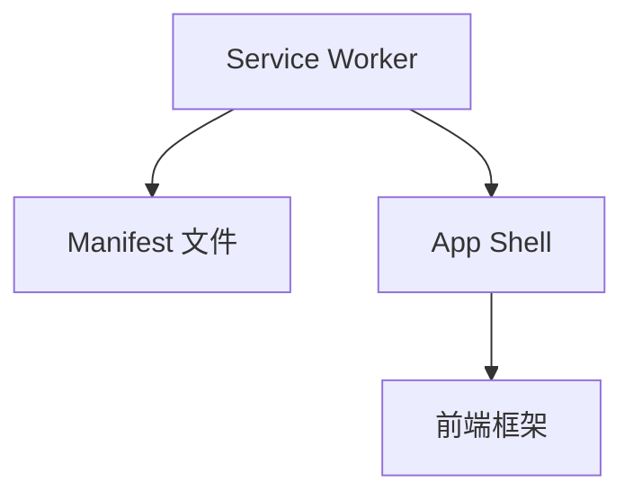

                 

关键词： Progressive Web Apps (PWA), Web 应用，原生应用，用户体验，性能优化，渐进式增强，跨平台开发

> 摘要：随着移动互联网的快速发展，Web应用和原生应用在用户中都有着广泛的应用。然而，它们各自存在一些局限，如Web应用性能有限，原生应用开发成本高、更新困难。本文将探讨Progressive Web Apps（PWA）的概念、原理、开发技术以及其在实际应用中的优势和未来发展趋势，以期为开发者提供一种全新的开发思路。

## 1. 背景介绍

### 1.1 Web应用与原生应用的区别

Web应用是基于浏览器运行的应用程序，可以通过URL访问。而原生应用是直接安装在设备上的应用程序，通常使用特定平台的开发语言（如iOS的Swift、Android的Kotlin）进行开发。Web应用和原生应用在以下几个方面存在区别：

- **访问方式**：Web应用通过URL访问，而原生应用需要安装到设备上。
- **开发语言**：Web应用使用HTML、CSS和JavaScript等Web技术进行开发，而原生应用使用平台特定的语言和框架。
- **性能**：原生应用通常具有更好的性能，因为它们可以直接与设备硬件交互。而Web应用则依赖于浏览器的渲染能力。
- **更新和维护**：原生应用的更新需要用户主动下载和安装，而Web应用可以通过服务器端进行更新。

### 1.2 Progressive Web Apps（PWA）

Progressive Web Apps（PWA）是一种新型Web应用，它结合了Web应用和原生应用的特点，具有以下优势：

- **渐进式增强**：PWA可以在任何设备上运行，从基本的Web浏览体验到完整的原生应用体验。
- **跨平台**：PWA可以在多个平台上运行，无需为每个平台单独开发。
- **性能优化**：PWA采用了各种技术来提高性能，如懒加载、离线缓存等。
- **用户体验**：PWA提供了类似原生应用的流畅体验，包括动画效果、推送通知等。
- **安全性**：PWA采用了HTTPS协议，确保了用户数据的安全。

## 2. 核心概念与联系

### 2.1 PWA的核心概念

PWA的核心概念包括以下几个部分：

- **Service Worker**：Service Worker是一种运行在浏览器背后的独立线程，用于处理网络请求、缓存文件等。它使得PWA能够在没有网络连接的情况下运行。
- **Manifest 文件**：Manifest 文件是一个JSON格式的文件，描述了PWA的基本信息，如名称、图标、启动页面等。通过Manifest文件，用户可以添加到主屏幕，实现原生应用的启动方式。
- **App Shell 模式**：App Shell 模式是一种优化PWA加载速度的方法。它将页面内容分为结构和内容两部分，在首次加载时只加载结构（如导航栏、底部菜单等），然后在用户操作时动态加载内容。

### 2.2 PWA的架构

PWA的架构主要包括以下几个部分：

- **Service Worker**：负责处理网络请求、缓存文件等。
- **Manifest 文件**：描述PWA的基本信息。
- **App Shell**：包括结构和内容两部分，实现快速加载和交互。
- **前端框架**：如React、Vue等，用于构建PWA的前端页面。

下面是一个Mermaid流程图，展示了PWA的架构：



### 2.3 PWA的优势与挑战

PWA的优势包括：

- **跨平台**：无需为每个平台单独开发，节省了开发和维护成本。
- **性能优化**：通过缓存、懒加载等技术提高加载速度和用户体验。
- **用户体验**：提供类似原生应用的流畅体验，包括动画效果、推送通知等。

PWA的挑战包括：

- **兼容性问题**：部分浏览器对Service Worker等技术的支持不够完善。
- **学习成本**：开发者需要掌握新的技术和工具。
- **推广难度**：用户对PWA的认知度较低，推广难度较大。

## 3. 核心算法原理 & 具体操作步骤

### 3.1 算法原理概述

PWA的核心算法原理主要包括以下几个方面：

- **Service Worker**：Service Worker是一种运行在浏览器背后的独立线程，用于处理网络请求、缓存文件等。它使得PWA能够在没有网络连接的情况下运行。
- **Manifest 文件**：Manifest 文件是一个JSON格式的文件，描述了PWA的基本信息，如名称、图标、启动页面等。通过Manifest文件，用户可以添加到主屏幕，实现原生应用的启动方式。
- **App Shell 模式**：App Shell 模式是一种优化PWA加载速度的方法。它将页面内容分为结构和内容两部分，在首次加载时只加载结构（如导航栏、底部菜单等），然后在用户操作时动态加载内容。

### 3.2 算法步骤详解

PWA的开发主要包括以下几个步骤：

1. **搭建开发环境**：安装Node.js、npm、webpack等开发工具。
2. **创建PWA项目**：使用Vue、React等前端框架创建PWA项目。
3. **配置Service Worker**：在项目中配置Service Worker，用于处理网络请求和缓存文件。
4. **配置Manifest 文件**：在项目中配置Manifest 文件，描述PWA的基本信息。
5. **优化App Shell**：将页面内容分为结构和内容两部分，实现快速加载和交互。
6. **测试和调试**：在开发过程中不断测试和调试，确保PWA在各种设备和浏览器上都能正常运行。

### 3.3 算法优缺点

**优点**：

- **跨平台**：无需为每个平台单独开发，节省了开发和维护成本。
- **性能优化**：通过缓存、懒加载等技术提高加载速度和用户体验。
- **用户体验**：提供类似原生应用的流畅体验，包括动画效果、推送通知等。

**缺点**：

- **兼容性问题**：部分浏览器对Service Worker等技术的支持不够完善。
- **学习成本**：开发者需要掌握新的技术和工具。
- **推广难度**：用户对PWA的认知度较低，推广难度较大。

### 3.4 算法应用领域

PWA广泛应用于各种领域，如电子商务、在线教育、社交媒体等。以下是一些应用案例：

- **阿里巴巴**：阿里巴巴的PWA应用使得用户在访问淘宝、天猫等平台时能够获得更好的性能和用户体验。
- **Coursera**：在线教育平台Coursera使用PWA技术优化了课程加载速度和用户体验。
- **Twitter**：Twitter的PWA应用提供了更快的加载速度和更好的交互体验。

## 4. 数学模型和公式 & 详细讲解 & 举例说明

### 4.1 数学模型构建

PWA的性能优化可以通过以下数学模型进行描述：

$$
T = \frac{C + S + D + R}{N}
$$

其中：

- \( T \) 表示页面加载时间。
- \( C \) 表示首次加载时的结构加载时间。
- \( S \) 表示首次加载时的内容加载时间。
- \( D \) 表示后续操作时动态加载内容的时间。
- \( R \) 表示资源缓存时间。
- \( N \) 表示网络延迟时间。

通过优化上述各个部分，可以降低页面加载时间，提高性能。

### 4.2 公式推导过程

页面加载时间可以分为以下几个部分：

1. **首次加载时间**：

   首次加载时间可以分为结构加载时间和内容加载时间：

   $$
   C = \frac{N_{\text{结构}}}{N}
   $$

   $$ 
   S = \frac{N_{\text{内容}}}{N}
   $$

   其中，\( N_{\text{结构}} \) 和 \( N_{\text{内容}} \) 分别表示结构资源和内容资源的数量。

2. **后续操作时间**：

   后续操作时，只需要动态加载内容，因此：

   $$
   D = \frac{N_{\text{动态内容}}}{N}
   $$

3. **资源缓存时间**：

   通过缓存技术，可以减少后续加载所需的时间。因此：

   $$
   R = \frac{N_{\text{缓存}}}{N}
   $$

   其中，\( N_{\text{缓存}} \) 表示缓存资源的数量。

4. **网络延迟时间**：

   网络延迟时间主要取决于网络环境和服务器响应时间。因此：

   $$
   N = \frac{N_{\text{网络}}}{N}
   $$

   其中，\( N_{\text{网络}} \) 表示网络延迟时间。

将上述公式代入总加载时间公式，得到：

$$
T = \frac{C + S + D + R}{N}
$$

### 4.3 案例分析与讲解

假设一个PWA应用的页面包含以下资源：

- **结构资源**：100KB
- **内容资源**：200KB
- **动态内容资源**：50KB
- **缓存资源**：150KB
- **网络延迟时间**：50ms

根据上述数学模型，我们可以计算出页面加载时间：

$$
T = \frac{100KB + 200KB + 50KB + 150KB}{50ms}
$$

$$
T = \frac{500KB}{50ms}
$$

$$
T = 10s
$$

通过优化上述各个部分，例如减少结构资源和内容资源的数量，提高缓存资源的使用率，可以降低页面加载时间，提高性能。

## 5. 项目实践：代码实例和详细解释说明

### 5.1 开发环境搭建

在本节中，我们将使用Vue框架搭建一个简单的PWA项目。以下是开发环境的搭建步骤：

1. **安装Node.js**：从[Node.js官网](https://nodejs.org/)下载并安装Node.js。
2. **安装Vue CLI**：在命令行中运行以下命令安装Vue CLI：

   ```bash
   npm install -g @vue/cli
   ```

3. **创建PWA项目**：在命令行中运行以下命令创建一个简单的PWA项目：

   ```bash
   vue create my-pwa
   ```

   在创建项目时，选择PWA选项。

### 5.2 源代码详细实现

在创建好的PWA项目中，我们可以看到以下文件结构：

```plaintext
my-pwa/
|-- public/
|   |-- index.html
|   |-- manifest.json
|-- src/
|   |-- assets/
|   |   |-- logo.png
|   |-- components/
|   |   |-- App.vue
|   |-- main.js
|-- package.json
```

在`public/manifest.json`文件中，我们可以看到Manifest文件的配置内容：

```json
{
  "name": "My PWA",
  "short_name": "My PWA",
  "start_url": "./index.html",
  "background_color": "#ffffff",
  "theme_color": "#000000",
  "display": "standalone",
  "icons": [
    {
      "src": "logo.png",
      "sizes": "192x192",
      "type": "image/png"
    },
    {
      "src": "logo.png",
      "sizes": "512x512",
      "type": "image/png"
    }
  ]
}
```

在`src/components/App.vue`文件中，我们可以看到PWA的主要页面内容：

```vue
<template>
  <div id="app">
    
    <h1>My PWA</h1>
    <p>
      Welcome to Your PWA!
    </p>
  </div>
</template>

<script>
export default {
  name: 'App',
};
</script>

<style>
#app {
  font-family: Avenir, Helvetica, Arial, sans-serif;
  -webkit-font-smoothing: antialiased;
  -moz-osx-font-smoothing: grayscale;
  text-align: center;
  color: #2c3e50;
  margin-top: 60px;
}
</style>
```

在`src/main.js`文件中，我们引入Service Worker：

```javascript
if ('serviceWorker' in navigator) {
  window.addEventListener('load', () => {
    navigator.serviceWorker.register('/service-worker.js').then(registration => {
      console.log('Service Worker registered:', registration);
    }).catch(error => {
      console.error('Service Worker registration failed:', error);
    });
  });
}
```

在`src/service-worker.js`文件中，我们实现Service Worker的功能：

```javascript
const CACHE_NAME = 'my-pwa-cache-v1';
const urlsToCache = [
  '/',
  '/index.html',
  '/src/assets/logo.png'
];

self.addEventListener('install', event => {
  event.waitUntil(
    caches.open(CACHE_NAME)
      .then(cache => {
        console.log('Opened cache');
        return cache.addAll(urlsToCache);
      })
  );
});

self.addEventListener('fetch', event => {
  event.respondWith(
    caches.match(event.request)
      .then(response => {
        if (response) {
          return response;
        }
        return fetch(event.request);
      }
    )
  );
});
```

### 5.3 代码解读与分析

在上述代码中，我们首先在`main.js`文件中注册Service Worker。在`service-worker.js`文件中，我们实现以下功能：

1. **安装阶段（install）**：Service Worker在安装阶段会打开指定的缓存，并将预定义的URLs添加到缓存中。在本例中，我们缓存了`/`、`/index.html`和`/src/assets/logo.png`三个URL。
2. **fetch 阶段（fetch）**：在fetch阶段，Service Worker会尝试匹配请求的URL，并返回缓存中的响应。如果缓存中不存在匹配的响应，则直接从网络获取。这种策略可以实现离线访问和缓存优化。

通过这些代码，我们可以实现一个基本的PWA应用。用户可以在没有网络连接的情况下访问应用，并获得良好的性能和用户体验。

### 5.4 运行结果展示

在完成上述代码实现后，我们可以使用以下命令启动PWA应用：

```bash
npm run serve
```

在浏览器中访问`http://localhost:8080`，我们可以看到以下页面：


通过上述示例，我们可以看到PWA应用的基本功能和运行效果。在实际开发中，我们可以根据需求添加更多功能，如推送通知、离线缓存等。

## 6. 实际应用场景

### 6.1 电子商务

在电子商务领域，PWA可以提供流畅的购物体验，包括快速加载商品列表、添加商品到购物车、下单等操作。例如，阿里巴巴的PWA应用使得用户在访问淘宝、天猫等平台时能够获得更好的性能和用户体验。

### 6.2 在线教育

在线教育平台使用PWA可以提供更好的课程加载速度和用户体验。例如，Coursera使用PWA技术优化了课程加载速度，使得用户能够更快地访问课程内容和互动。

### 6.3 社交媒体

社交媒体平台可以使用PWA提供更快的加载速度和更好的交互体验。例如，Twitter的PWA应用提供了更快的加载速度和更好的交互体验，使得用户能够更快地浏览和分享内容。

### 6.4 其他领域

除了上述领域，PWA还可以应用于其他领域，如金融、医疗、旅游等。PWA的应用可以提供更快的加载速度、更好的用户体验和更低的建设成本，有助于企业提高用户满意度和市场竞争力。

## 7. 工具和资源推荐

### 7.1 学习资源推荐

- **《Building Progressive Web Apps》**：由Alex Banks和Jason Beaird编写的书籍，详细介绍了PWA的开发方法和最佳实践。
- **《Service Workers: Take Control of the Web》**：由Addy Osmani编写的书籍，深入讲解了Service Worker的原理和应用。

### 7.2 开发工具推荐

- **Vue CLI**：Vue官方提供的命令行工具，用于快速搭建Vue项目，支持PWA开发。
- **Lighthouse**：Chrome DevTools中的一个工具，用于评估PWA的性能、可访问性、最佳实践等。

### 7.3 相关论文推荐

- **"Progressive Web Apps: Building for the modern web"**：由Alex Russell撰写的论文，详细介绍了PWA的概念、原理和应用。
- **"Service Workers: A Primer for Everyday Use"**：由Addy Osmani撰写的论文，深入讲解了Service Worker的原理和应用。

## 8. 总结：未来发展趋势与挑战

### 8.1 研究成果总结

PWA作为一种新兴的Web应用开发模式，已在多个领域得到广泛应用。通过渐进式增强、性能优化和用户体验提升，PWA为开发者提供了一种跨平台、高效、易用的开发方式。同时，PWA的技术体系不断完善，包括Service Worker、Manifest 文件、App Shell等，为开发者提供了丰富的开发工具和资源。

### 8.2 未来发展趋势

1. **PWA技术体系的不断完善**：随着Web技术的不断发展，PWA将引入更多先进的技术，如WebAssembly、WebVR等，进一步提升性能和用户体验。
2. **跨平台开发趋势的加强**：PWA的跨平台特性使其成为跨平台开发的首选方案，未来将有更多企业选择PWA作为主要开发模式。
3. **PWA应用的普及**：随着PWA技术的成熟和用户认知度的提高，PWA应用将在各个领域得到更广泛的应用。

### 8.3 面临的挑战

1. **兼容性问题**：部分浏览器对PWA技术的支持仍不完善，开发者需要针对不同浏览器进行适配和优化。
2. **学习成本**：PWA涉及多个技术领域，开发者需要掌握新的技术和工具，提高学习成本。
3. **推广难度**：用户对PWA的认知度较低，企业需要投入更多资源进行推广。

### 8.4 研究展望

1. **优化PWA性能**：继续探索和优化PWA的性能，如网络延迟优化、资源加载优化等。
2. **提升用户体验**：研究如何更好地结合Web和原生应用的特点，提升PWA的用户体验。
3. **降低学习成本**：开发易于使用和上手的PWA开发工具，降低开发者的学习成本。

## 9. 附录：常见问题与解答

### 9.1 什么是PWA？

PWA（Progressive Web Apps）是一种新型的Web应用开发模式，它结合了Web应用和原生应用的特点，具有跨平台、性能优化和用户体验提升等优势。

### 9.2 PWA有哪些优势？

PWA具有以下优势：

1. **跨平台**：无需为每个平台单独开发，节省了开发和维护成本。
2. **性能优化**：通过缓存、懒加载等技术提高加载速度和用户体验。
3. **用户体验**：提供类似原生应用的流畅体验，包括动画效果、推送通知等。

### 9.3 如何搭建PWA开发环境？

搭建PWA开发环境的步骤如下：

1. 安装Node.js。
2. 安装Vue CLI。
3. 使用Vue CLI创建PWA项目。

### 9.4 如何配置Service Worker？

在PWA项目中，通过以下步骤配置Service Worker：

1. 在`public/manifest.json`文件中配置`service_worker`字段。
2. 在`src/service-worker.js`文件中编写Service Worker代码。

### 9.5 如何测试PWA应用？

可以使用以下工具测试PWA应用：

1. **Lighthouse**：Chrome DevTools中的一个工具，用于评估PWA的性能、可访问性、最佳实践等。
2. **Service Worker Toolbox**：一款用于测试Service Worker的浏览器扩展程序。

---

作者：禅与计算机程序设计艺术 / Zen and the Art of Computer Programming
----------------------------------------------------------------

以上就是关于PWA（Progressive Web Apps）的详细技术博客文章。本文从背景介绍、核心概念与联系、核心算法原理与具体操作步骤、数学模型与公式、项目实践、实际应用场景、工具和资源推荐、未来发展趋势与挑战以及常见问题与解答等方面进行了全面、深入的阐述，希望对广大开发者有所帮助。在未来的Web应用开发中，PWA作为一种高效、易用的开发模式，将发挥越来越重要的作用。

