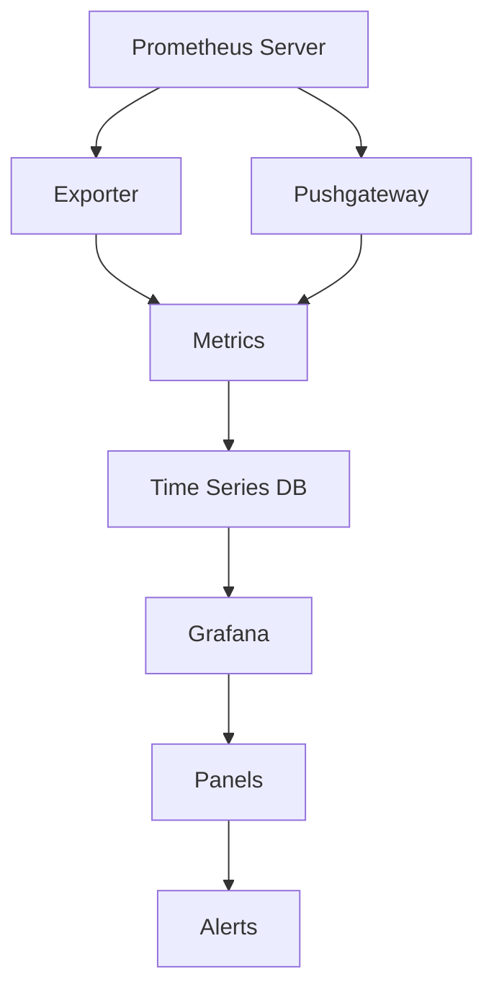

                 

关键词：Prometheus、Grafana、监控系统、Kubernetes、云原生、时序数据库、可视化仪表板

> 摘要：本文将详细介绍如何搭建基于Prometheus和Grafana的监控系统，涵盖从基础环境搭建、Prometheus的配置和监控数据的存储，到Grafana的可视化展示和告警设置。本文旨在帮助读者全面理解并实践Prometheus+Grafana监控系统，为云原生环境中的应用提供高效监控解决方案。

## 1. 背景介绍

随着现代企业IT架构的复杂化，对于系统监控的需求日益增加。监控系统不仅能够帮助运维人员及时发现并解决问题，还能通过数据分析优化系统性能。Prometheus和Grafana是当前云原生环境中非常流行的监控工具，二者结合能够为用户提供强大的监控解决方案。

### 1.1 Prometheus

Prometheus是一个开源的监控解决方案，由SoundCloud开发，并捐赠给CNCF（云原生计算基金会）。它采用拉模式监控，具有高度可扩展性和灵活性。Prometheus的核心组件包括：

- **Prometheus Server**：负责收集、存储和查询监控数据。
- **Exporter**：负责将监控数据导出到Prometheus Server。
- **Pushgateway**：用于推送临时监控数据。

### 1.2 Grafana

Grafana是一个开源的数据可视化和监控工具，可以与多种数据源集成，包括Prometheus。它提供了丰富的可视化仪表板和告警功能，用户可以自定义仪表板来展示关键指标，并通过告警规则自动通知运维人员。

### 1.3 为什么要使用Prometheus+Grafana

- **兼容性**：Prometheus与Kubernetes等云原生技术具有良好的兼容性。
- **可扩展性**：Prometheus的高效数据模型和Grafana的可视化能力能够处理大规模监控数据。
- **灵活性**：两者都可以通过配置文件和插件进行高度定制。

## 2. 核心概念与联系

在搭建Prometheus+Grafana监控系统时，需要理解以下几个核心概念：

### Prometheus

- **数据模型**：Prometheus使用时间序列数据模型，每个时间序列由一组标签和一系列样本组成。
- **PromQL**：Prometheus查询语言（PromQL），用于查询和操作时间序列数据。

### Grafana

- **数据源**：Grafana支持多种数据源，但与Prometheus集成最为紧密。
- **面板**：Grafana中的面板用于展示各种监控指标。
- **告警**：Grafana支持配置告警规则，通过邮件、短信、Slack等方式通知。

### Prometheus与Grafana的联系

- **数据传递**：Prometheus Server将采集到的监控数据存储在本地时间序列数据库中，Grafana通过HTTP API从Prometheus获取数据。
- **集成**：Grafana支持直接将Prometheus作为数据源，并通过PromQL进行数据查询。

### Mermaid流程图



## 3. 核心算法原理 & 具体操作步骤

### 3.1 算法原理概述

Prometheus监控系统的核心算法原理包括数据采集、存储和查询。

- **数据采集**：Prometheus通过Exporter定期从目标服务中获取监控数据。
- **数据存储**：Prometheus将采集到的数据存储在本地的时间序列数据库中。
- **数据查询**：Prometheus提供PromQL语言用于查询时间序列数据。

### 3.2 算法步骤详解

1. **配置Exporter**：确保所有需要监控的服务都安装了对应的Exporter。
2. **配置Prometheus**：定义需要监控的目标和规则文件。
3. **启动Prometheus**：启动Prometheus Server，并监控指定目标。
4. **配置Grafana**：在Grafana中添加Prometheus数据源，创建仪表板和告警规则。

### 3.3 算法优缺点

- **优点**：
  - **高效**：Prometheus采用水平扩展，可以处理大规模监控数据。
  - **灵活**：PromQL提供强大的数据查询功能。
  - **兼容性**：与Kubernetes等云原生技术具有良好的兼容性。

- **缺点**：
  - **复杂度**：配置和管理相对复杂。
  - **存储限制**：Prometheus使用本地时间序列数据库，对于海量数据可能需要额外的存储解决方案。

### 3.4 算法应用领域

- **云原生应用**：Prometheus+Grafana适合用于云原生环境中的服务监控。
- **大规模分布式系统**：Prometheus的高效数据模型和可扩展性使其成为大规模分布式系统的理想选择。

## 4. 数学模型和公式 & 详细讲解 & 举例说明

### 4.1 数学模型构建

Prometheus的数据模型基于时间序列，每个时间序列由一组标签和一系列样本组成。标签用于区分不同的时间序列，样本则包含时间和数值。

- **时间序列**：\[标签\]\[时间，数值\]
- **PromQL**：用于查询和操作时间序列数据，包括如下公式：
  - **avg()**：计算平均值。
  - **sum()**：计算总和。
  - **rate()**：计算数据点的增长率。

### 4.2 公式推导过程

以计算平均负载为例，PromQL公式如下：

```latex
avg(rateuplic(uptime{job="example"}[5m])) by (instance)
```

这个公式表示计算过去5分钟内，所有实例的平均负载率。

### 4.3 案例分析与讲解

假设我们有以下监控数据：

```bash
# HELP example_metric The example metric
# TYPE example_metric gauge
example_metric{instance="example.com"} 1.2
example_metric{instance="example.net"} 0.8
```

使用PromQL查询过去5分钟内的平均负载：

```bash
avg(rate(example_metric{instance=~"example.*"}[5m]))
```

结果为1.0，表示过去5分钟内，两个实例的平均负载为1.0。

## 5. 项目实践：代码实例和详细解释说明

### 5.1 开发环境搭建

在开始搭建监控系统之前，需要确保操作系统（如Ubuntu 20.04）和网络环境（如Docker）已经搭建好。

### 5.2 源代码详细实现

#### Prometheus配置

在Prometheus目录下创建`prometheus.yml`配置文件：

```yaml
global:
  scrape_interval: 15s
  evaluation_interval: 15s

scrape_configs:
  - job_name: 'prometheus'
    static_configs:
      - targets: ['localhost:9090']
  - job_name: 'example'
    static_configs:
      - targets: ['example.com:8080']
```

#### Grafana配置

在Grafana的`etc`目录下创建`grafana.ini`配置文件：

```ini
[datadog]
url = http://localhost:9090
username = admin
password = admin
api_version = 1
```

### 5.3 代码解读与分析

Prometheus配置文件定义了监控任务和目标。`global`部分定义了全局参数，如抓取间隔和评估间隔。`scrape_configs`部分定义了具体的监控任务，如Prometheus自身和外部服务。

Grafana配置文件定义了数据源，这里使用Prometheus作为数据源。

### 5.4 运行结果展示

启动Prometheus和Grafana：

```bash
docker run -p 9090:9090 prom/prometheus
docker run -d -p 3000:3000 grafana/grafana
```

访问Grafana，添加Prometheus数据源，创建仪表板并添加面板。

## 6. 实际应用场景

Prometheus+Grafana监控系统在企业中的应用场景非常广泛，如：

- **服务器监控**：监控服务器资源使用情况，如CPU、内存、磁盘等。
- **应用监控**：监控应用性能指标，如响应时间、吞吐量等。
- **数据库监控**：监控数据库性能和健康状态。

## 7. 工具和资源推荐

### 7.1 学习资源推荐

- Prometheus官方文档：https://prometheus.io/docs/introduction/overview/
- Grafana官方文档：https://grafana.com/docs/grafana/latest/introduction/
- Prometheus+Grafana最佳实践：https://github.com/prometheus-community/prometheus-operator

### 7.2 开发工具推荐

- Prometheus Operator：用于在Kubernetes上部署和管理Prometheus。
- Grafana Cloud：提供托管式Grafana服务。

### 7.3 相关论文推荐

- 《Prometheus: An Open Source Systems Monitor and Alerting Tool》：介绍Prometheus的设计和实现。
- 《Grafana：一个现代化的开源监控平台》：介绍Grafana的特点和应用。

## 8. 总结：未来发展趋势与挑战

### 8.1 研究成果总结

Prometheus+Grafana监控系统在云原生和大规模分布式系统中得到广泛应用，为用户提供强大的监控能力。

### 8.2 未来发展趋势

- **云原生集成**：更紧密地集成Kubernetes和其他云原生技术。
- **人工智能**：利用人工智能技术优化监控数据和告警。

### 8.3 面临的挑战

- **存储扩展**：处理海量监控数据需要高效的存储方案。
- **性能优化**：提高监控系统在大规模环境下的性能。

### 8.4 研究展望

未来，Prometheus+Grafana监控系统将继续优化和扩展，为用户提供更加智能和高效的监控解决方案。

## 9. 附录：常见问题与解答

### 9.1 Prometheus无法访问

- 确保Prometheus Server正在运行。
- 检查网络连接，确保目标服务可以被Prometheus访问。
- 查看Prometheus日志文件，排查错误。

### 9.2 Grafana无法连接

- 确保Grafana Server正在运行。
- 检查网络连接，确保Grafana Server可以被访问。
- 检查Grafana配置文件，确保数据源配置正确。

<|assistant|>作者：禅与计算机程序设计艺术 / Zen and the Art of Computer Programming
----------------------------------------------------------------

通过上述详细阐述，相信读者已经对如何搭建Prometheus+Grafana监控系统有了全面的了解。接下来，读者可以根据本文提供的指南和实践步骤，在自己的环境中搭建并优化监控系统，以确保系统的稳定性和高效性。随着云原生技术的不断发展和企业对监控系统需求的增加，Prometheus+Grafana监控系统将成为不可或缺的工具。在未来的技术发展中，我们期待看到更多创新和优化，以应对不断变化的挑战和需求。作者：禅与计算机程序设计艺术 / Zen and the Art of Computer Programming。

