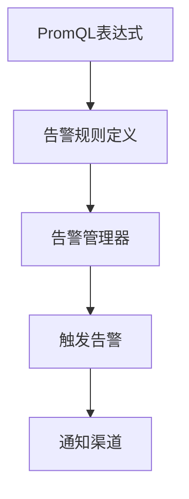

                 

关键词：Prometheus，告警规则，优化，监控，性能，监控策略，PromQL，架构设计

> 摘要：本文将深入探讨Prometheus告警规则的优化策略，从架构设计、监控策略、PromQL的使用等多个角度出发，提供实用的优化建议，帮助读者提升Prometheus监控系统在实际应用中的性能和可靠性。

## 1. 背景介绍

在当今的云计算和微服务时代，系统的稳定性和性能监控变得尤为重要。Prometheus作为一种流行的开源监控解决方案，因其灵活性和可扩展性受到了广泛的应用。Prometheus的核心功能之一就是告警规则，它允许用户基于PromQL（Prometheus查询语言）定义复杂的告警条件，从而在系统出现异常时及时发出警报。

然而，随着监控系统的规模和复杂性不断增加，告警规则的合理设计和优化变得至关重要。不当的告警规则可能导致大量误报或漏报，从而影响系统的正常运行和团队的工作效率。本文旨在探讨如何优化Prometheus告警规则，以提升监控系统的整体性能和可靠性。

## 2. 核心概念与联系

### Prometheus架构

首先，我们需要了解Prometheus的基本架构。Prometheus主要由以下几个组件构成：

- **Prometheus服务器**：负责存储时序数据和告警状态，同时提供HTTP API供外部工具查询。
- **拉取器（Exporter）**：被监控的服务通过Exporter暴露出监控指标，Prometheus服务器定期从Exporter中拉取数据。
- **告警管理器**：基于告警规则触发告警，并可以将告警推送到外部告警通道，如电子邮件、Slack等。
- **Web界面**：提供图形化的监控图表和告警列表。

### 告警规则定义

告警规则是基于PromQL的表达式，用于定义监控指标何时应该触发告警。PromQL支持各种数学运算和逻辑操作，使得用户可以轻松创建复杂的告警条件。

### 监控策略

监控策略是指监控系统的设计和运行策略，包括数据采集、存储、处理、告警等各个环节。一个良好的监控策略能够确保监控系统准确、高效地反映系统的运行状态。

### Mermaid 流程图

下面是一个简单的Mermaid流程图，展示了告警规则从定义到触发的过程。



## 3. 核心算法原理 & 具体操作步骤

### 3.1 算法原理概述

Prometheus告警规则的核心是PromQL，它允许用户对时间序列数据进行各种操作。PromQL支持以下几种类型的操作：

- **简单比较**：如`>=`、`>`、`<=`、`<`等。
- **逻辑操作**：如`AND`、`OR`、`NOT`等。
- **时间窗口操作**：如`rate()`、`delta()`等，用于计算指标的瞬时变化率。
- **函数操作**：如`abs()`、`avg()`、`stddev()`等，用于对指标值进行数学处理。

告警规则定义的格式如下：

```plaintext
[alertname] "Description" [for duration] [label expr] [label expr] ...
```

### 3.2 算法步骤详解

1. **定义告警规则**：在Prometheus配置文件中定义告警规则，格式如上所述。
2. **采集数据**：Prometheus服务器定期从Exporter中拉取监控数据。
3. **计算PromQL**：使用PromQL对采集到的数据进行处理，计算告警条件。
4. **判断告警**：根据定义的告警规则，判断是否触发告警。
5. **发送告警**：如果触发告警，将告警发送到配置的告警通知渠道。

### 3.3 算法优缺点

**优点**：

- **灵活性强**：支持多种数学运算和逻辑操作，可以定义复杂的告警条件。
- **易扩展**：可以通过配置文件灵活地调整告警规则。

**缺点**：

- **性能依赖**：告警规则的复杂程度直接影响Prometheus的性能。
- **误报与漏报**：不当的告警规则可能导致误报或漏报。

### 3.4 算法应用领域

Prometheus告警规则广泛应用于各种场景，包括：

- **云服务监控**：监控云资源的性能和健康状态。
- **微服务监控**：监控微服务的响应时间和稳定性。
- **基础设施监控**：监控网络设备、存储系统等基础设施的性能。

## 4. 数学模型和公式 & 详细讲解 & 举例说明

### 4.1 数学模型构建

Prometheus告警规则的核心是PromQL，其数学模型构建主要包括以下几个方面：

- **时间序列数据**：Prometheus以时间序列数据为核心，每个时间序列由一系列指标值和时间戳组成。
- **PromQL运算**：支持多种数学运算，如比较、逻辑运算、时间窗口运算等。

### 4.2 公式推导过程

假设我们有一个监控指标`requests_total`，表示一段时间内接收到的HTTP请求总数。我们可以使用以下PromQL公式来计算其5分钟内的平均请求率：

```plaintext
rate(requests_total[5m])
```

该公式表示在过去的5分钟内，每分钟`requests_total`指标值的增长量。

### 4.3 案例分析与讲解

假设我们想监控一个Web应用的响应时间，我们可以定义以下告警规则：

```plaintext
web_server_response_time{app="myapp"} > 5s for 1m
```

该规则表示如果`web_server_response_time`指标在任意1分钟内超过5秒，则触发告警。我们可以使用PromQL中的`avg()`函数来计算响应时间的平均值：

```plaintext
avg(web_server_response_time{app="myapp"}) by (instance)
```

该公式表示在每个实例上计算平均响应时间。

## 5. 项目实践：代码实例和详细解释说明

### 5.1 开发环境搭建

1. 安装Prometheus服务器。
2. 安装Exporter（例如：Nginx exporter、MySQL exporter等）。
3. 配置Prometheus服务器，添加Exporter的配置文件。

### 5.2 源代码详细实现

1. **Exporter配置**：配置Exporter，使其能够暴露出需要监控的指标。

```yaml
# prometheus.yml
global:
  scrape_interval: 15s
  evaluation_interval: 15s

scrape_configs:
  - job_name: 'prometheus'
    static_configs:
      - targets: ['localhost:9090']

  - job_name: 'nginx'
    static_configs:
      - targets: ['nginx-server:9113']
```

2. **告警规则配置**：在Prometheus配置文件中添加告警规则。

```plaintext
groups:
- name: 'alerting'
  rules:
  - alert: HighRequestRate
    expr: rate(nginx_requests_total[5m]) > 100
    for: 1m
    labels:
      severity: 'high'
    annotations:
      summary: "High request rate detected on {{ $labels.instance }}"
```

### 5.3 代码解读与分析

1. **Exporter代码**：Exporter负责暴露监控指标，通常使用Go语言编写。

```go
package main

import (
    "github.com/prometheus/client_golang/prometheus"
    "net/http"
)

var (
    requestsTotal = prometheus.NewCounterVec(
        prometheus.CounterOpts{
            Name: "nginx_requests_total",
            Help: "Total number of requests made.",
        },
        []string{"code"},
    )
)

func main() {
    registry := prometheus.NewRegistry()
    registry.Register(requestsTotal)

    http.Handle("/metrics", prometheus.HandlerFor(registry))
    http.ListenAndServe(":9113", nil)
}
```

2. **告警规则配置**：告警规则配置文件中定义了告警条件和处理逻辑。

### 5.4 运行结果展示

1. 启动Exporter和Prometheus服务器。
2. 在Web界面中查看监控数据和告警列表。
3. 触发告警，查看告警通知。

## 6. 实际应用场景

Prometheus告警规则在实际应用中具有广泛的应用场景，以下是一些常见的应用场景：

- **服务器性能监控**：监控服务器的CPU、内存、磁盘使用情况，以及网络带宽等指标。
- **应用性能监控**：监控Web应用的响应时间、请求量、错误率等指标。
- **数据库性能监控**：监控数据库的查询性能、连接数、锁等待时间等指标。
- **云服务监控**：监控云资源的利用率、成本、安全性等指标。

### 6.4 未来应用展望

随着云计算和物联网的快速发展，监控系统面临越来越多的挑战和机遇。未来，Prometheus告警规则有望在以下几个方面得到优化和发展：

- **智能化**：利用机器学习技术，实现自动化的告警规则生成和优化。
- **可解释性**：提高告警规则的可解释性，帮助用户更好地理解告警原因。
- **多云支持**：支持跨云平台的监控，提供更统一的监控体验。
- **集成化**：与现有的监控和运维工具更紧密地集成，提高监控系统的整体效能。

## 7. 工具和资源推荐

### 7.1 学习资源推荐

- Prometheus官方文档：[https://prometheus.io/docs/](https://prometheus.io/docs/)
- Prometheus社区：[https://prometheus.io/community/](https://prometheus.io/community/)
- Prometheus实践指南：[https://www.oreilly.com/library/view/prometheus-up-and-running/9781449374622/](https://www.oreilly.com/library/view/prometheus-up-and-running/9781449374622/)

### 7.2 开发工具推荐

- Prometheus Config Manager：[https://github.com/prometheus/config-manager](https://github.com/prometheus/config-manager)
- Prometheus Alertmanager：[https://github.com/prometheus/alertmanager](https://github.com/prometheus/alertmanager)
- Prometheus Grafana插件：[https://grafana.com/grafana/worlds-simplest-prometheus-dashboard/](https://grafana.com/grafana/worlds-simplest-prometheus-dashboard/)

### 7.3 相关论文推荐

- "Prometheus: A Monitoring System for Dynamic Services" by the Prometheus authors.
- "Scalable Monitoring of Large-scale Distributed Systems with Prometheus" by the authors of the Kube Prometheus Adapter.

## 8. 总结：未来发展趋势与挑战

### 8.1 研究成果总结

Prometheus作为一种强大的监控工具，已经在各种场景中得到广泛应用。通过本文的探讨，我们总结了Prometheus告警规则的优化策略，包括架构设计、监控策略、PromQL的使用等多个方面。

### 8.2 未来发展趋势

未来，Prometheus告警规则将继续朝着智能化、可解释性、多云支持和集成化的方向发展。通过引入新的技术和方法，监控系统将更加高效、可靠，为用户带来更好的使用体验。

### 8.3 面临的挑战

监控系统在实际应用中仍然面临许多挑战，如误报和漏报问题、性能瓶颈、数据存储和查询效率等。未来的研究需要解决这些问题，以提升监控系统的整体性能和可靠性。

### 8.4 研究展望

随着云计算和物联网的快速发展，监控系统将在未来发挥越来越重要的作用。我们期待看到更多的创新和研究，推动监控系统的不断进步。

## 9. 附录：常见问题与解答

### Q：如何避免告警误报？

A：为了减少误报，可以采取以下措施：

- **合理设置告警阈值**：根据实际情况调整告警阈值，避免过于敏感。
- **利用时间窗口**：使用`for`语句设定告警持续时间，确保告警是持续性的。
- **监控多个指标**：监控多个相关指标，避免单一指标的异常导致误报。

### Q：如何处理告警漏报？

A：为了减少漏报，可以采取以下措施：

- **增加监控频率**：提高Prometheus的拉取频率，更快地发现异常。
- **监控数据完整性**：确保Exporter能够正确地暴露监控数据。
- **日志分析与告警关联**：结合日志分析，确保告警与实际问题的关联性。

通过以上策略，我们可以有效地优化Prometheus告警规则，提升监控系统的性能和可靠性。

---

**作者：禅与计算机程序设计艺术 / Zen and the Art of Computer Programming**

