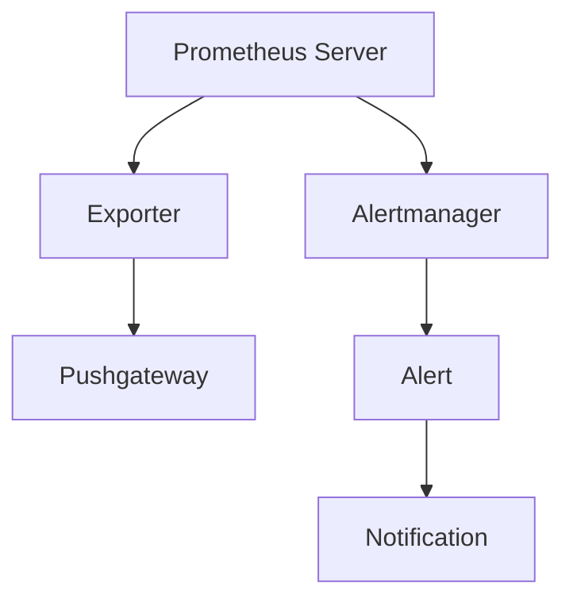

                 

 Prometheus是一款流行的开源监控解决方案，用于收集和存储指标数据，并通过配置规则自动生成告警。在当今复杂的企业级系统中，Prometheus扮演着至关重要的角色，其配置的优化直接影响到监控系统的稳定性和告警的准确性。本文将深入探讨Prometheus监控告警配置的优化策略，帮助读者提升监控体系的效率和可靠性。

## 关键词

- Prometheus
- 监控系统
- 告警配置
- 稳定性
- 可靠性
- 优化策略

## 摘要

本文旨在阐述Prometheus监控告警配置优化的重要性，并提供一系列实用的优化策略。通过调整PromQL查询、优化规则文件、细化告警策略以及利用Prometheus生态中的相关工具，我们能够显著提升监控系统的性能和告警的准确性。文章还将探讨未来在监控领域可能遇到的新挑战和发展趋势。

## 1. 背景介绍

Prometheus是一款基于Go语言编写的开源监控解决方案，由SoundCloud公司开发并捐赠给Cloud Native Computing Foundation（CNCF）进行维护。它特别适合于云原生环境和容器化应用，如Kubernetes集群。Prometheus的核心功能包括数据采集、存储和告警。

### Prometheus的基本功能

- **数据采集**：Prometheus通过HTTP拉取或通过拉库（Pushgateway）接收来自各种源的数据。
- **数据存储**：Prometheus使用时间序列数据库（TSDB）来存储采集到的指标数据。
- **告警管理**：Prometheus允许用户通过配置PromQL（Prometheus查询语言）规则来自动生成告警。

### Prometheus的使用场景

- **云原生环境**：在Kubernetes等容器编排系统中，Prometheus可以监控集群的健康状态、资源利用率等关键指标。
- **复杂应用监控**：针对大规模、分布式应用，Prometheus能够提供实时的监控数据和告警通知，帮助开发人员和运维人员快速响应故障。
- **基础设施监控**：Prometheus可以监控网络设备、服务器、数据库等基础设施，确保其稳定运行。

## 2. 核心概念与联系

### Prometheus架构图



### 核心概念

- **Exporter**：一个Prometheus的HTTP服务器，负责提供监控指标数据。
- **PromQL**：Prometheus的查询语言，用于处理时间序列数据。
- **Rule File**：配置告警规则，定义何时触发告警。
- **Alertmanager**：处理和发送告警通知。
- **Alert**：由Prometheus规则文件触发的告警。
- **Notification**：告警通知，可以通过邮件、SMS、 webhook等方式发送。

## 3. 核心算法原理 & 具体操作步骤

### 3.1 算法原理概述

Prometheus告警配置的核心在于PromQL和规则文件。PromQL是一种专门为时间序列数据设计的查询语言，它支持基本的数学运算、函数调用以及时间范围限定。通过PromQL，用户可以灵活地定义监控指标的计算和告警条件。

### 3.2 算法步骤详解

#### 3.2.1 定义监控指标

首先，需要定义需要监控的指标，这通常是通过Exporter实现的。例如，对于一个Web服务器，可能需要监控其响应时间和请求总数。

#### 3.2.2 配置告警规则

告警规则定义了何时触发告警。基本的告警规则包括以下组成部分：

- **记录名**：用于标识告警的名称。
- **告警条件**：定义告警何时触发，通常使用PromQL表达式。
- **处理动作**：定义告警发生时应该执行的操作，例如发送通知。

例如：

```yaml
groups:
- name: my-alerts
  rules:
  - record_name: webserver_response_time_alert
    alert: Webserver Slow Response
    expr: rate(webserver_response_time[5m]) > 5
    for: 1m
    labels:
      severity: critical
    annotations:
      summary: "Webserver {{ $label.job }} is slow"
```

#### 3.2.3 配置Alertmanager

Alertmanager是处理告警的核心组件。它负责聚合告警、路由通知、静默期管理等。配置Alertmanager时，需要定义路由规则、静默期策略和通知渠道。

### 3.3 算法优缺点

- **优点**：灵活、可扩展，支持多种数据源和告警渠道。
- **缺点**：配置较为复杂，对PromQL和规则文件有较高要求。

### 3.4 算法应用领域

Prometheus及其告警系统广泛应用于云原生环境、大规模分布式系统以及企业级IT基础设施监控。

## 4. 数学模型和公式 & 详细讲解 & 举例说明

### 4.1 数学模型构建

在PromQL中，告警规则通常涉及以下数学模型：

- **增长率**：使用`rate`函数计算时间序列的增长率。
- **平均值**：使用`mean`函数计算时间序列的平均值。
- **滑动窗口**：使用`window`函数定义滑动窗口。

### 4.2 公式推导过程

以增长率为例，假设我们有一个时间序列`time_series`，在时间`t`的值为`value`。增长率可以表示为：

$$
growth\_rate = \frac{value_{t} - value_{t-1}}{value_{t-1}}
$$

在PromQL中，这可以表示为：

```plaintext
rate(time_series[5m])
```

### 4.3 案例分析与讲解

假设我们有一个Web服务器的响应时间序列，我们需要监控当响应时间超过500ms时触发告警。

```yaml
groups:
- name: my-alerts
  rules:
  - record_name: webserver_response_time_alert
    alert: Webserver Slow Response
    expr: mean(webserver_response_time[5m]) > 500
    for: 1m
    labels:
      severity: critical
    annotations:
      summary: "Webserver response time is above 500ms"
```

这里的`mean`函数计算了过去5分钟内Web服务器响应时间的平均值，如果平均值超过500ms，则触发告警。

## 5. 项目实践：代码实例和详细解释说明

### 5.1 开发环境搭建

搭建一个Prometheus监控环境需要以下组件：

- Prometheus Server
- Prometheus Exporter
- Alertmanager

假设我们使用Docker搭建环境，以下为具体步骤：

```shell
# 拉取Prometheus镜像
docker pull prom/prometheus

# 拉取Alertmanager镜像
docker pull prom/alertmanager

# 启动Prometheus Server
docker run -d -p 9090:9090 --name prometheus -v /etc/prometheus/:/etc/prometheus/ prom/prometheus

# 启动Alertmanager
docker run -d -p 9093:9093 --name alertmanager -v /etc/alertmanager/:/etc/alertmanager/ prom/alertmanager
```

### 5.2 源代码详细实现

假设我们有一个简单的Web服务器Exporter，以下是其源代码：

```go
package main

import (
    "encoding/json"
    "log"
    "net/http"
    "time"
)

type Metrics struct {
    ResponseTime float64 `json:"response_time"`
}

func handleRequest(w http.ResponseWriter, r *http.Request) {
    // 模拟Web服务器响应时间为300ms
    time.Sleep(300 * time.Millisecond)
    m := Metrics{ResponseTime: 300}
    js, err := json.Marshal(m)
    if err != nil {
        log.Fatal(err)
    }
    w.Write(js)
}

func main() {
    http.HandleFunc("/metrics", handleRequest)
    log.Fatal(http.ListenAndServe(":9115", nil))
}
```

### 5.3 代码解读与分析

这个简单的Web服务器Exporter通过HTTP接口暴露监控数据，包括响应时间。Prometheus可以通过配置文件或直接访问HTTP接口来采集这些数据。

### 5.4 运行结果展示

假设我们运行这个Exporter，并通过Prometheus采集数据，我们可以使用Prometheus的Web界面查看监控数据和告警。

## 6. 实际应用场景

Prometheus监控告警配置在实际应用中具有广泛的应用场景，包括：

- **云计算平台**：监控Kubernetes集群的状态、节点健康、工作负载等。
- **大数据平台**：监控Hadoop、Spark等分布式系统的运行状况。
- **传统IT系统**：监控Web服务器、数据库、网络设备等。

### 6.4 未来应用展望

随着容器化和云原生技术的普及，Prometheus在监控领域的应用将更加广泛。未来，我们可能看到：

- **更高效的告警处理**：借助机器学习，实现智能告警分析。
- **跨平台监控**：支持更多类型的平台和操作系统。
- **自动化部署与运维**：集成到CI/CD流程，实现自动化监控配置。

## 7. 工具和资源推荐

### 7.1 学习资源推荐

- **Prometheus官方文档**：[https://prometheus.io/docs/](https://prometheus.io/docs/)
- **Prometheus社区论坛**：[https://prometheus.io/community/](https://prometheus.io/community/)

### 7.2 开发工具推荐

- **Prometheus配置管理工具**：[https://github.com/prometheus/config-manager](https://github.com/prometheus/config-manager)
- **PromQL编辑器**：[https://promql编辑器.org](https://promql编辑器.org)

### 7.3 相关论文推荐

- **Prometheus论文**：[Prometheus: Container Monitoring as Code](https://www.usenix.org/conference/lisa17/technical-sessions/presentation/holt)
- **云原生监控论文**：[Monitoring in a Cloud Native World](https://www.isa-l.org/site/paper detail/627/)

## 8. 总结：未来发展趋势与挑战

### 8.1 研究成果总结

Prometheus在监控领域取得了显著的成果，已成为云原生环境中的首选监控解决方案。通过灵活的配置和强大的数据采集能力，Prometheus能够满足各种复杂场景的监控需求。

### 8.2 未来发展趋势

未来，Prometheus将继续向智能化、自动化方向发展，借助机器学习和自动化工具，实现更高效的监控和告警处理。

### 8.3 面临的挑战

- **数据安全与隐私**：在容器化和云原生环境中，监控数据的安全和隐私保护将成为重要挑战。
- **多平台支持**：随着技术的不断发展，Prometheus需要支持更多类型的平台和操作系统。

### 8.4 研究展望

未来，Prometheus将在以下几个方面进行深入研究：

- **智能告警分析**：利用机器学习技术，实现更智能的告警分析。
- **跨平台支持**：探索在更多类型的平台和操作系统上的应用。
- **自动化运维**：与CI/CD流程集成，实现自动化监控配置。

## 9. 附录：常见问题与解答

### Q：如何优化Prometheus的性能？

A：优化Prometheus性能可以从以下几个方面入手：

- **调整数据采样频率**：根据实际需求调整采样频率，避免过度采集。
- **优化PromQL查询**：避免复杂的PromQL查询，简化计算逻辑。
- **使用缓存**：合理使用Prometheus的内置缓存机制，减少直接访问数据库的次数。

### Q：如何处理大量告警？

A：面对大量告警，可以采取以下措施：

- **告警聚合**：使用Alertmanager进行告警聚合，减少重复告警。
- **告警路由**：根据不同类型的告警，设置不同的路由规则。
- **告警抑制**：设置告警抑制策略，避免短时间内频繁触发相同告警。

作者：禅与计算机程序设计艺术 / Zen and the Art of Computer Programming
----------------------------------------------------------------

