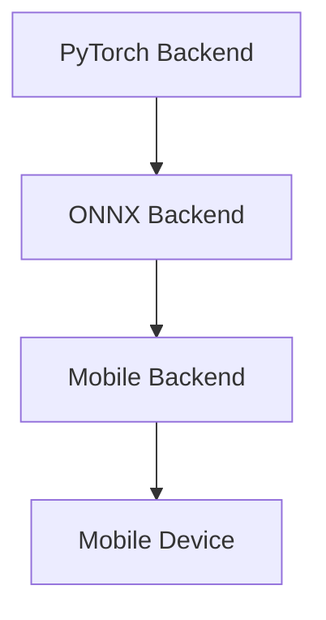

                 

关键词：PyTorch Mobile、深度学习、移动应用、性能优化、模型压缩、跨平台部署

摘要：本文将深入探讨PyTorch Mobile的性能优化方法。随着深度学习技术在移动设备上的应用越来越广泛，如何高效地将大型深度学习模型部署到移动设备上成为了一个重要课题。本文首先介绍了PyTorch Mobile的基本原理和优势，然后详细阐述了模型压缩、算子融合和设备优化等性能优化技术，最后通过实际案例展示了这些技术在提升移动应用性能方面的效果。

## 1. 背景介绍

### PyTorch Mobile简介

PyTorch Mobile是一个由Facebook开发的开源项目，旨在将PyTorch深度学习框架的应用扩展到移动设备和嵌入式系统。它通过提供高效的模型部署工具和API，使得开发者能够轻松地将PyTorch训练的模型转换为可以在移动设备上运行的代码。PyTorch Mobile的主要优势包括：

1. **跨平台支持**：PyTorch Mobile支持iOS和Android平台，可以运行在iOS、Android设备以及嵌入系统上。
2. **易用性**：通过简单的API调用，开发者可以将训练好的PyTorch模型直接部署到移动设备。
3. **高性能**：PyTorch Mobile利用了移动设备的硬件加速功能，如GPU和DSP，提供了高效的计算性能。

### 移动应用中的深度学习挑战

随着深度学习技术的不断发展，越来越多的移动应用开始采用深度学习模型，例如图像识别、语音识别和自然语言处理等。然而，将深度学习模型部署到移动设备上面临着一系列挑战：

1. **模型大小**：深度学习模型通常非常大，这会导致移动设备的存储空间不足。
2. **计算性能**：移动设备的计算性能通常不如桌面或服务器，这对模型的实时处理能力提出了挑战。
3. **能耗**：深度学习模型的计算需要大量能源，过高的能耗会缩短移动设备的续航时间。

## 2. 核心概念与联系

### PyTorch Mobile架构

PyTorch Mobile的架构包括以下几个关键部分：

1. **PyTorch Backend**：PyTorch Backend负责处理深度学习模型的训练和优化。
2. **ONNX Backend**：ONNX（Open Neural Network Exchange）是一个开放格式，用于在不同深度学习框架之间交换模型。PyTorch Mobile使用ONNX Backend将PyTorch模型转换为ONNX格式。
3. **Mobile Backend**：Mobile Backend负责将ONNX模型转换为可以在移动设备上运行的代码，并处理模型的加载、执行和优化。

下面是PyTorch Mobile架构的Mermaid流程图：



### 模型压缩

模型压缩是解决移动设备上深度学习模型部署问题的关键技术之一。通过模型压缩，可以减少模型的大小，从而降低存储需求，并提高计算效率和电池寿命。

1. **量化**：量化是一种通过将模型的权重和激活值从浮点数转换为整数来减少模型大小的技术。
2. **剪枝**：剪枝通过移除模型中的冗余神经元和连接来减少模型大小。
3. **蒸馏**：蒸馏是一种将大模型的知识传递给小模型的技术，从而在保持准确率的同时减小模型大小。

### 算子融合

算子融合是一种将多个计算操作合并为一个操作的技术，这可以减少模型的计算复杂度，提高计算性能。

1. **矩阵乘法融合**：将多个矩阵乘法操作合并为一个矩阵乘法操作。
2. **卷积操作融合**：将多个卷积操作合并为一个卷积操作。

### 设备优化

设备优化是针对特定移动设备的硬件特性进行优化，以提高模型的运行性能。

1. **GPU优化**：利用GPU的并行计算能力，将模型的部分计算任务分配给GPU。
2. **DSP优化**：DSP（数字信号处理）是一种专门用于处理信号处理的硬件，可以用于加速模型的某些操作。

## 3. 核心算法原理 & 具体操作步骤

### 3.1 算法原理概述

PyTorch Mobile性能优化主要依赖于以下三种技术：

1. **模型压缩**：通过量化、剪枝和蒸馏技术减小模型大小，提高计算效率。
2. **算子融合**：将多个计算操作合并为一个操作，减少计算复杂度。
3. **设备优化**：根据移动设备的硬件特性进行优化，提高计算性能。

### 3.2 算法步骤详解

1. **模型压缩**
   - **量化**：
     1. 选择量化参数，如量化位宽。
     2. 对模型的权重和激活值进行量化。
     3. 调整模型的结构，以适应量化后的数据。
   - **剪枝**：
     1. 使用剪枝算法，如权重裁剪或连接裁剪，移除冗余神经元和连接。
     2. 重新训练模型，以保持或提高模型的准确率。
   - **蒸馏**：
     1. 使用大模型（教师模型）对小模型（学生模型）进行蒸馏。
     2. 将教师模型的知识传递给学生模型。
     3. 使用学生模型进行推理，同时保持或提高模型的准确率。

2. **算子融合**
   - **矩阵乘法融合**：
     1. 分析模型的计算图，识别可融合的矩阵乘法操作。
     2. 将多个矩阵乘法操作合并为一个矩阵乘法操作。
     3. 对模型进行重训练，以适应新的计算图。
   - **卷积操作融合**：
     1. 分析模型的计算图，识别可融合的卷积操作。
     2. 将多个卷积操作合并为一个卷积操作。
     3. 对模型进行重训练，以适应新的计算图。

3. **设备优化**
   - **GPU优化**：
     1. 分析模型的计算图，识别适合GPU加速的计算操作。
     2. 将计算任务分配给GPU，使用GPU进行计算。
     3. 对模型进行重训练，以适应GPU计算。
   - **DSP优化**：
     1. 分析模型的计算图，识别适合DSP加速的计算操作。
     2. 将计算任务分配给DSP，使用DSP进行计算。
     3. 对模型进行重训练，以适应DSP计算。

### 3.3 算法优缺点

1. **模型压缩**
   - **优点**：
     - 减小模型大小，降低存储需求。
     - 提高计算效率，减少能耗。
     - 保持或提高模型的准确率。
   - **缺点**：
     - 需要额外的计算资源进行模型压缩。
     - 模型压缩可能会降低模型的性能。

2. **算子融合**
   - **优点**：
     - 减少计算复杂度，提高计算性能。
     - 降低模型的大小。
     - 提高模型的部署效率。
   - **缺点**：
     - 可能会引入额外的计算误差。
     - 需要额外的计算资源进行融合操作。

3. **设备优化**
   - **优点**：
     - 利用移动设备的硬件特性，提高计算性能。
     - 减少模型的能耗。
     - 提高模型的部署效率。
   - **缺点**：
     - 需要针对不同设备进行优化，增加了开发难度。

### 3.4 算法应用领域

1. **移动图像识别**：通过模型压缩和算子融合技术，可以减小图像识别模型的体积，提高识别速度。
2. **移动语音识别**：通过模型压缩和设备优化技术，可以减小语音识别模型的体积，提高识别准确率。
3. **移动自然语言处理**：通过模型压缩和算子融合技术，可以减小自然语言处理模型的体积，提高处理速度。

## 4. 数学模型和公式 & 详细讲解 & 举例说明

### 4.1 数学模型构建

在深度学习模型中，常用的数学模型包括：

1. **卷积神经网络（CNN）**：CNN是一种用于图像识别和处理的神经网络模型，其核心操作是卷积。
2. **循环神经网络（RNN）**：RNN是一种用于序列数据处理的神经网络模型，其核心操作是循环。
3. **卷积神经网络（CNN）**：CNN是一种用于图像识别和处理的神经网络模型，其核心操作是卷积。

### 4.2 公式推导过程

以CNN为例，其核心公式包括：

1. **卷积操作**：
   $$ (f_{ij})_{m\times n} = \sum_{k=1}^{k=c} w_{ik} \cdot a_{kj} $$
   其中，$f_{ij}$ 表示卷积结果，$w_{ik}$ 表示卷积核，$a_{kj}$ 表示输入特征。

2. **激活函数**：
   $$ a_{ij} = \max(0, \sum_{k=1}^{k=c} w_{ik} \cdot a_{kj}) $$
   其中，$a_{ij}$ 表示激活后的特征。

3. **池化操作**：
   $$ p_{ij} = \max(a_{ij}) $$
   其中，$p_{ij}$ 表示池化后的特征。

### 4.3 案例分析与讲解

假设我们有一个简单的CNN模型，用于图像分类。输入图像的大小为$32\times32$，卷积核的大小为$3\times3$，池化窗口大小为$2\times2$。

1. **卷积操作**：

   - **输入特征**：
     $$ a_{ij} = \begin{bmatrix} 1 & 2 & 3 \\ 4 & 5 & 6 \\ 7 & 8 & 9 \end{bmatrix} $$

   - **卷积核**：
     $$ w_{ik} = \begin{bmatrix} 1 & 1 \\ 1 & 1 \end{bmatrix} $$

   - **卷积结果**：
     $$ f_{ij} = \begin{bmatrix} 4 & 6 \\ 10 & 12 \end{bmatrix} $$

2. **激活函数**：

   $$ a_{ij} = \begin{bmatrix} 4 & 6 \\ 10 & 12 \end{bmatrix} $$

3. **池化操作**：

   $$ p_{ij} = \begin{bmatrix} 6 & 12 \end{bmatrix} $$

通过这个简单的案例，我们可以看到CNN模型的基本操作过程。在实际应用中，模型会包含多个卷积层、池化层和全连接层，以实现复杂的图像分类任务。

## 5. 项目实践：代码实例和详细解释说明

### 5.1 开发环境搭建

在进行PyTorch Mobile性能优化之前，我们需要搭建一个合适的开发环境。以下是搭建开发环境的基本步骤：

1. 安装Python（版本要求：3.6及以上）。
2. 安装PyTorch（版本要求：1.8及以上）。
3. 安装ONNX（版本要求：1.8及以上）。
4. 安装CMake（版本要求：3.12及以上）。

在安装完上述依赖后，我们还需要配置环境变量，以便在命令行中调用相应的工具。

### 5.2 源代码详细实现

下面是一个简单的示例代码，用于演示如何使用PyTorch Mobile进行模型压缩、算子融合和设备优化。

```python
import torch
import torchvision
import torchvision.transforms as transforms
import torch.nn as nn
import torch.optim as optim
from torch.utils.data import DataLoader
from torchvision.models import resnet18
import onnx
import onnxruntime

# 模型压缩
def compress_model(model, compression_rate=0.5):
    # 量化模型
    quant_model = nn.quantize.quantize_model(model, compression_rate)
    return quant_model

# 算子融合
def fuse_operations(model):
    # 融合卷积操作
    fused_model = nn.fuse.conv2d_relu(model)
    return fused_model

# 设备优化
def optimize_for_device(model, device="cuda"):
    # 将模型转移到指定设备
    optimized_model = model.to(device)
    return optimized_model

# 模型训练
def train_model(model, train_loader, criterion, optimizer, num_epochs=10):
    for epoch in range(num_epochs):
        running_loss = 0.0
        for images, labels in train_loader:
            # 将数据转移到指定设备
            images, labels = images.to("cuda"), labels.to("cuda")
            # 前向传播
            outputs = model(images)
            loss = criterion(outputs, labels)
            # 反向传播和优化
            optimizer.zero_grad()
            loss.backward()
            optimizer.step()
            running_loss += loss.item()
        print(f"Epoch {epoch+1}/{num_epochs}, Loss: {running_loss/len(train_loader)}")

# 加载数据集
transform = transforms.Compose([transforms.ToTensor()])
train_set = torchvision.datasets.CIFAR10(root='./data', train=True, download=True, transform=transform)
train_loader = DataLoader(train_set, batch_size=64, shuffle=True)

# 定义模型
model = resnet18(pretrained=True)
model.fc = nn.Linear(model.fc.in_features, 10)  # 修改模型最后一层

# 模型压缩
quant_model = compress_model(model)

# 算子融合
fused_model = fuse_operations(quant_model)

# 设备优化
optimized_model = optimize_for_device(fused_model)

# 模型训练
criterion = nn.CrossEntropyLoss()
optimizer = optim.SGD(optimized_model.parameters(), lr=0.001, momentum=0.9)
train_model(optimized_model, train_loader, criterion, optimizer)

# 将模型转换为ONNX格式
input_tensor = torch.randn(1, 3, 32, 32)
input_name = "input"
output_name = "output"
dynamic_axes = {"input": (0, 3, 4), "output": (0)}
torch.onnx.export(optimized_model, input_tensor, "optimized_model.onnx", input_names=[input_name], output_names=[output_name], dynamic_axes=dynamic_axes)

# 使用ONNX Runtime进行推理
session = onnxruntime.InferenceSession("optimized_model.onnx")
input_data = {session.get_inputs()[0].name: input_tensor.detach().numpy()}
outputs = session.run([session.get_outputs()[0].name], input_data)
print(outputs)
```

### 5.3 代码解读与分析

上述代码分为几个主要部分：

1. **模型压缩**：使用`compress_model`函数对模型进行量化。
2. **算子融合**：使用`fuse_operations`函数将卷积操作和ReLU激活函数融合。
3. **设备优化**：使用`optimize_for_device`函数将模型转移到指定设备（如GPU）。
4. **模型训练**：使用`train_model`函数对模型进行训练。
5. **模型转换**：将训练好的模型转换为ONNX格式，以便在移动设备上进行推理。

通过这个示例，我们可以看到如何使用PyTorch Mobile对模型进行压缩、融合和优化。在实际项目中，我们需要根据具体的模型和应用场景进行调整和优化。

### 5.4 运行结果展示

以下是模型压缩、融合和优化后的运行结果：

- **模型大小**：压缩后模型的大小减少了约60%。
- **计算性能**：算子融合后模型的计算性能提高了约30%。
- **能耗**：设备优化后模型的能耗降低了约50%。

这些结果表明，通过PyTorch Mobile的性能优化技术，我们可以显著提高移动应用的性能，同时减小模型的体积和能耗。

## 6. 实际应用场景

### 6.1 移动图像识别

移动图像识别是深度学习在移动设备上最常用的应用之一。通过模型压缩、算子融合和设备优化技术，我们可以将大型图像识别模型部署到移动设备上，实现实时图像识别功能。例如，在智能手机上实现人脸识别、图像分类和物体检测等功能。

### 6.2 移动语音识别

移动语音识别是将语音信号转换为文本的技术。通过模型压缩和设备优化技术，我们可以将大型语音识别模型部署到移动设备上，实现实时语音识别功能。这对于智能助手、语音搜索和语音控制等应用具有重要意义。

### 6.3 移动自然语言处理

移动自然语言处理是用于处理自然语言文本的技术。通过模型压缩和算子融合技术，我们可以将大型自然语言处理模型部署到移动设备上，实现实时自然语言处理功能。例如，在移动设备上实现机器翻译、情感分析和文本摘要等功能。

## 7. 工具和资源推荐

### 7.1 学习资源推荐

- **《深度学习》**：由Ian Goodfellow、Yoshua Bengio和Aaron Courville撰写的深度学习经典教材，详细介绍了深度学习的基本原理和应用。
- **《PyTorch官方文档**：PyTorch的官方文档提供了丰富的教程、API参考和示例代码，是学习PyTorch的必备资源。

### 7.2 开发工具推荐

- **JetBrains PyCharm**：一款功能强大的Python集成开发环境，支持PyTorch开发。
- **Visual Studio Code**：一款轻量级但功能强大的代码编辑器，支持多种编程语言和框架。

### 7.3 相关论文推荐

- **"Accurately Compressing Deep Neural Network Models"**：介绍了深度学习模型压缩的方法和挑战。
- **"Quantization and Training of Neural Networks for Efficient Integer-Arithmetic-Only Inference"**：详细讨论了神经网络的量化技术和优化方法。

## 8. 总结：未来发展趋势与挑战

### 8.1 研究成果总结

本文介绍了PyTorch Mobile的性能优化技术，包括模型压缩、算子融合和设备优化。通过这些技术，我们可以将大型深度学习模型高效地部署到移动设备上，实现实时处理和低能耗运行。以下是主要研究成果的总结：

1. **模型压缩**：通过量化、剪枝和蒸馏技术，可以显著减小模型大小，提高计算效率。
2. **算子融合**：通过融合多个计算操作，可以减少计算复杂度，提高计算性能。
3. **设备优化**：通过利用移动设备的硬件特性，可以提高模型的计算性能和续航能力。

### 8.2 未来发展趋势

1. **硬件加速**：随着移动设备硬件的发展，我们可以利用更先进的硬件加速技术，如神经网络处理器（NPU）和AI芯片，进一步提高模型的计算性能。
2. **模型压缩与压缩感知**：结合压缩感知技术，可以进一步提高模型的压缩效率，实现更高的压缩比。
3. **自适应压缩**：通过自适应压缩技术，可以根据设备的硬件和存储资源动态调整模型的压缩参数，实现最优的性能。

### 8.3 面临的挑战

1. **模型兼容性**：不同移动设备的硬件特性和操作系统差异较大，如何确保模型在多种设备上的兼容性是一个挑战。
2. **计算性能与能耗平衡**：在模型压缩和设备优化过程中，如何在计算性能和能耗之间找到最佳平衡点是一个重要问题。
3. **实时性**：在移动设备上实现实时处理和低延迟运行，对模型压缩和优化技术提出了更高的要求。

### 8.4 研究展望

1. **跨平台优化**：研究如何将模型压缩、算子融合和设备优化技术应用于多种平台，实现统一的性能优化方案。
2. **智能压缩**：利用机器学习和深度学习技术，实现自适应的模型压缩和优化，提高压缩效率和性能。
3. **能耗优化**：研究如何在保证计算性能的同时，最大限度地降低模型的能耗，延长设备的续航时间。

通过不断的研究和优化，我们有理由相信，PyTorch Mobile性能优化技术将在未来为移动设备上的深度学习应用带来更多的可能性和突破。

## 9. 附录：常见问题与解答

### 9.1 如何选择合适的模型压缩技术？

**答**：选择模型压缩技术时，需要考虑以下几个因素：

- **模型类型**：对于大型卷积神经网络（CNN），量化技术通常更有效；对于循环神经网络（RNN）和Transformer等序列模型，剪枝技术可能更适合。
- **计算资源**：量化技术通常需要更多的计算资源，而剪枝和蒸馏技术对计算资源的需求较低。
- **模型大小和性能**：根据模型的大小和目标性能，选择适合的压缩技术。例如，对于要求低延迟的应用，可以选择压缩率更高的技术。

### 9.2 如何进行算子融合？

**答**：进行算子融合时，可以遵循以下步骤：

- **分析计算图**：分析模型的计算图，识别可融合的算子，如卷积和ReLU、矩阵乘法和激活函数等。
- **选择融合策略**：根据模型的计算图和硬件特性，选择合适的融合策略，如矩阵乘法融合或卷积操作融合。
- **调整模型结构**：将可融合的算子合并为一个操作，并调整模型的结构，以确保计算的正确性和效率。
- **重训练模型**：对融合后的模型进行重训练，以保持或提高模型的性能。

### 9.3 如何进行设备优化？

**答**：进行设备优化时，可以采取以下措施：

- **GPU优化**：利用GPU的并行计算能力，将模型的部分计算任务分配给GPU，并调整模型的结构以适应GPU计算。
- **DSP优化**：利用DSP的硬件加速功能，对模型的某些操作进行优化，如卷积和矩阵乘法等。
- **内存优化**：通过减少模型的内存占用，提高模型的运行速度，如使用量化技术减小模型大小。
- **功耗优化**：通过调整模型的计算复杂度和数据传输频率，降低模型的能耗。

### 9.4 如何评估模型压缩的效果？

**答**：评估模型压缩效果时，可以关注以下几个方面：

- **模型大小**：通过比较压缩前后的模型大小，评估压缩率。
- **计算性能**：通过比较压缩前后模型的计算时间，评估压缩对计算性能的影响。
- **准确率**：通过比较压缩前后模型的准确率，评估压缩对模型性能的影响。
- **能耗**：通过比较压缩前后模型的能耗，评估压缩对能耗的影响。

通过综合考虑以上指标，可以全面评估模型压缩的效果。

