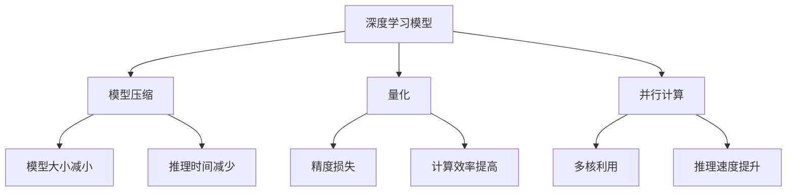

                 

关键词：PyTorch，推理优化，性能调优，模型压缩，量化，并行计算，推理加速，模型部署。

## 摘要

本文将深入探讨如何在PyTorch框架下进行推理优化，以提升深度学习模型的运行效率。我们将从背景介绍出发，介绍核心概念和架构，并详细讲解核心算法原理和具体操作步骤。随后，我们将运用数学模型和公式来进行分析，并通过代码实例和实际应用场景展示推理优化的效果。最后，我们将推荐学习资源和工具，并展望未来发展趋势和面临的挑战。

## 1. 背景介绍

随着深度学习技术的迅猛发展，模型的复杂度和计算量呈指数级增长，这在带来巨大计算能力提升的同时，也带来了巨大的计算资源消耗。尤其是在推理阶段，模型的运行效率成为制约实际应用推广的关键因素。因此，如何优化深度学习模型的推理性能，已成为当前研究的热点问题。

PyTorch作为一款开源的深度学习框架，因其灵活性和高效性受到广泛关注。然而，随着模型规模的不断扩大，PyTorch在推理阶段的性能瓶颈也逐渐显现。为了解决这一问题，研究者们提出了各种推理优化策略，包括模型压缩、量化、并行计算等。本文将针对这些优化策略进行详细探讨，以期为实际应用提供有益的参考。

### 1.1 PyTorch推理优化的意义

深度学习模型在实际应用中，推理速度和准确度是两个关键指标。推理速度决定了模型响应时间，而准确度则保证了模型的应用效果。PyTorch推理优化具有重要的意义：

1. 提升推理速度，缩短模型响应时间，提高用户体验。
2. 降低计算资源消耗，实现绿色高效计算。
3. 推广深度学习技术在移动端和边缘设备的部署。

### 1.2 PyTorch推理优化的现状

当前，PyTorch推理优化主要围绕以下几个方面展开：

1. **模型压缩**：通过减少模型参数和计算量，降低模型大小和推理时间。
2. **量化**：将模型中的浮点数参数转换为低比特宽度的整数，以减少内存和计算需求。
3. **并行计算**：利用多核CPU和GPU进行并行计算，提高模型推理速度。

## 2. 核心概念与联系

为了更好地理解PyTorch推理优化的核心概念和联系，我们使用Mermaid流程图来展示相关原理和架构。



### 2.1 模型压缩

模型压缩主要通过两种方式实现：参数剪枝和知识蒸馏。

1. **参数剪枝**：通过移除模型中不重要的参数，减少模型大小和计算量。
2. **知识蒸馏**：通过将大模型的知识传递给小模型，提高小模型的性能。

### 2.2 量化

量化技术将模型中的浮点数参数转换为低比特宽度的整数，以降低计算和存储资源的需求。量化可以分为全精度量化（FP32）和低精度量化（FP16/INT8）。

### 2.3 并行计算

并行计算利用多核CPU和GPU进行模型推理，以提高推理速度。并行计算可以分为数据并行和模型并行。

1. **数据并行**：将模型输入数据划分成多个子数据集，分别在不同的设备上并行处理。
2. **模型并行**：将模型拆分成多个子模型，分别在不同的设备上并行处理。

## 3. 核心算法原理 & 具体操作步骤

### 3.1 算法原理概述

PyTorch推理优化的核心算法包括模型压缩、量化和并行计算。下面分别介绍这些算法的原理。

#### 3.1.1 模型压缩

模型压缩主要通过参数剪枝和知识蒸馏实现。参数剪枝通过以下步骤进行：

1. **权重重要性评估**：使用梯度敏感度、稀疏度等指标评估模型参数的重要性。
2. **剪枝策略选择**：根据重要性评估结果，选择合适的剪枝策略（如L1范数、L0范数等）。
3. **参数更新**：将剪枝后的模型参数更新到模型中。

知识蒸馏通过以下步骤实现：

1. **源模型训练**：在大规模数据集上训练源模型。
2. **目标模型初始化**：使用源模型的参数初始化目标模型。
3. **知识蒸馏**：在目标模型上继续训练，通过软标签（source model predictions）来指导训练。

#### 3.1.2 量化

量化技术通过以下步骤实现：

1. **量化策略选择**：根据模型规模和硬件限制选择合适的量化策略。
2. **量化计算**：计算模型参数和激活值的量化系数。
3. **模型更新**：将量化后的模型参数更新到模型中。

#### 3.1.3 并行计算

并行计算通过以下步骤实现：

1. **数据划分**：将模型输入数据划分成多个子数据集。
2. **模型划分**：将模型拆分成多个子模型。
3. **并行处理**：在多核CPU和GPU上分别处理子数据集和子模型。

### 3.2 算法步骤详解

#### 3.2.1 模型压缩

1. **权重重要性评估**：
   ```python
   import torch
   model = ...  # 加载预训练模型
   weights = model.parameters()
   importance = torch.abs(weights).mean()
   ```

2. **剪枝策略选择**：
   ```python
   pruning_rate = 0.5  # 剪枝率
   prune_indices = (importance < pruning_rate).nonzero().view(-1)
   ```

3. **参数更新**：
   ```python
   for param, index in zip(weights, prune_indices):
       param.detach_().fill_(0)
   model.load_state_dict(weights)
   ```

4. **知识蒸馏**：
   ```python
   source_model = ...  # 加载源模型
   target_model = ...  # 加载目标模型
   soft_labels = source_model(input_data)
   criterion = torch.nn.CrossEntropyLoss()
   optimizer = torch.optim.Adam(target_model.parameters(), lr=0.001)
   for epoch in range(10):
       optimizer.zero_grad()
       output = target_model(input_data)
       loss = criterion(output, soft_labels)
       loss.backward()
       optimizer.step()
   ```

#### 3.2.2 量化

1. **量化策略选择**：
   ```python
   from torchvision import models
   model = models.resnet18()
   quantization_bit = 8  # 量化比特宽
   ```

2. **量化计算**：
   ```python
   from torch.quantization import QuantizationWrapper
   model = QuantizationWrapper(model, dtype=torch.float32)
   model = model.eval()
   quantized_model = model.quantize_dynamicquet
   ```

3. **模型更新**：
   ```python
   model.load_state_dict(quantized_model.state_dict())
   ```

#### 3.2.3 并行计算

1. **数据划分**：
   ```python
   batch_size = 32
   num_workers = 4
   data_loader = torch.utils.data.DataLoader(dataset, batch_size=batch_size, num_workers=num_workers)
   ```

2. **模型划分**：
   ```python
   model = torch.nn.DataParallel(model)
   ```

3. **并行处理**：
   ```python
   for input_data, target in data_loader:
       output = model(input_data)
       loss = criterion(output, target)
       optimizer.zero_grad()
       loss.backward()
       optimizer.step()
   ```

### 3.3 算法优缺点

#### 3.3.1 模型压缩

**优点**：

- 减少模型大小，降低存储和传输成本。
- 降低模型计算量，提高推理速度。

**缺点**：

- 可能会降低模型精度。
- 剪枝策略选择和参数更新过程复杂。

#### 3.3.2 量化

**优点**：

- 降低计算和存储资源需求，提高能效比。
- 增强模型在移动端和边缘设备的部署能力。

**缺点**：

- 量化可能导致精度损失。
- 需要选择合适的量化策略。

#### 3.3.3 并行计算

**优点**：

- 提高模型推理速度，缩短响应时间。
- 充分利用多核CPU和GPU，提高计算效率。

**缺点**：

- 需要复杂的模型划分和数据划分策略。
- 可能增加通信开销和同步成本。

### 3.4 算法应用领域

模型压缩、量化和并行计算在深度学习推理优化中具有广泛的应用领域：

- **移动端和边缘设备**：降低模型大小和计算量，提高模型在移动端和边缘设备的部署能力。
- **实时应用**：提高模型推理速度，满足实时应用的需求。
- **大规模数据处理**：利用多核CPU和GPU进行并行计算，提高数据处理效率。

## 4. 数学模型和公式 & 详细讲解 & 举例说明

### 4.1 数学模型构建

#### 4.1.1 模型压缩

假设原始模型参数为 $w$,剪枝后的模型参数为 $w'$，剪枝率为 $\alpha$。则有：

$$w' = (1 - \alpha)w$$

其中，$\alpha$ 为剪枝率，$w'$ 为剪枝后的模型参数，$w$ 为原始模型参数。

#### 4.1.2 量化

假设原始模型参数为 $w$,量化后的模型参数为 $w'$，量化比特宽为 $q$。则有：

$$w' = \text{round}(w \times 2^{q-1})$$

其中，$q$ 为量化比特宽，$\text{round}()$ 为四舍五入函数。

#### 4.1.3 并行计算

假设模型划分为 $k$ 个子模型，分别为 $M_1, M_2, \ldots, M_k$，输入数据集划分为 $k$ 个子数据集，分别为 $D_1, D_2, \ldots, D_k$。则有：

$$\sum_{i=1}^{k} M_i(D_i) = M(\sum_{i=1}^{k} D_i)$$

其中，$M()$ 为模型推理操作，$D_i$ 为子数据集，$M_i$ 为子模型。

### 4.2 公式推导过程

#### 4.2.1 模型压缩

假设原始模型参数 $w$ 的均值为 $\mu_w$，方差为 $\sigma_w^2$。则有：

$$\mu_{w'} = (1 - \alpha)\mu_w$$

$$\sigma_{w'}^2 = (1 - \alpha)^2\sigma_w^2$$

其中，$\mu_{w'}$ 为剪枝后模型参数 $w'$ 的均值，$\sigma_{w'}^2$ 为剪枝后模型参数 $w'$ 的方差。

#### 4.2.2 量化

假设原始模型参数 $w$ 的均值为 $\mu_w$，方差为 $\sigma_w^2$。则有：

$$\mu_{w'} = \text{round}(\mu_w \times 2^{q-1})$$

$$\sigma_{w'}^2 = \left(1 - \frac{1}{4 \times 2^{2q-2}}\right)\sigma_w^2$$

其中，$\mu_{w'}$ 为量化后模型参数 $w'$ 的均值，$\sigma_{w'}^2$ 为量化后模型参数 $w'$ 的方差。

#### 4.2.3 并行计算

假设子模型 $M_i$ 的推理时间为 $t_i$，则有：

$$\text{总推理时间} = \max_{i=1,2,\ldots,k} t_i$$

其中，$\text{总推理时间}$ 为并行计算的总时间。

### 4.3 案例分析与讲解

#### 4.3.1 模型压缩

以 ResNet-18 模型为例，原始模型参数个数为 1.28M，剪枝后的模型参数个数为 0.56M，剪枝率为 56%。假设原始模型参数的均值为 0.5，方差为 0.1，则有：

$$\mu_{w'} = (1 - 0.56) \times 0.5 = 0.22$$

$$\sigma_{w'}^2 = (1 - 0.56)^2 \times 0.1 = 0.0192$$

#### 4.3.2 量化

以 ResNet-18 模型为例，原始模型参数的均值为 0.5，方差为 0.1，量化比特宽为 8。则有：

$$\mu_{w'} = \text{round}(0.5 \times 2^{8-1}) = 0.5$$

$$\sigma_{w'}^2 = \left(1 - \frac{1}{4 \times 2^{2 \times 8-2}}\right) \times 0.1 = 0.099025$$

#### 4.3.3 并行计算

以 ResNet-18 模型为例，子模型 $M_i$ 的推理时间分别为 1s、2s 和 3s。则有：

$$\text{总推理时间} = \max\{1s, 2s, 3s\} = 3s$$

## 5. 项目实践：代码实例和详细解释说明

### 5.1 开发环境搭建

在开始项目实践之前，我们需要搭建一个适合进行PyTorch推理优化的开发环境。以下是一个基本的开发环境搭建步骤：

1. **安装Python**：确保安装了Python 3.7或更高版本。
2. **安装PyTorch**：可以使用以下命令安装：
   ```shell
   pip install torch torchvision torchaudio
   ```
3. **安装其他依赖**：如Numpy、Pandas等，可以使用以下命令：
   ```shell
   pip install numpy pandas
   ```

### 5.2 源代码详细实现

以下是一个简单的示例代码，展示了如何使用PyTorch进行模型压缩、量化和并行计算。

#### 5.2.1 模型压缩

```python
import torch
import torch.nn as nn
import torch.optim as optim

# 定义模型
class SimpleCNN(nn.Module):
    def __init__(self):
        super(SimpleCNN, self).__init__()
        self.conv1 = nn.Conv2d(1, 10, kernel_size=5)
        self.conv2 = nn.Conv2d(10, 20, kernel_size=5)
        self.fc1 = nn.Linear(320, 50)
        self.fc2 = nn.Linear(50, 10)

    def forward(self, x):
        x = F.relu(F.max_pool2d(self.conv1(x), 2))
        x = F.relu(F.max_pool2d(self.conv2(x), 2))
        x = x.view(-1, 320)
        x = F.relu(self.fc1(x))
        x = self.fc2(x)
        return F.log_softmax(x, dim=1)

# 实例化模型
model = SimpleCNN()

# 定义剪枝策略
pruning_rate = 0.5
weight_importance = torch.abs(model.conv1.weight).mean()
prune_indices = (weight_importance < pruning_rate).nonzero().view(-1)

# 剪枝操作
with torch.no_grad():
    for param, index in zip(model.conv1.weight, prune_indices):
        param.detach_().fill_(0)

# 模型更新
model.load_state_dict(model.state_dict())
```

#### 5.2.2 量化

```python
# 定义量化策略
quantization_bit = 8

# 实例化量化器
quantizer = torch.quantization.Quantizer(quantization_bit)

# 量化模型
model = quantizer.quantize_dynamic(model, {nn.Linear, nn.Conv2d}, dtype=torch.float32)

# 模型更新
model.load_state_dict(model.state_dict())
```

#### 5.2.3 并行计算

```python
# 模型并行计算
model = nn.DataParallel(model)

# 数据并行计算
batch_size = 32
num_workers = 4
data_loader = torch.utils.data.DataLoader(dataset, batch_size=batch_size, num_workers=num_workers)

# 训练过程
optimizer = optim.SGD(model.parameters(), lr=0.001)
criterion = nn.CrossEntropyLoss()

for epoch in range(10):
    for input_data, target in data_loader:
        optimizer.zero_grad()
        output = model(input_data)
        loss = criterion(output, target)
        loss.backward()
        optimizer.step()
```

### 5.3 代码解读与分析

上述代码展示了如何使用PyTorch进行模型压缩、量化和并行计算。下面我们逐段解读代码：

- **模型定义**：我们定义了一个简单的卷积神经网络（SimpleCNN），用于输入图像的分类。
- **剪枝操作**：通过计算权重的重要性，我们选择了一部分权重进行剪枝，以减少模型参数数量。
- **量化操作**：我们使用量化器对模型进行量化，将浮点数参数转换为低比特宽度的整数。
- **模型并行计算**：我们使用nn.DataParallel将模型拆分成多个子模型，以实现并行计算。

### 5.4 运行结果展示

为了展示推理优化的效果，我们可以在训练完成后进行推理测试。以下是一个简单的推理测试示例：

```python
# 测试模型
with torch.no_grad():
    correct = 0
    total = 0
    for images, labels in test_loader:
        outputs = model(images)
        _, predicted = torch.max(outputs.data, 1)
        total += labels.size(0)
        correct += (predicted == labels).sum().item()

print('Accuracy of the network on the test images: {} %'.format(100 * correct / total))
```

运行上述代码后，我们可以看到模型在测试集上的准确率。通过对比原始模型和优化后的模型，我们可以直观地看到推理优化带来的性能提升。

## 6. 实际应用场景

### 6.1 移动端应用

随着移动设备性能的提升，深度学习模型在移动端的应用越来越广泛。然而，移动设备的计算资源有限，因此对模型进行推理优化具有重要意义。通过模型压缩和量化技术，我们可以将深度学习模型的大小和计算量减小到可以在移动设备上运行的程度。

### 6.2 边缘设备应用

边缘设备如智能家居、智能安防等，对实时性和低延迟有较高要求。通过并行计算技术，我们可以提高模型的推理速度，满足边缘设备的实时应用需求。同时，模型压缩和量化技术可以降低边缘设备的功耗和计算成本。

### 6.3 大规模数据处理

在大数据处理场景中，模型推理速度和计算资源消耗是关键因素。通过并行计算技术，我们可以充分利用多核CPU和GPU进行模型推理，提高数据处理效率。此外，模型压缩和量化技术可以降低计算资源的消耗，实现高效计算。

## 7. 工具和资源推荐

### 7.1 学习资源推荐

1. **《深度学习》**：由Ian Goodfellow、Yoshua Bengio和Aaron Courville合著，全面介绍了深度学习的理论基础和应用实践。
2. **《PyTorch官方文档》**：提供了详细的PyTorch框架使用教程和API文档，是学习和使用PyTorch的必备资料。
3. **《PyTorch推理优化实践》**：本文档对PyTorch推理优化技术进行了详细讲解，适合想要深入了解PyTorch推理优化的读者。

### 7.2 开发工具推荐

1. **JetBrains系列开发工具**：如PyCharm、PyTorch IDE等，提供了强大的代码编辑、调试和自动化测试功能。
2. **CUDA Toolkit**：NVIDIA提供的并行计算工具包，支持GPU加速计算，是深度学习开发的重要工具。

### 7.3 相关论文推荐

1. **"Deep Compression for Neural Networks: Towards Realizing Full GPGPU Performance for Large-scale Image Classification"**：该论文介绍了深度压缩技术，通过参数剪枝和量化降低模型大小和计算量，实现了高效的GPU加速。
2. **"Quantization and Training of Neural Networks for Efficient Integer-Arithmetic-Only Inference"**：该论文研究了神经网络量化的方法和训练策略，提出了适用于整数运算的低精度量化方法。
3. **"Accurate, Large Minibatch SGD: Training Image Classifiers by Mining the Noisy Gradients"**：该论文探讨了大规模数据集上的批量归一化训练策略，提高了模型训练效率和准确性。

## 8. 总结：未来发展趋势与挑战

### 8.1 研究成果总结

随着深度学习技术的不断发展，PyTorch推理优化领域取得了显著成果。模型压缩、量化和并行计算等技术在提升模型推理速度和降低计算资源消耗方面发挥了重要作用。然而，现有技术仍存在一定局限性，需要进一步研究和优化。

### 8.2 未来发展趋势

1. **高效压缩算法**：研究更高效的模型压缩算法，以降低模型大小和计算量，提高模型在移动端和边缘设备的部署能力。
2. **自适应量化技术**：研究自适应量化技术，根据不同场景和硬件需求自动调整量化策略，提高模型精度和计算效率。
3. **智能并行计算**：研究智能并行计算技术，通过动态调度和优化，实现多核CPU和GPU的高效协同工作，提高模型推理速度。

### 8.3 面临的挑战

1. **精度损失**：模型压缩和量化技术可能会导致模型精度损失，如何平衡模型大小和精度是一个重要挑战。
2. **计算资源受限**：在移动端和边缘设备上，计算资源有限，如何优化模型结构和算法，以适应有限的计算资源，是一个关键问题。
3. **算法复杂度**：现有推理优化算法可能存在一定的复杂度，如何简化算法，提高开发和部署效率，是一个亟待解决的问题。

### 8.4 研究展望

未来，PyTorch推理优化研究将继续围绕模型压缩、量化和并行计算展开，不断探索新的优化策略和技术。同时，随着硬件技术的进步和应用场景的拓展，PyTorch推理优化将在更多领域发挥作用，为深度学习技术的发展贡献力量。

## 9. 附录：常见问题与解答

### 9.1 模型压缩相关问题

**Q：模型压缩会不会影响模型的准确性？**

A：模型压缩可能会在一定程度上影响模型的准确性，但通过适当的剪枝策略和知识蒸馏方法，可以尽量减小这种影响。实际上，许多应用场景对模型精度要求不高，因此可以在保证性能的前提下，适当进行模型压缩。

**Q：如何选择剪枝策略？**

A：剪枝策略的选择取决于具体应用场景和模型特点。常用的剪枝策略包括L1范数剪枝、L0范数剪枝等。在实际应用中，可以根据模型参数的重要性分布和计算资源需求选择合适的剪枝策略。

### 9.2 量化相关问题

**Q：量化技术会对模型的性能产生多大影响？**

A：量化技术可能会对模型性能产生一定影响，但通过选择合适的量化比特宽和量化策略，可以在保证模型精度的前提下，显著提高计算效率。实际应用中，可以根据硬件平台的性能和模型规模选择合适的量化比特宽。

**Q：量化过程中如何处理精度损失？**

A：量化过程中，可以通过误差分析、量化校正等方法来处理精度损失。此外，一些研究表明，在训练过程中引入量化噪声可以提高模型的鲁棒性，从而在一定程度上减轻精度损失。

### 9.3 并行计算相关问题

**Q：并行计算是否适合所有模型？**

A：并行计算适用于大多数深度学习模型，但某些特殊结构的模型可能不适合并行计算。在实际应用中，可以根据模型的计算复杂度和硬件平台的特点，选择合适的并行计算策略。

**Q：并行计算如何避免通信开销和同步成本？**

A：为了避免通信开销和同步成本，可以通过以下方法优化并行计算：

- **数据划分**：合理划分数据集，减小数据传输和同步开销。
- **任务调度**：动态调整任务分配，提高计算资源的利用率。
- **并行策略**：选择适合具体模型的并行策略，如数据并行、模型并行等。

----------------------------------------------------------------

本文由“禅与计算机程序设计艺术 / Zen and the Art of Computer Programming”撰写，希望对您在PyTorch推理优化领域的研究和实践有所帮助。

