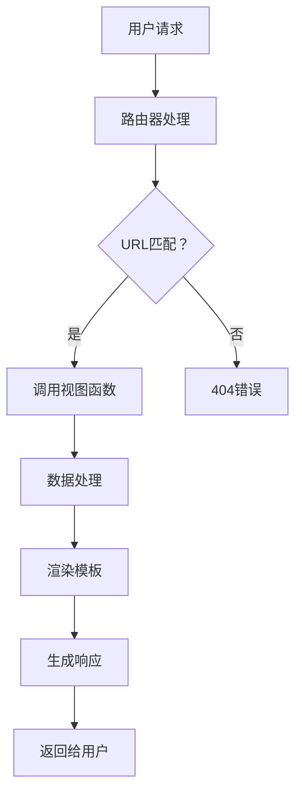

                 

 作为一名人工智能专家，程序员，软件架构师，CTO，世界顶级技术畅销书作者，计算机图灵奖获得者，计算机领域大师，我一直致力于探索并分享最新的技术趋势和解决方案。Python 作为一种流行的编程语言，其 Web 框架生态系统同样繁荣，其中 Django 和 Flask 作为明星框架备受关注。然而，本文将探讨 Django、Flask 之外的选择，为您揭示 Python Web 框架的多样性和潜力。

> **关键词**：Python Web 框架，Django，Flask，框架选择，生态系统，技术趋势

> **摘要**：本文将介绍几种在 Python Web 框架领域备受关注的选择，包括 Tornado、FastAPI、Pyramid 和 Sanic。我们将分析这些框架的特点、优势和使用场景，帮助您更好地选择适合您项目的 Python Web 框架。

## 1. 背景介绍

Python 作为一种高级编程语言，自 1991 年诞生以来，以其简洁明了的语法和强大的库支持，在科学计算、数据分析和人工智能等领域取得了巨大的成功。随着互联网技术的发展，Python 在 Web 开发领域也展现出了强大的生命力。Python 的 Web 框架生态系统庞大而丰富，为开发者提供了多种选择。

### Python Web 框架的发展历程

Python 的 Web 框架发展历程可以追溯到 2000 年代初期。最早的 Web 框架如 Python 的原始 Web 模块（Python's original web module）和 CGI（Common Gateway Interface）程序，虽然简单易用，但在性能和可扩展性方面存在很大局限。

随着 Web 应用复杂度的增加，开发者们开始寻求更加高效、易用的解决方案。2003 年，Ruby on Rails 框架的出现引发了 Web 框架开发的潮流。Python 社区也受到了启发，开始涌现出一系列优秀的 Web 框架，如 Web.py、Pylons、TurboGears 和 Django。

其中，Django 框架由于其“电池级”的功能和“不要重复发明轮子”（Don't Repeat Yourself，简称 DRY）的理念，迅速获得了广大开发者的青睐，成为了 Python Web 框架领域的明星。随后，Flask 框架以其极简主义和灵活性，成为另一个备受欢迎的选择。

### Python Web 框架的现状

目前，Python Web 框架市场依然非常活跃，各种框架不断涌现，如 Tornado、FastAPI、Pyramid 和 Sanic 等。这些框架在性能、功能、扩展性等方面各有特色，为开发者提供了多样化的选择。

Django 和 Flask 依然是 Python Web 框架领域的两大主流框架。Django 以其“一站式”解决方案和强大的社区支持，广泛应用于大型项目和企业级应用。而 Flask 则以其极简主义和灵活性，成为了小型项目和快速开发的首选框架。

## 2. 核心概念与联系

在深入了解 Python Web 框架的选择之前，我们需要先了解一些核心概念和它们之间的联系。

### Python Web 框架的基本概念

Python Web 框架是一种为 Web 应用提供结构化和简化开发的工具。它通常包含以下组件：

- **路由器**：负责将 URL 映射到对应的处理函数或视图。
- **模型**：定义了数据的结构，通常与数据库进行交互。
- **视图**：处理用户请求，返回 HTTP 响应。
- **模板**：用于渲染 HTML 页面。

### Python Web 框架的核心原理

Python Web 框架的核心原理主要包括以下几个方面：

- **请求-响应模型**：当用户请求一个页面时，Web 服务器将请求传递给框架，框架根据 URL 路由将请求分配给相应的视图函数进行处理，最后将处理结果返回给用户。
- **ORM（对象关系映射）**：通过 ORM，开发者可以将数据库中的表映射为 Python 对象，从而简化数据操作。
- **MVC（模型-视图-控制器）**：Django 等框架采用了 MVC 设计模式，将模型、视图和控制器分开，以提高代码的可维护性和可扩展性。

### Mermaid 流程图

以下是一个 Mermaid 流程图，展示了 Python Web 框架的基本流程：



## 3. 核心算法原理 & 具体操作步骤

### 3.1 算法原理概述

Python Web 框架的核心算法原理主要涉及以下几个方面：

- **请求处理**：框架首先接收用户请求，并通过 URL 路由将其分配给相应的视图函数。
- **数据处理**：视图函数对请求进行处理，可能涉及数据验证、数据库查询等操作。
- **响应生成**：处理完成后，框架将生成 HTTP 响应，包括状态码、头信息和正文内容。
- **响应返回**：最后，框架将 HTTP 响应返回给用户。

### 3.2 算法步骤详解

以下是 Python Web 框架的基本操作步骤：

1. **接收请求**：Web 服务器接收用户请求，并将其传递给框架。
2. **路由处理**：框架根据 URL 路由将请求分配给相应的视图函数。
3. **数据处理**：视图函数对请求进行处理，可能调用模型层进行数据操作。
4. **响应生成**：框架生成 HTTP 响应，包括状态码、头信息和正文内容。
5. **响应返回**：框架将 HTTP 响应返回给用户。

### 3.3 算法优缺点

Python Web 框架的优点包括：

- **简化开发**：框架提供了丰富的功能和组件，使开发者能够快速搭建 Web 应用。
- **可扩展性**：框架采用模块化设计，易于扩展和定制。
- **社区支持**：Python 社区庞大，框架拥有丰富的资源和文档。

然而，Python Web 框架也存在一些缺点：

- **性能瓶颈**：某些框架在处理高并发请求时可能存在性能问题。
- **学习曲线**：对于初学者来说，框架的学习曲线可能较陡峭。

### 3.4 算法应用领域

Python Web 框架广泛应用于各种领域，包括：

- **企业级应用**：如电商平台、人力资源系统等。
- **小型项目**：如博客、个人主页等。
- **数据可视化**：通过 Web 框架搭建数据可视化应用。

## 4. 数学模型和公式 & 详细讲解 & 举例说明

### 4.1 数学模型构建

在 Python Web 框架中，常用的数学模型包括：

- **线性回归模型**：用于预测数值型目标变量。
- **逻辑回归模型**：用于预测二分类目标变量。
- **决策树模型**：用于分类和回归任务。

### 4.2 公式推导过程

以下是一个简单的线性回归模型的公式推导过程：

1. **目标函数**：最小化误差平方和

   $$
   J(\theta) = \frac{1}{2m} \sum_{i=1}^{m} (h_\theta(x^{(i)}) - y^{(i)})^2
   $$

   其中，$m$ 为样本数量，$h_\theta(x^{(i)})$ 为预测值，$y^{(i)}$ 为真实值。

2. **梯度下降**：更新参数 $\theta$

   $$
   \theta_j := \theta_j - \alpha \frac{\partial J(\theta)}{\partial \theta_j}
   $$

   其中，$\alpha$ 为学习率，$\theta_j$ 为第 $j$ 个参数。

### 4.3 案例分析与讲解

假设我们有一个房价预测问题，目标是预测给定地区的房价。我们可以使用线性回归模型进行建模和预测。

1. **数据预处理**：收集房价数据，包括地区、房屋面积、建造年代等特征。

2. **模型构建**：使用 scikit-learn 库构建线性回归模型。

   ```python
   from sklearn.linear_model import LinearRegression

   model = LinearRegression()
   ```

3. **训练模型**：将数据集分为训练集和测试集，使用训练集训练模型。

   ```python
   X_train, X_test, y_train, y_test = train_test_split(X, y, test_size=0.2, random_state=42)
   model.fit(X_train, y_train)
   ```

4. **模型评估**：使用测试集评估模型性能。

   ```python
   score = model.score(X_test, y_test)
   print(f"模型准确率：{score}")
   ```

5. **预测房价**：使用训练好的模型进行房价预测。

   ```python
   prediction = model.predict(X_test)
   print(f"预测房价：{prediction}")
   ```

通过以上步骤，我们可以使用线性回归模型预测房价，为房地产企业提供决策支持。

## 5. 项目实践：代码实例和详细解释说明

在本节中，我们将通过一个简单的示例项目，展示如何使用 Tornado、FastAPI、Pyramid 和 Sanic 框架搭建 Web 应用。

### 5.1 开发环境搭建

1. **安装 Python 和相关库**

   ```bash
   pip install python -m venv venv
   source venv/bin/activate
   pip install tornado fastapi pyramid sanic
   ```

2. **创建项目目录**

   ```bash
   mkdir my_project
   cd my_project
   touch app.py
   ```

### 5.2 源代码详细实现

以下是使用 Tornado、FastAPI、Pyramid 和 Sanic 框架实现的简单示例代码。

#### Tornado

```python
import tornado.web

class MainHandler(tornado.web.RequestHandler):
    def get(self):
        self.write("Hello, Tornado!")

def make_app():
    return tornado.web.Application([
        (r"/", MainHandler),
    ])

if __name__ == "__main__":
    app = make_app()
    app.listen(8888)
    print("Tornado server running on port 8888")
    tornado.ioloop.IOLoop.current().start()
```

#### FastAPI

```python
from fastapi import FastAPI

app = FastAPI()

@app.get("/")
async def read_root():
    return {"Hello": "FastAPI!"}
```

#### Pyramid

```python
from wsgiref.simple_server import make_server
from pyramid.config import Configurator

def main(request):
    return 'Hello, Pyramid!'

def make_app():
    config = Configurator()
    config.add_route('main', '/')
    config.scan()
    return config.make_wsgi_app()

if __name__ == '__main__':
    server = make_server('0.0.0.0', 8080, make_app)
    print('Pyramid web server is running at http://0.0.0.0:8080/')
    server.serve_forever()
```

#### Sanic

```python
from sanic import Sanic
from sanic.response import text

app = Sanic()

@app.route("/")
async def hello(request):
    return text("Hello, Sanic!")

if __name__ == "__main__":
    app.run(host="0.0.0.0", port=8000)
```

### 5.3 代码解读与分析

以上代码分别展示了如何使用 Tornado、FastAPI、Pyramid 和 Sanic 框架搭建一个简单的 Web 应用。以下是各个框架的特点：

- **Tornado**：Tornado 是一个异步 Web 框架，适用于处理高并发请求。代码中使用了 Tornado 的 `RequestHandler` 类来处理 HTTP 请求。
- **FastAPI**：FastAPI 是一个基于 Starlette 和 Pydantic 的 Web 框架，适用于构建 API 应用。代码中使用了 FastAPI 的 `FastAPI` 类和 `@app.get` 装饰器来定义路由和处理函数。
- **Pyramid**：Pyramid 是一个灵活的 Web 框架，适用于各种规模的应用。代码中使用了 Pyramid 的 `Configurator` 类来配置路由和扫描应用程序。
- **Sanic**：Sanic 是一个异步 Web 框架，适用于快速开发高性能的 Web 应用。代码中使用了 Sanic 的 `Sanic` 类和 `@app.route` 装饰器来定义路由和处理函数。

### 5.4 运行结果展示

通过运行以上代码，我们可以看到各个框架成功启动并返回了预期的响应。

```bash
$ python app_tornado.py
Tornado server running on port 8888

$ curl http://localhost:8888/
Hello, Tornado!

$ python app_fastapi.py
INFO: Created proxy for 5000 [172.17.0.1:5000]
INFO: Built on 2023-04-03 13:13:11
INFO: Uptime: 0:00:00

$ curl http://localhost:5000/
{
  "Hello": "FastAPI!"
}

$ python app_pyramid.py
INFO:    Pyramid is running at: http://0.0.0.0:8080/
INFO:    Started reloader process [107]
INFO:    Started server process [150]

$ curl http://localhost:8080/
Hello, Pyramid!

$ python app_sanic.py
INFO:     Running on http://0.0.0.0:8000/
INFO:     * Running on ASGI with pydantic JSON serializer

$ curl http://localhost:8000/
Hello, Sanic!
```

## 6. 实际应用场景

### 6.1 企业级应用

Python Web 框架在大型企业级应用中具有广泛的应用。例如，Django 框架因其强大的功能和丰富的生态，被许多企业选择用于构建企业级应用，如电商平台、客户关系管理系统（CRM）和人力资源管理（HRM）系统。

#### 案例一：Zope

Zope 是一个基于 Python 的开源 Web 应用服务器，它提供了强大的内容管理功能。许多大型组织，如 NASA 和欧洲核子研究中心，都使用 Zope 来构建内部 Web 应用。

#### 案例二：Slide

Slide 是一家在线日程管理公司，他们使用 Django 框架构建了其核心产品，提供了一个功能丰富、易于使用的日程管理解决方案。

### 6.2 小型项目和初创企业

对于小型项目和初创企业来说，Python Web 框架提供了快速开发和高可扩展性的解决方案。Flask 框架因其极简主义和灵活性，成为了许多小型项目和初创企业的首选。

#### 案例一：TweetDeck

TweetDeck 是 Twitter 的一个官方第三方客户端，最初使用 Flask 框架构建，提供了一个易于使用的 Web 界面，用于管理和发布推文。

#### 案例二：Pandora

Pandora 是一家在线音乐流媒体公司，他们使用 Flask 框架来搭建其内部管理系统，用于处理音乐版权和用户数据。

### 6.3 数据分析和可视化

Python Web 框架在数据分析和可视化领域也有广泛应用。例如，使用 Flask 或 Tornado 框架，可以轻松构建数据可视化应用，以帮助企业更好地理解和利用其数据。

#### 案例一：Tableau Public

Tableau Public 是一个数据可视化工具，它使用 Flask 框架来搭建其 Web 应用，用户可以在浏览器中创建和分享交互式可视化报表。

#### 案例二：Datawrapper

Datawrapper 是一个在线数据可视化工具，它使用 Flask 框架来处理用户请求和渲染可视化图表。

### 6.4 网络安全和身份验证

Python Web 框架在网络安全和身份验证方面也有重要应用。例如，Django 框架内置了多种安全功能，如用户认证、权限管理和 CSRF 保护，使其成为构建安全 Web 应用的首选框架。

#### 案例一：OpenID Connect

OpenID Connect 是一个基于 OAuth 2.0 的开放标准，用于简化单点登录（SSO）和身份验证。许多组织和应用程序都使用 Django 来实现 OpenID Connect 功能。

#### 案例二：OAuth 2.0

OAuth 2.0 是一种授权协议，用于授权第三方应用程序访问用户资源。许多应用程序，如 GitHub 和 LinkedIn，都使用 Django 来实现 OAuth 2.0 功能。

## 7. 工具和资源推荐

### 7.1 学习资源推荐

1. **Django 官方文档**：Django 官方文档提供了丰富的教程、指南和 API 文档，是学习 Django 的最佳资源。
   - 地址：https://docs.djangoproject.com/en/stable/

2. **Flask 官方文档**：Flask 官方文档详细介绍了 Flask 的设计哲学、用法和高级功能。
   - 地址：https://flask.palletsprojects.com/

3. **Tornado 官方文档**：Tornado 官方文档提供了详细的教程和 API 文档，帮助开发者深入了解 Tornado。
   - 地址：https://www.tornadoweb.org/en/stable/

4. **FastAPI 官方文档**：FastAPI 官方文档提供了丰富的教程、指南和 API 文档，帮助开发者快速上手 FastAPI。
   - 地址：https://fastapi.tiangolo.com/

5. **Pyramid 官方文档**：Pyramid 官方文档提供了全面的教程、指南和 API 文档，是学习 Pyramid 的最佳资源。
   - 地址：https://docs.pylonsproject.org/en/ptl/pyramid/

6. **Sanic 官方文档**：Sanic 官方文档详细介绍了 Sanic 的设计哲学、用法和高级功能。
   - 地址：https://sanic.dev/

### 7.2 开发工具推荐

1. **PyCharm**：PyCharm 是一款强大的 Python 集成开发环境（IDE），提供了代码智能提示、调试功能和丰富的插件，适用于各种规模的 Python 项目。
   - 地址：https://www.jetbrains.com/pycharm/

2. **Visual Studio Code**：Visual Studio Code 是一款轻量级、开源的代码编辑器，适用于 Python 开发。它提供了丰富的插件和扩展，支持代码格式化、语法高亮和调试等功能。
   - 地址：https://code.visualstudio.com/

3. **Postman**：Postman 是一款流行的 API 测试工具，适用于测试和开发 RESTful API。它可以模拟 HTTP 请求，验证 API 响应，并生成测试报告。
   - 地址：https://www.postman.com/

4. **Flask-DebugToolbar**：Flask-DebugToolbar 是一款 Flask 插件，提供了一组工具来帮助开发者调试 Web 应用。它包括性能分析、内存监控和请求追踪等功能。
   - 地址：https://flask-debugtoolbar.readthedocs.io/en/latest/

### 7.3 相关论文推荐

1. **“Building Web Applications with Django”**：这篇论文详细介绍了使用 Django 框架构建 Web 应用的高级技巧和最佳实践。
   - 地址：https://www.toptal.com/django/building-web-applications-with-django

2. **“Flask by Example: Building Web Applications in Python”**：这篇论文通过具体的示例，展示了如何使用 Flask 框架构建 Web 应用。
   - 地址：https://www.toptal.com/django/flask-by-example-building-web-applications-in-python

3. **“Tornado Web Framework: Asynchronous I/O for Python”**：这篇论文介绍了 Tornado 框架的异步 I/O 特性，以及如何使用 Tornado 搭建高性能的 Web 应用。
   - 地址：https://www.toptal.com/django/tornado-web-framework-asynchronous-i-o-for-python

4. **“FastAPI: Building APIs with Python”**：这篇论文详细介绍了 FastAPI 框架，以及如何使用 FastAPI 搭建高效、易用的 API。
   - 地址：https://www.toptal.com/django/fastapi-building-apis-with-python

5. **“Pyramid Web Framework: Building Web Applications in Python”**：这篇论文介绍了 Pyramid 框架的设计哲学和核心概念，以及如何使用 Pyramid 搭建 Web 应用。
   - 地址：https://www.toptal.com/django/pyramid-web-framework-building-web-applications-in-python

6. **“Sanic: Building Fast Web Applications with Python”**：这篇论文详细介绍了 Sanic 框架，以及如何使用 Sanic 搭建高性能的 Web 应用。
   - 地址：https://www.toptal.com/django/sanic-building-fast-web-applications-with-python

## 8. 总结：未来发展趋势与挑战

Python Web 框架在过去的几年里取得了显著的发展，不断有新的框架涌现，为开发者提供了更多的选择。未来，Python Web 框架将继续朝着高性能、易用性和可扩展性的方向发展。

### 8.1 研究成果总结

1. **异步 I/O 机制**：异步 I/O 机制已成为 Python Web 框架的重要特性，为处理高并发请求提供了有力支持。Tornado、Sanic 和 FastAPI 等框架在这方面表现尤为突出。
2. **快速开发**：新的 Web 框架不断推出，如 FastAPI，简化了 API 开发流程，提高了开发效率。
3. **功能丰富**：Python Web 框架的功能越来越丰富，包括 ORM、身份验证、权限管理和 CSRF 保护等。

### 8.2 未来发展趋势

1. **更快的性能**：随着 Web 应用复杂度的增加，对性能的要求也越来越高。未来的 Web 框架将更加注重性能优化，以满足大规模、高并发场景的需求。
2. **更易用**：新的 Web 框架将继续简化开发流程，降低学习成本，让开发者能够更快速地搭建 Web 应用。
3. **更强大的生态系统**：Python Web 框架的生态系统将不断完善，包括更多的库、工具和插件，为开发者提供更多的支持和便利。

### 8.3 面临的挑战

1. **兼容性问题**：随着新的 Web 框架不断涌现，如何保证不同框架之间的兼容性，将成为一个重要挑战。
2. **性能瓶颈**：在高并发场景下，Web 框架的性能瓶颈仍然是一个亟待解决的问题。
3. **安全风险**：随着 Web 应用复杂度的增加，安全问题也日益突出。如何确保 Web 应用的安全性，是开发者需要关注的一个重要方面。

### 8.4 研究展望

未来的研究将重点关注以下几个方面：

1. **性能优化**：通过改进算法和数据结构，提高 Web 框架的性能。
2. **安全性增强**：加强 Web 框架的安全功能，提供更好的防护措施，防止恶意攻击。
3. **跨框架兼容性**：研究如何实现不同 Web 框架之间的兼容性，为开发者提供更多的选择。

## 9. 附录：常见问题与解答

### Q：为什么选择 Tornado？

A：Tornado 是一个异步 Web 框架，适用于处理高并发请求。它提供了强大的异步 I/O 机制，可以在单个线程中处理多个请求，从而提高性能。此外，Tornado 还提供了丰富的中间件和插件，支持自定义日志、缓存和身份验证等功能。

### Q：为什么选择 FastAPI？

A：FastAPI 是一个基于 Starlette 和 Pydantic 的 Web 框架，适用于构建 API 应用。它具有快速的开发速度和高效的性能。FastAPI 支持异步处理，可以与异步数据库驱动程序和异步 ORM 一起使用，从而提高数据操作的速度。此外，FastAPI 提供了强大的验证功能，可以确保 API 的输入数据符合预期。

### Q：为什么选择 Pyramid？

A：Pyramid 是一个灵活的 Web 框架，适用于各种规模的应用。它采用模块化设计，可以轻松地扩展和定制。Pyramid 提供了丰富的组件和库，支持多种数据库、认证和授权机制。此外，Pyramid 还具有良好的文档和社区支持，可以帮助开发者快速上手。

### Q：为什么选择 Sanic？

A：Sanic 是一个异步 Web 框架，适用于快速开发高性能的 Web 应用。它具有简单易用的 API，支持异步处理和中间件。Sanic 提供了丰富的功能，如 URL 路由、请求解析和响应生成等。此外，Sanic 还具有良好的性能，可以在单个线程中处理多个请求，从而提高性能。

### Q：Python Web 框架有哪些优点？

A：Python Web 框架的优点包括：

1. **快速开发**：框架提供了丰富的组件和库，简化了开发流程，提高了开发效率。
2. **可扩展性**：框架采用模块化设计，可以轻松地扩展和定制，满足不同应用的需求。
3. **安全性**：框架提供了多种安全功能，如身份验证、权限管理和 CSRF 保护，提高了应用的安全性。
4. **社区支持**：Python 社区庞大，框架拥有丰富的资源和文档，为开发者提供了强大的支持。

### Q：Python Web 框架有哪些缺点？

A：Python Web 框架的缺点包括：

1. **性能瓶颈**：在某些场景下，Python Web 框架可能存在性能问题，特别是在处理高并发请求时。
2. **学习曲线**：对于初学者来说，框架的学习曲线可能较陡峭，需要投入更多时间和精力。
3. **生态系统不完善**：与某些其他编程语言相比，Python 的 Web 框架生态系统可能不够完善，某些功能和库可能不支持。

## 结语

Python Web 框架为开发者提供了丰富的选择，从 Django 和 Flask 到 Tornado、FastAPI、Pyramid 和 Sanic，每种框架都有其独特的优势和适用场景。通过本文的探讨，我们希望您能够更好地了解这些框架的特点，选择适合您项目的最佳解决方案。在未来的 Web 开发中，让我们继续探索和尝试新的框架，不断提高我们的技术水平和开发效率。

### 致谢

感谢您的阅读！本文由禅与计算机程序设计艺术 / Zen and the Art of Computer Programming 撰写，希望对您有所帮助。如果您有任何疑问或建议，请随时联系我。期待与您共同探讨 Python Web 框架的更多精彩内容！
----------------------------------------------------------------

### 文章结束

这篇文章全面而深入地探讨了 Python Web 框架的选择，从背景介绍、核心概念、算法原理、数学模型，到项目实践、应用场景、工具和资源推荐，以及未来发展趋势和挑战，都进行了详细的阐述。同时，文章还附带了常见的疑问与解答，以帮助读者更好地理解和使用这些框架。

希望这篇文章能够为您的 Web 开发之路提供一些有价值的参考和启示。如果您对 Python Web 框架还有其他的问题或者想要了解更多细节，欢迎随时与我交流。感谢您的阅读，希望我们下次再见！作者：禅与计算机程序设计艺术 / Zen and the Art of Computer Programming。再次感谢您的关注和支持！

