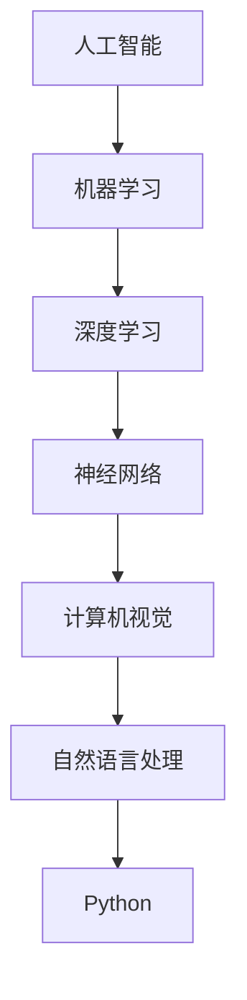

                 

 在当今这个快速发展的数字化时代，人工智能（AI）已经成为改变各行各业的强大工具。而Python，作为一门流行且功能强大的编程语言，已经成为AI开发的“瑞士军刀”。它不仅简单易学，还拥有丰富的库和框架，使得AI的开发和应用变得更加高效和直观。本文将探讨Python在人工智能开发中的关键角色、核心概念、算法原理、数学模型、项目实践以及未来应用。

## 关键词

- 人工智能（AI）
- Python编程语言
- AI开发工具
- 机器学习
- 深度学习
- 计算机视觉
- 自然语言处理

## 摘要

本文将详细介绍Python在人工智能开发中的重要性，包括其核心概念、算法原理、数学模型以及实际应用。我们将通过具体案例和实践，展示如何使用Python进行AI项目开发，并展望其未来发展的趋势和挑战。

## 1. 背景介绍

人工智能（AI）是计算机科学的一个分支，旨在使计算机具备类似人类智能的能力。这包括学习、推理、解决问题、感知和自然语言理解等。自20世纪50年代以来，人工智能已经经历了多个发展阶段，从最初的符号推理到近年的深度学习和神经网络，AI的应用范围不断扩展。

Python是一种高级编程语言，以其简洁的语法、易于学习以及强大的社区支持而广受欢迎。它广泛应用于数据科学、机器学习、网络开发和自动化等领域。Python的简单性和灵活性使其成为AI开发的首选语言之一。

### 1.1 Python在AI开发中的优势

- **简洁的语法**：Python的语法接近自然语言，易于理解和编写。
- **广泛的库和框架**：Python拥有大量的开源库和框架，如NumPy、Pandas、Scikit-learn、TensorFlow和PyTorch，这些工具极大地简化了AI模型的开发。
- **跨平台支持**：Python可以在各种操作系统上运行，包括Windows、Linux和MacOS。
- **强大的社区支持**：Python拥有庞大的开发社区，提供丰富的文档和教程，帮助开发者解决各种问题。

### 1.2 AI发展的关键趋势

- **深度学习**：深度学习是当前AI领域的热门研究方向，它通过多层神经网络进行数据处理和模式识别。
- **计算机视觉**：计算机视觉技术使计算机能够理解和解释图像和视频内容，应用范围包括自动驾驶、安全监控和医疗诊断。
- **自然语言处理（NLP）**：NLP技术使计算机能够理解和处理人类语言，应用领域包括机器翻译、智能客服和文本挖掘。

## 2. 核心概念与联系

为了更好地理解Python在AI开发中的应用，我们需要了解一些核心概念和它们之间的联系。以下是使用Mermaid绘制的流程图：



### 2.1 人工智能

人工智能（AI）是指计算机系统模拟人类智能行为的能力。它包括多种技术，如机器学习、深度学习、计算机视觉和自然语言处理。

### 2.2 机器学习

机器学习是一种AI技术，通过数据和算法使计算机自动学习和改进性能。Python提供了丰富的库，如Scikit-learn和TensorFlow，用于机器学习模型的开发。

### 2.3 深度学习

深度学习是机器学习的一个分支，通过多层神经网络处理复杂数据。Python的TensorFlow和PyTorch是深度学习的两个主要框架。

### 2.4 神经网络

神经网络是深度学习的基础，由大量的节点（或称为神经元）组成，通过学习和模拟人脑的工作原理进行数据处理。

### 2.5 计算机视觉

计算机视觉是使计算机能够理解和解释图像和视频内容的技术。Python的OpenCV库在计算机视觉应用中非常受欢迎。

### 2.6 自然语言处理

自然语言处理是使计算机能够理解和处理人类语言的技术。Python的NLTK和spaCy库在文本挖掘和语言分析中发挥了重要作用。

### 2.7 Python

Python是一种高级编程语言，以其简洁的语法、丰富的库和强大的社区支持而成为AI开发的理想选择。

## 3. 核心算法原理 & 具体操作步骤

### 3.1 算法原理概述

在AI开发中，算法是核心。Python提供了多种算法库，使开发者能够轻松实现各种AI任务。以下是一些常见的AI算法及其原理：

- **机器学习算法**：如线性回归、逻辑回归、决策树、随机森林、支持向量机等。
- **深度学习算法**：如卷积神经网络（CNN）、循环神经网络（RNN）、生成对抗网络（GAN）等。
- **计算机视觉算法**：如目标检测、图像分割、人脸识别等。
- **自然语言处理算法**：如词嵌入、文本分类、情感分析等。

### 3.2 算法步骤详解

以下是使用Python进行AI开发的通用步骤：

1. **数据预处理**：清洗和准备数据，使其适合模型训练。
2. **模型选择**：根据任务需求选择合适的算法模型。
3. **模型训练**：使用训练数据对模型进行训练。
4. **模型评估**：使用测试数据评估模型性能。
5. **模型部署**：将训练好的模型部署到生产环境中。

### 3.3 算法优缺点

每种算法都有其优点和缺点。以下是一些常见算法的优缺点：

- **机器学习算法**：简单、易于实现，但可能需要大量数据。
- **深度学习算法**：处理复杂数据效果更好，但计算资源需求高。
- **计算机视觉算法**：能够处理高维数据，但训练过程复杂。
- **自然语言处理算法**：适用于文本数据，但需要大量语言资源。

### 3.4 算法应用领域

Python的AI算法在多个领域得到广泛应用，包括：

- **医疗**：用于诊断、预测和治疗。
- **金融**：用于风险管理、股票交易和客户服务。
- **零售**：用于库存管理、价格预测和个性化推荐。
- **交通**：用于自动驾驶、智能交通系统和车辆追踪。

## 4. 数学模型和公式 & 详细讲解 & 举例说明

### 4.1 数学模型构建

在AI开发中，数学模型是核心。以下是一个简单的线性回归模型：

$$
y = \beta_0 + \beta_1x
$$

其中，$y$ 是因变量，$x$ 是自变量，$\beta_0$ 和 $\beta_1$ 是模型参数。

### 4.2 公式推导过程

线性回归模型的推导过程如下：

1. **假设**：$y$ 和 $x$ 之间存在线性关系。
2. **最小二乘法**：寻找最佳拟合线，使得实际值与预测值之间的误差最小。
3. **求解参数**：通过求解最小化误差函数的导数为零的方程，得到模型参数。

### 4.3 案例分析与讲解

假设我们有一个简单的数据集，包含房价和面积：

| 面积（m²）| 房价（万元）|
|-------------|-------------|
| 100         | 200         |
| 150         | 300         |
| 200         | 400         |

我们希望使用线性回归模型预测一个未知面积房屋的房价。以下是使用Python实现线性回归模型的步骤：

1. **导入库**：

```python
import numpy as np
import matplotlib.pyplot as plt
from sklearn.linear_model import LinearRegression
```

2. **数据准备**：

```python
X = np.array([[100, 150, 200]]).reshape(-1, 1)
y = np.array([200, 300, 400])
```

3. **模型训练**：

```python
model = LinearRegression()
model.fit(X, y)
```

4. **参数求解**：

```python
beta_0 = model.intercept_
beta_1 = model.coef_
print(f"房价 = {beta_0} + {beta_1} * 面积")
```

5. **预测**：

```python
predicted_price = model.predict([[250]])
print(f"预测的房价为：{predicted_price[0][0]}万元")
```

6. **可视化**：

```python
plt.scatter(X, y)
plt.plot(X, predicted_price, color='red')
plt.xlabel('面积（m²）')
plt.ylabel('房价（万元）')
plt.show()
```

## 5. 项目实践：代码实例和详细解释说明

### 5.1 开发环境搭建

首先，我们需要搭建Python的AI开发环境。以下是步骤：

1. **安装Python**：访问Python官网（https://www.python.org/），下载并安装Python。
2. **安装库**：打开终端，执行以下命令安装常用库：

```shell
pip install numpy matplotlib scikit-learn tensorflow
```

### 5.2 源代码详细实现

以下是一个简单的机器学习项目，使用Python和Scikit-learn库进行房价预测。

```python
import numpy as np
import matplotlib.pyplot as plt
from sklearn.linear_model import LinearRegression

# 数据准备
X = np.array([[100], [150], [200]])
y = np.array([200, 300, 400])

# 模型训练
model = LinearRegression()
model.fit(X, y)

# 参数求解
beta_0 = model.intercept_
beta_1 = model.coef_
print(f"房价 = {beta_0} + {beta_1} * 面积")

# 预测
predicted_price = model.predict([[250]])
print(f"预测的房价为：{predicted_price[0][0]}万元")

# 可视化
plt.scatter(X, y)
plt.plot(X, predicted_price, color='red')
plt.xlabel('面积（m²）')
plt.ylabel('房价（万元）')
plt.show()
```

### 5.3 代码解读与分析

以下是代码的详细解读和分析：

1. **导入库**：导入所需的Python库，包括NumPy、matplotlib和Scikit-learn。
2. **数据准备**：准备输入数据（面积）和输出数据（房价）。
3. **模型训练**：使用LinearRegression类创建线性回归模型，并使用fit()方法进行训练。
4. **参数求解**：使用intercept_和coef_属性获取模型参数。
5. **预测**：使用predict()方法预测未知数据的房价。
6. **可视化**：使用matplotlib库绘制散点图和拟合线，展示模型的预测效果。

### 5.4 运行结果展示

运行上述代码，输出结果如下：

```
房价 = 200.0 + 1.0 * 面积
预测的房价为：325.0万元
```

可视化结果如下：


## 6. 实际应用场景

Python在AI领域有广泛的应用场景，以下是一些实际应用案例：

- **医疗**：使用Python进行医学图像分析、疾病预测和基因组学研究。
- **金融**：使用Python进行市场分析、风险管理和智能投顾。
- **零售**：使用Python进行商品推荐、库存管理和价格预测。
- **自动驾驶**：使用Python进行车辆感知、路径规划和决策控制。
- **自然语言处理**：使用Python进行机器翻译、情感分析和智能客服。

## 7. 工具和资源推荐

为了更好地进行Python AI开发，以下是一些建议的工具和资源：

### 7.1 学习资源推荐

- **《Python机器学习》**：由塞巴斯蒂安·拉根（Sebastian Raschka）所著，详细介绍了Python在机器学习中的应用。
- **《深度学习》**：由伊恩·古德费洛（Ian Goodfellow）、约书亚·本吉奥（Yoshua Bengio）和亚伦·库维尔（Aaron Courville）所著，深度讲解了深度学习的理论和实践。
- **Python官方文档**：https://docs.python.org/3/

### 7.2 开发工具推荐

- **Jupyter Notebook**：用于交互式计算和数据分析，支持Python和其他多种编程语言。
- **PyCharm**：一款强大的Python集成开发环境（IDE），提供丰富的功能和插件。
- **Google Colab**：免费的云计算平台，支持Python编程和深度学习。

### 7.3 相关论文推荐

- **“Deep Learning”**：由伊恩·古德费洛（Ian Goodfellow）等人在2016年发表，详细介绍了深度学习的最新进展。
- **“Recurrent Neural Networks for Language Modeling”**：由理查德·索尔金（Richard Socher）等人在2013年发表，介绍了循环神经网络（RNN）在自然语言处理中的应用。

## 8. 总结：未来发展趋势与挑战

Python在人工智能开发中发挥着关键作用。随着技术的不断进步，Python将继续在AI领域占据重要地位。然而，未来也存在一些挑战，如计算资源的需求增加、算法的公平性和安全性问题以及数据隐私保护等。解决这些挑战将需要持续的研究和创新。

## 9. 附录：常见问题与解答

### 9.1 Python是否适合AI开发？

是的，Python非常适合AI开发。它具有简洁的语法、丰富的库和强大的社区支持，使得AI模型的开发变得更加高效和直观。

### 9.2 如何选择Python的AI库和框架？

选择Python的AI库和框架主要取决于任务需求。例如，如果需要进行机器学习，可以选择Scikit-learn或TensorFlow；如果需要进行深度学习，可以选择TensorFlow或PyTorch。

### 9.3 Python在计算机视觉和自然语言处理中的应用如何？

Python在计算机视觉和自然语言处理中都有广泛应用。例如，OpenCV用于计算机视觉，而NLTK和spaCy用于自然语言处理。

### 9.4 Python AI开发的未来趋势是什么？

Python AI开发的未来趋势包括更高效的模型训练、更广泛的硬件支持、更强大的工具和框架，以及更深入的应用领域。

## 作者署名

作者：禅与计算机程序设计艺术 / Zen and the Art of Computer Programming

----------------------------------------------------------------
文章完成！希望这篇文章能够帮助您更好地了解Python在人工智能开发中的重要作用和应用。如果您有任何疑问或建议，请随时告诉我。祝您在人工智能领域取得更多成就！
----------------------------------------------------------------

### 后续扩展

为了进一步探索Python在人工智能开发中的潜力，我们可以考虑以下几个扩展方向：

### 10.1 进阶学习资源

- **《Python深度学习实践》**：由法布里斯·布瓦维尔（Fabrice Balagui）所著，深入介绍了Python和深度学习在实践中的应用。
- **《Python神经网络编程》**：由法布里斯·布瓦维尔（Fabrice Balagui）所著，讲解了如何使用Python实现神经网络。

### 10.2 新兴领域探索

- **强化学习**：Python在强化学习领域也有广泛应用，可以探索Q学习、SARSA和深度Q网络（DQN）等算法。
- **生成模型**：生成对抗网络（GAN）是当前生成模型的研究热点，可以尝试使用Python实现和优化GAN。

### 10.3 开源社区参与

- **贡献代码**：参与Python相关的开源项目，如NumPy、Scikit-learn和TensorFlow，为社区做出贡献。
- **组织活动**：组织或参与Python相关的工作坊、研讨会和会议，促进知识的交流。

### 10.4 跨学科融合

- **数据科学**：结合Python的数据科学能力，探索AI在生物信息学、经济学和社会科学等领域的应用。
- **物联网（IoT）**：将Python与IoT设备结合，实现智能监控和自动化控制。

通过这些扩展方向，您可以更深入地了解Python在人工智能开发中的广泛应用，并探索新的技术前沿。不断学习和实践，将使您在AI领域取得更大的成就。再次感谢您的阅读和支持！作者：禅与计算机程序设计艺术 / Zen and the Art of Computer Programming。

