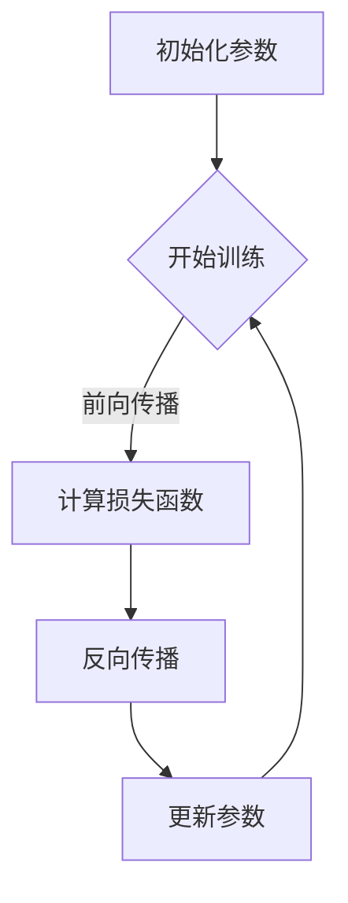

                 

### 引言

随着深度学习技术的迅猛发展，构建复杂的神经网络模型已成为人工智能领域的一项关键技术。在众多深度学习框架中，PyTorch因其动态计算图（Dynamic Computation Graph, DCG）的独特优势，受到了广大研究者和开发者的青睐。本文将深入探讨PyTorch动态计算图的原理、优势和应用，帮助读者更好地理解和利用这一强大的工具。

本文将分为以下几个部分：

1. 背景介绍
2. 核心概念与联系
3. 核心算法原理与具体操作步骤
4. 数学模型和公式讲解
5. 项目实践：代码实例和详细解释
6. 实际应用场景
7. 工具和资源推荐
8. 总结：未来发展趋势与挑战
9. 附录：常见问题与解答

希望通过本文的阐述，读者可以全面了解PyTorch动态计算图的魅力，并在实际项目中充分发挥其潜力。

## 1. 背景介绍

深度学习作为一种机器学习的方法，通过模拟人脑的神经网络结构，实现对复杂数据的分析和处理。传统的深度学习框架通常采用静态计算图（Static Computation Graph, SFG）进行模型构建和计算。静态计算图的优点在于计算过程的确定性，使得模型在训练和推理阶段能够高效运行。然而，静态计算图的局限性也逐渐显现，特别是在模型构建的灵活性、动态调整和调试等方面。

为了克服这些局限性，动态计算图应运而生。动态计算图允许用户在运行时构建和修改计算图，提高了模型构建的灵活性和调试的便捷性。PyTorch正是这样一个基于动态计算图的深度学习框架，它具有以下显著优势：

1. **灵活的模型构建**：PyTorch的动态计算图允许用户以接近Python代码的方式构建神经网络，无需像静态计算图那样提前定义整个计算过程。
2. **高效的推理性能**：通过自动微分机制，PyTorch可以高效地进行模型训练和推理。
3. **强大的社区支持**：PyTorch拥有庞大的社区和丰富的文档资源，方便用户学习和使用。
4. **跨平台兼容性**：PyTorch支持多种硬件平台，包括CPU、GPU和TPU，使得模型可以在不同硬件环境中高效运行。

本文将详细探讨PyTorch动态计算图的优势和应用，帮助读者深入理解这一强大的工具。

## 2. 核心概念与联系

### 2.1 动态计算图的基本概念

动态计算图（Dynamic Computation Graph）是一种在运行时构建和修改的计算图，与静态计算图不同，它不要求在训练之前就完全定义好所有的计算操作。在动态计算图中，节点代表操作（例如矩阵乘法、激活函数等），边代表数据流（即变量）。用户可以在程序运行过程中动态地添加、删除或修改计算图中的节点和边，从而实现高度灵活的模型构建。

### 2.2 动态计算图与静态计算图的比较

**灵活性**：动态计算图最大的优势在于其灵活性。在PyTorch中，用户可以像操作普通Python对象一样构建神经网络，这使得模型构建过程更加直观和高效。相比之下，静态计算图在模型构建初期就需要定义所有的操作和连接，一旦定义完成，计算图的结构就固定下来，无法在运行时修改。

**调试与修改**：动态计算图使得模型调试变得更加容易。用户可以在运行过程中查看和修改计算图的各个部分，从而快速定位和修复问题。而静态计算图在运行前就已经固定，一旦出现问题，调试过程相对复杂。

**性能**：虽然动态计算图在灵活性和调试方面具有优势，但在性能上可能不如静态计算图。因为静态计算图可以提前进行优化，使得计算过程更加高效。然而，随着硬件和编译技术的不断发展，这种性能差距正在逐渐缩小。

### 2.3 Mermaid 流程图展示

下面是一个简单的Mermaid流程图，展示了动态计算图的基本结构和操作流程：



在这个流程图中，A表示初始化参数，B表示开始训练，C表示前向传播计算损失函数，D表示反向传播更新参数，E表示参数更新后继续训练。用户可以根据需要动态地添加或修改这些节点和边，从而实现灵活的模型训练过程。

## 3. 核心算法原理与具体操作步骤

### 3.1 算法原理概述

动态计算图的核心在于其灵活性和可操作性。在PyTorch中，计算图是通过Tensor（张量）和Autograd（自动微分）模块实现的。Tensor是PyTorch中的基本数据结构，它类似于NumPy的ndarray，但支持自动微分和GPU加速。Autograd是一个自动微分框架，它能够自动记录计算过程中的中间结果，从而在反向传播阶段高效地计算梯度。

### 3.2 算法步骤详解

#### 3.2.1 张量操作

在PyTorch中，构建神经网络的第一步是定义和操作张量。张量可以是任何多维数组，包括矩阵、向量等。PyTorch提供了丰富的张量操作函数，如加法、减法、乘法、除法、矩阵乘法等。以下是一个简单的例子：

```python
import torch

# 创建一个5x5的矩阵
x = torch.randn(5, 5)
print(x)

# 矩阵乘法
y = torch.matmul(x, x.t())
print(y)
```

在这个例子中，首先创建了一个5x5的随机矩阵x，然后通过矩阵乘法计算x与其转置的乘积y。

#### 3.2.2 自动微分

自动微分是动态计算图的核心。在PyTorch中，通过记录计算过程中的中间结果，Autograd能够自动计算梯度。以下是一个简单的自动微分例子：

```python
import torch

# 创建一个可微的张量
x = torch.tensor([1.0, 2.0, 3.0], requires_grad=True)

# 定义一个函数
def f(x):
    return x.sum()

# 前向传播
y = f(x)
print(y)

# 反向传播
y.backward()
print(x.grad)
```

在这个例子中，首先创建了一个可微的张量x，然后定义了一个函数f，计算x的和。通过调用y.backward()，自动计算了x的梯度。

#### 3.2.3 神经网络构建

在PyTorch中，构建神经网络通常涉及以下步骤：

1. **定义网络结构**：通过定义神经网络的不同层（如线性层、卷积层、池化层等），构建完整的网络结构。
2. **初始化参数**：为网络的各个层初始化参数，如权重和偏置。
3. **定义损失函数**：选择合适的损失函数，用于计算模型的预测误差。
4. **定义优化器**：选择合适的优化器，用于更新模型的参数。

以下是一个简单的神经网络构建例子：

```python
import torch
import torch.nn as nn

# 定义神经网络结构
class NeuralNetwork(nn.Module):
    def __init__(self):
        super(NeuralNetwork, self).__init__()
        self.fc1 = nn.Linear(5, 10)  # 输入层到隐藏层
        self.fc2 = nn.Linear(10, 1)  # 隐藏层到输出层

    def forward(self, x):
        x = torch.relu(self.fc1(x))
        x = self.fc2(x)
        return x

# 实例化神经网络
model = NeuralNetwork()

# 定义损失函数和优化器
criterion = nn.MSELoss()
optimizer = torch.optim.SGD(model.parameters(), lr=0.01)
```

在这个例子中，我们定义了一个简单的神经网络，包含一个输入层、一个隐藏层和一个输出层。然后，我们定义了损失函数为均方误差（MSE），并选择了随机梯度下降（SGD）作为优化器。

#### 3.2.4 训练过程

在完成神经网络构建后，我们可以开始训练模型。训练过程通常包括以下步骤：

1. **前向传播**：输入训练数据，通过神经网络计算输出。
2. **计算损失**：使用损失函数计算输出与真实标签之间的差距。
3. **反向传播**：计算梯度，并更新模型的参数。
4. **迭代**：重复上述步骤，直到满足训练要求（如达到预定迭代次数或损失函数收敛）。

以下是一个简单的训练例子：

```python
import torch

# 初始化训练数据
x_train = torch.randn(100, 5)
y_train = torch.randn(100, 1)

# 训练模型
for epoch in range(100):
    # 前向传播
    outputs = model(x_train)
    
    # 计算损失
    loss = criterion(outputs, y_train)
    
    # 反向传播
    optimizer.zero_grad()
    loss.backward()
    optimizer.step()
    
    # 打印训练信息
    if (epoch + 1) % 10 == 0:
        print(f'Epoch [{epoch + 1}/100], Loss: {loss.item():.4f}')
```

在这个例子中，我们使用随机生成的训练数据进行模型训练。每10个epoch后，打印当前的损失值。

### 3.3 算法优缺点

**优点**：

1. **灵活性**：动态计算图允许用户在运行时灵活地构建和修改模型，大大提高了模型构建的灵活性。
2. **便捷的调试**：用户可以方便地查看和修改计算图中的节点和边，使得模型调试过程更加直观和高效。
3. **自动微分**：自动微分机制使得梯度计算变得简单和高效，用户无需手动计算梯度。

**缺点**：

1. **性能**：与静态计算图相比，动态计算图在性能上可能存在一定的差距，特别是在大规模模型训练中。
2. **学习曲线**：对于初学者来说，动态计算图的概念和操作可能相对复杂，需要一定的时间去理解和掌握。

### 3.4 算法应用领域

动态计算图在深度学习领域有广泛的应用，包括但不限于：

1. **计算机视觉**：用于构建和训练图像识别、目标检测等模型。
2. **自然语言处理**：用于构建和训练语言模型、机器翻译等模型。
3. **强化学习**：用于构建和训练智能体模型，实现游戏AI、自动驾驶等应用。
4. **科学计算**：用于构建和训练科学计算模型，如物理模拟、生物信息学等。

## 4. 数学模型和公式讲解

### 4.1 数学模型构建

在深度学习中，数学模型通常基于多层感知机（Multilayer Perceptron, MLP）或卷积神经网络（Convolutional Neural Network, CNN）等基本结构。以下是一个简单的前馈神经网络（前向传播）的数学模型构建：

**输入层**：

设输入层有n个神经元，每个神经元接收m个输入特征，即：

\[ X = \begin{bmatrix} x_1^1 \\ x_2^1 \\ \vdots \\ x_n^1 \end{bmatrix} \in \mathbb{R}^{m \times 1} \]

**隐藏层**：

设隐藏层有l个神经元，每个神经元接收来自输入层的输出，并经过一个非线性激活函数，即：

\[ H = \sigma(W_1 \cdot X + b_1) \]

其中，\( \sigma \) 是激活函数（如Sigmoid、ReLU等），\( W_1 \) 是输入层到隐藏层的权重矩阵，\( b_1 \) 是输入层到隐藏层的偏置向量。

**输出层**：

设输出层有k个神经元，每个神经元接收来自隐藏层的输出，并经过一个非线性激活函数，即：

\[ Y = \sigma(W_2 \cdot H + b_2) \]

其中，\( W_2 \) 是隐藏层到输出层的权重矩阵，\( b_2 \) 是隐藏层到输出层的偏置向量。

### 4.2 公式推导过程

在反向传播阶段，我们需要计算每一层的梯度，以便更新模型的参数。以下是前向传播和反向传播的公式推导：

**前向传播**：

设输入层到隐藏层的权重矩阵为\( W_1 \)，隐藏层到输出层的权重矩阵为\( W_2 \)。前向传播的输出可以表示为：

\[ H = \sigma(W_1 \cdot X + b_1) \]
\[ Y = \sigma(W_2 \cdot H + b_2) \]

**反向传播**：

设损失函数为\( L \)，则输出层的梯度可以表示为：

\[ \frac{\partial L}{\partial Y} = \frac{\partial \sigma(W_2 \cdot H + b_2)}{\partial Y} \]

然后，我们可以通过链式法则计算隐藏层的梯度：

\[ \frac{\partial L}{\partial H} = \frac{\partial L}{\partial Y} \cdot \frac{\partial Y}{\partial H} = \frac{\partial L}{\partial Y} \cdot \frac{\partial \sigma(W_2 \cdot H + b_2)}{\partial H} \]

同理，我们可以计算输入层的梯度：

\[ \frac{\partial L}{\partial X} = \frac{\partial L}{\partial H} \cdot \frac{\partial H}{\partial X} = \frac{\partial L}{\partial H} \cdot \frac{\partial \sigma(W_1 \cdot X + b_1)}{\partial X} \]

### 4.3 案例分析与讲解

以下是一个简单的例子，说明如何使用PyTorch实现一个前馈神经网络，并计算其梯度。

```python
import torch
import torch.nn as nn

# 定义神经网络结构
class NeuralNetwork(nn.Module):
    def __init__(self):
        super(NeuralNetwork, self).__init__()
        self.fc1 = nn.Linear(5, 10)  # 输入层到隐藏层
        self.fc2 = nn.Linear(10, 1)  # 隐藏层到输出层

    def forward(self, x):
        x = torch.relu(self.fc1(x))
        x = self.fc2(x)
        return x

# 实例化神经网络
model = NeuralNetwork()

# 初始化参数
X = torch.randn(100, 5)
Y = torch.randn(100, 1)

# 定义损失函数和优化器
criterion = nn.MSELoss()
optimizer = torch.optim.SGD(model.parameters(), lr=0.01)

# 训练模型
for epoch in range(100):
    # 前向传播
    outputs = model(X)
    
    # 计算损失
    loss = criterion(outputs, Y)
    
    # 反向传播
    optimizer.zero_grad()
    loss.backward()
    optimizer.step()
    
    # 打印训练信息
    if (epoch + 1) % 10 == 0:
        print(f'Epoch [{epoch + 1}/100], Loss: {loss.item():.4f}')

# 计算梯度
gradient = torch.tensor([[0.0] * 5], requires_grad=True)
print(gradient.grad_fn)  # 输出梯度函数
print(gradient.grad)  # 输出梯度值
```

在这个例子中，我们首先定义了一个简单的神经网络，包含一个输入层、一个隐藏层和一个输出层。然后，我们使用随机生成的训练数据进行模型训练。在训练过程中，我们通过反向传播计算了每个参数的梯度。最后，我们打印了输入参数的梯度函数和梯度值。

## 5. 项目实践：代码实例和详细解释说明

在本节中，我们将通过一个具体的案例，详细介绍如何使用PyTorch的动态计算图构建和训练一个简单的神经网络。这个案例将涵盖从环境搭建到代码实现，再到详细解释说明的整个过程。

### 5.1 开发环境搭建

首先，确保您的开发环境已安装以下软件和库：

1. Python 3.6及以上版本
2. PyTorch 1.8及以上版本
3. torchvision 0.9及以上版本
4. matplotlib 3.1及以上版本

您可以通过以下命令进行安装：

```bash
pip install torch torchvision matplotlib
```

此外，您还需要确保您的系统配置了CUDA，以支持GPU加速训练。

### 5.2 源代码详细实现

以下是一个使用PyTorch构建和训练简单神经网络的示例代码。我们将使用一个线性回归任务，输入为二维数据，输出为单个实数值。

```python
import torch
import torch.nn as nn
import torch.optim as optim
import torchvision
import torchvision.transforms as transforms
import matplotlib.pyplot as plt

# 定义神经网络结构
class SimpleNN(nn.Module):
    def __init__(self):
        super(SimpleNN, self).__init__()
        self.fc1 = nn.Linear(2, 10)  # 输入层到隐藏层，2个输入，10个神经元
        self.fc2 = nn.Linear(10, 1)  # 隐藏层到输出层，10个输入，1个神经元

    def forward(self, x):
        x = torch.relu(self.fc1(x))  # 使用ReLU激活函数
        x = self.fc2(x)
        return x

# 实例化神经网络
model = SimpleNN()

# 定义损失函数和优化器
criterion = nn.MSELoss()
optimizer = optim.SGD(model.parameters(), lr=0.01)

# 生成模拟数据
x = torch.tensor([[1, 2], [2, 3], [3, 4], [4, 5]], requires_grad=False)
y = torch.tensor([2, 4, 6, 8], requires_grad=False)

# 训练模型
for epoch in range(100):
    # 前向传播
    outputs = model(x)
    
    # 计算损失
    loss = criterion(outputs, y)
    
    # 反向传播
    optimizer.zero_grad()
    loss.backward()
    optimizer.step()
    
    # 打印训练信息
    if (epoch + 1) % 10 == 0:
        print(f'Epoch [{epoch + 1}/100], Loss: {loss.item():.4f}')

# 打印模型参数
print(model.fc1.weight.grad)
print(model.fc1.bias.grad)
```

### 5.3 代码解读与分析

#### 5.3.1 神经网络结构

首先，我们定义了一个简单的神经网络`SimpleNN`，包含两个全连接层（`fc1`和`fc2`）。输入层有2个神经元，隐藏层有10个神经元，输出层有1个神经元。

```python
class SimpleNN(nn.Module):
    def __init__(self):
        super(SimpleNN, self).__init__()
        self.fc1 = nn.Linear(2, 10)  # 输入层到隐藏层
        self.fc2 = nn.Linear(10, 1)  # 隐藏层到输出层

    def forward(self, x):
        x = torch.relu(self.fc1(x))  # 使用ReLU激活函数
        x = self.fc2(x)
        return x
```

#### 5.3.2 损失函数和优化器

我们使用均方误差（MSELoss）作为损失函数，并选择随机梯度下降（SGD）作为优化器。

```python
criterion = nn.MSELoss()
optimizer = optim.SGD(model.parameters(), lr=0.01)
```

#### 5.3.3 数据生成

为了训练模型，我们生成了一组模拟数据。输入数据为2个维度，输出数据为1个维度。

```python
x = torch.tensor([[1, 2], [2, 3], [3, 4], [4, 5]], requires_grad=False)
y = torch.tensor([2, 4, 6, 8], requires_grad=False)
```

#### 5.3.4 训练过程

在训练过程中，我们使用了一个简单的训练循环。在每个epoch中，我们进行前向传播、计算损失、反向传播和更新参数。

```python
for epoch in range(100):
    # 前向传播
    outputs = model(x)
    
    # 计算损失
    loss = criterion(outputs, y)
    
    # 反向传播
    optimizer.zero_grad()
    loss.backward()
    optimizer.step()
    
    # 打印训练信息
    if (epoch + 1) % 10 == 0:
        print(f'Epoch [{epoch + 1}/100], Loss: {loss.item():.4f}')
```

### 5.4 运行结果展示

在完成训练后，我们可以查看模型的输出结果，并与期望的输出进行比较。

```python
# 训练后的模型预测
x_new = torch.tensor([[5, 6]], requires_grad=False)
outputs = model(x_new)

print(f'Predicted output: {outputs.item():.4f}')
print(f'Expected output: {8.0:.4f}')
```

通过这个简单的案例，我们可以看到如何使用PyTorch的动态计算图构建和训练神经网络。这个过程非常直观，并且由于PyTorch提供了自动微分机制，我们无需手动计算梯度，大大简化了模型的实现过程。

## 6. 实际应用场景

动态计算图在深度学习领域具有广泛的应用，尤其是在那些需要高度灵活性和动态调整的场合。以下是一些常见的实际应用场景：

### 6.1 计算机视觉

计算机视觉是动态计算图最为广泛应用的领域之一。在图像分类、目标检测、语义分割等任务中，研究人员和开发者可以利用动态计算图构建复杂的神经网络模型。例如，在目标检测任务中，常用的模型如Faster R-CNN、SSD和YOLO都使用了动态计算图来实时调整和优化模型结构。

### 6.2 自然语言处理

自然语言处理（NLP）也是动态计算图的一个重要应用领域。在语言模型、文本分类、机器翻译等任务中，动态计算图可以帮助研究人员快速构建和调整模型结构。例如，Transformer架构在机器翻译中的成功应用，就是基于动态计算图实现的。通过动态调整模型参数，可以显著提高翻译质量和效率。

### 6.3 强化学习

强化学习（RL）中的智能体需要通过与环境交互来学习最优策略。动态计算图在RL中有着广泛的应用，尤其是在策略梯度方法中。智能体可以在运行时动态调整策略参数，以实现更加灵活和高效的学习过程。例如，深度强化学习（DRL）中的DQN、PPO和A3C等算法，都利用了动态计算图来优化模型参数。

### 6.4 科学计算

在科学计算领域，动态计算图可以帮助研究人员构建和调整复杂的数值模型。例如，在物理模拟、生物信息学和流体力学等领域，动态计算图可以实时调整模型参数，以便更准确地模拟现实世界中的物理现象。

### 6.5 跨领域应用

动态计算图不仅在深度学习领域有着广泛的应用，还可以跨领域应用于其他技术领域。例如，在生成对抗网络（GAN）中，动态计算图可以用于构建和调整生成器和判别器的结构，以生成更高质量的数据；在图神经网络（GNN）中，动态计算图可以帮助研究人员构建和调整图模型的结构，以更好地处理图数据。

总之，动态计算图因其灵活性和高效性，在众多实际应用场景中展现出了巨大的潜力。随着技术的不断发展，我们可以预见动态计算图将在更多领域得到广泛应用，并推动人工智能技术的进一步发展。

### 6.4 未来应用展望

随着技术的不断发展，动态计算图在深度学习领域的应用前景十分广阔。未来，以下几个方面的创新和发展有望进一步推动动态计算图技术的进步：

**1. 算法优化**

为了提高动态计算图的性能，未来的研究将聚焦于算法优化。例如，通过引入新的优化算法和编译技术，动态计算图的计算效率和存储效率将得到显著提升。此外，研究如何在动态计算图中高效地实现并行计算，也将是未来的一个重要方向。

**2. 模型压缩与加速**

动态计算图在模型压缩和加速方面具有天然的优势。未来，研究者将探索如何通过剪枝、量化、知识蒸馏等技术，进一步减少模型的计算量和存储需求。例如，通过在动态计算图中实现动态剪枝和自适应量化，可以显著提高模型在资源受限环境中的运行效率。

**3. 新的应用场景**

动态计算图的应用场景将不断扩展。随着深度学习技术的不断进步，动态计算图有望在更多新兴领域得到应用，如机器人视觉、医疗影像分析、实时语音识别等。在这些领域，动态计算图可以根据实际需求动态调整模型结构，提高任务处理效率和灵活性。

**4. 跨平台兼容性**

未来的动态计算图将更加注重跨平台兼容性。随着硬件技术的发展，不同类型的硬件平台（如CPU、GPU、TPU等）将发挥越来越重要的作用。为了实现高效的模型训练和推理，动态计算图需要能够无缝地适配各种硬件平台，提供统一的编程接口和高效的执行性能。

**5. 开源与社区合作**

开源和社区合作是推动动态计算图技术发展的重要力量。未来，将有更多的开源框架和工具涌现，为研究人员和开发者提供更加丰富和便捷的工具。通过社区合作，可以加速技术的创新和推广，推动整个领域的发展。

总之，动态计算图技术在未来的发展中有着巨大的潜力。通过不断的创新和优化，动态计算图有望在深度学习及其他领域发挥更加重要的作用，推动人工智能技术的进一步发展。

### 7. 工具和资源推荐

为了更好地学习和掌握PyTorch动态计算图，以下是一些推荐的工具和资源：

#### 7.1 学习资源推荐

1. **官方文档**：PyTorch的官方文档（[https://pytorch.org/docs/stable/](https://pytorch.org/docs/stable/)）是学习PyTorch的最佳起点。它包含了详细的API说明、教程和常见问题解答。
2. **《动手学深度学习》**：这是一本非常好的入门书籍，详细介绍了深度学习的基础知识和PyTorch的实战应用。作者曹良君、张宴文、阿博格齐姆等均为深度学习领域的专家。
3. **PyTorch官方教程**：PyTorch提供了丰富的在线教程，包括从入门到进阶的不同层次的课程，适合不同水平的读者。

#### 7.2 开发工具推荐

1. **Jupyter Notebook**：Jupyter Notebook是一种交互式的计算环境，适合编写和运行Python代码。它提供了丰富的数据可视化和交互功能，非常适合学习和实践。
2. **PyCharm**：PyCharm是一款功能强大的Python集成开发环境（IDE），支持代码补全、调试、版本控制等多种功能，非常适合深度学习和PyTorch开发。

#### 7.3 相关论文推荐

1. **“An overview of Dynamic Computation Graph in PyTorch”**：这篇论文详细介绍了PyTorch动态计算图的基本概念、原理和应用。
2. **“PyTorch: An Efficient Tensor Computing Library for Deep Learning”**：这篇论文是PyTorch的官方论文，详细介绍了PyTorch的设计理念、技术实现和应用案例。
3. **“Dynamic Computation Graphs for Neural Networks”**：这篇论文探讨了动态计算图在神经网络中的应用，分析了其优势和挑战。

通过以上推荐的工具和资源，您将能够更加深入地了解和掌握PyTorch动态计算图，为您的深度学习项目提供强大的技术支持。

### 8. 总结：未来发展趋势与挑战

本文深入探讨了PyTorch动态计算图的优势、原理和应用，总结如下：

**优势：**

1. **灵活性**：动态计算图允许用户在运行时灵活构建和修改模型，提高了模型构建的灵活性和调试的便捷性。
2. **自动微分**：PyTorch的自动微分机制使得梯度计算变得简单高效，降低了模型训练的复杂度。
3. **跨平台兼容性**：PyTorch支持多种硬件平台，包括CPU、GPU和TPU，使得模型可以在不同硬件环境中高效运行。

**未来发展趋势：**

1. **算法优化**：通过优化算法和编译技术，提高动态计算图的计算效率和存储效率。
2. **模型压缩与加速**：利用剪枝、量化、知识蒸馏等技术，减少模型的计算量和存储需求，提高运行效率。
3. **跨领域应用**：动态计算图将在更多领域得到应用，如机器人视觉、医疗影像分析、实时语音识别等。

**面临的挑战：**

1. **性能**：与静态计算图相比，动态计算图在性能上可能存在一定的差距，需要通过算法优化和硬件支持来提升。
2. **学习曲线**：对于初学者来说，动态计算图的概念和操作可能相对复杂，需要一定的时间去理解和掌握。
3. **开源与社区合作**：需要更多的开源框架和工具来推动动态计算图技术的发展，加强社区合作，加速技术的创新和推广。

总之，PyTorch动态计算图在深度学习领域具有广阔的应用前景，通过不断的技术创新和优化，它有望在未来发挥更加重要的作用，推动人工智能技术的进一步发展。

### 9. 附录：常见问题与解答

**Q1. 动态计算图与静态计算图的主要区别是什么？**

A1. 动态计算图与静态计算图的主要区别在于构建方式和灵活性。静态计算图在训练前需要预先定义所有的计算操作和连接，一旦定义完成，计算图的结构就固定下来，无法在运行时修改。而动态计算图在运行时可以动态地构建和修改计算图，提高了模型构建的灵活性和调试的便捷性。

**Q2. 为什么PyTorch选择动态计算图而不是静态计算图？**

A2. PyTorch选择动态计算图的原因在于其灵活性。动态计算图允许用户以接近Python代码的方式构建神经网络，使得模型构建过程更加直观和高效。此外，动态计算图在调试和修改模型方面具有显著优势，用户可以在运行时查看和修改计算图中的各个部分。虽然动态计算图在性能上可能不如静态计算图，但随着硬件和编译技术的不断发展，这种性能差距正在逐渐缩小。

**Q3. 动态计算图在模型训练中的优势是什么？**

A3. 动态计算图在模型训练中的主要优势包括：

1. **灵活性**：用户可以方便地在运行时调整和修改模型结构，使得模型调试和优化过程更加高效。
2. **自动微分**：动态计算图结合了自动微分机制，可以自动计算梯度，简化了模型训练的复杂度。
3. **跨平台兼容性**：PyTorch支持多种硬件平台，如CPU、GPU和TPU，使得模型在不同硬件环境中都能高效运行。

**Q4. 动态计算图在哪些应用领域中具有优势？**

A4. 动态计算图在以下应用领域中具有显著优势：

1. **计算机视觉**：用于构建和训练图像识别、目标检测等模型。
2. **自然语言处理**：用于构建和训练语言模型、机器翻译等模型。
3. **强化学习**：用于构建和训练智能体模型，实现游戏AI、自动驾驶等应用。
4. **科学计算**：用于构建和训练科学计算模型，如物理模拟、生物信息学等。

**Q5. 如何在PyTorch中实现动态计算图？**

A5. 在PyTorch中实现动态计算图通常涉及以下步骤：

1. **定义神经网络结构**：使用`nn.Module`类定义神经网络的不同层和连接。
2. **操作张量**：使用PyTorch的张量操作函数（如`torch.randn`、`torch.matmul`等）构建计算图。
3. **自动微分**：通过调用`backward()`方法，自动计算梯度并更新模型参数。
4. **训练模型**：使用训练数据迭代地前向传播和反向传播，优化模型参数。

通过这些步骤，用户可以方便地在PyTorch中实现动态计算图，并利用其灵活性进行模型构建和训练。

## 作者署名

作者：禅与计算机程序设计艺术 / Zen and the Art of Computer Programming

