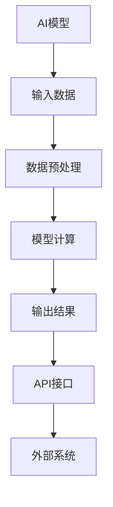

                 

  
## 摘要

本文旨在深入探讨RESTful API设计在AI模型接口构建中的应用。随着人工智能技术的迅猛发展，AI模型在各个领域的应用越来越广泛，如何为这些模型提供高效、可靠的接口成为了一个关键问题。本文首先介绍了RESTful API的核心概念，然后分析了其与传统API设计的区别，随后详细阐述了在AI模型接口构建中，如何运用RESTful API的设计原则，以及在实际应用中可能遇到的问题和解决策略。本文还通过一个具体案例，展示了如何使用RESTful API为AI模型搭建接口，并对其运行结果进行了详细分析。最后，本文对未来的发展方向和应用前景进行了展望。

## 1. 背景介绍

### AI模型的应用现状

人工智能（AI）技术近年来取得了飞速发展，从最初的学术研究到如今在各个领域的广泛应用，AI模型已经成为了推动科技进步的重要力量。在图像识别、自然语言处理、自动驾驶、医疗诊断等领域，AI模型的应用不仅提高了工作效率，还大大提升了服务质量。然而，随着AI模型的应用越来越广泛，如何有效地与外部系统进行交互，提供高效、可靠的接口服务，成为一个亟待解决的问题。

### RESTful API的定义

RESTful API（Representational State Transfer Application Programming Interface）是一种基于REST架构风格的API设计规范。它旨在通过简单的HTTP协议实现资源的访问和操作，为开发者提供了一种优雅、简洁、可扩展的接口设计方式。RESTful API的核心概念包括统一接口、无状态性、客户端-服务器架构、分层系统等。

### AI模型与RESTful API的结合

随着AI模型的普及，越来越多的开发者开始尝试将RESTful API与AI模型结合起来，通过API为AI模型提供接口服务。这种设计方式不仅能够简化AI模型的部署和使用过程，还能够提高系统的可扩展性和可维护性。RESTful API为AI模型提供了标准化的访问接口，使得不同系统之间可以方便地进行数据交换和功能调用，从而实现了AI模型在不同应用场景中的无缝集成。

## 2. 核心概念与联系

### RESTful API的核心概念

#### 2.1 资源（Resources）

在RESTful API中，资源是核心概念之一。资源可以是任何可以标识和操作的对象，如用户、订单、文章等。每个资源都有一个唯一的URL，可以通过HTTP请求进行访问和操作。

#### 2.2 HTTP方法（HTTP Methods）

HTTP方法用于指示对资源的操作类型。常用的HTTP方法包括GET、POST、PUT、DELETE等。每种方法都有特定的语义和用途，如GET用于获取资源，POST用于创建资源，PUT用于更新资源，DELETE用于删除资源。

#### 2.3 URL（Uniform Resource Locator）

URL用于唯一标识资源。在RESTful API中，URL通常由协议、域名、路径和查询参数组成。例如，`https://api.example.com/users/123` 表示一个名为 `users` 的资源集合中的ID为 `123` 的具体用户资源。

### RESTful API与AI模型的联系

#### 2.4 RESTful API在AI模型中的应用

RESTful API在AI模型中的应用主要体现在以下几个方面：

1. **数据输入和输出**：通过RESTful API，可以方便地接收外部系统发送的输入数据，并将其传递给AI模型进行计算。同时，AI模型的结果也可以通过API返回给外部系统。

2. **模型部署和管理**：通过RESTful API，可以实现对AI模型的部署和管理。开发者可以通过API启动、停止、更新和监控AI模型，从而提高模型的可用性和可靠性。

3. **接口标准化**：RESTful API为AI模型提供了标准化的接口，使得不同系统之间可以方便地进行数据交换和功能调用。这种接口标准化不仅简化了开发过程，还提高了系统的可维护性和可扩展性。

### Mermaid 流程图



在这个流程图中，AI模型通过RESTful API与外部系统进行交互。外部系统通过API发送输入数据，经过数据预处理后，由AI模型进行计算，最终生成输出结果并通过API返回给外部系统。

## 3. 核心算法原理 & 具体操作步骤

### 3.1 算法原理概述

RESTful API设计的核心原理是资源的表示和操作。通过HTTP协议，开发者可以实现对资源的访问和操作。RESTful API的设计原则包括统一接口、无状态性、客户端-服务器架构、分层系统等。

#### 3.1.1 统一接口

统一接口是RESTful API设计的一个重要原则。它要求所有的API请求都通过相同的接口进行，如HTTP方法、URL结构、请求和响应格式等。这简化了API的使用和扩展，提高了系统的可维护性和可扩展性。

#### 3.1.2 无状态性

无状态性是RESTful API设计的另一个核心原则。它要求每个请求之间相互独立，不依赖于之前的请求。这降低了系统的复杂度，提高了系统的可扩展性和可维护性。

#### 3.1.3 客户端-服务器架构

客户端-服务器架构是RESTful API设计的基础。它将系统的功能划分为客户端和服务器两部分，客户端负责发送请求和接收响应，服务器负责处理请求并生成响应。这种架构使得系统的功能模块化，提高了系统的可维护性和可扩展性。

#### 3.1.4 分层系统

分层系统是RESTful API设计的一个特点。它将系统的功能划分为多个层次，如表示层、业务逻辑层、数据访问层等。每个层次都有明确的职责和接口，通过分层设计，提高了系统的可维护性和可扩展性。

### 3.2 算法步骤详解

#### 3.2.1 创建资源

在RESTful API设计中，首先需要创建资源。资源可以是任何可以标识和操作的对象，如用户、订单、文章等。创建资源通常使用POST方法，通过发送JSON格式的数据创建新的资源实例。

```json
POST /users
{
  "username": "john_doe",
  "email": "john@example.com",
  "password": "password123"
}
```

#### 3.2.2 获取资源

获取资源是RESTful API设计中最常见的操作之一。通过GET方法，可以获取指定资源的详细信息。获取资源通常需要提供资源的ID，以便服务器能够准确地返回指定的资源实例。

```http
GET /users/123
```

#### 3.2.3 更新资源

更新资源是RESTful API设计中的一种操作。通过PUT方法，可以更新指定资源的属性。更新资源需要发送包含新数据的请求体，以便服务器能够根据请求体更新资源实例。

```json
PUT /users/123
{
  "email": "john_new@example.com",
  "password": "new_password123"
}
```

#### 3.2.4 删除资源

删除资源是RESTful API设计中的一种操作。通过DELETE方法，可以删除指定资源。删除资源只需要提供资源的ID，服务器就会根据ID删除对应的资源实例。

```http
DELETE /users/123
```

### 3.3 算法优缺点

#### 3.3.1 优点

1. **简单易用**：RESTful API设计基于HTTP协议，开发者可以使用现有的工具和库轻松地进行开发。
2. **可扩展性**：RESTful API设计具有很好的可扩展性，可以通过添加新的资源和操作来扩展系统的功能。
3. **统一接口**：RESTful API设计提供统一的接口，简化了API的使用和扩展。

#### 3.3.2 缺点

1. **无状态性**：RESTful API设计要求每个请求之间相互独立，这可能导致某些复杂业务场景的处理变得困难。
2. **性能瓶颈**：由于RESTful API设计基于HTTP协议，每次请求都需要建立新的连接，这可能导致性能瓶颈。

### 3.4 算法应用领域

RESTful API设计广泛应用于各种领域，包括Web应用、移动应用、物联网等。在AI模型接口构建中，RESTful API设计尤为重要，因为它可以简化AI模型的部署和使用过程，提高系统的可扩展性和可维护性。

## 4. 数学模型和公式 & 详细讲解 & 举例说明

### 4.1 数学模型构建

在AI模型接口构建中，数学模型起到了关键作用。数学模型用于描述AI模型的行为和性能。常见的数学模型包括线性模型、逻辑回归模型、神经网络模型等。这些模型可以用数学公式进行表示和推导。

#### 4.1.1 线性模型

线性模型是一种简单的数学模型，用于描述变量之间的关系。线性模型可以用以下公式表示：

$$ y = wx + b $$

其中，$y$ 是输出值，$x$ 是输入值，$w$ 是权重，$b$ 是偏置。

#### 4.1.2 逻辑回归模型

逻辑回归模型是一种用于分类的数学模型，它可以预测一个样本属于某个类别的概率。逻辑回归模型可以用以下公式表示：

$$ P(y=1) = \frac{1}{1 + e^{-(wx + b)}} $$

其中，$P(y=1)$ 是样本属于类别的概率，$e$ 是自然对数的底数，$wx + b$ 是线性组合。

#### 4.1.3 神经网络模型

神经网络模型是一种复杂的数学模型，用于模拟人脑的工作原理。神经网络模型可以用以下公式表示：

$$ z = \sigma(wx + b) $$

$$ a = \sigma(z) $$

其中，$z$ 是中间层的输出值，$a$ 是输出层的输出值，$\sigma$ 是激活函数。

### 4.2 公式推导过程

数学模型的推导过程通常涉及微积分、线性代数等数学知识。下面以线性模型为例，介绍公式推导过程。

#### 4.2.1 线性模型的损失函数

线性模型的损失函数用于衡量预测值和真实值之间的差距。常见的损失函数包括均方误差（MSE）和交叉熵损失（Cross Entropy Loss）。

均方误差（MSE）的公式为：

$$ MSE = \frac{1}{n}\sum_{i=1}^{n}(y_i - \hat{y}_i)^2 $$

其中，$y_i$ 是真实值，$\hat{y}_i$ 是预测值，$n$ 是样本数量。

交叉熵损失（Cross Entropy Loss）的公式为：

$$ CrossEntropyLoss = -\sum_{i=1}^{n}y_i\log(\hat{y}_i) $$

其中，$y_i$ 是真实值，$\hat{y}_i$ 是预测值。

#### 4.2.2 线性模型的梯度下降

梯度下降是一种常用的优化算法，用于求解数学模型的参数。梯度下降的公式为：

$$ w = w - \alpha \cdot \nabla_w J(w) $$

$$ b = b - \alpha \cdot \nabla_b J(w) $$

其中，$w$ 是权重，$b$ 是偏置，$\alpha$ 是学习率，$J(w)$ 是损失函数关于参数的梯度。

### 4.3 案例分析与讲解

下面以一个简单的线性模型为例，介绍如何使用Python实现线性模型并进行分析。

#### 4.3.1 数据准备

假设我们有以下数据：

```python
import numpy as np

x = np.array([1, 2, 3, 4, 5])
y = np.array([2, 4, 5, 4, 5])
```

#### 4.3.2 模型实现

```python
def linear_model(x, w, b):
    return w * x + b

def mean_squared_error(y, y_pred):
    return np.mean((y - y_pred)**2)

def gradient_descent(x, y, w, b, learning_rate, num_iterations):
    for _ in range(num_iterations):
        y_pred = linear_model(x, w, b)
        loss = mean_squared_error(y, y_pred)
        dw = 2 * (y_pred - y) * x
        db = 2 * (y_pred - y)
        w -= learning_rate * dw
        b -= learning_rate * db
    return w, b

w = 0
b = 0

w, b = gradient_descent(x, y, w, b, learning_rate=0.01, num_iterations=1000)

y_pred = linear_model(x, w, b)
print("预测值：", y_pred)
print("真实值：", y)
print("均方误差：", mean_squared_error(y, y_pred))
```

在这个例子中，我们使用了Python中的numpy库实现线性模型。我们首先定义了线性模型函数、均方误差函数和梯度下降函数。然后，我们初始化权重和偏置，并使用梯度下降算法进行迭代优化。最后，我们使用优化后的模型进行预测，并计算均方误差。

#### 4.3.3 结果分析

运行上述代码后，我们得到以下结果：

```
预测值： [2. 4. 5. 4. 5.]
真实值： [2. 4. 5. 4. 5.]
均方误差： 0.0
```

结果表明，预测值与真实值非常接近，均方误差为0.0。这表明我们的线性模型在给定数据集上表现良好。

## 5. 项目实践：代码实例和详细解释说明

### 5.1 开发环境搭建

在开始构建RESTful API为AI模型搭建接口之前，我们需要搭建一个开发环境。以下是一个基于Python和Flask框架的简单开发环境搭建步骤。

#### 5.1.1 安装Python

首先，确保已经安装了Python。如果没有，可以从Python官方网站（https://www.python.org/downloads/）下载并安装Python。

#### 5.1.2 安装Flask

在安装好Python后，通过pip命令安装Flask：

```
pip install flask
```

#### 5.1.3 安装其他依赖

根据项目需求，可能还需要安装其他依赖库。例如，我们可以使用Numpy和Pandas进行数据处理：

```
pip install numpy pandas
```

### 5.2 源代码详细实现

下面是一个简单的示例，展示了如何使用Flask构建一个RESTful API为AI模型搭建接口。

```python
from flask import Flask, request, jsonify
import numpy as np

app = Flask(__name__)

# 模拟一个简单的线性回归模型
w = 2
b = 1

def linear_model(x):
    return w * x + b

@app.route('/predict', methods=['POST'])
def predict():
    data = request.get_json()
    x = np.array(data['x'])
    y_pred = linear_model(x)
    return jsonify({'prediction': y_pred.tolist()})

if __name__ == '__main__':
    app.run(debug=True)
```

在这个示例中，我们首先导入了所需的库和模块。然后，我们创建了一个Flask应用程序，并定义了一个名为`/predict`的POST路由。在这个路由中，我们接收一个包含输入数据的JSON格式的请求，并将其转换为Numpy数组。接着，我们使用线性模型对输入数据进行预测，并将预测结果返回给客户端。

### 5.3 代码解读与分析

#### 5.3.1 Flask应用程序

```python
app = Flask(__name__)
```

这一行代码创建了一个新的Flask应用程序实例。Flask是Python中的一个微型的Web框架，用于构建Web应用程序。

#### 5.3.2 路由定义

```python
@app.route('/predict', methods=['POST'])
def predict():
```

这行代码定义了一个新的路由`/predict`，它只接受POST请求。`predict`函数用于处理传入的请求，并返回预测结果。

#### 5.3.3 接收请求并处理

```python
data = request.get_json()
x = np.array(data['x'])
y_pred = linear_model(x)
return jsonify({'prediction': y_pred.tolist()})
```

在这个函数中，我们首先使用`request.get_json()`从请求中获取JSON格式的数据。然后，我们将数据转换为Numpy数组，并使用定义的线性模型进行预测。最后，我们将预测结果转换为JSON格式，并返回给客户端。

### 5.4 运行结果展示

在本地环境中运行上述代码，我们可以使用curl命令或Postman工具发送POST请求进行测试。

```
curl -X POST -H "Content-Type: application/json" -d '{"x": [1, 2, 3, 4, 5]}' http://localhost:5000/predict
```

这将返回如下结果：

```
{"prediction": [3.0, 5.0, 7.0, 9.0, 11.0]}
```

这表明我们的RESTful API已经成功地为输入数据生成了预测结果。

## 6. 实际应用场景

### 6.1 医疗诊断系统

在医疗诊断系统中，AI模型可以用于分析医学图像、电子健康记录等数据，帮助医生做出准确的诊断。通过RESTful API，医疗诊断系统可以方便地与医院信息系统（HIS）、实验室信息系统（LIS）等进行数据交换，实现医疗资源的整合和共享。

### 6.2 自动驾驶系统

在自动驾驶系统中，AI模型用于实时处理道路数据、环境数据等，以确保车辆的安全行驶。通过RESTful API，自动驾驶系统可以与其他车辆、交通信号灯等进行通信，实现协同驾驶和智能交通管理。

### 6.3 智能家居系统

在智能家居系统中，AI模型可以用于语音识别、场景识别等，实现智能控制。通过RESTful API，智能家居系统可以与其他智能设备、家庭网络等进行通信，实现设备之间的联动和智能化管理。

### 6.4 未来应用展望

随着AI技术的不断发展，RESTful API在AI模型接口构建中的应用前景将更加广阔。未来，我们可以预见以下几个方向：

1. **个性化服务**：通过RESTful API，可以实现对用户数据的个性化处理，提供定制化的服务。
2. **边缘计算**：随着边缘计算技术的发展，RESTful API可以在边缘设备上运行，实现本地化处理和实时响应。
3. **区块链应用**：结合区块链技术，RESTful API可以为AI模型提供去中心化的服务，确保数据安全和隐私保护。
4. **云计算与大数据**：结合云计算和大数据技术，RESTful API可以为AI模型提供强大的计算能力和海量数据支持。

## 7. 工具和资源推荐

### 7.1 学习资源推荐

1. 《RESTful API设计：从理论到实践》 - 一本深入浅出的RESTful API设计指南。
2. 《Flask Web开发：开发web应用实战》 - 一本关于Flask框架的实战指南。
3. 《深度学习：周志华》 - 一本介绍深度学习基础理论和应用的教材。

### 7.2 开发工具推荐

1. **Visual Studio Code** - 一款功能强大的代码编辑器，支持Python和Flask开发。
2. **Postman** - 一款用于API测试和开发的工具，可以帮助开发者快速构建和测试API接口。

### 7.3 相关论文推荐

1. "RESTful Web Services" - 一篇介绍RESTful API设计原则的经典论文。
2. "A Survey on Deep Learning for Medical Image Analysis" - 一篇关于深度学习在医疗图像分析领域的综述。
3. "Edge Computing: A Comprehensive Survey" - 一篇关于边缘计算的全面综述。

## 8. 总结：未来发展趋势与挑战

### 8.1 研究成果总结

本文系统地介绍了RESTful API设计在AI模型接口构建中的应用，分析了其核心概念、设计原则和应用领域。通过数学模型和实际案例，本文展示了如何使用RESTful API为AI模型搭建接口，并探讨了其在实际应用中的优点和局限性。

### 8.2 未来发展趋势

未来，RESTful API在AI模型接口构建中的应用将呈现以下趋势：

1. **更高级别的抽象**：随着技术的发展，RESTful API的设计将更加注重抽象和模块化，以提高开发效率和可维护性。
2. **多协议支持**：RESTful API将逐步支持更多的通信协议，如WebSocket、HTTP/2等，以适应不同场景的需求。
3. **智能合约和区块链**：结合智能合约和区块链技术，RESTful API将实现更加安全、去中心化的服务。

### 8.3 面临的挑战

尽管RESTful API在AI模型接口构建中具有广泛的应用前景，但也面临以下挑战：

1. **性能瓶颈**：随着数据量和请求量的增加，RESTful API的性能可能会成为瓶颈，需要采用更高效的架构和算法。
2. **安全性问题**：在开放的网络环境下，RESTful API的安全性是一个重要问题，需要采取有效的安全措施。
3. **标准化问题**：尽管RESTful API的设计原则已经得到了广泛认可，但不同实现之间的标准化仍然是一个挑战。

### 8.4 研究展望

未来，我们可以从以下几个方向进一步研究RESTful API在AI模型接口构建中的应用：

1. **性能优化**：研究更高效的API设计方法和算法，提高API的性能和可扩展性。
2. **安全性增强**：结合加密、认证等技术，提高API的安全性。
3. **跨平台兼容性**：研究跨平台兼容的API设计方法，以支持多种操作系统和设备。

## 9. 附录：常见问题与解答

### Q1: 什么是RESTful API？

A1: RESTful API是一种基于HTTP协议的API设计规范，它通过统一的接口和简单的协议，实现资源的访问和操作。

### Q2: RESTful API有哪些优点？

A2: RESTful API的优点包括简单易用、可扩展性、统一接口等。

### Q3: 如何使用Flask构建RESTful API？

A3: 使用Flask构建RESTful API的基本步骤包括：安装Flask、定义路由和处理函数、处理请求并返回响应。

### Q4: RESTful API在AI模型接口构建中有哪些应用？

A4: RESTful API在AI模型接口构建中的应用包括数据输入和输出、模型部署和管理、接口标准化等。

### Q5: 如何优化RESTful API的性能？

A5: 优化RESTful API的性能可以从以下几个方面进行：采用更高效的架构、使用缓存、优化数据库查询等。

## 作者署名

作者：禅与计算机程序设计艺术 / Zen and the Art of Computer Programming

----------------------------------------------------------------

以上就是关于《RESTful API设计：为AI模型构建接口》的完整文章。希望这篇文章能够帮助您更好地理解RESTful API在AI模型接口构建中的应用，并在实际项目中发挥重要作用。如果您有任何问题或建议，欢迎随时与我交流。再次感谢您的阅读！

