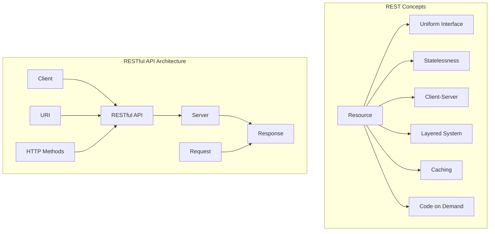

                 

 关键词：RESTful API设计，Web服务，架构，可扩展性，API设计原则，最佳实践，安全性，性能优化

> 摘要：本文将深入探讨RESTful API设计的核心原则和最佳实践，解释如何构建可扩展、安全且高效的Web服务。我们将分析REST架构风格的关键概念，介绍API设计的基本原则，并探讨如何平衡性能与可扩展性。此外，本文还将提供实际项目实践和代码实例，以帮助读者更好地理解API设计的实际应用。

## 1. 背景介绍

随着互联网技术的迅猛发展，Web服务成为了现代软件开发中的核心组成部分。RESTful API作为一种广泛采用的架构风格，在Web服务的构建中扮演了至关重要的角色。REST（Representational State Transfer）是由Roy Fielding提出的一种架构风格，它强调通过统一接口和标准化协议来构建分布式系统。RESTful API设计的目标是创建易于使用、可扩展且性能卓越的服务，以满足不断增长的互联网应用需求。

在过去几年中，RESTful API在许多领域都得到了广泛的应用，例如社交媒体、电子商务、物联网和移动应用等。这些API使得不同的系统和服务能够无缝交互，促进了数据和服务的共享。随着API的普及，对其设计的关注也日益增加。良好的API设计不仅能够提高开发效率，还能够降低维护成本，提升用户体验。

本文将围绕RESTful API设计展开，详细讨论其核心概念、设计原则、最佳实践以及实际应用。通过本文的阅读，读者将能够获得构建高质量RESTful API的深入理解和实用技能。

## 2. 核心概念与联系

### 2.1 REST架构风格的基本概念

REST（Representational State Transfer）是一种架构风格，它定义了一套原则和约束，用于设计分布式超媒体系统。以下是一些REST架构风格中的核心概念：

- **资源（Resource）**：资源是REST架构中的基本构建块，它是可以标识和操作的数据实体。例如，一个用户、一个订单或一个博客文章都可以被视为资源。

- **统一接口（Uniform Interface）**：REST通过提供统一的接口来简化系统的设计和实现。这些接口包括GET、POST、PUT、DELETE等HTTP方法，以及URI（统一资源标识符）。

- **无状态（Statelessness）**：REST要求服务器不保持客户端的状态信息。每次请求都应该包含处理请求所需的所有信息，确保系统的可扩展性和可维护性。

- **客户端-服务器（Client-Server）**：客户端（通常是用户或应用程序）通过发送请求与服务器交互，服务器处理请求并返回响应。这种模式使得系统可解耦，便于扩展和维护。

- **分层系统（Layered System）**：REST架构中的系统层次结构允许客户端和服务器之间通过中介层（如代理服务器或网关）进行通信，增加了系统的透明度和安全性。

- **缓存（Caching）**：REST支持在客户端和服务器之间缓存响应，从而提高系统的性能和响应速度。

- **按需编码（Code on Demand）**：REST允许通过按需下载和执行代码来扩展功能，例如，JSON Web Tokens（JWT）就利用了这一特点。

### 2.2 RESTful API设计的核心概念原理和架构

下面是一个Mermaid流程图，展示了RESTful API设计的关键概念和架构：



### 2.3 RESTful API设计与传统Web服务的区别

与传统Web服务相比，RESTful API设计具有以下几个显著特点：

- **架构风格**：传统Web服务通常基于SOAP（Simple Object Access Protocol）等协议，而RESTful API则基于HTTP协议。

- **简洁性**：RESTful API强调简单和易于理解的设计原则，使其在开发和维护过程中更加高效。

- **可扩展性**：RESTful API通过统一接口和标准化协议，使得系统更容易扩展和维护。

- **灵活性**：RESTful API支持多种数据格式（如JSON、XML），便于与其他系统和服务集成。

- **无状态性**：RESTful API的无状态特性提高了系统的性能和可靠性。

- **安全性**：尽管RESTful API可能面临安全挑战，但通过适当的设计和实施，可以实现较高的安全性。

## 3. 核心算法原理 & 具体操作步骤

### 3.1 算法原理概述

RESTful API设计遵循一组核心原则，这些原则决定了API的性能、可扩展性和易用性。以下是这些核心原则的概述：

1. **资源导向**：API设计应以资源为中心，确保每个操作都与一个具体的资源相关联。

2. **统一接口**：使用标准的HTTP方法（GET、POST、PUT、DELETE）来实现资源的创建、读取、更新和删除。

3. **状态lessness**：确保服务器不存储客户端的状态信息，每次请求都包含处理所需的所有信息。

4. **无存储限制**：尽量不依赖服务器端的存储，以减少维护和扩展的复杂性。

5. **响应时间最小化**：通过优化服务器端代码、数据库查询和缓存机制，确保API响应时间尽可能短。

6. **安全性**：实施适当的安全措施，如身份验证、授权和数据加密，以保护API免受攻击。

7. **可扩展性**：设计API时考虑未来的扩展性，确保可以轻松添加新功能和服务。

### 3.2 算法步骤详解

下面是构建RESTful API的核心步骤：

1. **定义资源**：首先，确定API中的主要资源，例如用户、订单、产品等。为每个资源分配一个唯一的URI。

2. **设计URL**：确保URL简洁且具有描述性，反映资源的结构和关系。遵循RESTful命名约定，使用复数形式表示集合资源。

3. **确定HTTP方法**：为每个资源操作选择适当的HTTP方法。例如，使用GET获取资源列表，使用POST创建新资源，使用PUT更新资源，使用DELETE删除资源。

4. **处理请求和响应**：编写服务器端代码，处理传入的HTTP请求，并生成相应的响应。确保响应遵循RESTful原则，包括状态码、内容类型和头信息。

5. **实现数据验证和转换**：确保请求数据的完整性和有效性，将请求数据转换为适合服务器处理的格式，如JSON。

6. **实现身份验证和授权**：确保只有授权用户可以访问受保护的资源，可以使用JWT、OAuth等机制。

7. **优化性能**：通过缓存、负载均衡、数据库优化等技术提高API的性能。

8. **测试和文档**：编写API测试用例，确保API的稳定性和可靠性。提供详细的API文档，帮助开发者理解和使用API。

### 3.3 算法优缺点

**优点**：

- **简单易用**：遵循统一的接口和标准化的协议，使得API设计更加简洁和易于使用。

- **可扩展性**：通过REST架构风格，系统可以轻松扩展，添加新功能和服务。

- **高性能**：无状态性和按需编码特性提高了系统的性能和响应速度。

- **跨平台**：基于HTTP协议，可以轻松与其他系统和服务集成，支持多种数据格式。

**缺点**：

- **安全性**：尽管可以通过适当的设计和实施提高安全性，但RESTful API仍然面临一些安全挑战。

- **缺乏强制性的标准化**：虽然有许多最佳实践，但没有强制性的标准化规范。

### 3.4 算法应用领域

RESTful API在许多领域得到了广泛应用，以下是几个典型的应用场景：

- **Web应用**：在Web应用中，RESTful API用于实现前后端分离，便于开发和维护。

- **移动应用**：移动应用通过RESTful API与服务器交互，获取数据和更新数据。

- **物联网（IoT）**：RESTful API用于连接和管理物联网设备。

- **微服务架构**：在微服务架构中，RESTful API用于不同服务之间的通信和协作。

- **电子商务**：电子商务平台通过RESTful API实现产品管理、订单处理和支付功能。

## 4. 数学模型和公式 & 详细讲解 & 举例说明

### 4.1 数学模型构建

在RESTful API设计中，可以构建以下数学模型来衡量API的性能和可扩展性：

- **响应时间（Response Time）**：衡量服务器处理请求并返回响应所需的时间。用\( T \)表示，单位为毫秒（ms）。

- **吞吐量（Throughput）**：衡量服务器在单位时间内处理请求的数量。用\( Q \)表示，单位为请求/秒（req/s）。

- **扩展性（Scalability）**：衡量系统在负载增加时性能下降的程度。用\( S \)表示，是一个相对指标。

### 4.2 公式推导过程

为了构建上述数学模型，我们可以使用以下公式：

\[ T = \frac{1}{Q} + C \]

其中，\( C \)表示系统中的固定延迟（如网络延迟、处理延迟等），是一个常数。

根据扩展性的定义，我们可以得到：

\[ S = \frac{T_0}{T} \]

其中，\( T_0 \)表示在初始负载下的响应时间。

### 4.3 案例分析与讲解

假设我们有一个RESTful API，初始负载下响应时间为500ms，吞吐量为100req/s。当负载增加到200req/s时，响应时间增加到800ms。我们可以使用上述公式计算扩展性：

\[ S = \frac{500}{800} = 0.625 \]

这意味着，在负载增加到两倍时，系统的性能下降了37.5%。

### 4.4 实际应用

在构建RESTful API时，可以通过以下实际应用来优化性能和可扩展性：

- **缓存**：使用缓存减少数据库查询次数，降低响应时间。

- **负载均衡**：通过负载均衡器分配请求，确保服务器资源得到充分利用。

- **数据库优化**：优化数据库查询，使用索引、分库分表等技术提高查询速度。

- **代码优化**：优化服务器端代码，减少不必要的计算和资源消耗。

- **服务拆分**：将大型服务拆分为小型服务，提高系统的可扩展性和可维护性。

## 5. 项目实践：代码实例和详细解释说明

### 5.1 开发环境搭建

为了演示如何构建RESTful API，我们将使用以下开发环境：

- **编程语言**：Python
- **框架**：Flask
- **数据库**：SQLite

安装所需的Python库：

```bash
pip install flask
pip install flask_sqlalchemy
```

### 5.2 源代码详细实现

以下是一个简单的RESTful API示例，用于管理用户信息：

```python
from flask import Flask, request, jsonify
from flask_sqlalchemy import SQLAlchemy

app = Flask(__name__)
app.config['SQLALCHEMY_DATABASE_URI'] = 'sqlite:///users.db'
db = SQLAlchemy(app)

class User(db.Model):
    id = db.Column(db.Integer, primary_key=True)
    username = db.Column(db.String(80), unique=True, nullable=False)
    email = db.Column(db.String(120), unique=True, nullable=False)

@app.route('/users', methods=['GET', 'POST'])
def users():
    if request.method == 'GET':
        users = User.query.all()
        return jsonify({'users': [user.username for user in users]})
    elif request.method == 'POST':
        data = request.get_json()
        new_user = User(username=data['username'], email=data['email'])
        db.session.add(new_user)
        db.session.commit()
        return jsonify({'message': 'User created successfully.'})

@app.route('/users/<int:user_id>', methods=['GET', 'PUT', 'DELETE'])
def user(user_id):
    if request.method == 'GET':
        user = User.query.get_or_404(user_id)
        return jsonify({'username': user.username, 'email': user.email})
    elif request.method == 'PUT':
        data = request.get_json()
        user = User.query.get_or_404(user_id)
        user.username = data['username']
        user.email = data['email']
        db.session.commit()
        return jsonify({'message': 'User updated successfully.'})
    elif request.method == 'DELETE':
        user = User.query.get_or_404(user_id)
        db.session.delete(user)
        db.session.commit()
        return jsonify({'message': 'User deleted successfully.'})

if __name__ == '__main__':
    db.create_all()
    app.run(debug=True)
```

### 5.3 代码解读与分析

上述代码实现了以下功能：

- **用户模型（User）**：定义了用户的基本属性，如用户名和电子邮件地址，并使用SQLAlchemy进行数据库操作。

- **用户列表路由（users）**：处理GET和POST请求，用于获取所有用户信息或创建新用户。

- **单个用户路由（user）**：处理GET、PUT和DELETE请求，用于获取单个用户信息、更新用户信息和删除用户。

### 5.4 运行结果展示

以下是一个简单的运行示例：

- **创建用户**：

```bash
curl -X POST -H "Content-Type: application/json" -d '{"username": "alice", "email": "alice@example.com"}' http://127.0.0.1:5000/users
```

响应：

```json
{
  "message": "User created successfully."
}
```

- **获取用户列表**：

```bash
curl -X GET http://127.0.0.1:5000/users
```

响应：

```json
{
  "users": ["alice"]
}
```

- **获取单个用户信息**：

```bash
curl -X GET http://127.0.0.1:5000/users/1
```

响应：

```json
{
  "username": "alice",
  "email": "alice@example.com"
}
```

- **更新用户信息**：

```bash
curl -X PUT -H "Content-Type: application/json" -d '{"username": "alice_updated", "email": "alice_updated@example.com"}' http://127.0.0.1:5000/users/1
```

响应：

```json
{
  "message": "User updated successfully."
}
```

- **删除用户**：

```bash
curl -X DELETE http://127.0.0.1:5000/users/1
```

响应：

```json
{
  "message": "User deleted successfully."
}
```

## 6. 实际应用场景

### 6.1 社交媒体平台

社交媒体平台如Facebook、Twitter和LinkedIn等广泛使用RESTful API，为开发者提供访问用户数据、发布内容、管理好友关系等功能。这些API使得第三方应用能够无缝集成到社交媒体平台上，提升了用户体验和平台的生态系统。

### 6.2 电子商务平台

电子商务平台如Amazon、Ebay和Alibaba等使用RESTful API实现产品管理、订单处理、支付和物流等功能。这些API使得商家能够快速发布新产品、处理订单和优化库存管理，提高了运营效率。

### 6.3 物联网（IoT）

物联网设备通过RESTful API与云平台进行通信，实现数据收集、分析和远程监控等功能。例如，智能家居设备可以通过API与云平台交互，实现远程控制和自动化管理。

### 6.4 微服务架构

微服务架构中，不同的服务通过RESTful API进行通信和协作，实现系统的模块化和分布式。例如，一个电子商务系统的订单服务、库存服务和支付服务可以独立部署，通过API实现数据同步和业务流程管理。

### 6.5 移动应用

移动应用通过RESTful API与服务器进行数据交互，实现用户认证、内容获取和更新等功能。这种模式使得移动应用可以轻松实现前后端分离，提高开发效率和用户体验。

## 7. 工具和资源推荐

### 7.1 学习资源推荐

- **《RESTful API设计最佳实践》**：这是一本全面的指南，涵盖了RESTful API设计的核心原则和实践。
- **REST API设计指南**：由API设计专家编写的免费在线资源，提供了大量实用的设计和最佳实践。
- **REST API设计模式**：一个详细的博客系列，介绍了各种常见的API设计模式。

### 7.2 开发工具推荐

- **Postman**：一个流行的API开发工具，用于测试和调试API。
- **Swagger**：一个用于API设计和文档生成的开源工具，支持生成交互式文档和代码。
- **API Blueprint**：一个用于描述API的文本格式，支持生成文档和代码。

### 7.3 相关论文推荐

- **"Representational State Transfer (REST)"**：由Roy Fielding发表的论文，详细介绍了REST架构风格。
- **"RESTful Web Services"**：由Leonard Richardson和Sam Ruby合著的论文，探讨了RESTful Web服务的实践和原则。
- **"Designing Hypermedia Applications"**：由Fielding等作者合著的论文，介绍了如何设计基于HATEOAS（Hypermedia as the Engine of Application State）的应用。

## 8. 总结：未来发展趋势与挑战

### 8.1 研究成果总结

近年来，RESTful API设计在理论上和实践上取得了显著成果。通过核心原则的贯彻和实践，API的设计变得更加简洁、可扩展且易于使用。同时，随着微服务架构、容器化和云服务的普及，RESTful API在分布式系统中的应用变得越来越广泛。研究还发现，通过合理的设计和优化，RESTful API在性能、安全性和可扩展性方面具有显著的提升。

### 8.2 未来发展趋势

- **自动化API设计**：未来的发展趋势之一是自动化API设计，通过工具和框架自动生成API文档和代码，提高开发效率。
- **API安全**：随着API的普及，安全问题变得越来越重要。未来的研究将重点放在API安全性的增强，如引入新的加密算法、安全协议和认证机制。
- **API性能优化**：随着负载的增加，API的性能优化将受到更多关注。研究将集中在数据库优化、负载均衡、缓存技术和代码优化等方面。
- **API经济**：随着API生态系统的成熟，API经济将成为新的商业模式。企业和开发者将通过API交换数据和服务，实现共赢。

### 8.3 面临的挑战

- **API复杂性**：随着API功能的不断增加，API的复杂性也在增加。如何简化API设计，提高易用性，是一个重要的挑战。
- **API安全性**：API的安全性仍然是一个巨大的挑战。随着攻击手段的升级，如何确保API的安全，防止数据泄露和攻击，需要更多的研究。
- **API性能优化**：在高并发场景下，如何保证API的性能，避免系统崩溃，是一个亟待解决的问题。

### 8.4 研究展望

未来的研究将重点关注以下几个方向：

- **自动化API设计**：通过机器学习和自动化工具，自动生成高质量的API设计文档和代码。
- **API监控与优化**：实时监控API的性能和负载，自动调整和优化系统配置。
- **API安全**：研究新型安全机制，提高API的安全性，防止数据泄露和攻击。
- **API标准化**：制定更严格、更统一的API设计标准，提高API的互操作性和兼容性。

通过持续的研究和创新，RESTful API设计将在未来的互联网应用中发挥更大的作用，为开发者提供更高效、更安全、更可扩展的解决方案。

## 9. 附录：常见问题与解答

### 9.1 什么是RESTful API？

RESTful API是一种基于REST架构风格的Web服务接口，它使用标准的HTTP方法和URL来访问和操作资源，遵循统一的接口和状态lessness原则，易于使用和扩展。

### 9.2 RESTful API与SOAP API的区别是什么？

RESTful API基于HTTP协议，使用JSON或XML等轻量级数据格式，强调简洁性和灵活性。而SOAP API基于XML协议，通常用于企业级集成，具有严格的规范和复杂的消息格式。

### 9.3 RESTful API设计有哪些最佳实践？

最佳实践包括：使用统一的接口、确保无状态性、设计简洁的URL、遵循RESTful命名约定、实现数据验证和转换、优化性能、确保安全性等。

### 9.4 如何测试RESTful API？

可以使用工具如Postman、Swagger等测试RESTful API，编写单元测试和集成测试，确保API的稳定性和可靠性。

### 9.5 RESTful API如何实现安全性？

可以通过身份验证（如OAuth2、JWT）、授权、数据加密、访问控制列表（ACL）等手段实现RESTful API的安全性。

### 9.6 RESTful API性能优化有哪些方法？

可以通过缓存、负载均衡、数据库优化、代码优化等方法来提高RESTful API的性能。

### 9.7 RESTful API设计在哪些领域得到了广泛应用？

RESTful API广泛应用于Web应用、移动应用、物联网（IoT）、微服务架构和电子商务等领域。

