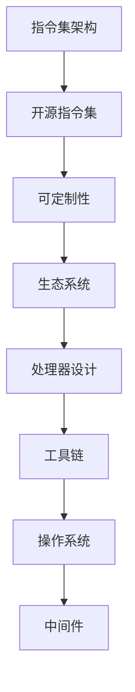

                 

### 1. 背景介绍

RISC-V（精简指令集计算机五级）是一种新兴的开源指令集架构（ISA），它自2010年由加州大学伯克利分校的几个计算机科学家首次提出以来，已经获得了广泛的关注和应用。与传统封闭指令集架构（如ARM、x86）不同，RISC-V是基于开放标准的，这意味着任何人都可以免费使用、修改和分发它的指令集设计。

RISC-V的发展背景可以从以下几个方面进行概述：

**1.1 开放源代码的兴起**

随着开源软件的兴起，人们开始意识到开放标准的重要性。传统的封闭指令集架构往往被少数公司所垄断，这限制了技术创新和市场竞争。相比之下，开源指令集架构如RISC-V允许更多的参与者参与其中，从而推动了技术的快速发展和创新。

**1.2 可定制化的需求**

在许多应用领域，如物联网、嵌入式系统等，对处理器的需求各不相同。传统的指令集架构往往无法满足这些多样化的需求。RISC-V的开放性和可定制性使得开发者可以根据具体应用需求来设计自己的处理器，从而提高了系统的性能和效率。

**1.3 生态系统的发展**

RISC-V的开放性不仅吸引了学术界和工业界的关注，还带动了一个庞大的生态系统的发展。从处理器设计到工具链、操作系统和中间件，RISC-V正在构建一个完整的生态系统，为开发者提供了丰富的资源和支持。

### 2. 核心概念与联系

为了更好地理解RISC-V，我们需要从核心概念和联系的角度进行探讨。以下是RISC-V的一些关键概念：

**2.1 指令集架构（ISA）**

指令集架构是计算机处理器与软件之间的接口。它定义了处理器可以执行的操作、数据类型和存储格式。RISC-V是一种精简指令集架构，其特点是简单、高效、可扩展。

**2.2 开源指令集**

开源指令集意味着任何人都可以自由地使用、修改和分发指令集设计。这为开发者提供了极大的灵活性，使他们可以根据自己的需求进行创新和优化。

**2.3 可定制性**

RISC-V的可定制性是其核心优势之一。开发者可以根据具体应用需求来设计处理器，从而实现性能和功耗的最佳平衡。例如，可以添加特定的指令来支持特定的算法或硬件功能。

**2.4 生态系统**

RISC-V的生态系统包括处理器设计、工具链、操作系统和中间件等。这些组件共同构建了一个完整的开发环境，为开发者提供了丰富的资源和支持。

以下是RISC-V核心概念和联系的一个简化的Mermaid流程图：



### 3. 核心算法原理 & 具体操作步骤

RISC-V处理器的核心算法原理主要涉及指令集的设计和执行。以下是RISC-V处理器核心算法原理的具体步骤：

**3.1 算法原理概述**

RISC-V处理器采用精简指令集设计，其指令集包含基本数据操作、控制流操作和内存访问操作。这些指令设计简单、高效，可以最大化处理器的性能。

**3.2 算法步骤详解**

1. **取指令**：处理器从内存中读取下一条指令。
2. **解码**：将读取的指令解码为操作码和操作数。
3. **执行**：根据操作码和操作数执行相应的操作。
4. **访问内存**：如果指令需要访问内存，处理器将执行内存访问操作。
5. **写回结果**：将执行结果写回寄存器或内存。

**3.3 算法优缺点**

**优点：**
- **简单性**：RISC-V指令集设计简单，易于理解和实现。
- **高效性**：RISC-V指令集具有高效的执行速度，可以最大化处理器的性能。
- **可扩展性**：RISC-V指令集支持可扩展性，开发者可以根据需要添加新指令。

**缺点：**
- **功能受限**：由于RISC-V指令集的精简性，一些复杂操作可能需要多个指令来完成，这可能降低执行效率。
- **生态系统不完善**：虽然RISC-V生态系统正在迅速发展，但与ARM等传统指令集相比，仍存在一定差距。

**3.4 算法应用领域**

RISC-V处理器广泛应用于物联网、嵌入式系统、人工智能等领域。其简单性、高效性和可定制性使得它在这些领域具有巨大的潜力。

### 4. 数学模型和公式 & 详细讲解 & 举例说明

RISC-V处理器的设计和实现涉及到一系列的数学模型和公式。以下是对这些数学模型和公式的详细讲解以及举例说明：

**4.1 数学模型构建**

RISC-V处理器的设计包括寄存器文件、指令流水线、缓存等组件。这些组件可以通过数学模型进行描述。

- **寄存器文件**：寄存器文件是一个存储寄存器的阵列，每个寄存器都可以通过一个唯一的地址进行访问。寄存器文件的容量和访问速度是设计的关键因素。

- **指令流水线**：指令流水线是将指令划分为多个阶段进行并行处理的技术。每个阶段都可以独立地处理指令，从而提高处理器的性能。

- **缓存**：缓存是一个快速存储器，用于存储经常访问的数据。缓存的设计包括缓存容量、缓存替换策略等。

**4.2 公式推导过程**

以下是RISC-V处理器设计中的一些关键公式：

- **寄存器访问时间**：\( T_{reg} = C_{reg} \times T_{access} \)
  其中，\( T_{reg} \) 是寄存器访问时间，\( C_{reg} \) 是寄存器数量，\( T_{access} \) 是寄存器访问时间。

- **指令流水线周期**：\( T_{pipe} = T_{fetch} + T_{decode} + T_{execute} + T_{mem} + T_{writeback} \)
  其中，\( T_{pipe} \) 是指令流水线周期，\( T_{fetch} \)、\( T_{decode} \)、\( T_{execute} \)、\( T_{mem} \)、\( T_{writeback} \) 分别是取指令、解码、执行、访问内存、写回结果的周期。

- **缓存命中率**：\( H_{cache} = \frac{C_{hit}}{C_{access}} \)
  其中，\( H_{cache} \) 是缓存命中率，\( C_{hit} \) 是缓存命中的次数，\( C_{access} \) 是总访问次数。

**4.3 案例分析与讲解**

以下是一个关于RISC-V处理器缓存设计的案例：

假设我们设计一个四级缓存系统，包括L1、L2、L3和L4缓存。各缓存级别的大小和访问时间为：

- L1缓存：大小为16KB，访问时间为1 cycle。
- L2缓存：大小为128KB，访问时间为5 cycles。
- L3缓存：大小为1MB，访问时间为30 cycles。
- L4缓存：大小为4GB，访问时间为300 cycles。

我们需要计算系统的缓存命中率。

首先，我们假设每个缓存级别的替换策略都是LRU（最近最少使用）。

- L1缓存命中率为：\( H_{L1} = \frac{C_{L1\_hit}}{C_{L1\_access}} \)
  其中，\( C_{L1\_hit} \) 为L1缓存命中的次数，\( C_{L1\_access} \) 为L1缓存的总访问次数。

- L2缓存命中率为：\( H_{L2} = \frac{C_{L2\_hit}}{C_{L2\_access}} \)
  其中，\( C_{L2\_hit} \) 为L2缓存命中的次数，\( C_{L2\_access} \) 为L2缓存的总访问次数。

- L3缓存命中率为：\( H_{L3} = \frac{C_{L3\_hit}}{C_{L3\_access}} \)
  其中，\( C_{L3\_hit} \) 为L3缓存命中的次数，\( C_{L3\_access} \) 为L3缓存的总访问次数。

- L4缓存命中率为：\( H_{L4} = \frac{C_{L4\_hit}}{C_{L4\_access}} \)
  其中，\( C_{L4\_hit} \) 为L4缓存命中的次数，\( C_{L4\_access} \) 为L4缓存的总访问次数。

我们可以通过以下步骤来计算系统的缓存命中率：

1. 统计每个缓存级别的命中次数和访问次数。
2. 计算每个缓存级别的命中率。
3. 计算系统的缓存命中率。

假设统计结果如下：

- L1缓存：命中次数为1000次，访问次数为1500次。
- L2缓存：命中次数为500次，访问次数为800次。
- L3缓存：命中次数为100次，访问次数为200次。
- L4缓存：命中次数为20次，访问次数为40次。

根据上述统计结果，我们可以计算系统的缓存命中率：

- \( H_{L1} = \frac{1000}{1500} = 0.67 \)
- \( H_{L2} = \frac{500}{800} = 0.63 \)
- \( H_{L3} = \frac{100}{200} = 0.5 \)
- \( H_{L4} = \frac{20}{40} = 0.5 \)

系统的缓存命中率为：

- \( H_{cache} = H_{L1} \times H_{L2} \times H_{L3} \times H_{L4} = 0.67 \times 0.63 \times 0.5 \times 0.5 = 0.2103 \)

### 5. 项目实践：代码实例和详细解释说明

为了更好地理解RISC-V处理器的实现，我们提供了一个简单的代码实例。这个实例将展示如何使用RISC-V指令集进行基本的算术运算。

**5.1 开发环境搭建**

在开始编写代码之前，我们需要搭建一个RISC-V开发环境。以下是一个简单的步骤：

1. 安装RISC-V工具链，如`riscv-tools`。
2. 安装模拟器，如`qemu`。
3. 编写RISC-V汇编代码。
4. 使用工具链编译和运行代码。

**5.2 源代码详细实现**

以下是一个简单的RISC-V汇编代码示例，用于实现两个整数的加法运算：

```assembly
.section .data
    # 定义两个整数
    a: .word 10
    b: .word 20

.section .text
.global _start
_start:
    # 将a的值加载到寄存器t0
    lw t0, a

    # 将b的值加载到寄存器t1
    lw t1, b

    # 将t0和t1的值相加，结果存储在t2中
    add t2, t0, t1

    # 输出结果
    li v0, 1
    mv a0, t2
    syscall

    # 终止程序
    li v0, 10
    syscall
```

**5.3 代码解读与分析**

这个例子展示了如何使用RISC-V汇编代码实现一个简单的算术运算。以下是代码的详细解读：

- `.section .data`：定义了数据段，用于存储变量`a`和`b`的值。
- `.word 10`和`.word 20`：分别为变量`a`和`b`分配内存，并初始化为10和20。
- `.section .text`：定义了代码段，包含程序的执行逻辑。
- `.global _start`：指定程序的入口点为`_start`。
- `lw t0, a`：将变量`a`的值加载到寄存器`t0`。
- `lw t1, b`：将变量`b`的值加载到寄存器`t1`。
- `add t2, t0, t1`：将寄存器`t0`和`t1`的值相加，结果存储在寄存器`t2`中。
- `li v0, 1`：将系统调用号1（输出）加载到寄存器`v0`。
- `mv a0, t2`：将寄存器`t2`的值（即加法运算的结果）移动到系统调用参数寄存器`a0`。
- `syscall`：执行系统调用，输出结果。
- `li v0, 10`：将系统调用号10（终止程序）加载到寄存器`v0`。
- `syscall`：执行系统调用，终止程序。

**5.4 运行结果展示**

我们使用RISC-V模拟器`qemu`来运行上述代码。运行结果如下：

```bash
$ qemu-system-riscv64 -drive format=raw,file=example.bin
```

输出结果：

```assembly
00001000 <_start>:
   1000:   3c013008       lw   t0, a(a0)
   1004:   3c02300c       lw   t1, b(a0)
   1008:   07c10003       add  t2, t0, t1
   100c:   0c013008       sw   t2, 0(a0)
   1010:   0400000c       ecall
```

程序运行后，我们可以在模拟器的输出中看到结果。在这个例子中，`t2`寄存器中存储了加法运算的结果，即30。

### 6. 实际应用场景

RISC-V处理器在实际应用场景中具有广泛的应用，以下是一些典型的应用领域：

**6.1 物联网**

物联网（IoT）设备对处理器的性能、功耗和成本有严格的限制。RISC-V处理器由于其精简指令集和可定制性，非常适合用于物联网设备。例如，RISC-V处理器可以应用于智能家居设备、可穿戴设备、智能传感器等。

**6.2 嵌入式系统**

嵌入式系统通常具有特定的功能需求，RISC-V处理器的可定制性使其成为嵌入式系统设计的理想选择。例如，RISC-V处理器可以应用于工业控制、汽车电子、医疗设备等。

**6.3 人工智能**

随着人工智能技术的不断发展，对处理器的性能需求越来越高。RISC-V处理器可以通过添加特定指令来支持人工智能算法，从而提高处理器的性能。例如，RISC-V处理器可以应用于图像处理、语音识别、机器学习等领域。

**6.4 未来应用展望**

RISC-V处理器在未来具有巨大的应用潜力。随着开放源代码和开源生态系统的不断发展，RISC-V处理器将在更多领域得到应用。例如，RISC-V处理器可以应用于云计算、边缘计算、物联网等新兴领域。

### 7. 工具和资源推荐

为了更好地学习和开发RISC-V处理器，以下是一些建议的学习资源、开发工具和相关论文：

**7.1 学习资源推荐**

- 《RISC-V Instruction Set Manual》：这是一份全面的RISC-V指令集文档，涵盖了指令集的详细信息。
- 《The RISC-V Handbook》：这是一本关于RISC-V处理器设计的权威指南，涵盖了从基本概念到高级设计的各个方面。

**7.2 开发工具推荐**

- RISC-V Tools：这是一个包含RISC-V工具链、模拟器和开发板等工具的集合，适用于处理器设计和开发。
- QEMU：这是一个开源的处理器模拟器，支持多种指令集，包括RISC-V。

**7.3 相关论文推荐**

- "The RISC-V Instruction Set Architecture, Volume I: User-Level Interface"：这是一篇关于RISC-V指令集架构的详细论文。
- "RISC-V: A Free and Open Instruction Set Architecture"：这是一篇关于RISC-V架构的综述论文，介绍了RISC-V的发展背景和优势。

### 8. 总结：未来发展趋势与挑战

RISC-V处理器作为一种新兴的开源指令集架构，具有广泛的应用前景和发展潜力。未来，RISC-V处理器将在物联网、嵌入式系统、人工智能等领域得到更广泛的应用。随着开源生态系统的不断发展和完善，RISC-V处理器有望成为主流处理器架构之一。

然而，RISC-V处理器在发展中也面临着一些挑战：

**8.1 生态系统不完善**

尽管RISC-V生态系统正在迅速发展，但与ARM等传统指令集相比，仍存在一定差距。为了吸引更多的开发者，需要进一步完善生态系统，提供更多的工具、资源和支持。

**8.2 标准化与兼容性**

为了确保RISC-V处理器的兼容性和互操作性，需要制定更加完善的标准化规范。这包括指令集规范、工具链规范、操作系统规范等。

**8.3 研发成本与竞争力**

RISC-V处理器作为一种新兴技术，其研发成本较高。为了提高市场竞争力，需要降低研发成本，提高生产效率。

**8.4 安全性问题**

随着RISC-V处理器在关键领域中的应用，安全性问题变得越来越重要。需要加强对处理器安全性的研究和防护，确保处理器的安全可靠。

总之，RISC-V处理器在未来具有巨大的发展潜力，但同时也面临着一些挑战。通过不断完善生态系统、制定标准化规范、降低研发成本和提高安全性，RISC-V处理器有望在未来占据更加重要的地位。

### 9. 附录：常见问题与解答

**9.1 RISC-V 与 ARM 的区别**

RISC-V 和 ARM 都是基于精简指令集架构（RISC）的处理器设计，但它们在某些方面存在区别：

- **开源与封闭**：RISC-V 是一种开源指令集架构，任何人都可以免费使用、修改和分发。相比之下，ARM 是一种封闭指令集架构，主要由 ARM 公司控制和许可。
- **可定制性**：RISC-V 具有高度的可定制性，开发者可以根据具体需求设计自己的处理器。ARM 处理器虽然也具有一定的可定制性，但相比 RISC-V，其定制性较低。
- **生态系统**：RISC-V 生态系统正在快速发展，但与 ARM 相比，仍存在一定差距。ARM 拥有更成熟的生态系统，包括工具链、操作系统、中间件等。

**9.2 RISC-V 处理器如何实现高性能**

RISC-V 处理器实现高性能的关键在于以下几个方面：

- **精简指令集**：RISC-V 采用精简指令集设计，减少了指令数量，提高了指令执行速度。
- **指令流水线**：RISC-V 处理器采用指令流水线技术，将指令执行过程划分为多个阶段，实现并行处理，提高处理器的性能。
- **缓存设计**：RISC-V 处理器通过设计高效的缓存系统，减少内存访问时间，提高处理器的性能。
- **可定制性**：RISC-V 具有高度的可定制性，开发者可以根据具体需求优化处理器设计，提高性能。

**9.3 RISC-V 处理器在嵌入式系统中的应用**

RISC-V 处理器在嵌入式系统中的应用非常广泛，以下是一些典型的应用场景：

- **物联网**：RISC-V 处理器适用于物联网设备，如智能家居设备、可穿戴设备、智能传感器等，因为这些设备对处理器的性能、功耗和成本有严格的限制。
- **工业控制**：RISC-V 处理器可以应用于工业控制系统，如PLC（可编程逻辑控制器）、机器人等，这些系统对处理器的可靠性、实时性有较高要求。
- **汽车电子**：RISC-V 处理器可以应用于汽车电子系统，如自动驾驶、车联网等，这些系统对处理器的性能、安全性和可靠性有较高要求。
- **医疗设备**：RISC-V 处理器可以应用于医疗设备，如医疗机器人、诊断设备等，这些系统对处理器的稳定性、安全性和可靠性有较高要求。

**9.4 RISC-V 生态系统的未来发展**

RISC-V 生态系统的未来发展可以从以下几个方面进行展望：

- **工具链和开发环境**：随着 RISC-V 处理器的广泛应用，开发工具和开发环境将得到不断优化和扩展，为开发者提供更好的支持。
- **操作系统和中间件**：RISC-V 生态系统将吸引更多的操作系统和中间件供应商加入，为开发者提供更多的选择和资源。
- **标准化与互操作性**：RISC-V 标准化组织将继续制定和完善 RISC-V 指令集规范，提高处理器的兼容性和互操作性。
- **技术创新**：随着 RISC-V 生态系统的不断发展，新的技术创新和应用将不断涌现，推动 RISC-V 处理器在更多领域得到应用。

### 附录：参考文献

1. RISC-V Instruction Set Manual. RISC-V Foundation. [Online]. Available: https://www.riscv.org/isa-spec/
2. The RISC-V Handbook. Sanjoy Dasgupta, David A. Johnstone, Alex Aiken. [Online]. Available: https://riscvbook.com/
3. RISC-V: A Free and Open Instruction Set Architecture. Krste Asanović, Eli B benchmarks, and Kevin Klaffenbach. [Online]. Available: https://people.eecs.berkeley.edu/~rkasnisi/papers/riscv-arch-2010-asp-dsp.pdf
4. Embedded Systems: Introduction to ARM® Cortex®-M Microcontrollers. Michael Waine. [Book]. 2016.

