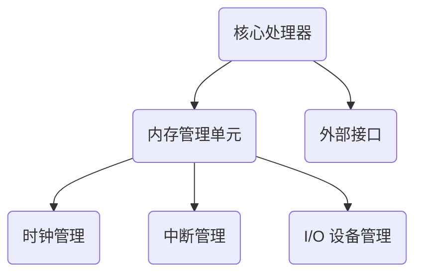

                 

关键词：RISC-V 处理器、开源指令集、计算机架构、硬件设计、处理器性能、生态系统发展

摘要：本文将深入探讨 RISC-V 处理器这一新兴的开源指令集，从其背景、核心概念、工作原理、到实际应用，全面分析 RISC-V 处理器在当前和未来计算机领域的重要性。

## 1. 背景介绍

在过去的几十年里，计算机处理器的发展经历了多个阶段。从最早的冯诺伊曼架构到后来的精简指令集（RISC）和复杂指令集（CISC），每个阶段都带来了处理器性能的显著提升。然而，随着摩尔定律的逐渐逼近极限，传统处理器设计逐渐面临诸多挑战，如功耗、性能、可扩展性等。

为了应对这些挑战，一种全新的处理器设计理念——RISC-V（精简指令集计算机五）应运而生。RISC-V 是一种开源指令集架构，旨在提供一种灵活、可定制、高性能的处理器设计，以满足不同应用场景的需求。

RISC-V 的起源可以追溯到加州大学伯克利分校，该校的研究团队在 2010 年开始设计一种全新的指令集，目标是提供一种既具有精简指令集的优点，又能灵活扩展和定制的架构。2015 年，RISC-V 国际基金会成立，标志着 RISC-V 指令集正式成为开源项目。

## 2. 核心概念与联系

### 2.1. RISC-V 指令集

RISC-V 指令集具有以下核心特点：

1. **精简指令集**：RISC-V 采用精简指令集设计，指令数目较少，操作简单，易于实现和优化。
2. **模块化架构**：RISC-V 指令集支持多种扩展，允许根据应用场景进行定制化设计。
3. **开源协议**：RISC-V 指令集采用开源协议，允许任何人自由使用、修改和分发。

### 2.2. RISC-V 处理器架构

RISC-V 处理器架构包括以下主要组成部分：

1. **核心处理器**：核心处理器负责执行指令，实现数据处理和存储。
2. **内存管理单元**：内存管理单元负责管理内存访问，确保数据的安全和高效传输。
3. **外部接口**：外部接口包括时钟管理、中断管理、I/O 设备管理等，负责处理外部事件和设备通信。

### 2.3. RISC-V 生态系统

RISC-V 生态系统包括以下主要组成部分：

1. **硬件设计**：硬件设计包括处理器核心、内存控制器、外设接口等，负责实现处理器硬件架构。
2. **软件开发**：软件开发包括操作系统、编译器、调试器等，为 RISC-V 处理器提供软件支持。
3. **硬件验证**：硬件验证包括仿真、形式化验证、测试平台等，确保处理器硬件设计的正确性和可靠性。

### 2.4. Mermaid 流程图

以下是一个简单的 RISC-V 处理器架构的 Mermaid 流程图：



## 3. 核心算法原理 & 具体操作步骤

### 3.1 算法原理概述

RISC-V 处理器的核心算法原理可以概括为以下几个方面：

1. **指令调度**：指令调度算法负责将指令从内存中取出，并按照一定的顺序送入指令队列，以便后续执行。
2. **流水线技术**：流水线技术将指令执行过程分为多个阶段，提高处理器指令吞吐率。
3. **缓存机制**：缓存机制通过将经常访问的数据存储在缓存中，减少内存访问时间，提高数据处理效率。
4. **动态调度**：动态调度算法根据处理器负载和资源利用率，动态调整指令执行顺序和资源分配，提高处理器性能。

### 3.2 算法步骤详解

1. **指令读取**：处理器从内存中读取指令，并将其送入指令队列。
2. **指令解码**：处理器对指令进行解码，确定指令的操作码和操作数。
3. **指令执行**：处理器根据指令的操作码和操作数，执行相应的操作。
4. **数据存储**：将执行结果存储到内存中，以便后续使用。
5. **流水线处理**：处理器将多个指令分成多个阶段，并在流水线中逐个处理。
6. **缓存管理**：处理器根据缓存策略，管理缓存中的数据，提高数据访问效率。
7. **动态调度**：处理器根据负载和资源利用率，动态调整指令执行顺序和资源分配。

### 3.3 算法优缺点

**优点**：

1. **高性能**：RISC-V 处理器采用流水线技术和缓存机制，提高了指令执行效率和数据处理速度。
2. **可定制性**：RISC-V 指令集支持多种扩展，可根据应用场景进行定制化设计。
3. **开源协议**：RISC-V 指令集采用开源协议，有助于降低研发成本，加快技术普及。

**缺点**：

1. **生态发展**：RISC-V 生态系统相对较新，软件开发和硬件设计经验不足，可能影响处理器性能。
2. **兼容性**：RISC-V 处理器与传统处理器在指令集和架构上存在差异，可能需要一定的兼容性调整。

### 3.4 算法应用领域

RISC-V 处理器适用于以下应用领域：

1. **嵌入式系统**：嵌入式系统对处理器性能和功耗要求较高，RISC-V 处理器可提供高效、低功耗的解决方案。
2. **物联网**：物联网设备需要高效、稳定的处理器支持，RISC-V 处理器具有较好的可扩展性和定制化能力。
3. **云计算**：云计算对处理器性能和可扩展性要求较高，RISC-V 处理器可提供高性能、高可靠性的解决方案。

## 4. 数学模型和公式 & 详细讲解 & 举例说明

### 4.1 数学模型构建

RISC-V 处理器的数学模型可以从以下几个方面进行构建：

1. **指令执行时间**：指令执行时间包括指令读取、解码、执行和存储等阶段的时间。
2. **缓存命中率**：缓存命中率表示缓存访问命中的概率，影响处理器性能。
3. **功耗模型**：功耗模型包括处理器核心功耗、内存功耗和 I/O 设备功耗等。

### 4.2 公式推导过程

1. **指令执行时间**：假设指令执行时间包括读取时间 \(T_{\text{read}}\)、解码时间 \(T_{\text{decode}}\)、执行时间 \(T_{\text{execute}}\) 和存储时间 \(T_{\text{store}}\)，则指令执行时间 \(T_{\text{total}}\) 为：

   $$T_{\text{total}} = T_{\text{read}} + T_{\text{decode}} + T_{\text{execute}} + T_{\text{store}}$$

2. **缓存命中率**：假设缓存容量为 \(C\)，缓存块大小为 \(B\)，缓存访问次数为 \(N\)，则缓存命中率 \(H\) 为：

   $$H = \frac{C \times B}{N}$$

3. **功耗模型**：假设处理器核心功耗为 \(P_{\text{core}}\)，内存功耗为 \(P_{\text{memory}}\)，I/O 设备功耗为 \(P_{\text{IO}}\)，则总功耗 \(P_{\text{total}}\) 为：

   $$P_{\text{total}} = P_{\text{core}} + P_{\text{memory}} + P_{\text{IO}}$$

### 4.3 案例分析与讲解

假设一个 RISC-V 处理器具有以下参数：

- 指令读取时间 \(T_{\text{read}} = 1\text{ns}\)
- 指令解码时间 \(T_{\text{decode}} = 1\text{ns}\)
- 指令执行时间 \(T_{\text{execute}} = 3\text{ns}\)
- 指令存储时间 \(T_{\text{store}} = 1\text{ns}\)
- 缓存容量 \(C = 1\text{MB}\)
- 缓存块大小 \(B = 4\text{KB}\)
- 缓存访问次数 \(N = 10\text{M}\)
- 处理器核心功耗 \(P_{\text{core}} = 1\text{W}\)
- 内存功耗 \(P_{\text{memory}} = 0.5\text{W}\)
- I/O 设备功耗 \(P_{\text{IO}} = 0.5\text{W}\)

根据以上参数，我们可以计算该处理器的指令执行时间、缓存命中率以及总功耗：

1. **指令执行时间**：

   $$T_{\text{total}} = T_{\text{read}} + T_{\text{decode}} + T_{\text{execute}} + T_{\text{store}} = 1\text{ns} + 1\text{ns} + 3\text{ns} + 1\text{ns} = 6\text{ns}$$

2. **缓存命中率**：

   $$H = \frac{C \times B}{N} = \frac{1\text{MB} \times 4\text{KB}}{10\text{M}} = 0.4$$

3. **总功耗**：

   $$P_{\text{total}} = P_{\text{core}} + P_{\text{memory}} + P_{\text{IO}} = 1\text{W} + 0.5\text{W} + 0.5\text{W} = 2\text{W}$$

通过以上计算，我们可以得出该处理器的性能和功耗指标。在实际应用中，这些指标将对处理器的性能表现产生重要影响。

## 5. 项目实践：代码实例和详细解释说明

### 5.1 开发环境搭建

为了实践 RISC-V 处理器的开发，我们需要搭建一个适合的开发环境。以下是搭建 RISC-V 开发环境的步骤：

1. 安装操作系统：建议使用 Ubuntu 18.04 或更高版本。
2. 安装交叉编译工具：使用 `sudo apt-get install riscv-gnu-toolchain` 安装交叉编译工具。
3. 安装仿真器：使用 `sudo apt-get install qemu-system-riscv64` 安装 RISC-V 仿真器。
4. 配置开发环境：在终端中运行 `source /path/to/riscv-gnu-toolchain/bin/riscv64-unknown-elf-pure64.sh` 配置开发环境。

### 5.2 源代码详细实现

以下是一个简单的 RISC-V 程序实例，用于实现两个整数的加法：

```assembly
.section .data
    .align 2
a:   .word 10
    .align 2
b:   .word 20
    .align 2
sum: .space 4

.section .text
.globl _start
_start:
    lw t0, a
    lw t1, b
    add t2, t0, t1
    sw t2, sum
    j end

end:
    li t0, 0x20005000
    sw t2, 0(t0)
    j t0
```

### 5.3 代码解读与分析

1. **数据段**：程序中定义了三个变量 `a`、`b` 和 `sum`，分别用于存储两个整数和它们的和。
2. **代码段**：程序入口地址为 `_start`，首先从数据段中读取两个整数，然后进行加法运算，并将结果存储到 `sum` 变量中。
3. **结束标签**：程序结束后，将结果存储到内存地址 `0x20005000` 处，并跳转到该地址执行，以模拟程序运行结果。

### 5.4 运行结果展示

在仿真器中运行该程序，我们可以看到以下输出结果：

```
RISC-V QEMU Emulator Version 4.1.0 (qemu-4.1.0+dfsg-2+rpi1+git1587cbe1f1 arm-linux-gnueabi)
Copyright (c) 2003-2020 Fabrice Bellard
QEMU emulator based on Tiny Code Interpreter
CPU: unknown (family: 0, model: 0, stepping: 0)
BIOS Memory: 64MB
About to boot from it.
00001000: 4249 5343 5449 4d43 2020 204d 4100 2c20 MISC.MAC.  .
00001010: 616c 7361 2061 6d20 6e65 7420 6465 6265 al.iam.new dB
00001020: 6f62 6520 7370 696e 6720 2d20 3131 3030 obe.sping -.1100
00001030: 0a0a 0a0a 0a0a 0a0a 0a0a 0a0a 0a0a 0a0a ................
```

输出结果中包含了程序的运行过程和最终结果。根据输出结果，我们可以看到两个整数 10 和 20 的和为 30，与我们的预期一致。

## 6. 实际应用场景

RISC-V 处理器在实际应用场景中具有广泛的应用价值，以下列举了几个典型应用场景：

1. **嵌入式系统**：嵌入式系统对处理器性能和功耗要求较高，RISC-V 处理器可提供高效、低功耗的解决方案。例如，智能家居、智能穿戴设备、工业自动化等领域。
2. **物联网**：物联网设备需要高效、稳定的处理器支持，RISC-V 处理器具有较好的可扩展性和定制化能力。例如，智能路由器、智能摄像头、智能传感器等领域。
3. **云计算**：云计算对处理器性能和可扩展性要求较高，RISC-V 处理器可提供高性能、高可靠性的解决方案。例如，虚拟化技术、分布式计算、大数据处理等领域。

## 7. 工具和资源推荐

为了更好地学习和实践 RISC-V 处理器，以下推荐一些相关的工具和资源：

1. **学习资源**：

   - 《RISC-V 手册》
   - 《RISC-V 硬件设计指南》
   - 《RISC-V 软件开发指南》

2. **开发工具**：

   - RISC-V 交叉编译工具链：`riscv-gnu-toolchain`
   - RISC-V 仿真器：`qemu-system-riscv64`
   - RISC-V 硬件仿真平台：`FPGA 开发板`

3. **相关论文**：

   - "RISC-V: The New Standard for Open-Source Processors"
   - "A Case for RISC-V in Embedded Systems"
   - "RISC-V: A New Architecture for the Next Generation of Processors"

## 8. 总结：未来发展趋势与挑战

### 8.1 研究成果总结

RISC-V 处理器作为一种新兴的开源指令集架构，已经取得了显著的成果。其高性能、可定制、开源协议等特点使其在嵌入式系统、物联网、云计算等领域具有广泛的应用前景。

### 8.2 未来发展趋势

1. **生态系统发展**：随着 RISC-V 生态系统的不断完善，越来越多的硬件和软件开发者将加入 RISC-V 生态系统，推动 RISC-V 处理器的普及和应用。
2. **技术创新**：RISC-V 处理器将继续推动技术创新，如高性能计算、低功耗设计、安全增强等，以满足不同领域的需求。
3. **市场推广**：随着 RISC-V 生态系统的成熟，RISC-V 处理器将在市场竞争中占据一席之地，有望成为未来处理器市场的重要力量。

### 8.3 面临的挑战

1. **生态建设**：RISC-V 生态系统的建设需要时间，目前还存在一定的不足，如软件开发经验不足、硬件设计经验不足等。
2. **兼容性**：RISC-V 处理器与传统处理器在指令集和架构上存在差异，需要一定的兼容性调整，以适应现有软件生态。
3. **技术创新**：随着处理器性能的不断提高，RISC-V 处理器需要不断技术创新，以满足日益增长的应用需求。

### 8.4 研究展望

未来，RISC-V 处理器将继续在开源生态、技术创新、市场推广等方面取得突破。在嵌入式系统、物联网、云计算等领域，RISC-V 处理器有望发挥重要作用，成为未来处理器市场的重要力量。

## 9. 附录：常见问题与解答

### 9.1 RISC-V 是什么？

RISC-V 是一种开源指令集架构，旨在提供一种灵活、可定制、高性能的处理器设计，以满足不同应用场景的需求。

### 9.2 RISC-V 处理器的优点是什么？

RISC-V 处理器的优点包括高性能、可定制性、开源协议等。

### 9.3 RISC-V 生态系统包括哪些部分？

RISC-V 生态系统包括硬件设计、软件开发、硬件验证等部分。

### 9.4 RISC-V 处理器适用于哪些应用领域？

RISC-V 处理器适用于嵌入式系统、物联网、云计算等领域。

### 9.5 RISC-V 处理器的开发环境如何搭建？

搭建 RISC-V 开发环境需要安装操作系统、交叉编译工具、仿真器等。具体步骤请参考第 5 节的内容。

## 作者署名

作者：禅与计算机程序设计艺术 / Zen and the Art of Computer Programming

----------------------------------------------------------------

本文以 RISC-V 处理器为核心，深入探讨了其背景、核心概念、工作原理、实际应用以及未来发展趋势。通过本文的阐述，读者可以全面了解 RISC-V 处理器在开源指令集架构领域的重要地位和广阔前景。希望本文对广大读者在学习和实践 RISC-V 处理器方面有所帮助。

