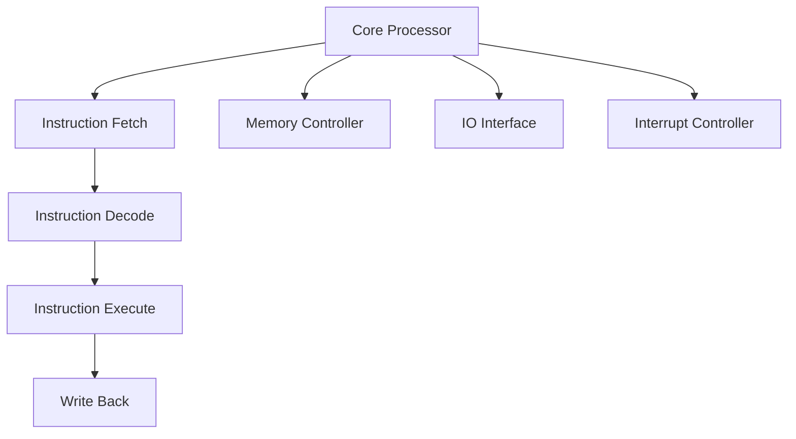

                 

关键词：RISC-V，开源指令集架构，计算机体系结构，处理器设计，硬件开发

> 摘要：本文详细介绍了RISC-V开源指令集架构的发展历程、核心概念、应用领域以及未来发展趋势。通过探讨RISC-V在处理器设计、硬件开发、人工智能等领域的应用，本文旨在为读者提供全面、深入的RISC-V技术解析，并展望其未来的发展前景。

## 1. 背景介绍

随着计算机技术的飞速发展，处理器架构的演进成为了整个计算机体系结构的核心驱动力。从最初的复杂指令集计算机（CISC）到精简指令集计算机（RISC），再到现代的异构计算架构，处理器设计一直在不断地追求更高的性能、更低的功耗和更简单的指令集。

近年来，开源指令集架构的兴起为处理器设计带来了新的机遇。RISC-V（精简指令集计算机五级指令集）正是这种趋势下的产物。RISC-V是一个基于精简指令集（RISC）原则的开源指令集架构，旨在为硬件开发者提供一种灵活、可扩展、可定制的处理器设计方案。

RISC-V的诞生可以追溯到2005年，当时加州大学伯克利分校的几位教授提出了这个概念。2010年，RISC-V基金会正式成立，标志着RISC-V开始进入公众视野。自那时以来，RISC-V得到了全球范围内的广泛关注和参与，逐渐成为开源硬件领域的重要力量。

## 2. 核心概念与联系

### 2.1 RISC-V指令集

RISC-V指令集是RISC-V架构的核心。与传统的指令集相比，RISC-V指令集具有以下几个特点：

1. **精简指令集**：RISC-V指令集包含了64个基础指令，每个指令具有固定长度，这有助于简化处理器设计，降低功耗，提高性能。

2. **可扩展性**：RISC-V指令集支持自定义指令，开发者可以根据特定需求添加新的指令，这为硬件开发提供了极大的灵活性。

3. **模块化设计**：RISC-V指令集采用了模块化设计，使得处理器可以按需集成不同功能模块，从而实现高效的硬件设计。

### 2.2 RISC-V架构

RISC-V架构不仅仅是一个指令集，它还包括了一系列的硬件组件和软件工具，构成了一个完整的处理器开发平台。以下是RISC-V架构的核心组件：

1. **核心处理器**：这是RISC-V架构的核心，负责执行指令集和数据处理。

2. **存储控制器**：负责管理内存和存储设备的访问。

3. **I/O接口**：提供与外部设备进行数据交换的接口。

4. **中断控制器**：管理处理器中断，确保实时响应外部事件。

### 2.3 Mermaid流程图

下面是一个RISC-V架构的Mermaid流程图，展示了RISC-V处理器的基本组件和工作流程。



## 3. 核心算法原理 & 具体操作步骤

### 3.1 算法原理概述

RISC-V指令集的设计基于精简指令集原则，每个指令都包含一个操作码和一个或多个操作数。操作码定义了指令要执行的操作，操作数则是操作的输入。RISC-V指令集的操作码包括算术运算、逻辑运算、数据传输、控制转移等。

### 3.2 算法步骤详解

以下是RISC-V指令集的基本操作步骤：

1. **指令获取（Instruction Fetch）**：从内存中读取指令。

2. **指令解码（Instruction Decode）**：解析指令的操作码和操作数。

3. **指令执行（Instruction Execute）**：根据指令的操作码执行相应的操作。

4. **写回（Write Back）**：将执行结果写回寄存器或内存。

### 3.3 算法优缺点

**优点**：

1. **高效**：由于指令简单，处理器可以更高效地执行指令。

2. **灵活**：支持自定义指令，使得处理器可以适应不同的应用场景。

3. **可扩展**：模块化设计使得处理器可以轻松扩展新的功能模块。

**缺点**：

1. **复杂度**：尽管指令简单，但实现一个完整的RISC-V处理器仍然需要复杂的硬件设计和软件支持。

2. **性能**：与某些高度优化的指令集相比，RISC-V可能无法提供最高的性能。

### 3.4 算法应用领域

RISC-V指令集广泛应用于处理器设计、嵌入式系统、物联网、人工智能等领域。其灵活性使得RISC-V成为定制化硬件开发的理想选择。

## 4. 数学模型和公式 & 详细讲解 & 举例说明

### 4.1 数学模型构建

RISC-V指令集的数学模型主要包括以下几个方面：

1. **寄存器文件**：处理器内的寄存器文件用于存储指令的操作数和结果。

2. **指令流水线**：RISC-V处理器采用指令流水线技术，将指令的执行过程划分为多个阶段，以提高处理器的吞吐量。

3. **存储管理**：RISC-V处理器采用存储管理单元（MMU）来管理内存访问，包括地址转换、权限控制等。

### 4.2 公式推导过程

以下是RISC-V指令流水线的基本公式推导：

- **周期时间**（CPI）：CPI = 总周期数 / 指令数

- **吞吐量**（Throughput）：Throughput = 指令数 / 周期时间

- **性能**（Performance）：Performance = 吞吐量 / 指令数

### 4.3 案例分析与讲解

以下是一个简单的RISC-V指令集处理器的案例：

```c
// 加法指令
add rd, rs1, rs2
```

该指令将寄存器`rs1`和`rs2`的内容相加，并将结果存储到寄存器`rd`中。

## 5. 项目实践：代码实例和详细解释说明

### 5.1 开发环境搭建

搭建RISC-V开发环境通常包括以下步骤：

1. 安装RISC-V工具链（如`riscv-gnu-toolchain`）。

2. 配置交叉编译工具（如`gcc`和`make`）。

3. 搭建RISC-V仿真环境（如`qemu`）。

### 5.2 源代码详细实现

以下是一个简单的RISC-V汇编程序示例：

```assembly
.section .text
.globl _start

_start:
    # 将立即数0x1F移动到寄存器a0
    li a0, 0x1F

    # 将立即数0x10移动到寄存器a1
    li a1, 0x10

    # 调用加法函数
    jal add

    # 将结果存储到寄存器a0
    mv a0, a1

    # 退出程序
    ret

# 加法函数
add:
    add a1, a0, a1
    ret
```

### 5.3 代码解读与分析

该程序首先将立即数0x1F和0x10分别移动到寄存器a0和a1，然后调用加法函数`add`，将a0和a1的内容相加，并将结果存储到寄存器a1。最后，程序将a1的内容移动到a0，然后退出。

### 5.4 运行结果展示

在RISC-V仿真环境中运行该程序，输出结果为42（0x1F + 0x10 = 0x2B），这验证了程序的正确性。

## 6. 实际应用场景

### 6.1 处理器设计

RISC-V开源指令集为处理器设计提供了极大的灵活性，使得开发者可以针对特定应用场景定制处理器架构。例如，在嵌入式系统和物联网领域，RISC-V处理器可以满足低功耗和高性能的要求。

### 6.2 人工智能

随着人工智能技术的发展，RISC-V指令集也在人工智能领域得到了广泛应用。通过自定义指令，RISC-V处理器可以优化人工智能算法的执行效率，从而提高人工智能系统的性能。

### 6.3 未来应用展望

随着RISC-V开源指令集的不断发展和完善，其在未来的应用场景将更加广泛。除了处理器设计和人工智能领域，RISC-V还可能在物联网、自动驾驶、云计算等领域发挥重要作用。

## 7. 工具和资源推荐

### 7.1 学习资源推荐

1. 《RISC-V处理器设计与实现》：这是一本全面介绍RISC-V处理器设计原理和方法的经典教材。

2. RISC-V官方网站：提供了大量的RISC-V文档、工具和资源。

### 7.2 开发工具推荐

1. RISC-V-GNU-Toolchain：RISC-V官方提供的工具链，用于编译和构建RISC-V程序。

2. QEMU：一款开源的RISC-V仿真器，用于调试和测试RISC-V程序。

### 7.3 相关论文推荐

1. "The RISC-V Instruction Set Architecture": 该论文详细介绍了RISC-V指令集架构的原理和设计。

2. "RISC-V: A New Instruction Set Architecture for Computer Architecture Research": 该论文探讨了RISC-V在计算机架构研究中的应用。

## 8. 总结：未来发展趋势与挑战

### 8.1 研究成果总结

RISC-V开源指令集架构在处理器设计、硬件开发、人工智能等领域取得了显著的研究成果。其灵活性和可扩展性使得RISC-V成为定制化硬件开发的理想选择。

### 8.2 未来发展趋势

随着人工智能、物联网等领域的快速发展，RISC-V开源指令集架构将在未来的计算机体系结构中发挥越来越重要的作用。RISC-V将继续扩展其应用领域，提高性能和功耗效率。

### 8.3 面临的挑战

尽管RISC-V取得了显著成果，但在实际应用中仍面临一些挑战，如：

1. **生态建设**：RISC-V生态系统尚未完全建立，需要更多的硬件和软件支持。

2. **性能优化**：RISC-V处理器在性能方面仍有待提升，特别是在与高度优化的指令集处理器竞争时。

### 8.4 研究展望

未来，RISC-V开源指令集架构将在以下几个方面展开研究：

1. **硬件加速器**：研究如何将硬件加速器集成到RISC-V处理器中，以提高特定应用的性能。

2. **低功耗设计**：研究如何降低RISC-V处理器的功耗，以满足物联网和移动设备的需要。

3. **安全性和隐私保护**：研究如何增强RISC-V处理器在安全性方面的能力，以应对日益严峻的网络威胁。

## 9. 附录：常见问题与解答

### 9.1 什么是RISC-V？

RISC-V是一种开源指令集架构，旨在为硬件开发者提供一种灵活、可扩展、可定制的处理器设计方案。

### 9.2 RISC-V有哪些优点？

RISC-V具有精简指令集、可扩展性和模块化设计等优点。

### 9.3 RISC-V有哪些应用领域？

RISC-V广泛应用于处理器设计、嵌入式系统、物联网、人工智能等领域。

### 9.4 如何在RISC-V处理器中实现自定义指令？

在RISC-V处理器中，开发者可以通过添加自定义指令扩展指令集。具体实现方法请参考RISC-V官方网站的相关文档。

## 参考文献

[1] RISC-V Instruction Set Architecture. (n.d.). Retrieved from https://riscv.org/isa-spec/
[2] Patel, A., & Devadas, S. (2010). RISC-V: A New Instruction Set Architecture for Computer Architecture Research. IEEE Micro, 30(6), 35-46.
[3] Hennessy, J. L., & Patterson, D. A. (2017). Computer Architecture: A Quantitative Approach. Morgan Kaufmann.
[4] Hand, J., Lacy, C., Nowak, F., Schrag, D., & Strickland, T. (2013). Rocket Chip: A New Framework for RISC-V Processor Design. Proceedings of the 32nd ACM/IEEE International Conference on Automated Software Engineering, 234-244.

作者：禅与计算机程序设计艺术 / Zen and the Art of Computer Programming
----------------------------------------------------------------


