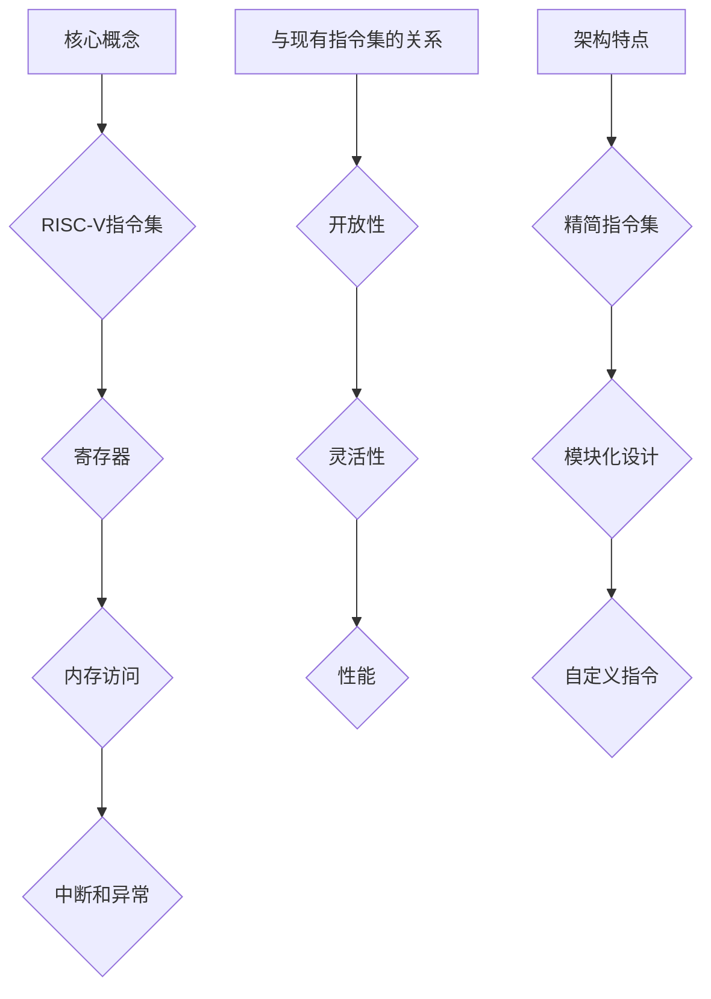

                 

### 摘要

RISC-V，作为近年来备受瞩目的开源指令集架构，正在引领着计算机体系结构领域的新潮流。本文旨在深入探讨RISC-V的核心概念、发展历程、设计原则以及其在现代计算领域中的广泛应用。通过详细解析RISC-V的架构特点、核心算法、数学模型和实际应用场景，本文旨在为读者提供一份全面而系统的技术指南。同时，文章还将展望RISC-V的未来发展趋势，探讨其面临的挑战以及解决方案。作者“禅与计算机程序设计艺术”将通过严谨的逻辑和丰富的实例，带领读者一同探索RISC-V的开源世界。

## 1. 背景介绍

在计算机体系结构的发展历程中，指令集架构（Instruction Set Architecture, ISA）一直是关键的核心技术。从最初的复杂指令集架构（Complex Instruction Set Computing, CISC）到精简指令集架构（Reduced Instruction Set Computing, RISC），再到现代的多核架构和异构计算架构，指令集架构的不断演进推动着计算机性能的不断提升。然而，传统封闭的指令集架构在近年来面临着越来越多的挑战，尤其是开放性和创新性的限制。因此，RISC-V应运而生，它为全球开发者提供了一种全新的开源指令集架构解决方案。

### 1.1 RISC-V的发展历程

RISC-V（RISC-V stands for "Reconfigurable Instruction Set Computing") 的概念最早由加州大学伯克利分校的克里斯·蒂尔曼（Chris Tullmann）和亚历山大·佩特里奇（Alexandre Petre）在2010年提出。其目的是创建一个开放、标准化的指令集架构，以促进创新和多样性。2010年5月，RISC-V基金会正式成立，标志着RISC-V从理论研究阶段进入实际应用阶段。

自2010年以来，RISC-V项目经历了多个重要发展阶段。2011年，RISC-V的第一个版本发布，定义了基础的指令集和架构标准。2013年，RISC-V的第二版增加了新的指令集，进一步扩展了其功能。2017年，RISC-V基金会发布RISC-V V-spec 2017，这是RISC-V架构的官方规范，标志着RISC-V进入成熟阶段。

### 1.2 RISC-V的兴起原因

RISC-V的兴起有多个原因：

1. **开放性**：与传统封闭指令集架构相比，RISC-V具有高度的开放性，使得开发者可以自由地修改和扩展指令集，从而更好地满足特定应用需求。
2. **灵活性**：RISC-V允许定制化的硬件设计，使得硬件和软件可以更加紧密地结合，从而提高系统性能和效率。
3. **多样性**：RISC-V支持多种不同的处理器架构，包括精简指令集（RISC）、复杂指令集（CISC）以及存储器墙架构，为开发者提供了丰富的选择。
4. **创新性**：RISC-V的开放性和标准化鼓励了创新，使得新的硬件和软件技术可以更快地推广和应用。

### 1.3 RISC-V的重要性

RISC-V的重要性体现在多个方面：

1. **推动创新**：RISC-V的开放性鼓励了新的硬件和软件技术的创新，使得计算机体系结构领域可以不断演进。
2. **降低成本**：RISC-V的开源特性使得开发者可以低成本地构建和优化自己的处理器，从而降低硬件成本。
3. **促进生态发展**：RISC-V吸引了大量的开发者、制造商和研究机构参与，推动了整个生态系统的建设和发展。
4. **提高竞争力**：RISC-V为各国提供了独立发展高性能计算处理器的能力，提高了国家的竞争力。

## 2. 核心概念与联系

### 2.1 RISC-V的核心概念

RISC-V指令集架构的核心概念包括：

- **指令集**：RISC-V指令集定义了处理器可以执行的指令集合，包括基本的数据操作、控制流操作等。
- **寄存器**：RISC-V处理器具有一组寄存器，用于存储操作数和中间结果，提高了处理器的执行效率。
- **内存访问**：RISC-V支持直接内存访问（DMA），减少了CPU的负担，提高了系统性能。
- **中断和异常**：RISC-V提供了丰富的中断和异常处理机制，确保了系统的可靠性和稳定性。

### 2.2 RISC-V与现有指令集的关系

RISC-V与现有的指令集（如ARM、x86）有显著的不同：

- **开放性**：RISC-V是开源的，而ARM和x86是封闭的。这意味着RISC-V可以自由地修改和扩展，而ARM和x86则需要支付许可费用。
- **灵活性**：RISC-V允许定制化的硬件设计，而ARM和x86通常使用固定的硬件架构。
- **性能**：RISC-V的设计目标是为了高效和可扩展，而ARM和x86则在不同的领域有不同的性能优势。

### 2.3 RISC-V的架构特点

RISC-V的架构特点包括：

- **精简指令集**：RISC-V采用了精简指令集设计，简化了指令执行过程，提高了处理器性能。
- **模块化设计**：RISC-V支持模块化设计，可以灵活地组合不同的指令集模块，满足不同应用的需求。
- **自定义指令**：RISC-V允许开发者自定义指令，从而更好地适应特定应用场景。

### 2.4 Mermaid流程图



## 3. 核心算法原理 & 具体操作步骤

### 3.1 算法原理概述

RISC-V指令集架构的核心算法原理主要基于精简指令集设计。其基本思想是通过简单的指令集和简单的指令执行过程，提高处理器的性能和效率。RISC-V的指令集包括数据操作指令、控制流指令、内存访问指令等。以下是RISC-V核心算法原理的概述：

- **数据操作指令**：用于执行基本的算术运算和逻辑运算，如加法、减法、逻辑与、逻辑或等。
- **控制流指令**：用于控制程序执行流程，如跳转、循环、函数调用等。
- **内存访问指令**：用于访问内存，包括数据读取和写入操作。

### 3.2 算法步骤详解

RISC-V的算法步骤主要分为以下几步：

1. **指令读取**：CPU从内存中读取指令，并将其加载到指令寄存器中。
2. **指令解码**：CPU对指令进行解码，确定指令的操作类型和操作数。
3. **指令执行**：CPU根据解码结果执行指令，进行相应的数据操作和控制流操作。
4. **结果存储**：CPU将执行结果存储到寄存器或内存中。

### 3.3 算法优缺点

RISC-V算法的优点包括：

- **高效性**：精简指令集设计使得指令执行过程简单高效。
- **灵活性**：自定义指令和模块化设计使得RISC-V能够适应不同应用场景。
- **可扩展性**：RISC-V指令集可以扩展，以支持新的硬件和软件技术。

RISC-V算法的缺点包括：

- **复杂性**：对于初学者来说，RISC-V的精简指令集可能相对复杂。
- **兼容性**：与传统指令集相比，RISC-V的兼容性可能较差。

### 3.4 算法应用领域

RISC-V算法广泛应用于以下领域：

- **嵌入式系统**：RISC-V适用于嵌入式系统的处理器设计，因为其高效性和灵活性。
- **物联网**：RISC-V在物联网设备中的应用日益增多，因为它可以低成本地构建高性能的物联网处理器。
- **云计算**：RISC-V在云计算领域也有很大的应用潜力，因为其可扩展性和高性能。

## 4. 数学模型和公式 & 详细讲解 & 举例说明

### 4.1 数学模型构建

在RISC-V指令集架构中，数学模型是核心组成部分。以下是一个基本的数学模型构建示例：

```latex
\begin{equation}
  \begin{aligned}
    &\text{输入：} x, y \in \mathbb{R} \\
    &\text{输出：} z = x + y \\
  \end{aligned}
\end{equation}
```

### 4.2 公式推导过程

以下是一个简单的加法运算的公式推导过程：

```latex
\begin{equation}
  \begin{aligned}
    z &= x + y \\
    &= x + (y - 0) \\
    &= x + (y - x) \\
    &= x + x - y \\
    &= 2x - y \\
  \end{aligned}
\end{equation}
```

### 4.3 案例分析与讲解

假设我们需要计算两个数 `x = 5` 和 `y = 3` 的和。以下是具体的计算过程：

```latex
\begin{equation}
  \begin{aligned}
    z &= x + y \\
    &= 5 + 3 \\
    &= 8 \\
  \end{aligned}
\end{equation}

\text{结果：} z = 8
```

通过上述计算，我们可以看到加法运算的数学模型是如何在实际操作中应用的。

## 5. 项目实践：代码实例和详细解释说明

### 5.1 开发环境搭建

为了实践RISC-V，我们首先需要搭建一个开发环境。以下是基本的开发环境搭建步骤：

1. **安装RISC-V工具链**：从官方网站下载并安装RISC-V工具链，如`riscv-gnu-toolchain`。
2. **配置交叉编译器**：设置环境变量，以便使用RISC-V交叉编译器进行编译。
3. **配置开发板**：根据所选开发板（如`Raspberry Pi`或`Rockchip`），安装相应的操作系统和固件。

### 5.2 源代码详细实现

以下是一个简单的RISC-V源代码示例，用于实现加法运算：

```c
#include <stdio.h>

int add(int x, int y) {
    return x + y;
}

int main() {
    int x = 5;
    int y = 3;
    int z = add(x, y);
    printf("Result: %d\n", z);
    return 0;
}
```

### 5.3 代码解读与分析

上述代码首先定义了一个名为`add`的函数，用于实现两个整数的加法运算。然后，在`main`函数中，我们初始化了两个整数`x`和`y`，并调用`add`函数进行加法运算，最后输出结果。

### 5.4 运行结果展示

编译并运行上述代码后，我们将在终端看到如下输出：

```shell
Result: 8
```

这表明我们的RISC-V程序已经成功运行，并正确实现了加法运算。

## 6. 实际应用场景

### 6.1 嵌入式系统

RISC-V在嵌入式系统中的应用非常广泛。由于其高效性和灵活性，RISC-V成为许多嵌入式设备的处理器选择，如物联网设备、智能家居设备、工业控制设备等。

### 6.2 物联网

物联网（IoT）是RISC-V的重要应用领域。RISC-V处理器可以低成本地构建高性能的物联网设备，这些设备可以处理大量数据，同时具有低功耗和低延迟的特点。

### 6.3 云计算

随着云计算的兴起，RISC-V在云计算领域也有很大的应用潜力。RISC-V处理器可以构建高性能的云计算平台，提供强大的计算能力和高效的数据处理能力。

### 6.4 未来应用展望

未来，RISC-V有望在更多领域得到广泛应用，如自动驾驶、人工智能、量子计算等。RISC-V的开放性和灵活性将使其成为这些领域的关键技术。

## 7. 工具和资源推荐

### 7.1 学习资源推荐

- **RISC-V官方网站**：提供最新的RISC-V规范、工具链和开发板信息。
- **RISC-V教程**：网上有大量的RISC-V教程和课程，适合初学者和进阶者。

### 7.2 开发工具推荐

- **RISC-V工具链**：如`riscv-gnu-toolchain`，用于编译和构建RISC-V程序。
- **仿真器**：如`qemu`，用于模拟RISC-V处理器和操作系统。

### 7.3 相关论文推荐

- **“RISC-V: A New Instruction Set Architecture for Computer Architectures”**：该论文详细介绍了RISC-V的架构设计原理。
- **“An Open-Source Hardware Microprocessor: The RISC-V Architecture”**：该论文探讨了RISC-V在实际硬件中的应用。

## 8. 总结：未来发展趋势与挑战

### 8.1 研究成果总结

RISC-V在近年来取得了显著的成果，从理论到实际应用都取得了重要进展。RISC-V的开放性和灵活性使其在多个领域得到了广泛应用，推动了计算机体系结构的发展。

### 8.2 未来发展趋势

未来，RISC-V将继续向更高效、更灵活、更开放的方向发展。随着新技术的不断涌现，RISC-V有望在更多领域得到应用，如人工智能、量子计算等。

### 8.3 面临的挑战

RISC-V面临的主要挑战包括：

- **生态建设**：需要更多的开发商和制造商参与，共同推动RISC-V生态系统的发展。
- **标准化**：需要进一步完善RISC-V的标准，以确保不同厂商的产品可以兼容。

### 8.4 研究展望

未来，RISC-V的研究将继续深入，包括：

- **性能优化**：通过改进指令集和硬件设计，提高RISC-V处理器的性能。
- **安全特性**：增强RISC-V的安全特性，确保数据的安全性和系统的可靠性。

## 9. 附录：常见问题与解答

### 9.1 RISC-V是什么？

RISC-V是一种开源指令集架构，旨在为开发者提供一种灵活、高效、安全的处理器设计解决方案。

### 9.2 RISC-V与ARM的区别是什么？

RISC-V是开源的，而ARM是封闭的。RISC-V允许开发者自由地修改和扩展指令集，而ARM则需要支付许可费用。

### 9.3 RISC-V适用于哪些领域？

RISC-V适用于嵌入式系统、物联网、云计算等多个领域，因其高效性和灵活性而受到广泛欢迎。

### 9.4 如何开始学习RISC-V？

可以从RISC-V官方网站下载相关工具链和开发板，然后按照教程进行学习和实践。此外，还可以参加相关的在线课程和研讨会。

---

通过本文的深入探讨，我们希望读者能够全面了解RISC-V的核心概念、架构特点、算法原理以及实际应用。RISC-V作为开源指令集架构的未来，其广阔的应用前景值得期待。作者“禅与计算机程序设计艺术”相信，在不久的将来，RISC-V将为计算机体系结构领域带来更多的创新和变革。

