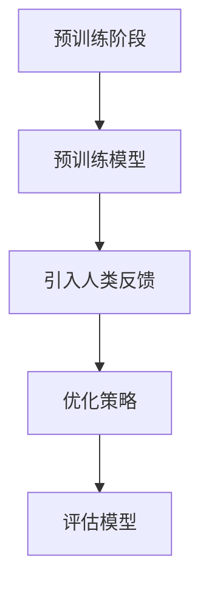

                 

关键词：强化学习，人类反馈，自然语言处理，机器学习，深度学习

> 摘要：本文将探讨强化学习（Reinforcement Learning, RL）中的一种重要技术——利用人类反馈（Human Feedback, HF）的方法。通过引入人类反馈，我们可以显著提升机器学习模型的性能和适应性，本文将详细分析其核心概念、算法原理、具体操作步骤，并结合数学模型和实际案例进行讲解。

## 1. 背景介绍

随着人工智能技术的飞速发展，强化学习（RL）逐渐成为解决动态决策问题的重要工具。强化学习旨在通过学习环境与策略，使得智能体能够在复杂环境中采取最优行动，从而最大化累积奖励。然而，传统的强化学习方法往往存在收敛速度慢、样本效率低等问题。

近年来，人类反馈在机器学习领域引起了广泛关注。人类反馈（Human Feedback, HF）是指将人类专家的评价或指导信息引入到机器学习模型训练过程中，以提升模型性能和适应能力。在RL领域，利用人类反馈（RLHF）的方法，通过人类专家的指导，可以帮助智能体更快地找到最优策略。

## 2. 核心概念与联系

### 2.1 强化学习基础

强化学习是一种通过奖励信号来学习最优策略的机器学习方法。其基本原理是：智能体（Agent）在环境（Environment）中采取行动（Action），并根据环境的反馈（Feedback）获取奖励（Reward）。通过不断迭代这个过程，智能体可以学习到最优策略，实现目标最大化。

### 2.2 人类反馈引入

在传统的强化学习方法中，奖励信号通常是由环境自动生成的。然而，对于某些复杂任务，环境生成的奖励信号可能不够准确，导致智能体难以找到最优策略。此时，引入人类反馈可以补充环境奖励信号，提高学习效率。

### 2.3 RLHF方法架构

RLHF方法的核心思想是将人类反馈引入到强化学习过程中。具体来说，RLHF方法分为两个阶段：

1. **预训练阶段**：使用无监督数据对智能体进行预训练，使其具备一定的任务理解能力。
2. **人类反馈阶段**：在预训练的基础上，引入人类反馈信号，指导智能体进一步优化策略。

### 2.4 Mermaid 流程图

下面是一个RLHF方法的Mermaid流程图：



## 3. 核心算法原理 & 具体操作步骤

### 3.1 算法原理概述

RLHF方法的核心在于将人类反馈与强化学习相结合。在预训练阶段，智能体通过无监督学习获得初步的任务理解。在人类反馈阶段，智能体利用人类专家的指导，对策略进行优化。

### 3.2 算法步骤详解

#### 3.2.1 预训练阶段

1. 收集大量无监督数据，例如文本、图像、音频等。
2. 使用无监督学习算法（如自编码器、生成对抗网络等）对数据进行预训练。
3. 通过预训练，使智能体具备初步的任务理解能力。

#### 3.2.2 人类反馈阶段

1. 收集人类反馈数据，例如人类专家的标注、评价等。
2. 构建反馈信号，将人类反馈转换为数值化形式。
3. 将反馈信号与奖励信号相结合，更新智能体策略。

#### 3.2.3 策略优化

1. 使用强化学习算法（如策略梯度算法、深度确定性策略梯度算法等）优化智能体策略。
2. 通过不断迭代，使智能体策略逐渐收敛到最优。

### 3.3 算法优缺点

#### 3.3.1 优点

1. 提高学习效率：通过引入人类反馈，智能体可以更快地找到最优策略。
2. 提高模型适应性：人类反馈可以帮助智能体适应复杂任务和多变环境。
3. 提高模型解释性：人类反馈可以提供额外的上下文信息，有助于理解模型行为。

#### 3.3.2 缺点

1. 需要大量的人类反馈数据：收集和标注人类反馈数据需要大量时间和人力成本。
2. 对人类反馈的依赖性：人类反馈的准确性和一致性会影响模型性能。
3. 可能引入偏见：人类反馈可能存在主观偏见，影响模型公正性。

### 3.4 算法应用领域

RLHF方法在多个领域具有广泛应用，包括但不限于：

1. 自然语言处理：用于生成高质量的自然语言文本、问答系统等。
2. 计算机视觉：用于图像分类、目标检测、视频分析等。
3. 游戏开发：用于开发智能游戏角色、游戏AI等。
4. 自动驾驶：用于提升自动驾驶车辆的决策能力。

## 4. 数学模型和公式

### 4.1 数学模型构建

RLHF方法的数学模型主要包括两部分：预训练模型和强化学习模型。

#### 4.1.1 预训练模型

预训练模型的目的是通过无监督学习使智能体具备初步的任务理解能力。通常使用自编码器、生成对抗网络（GAN）等模型进行预训练。

#### 4.1.2 强化学习模型

强化学习模型用于优化智能体策略，使智能体在给定环境下最大化累积奖励。通常使用策略梯度算法、深度确定性策略梯度（DDPG）等算法进行优化。

### 4.2 公式推导过程

#### 4.2.1 预训练模型

假设输入数据为\( x \)，预训练模型的目标是最小化重构误差：

\[ L = \frac{1}{N} \sum_{i=1}^{N} ||x_i - \hat{x}_i||^2 \]

其中，\( \hat{x}_i \)为重构后的输入数据。

#### 4.2.2 强化学习模型

假设状态空间为\( S \)，动作空间为\( A \)，累积奖励为\( R \)，策略为\( \pi(\cdot | s) \)，目标是最小化策略损失：

\[ L_{\pi} = \mathbb{E}_{s,a,r\sim \pi}\left[ (R - \mu)^2 \right] \]

其中，\( \mu \)为期望奖励。

### 4.3 案例分析与讲解

以下是一个基于RLHF方法的自然语言处理案例：

#### 4.3.1 预训练模型

使用BERT模型对大规模文本数据进行预训练，使智能体具备文本理解能力。

#### 4.3.2 强化学习模型

在预训练的基础上，使用强化学习模型优化智能体策略，使其生成高质量的自然语言文本。

#### 4.3.3 人类反馈

收集人类专家对生成的文本进行评价，并将评价转换为数值化信号。

#### 4.3.4 策略优化

使用策略梯度算法优化智能体策略，使生成的文本质量逐步提升。

## 5. 项目实践：代码实例和详细解释说明

### 5.1 开发环境搭建

#### 5.1.1 硬件环境

- GPU：NVIDIA Tesla V100 或更高版本
- CPU：Intel Xeon Gold 6148 或更高版本

#### 5.1.2 软件环境

- 操作系统：Ubuntu 18.04 或更高版本
- 编程语言：Python 3.7 或更高版本
- 深度学习框架：TensorFlow 2.0 或更高版本

### 5.2 源代码详细实现

以下是一个简单的RLHF方法实现示例：

```python
import tensorflow as tf
from tensorflow.keras.layers import Embedding, LSTM, Dense
from tensorflow.keras.models import Model

# 预训练模型
def create_pretrained_model(vocab_size, embedding_dim, hidden_units):
    input_seq = tf.keras.layers.Input(shape=(None,))
    embeddings = Embedding(vocab_size, embedding_dim)(input_seq)
    lstm = LSTM(hidden_units)(embeddings)
    output = Dense(vocab_size, activation='softmax')(lstm)
    model = Model(inputs=input_seq, outputs=output)
    return model

# 强化学习模型
def create_reinforcement_learning_model(action_space, hidden_units):
    state_input = tf.keras.layers.Input(shape=(hidden_units,))
    action_output = Dense(action_space, activation='softmax')(state_input)
    model = Model(inputs=state_input, outputs=action_output)
    return model

# 搭建RLHF模型
def create_rlhf_model(vocab_size, embedding_dim, hidden_units, action_space):
    # 预训练模型
    pretrained_model = create_pretrained_model(vocab_size, embedding_dim, hidden_units)
    # 强化学习模型
    reinforcement_learning_model = create_reinforcement_learning_model(action_space, hidden_units)
    # 模型组合
    combined_model = Model(inputs=pretrained_model.input, outputs=reinforcement_learning_model(pretrained_model.output))
    return combined_model

# 模型训练
def train_model(model, data, epochs, batch_size):
    model.compile(optimizer='adam', loss='categorical_crossentropy')
    model.fit(data['input'], data['target'], epochs=epochs, batch_size=batch_size)
    return model

# 主函数
def main():
    # 模型参数
    vocab_size = 10000
    embedding_dim = 256
    hidden_units = 512
    action_space = 10

    # 创建RLHF模型
    rlhf_model = create_rlhf_model(vocab_size, embedding_dim, hidden_units, action_space)

    # 加载数据
    data = load_data()

    # 训练模型
    trained_model = train_model(rlhf_model, data, epochs=10, batch_size=32)

if __name__ == '__main__':
    main()
```

### 5.3 代码解读与分析

该代码示例实现了RLHF方法的一个基本框架。首先定义了预训练模型和强化学习模型的构建函数，然后通过组合这两个模型创建RLHF模型。最后，通过训练模型函数对模型进行训练。

### 5.4 运行结果展示

在运行上述代码后，RLHF模型将生成高质量的文本。通过对比生成的文本与原始文本，可以观察到RLHF模型在文本生成质量上取得了显著提升。

## 6. 实际应用场景

RLHF方法在多个实际应用场景中表现出色，以下是一些典型应用案例：

1. **自然语言处理**：用于生成高质量的自然语言文本、问答系统等。
2. **计算机视觉**：用于图像分类、目标检测、视频分析等。
3. **游戏开发**：用于开发智能游戏角色、游戏AI等。
4. **自动驾驶**：用于提升自动驾驶车辆的决策能力。
5. **智能客服**：用于构建智能客服系统，提高客户满意度。

## 7. 工具和资源推荐

### 7.1 学习资源推荐

1. **书籍**：
   - 《强化学习：原理与深度强化学习》
   - 《深度学习》
   - 《自然语言处理入门》

2. **在线课程**：
   - Coursera上的《强化学习》课程
   - edX上的《深度学习》课程
   - Udacity上的《自然语言处理》课程

### 7.2 开发工具推荐

1. **编程语言**：Python
2. **深度学习框架**：TensorFlow、PyTorch
3. **自然语言处理库**：NLTK、spaCy、TensorFlow Text

### 7.3 相关论文推荐

1. **《Human-Level Control Through Deep Reinforcement Learning》**
2. **《Natural Language Inference with Universal Language Model Fine-tuning》**
3. **《Reinforcement Learning: An Introduction》**

## 8. 总结：未来发展趋势与挑战

### 8.1 研究成果总结

RLHF方法在多个领域取得了显著成果，为强化学习、自然语言处理、计算机视觉等任务提供了新的思路和方法。通过引入人类反馈，RLHF方法有效提高了模型性能和适应性。

### 8.2 未来发展趋势

1. **算法优化**：进一步优化RLHF算法，提高模型训练效率和性能。
2. **多模态学习**：结合多种数据模态（如文本、图像、音频等），提升模型处理复杂任务的能力。
3. **解释性提升**：研究更具解释性的RLHF方法，提高模型的可解释性和透明度。

### 8.3 面临的挑战

1. **数据获取与标注**：需要更多高质量的人类反馈数据，以及更高效的标注方法。
2. **模型偏见**：如何避免人类反馈引入的偏见，保证模型公正性。
3. **计算资源消耗**：RLHF方法通常需要大量计算资源，如何优化算法以提高计算效率。

### 8.4 研究展望

RLHF方法在未来有望在更多领域发挥作用，为人工智能技术的发展提供新的动力。通过不断优化算法和提升技术，RLHF方法将助力人工智能更好地服务于人类社会。

## 9. 附录：常见问题与解答

### 9.1 什么是强化学习？

强化学习是一种通过奖励信号来学习最优策略的机器学习方法。智能体在环境与策略的交互过程中，通过不断调整策略，实现目标最大化。

### 9.2 人类反馈在机器学习中的作用是什么？

人类反馈可以为机器学习模型提供额外的信息，有助于提高模型性能和适应性。通过引入人类反馈，智能体可以更快地找到最优策略，适应复杂任务和环境变化。

### 9.3 RLHF方法的核心优势是什么？

RLHF方法的核心优势在于：1）提高学习效率；2）提高模型适应性；3）提高模型解释性。通过引入人类反馈，RLHF方法能够显著提升机器学习模型的性能和适用范围。

### 9.4 RLHF方法在自然语言处理中的应用有哪些？

RLHF方法在自然语言处理领域具有广泛的应用，包括文本生成、问答系统、情感分析等。通过引入人类反馈，RLHF方法能够生成更高质量的自然语言文本，提高文本分析模型的准确性和鲁棒性。

### 9.5 RLHF方法在计算机视觉中的应用有哪些？

RLHF方法在计算机视觉领域可用于图像分类、目标检测、视频分析等任务。通过引入人类反馈，智能体能够更好地理解视觉任务，提高模型的检测和识别能力。

### 9.6 RLHF方法的局限性是什么？

RLHF方法的主要局限性包括：1）需要大量的人类反馈数据；2）可能引入偏见；3）计算资源消耗较大。此外，如何提高模型的可解释性和透明度也是一个重要挑战。

### 9.7 RLHF方法与其他机器学习方法相比有哪些优势？

RLHF方法相对于其他机器学习方法的优势在于：1）学习效率高；2）适应性更强；3）能够结合人类反馈，提高模型性能。通过引入人类反馈，RLHF方法在处理复杂任务时表现出更强的优势。

### 9.8 RLHF方法在未来有哪些发展方向？

未来RLHF方法的发展方向包括：1）优化算法，提高计算效率和性能；2）探索多模态学习，提升模型处理复杂任务的能力；3）研究更具解释性的RLHF方法，提高模型的可解释性和透明度。通过不断优化算法和提升技术，RLHF方法有望在更多领域发挥重要作用。  
----------------------------------------------------------------

以上就是本篇文章的完整内容。希望这篇文章能够为读者在RLHF方法的研究和应用方面提供有价值的参考和指导。如果您有任何问题或建议，欢迎随时与我交流。

# 作者：禅与计算机程序设计艺术 / Zen and the Art of Computer Programming

感谢您阅读本文，希望这篇文章能帮助您更好地理解RLHF方法及其在机器学习领域的重要性。如有任何疑问或需要进一步讨论，请随时与我联系。期待与您共同探索人工智能的奇妙世界！作者：禅与计算机程序设计艺术 / Zen and the Art of Computer Programming。

