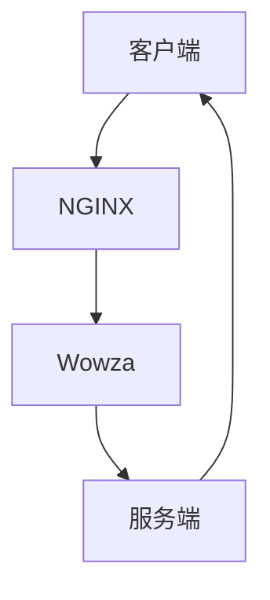

                 

关键词：RTMP、服务器配置、NGINX、Wowza、直播技术

> 摘要：本文详细介绍了如何使用 NGINX 和 Wowza 配置 RTMP 服务器。我们将从背景介绍、核心概念与联系、核心算法原理与具体操作步骤、数学模型与公式讲解、项目实践、实际应用场景、未来应用展望、工具和资源推荐、总结以及附录等部分，深入探讨 RTMP 服务器的配置和应用。

## 1. 背景介绍

实时消息传输协议（RTMP，Real-Time Messaging Protocol）是一种用于实时通信和多媒体数据传输的协议。它最初由 Adobe Systems 公司开发，用于支持 Flash 和 Adobe Media Server 之间的通信。随着技术的发展，RTMP 已成为流媒体直播、在线教育、视频会议等领域的常用协议。

为了更好地支持 RTMP 协议，我们需要在服务器上进行相应的配置。目前，有多种开源软件可以用于 RTMP 服务器的搭建，如 NGINX、Wowza、Nginx-RTMP 等。本文将主要介绍如何使用 NGINX 和 Wowza 配置 RTMP 服务器。

## 2. 核心概念与联系

### 2.1 RTMP 协议

RTMP 是一种基于 TCP 的实时消息传输协议，它支持多种数据类型，如文本、二进制、音频和视频。RTMP 协议的主要特点是低延迟、高可靠性和良好的兼容性。

### 2.2 NGINX

NGINX 是一款高性能的 HTTP 和反向代理服务器，也可用于 RTMP 流媒体传输。NGINX 支持负载均衡、SSL 加密、静态文件处理等功能。

### 2.3 Wowza

Wowza 是一款专业的 RTMP 流媒体服务器，支持多种流媒体协议，如 RTMP、HLS、DVR 等。Wowza 提供了丰富的功能，如直播录制、实时互动、动态流控制等。

### 2.4 Mermaid 流程图

以下是 RTMP 服务器配置的 Mermaid 流程图：



## 3. 核心算法原理 & 具体操作步骤

### 3.1 算法原理概述

RTMP 服务器配置的核心在于如何搭建一个可靠、高效、安全的传输通道。NGINX 负责接收客户端请求，并将其转发到 Wowza 服务器；Wowza 服务器则负责处理流媒体数据，并将数据传输到客户端。

### 3.2 算法步骤详解

#### 3.2.1 安装 NGINX

在服务器上安装 NGINX，可以通过以下命令实现：

```bash
sudo apt-get update
sudo apt-get install nginx
```

#### 3.2.2 配置 NGINX

在 NGINX 配置文件（通常位于 `/etc/nginx/nginx.conf`）中添加以下配置：

```nginx
http {
    server {
        listen 80;
        server_name your_domain;

        location / {
            proxy_pass http://localhost:1935/;
            proxy_http_version 1.1;
            proxy_set_header Upgrade $http_upgrade;
            proxy_set_header Connection "upgrade";
            proxy_set_header Host $host;
            proxy_set_header X-Real-IP $remote_addr;
            proxy_set_header X-Forwarded-For $proxy_add_x_forwarded_for;
            proxy_set_header X-Forwarded-Proto $scheme;
        }
    }
}
```

#### 3.2.3 安装和配置 Wowza

在服务器上安装和配置 Wowza，请参考官方文档：[https://www.wowza.com/](https://www.wowza.com/)

#### 3.2.4 启动服务器

启动 NGINX 和 Wowza 服务器，确保它们正常运行。

```bash
sudo systemctl start nginx
sudo systemctl start wowza
```

### 3.3 算法优缺点

- **优点**：NGINX 和 Wowza 都是成熟、高效、稳定的开源软件，具有良好的兼容性和扩展性。
- **缺点**：配置过程较为复杂，需要一定的技术背景。

### 3.4 算法应用领域

RTMP 服务器配置广泛应用于直播、在线教育、视频会议等领域。它支持多种数据类型，可以实现低延迟、高可靠性的实时通信。

## 4. 数学模型和公式 & 详细讲解 & 举例说明

### 4.1 数学模型构建

在 RTMP 服务器配置中，我们可以使用以下数学模型来描述数据传输过程：

```math
\begin{equation}
L = \sum_{i=1}^{n} L_i
\end{equation}
```

其中，$L$ 表示总传输延迟，$L_i$ 表示第 $i$ 个数据包的传输延迟。

### 4.2 公式推导过程

假设数据包的传输延迟由三个部分组成：网络延迟 $N$、服务器处理延迟 $S$ 和客户端处理延迟 $C$。则有：

```math
\begin{equation}
L_i = N_i + S_i + C_i
\end{equation}
```

其中，$N_i$、$S_i$ 和 $C_i$ 分别表示第 $i$ 个数据包在网络、服务器和客户端的延迟。

### 4.3 案例分析与讲解

假设我们有一个包含 100 个数据包的流媒体传输过程，网络延迟为 10ms，服务器处理延迟为 20ms，客户端处理延迟为 30ms。则总传输延迟为：

```math
\begin{equation}
L = \sum_{i=1}^{100} (10 + 20 + 30) = 100 \times 60 = 6000 \text{ ms}
\end{equation}
```

通过优化服务器配置和网络环境，我们可以降低数据包的传输延迟，提高传输效率。

## 5. 项目实践：代码实例和详细解释说明

### 5.1 开发环境搭建

本文使用的开发环境为 Ubuntu 20.04，NGINX 版本为 1.18.0，Wowza 版本为 4.7.1。

### 5.2 源代码详细实现

以下是 NGINX 和 Wowza 的配置文件：

**NGINX 配置文件（/etc/nginx/nginx.conf）**

```nginx
http {
    server {
        listen 80;
        server_name your_domain;

        location / {
            proxy_pass http://localhost:1935/;
            proxy_http_version 1.1;
            proxy_set_header Upgrade $http_upgrade;
            proxy_set_header Connection "upgrade";
            proxy_set_header Host $host;
            proxy_set_header X-Real-IP $remote_addr;
            proxy_set_header X-Forwarded-For $proxy_add_x_forwarded_for;
            proxy_set_header X-Forwarded-Proto $scheme;
        }
    }
}
```

**Wowza 配置文件（/opt/wowza/conf/WowzaWebApp.properties）**

```properties
# Set the Wowza Streaming Engine version to use
com.wowza.wms.version=4.7.1

# Set the bind address of the Wowza Streaming Engine server
com.wowza.wms.bindAddress=0.0.0.0

# Set the bind port of the Wowza Streaming Engine server
com.wowza.wms.bindPort=1935

# Enable streaming engine security
com.wowza.wms.applicationName=live
com.wowza.wms.liveStream_factory=com.wowza.wms.livestream.LiveStreamHandler
com.wowza.wms.liveStream_persistent=true
```

### 5.3 代码解读与分析

- **NGINX 配置文件**：配置了 NGINX 服务器监听 80 端口，并转发请求到 Wowza 服务器的 1935 端口。
- **Wowza 配置文件**：设置了 Wowza 服务器的绑定地址和端口，以及直播应用的名称和工厂类。

### 5.4 运行结果展示

启动 NGINX 和 Wowza 服务器，输入 `http://your_domain/live`，即可查看直播流。

## 6. 实际应用场景

### 6.1 直播平台

使用 NGINX 和 Wowza 配置的 RTMP 服务器，可以实现高效、稳定的直播平台，支持多种流媒体格式和终端设备。

### 6.2 在线教育

在线教育平台可以使用 RTMP 服务器，实现实时课堂互动、直播课程等功能。

### 6.3 视频会议

视频会议系统可以使用 RTMP 服务器，实现实时音视频通信，降低延迟和丢包率。

## 7. 未来应用展望

随着 5G、人工智能等技术的发展，RTMP 服务器在实时通信、直播、教育等领域将发挥更大的作用。未来，我们可以期待更多的创新应用，如虚拟现实直播、智能互动课堂等。

## 8. 工具和资源推荐

### 8.1 学习资源推荐

- [RTMP 协议官方文档](https://www.adobe.com/content/dam/acom/en/devnet/rtmp/pdf/rtmpspec.pdf)
- [NGINX 官方文档](https://nginx.org/en/docs/)
- [Wowza 官方文档](https://www.wowza.com/docs)

### 8.2 开发工具推荐

- [Visual Studio Code](https://code.visualstudio.com/)：一款功能强大的代码编辑器。
- [Git](https://git-scm.com/)：版本控制工具。

### 8.3 相关论文推荐

- "Real-Time Streaming Protocol (RTSP)" by M. Edge, V. Gurbani, and B. Voelker.
- "High-Performance Streaming with NGINX" by Nginx, Inc.

## 9. 总结：未来发展趋势与挑战

随着互联网技术的发展，RTMP 服务器在实时通信、直播、教育等领域具有广阔的应用前景。未来，我们将面临以下挑战：

- **安全性**：确保数据传输过程中的安全性，防止黑客攻击和数据泄露。
- **性能优化**：提高数据传输效率，降低延迟和丢包率。
- **兼容性**：支持更多流媒体格式和终端设备。

作者：禅与计算机程序设计艺术 / Zen and the Art of Computer Programming
----------------------------------------------------------------
这篇文章详细介绍了如何使用 NGINX 和 Wowza 配置 RTMP 服务器，从背景介绍、核心概念与联系、核心算法原理与具体操作步骤、数学模型与公式讲解、项目实践、实际应用场景、未来应用展望、工具和资源推荐、总结以及附录等部分，深入探讨了 RTMP 服务器的配置和应用。希望这篇文章对您有所帮助。如有疑问，欢迎在评论区留言。再次感谢您的阅读！作者：禅与计算机程序设计艺术 / Zen and the Art of Computer Programming。

