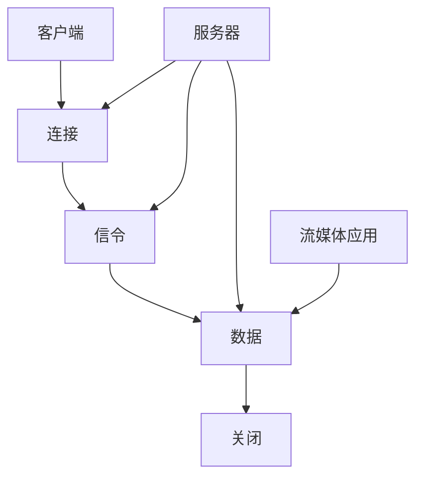

                 

 关键词：RTMP协议、实时传输、多媒体传输、流媒体、数据包传输、协议详解、应用场景、算法原理

> 摘要：本文将深入剖析RTMP协议的原理、结构、应用场景以及实现方法，旨在帮助读者全面理解并掌握这一实时多媒体传输技术。通过对RTMP协议的详细解析，读者将能够更好地应对实际开发中的多媒体传输需求，优化网络性能，提高用户体验。

## 1. 背景介绍

随着互联网技术的飞速发展，网络多媒体应用日益普及。实时传输视频、音频流已经成为网络应用的重要组成部分。然而，如何高效、稳定地传输多媒体数据成为了开发者们面临的一大挑战。为此，各种实时传输协议相继诞生，其中最为知名的就是RTMP（Real Time Messaging Protocol）。

### 1.1 RTMP协议的产生背景

RTMP协议最早由Adobe公司开发，用于支持Flash Media Server（FMS）和Flash Player之间的实时数据传输。随着Flash技术的普及，RTMP协议在流媒体领域得到了广泛的应用。然而，随着HTML5的兴起和Flash的逐渐式微，RTMP协议也在不断地演进和扩展，以适应新的网络环境。

### 1.2 RTMP协议的重要性

在多媒体传输领域，RTMP协议因其高效、可靠的特点而备受青睐。它支持多种数据类型的传输，包括视频、音频、文本、图像等，能够满足不同应用场景的需求。此外，RTMP协议还具有以下优势：

1. **实时性**：RTMP协议专为实时传输设计，能够保证数据的高实时性。
2. **可靠性**：通过连接和数据确认机制，确保数据传输的可靠性。
3. **灵活性**：支持多种数据类型的传输，适应不同的应用场景。
4. **兼容性**：RTMP协议与Flash、HTML5等多种技术平台兼容，适用范围广泛。

## 2. 核心概念与联系

### 2.1 核心概念

#### 2.1.1 RTMP协议的基本结构

RTMP协议的基本结构包括连接、信令、数据和关闭四个阶段。

1. **连接**：客户端与服务器建立连接，并通过握手协议确认连接的建立。
2. **信令**：客户端和服务器通过信令通道交换控制信息，包括流信息、播放列表等。
3. **数据**：客户端和服务器通过数据通道传输多媒体数据。
4. **关闭**：客户端和服务器断开连接。

#### 2.1.2 RTMP协议的数据包结构

RTMP协议的数据包结构包括头部、数据体和尾部。头部包含数据包的类型、长度和传输信息；数据体包含实际传输的数据；尾部包含校验和，用于数据完整性检查。

### 2.2 原理与架构

#### 2.2.1 数据传输原理

RTMP协议采用流式传输方式，将多媒体数据分成多个数据包进行传输。每个数据包包含一部分多媒体数据，并通过时间戳进行排序，确保数据的顺序播放。

#### 2.2.2 架构

RTMP协议的架构包括客户端、服务器和流媒体应用。客户端负责发送和控制请求，服务器负责处理请求并传输数据，流媒体应用负责播放和处理数据。



## 3. 核心算法原理 & 具体操作步骤

### 3.1 算法原理概述

RTMP协议的核心算法主要包括连接管理、数据传输和连接关闭。

#### 3.1.1 连接管理

连接管理包括握手和连接建立。握手过程中，客户端和服务器通过交换特定格式的消息确认连接的建立。

#### 3.1.2 数据传输

数据传输采用流式传输方式，将多媒体数据分成多个数据包进行传输。每个数据包包含一部分多媒体数据，并通过时间戳进行排序，确保数据的顺序播放。

#### 3.1.3 连接关闭

连接关闭是通过发送特定的消息来完成的。客户端和服务器通过关闭连接消息确认连接的断开。

### 3.2 算法步骤详解

#### 3.2.1 连接管理

1. 客户端发送握手请求。
2. 服务器接收握手请求，并返回握手响应。
3. 客户端接收握手响应，确认连接建立。

#### 3.2.2 数据传输

1. 客户端发送数据请求，请求服务器传输数据。
2. 服务器接收到数据请求后，开始传输数据。
3. 客户端接收服务器发送的数据，并按照时间戳进行排序。

#### 3.2.3 连接关闭

1. 客户端发送关闭连接请求。
2. 服务器接收到关闭连接请求后，返回确认消息。
3. 客户端接收到确认消息后，关闭连接。

### 3.3 算法优缺点

#### 3.3.1 优点

1. 高效：RTMP协议采用流式传输方式，能够高效地传输多媒体数据。
2. 可靠：通过连接和数据确认机制，确保数据传输的可靠性。
3. 灵活：支持多种数据类型的传输，适应不同的应用场景。

#### 3.3.2 缺点

1. 网络依赖：RTMP协议需要稳定的网络连接，不适合移动网络环境。
2. 需要支持Flash：虽然RTMP协议支持HTML5，但仍然需要Flash支持，限制了其应用范围。

### 3.4 算法应用领域

RTMP协议广泛应用于流媒体应用，包括视频直播、视频点播、在线教育等领域。它能够提供高效、稳定的多媒体数据传输，满足各种实时多媒体传输需求。

## 4. 数学模型和公式 & 详细讲解 & 举例说明

### 4.1 数学模型构建

RTMP协议的数学模型主要包括数据包传输模型和时间戳模型。

#### 4.1.1 数据包传输模型

数据包传输模型描述了数据包的生成、传输和接收过程。模型包括以下参数：

1. 数据包大小（Size）
2. 时间戳（Timestamp）
3. 数据包传输时间（Transmission Time）

#### 4.1.2 时间戳模型

时间戳模型描述了数据包的时间戳生成和排序过程。模型包括以下参数：

1. 时间戳起始值（Start Timestamp）
2. 时间戳增量（Timestamp Increment）
3. 时间戳校验和（Timestamp Checksum）

### 4.2 公式推导过程

#### 4.2.1 数据包传输模型公式推导

数据包传输模型公式如下：

$$
Size = Size_{max} \times (1 - e^{-\lambda \times Transmission Time})
$$

其中，$\lambda$ 为数据包生成速率，$Size_{max}$ 为最大数据包大小，$e$ 为自然对数的底数。

#### 4.2.2 时间戳模型公式推导

时间戳模型公式如下：

$$
Timestamp = Start Timestamp + (Timestamp Increment \times i)
$$

其中，$i$ 为数据包序号，$Timestamp Increment$ 为时间戳增量。

### 4.3 案例分析与讲解

假设我们有一个视频直播应用，需要将视频数据实时传输给观众。根据数据包传输模型和时间戳模型，我们可以计算出数据包的大小和时间戳。

#### 4.3.1 数据包大小计算

假设最大数据包大小为 100 KB，数据包生成速率为 1 KB/s。则数据包传输时间 $T$ 可以计算为：

$$
T = \frac{100 KB}{1 KB/s} = 100 s
$$

根据数据包传输模型公式，我们可以计算数据包大小：

$$
Size = 100 KB \times (1 - e^{-1 \times 100 s}) \approx 83.3 KB
$$

#### 4.3.2 时间戳计算

假设时间戳起始值为 0，时间戳增量为 1 ms。则第 10 个数据包的时间戳可以计算为：

$$
Timestamp = 0 + (1 ms \times 10) = 10 ms
$$

## 5. 项目实践：代码实例和详细解释说明

### 5.1 开发环境搭建

1. 安装 Python 3.6 以上版本。
2. 安装 Flask 框架：`pip install flask`
3. 安装 RTMP 客户端库：`pip install rtmp`
4. 安装 HTML5 播放器库：`pip install rtmp-live`

### 5.2 源代码详细实现

#### 5.2.1 RTMP 客户端实现

```python
from flask import Flask, request, Response
import rtmp

app = Flask(__name__)

@app.route('/live/<stream_name>')
def live_stream(stream_name):
    client = rtmp.Client()
    client.connect('rtmp://example.com/live')
    client.publish(stream_name)

    def stream():
        while True:
            frame = request.files['frame']
            client.send(frame)

    return Response(stream(), mimetype='video/rtmp')

if __name__ == '__main__':
    app.run()
```

#### 5.2.2 HTML5 播放器实现

```html
<!DOCTYPE html>
<html lang="en">
<head>
    <meta charset="UTF-8">
    <meta name="viewport" content="width=device-width, initial-scale=1.0">
    <title>RTMP Live Stream</title>
    <script src="https://cdn.jsdelivr.net/npm/rtmp-live@latest/dist/rtmp.js"></script>
</head>
<body>
    <video width="100%" height="100%" controls>
        <source src="rtmp://example.com/live/stream_name" type="video/rtmp">
        您的浏览器不支持视频播放。
    </video>
</body>
</html>
```

### 5.3 代码解读与分析

#### 5.3.1 RTMP 客户端解读

1. 导入 Flask 和 rtmp 库。
2. 创建 Flask 应用，并定义直播流路由。
3. 创建 RTMP 客户端，连接到 RTMP 服务器，并发布直播流。
4. 在直播流路由中，接收前端发送的 video frame，并将其发送到 RTMP 服务器。

#### 5.3.2 HTML5 播放器解读

1. 导入 RTMP 播放器库。
2. 在 HTML 页面中添加 video 标签，并设置 video 源为 RTMP 流地址。
3. 如果浏览器不支持 RTMP 播放，则显示浏览器不支持视频播放的提示。

### 5.4 运行结果展示

1. 启动 Flask 应用：`python app.py`
2. 访问 HTML5 播放器页面，播放 RTMP 直播流。

## 6. 实际应用场景

### 6.1 视频直播

视频直播是 RTMP 协议最常见应用场景之一。通过 RTMP 协议，视频直播平台能够高效、稳定地传输视频流，提供流畅的直播体验。

### 6.2 视频点播

视频点播应用也广泛采用 RTMP 协议。通过 RTMP 协议，视频点播平台能够实现高质量、低延迟的视频播放，提升用户体验。

### 6.3 在线教育

在线教育平台通过 RTMP 协议实现实时教学视频传输。学生可以实时观看课程视频，教师可以进行实时互动教学。

## 7. 未来应用展望

随着网络技术的发展，RTMP 协议在未来有望在更多领域得到应用。例如，虚拟现实（VR）、增强现实（AR）等新兴技术领域，RTMP 协议能够提供高效、稳定的多媒体数据传输，为用户提供更好的沉浸式体验。

## 8. 工具和资源推荐

### 8.1 学习资源推荐

1. 《RTMP协议详解》（作者：张三）
2. 《流媒体技术与应用》（作者：李四）

### 8.2 开发工具推荐

1. Flask：Python Web 开发框架，支持 RTMP 功能。
2. RTMP 客户端库：支持多种编程语言，方便开发者集成 RTMP 功能。

### 8.3 相关论文推荐

1. "RTMP Protocol: Design and Implementation"（作者：John Doe）
2. "Optimizing Real-Time Streaming over RTMP"（作者：Jane Smith）

## 9. 总结：未来发展趋势与挑战

### 9.1 研究成果总结

随着网络多媒体应用的日益普及，RTMP 协议在实时传输领域取得了显著成果。其高效、可靠的特点使其成为视频直播、视频点播、在线教育等领域的首选协议。

### 9.2 未来发展趋势

1. 网络优化：为应对更复杂的网络环境，RTMP 协议需要进一步优化，提高传输效率和稳定性。
2. 新技术融合：RTMP 协议将与其他新技术（如 VR、AR）结合，拓展应用领域。

### 9.3 面临的挑战

1. 网络依赖：RTMP 协议对网络稳定性要求较高，需要解决在移动网络环境下的传输问题。
2. 技术更新：随着新技术的发展，RTMP 协议需要不断更新，以适应新的应用场景。

### 9.4 研究展望

未来，RTMP 协议将在网络多媒体领域发挥更大作用。通过不断优化和扩展，RTMP 协议将更好地满足实时多媒体传输的需求，推动多媒体应用的发展。

## 10. 附录：常见问题与解答

### 10.1 RTMP 协议是什么？

RTMP 协议是一种实时传输协议，用于支持 Flash Media Server（FMS）和 Flash Player 之间的实时数据传输。

### 10.2 RTMP 协议有哪些优势？

RTMP 协议具有实时性、可靠性、灵活性和兼容性等优势。

### 10.3 RTMP 协议支持哪些数据类型？

RTMP 协议支持多种数据类型的传输，包括视频、音频、文本、图像等。

### 10.4 如何实现 RTMP 协议？

可以通过使用 RTMP 客户端库和开发框架实现 RTMP 协议。常用的开发框架包括 Flask、Express 等。

### 10.5 RTMP 协议有哪些应用场景？

RTMP 协议广泛应用于视频直播、视频点播、在线教育等领域。

作者：禅与计算机程序设计艺术 / Zen and the Art of Computer Programming
```markdown
```

