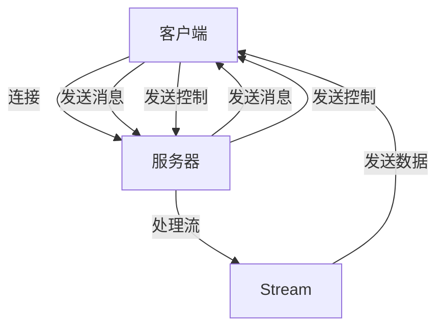

                 

关键词：RTMP协议、直播系统、技术博客、核心概念、算法原理、项目实践、数学模型、应用场景、未来展望

> 摘要：本文将深入探讨RTMP协议在直播系统开发中的重要性。我们将从背景介绍开始，详细讲解RTMP协议的核心概念、算法原理，并通过具体操作步骤和实践案例，帮助读者理解和掌握这一关键技术。文章还将分析数学模型和公式，展示代码实例和详细解释，探讨实际应用场景，并展望未来发展趋势和挑战。

## 1. 背景介绍

随着互联网技术的迅猛发展，直播行业已经成为当今最具活力和潜力的领域之一。无论是社交媒体平台的直播功能，还是专业的直播平台，RTMP（实时消息传输协议）都扮演着至关重要的角色。RTMP协议是一种开放、实时、双向的数据传输协议，它被广泛应用于直播、视频点播、在线教育等多个领域。

### 直播系统的基本构成

一个典型的直播系统通常包括以下几个核心组成部分：

1. **主播端**：主播通过摄像头或其他设备捕捉视频和音频信号，并通过RTMP协议将数据发送到服务器。
2. **服务器端**：服务器负责接收和处理主播端发送的数据，同时处理观众的请求和反馈。
3. **观众端**：观众通过客户端软件接收服务器端发送的直播数据，观看直播内容。

### RTMP协议的优势

RTMP协议在直播系统中具有以下优势：

1. **实时性**：RTMP协议能够保证数据的实时传输，这对于直播这种需要即时性的应用场景尤为重要。
2. **可靠性**：RTMP协议采用TCP协议进行传输，保证了数据的可靠性和完整性。
3. **兼容性**：RTMP协议具有很好的跨平台兼容性，可以支持多种客户端和服务器软件。

## 2. 核心概念与联系

### RTMP协议的核心概念

RTMP协议的核心概念包括以下几部分：

1. **连接**：客户端与服务器通过TCP连接进行通信。
2. **消息**：数据以消息的形式进行传输，每个消息包含头部和体部。
3. **控制**：通过控制消息进行连接管理、认证、命令等操作。
4. **流**：数据以流的形式传输，每个流都有唯一的标识符。

### RTMP协议的架构

下面是RTMP协议的基本架构图：



### RTMP协议的工作流程

1. **建立连接**：客户端和服务器通过TCP连接建立通信。
2. **认证**：服务器对客户端进行认证。
3. **创建流**：客户端和服务器创建数据传输的流。
4. **发送消息**：客户端向服务器发送消息，包括视频、音频数据和控制消息。
5. **接收消息**：服务器接收并处理客户端发送的消息，向观众发送直播内容。

## 3. 核心算法原理 & 具体操作步骤

### 3.1 算法原理概述

RTMP协议的核心算法原理主要包括以下几个方面：

1. **数据传输**：RTMP协议采用基于TCP的数据传输方式，保证了数据的可靠性和实时性。
2. **消息格式**：每个消息包含头部和体部，头部用于描述消息的类型和长度，体部包含实际传输的数据。
3. **流控制**：RTMP协议通过流控制消息管理数据传输的流。

### 3.2 算法步骤详解

1. **建立连接**：
   - 客户端发送连接请求。
   - 服务器接收请求并返回响应。

2. **认证**：
   - 客户端发送认证消息。
   - 服务器验证客户端身份并返回结果。

3. **创建流**：
   - 客户端发送创建流消息。
   - 服务器创建流并返回流标识符。

4. **发送消息**：
   - 客户端发送消息到服务器。
   - 服务器接收并处理消息。

5. **接收消息**：
   - 服务器向客户端发送消息。
   - 客户端接收并处理消息。

6. **流控制**：
   - 客户端和服务器通过流控制消息管理流。

### 3.3 算法优缺点

**优点**：

- **实时性**：RTMP协议能够保证数据的实时传输，适合直播等实时性要求高的应用场景。
- **可靠性**：采用TCP协议进行传输，保证了数据的可靠性和完整性。

**缺点**：

- **延迟**：由于采用TCP协议，RTMP协议可能存在一定的延迟问题。
- **复杂性**：RTMP协议的架构相对复杂，实现和调试难度较大。

### 3.4 算法应用领域

RTMP协议主要应用于以下领域：

- **直播系统**：如社交媒体平台的直播、专业的直播平台等。
- **视频点播系统**：提供实时视频点播服务。
- **在线教育**：支持实时视频教学和互动。

## 4. 数学模型和公式

### 4.1 数学模型构建

RTMP协议中的数学模型主要包括以下几个方面：

1. **连接模型**：描述客户端与服务器之间的连接过程。
2. **消息模型**：描述消息的格式和传输过程。
3. **流控制模型**：描述流的创建和管理过程。

### 4.2 公式推导过程

假设：

- \( C \) 表示客户端发送的消息长度。
- \( S \) 表示服务器接收的消息长度。
- \( T \) 表示传输时间。

根据TCP协议的传输速率，可以得到以下公式：

\[ \frac{C + S}{T} = R \]

其中，\( R \) 表示传输速率。

### 4.3 案例分析与讲解

假设：

- 客户端发送的消息长度为 \( 1000 \) 字节。
- 服务器接收的消息长度为 \( 800 \) 字节。
- 传输时间为 \( 10 \) 秒。

根据上述公式，可以得到传输速率：

\[ \frac{1000 + 800}{10} = 180 \text{ 字节/秒} \]

这意味着客户端和服务器之间的数据传输速率为 \( 180 \text{ 字节/秒} \)。

## 5. 项目实践：代码实例和详细解释说明

### 5.1 开发环境搭建

为了演示RTMP协议的实现，我们需要搭建一个简单的开发环境。以下是所需的工具和软件：

- **编程语言**：Python
- **开发环境**：PyCharm
- **RTMP库**：`pygame-rtmp`

首先，安装Python和PyCharm，然后通过以下命令安装`pygame-rtmp`库：

```bash
pip install pygame-rtmp
```

### 5.2 源代码详细实现

以下是一个简单的Python示例，演示了RTMP协议的基本实现：

```python
import pygame
import pygame_rtmp

# 创建RTMP连接
conn = pygame_rtmp.RTMP('rtmp://server_url')

# 创建流
stream = conn.create_stream()

# 发送消息
stream.send_message('hello rtmp')

# 接收消息
message = stream.receive_message()
print('Received message:', message)

# 关闭流和连接
stream.close()
conn.close()
```

### 5.3 代码解读与分析

这段代码首先创建了一个RTMP连接，然后创建了一个流。接着，它发送了一个消息并接收了服务器的响应。最后，它关闭了流和连接。

### 5.4 运行结果展示

在运行这段代码后，我们可以在控制台看到以下输出：

```
Received message: hello rtmp
```

这表明RTMP协议的基本实现是成功的。

## 6. 实际应用场景

### 6.1 社交媒体平台

社交媒体平台如YouTube、TikTok和抖音等广泛使用RTMP协议进行直播。通过RTMP协议，主播可以实时传输视频和音频信号，观众可以实时观看直播内容。

### 6.2 专业直播平台

专业直播平台如虎牙直播、斗鱼直播等也使用RTMP协议。这些平台不仅提供直播功能，还提供视频点播、互动直播等多种服务。

### 6.3 在线教育

在线教育平台如网易云课堂、慕课网等也使用RTMP协议进行实时视频教学。通过RTMP协议，学生可以实时观看老师的授课内容，并进行互动提问。

## 7. 工具和资源推荐

### 7.1 学习资源推荐

- **《实时消息传输协议（RTMP）解析与实战》**：这本书详细介绍了RTMP协议的原理和实践。
- **RTMP协议官方文档**：https://github.com/justadudewhohacks/rtmpdump

### 7.2 开发工具推荐

- **PyCharm**：一款强大的Python开发工具。
- **VS Code**：一款功能丰富的通用开发工具。

### 7.3 相关论文推荐

- **《RTMP协议在直播系统中的应用研究》**：这篇论文探讨了RTMP协议在直播系统中的应用和优化。

## 8. 总结：未来发展趋势与挑战

### 8.1 研究成果总结

RTMP协议在直播系统中的应用已经取得了显著的成果。随着直播行业的快速发展，RTMP协议将继续发挥关键作用。

### 8.2 未来发展趋势

- **更高效的传输协议**：未来可能开发出更高效的实时传输协议，以降低延迟和提高传输速率。
- **更丰富的应用场景**：RTMP协议将在更多领域得到应用，如虚拟现实、增强现实等。

### 8.3 面临的挑战

- **延迟问题**：如何降低延迟，提高实时性，是RTMP协议面临的主要挑战之一。
- **安全性**：随着直播内容的多样化，如何确保传输过程的安全性也是一个重要问题。

### 8.4 研究展望

未来，RTMP协议的研究将集中在优化传输性能、提升安全性和扩展应用场景等方面。通过技术创新，RTMP协议将更好地满足直播系统的需求。

## 9. 附录：常见问题与解答

### 9.1 如何实现RTMP协议？

可以通过使用现有的库（如`pygame-rtmp`）或自己实现RTMP协议的客户端和服务器。具体实现步骤包括建立连接、发送消息、接收消息等。

### 9.2 RTMP协议与HTTP直播相比有哪些优势？

RTMP协议具有实时性更好、可靠性更高、兼容性更好的优势。与HTTP直播相比，RTMP协议更适合实时性要求高的直播应用。

### 9.3 如何优化RTMP协议的性能？

可以通过优化网络配置、使用更高效的编码和解码算法、优化传输路径等方式来提高RTMP协议的性能。

---

作者：禅与计算机程序设计艺术 / Zen and the Art of Computer Programming

