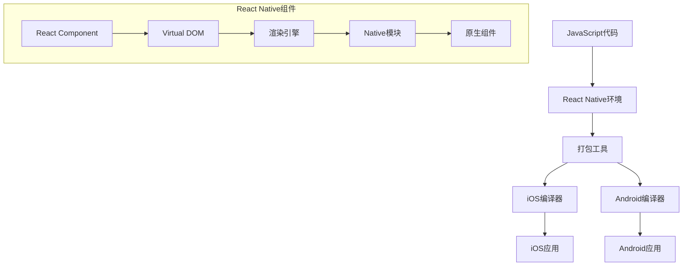

                 

React Native是一种流行的跨平台移动应用开发框架，它允许开发者使用JavaScript和React来创建原生iOS和Android应用。由于其高效性、可重用代码和丰富的组件库，React Native已经成为移动应用开发的首选技术之一。本文将深入探讨React Native的核心概念、开发流程、优缺点以及未来发展趋势。

## 文章关键词

- React Native
- 跨平台移动应用开发
- JavaScript
- 原生应用
- iOS
- Android

## 文章摘要

本文将详细介绍React Native的技术原理、开发流程和实际应用。我们将从React Native的背景介绍开始，逐步深入到其核心概念、算法原理、数学模型、项目实践以及未来发展趋势。通过本文的学习，读者将全面了解React Native的优势和应用场景，并能够掌握其开发技巧和最佳实践。

## 1. 背景介绍

React Native起源于Facebook，它的目标是提供一个统一的开发体验，使开发者能够使用JavaScript来构建iOS和Android应用。React Native通过使用React的虚拟DOM机制，使得开发者能够编写一次代码，同时运行在iOS和Android平台上。这种跨平台的能力极大地提高了开发效率，减少了重复劳动。

在传统的移动应用开发中，开发者通常需要分别使用Objective-C或Swift（iOS）和Java或Kotlin（Android）来编写代码。这不仅增加了学习成本，还可能导致代码冗余和维护困难。而React Native的出现，打破了这种界限，使得开发者可以使用熟悉的JavaScript语言进行开发，从而降低了学习曲线。

### 1.1 React Native的发展历程

- 2015年：Facebook首次发布了React Native。
- 2016年：React Native 0.13版发布，引入了更多原生组件和改进的性能。
- 2017年：React Native 0.50版发布，引入了新架构，包括React Native Paper等丰富的UI组件库。
- 2020年：React Native 0.61版发布，实现了与React 16.x的兼容，并引入了更多新特性和优化。

### 1.2 React Native的核心优势

- **跨平台开发**：使用JavaScript编写代码，同时支持iOS和Android平台。
- **热更新**：React Native支持热更新功能，无需重新编译和部署，大大提高了开发效率。
- **组件化开发**：通过组件化的方式，使得代码更加模块化和可重用。
- **丰富的生态**：拥有大量的开源库和组件，可以快速构建应用。

## 2. 核心概念与联系

在深入探讨React Native之前，我们需要理解其核心概念和工作原理。以下是一个简化的Mermaid流程图，展示了React Native的主要组件和流程：



### 2.1 React Native组件

React Native的核心是React组件，这些组件可以看作是原生的UI组件，它们通过虚拟DOM实现高效的渲染。React组件允许开发者使用JavaScript编写UI界面，并且可以轻松地组合和复用。

### 2.2 虚拟DOM

React Native使用虚拟DOM来管理应用的状态和界面更新。虚拟DOM是一个轻量级的对象模型，它代表了实际的DOM结构。当组件的状态发生变化时，React会自动比较虚拟DOM和实际DOM的差异，并仅更新发生变化的部分，从而提高了渲染性能。

### 2.3 渲染引擎

React Native的渲染引擎负责将JavaScript代码转换为原生组件。渲染引擎使用JavaScriptCore（iOS）和ChakraCore（Android）来执行JavaScript代码，并将其转换为原生视图。

### 2.4 Native模块

Native模块是React Native中用于与原生代码交互的组件。它们允许开发者使用JavaScript调用原生API，从而实现复杂的原生功能。

### 2.5 原生组件

原生组件是React Native提供的用于构建原生界面的UI组件。这些组件与原生应用中的组件完全相同，可以无缝地集成到React Native应用中。

## 3. 核心算法原理 & 具体操作步骤

### 3.1 算法原理概述

React Native的核心算法是基于React的虚拟DOM机制。虚拟DOM是一种抽象的数据结构，它代表了实际DOM的快照。React Native使用虚拟DOM来跟踪组件的状态和属性变化，并自动更新界面。

具体来说，React Native的工作流程如下：

1. **状态更新**：当组件的状态或属性发生变化时，React Native会触发更新过程。
2. **虚拟DOM比较**：React Native比较新虚拟DOM和旧虚拟DOM的差异。
3. **差异更新**：React Native仅更新实际DOM中发生变化的部分，而不是整个DOM结构。

### 3.2 算法步骤详解

1. **状态更新**：当用户操作或数据更新时，React Native触发状态更新。
2. **构建新虚拟DOM**：React Native根据最新的状态构建新的虚拟DOM。
3. **比较虚拟DOM**：React Native比较新虚拟DOM和旧虚拟DOM的差异。
4. **更新DOM**：React Native仅更新实际DOM中发生变化的部分。
5. **完成更新**：React Native完成DOM更新后，通知渲染引擎进行界面渲染。

### 3.3 算法优缺点

**优点**：

- **高效性**：React Native通过虚拟DOM实现高效的渲染，减少了DOM操作的开销。
- **组件化**：React Native支持组件化开发，使得代码更加模块化和可重用。
- **跨平台**：React Native可以同时支持iOS和Android平台，提高了开发效率。

**缺点**：

- **性能瓶颈**：在某些复杂场景下，React Native的性能可能不如原生应用。
- **生态不完善**：虽然React Native的生态逐渐完善，但仍然存在一些功能不完善的库和组件。

### 3.4 算法应用领域

React Native广泛应用于各种类型的移动应用，包括：

- **电商应用**：如淘宝、京东等，React Native可以提高开发效率，并保证应用的性能。
- **社交应用**：如微信、微博等，React Native可以提供良好的用户体验和跨平台支持。
- **金融应用**：如支付宝、银行App等，React Native可以提高开发效率和安全性。

## 4. 数学模型和公式 & 详细讲解 & 举例说明

### 4.1 数学模型构建

在React Native中，数学模型主要用于描述组件的状态和行为。以下是一个简单的数学模型示例：

```latex
\begin{equation}
\text{Component State} = f(\text{Props}, \text{State})
\end{equation}
```

其中，`Props` 表示组件的属性，`State` 表示组件的状态，`f` 表示状态更新函数。

### 4.2 公式推导过程

假设一个React Native组件的状态为 `state = {count: 0}`，属性为 `props = {increment: 1}`。状态更新函数 `f` 可以表示为：

```latex
\begin{equation}
\text{newState} = f(\text{Props}, \text{State}) = \text{State} + \text{Props}
\end{equation}
```

当组件的属性或状态发生变化时，可以通过公式计算新的状态。

### 4.3 案例分析与讲解

假设有一个计数器组件，初始状态为 `state = {count: 0}`。当用户点击按钮时，组件的属性 `props` 发生变化，`props = {increment: 1}`。状态更新函数 `f` 可以计算新的状态：

```latex
\begin{equation}
\text{newState} = f(\text{Props}, \text{State}) = \text{State} + \text{Props} = {count: 0} + {increment: 1} = {count: 1}
\end{equation}
```

通过更新状态，React Native将重新渲染组件，显示新的计数结果。

## 5. 项目实践：代码实例和详细解释说明

### 5.1 开发环境搭建

要在本地开发React Native应用，首先需要安装Node.js和React Native CLI。以下是一个简单的安装步骤：

1. 安装Node.js：从 [Node.js官网](https://nodejs.org/) 下载并安装最新版本的Node.js。
2. 安装React Native CLI：打开终端，执行以下命令：

```bash
npm install -g react-native-cli
```

### 5.2 源代码详细实现

以下是一个简单的React Native计数器应用的源代码：

```jsx
import React, { useState } from 'react';
import { StyleSheet, Text, View, Button } from 'react-native';

const Counter = () => {
  const [count, setCount] = useState(0);

  const incrementCount = () => {
    setCount(count + 1);
  };

  return (
    <View style={styles.container}>
      <Text>Count: {count}</Text>
      <Button title="Increment" onPress={incrementCount} />
    </View>
  );
};

const styles = StyleSheet.create({
  container: {
    flex: 1,
    justifyContent: 'center',
    alignItems: 'center',
  },
});

export default Counter;
```

### 5.3 代码解读与分析

1. **组件结构**：`Counter` 组件是一个函数组件，它接收 `props` 并返回一个 JSX 元素。
2. **状态管理**：使用 `useState` 钩子来管理组件的状态，`count` 表示当前的计数值。
3. **事件处理**：使用 `onPress` 属性绑定一个事件处理函数 `incrementCount`，当按钮被点击时，更新状态并重新渲染组件。

### 5.4 运行结果展示

运行上述代码后，将看到一个简单的计数器界面，用户可以点击按钮来增加计数。

```bash
npx react-native run-android
```

或者

```bash
npx react-native run-ios
```

## 6. 实际应用场景

React Native适用于多种实际应用场景，以下是一些典型的案例：

### 6.1 社交应用

React Native可以用于构建社交应用，如微博、微信等。这些应用通常需要处理大量的用户数据和复杂的界面交互，React Native的高效渲染和跨平台能力可以满足这些需求。

### 6.2 电商应用

电商应用通常需要提供良好的用户体验和快速的页面响应。React Native可以帮助开发者快速构建功能丰富的电商应用，同时保持高性能。

### 6.3 金融应用

金融应用对安全性和稳定性要求极高，React Native可以通过热更新快速修复漏洞和改进功能，同时保证应用的安全性。

### 6.4 教育应用

教育应用通常需要提供丰富的内容和交互体验，React Native可以轻松实现这些功能，同时支持多种平台。

## 7. 工具和资源推荐

### 7.1 学习资源推荐

- [官方文档](https://reactnative.dev/docs/getting-started)
- [React Native School](https://reactnativeschool.com/)
- [React Native Academy](https://reactnative.academy/)

### 7.2 开发工具推荐

- [React Native CLI](https://reactnative.dev/docs/cli)
- [React Native Debugger](https://github.com/facebook/react-native/tree/master/packages/react-native-debugger)
- [React Native for Web](https://reactnative.dev/docs/web)

### 7.3 相关论文推荐

- "The React Native Approach to Mobile Development" by Christian Hersche
- "Cross-Platform Mobile Development with React Native" by Fulvio Rodio
- "React Native: Unlocking the Power of JavaScript for Mobile Development" by Jaisen Mathai

## 8. 总结：未来发展趋势与挑战

### 8.1 研究成果总结

React Native在过去几年中取得了显著的研究成果，成为移动应用开发的明星技术。其跨平台能力、高效的渲染机制和丰富的组件库为开发者带来了极大的便利。

### 8.2 未来发展趋势

- **性能优化**：React Native将继续优化性能，以应对更复杂的应用场景。
- **生态扩展**：React Native的生态系统将不断扩展，包括更多高质量的库和组件。
- **混合开发**：React Native与原生开发技术的结合，将推动混合开发模式的兴起。

### 8.3 面临的挑战

- **性能瓶颈**：在某些场景下，React Native的性能可能无法满足用户需求。
- **生态不完善**：虽然React Native的生态逐渐完善，但仍存在一些功能不完善的库和组件。

### 8.4 研究展望

React Native在未来将继续发展，有望成为移动应用开发的基石技术。开发者应该关注React Native的最新动态，掌握其开发技巧和最佳实践，以应对不断变化的市场需求。

## 9. 附录：常见问题与解答

### 9.1 Q：React Native与原生应用相比，性能如何？

A：React Native的性能通常可以满足大多数应用的需求，但在处理复杂计算或大量数据时，可能不如原生应用。React Native通过虚拟DOM和优化的渲染机制来提高性能，但仍然存在一定的性能瓶颈。

### 9.2 Q：React Native是否支持Web开发？

A：是的，React Native for Web使React Native应用可以运行在Web浏览器上，从而实现跨平台Web开发。

### 9.3 Q：React Native如何进行原生模块开发？

A：React Native的原生模块开发主要通过Objective-C或Swift（iOS）和Java或Kotlin（Android）编写，并与JavaScript代码进行交互。

### 9.4 Q：React Native如何进行热更新？

A：React Native支持热更新功能，开发者可以使用 `react-native-update` 库或其他热更新工具来更新应用。

### 9.5 Q：React Native有哪些优缺点？

A：优点包括跨平台开发、组件化、热更新等；缺点包括性能瓶颈、生态不完善等。

---

本文详细介绍了React Native的跨平台移动应用开发技术，从背景介绍、核心概念、算法原理、数学模型、项目实践到实际应用场景，全面阐述了React Native的优势和挑战。通过本文的学习，读者将能够掌握React Native的核心技术和开发技巧，为未来的移动应用开发奠定坚实的基础。

---

**作者：禅与计算机程序设计艺术 / Zen and the Art of Computer Programming**。如果您有任何疑问或建议，请随时在评论区留言。希望本文对您有所帮助！

