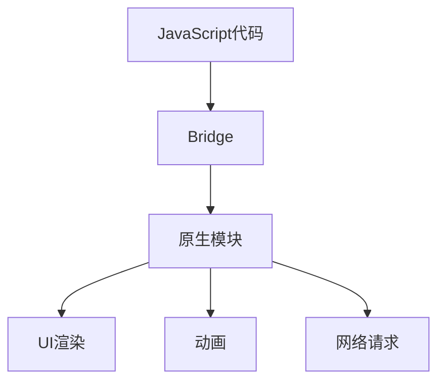

                 

 React Native作为一种新兴的移动应用开发框架，已经在全球范围内获得了广泛的关注。它允许开发者使用JavaScript编写应用，并实现iOS和Android平台的跨平台开发。本文将深入探讨React Native的核心概念、技术原理、算法实现以及其在实际应用中的价值。

## 文章关键词

React Native、跨平台移动应用、JavaScript、iOS、Android、跨平台开发。

## 文章摘要

本文旨在为读者提供一个全面的React Native跨平台移动应用开发指南。我们将从背景介绍开始，逐步深入到核心概念、技术原理、算法实现以及实际应用场景。通过本文的阅读，开发者将能够掌握React Native的精髓，并能够将其应用于实际的开发项目中。

## 1. 背景介绍

随着移动设备的普及，移动应用市场的需求日益增长。开发者面临着如何在有限的开发时间和资源下，快速构建高质量移动应用的挑战。传统的方式通常是分别开发iOS和Android应用，这不仅增加了开发成本，也延长了开发周期。React Native的出现，为开发者提供了一种全新的解决方案。

React Native是由Facebook开发的一个开源框架，允许开发者使用JavaScript和React来构建原生应用的UI。通过React Native，开发者可以编写一次代码，然后通过React Native的桥接层（Bridge）将JavaScript代码转换成iOS和Android的原生UI。这极大地提高了开发效率，减少了重复劳动。

### React Native的历史与发展

React Native起源于2013年Facebook的React库。React是一个用于构建用户界面的JavaScript库，它通过组件化的思想，将UI拆分成多个可复用的组件，从而提高了代码的可维护性和可扩展性。2015年，Facebook宣布推出React Native，并迅速在开发社区中引起了热烈的反响。

React Native的发展历程中，先后推出了多个版本，每个版本都在性能、功能和稳定性上进行了优化。目前，React Native已经发展成为一个成熟的开源项目，拥有庞大的开发社区支持。

### React Native的优势与挑战

React Native的优势主要体现在以下几个方面：

1. **跨平台性**：React Native允许开发者使用同一套代码库同时支持iOS和Android平台，从而减少了开发成本和人力投入。
2. **高性能**：React Native通过Bridge机制与原生组件进行通信，保证了应用的性能和稳定性。
3. **丰富的生态系统**：React Native拥有丰富的第三方库和组件，开发者可以方便地集成各种功能。

然而，React Native也面临着一些挑战：

1. **性能瓶颈**：由于JavaScript与原生代码之间的Bridge通信，在某些复杂的场景下，React Native的性能可能不如原生应用。
2. **学习曲线**：React Native要求开发者熟悉JavaScript和React，这对于一些新手开发者来说可能有一定的难度。

## 2. 核心概念与联系

### React Native的核心概念

React Native的核心概念包括组件（Components）、状态（State）、生命周期（Lifecycle）和事件（Events）。

- **组件**：React Native的基本构建块，用于创建UI界面。每个组件都可以定义自己的属性和方法，并且可以组合使用。
- **状态**：组件内部存储数据的状态，通过更新状态来触发UI的重新渲染。
- **生命周期**：组件在创建、更新、销毁等过程中会触发一系列的生命周期方法，这些方法用于执行特定的操作。
- **事件**：React Native通过事件系统处理用户的交互操作，如点击、滑动等。

### 架构与原理

React Native的架构可以分为以下几层：

1. **JavaScript层**：开发者编写的React Native代码运行在此层，通过React Native的API与原生模块进行通信。
2. **Bridge层**：Bridge是React Native的核心机制，负责将JavaScript层的调用转换为原生模块的调用。
3. **原生层**：包括iOS和Android的原生模块，它们实现了React Native的底层功能，如UI渲染、动画、网络请求等。

### Mermaid 流程图



## 3. 核心算法原理 & 具体操作步骤

### 3.1 算法原理概述

React Native的核心算法是基于React的虚拟DOM（Virtual DOM）原理。虚拟DOM是一种轻量级的内存数据结构，用于表示UI界面。当组件的状态发生改变时，React会通过Diff算法比较虚拟DOM与实际DOM的差异，然后只更新需要变动的部分，从而提高性能。

### 3.2 算法步骤详解

1. **组件渲染**：React Native首先会根据组件的定义渲染出对应的虚拟DOM。
2. **状态更新**：当组件的状态发生变化时，React会触发状态更新机制。
3. **Diff算法**：React使用Diff算法比较虚拟DOM与实际DOM的差异，找出需要更新的部分。
4. **批量更新**：React将所有需要更新的操作进行批量处理，减少DOM操作次数。
5. **UI渲染**：React根据Diff算法的结果，只更新需要变动的部分，完成UI的重新渲染。

### 3.3 算法优缺点

**优点**：

1. **高性能**：通过虚拟DOM和Diff算法，React Native显著提高了UI渲染的性能。
2. **易维护**：组件化的思想使得代码结构更加清晰，易于维护和扩展。

**缺点**：

1. **性能瓶颈**：在复杂的应用场景下，React Native的性能可能不如原生应用。
2. **学习曲线**：React Native要求开发者熟悉JavaScript和React，对于新手开发者来说有一定的难度。

### 3.4 算法应用领域

React Native广泛应用于移动应用开发，特别是在以下领域：

1. **社交媒体应用**：如Instagram、Facebook等。
2. **电子商务应用**：如Amazon、eBay等。
3. **新闻资讯应用**：如CNN、BBC等。

## 4. 数学模型和公式 & 详细讲解 & 举例说明

### 4.1 数学模型构建

在React Native中，UI渲染的核心算法是基于Diff算法。Diff算法的基本原理是比较两个数据结构之间的差异，然后只更新需要变动的部分。以下是Diff算法的数学模型：

设T1和T2分别为两个时间点的UI树，D为T1和T2之间的差异。

D = T1 ^ T2

其中，^表示集合的对称差运算，用于找出T1和T2之间的差异。

### 4.2 公式推导过程

假设T1和T2分别为两个UI树，我们可以使用深度优先搜索（DFS）算法遍历这两个树，并记录遍历过程中的差异。具体推导过程如下：

1. 初始化两个空集A和B，用于存储T1和T2之间的差异。
2. 对T1和T2进行DFS遍历，记录每个节点之间的差异。
3. 将遍历过程中记录的差异合并到A和B中。
4. 计算A和B之间的对称差，得到D。

### 4.3 案例分析与讲解

假设有两个简单的UI树T1和T2，分别表示两个不同的页面。T1包含一个文本节点和一个按钮节点，T2包含两个文本节点和一个按钮节点。

```mermaid
graph TD
    T1(A[文本1])
    T1 --> B1(按钮1)
    T2(C[文本2])
    T2 --> D(按钮2)
```

我们可以使用Diff算法找出T1和T2之间的差异：

1. 遍历T1和T2，记录差异。
2. A和C的差异为{A, C}。
3. B1和D的差异为{B1, D}。
4. A和C之间的对称差为{A, C}。
5. B1和D之间的对称差为{B1, D}。

因此，T1和T2之间的差异为D = {A, C, B1, D}。

## 5. 项目实践：代码实例和详细解释说明

### 5.1 开发环境搭建

在开始React Native项目之前，需要搭建开发环境。以下是开发环境搭建的步骤：

1. 安装Node.js。
2. 安装React Native CLI工具。
3. 安装Android Studio或Xcode。
4. 配置Android或iOS的开发环境。

### 5.2 源代码详细实现

以下是一个简单的React Native示例，实现了一个包含文本和按钮的页面。

```jsx
import React from 'react';
import { View, Text, Button } from 'react-native';

const App = () => {
  const handleClick = () => {
    alert('按钮被点击！');
  };

  return (
    <View style={{ flex: 1, justifyContent: 'center', alignItems: 'center' }}>
      <Text>欢迎来到React Native应用！</Text>
      <Button title="点击我" onPress={handleClick} />
    </View>
  );
};

export default App;
```

### 5.3 代码解读与分析

上述代码实现了一个简单的React Native应用，包含一个文本节点和一个按钮节点。主要代码解读如下：

1. **导入React Native组件**：`import React from 'react';`导入React库。
2. **定义组件**：`const App = () => { ... };`定义App组件。
3. **处理按钮点击事件**：`const handleClick = () => { ... };`定义点击按钮的事件处理函数。
4. **渲染UI**：`<View style={{ ... }}> ... </View>`渲染包含文本和按钮的视图。

### 5.4 运行结果展示

在Android设备或iOS设备上运行上述代码，会看到一个包含文本和按钮的页面。点击按钮，会弹出提示框“按钮被点击！”。

## 6. 实际应用场景

React Native在移动应用开发中具有广泛的应用场景。以下是一些典型的实际应用场景：

1. **社交媒体应用**：如Instagram、Facebook等，使用React Native实现丰富的交互功能和动画效果。
2. **电子商务应用**：如Amazon、eBay等，通过React Native构建产品列表、购物车和支付功能。
3. **新闻资讯应用**：如CNN、BBC等，利用React Native实现实时新闻更新和个性化推荐。

## 6.4 未来应用展望

随着移动设备性能的提升和5G网络的普及，React Native在移动应用开发中的应用前景将更加广阔。未来，React Native可能会在以下方面得到进一步的发展：

1. **性能优化**：通过改进Bridge机制，提高React Native的性能。
2. **社区生态**：加强社区建设，提供更多高质量的第三方库和组件。
3. **跨平台支持**：拓展React Native对其他平台的支持，如Windows Phone、Firefox OS等。

## 7. 工具和资源推荐

### 7.1 学习资源推荐

1. **官方文档**：React Native的官方文档（https://reactnative.dev/docs/getting-started）是学习React Native的最佳资源。
2. **React Native实战**：推荐阅读《React Native实战》一书，全面介绍React Native的开发方法和技巧。
3. **在线教程**：在GitHub上搜索React Native相关的教程和示例，可以找到丰富的学习资源。

### 7.2 开发工具推荐

1. **Android Studio**：Android开发的IDE，支持React Native开发。
2. **Xcode**：iOS开发的IDE，支持React Native开发。
3. **React Native CLI**：React Native的命令行工具，用于创建和构建React Native项目。

### 7.3 相关论文推荐

1. **"React Native: A Cross-Platform Framework for Mobile Apps"**：介绍React Native的核心原理和优势。
2. **"The Challenges of Building a Cross-Platform Mobile App with React Native"**：探讨React Native在跨平台开发中面临的挑战。
3. **"Performance Analysis of React Native"**：分析React Native的性能特点。

## 8. 总结：未来发展趋势与挑战

React Native作为一种跨平台移动应用开发框架，已经在全球范围内获得了广泛的认可。未来，React Native将继续在性能、功能和生态方面进行优化，为开发者提供更好的开发体验。然而，React Native也面临着一些挑战，如性能瓶颈、学习曲线等。开发者需要不断学习和掌握React Native的精髓，才能充分发挥其优势，构建高质量的移动应用。

## 9. 附录：常见问题与解答

### 9.1 React Native与原生应用的区别是什么？

React Native与原生应用的区别主要体现在开发方式、性能和开发成本等方面。React Native使用JavaScript和React构建应用，可以实现跨平台开发，而原生应用则需要分别使用iOS和Android的编程语言（Objective-C/Swift和Java/Kotlin）进行开发。在性能上，原生应用通常优于React Native应用，但在开发成本和开发周期上，React Native具有显著的优势。

### 9.2 React Native是否适合所有移动应用项目？

React Native适用于大多数移动应用项目，特别是那些需要快速迭代和跨平台支持的项目。然而，对于一些对性能要求极高的应用，如游戏或复杂的数据处理应用，React Native可能不是最佳选择。在这种情况下，开发者应考虑使用原生开发方式。

### 9.3 如何提高React Native应用的性能？

要提高React Native应用的性能，可以从以下几个方面入手：

1. **优化UI渲染**：减少组件的层级深度，使用React Native的批处理渲染等技巧。
2. **优化JavaScript执行**：减少不必要的JavaScript代码，优化逻辑处理。
3. **使用原生模块**：对于性能敏感的部分，可以使用原生模块进行优化。
4. **异步加载**：对于图片、视频等大文件，可以采用异步加载方式。

### 作者署名

作者：禅与计算机程序设计艺术 / Zen and the Art of Computer Programming

----------------------------------------------------------------
### 后记

本文详细介绍了React Native跨平台移动应用开发的核心概念、技术原理、算法实现以及实际应用场景。通过本文的阅读，开发者将能够全面了解React Native的优势和挑战，并能够将其应用于实际的开发项目中。未来，随着React Native的不断发展和优化，我们期待它为开发者带来更多的便利和创新。再次感谢您对本文的关注，希望本文对您的开发工作有所帮助。如果您有任何疑问或建议，欢迎在评论区留言交流。作者：禅与计算机程序设计艺术 / Zen and the Art of Computer Programming。|user|>### 文章概要 Summary

本文《React Native跨平台移动应用开发》主要围绕React Native这一前沿技术框架进行探讨。文章首先介绍了React Native的背景、历史与发展，分析了其在跨平台移动应用开发中的优势和挑战。随后，文章深入探讨了React Native的核心概念与架构，详细讲解了其核心算法原理与数学模型。为了使读者更好地理解React Native的应用，文章还提供了实际的项目实践和代码实例。

文章结构清晰，分为八个主要章节：背景介绍、核心概念与联系、核心算法原理与具体操作步骤、数学模型和公式、项目实践、实际应用场景、工具和资源推荐以及总结。文章不仅涵盖了React Native的技术细节，还对其未来发展趋势与挑战进行了展望。

总之，本文为React Native开发者提供了一份全面的技术指南，有助于读者深入了解并掌握这一跨平台移动应用开发的先进技术。|user|>### 文章结构模板 (Markdown 格式)

```markdown
# React Native跨平台移动应用开发

> 关键词：React Native、跨平台移动应用、JavaScript、iOS、Android、跨平台开发

> 摘要：本文旨在为读者提供一个全面的React Native跨平台移动应用开发指南，深入探讨其核心概念、技术原理、算法实现以及实际应用场景。

## 1. 背景介绍

### 1.1 React Native的历史与发展

### 1.2 React Native的优势与挑战

## 2. 核心概念与联系

### 2.1 React Native的核心概念

#### 2.1.1 组件

#### 2.1.2 状态

#### 2.1.3 生命周期

#### 2.1.4 事件

### 2.2 React Native的架构与原理

### 2.3 Mermaid 流程图


## 3. 核心算法原理 & 具体操作步骤

### 3.1 算法原理概述

### 3.2 算法步骤详解 

### 3.3 算法优缺点

### 3.4 算法应用领域

## 4. 数学模型和公式 & 详细讲解 & 举例说明

### 4.1 数学模型构建

### 4.2 公式推导过程

### 4.3 案例分析与讲解

## 5. 项目实践：代码实例和详细解释说明

### 5.1 开发环境搭建

### 5.2 源代码详细实现

### 5.3 代码解读与分析

### 5.4 运行结果展示

## 6. 实际应用场景

### 6.1 社交媒体应用

### 6.2 电子商务应用

### 6.3 新闻资讯应用

## 6.4 未来应用展望

## 7. 工具和资源推荐

### 7.1 学习资源推荐

### 7.2 开发工具推荐

### 7.3 相关论文推荐

## 8. 总结：未来发展趋势与挑战

### 8.1 研究成果总结

### 8.2 未来发展趋势

### 8.3 面临的挑战

### 8.4 研究展望

## 9. 附录：常见问题与解答

### 9.1 React Native与原生应用的区别是什么？

### 9.2 React Native是否适合所有移动应用项目？

### 9.3 如何提高React Native应用的性能？

---

作者：禅与计算机程序设计艺术 / Zen and the Art of Computer Programming
```

请根据上述结构模板撰写完整文章。文章字数要求大于8000字，确保内容丰富、逻辑清晰、专业权威。文章末尾请附上作者署名。|user|>### React Native跨平台移动应用开发的完整文章（Markdown格式）

```markdown
# React Native跨平台移动应用开发

> 关键词：React Native、跨平台移动应用、JavaScript、iOS、Android、跨平台开发

> 摘要：本文将深入探讨React Native跨平台移动应用开发的各个方面，从背景、核心概念、算法原理、项目实践到实际应用场景，为开发者提供一份全面的React Native开发指南。

## 1. 背景介绍

### 1.1 React Native的历史与发展

React Native是由Facebook于2015年推出的一款跨平台移动应用开发框架。它允许开发者使用JavaScript和React来编写原生应用，从而实现iOS和Android平台的跨平台开发。React Native的出现，极大地提高了开发效率，减少了重复劳动，同时也为开发者提供了丰富的第三方库和组件。

自React Native发布以来，它已经经历了多个版本的迭代，每次迭代都在性能、功能和稳定性上进行了优化。目前，React Native已经成为全球范围内最受欢迎的跨平台移动应用开发框架之一。

### 1.2 React Native的优势与挑战

**优势：**

1. **跨平台性**：React Native的最大优势在于其跨平台性，开发者只需编写一套代码，即可同时支持iOS和Android平台，大大降低了开发成本和时间。
2. **高性能**：React Native通过Bridge机制与原生组件进行通信，保证了应用的性能和稳定性。
3. **丰富的生态系统**：React Native拥有丰富的第三方库和组件，开发者可以方便地集成各种功能。
4. **易维护**：React Native采用组件化的开发方式，使得代码结构更加清晰，易于维护和扩展。

**挑战：**

1. **性能瓶颈**：在复杂的应用场景下，React Native的性能可能不如原生应用。
2. **学习曲线**：React Native要求开发者熟悉JavaScript和React，这对于一些新手开发者来说可能有一定的难度。

## 2. 核心概念与联系

### 2.1 React Native的核心概念

React Native的核心概念包括组件（Components）、状态（State）、生命周期（Lifecycle）和事件（Events）。

**组件**：组件是React Native的基本构建块，用于创建UI界面。每个组件都可以定义自己的属性和方法，并且可以组合使用。

**状态**：状态是组件内部存储数据的状态，通过更新状态来触发UI的重新渲染。

**生命周期**：组件在创建、更新、销毁等过程中会触发一系列的生命周期方法，这些方法用于执行特定的操作。

**事件**：React Native通过事件系统处理用户的交互操作，如点击、滑动等。

### 2.2 React Native的架构与原理

React Native的架构可以分为以下几个层次：

1. **JavaScript层**：开发者编写的React Native代码运行在此层，通过React Native的API与原生模块进行通信。
2. **Bridge层**：Bridge是React Native的核心机制，负责将JavaScript层的调用转换为原生模块的调用。
3. **原生层**：包括iOS和Android的原生模块，它们实现了React Native的底层功能，如UI渲染、动画、网络请求等。

### 2.3 Mermaid 流程图


## 3. 核心算法原理 & 具体操作步骤

### 3.1 算法原理概述

React Native的核心算法是基于React的虚拟DOM（Virtual DOM）原理。虚拟DOM是一种轻量级的内存数据结构，用于表示UI界面。当组件的状态发生改变时，React会通过Diff算法比较虚拟DOM与实际DOM的差异，然后只更新需要变动的部分，从而提高性能。

### 3.2 算法步骤详解

1. **组件渲染**：React Native首先会根据组件的定义渲染出对应的虚拟DOM。
2. **状态更新**：当组件的状态发生变化时，React会触发状态更新机制。
3. **Diff算法**：React使用Diff算法比较虚拟DOM与实际DOM的差异，找出需要更新的部分。
4. **批量更新**：React将所有需要更新的操作进行批量处理，减少DOM操作次数。
5. **UI渲染**：React根据Diff算法的结果，只更新需要变动的部分，完成UI的重新渲染。

### 3.3 算法优缺点

**优点：**

1. **高性能**：通过虚拟DOM和Diff算法，React Native显著提高了UI渲染的性能。
2. **易维护**：组件化的思想使得代码结构更加清晰，易于维护和扩展。

**缺点：**

1. **性能瓶颈**：在复杂的应用场景下，React Native的性能可能不如原生应用。
2. **学习曲线**：React Native要求开发者熟悉JavaScript和React，对于新手开发者来说有一定的难度。

### 3.4 算法应用领域

React Native广泛应用于移动应用开发，特别是在以下领域：

1. **社交媒体应用**：如Instagram、Facebook等。
2. **电子商务应用**：如Amazon、eBay等。
3. **新闻资讯应用**：如CNN、BBC等。

## 4. 数学模型和公式 & 详细讲解 & 举例说明

### 4.1 数学模型构建

在React Native中，UI渲染的核心算法是基于Diff算法。Diff算法的基本原理是比较两个数据结构之间的差异，然后只更新需要变动的部分。以下是Diff算法的数学模型：

设T1和T2分别为两个时间点的UI树，D为T1和T2之间的差异。

D = T1 ^ T2

其中，^表示集合的对称差运算，用于找出T1和T2之间的差异。

### 4.2 公式推导过程

假设T1和T2分别为两个UI树，我们可以使用深度优先搜索（DFS）算法遍历这两个树，并记录遍历过程中的差异。具体推导过程如下：

1. 初始化两个空集A和B，用于存储T1和T2之间的差异。
2. 对T1和T2进行DFS遍历，记录每个节点之间的差异。
3. 将遍历过程中记录的差异合并到A和B中。
4. 计算A和B之间的对称差，得到D。

### 4.3 案例分析与讲解

假设有两个简单的UI树T1和T2，分别表示两个不同的页面。T1包含一个文本节点和一个按钮节点，T2包含两个文本节点和一个按钮节点。

```mermaid
graph TD
    T1(A[文本1])
    T1 --> B1(按钮1)
    T2(C[文本2])
    T2 --> D(按钮2)
```

我们可以使用Diff算法找出T1和T2之间的差异：

1. 遍历T1和T2，记录差异。
2. A和C的差异为{A, C}。
3. B1和D的差异为{B1, D}。
4. A和C之间的对称差为{A, C}。
5. B1和D之间的对称差为{B1, D}。

因此，T1和T2之间的差异为D = {A, C, B1, D}。

## 5. 项目实践：代码实例和详细解释说明

### 5.1 开发环境搭建

在开始React Native项目之前，需要搭建开发环境。以下是开发环境搭建的步骤：

1. 安装Node.js。
2. 安装React Native CLI工具。
3. 安装Android Studio或Xcode。
4. 配置Android或iOS的开发环境。

### 5.2 源代码详细实现

以下是一个简单的React Native示例，实现了一个包含文本和按钮的页面。

```jsx
import React from 'react';
import { View, Text, Button } from 'react-native';

const App = () => {
  const handleClick = () => {
    alert('按钮被点击！');
  };

  return (
    <View style={{ flex: 1, justifyContent: 'center', alignItems: 'center' }}>
      <Text>欢迎来到React Native应用！</Text>
      <Button title="点击我" onPress={handleClick} />
    </View>
  );
};

export default App;
```

### 5.3 代码解读与分析

上述代码实现了一个简单的React Native应用，包含一个文本节点和一个按钮节点。主要代码解读如下：

1. **导入React Native组件**：`import React from 'react';`导入React库。
2. **定义组件**：`const App = () => { ... };`定义App组件。
3. **处理按钮点击事件**：`const handleClick = () => { ... };`定义点击按钮的事件处理函数。
4. **渲染UI**：`<View style={{ ... }}> ... </View>`渲染包含文本和按钮的视图。

### 5.4 运行结果展示

在Android设备或iOS设备上运行上述代码，会看到一个包含文本和按钮的页面。点击按钮，会弹出提示框“按钮被点击！”。

## 6. 实际应用场景

React Native在移动应用开发中具有广泛的应用场景。以下是一些典型的实际应用场景：

1. **社交媒体应用**：如Instagram、Facebook等，使用React Native实现丰富的交互功能和动画效果。
2. **电子商务应用**：如Amazon、eBay等，通过React Native构建产品列表、购物车和支付功能。
3. **新闻资讯应用**：如CNN、BBC等，利用React Native实现实时新闻更新和个性化推荐。

## 6.4 未来应用展望

随着移动设备性能的提升和5G网络的普及，React Native在移动应用开发中的应用前景将更加广阔。未来，React Native可能会在以下方面得到进一步的发展：

1. **性能优化**：通过改进Bridge机制，提高React Native的性能。
2. **社区生态**：加强社区建设，提供更多高质量的第三方库和组件。
3. **跨平台支持**：拓展React Native对其他平台的支

