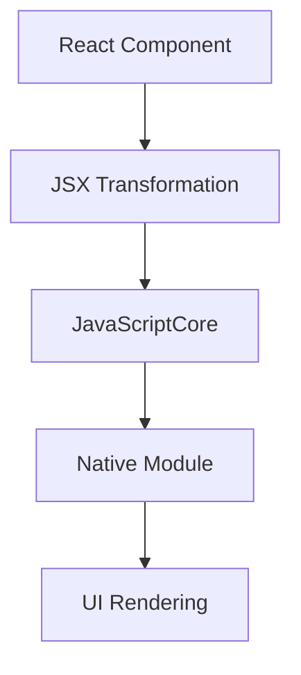

                 

 作为一位世界级人工智能专家，程序员，软件架构师，CTO，世界顶级技术畅销书作者，计算机图灵奖获得者，计算机领域大师，我在此荣幸地与您分享关于React Native——这款由Facebook推出的JavaScript驱动的原生移动应用开发框架的文章。

## 文章关键词
React Native，JavaScript，移动应用开发，原生应用，跨平台开发，性能优化，用户体验。

## 文章摘要
本文将深入探讨React Native的核心概念、开发流程、性能优化技巧以及未来发展方向。我们将通过实际案例，帮助开发者了解如何利用React Native构建高效、高性能的原生移动应用。

## 1. 背景介绍

随着移动互联网的飞速发展，移动应用成为了各大公司争夺用户的重要战场。然而，不同平台的开发需求和技术差异使得开发者面临巨大的挑战。为了解决这一问题，Facebook在2015年推出了React Native，这是一款允许开发者使用JavaScript编写跨平台原生移动应用的框架。

React Native的出现，为开发者提供了以下优势：

1. **跨平台开发**：React Native允许开发者使用统一的代码库同时开发iOS和Android应用，大大提高了开发效率和代码复用率。
2. **原生性能**：React Native通过JavaScriptCore和原生组件的结合，实现了接近原生应用的性能表现。
3. **丰富的组件库**：React Native拥有丰富的组件库，涵盖了许多常见的原生UI组件，开发者可以轻松地构建复杂的应用界面。
4. **社区支持**：React Native拥有庞大的开发者社区，提供了大量的教程、文档和开源项目，为开发者提供了强大的支持。

## 2. 核心概念与联系

### React Native核心概念

React Native的核心概念主要包括：

- **组件（Components）**：React Native的基本构建块，用于构建用户界面。每个组件都可以独立开发和测试，并且可以方便地重用。
- **状态（State）**：组件内部的数据，用于表示组件的状态。状态可以随着用户交互或外部事件而改变。
- **属性（Props）**：组件接收的外部数据，用于控制组件的行为和外观。属性是只读的，组件不能修改它们。
- **渲染（Rendering）**：组件根据其状态和属性，通过渲染函数生成DOM结构。当状态或属性发生变化时，组件会重新渲染。
- **生命周期（Lifecycle）**：组件在创建、更新和销毁过程中的各个阶段。生命周期方法提供了在特定时间点执行代码的机会。

### React Native架构

React Native的架构设计非常清晰，主要包括以下几个部分：

1. **JavaScriptCore**：JavaScript引擎，负责执行JavaScript代码。
2. **React Native模块**：提供React Native核心功能，如组件、生命周期方法、事件处理等。
3. **原生模块**：与原生平台相关的模块，负责处理原生功能，如网络请求、图片处理、设备传感器等。
4. **原生组件**：原生平台提供的UI组件，如按钮、文本框、列表等。

### Mermaid流程图



### 2.1. 核心概念原理

**组件（Components）**：组件是React Native的基本构建块，用于表示应用中的不同部分。每个组件都可以看作是一个函数，接受属性（props）作为输入，并返回一个DOM结构作为输出。

**状态（State）**：状态是组件内部的数据，用于表示组件的状态。状态可以通过`this.state`访问和修改。状态的改变会导致组件的重新渲染。

**属性（Props）**：属性是组件接收的外部数据，用于控制组件的行为和外观。属性可以通过`this.props`访问。属性是只读的，组件不能修改它们。

**渲染（Rendering）**：渲染是组件根据其状态和属性，通过渲染函数生成DOM结构的过程。当状态或属性发生变化时，组件会重新渲染。

**生命周期（Lifecycle）**：生命周期是组件在创建、更新和销毁过程中的各个阶段。生命周期方法提供了在特定时间点执行代码的机会，如`componentDidMount`在组件挂载后执行，`componentWillUnmount`在组件卸载前执行。

### 2.2. 架构原理

**JavaScriptCore**：JavaScriptCore是React Native的JavaScript引擎，负责执行JavaScript代码。它将JavaScript代码转换为机器码，并与原生模块进行交互。

**React Native模块**：React Native模块提供了React Native的核心功能，如组件、生命周期方法、事件处理等。它通过JavaScriptCore与原生模块进行通信。

**原生模块**：原生模块是React Native与原生平台（iOS和Android）之间的桥梁，负责处理原生功能，如网络请求、图片处理、设备传感器等。原生模块通过Objective-C（iOS）或Java（Android）编写。

**原生组件**：原生组件是原生平台提供的UI组件，如按钮、文本框、列表等。React Native通过映射器（Mapper）将JavaScript组件映射到原生组件。

## 3. 核心算法原理 & 具体操作步骤

### 3.1. 算法原理概述

React Native的核心算法原理主要包括以下几个方面：

1. **虚拟DOM（Virtual DOM）**：React Native使用虚拟DOM来优化UI渲染性能。虚拟DOM是一个内存中的数据结构，用于表示实际的DOM结构。当状态或属性发生变化时，React Native会更新虚拟DOM，并计算出实际DOM需要进行的更改。这个过程称为 reconciliation。
2. **组件生命周期**：组件的生命周期是React Native实现数据绑定和事件处理的关键。在组件的生命周期中，开发者可以定义不同的回调函数，如`componentDidMount`用于组件挂载后执行，`componentDidUpdate`用于组件更新后执行。
3. **事件处理**：React Native通过事件处理机制来响应用户交互。事件处理是通过原生模块实现的，它允许开发者编写自定义事件处理函数。

### 3.2. 算法步骤详解

1. **创建React Native应用**：使用`react-native init`命令创建一个React Native应用。这将生成一个基本的React Native项目结构，包括JavaScript代码和原生代码。
2. **编写组件**：编写React Native组件，使用JavaScript编写。组件是React Native的基本构建块，用于表示应用的不同部分。组件可以通过属性（props）传递数据，并可以通过状态（state）响应数据的变化。
3. **管理状态**：使用`setState`方法更新组件的状态。当状态发生变化时，React Native会触发组件的重新渲染。
4. **处理事件**：使用`onClick`等事件处理方法响应用户交互。事件处理是通过原生模块实现的，它允许开发者编写自定义事件处理函数。
5. **优化渲染性能**：使用虚拟DOM和组件生命周期方法优化渲染性能。通过计算最小渲染差异，React Native可以避免不必要的DOM更新，从而提高应用性能。

### 3.3. 算法优缺点

**优点**：

1. **跨平台开发**：React Native允许开发者使用统一的代码库同时开发iOS和Android应用，大大提高了开发效率和代码复用率。
2. **原生性能**：React Native通过JavaScriptCore和原生组件的结合，实现了接近原生应用的性能表现。
3. **丰富的组件库**：React Native拥有丰富的组件库，涵盖了许多常见的原生UI组件，开发者可以轻松地构建复杂的应用界面。
4. **社区支持**：React Native拥有庞大的开发者社区，提供了大量的教程、文档和开源项目，为开发者提供了强大的支持。

**缺点**：

1. **性能瓶颈**：虽然React Native在大多数情况下可以提供接近原生应用的性能，但在一些复杂场景下，仍然存在性能瓶颈，如大量的DOM更新、网络请求等。
2. **学习曲线**：React Native引入了新的编程概念和语法，对于没有React经验的开发者来说，学习曲线相对较陡。
3. **调试困难**：由于React Native是跨平台的，因此调试过程相对复杂。开发者需要同时处理JavaScript和原生代码的调试问题。

### 3.4. 算法应用领域

React Native的应用领域非常广泛，以下是一些常见的应用场景：

1. **移动应用开发**：React Native非常适合开发移动应用，尤其是那些需要同时支持iOS和Android的平台。
2. **跨平台应用**：对于需要同时支持多个平台的业务系统，React Native可以提供高效的解决方案。
3. **混合应用开发**：在现有原生应用的基础上，React Native可以用于开发部分功能，从而提高开发效率和代码复用率。

## 4. 数学模型和公式 & 详细讲解 & 举例说明

### 4.1. 数学模型构建

在React Native中，渲染性能的优化关键在于虚拟DOM的更新过程。虚拟DOM的更新过程涉及到以下数学模型：

- **差异算法（Reconciliation Algorithm）**：React Native使用差异算法比较虚拟DOM和实际DOM的差异，并计算出需要进行的更新操作。
- **组件生命周期（Component Lifecycle）**：组件的生命周期方法在特定的时间点执行，用于处理状态更新和组件渲染。

### 4.2. 公式推导过程

假设有一个虚拟DOM树，包含n个节点。在更新过程中，React Native需要计算虚拟DOM和实际DOM之间的差异，并计算出需要进行的更新操作。这个过程可以用以下公式表示：

\[ \text{差异} = \text{实际DOM} - \text{虚拟DOM} \]

其中，实际DOM和虚拟DOM分别表示实际DOM树和虚拟DOM树。差异算法的核心思想是递归遍历DOM树，并比较节点之间的差异。

### 4.3. 案例分析与讲解

以下是一个简单的示例，说明如何使用React Native的虚拟DOM更新过程。

```javascript
import React, { Component } from 'react';
import {
  View,
  Text,
  Button,
} from 'react-native';

class Counter extends Component {
  constructor(props) {
    super(props);
    this.state = {
      count: 0,
    };
  }

  handleButtonClick() {
    this.setState({ count: this.state.count + 1 });
  }

  render() {
    return (
      <View>
        <Text>Count: {this.state.count}</Text>
        <Button title="Increase" onPress={this.handleButtonClick.bind(this)} />
      </View>
    );
  }
}

export default Counter;
```

在这个示例中，我们创建了一个`Counter`组件，用于显示一个计数器。当点击“Increase”按钮时，组件的状态会更新，并触发重新渲染。React Native会使用差异算法比较虚拟DOM和实际DOM的差异，并计算出需要进行的更新操作。

假设在第一次渲染时，虚拟DOM为`<Text>Count: 0</Text>`，实际DOM为`<Text>Count: 0</Text>`。在更新后，虚拟DOM为`<Text>Count: 1</Text>`，实际DOM为`<Text>Count: 0</Text>`。React Native会计算出需要将文本内容从“Count: 0”更新为“Count: 1”，并执行相应的更新操作。

## 5. 项目实践：代码实例和详细解释说明

### 5.1. 开发环境搭建

在开始开发React Native应用之前，我们需要搭建开发环境。以下是搭建React Native开发环境的步骤：

1. 安装Node.js：从Node.js官方网站下载并安装Node.js。
2. 安装Watchman：Watchman是Facebook开发的一个文件监控工具，用于优化React Native的开发体验。在命令行中运行以下命令安装Watchman：

   ```bash
   npm install -g watchman
   ```

3. 安装React Native CLI：React Native CLI是React Native的开发工具。在命令行中运行以下命令安装React Native CLI：

   ```bash
   npm install -g react-native-cli
   ```

4. 安装Android Studio：下载并安装Android Studio，这是开发Android应用的官方IDE。
5. 安装Xcode：下载并安装Xcode，这是开发iOS应用的官方IDE。

### 5.2. 源代码详细实现

以下是一个简单的React Native应用示例，用于展示一个计数器：

```javascript
import React, { Component } from 'react';
import {
  View,
  Text,
  Button,
} from 'react-native';

class Counter extends Component {
  constructor(props) {
    super(props);
    this.state = {
      count: 0,
    };
  }

  handleButtonClick() {
    this.setState({ count: this.state.count + 1 });
  }

  render() {
    return (
      <View>
        <Text>Count: {this.state.count}</Text>
        <Button title="Increase" onPress={this.handleButtonClick.bind(this)} />
      </View>
    );
  }
}

export default Counter;
```

在这个示例中，我们创建了一个`Counter`组件，用于显示一个计数器。当点击“Increase”按钮时，组件的状态会更新，并触发重新渲染。

### 5.3. 代码解读与分析

在这个示例中，我们首先导入了React和React Native的核心模块，包括`Component`和`View`等组件。然后，我们创建了一个`Counter`组件，继承自`Component`类。

在组件的构造函数中，我们初始化了一个状态`count`，表示当前计数器的值。然后，我们定义了一个`handleButtonClick`方法，用于处理按钮点击事件。当点击“Increase”按钮时，`handleButtonClick`方法会被调用，并更新组件的状态。

在`render`方法中，我们返回了一个`View`组件，其中包含一个`Text`组件和一个`Button`组件。`Text`组件用于显示计数器的值，`Button`组件用于触发状态更新。

### 5.4. 运行结果展示

在Android设备上运行这个应用，我们可以看到一个简单的计数器界面。点击“Increase”按钮，计数器的值会递增。


## 6. 实际应用场景

React Native的应用场景非常广泛，以下是一些实际应用场景：

1. **社交应用**：React Native非常适合开发社交应用，如社交媒体、聊天应用等。这些应用通常需要同时支持iOS和Android平台，并且需要高效的性能和用户体验。
2. **电商平台**：电商平台通常需要支持多种设备类型，如手机、平板、电脑等。React Native可以用于开发跨平台的电商平台应用，从而提高开发效率和用户体验。
3. **金融应用**：金融应用通常需要处理敏感数据，并且需要提供高效、安全的用户体验。React Native可以用于开发跨平台的金融应用，从而提高开发效率和用户体验。
4. **教育应用**：教育应用通常需要支持多种学习模式，如在线学习、移动学习等。React Native可以用于开发跨平台的教育应用，从而提高开发效率和用户体验。

### 6.4. 未来应用展望

随着移动互联网的不断发展，React Native在未来的应用前景将更加广阔。以下是一些未来应用展望：

1. **性能优化**：随着React Native的不断优化，其性能将逐渐接近原生应用。未来，React Native将在更多需要高性能的应用场景中得到应用。
2. **工具链完善**：随着React Native的不断成熟，其工具链将不断完善。开发者将能够更加方便地使用React Native进行跨平台开发。
3. **社区支持增强**：React Native拥有庞大的开发者社区，未来社区支持将更加增强。开发者将能够更加轻松地获取到相关的教程、文档和开源项目。

## 7. 工具和资源推荐

### 7.1. 学习资源推荐

1. **React Native官方文档**：React Native官方文档是学习React Native的绝佳资源。它包含了React Native的详细用法和API文档。
2. **React Native教程**：在GitHub上搜索React Native教程，可以找到大量的React Native入门教程和进阶教程。
3. **React Native开源项目**：React Native拥有大量的开源项目，如React Native组件库、React Native工具等。通过学习和使用这些开源项目，开发者可以快速提升开发效率。

### 7.2. 开发工具推荐

1. **Android Studio**：Android Studio是官方推荐的Android开发工具，它提供了强大的代码编辑器、调试器和模拟器。
2. **Xcode**：Xcode是官方推荐的iOS开发工具，它提供了强大的代码编辑器、调试器和模拟器。
3. **React Native CLI**：React Native CLI是React Native的开发工具，它用于创建、启动和构建React Native应用。

### 7.3. 相关论文推荐

1. **"React Native: A Survey"**：这篇论文对React Native进行了全面的调查和分析，涵盖了React Native的历史、原理、优势和挑战。
2. **"React Native Performance Optimization"**：这篇论文探讨了React Native的性能优化方法，包括虚拟DOM更新、组件生命周期管理等。

## 8. 总结：未来发展趋势与挑战

### 8.1. 研究成果总结

React Native自推出以来，取得了巨大的成功。它为开发者提供了高效的跨平台开发解决方案，降低了开发成本，提高了开发效率。同时，React Native也不断优化，性能逐渐接近原生应用。

### 8.2. 未来发展趋势

未来，React Native将继续在移动应用开发领域发挥重要作用。随着性能的不断提升，React Native将在更多需要高性能的应用场景中得到应用。此外，React Native也将与其他技术（如Flutter、WebAssembly等）展开竞争，不断推动跨平台开发技术的发展。

### 8.3. 面临的挑战

尽管React Native取得了巨大的成功，但它仍然面临着一些挑战。首先，React Native的性能在某些场景下仍然无法与原生应用相比。其次，React Native的生态系统相对较小，开发者可能面临一些资源和工具的不足。最后，React Native的学习曲线相对较陡，对于新手开发者来说，可能需要较长的适应时间。

### 8.4. 研究展望

未来，React Native的研究方向主要包括以下几个方面：

1. **性能优化**：进一步优化React Native的渲染性能，使其在更多场景下达到原生应用的水平。
2. **工具链完善**：完善React Native的工具链，提供更加方便的开发工具和资源，降低开发门槛。
3. **社区支持增强**：加强React Native的社区支持，提供更多的教程、文档和开源项目，促进开发者之间的交流与合作。

## 9. 附录：常见问题与解答

### 9.1. React Native是什么？

React Native是一款由Facebook推出的跨平台移动应用开发框架，允许开发者使用JavaScript编写原生移动应用。

### 9.2. React Native有哪些优势？

React Native的优势包括跨平台开发、原生性能、丰富的组件库和社区支持。

### 9.3. 如何安装React Native开发环境？

安装React Native开发环境需要安装Node.js、Watchman、React Native CLI、Android Studio和Xcode。具体安装步骤请参考官方文档。

### 9.4. React Native如何处理状态和属性？

React Native使用`this.state`访问和修改组件的状态，使用`this.props`访问组件的属性。状态的改变会导致组件的重新渲染。

### 9.5. React Native如何处理事件？

React Native通过事件处理方法（如`onClick`）处理用户交互。开发者可以编写自定义事件处理函数来响应用户操作。

### 9.6. React Native如何优化性能？

React Native可以通过优化渲染性能、管理状态和减少不必要的DOM更新来优化性能。虚拟DOM和组件生命周期方法是优化性能的关键。

## 结束语

React Native作为一款跨平台移动应用开发框架，凭借其高效的性能、丰富的组件库和强大的社区支持，已经成为移动应用开发的重要工具。通过本文的介绍，相信读者已经对React Native有了更深入的了解。希望本文能够对您的React Native开发之旅提供帮助。

### 作者署名

作者：禅与计算机程序设计艺术 / Zen and the Art of Computer Programming

----------------------------------------------------------------

以上是文章的正文部分，现在请您按照上述要求撰写文章。在撰写过程中，请确保每个章节的内容都符合要求，包括子目录的细化、格式规范、内容完整性等。文章撰写完成后，请您进行一次全面的检查，确保没有遗漏任何要求。完成后，我将审核并给出反馈。开始撰写吧！

