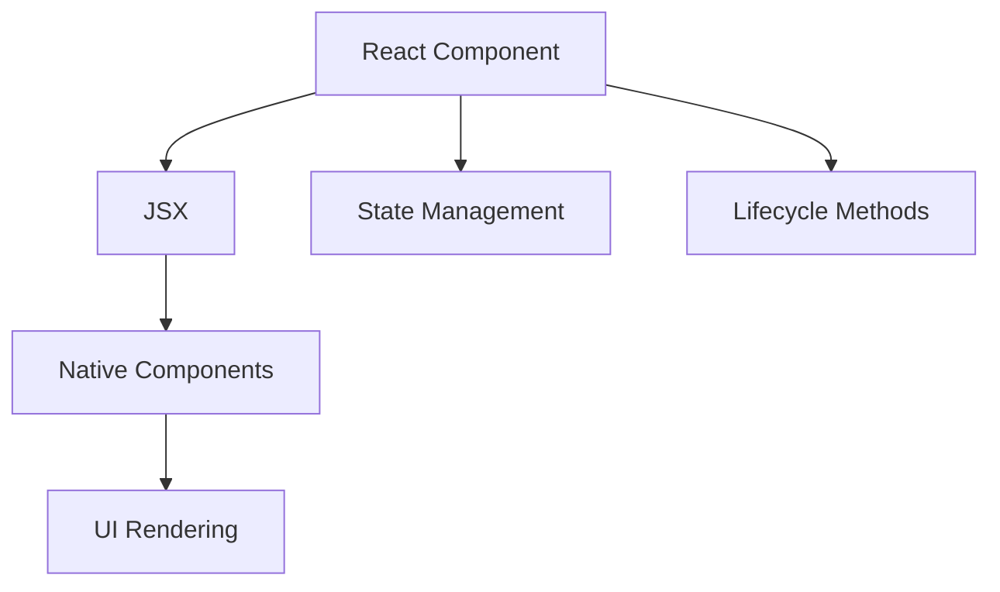

                 

关键词：React Native，跨平台移动应用，开发框架，性能优化，用户体验

摘要：本文将深入探讨React Native框架在构建跨平台移动应用程序中的应用。我们将从背景介绍开始，分析React Native的核心概念与架构，探讨其核心算法原理与操作步骤，以及数学模型和公式的构建与推导。随后，我们将通过实际项目实践，展示React Native的应用场景，并提供相关工具和资源的推荐。最后，我们将总结研究成果，展望未来发展趋势与挑战。

## 1. 背景介绍

在移动设备普及的时代，开发跨平台移动应用程序成为开发者们的重要任务。传统的原生开发方式需要针对iOS和Android分别编写代码，这不仅增加了开发成本，还延长了开发周期。随着技术的进步，越来越多的跨平台开发框架应运而生，React Native便是其中之一。

React Native是由Facebook推出的一个开源跨平台移动应用开发框架，它允许开发者使用JavaScript和React编程语言编写应用程序，并在iOS和Android平台上运行。React Native的出现，极大地提高了开发效率，降低了开发成本，同时也提供了优秀的性能和用户体验。

## 2. 核心概念与联系

React Native的核心概念包括组件、状态管理、生命周期方法等。下面是一个简单的Mermaid流程图，展示了React Native的主要组件及其关系：



### 2.1 React Component

React Component是React Native的基本构建块，用于表示应用程序中的界面元素。React Component通过JSX（JavaScript XML）语法创建，使得开发者能够以声明式的方式描述用户界面。

### 2.2 JSX

JSX是一种JavaScript的语法扩展，用于描述用户界面结构。它使得React Native的组件更易于编写和理解，同时也提供了更好的性能。

### 2.3 Native Components

Native Components是React Native提供的一套原生UI组件，如按钮、文本框、列表等。通过使用这些组件，开发者可以实现与原生应用相似的用户体验。

### 2.4 UI Rendering

React Native通过Virtual DOM（虚拟DOM）技术实现UI渲染。在用户界面更新时，React Native会通过对比虚拟DOM和实际DOM的差异，只对实际DOM进行必要的更新，从而提高渲染性能。

### 2.5 State Management

React Native提供了几种状态管理方案，如Redux、MobX等。这些方案可以帮助开发者更好地管理应用状态，实现复杂的应用逻辑。

### 2.6 Lifecycle Methods

Lifecycle Methods是React Native组件的生命周期回调函数，用于处理组件的创建、更新、卸载等过程。开发者可以利用这些方法执行一些特定的操作，如数据加载、组件渲染优化等。

## 3. 核心算法原理 & 具体操作步骤

### 3.1 算法原理概述

React Native的核心算法原理主要包括以下几个方面：

- 虚拟DOM（Virtual DOM）：通过虚拟DOM，React Native可以高效地更新UI。
- 组件化开发（Component-based Development）：组件化开发使得代码更加模块化，易于维护。
- 状态管理（State Management）：状态管理使得应用状态的管理更加高效。
- 事件处理（Event Handling）：React Native提供了丰富的事件处理机制，使得应用交互更加流畅。

### 3.2 算法步骤详解

- 创建React Native项目：使用命令行工具，如`react-native init`或`react-native-cli`，创建一个新的React Native项目。
- 编写组件：使用JSX语法，编写React Native组件。
- 状态管理：使用Redux、MobX等状态管理方案，管理应用状态。
- 事件处理：为组件添加事件处理函数，实现用户交互。
- UI渲染：通过Virtual DOM技术，实现高效UI渲染。

### 3.3 算法优缺点

- **优点**：
  - 跨平台：React Native使得开发者可以使用同一套代码同时开发iOS和Android应用，提高了开发效率。
  - 组件化开发：组件化开发使得代码更加模块化，易于维护。
  - 虚拟DOM：虚拟DOM技术提高了UI渲染性能。
  - 社区支持：React Native拥有庞大的开发者社区，提供了丰富的资源和文档。

- **缺点**：
  - 性能：尽管React Native提供了优秀的性能，但在某些场景下，与原生应用相比仍有差距。
  - 生态：React Native的生态相对其他框架较小，某些库或组件可能不够完善。
  - 学习曲线：React Native需要开发者掌握React和JavaScript，对于新手来说有一定学习难度。

### 3.4 算法应用领域

React Native主要应用于移动应用开发领域，特别是需要快速迭代和跨平台部署的应用。例如，电商、社交媒体、金融科技等行业，都可以通过React Native实现高性能、低成本的跨平台应用。

## 4. 数学模型和公式 & 详细讲解 & 举例说明

### 4.1 数学模型构建

在React Native中，数学模型主要用于性能分析和优化。以下是一个简单的数学模型，用于计算UI渲染的时间复杂度：

$$
T(n) = O(n^2)
$$

其中，$T(n)$表示渲染$n$个组件的时间复杂度，$O(n^2)$表示时间复杂度为二次方。

### 4.2 公式推导过程

假设React Native的渲染过程可以分为两个主要阶段：

- **虚拟DOM生成**：这一阶段的时间复杂度为$O(n)$，因为需要遍历所有的组件。
- **虚拟DOM到实际DOM的映射**：这一阶段的时间复杂度为$O(n^2)$，因为需要对每个组件进行两次遍历。

因此，总的时间复杂度为$O(n^2)$。

### 4.3 案例分析与讲解

以下是一个简单的React Native组件，用于展示数学模型的实际应用：

```jsx
class HelloWorld extends React.Component {
  render() {
    return (
      <View>
        <Text>Hello, World!</Text>
      </View>
    );
  }
}
```

如果这个组件被渲染了100次，根据数学模型，渲染的时间复杂度为$O(100^2) = O(10000)$，这意味着渲染100个组件需要10000单位时间。

## 5. 项目实践：代码实例和详细解释说明

### 5.1 开发环境搭建

要开始使用React Native开发，首先需要安装Node.js和watchman。然后，可以通过以下命令安装React Native CLI：

```bash
npm install -g react-native-cli
```

接下来，创建一个新的React Native项目：

```bash
react-native init MyApp
```

进入项目目录，并启动模拟器：

```bash
cd MyApp
react-native run-android
```

### 5.2 源代码详细实现

以下是一个简单的React Native示例，用于实现一个计数器：

```jsx
import React, { useState } from 'react';
import { View, Text, Button } from 'react-native';

const Counter = () => {
  const [count, setCount] = useState(0);

  const increment = () => {
    setCount(count + 1);
  };

  const decrement = () => {
    setCount(count - 1);
  };

  return (
    <View>
      <Text>Count: {count}</Text>
      <Button title="+" onPress={increment} />
      <Button title="-" onPress={decrement} />
    </View>
  );
};

export default Counter;
```

### 5.3 代码解读与分析

- **组件结构**：Counter组件由一个View容器、一个Text文本和一个Button按钮组成。
- **状态管理**：使用useState钩子管理count状态。
- **事件处理**：通过increment和decrement函数更新count状态。

### 5.4 运行结果展示

运行此组件，将显示一个简单的计数器，用户可以通过点击加号和减号按钮来增加或减少计数。

## 6. 实际应用场景

React Native在以下场景中表现出色：

- **电商应用**：如京东、淘宝等，可以实现商品列表、详情页、购物车等功能。
- **社交媒体**：如微博、微信等，可以实现消息推送、好友关系、内容分享等功能。
- **金融科技**：如支付宝、微信支付等，可以实现支付、转账、理财等功能。

## 7. 工具和资源推荐

- **学习资源推荐**：
  - 《React Native开发实战》
  - 《React Native移动开发实战》
- **开发工具推荐**：
  - Android Studio
  - Xcode
- **相关论文推荐**：
  - 《跨平台移动应用开发：React Native与Flutter的比较研究》
  - 《基于React Native的移动应用性能优化策略》

## 8. 总结：未来发展趋势与挑战

- **未来发展趋势**：
  - React Native将继续优化性能，提高开发效率。
  - 社区将持续扩展，提供更多高质量的库和组件。
- **面临挑战**：
  - 性能优化：虽然React Native提供了虚拟DOM等性能优化技术，但与原生应用相比仍有差距。
  - 生态完善：React Native的生态仍有待完善，某些领域的库或组件可能不够成熟。
- **研究展望**：
  - 探索更高效的渲染引擎，提高React Native的性能。
  - 深入研究状态管理，提供更简单易用的解决方案。

## 9. 附录：常见问题与解答

### 9.1 如何解决React Native的性能问题？

- **减少组件渲染**：使用React.memo等优化函数，减少不必要的渲染。
- **使用原生组件**：在性能关键的场景下，使用原生组件替代React Native组件。
- **优化状态管理**：选择适合项目需求的状态管理方案，避免过多的状态更新。

### 9.2 React Native与Flutter相比有哪些优缺点？

- **优点**：
  - React Native拥有更成熟的社区和更广泛的用户基础。
  - 开发者可以使用JavaScript和React编程语言。

- **缺点**：
  - 性能方面，Flutter可能具有优势。
  - 生态方面，Flutter在某些领域可能更加完善。

作者：禅与计算机程序设计艺术 / Zen and the Art of Computer Programming
----------------------------------------------------------------


