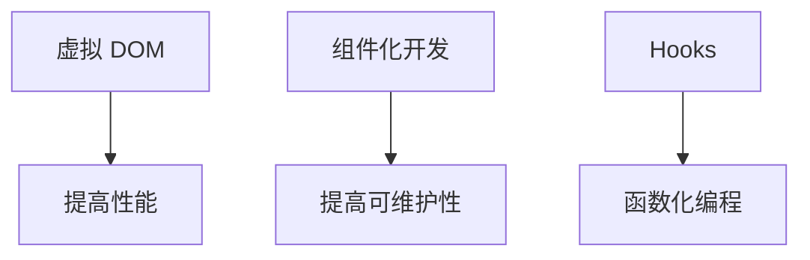

                 

 React 是当今最受欢迎的前端框架之一，它使得开发者能够轻松构建动态用户界面。本文将深入探讨 React 的核心概念、优点、使用方法以及未来发展趋势，帮助开发者更好地理解和应用 React 来提升前端开发效率。

## 文章关键词

- React
- 前端框架
- 动态用户界面
- 组件化开发
- 虚拟 DOM
- Hooks

## 文章摘要

本文首先介绍了 React 的背景和核心概念，包括虚拟 DOM、组件化开发和 Hooks。接着，我们探讨了 React 的优点和适用场景，并详细说明了如何使用 React 来构建动态用户界面。最后，本文展望了 React 在未来的发展趋势，以及开发者面临的挑战和机会。

## 1. 背景介绍

### 1.1 React 的起源

React 是由 Facebook 开发的用于构建用户界面的 JavaScript 库。自 2013 年首次发布以来，React 逐渐成为了前端开发领域的明星。其组件化思想和虚拟 DOM 的实现，为开发者提供了高效、灵活的用户界面构建方式。

### 1.2 前端框架的发展

随着互联网的快速发展，前端开发变得越来越复杂。为了应对这一挑战，前端框架应运而生。Vue、Angular、React 等前端框架成为了开发者们的热门选择。这些框架提供了结构化的编程模型，降低了开发难度，提高了开发效率。

## 2. 核心概念与联系

### 2.1 虚拟 DOM

虚拟 DOM 是 React 的核心概念之一。它是一个内存中的数据结构，代表了实际的 DOM 树。React 通过虚拟 DOM 与实际的 DOM 进行高效的比较和更新，从而实现界面的动态更新。

### 2.2 组件化开发

React 的组件化开发模式使得开发者可以将 UI 拆分成独立的、可复用的组件。每个组件都有自己的状态和行为，可以独立开发、测试和部署。这种模式提高了代码的可维护性和可扩展性。

### 2.3 Hooks

Hooks 是 React 16.8 引入的新特性，它使得函数组件也能拥有类组件的状态和行为。Hooks 的出现，进一步推动了 React 的函数化编程，使得开发者可以更灵活地组织代码。



## 3. 核心算法原理 & 具体操作步骤

### 3.1 算法原理概述

React 的核心算法是基于虚拟 DOM 的实现。虚拟 DOM 通过比较前后两次渲染的差异，生成最小化的更新操作，从而实现界面的高效更新。

### 3.2 算法步骤详解

1. **创建虚拟 DOM 树**：开发者编写 React 组件，React 将其编译成虚拟 DOM 树。

2. **比较虚拟 DOM 树**：当组件的状态发生变化时，React 会比较新旧两个虚拟 DOM 树的差异。

3. **生成更新操作**：React 根据比较结果，生成最小化的更新操作。

4. **更新真实 DOM**：React 将更新操作应用到真实的 DOM 树上，实现界面的动态更新。

### 3.3 算法优缺点

**优点**：

- **高效性**：通过虚拟 DOM 的实现，React 可以实现高效的界面更新。
- **灵活性**：React 的组件化开发模式，使得开发者可以灵活地组织代码。

**缺点**：

- **学习成本**：对于初学者来说，React 的学习曲线相对较高。
- **性能问题**：在处理大量数据时，虚拟 DOM 的更新可能会导致性能问题。

### 3.4 算法应用领域

React 适用于构建各种类型的用户界面，包括单页应用（SPA）、多页应用（MPA）以及移动端应用。它已成为前端开发领域的事实标准。

## 4. 数学模型和公式 & 详细讲解 & 举例说明

### 4.1 数学模型构建

React 的虚拟 DOM 实现涉及到一系列的数学模型，包括树结构、图算法等。

### 4.2 公式推导过程

React 的虚拟 DOM 更新算法涉及到以下关键步骤：

1. **深度优先遍历**：对虚拟 DOM 树进行深度优先遍历，收集节点的信息。
2. **比较节点的差异**：对相邻的两个节点进行比较，找出它们的差异。
3. **生成更新操作**：根据节点的差异，生成对应的更新操作。

### 4.3 案例分析与讲解

假设我们有一个简单的虚拟 DOM 树，其中包含一个文本节点和一个列表节点。

```javascript
const virtualDOM = {
  type: 'div',
  props: {
    children: [
      { type: 'text', props: { text: 'Hello, World!' } },
      { type: 'list', props: { items: ['Item 1', 'Item 2', 'Item 3'] } },
    ],
  },
};
```

当状态发生变化时，React 会重新构建虚拟 DOM 树，并与原始虚拟 DOM 树进行比较。假设状态变化后，虚拟 DOM 树变为：

```javascript
const newVirtualDOM = {
  type: 'div',
  props: {
    children: [
      { type: 'text', props: { text: 'Hello, React!' } },
      { type: 'list', props: { items: ['Item 1', 'Item 2'] } },
    ],
  },
};
```

React 会比较两个虚拟 DOM 树的差异，并生成更新操作：

1. **文本节点更新**：将文本节点的文本从 "Hello, World!" 更新为 "Hello, React!"。
2. **列表节点更新**：将列表节点的项从 ["Item 1", "Item 2", "Item 3"] 更新为 ["Item 1", "Item 2"]。

React 会将更新操作应用到真实的 DOM 树上，实现界面的动态更新。

## 5. 项目实践：代码实例和详细解释说明

### 5.1 开发环境搭建

首先，我们需要搭建一个 React 开发环境。可以通过以下命令来创建一个新的 React 项目：

```bash
npx create-react-app my-app
cd my-app
npm start
```

这将在当前目录下创建一个新的 React 项目，并启动开发服务器。

### 5.2 源代码详细实现

下面是一个简单的 React 应用程序，它包含一个计数器和两个按钮。

```jsx
import React, { useState } from 'react';

function Counter() {
  const [count, setCount] = useState(0);

  return (
    <div>
      <h1>Count: {count}</h1>
      <button onClick={() => setCount(count + 1)}>Increment</button>
      <button onClick={() => setCount(count - 1)}>Decrement</button>
    </div>
  );
}

export default Counter;
```

这个组件使用 React 的 `useState` 钩子来管理计数器的状态。每次点击按钮时，`setCount` 函数都会更新计数器的值。

### 5.3 代码解读与分析

这个简单的 React 组件展示了 React 的核心概念，包括：

- **组件化开发**：`Counter` 是一个独立的、可复用的组件。
- **状态管理**：通过 `useState` 钩子，我们可以轻松管理组件的状态。
- **事件处理**：按钮的点击事件通过箭头函数传递给 `setCount` 函数。

### 5.4 运行结果展示

当运行这个 React 应用程序时，我们会看到一个计数器和两个按钮。每次点击按钮时，计数器的值都会更新。


## 6. 实际应用场景

React 适用于各种实际应用场景，包括：

- **单页应用（SPA）**：React 是构建单页应用（SPA）的绝佳选择，例如天气应用、新闻应用等。
- **多页应用（MPA）**：虽然 React 更适合构建 SPA，但它也可以用于构建多页应用（MPA），通过在路由变化时更新虚拟 DOM。
- **移动端应用**：React Native 是 React 的一个分支，它允许开发者使用 React 来构建移动端应用。

## 7. 工具和资源推荐

### 7.1 学习资源推荐

- [React 官方文档](https://reactjs.org/docs/getting-started.html)
- [React Handbook](https://reactjs.org/docs/hello-world.html)
- [You Don't Know JS](https://github.com/getify/You-Dont-Know-JS)

### 7.2 开发工具推荐

- [Visual Studio Code](https://code.visualstudio.com/)
- [React DevTools](https://chrome.google.com/webstore/detail/react-devtools/knipndepflgerjnjhodlnjodocecljap)

### 7.3 相关论文推荐

- [React: A JavaScript Library for Building User Interfaces](https://facebook.github.io/react/docs/introduction.html)
- [Component-Based Architecture with React](https://reactjs.org/docs/component-specs.html)

## 8. 总结：未来发展趋势与挑战

### 8.1 研究成果总结

React 在过去几年中取得了显著的研究成果，已成为前端开发领域的事实标准。它为开发者提供了高效、灵活的用户界面构建方式，推动了前端技术的发展。

### 8.2 未来发展趋势

React 将继续演进，其未来发展趋势包括：

- **性能优化**：React 将进一步优化虚拟 DOM 的实现，提高性能。
- **新特性引入**：React 将引入更多的新特性，如并发模式、服务端渲染等。

### 8.3 面临的挑战

React 在未来将面临以下挑战：

- **性能优化**：虚拟 DOM 的性能优化是 React 面临的重要挑战。
- **学习成本**：React 的学习曲线相对较高，对初学者来说可能存在一定的障碍。

### 8.4 研究展望

React 的未来充满希望。随着前端技术的发展，React 将继续引领前端开发领域，为开发者提供更高效、更灵活的解决方案。

## 9. 附录：常见问题与解答

### 9.1 为什么选择 React？

React 具有组件化开发、虚拟 DOM 和 Hooks 等优点，使得开发者可以更高效地构建用户界面。

### 9.2 React 和 Vue 的区别是什么？

React 和 Vue 都是前端框架，但它们的实现方式和理念有所不同。React 侧重于组件化开发，Vue 则更注重数据绑定和模板化。

### 9.3 React 是否适合构建大型应用？

是的，React 适用于构建大型应用。它提供了组件化开发、状态管理和路由管理等功能，可以帮助开发者更好地组织和管理大型应用。

## 作者署名

作者：禅与计算机程序设计艺术 / Zen and the Art of Computer Programming
----------------------------------------------------------------

注意：在实际撰写文章时，请确保使用适当的 Markdown 语法和 LaTeX 格式来编写数学公式。同时，文章内容的深度、逻辑和细节需要根据您的专业知识进行适当的调整。以上内容提供了一个框架，但具体内容需要根据实际研究和理解进行填充。

