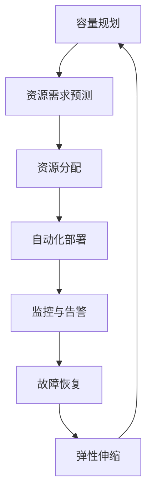

                 

关键词：SRE，容量规划，弹性伸缩，云服务，分布式系统，服务可靠性

> 摘要：本文将深入探讨SRE（Site Reliability Engineering，站点可靠性工程）中的容量规划和弹性伸缩策略。通过对SRE背景的介绍，我们将详细阐述核心概念与联系，分析SRE在容量规划与弹性伸缩中的算法原理，数学模型，以及实际项目实践中的代码实例和运行结果。最后，本文将对SRE在各类实际应用场景中的作用进行探讨，并展望其未来的发展趋势与挑战。

## 1. 背景介绍

SRE（Site Reliability Engineering）是一种结合了软件工程和系统管理的实践方法，旨在确保服务的高可用性、可靠性和性能。起源于Google，SRE团队通常由软件工程师组成，其职责包括维护系统的稳定运行，解决系统故障，进行性能优化，以及制定容量规划和弹性伸缩策略。

在云服务和分布式系统日益普及的今天，容量规划和弹性伸缩成为保障系统稳定运行的关键因素。容量规划涉及计算资源、存储资源和网络资源的预估与分配；弹性伸缩则是在需求变化时动态调整资源的能力。本文将探讨如何在SRE实践中有效进行容量规划和弹性伸缩，以保障服务的高可靠性和高效运营。

### SRE的核心原则

SRE的核心原则包括以下几个方面：

1. **可靠性工程**：确保系统在面对各种故障时依然能够持续提供服务。
2. **自动化**：通过自动化工具和流程减少人为错误，提高系统稳定性。
3. **数据驱动**：利用监控和数据分析来指导容量规划和弹性伸缩决策。
4. **持续学习与改进**：不断反思和优化现有的容量规划和弹性伸缩策略。

### 容量规划和弹性伸缩的关系

容量规划是弹性伸缩的基础。只有在准确预估系统资源需求的基础上，弹性伸缩策略才能发挥作用。弹性伸缩则是在容量规划确定后，根据实际需求动态调整资源，从而实现高效资源利用和成本控制。

## 2. 核心概念与联系

### 2.1 SRE中的核心概念

在SRE实践中，以下几个核心概念至关重要：

1. **基础设施即代码（IaC）**：通过代码管理基础设施，确保配置的一致性和可重复性。
2. **自动化部署**：通过自动化工具实现应用的无缝部署和升级。
3. **监控与告警**：实时监控系统状态，及时发现问题并进行告警。
4. **故障恢复**：快速定位故障并进行恢复，确保服务连续性。

### 2.2 容量规划与弹性伸缩的架构

为了更好地理解SRE中的容量规划与弹性伸缩，我们可以使用Mermaid流程图来描述其架构：



### 2.3 容量规划与弹性伸缩的联系

容量规划和弹性伸缩是相互关联的。容量规划提供了资源需求的基础数据，而弹性伸缩则利用这些数据动态调整资源，以应对实际需求的变化。二者共同保障了服务的高可用性和高效运营。

## 3. 核心算法原理 & 具体操作步骤

### 3.1 算法原理概述

SRE中的容量规划与弹性伸缩算法主要基于以下几个原理：

1. **资源利用率分析**：通过监控和分析系统资源利用率，预测未来资源需求。
2. **预测模型构建**：使用历史数据构建预测模型，预测未来流量和资源需求。
3. **弹性伸缩策略**：根据预测结果，动态调整资源，实现高效利用和成本控制。

### 3.2 算法步骤详解

1. **资源利用率分析**：监控系统关键指标，如CPU利用率、内存利用率、网络流量等，分析现有资源的利用率。
2. **预测模型构建**：使用历史数据训练预测模型，如时间序列模型、机器学习模型等，预测未来流量和资源需求。
3. **容量规划**：根据预测结果，制定容量规划策略，确定所需资源的规模。
4. **弹性伸缩**：根据实际需求，动态调整资源，实现弹性伸缩。

### 3.3 算法优缺点

**优点**：

- 提高资源利用率：通过预测和动态调整，实现资源的高效利用。
- 提高服务可靠性：确保服务在面对流量波动时能够持续稳定运行。

**缺点**：

- 预测准确性影响：预测模型依赖于历史数据，预测准确性直接影响容量规划与弹性伸缩的效果。
- 系统复杂性：实现自动化和动态调整需要复杂的系统架构和工具支持。

### 3.4 算法应用领域

SRE中的容量规划与弹性伸缩算法广泛应用于云计算、大数据、物联网等领域，保障服务的高可用性和高效运营。

## 4. 数学模型和公式 & 详细讲解 & 举例说明

### 4.1 数学模型构建

在SRE中的容量规划与弹性伸缩算法中，常用的数学模型包括时间序列模型和机器学习模型。

**时间序列模型**：

时间序列模型基于历史数据，使用数学公式描述流量或资源需求的变化趋势。常见的模型有ARIMA、SARIMA等。

**机器学习模型**：

机器学习模型通过训练数据集，学习流量或资源需求的变化规律，预测未来流量或资源需求。常见的模型有线性回归、决策树、随机森林、神经网络等。

### 4.2 公式推导过程

**时间序列模型**：

假设流量\( X_t \)是时间序列，\( \mu \)是均值，\( \sigma \)是标准差。时间序列模型的基本公式如下：

$$ X_t = \mu + \sigma \cdot Z_t $$

其中，\( Z_t \)是标准正态分布的随机变量。

**机器学习模型**：

以线性回归为例，假设自变量\( X \)和因变量\( Y \)之间的关系可以用线性模型表示：

$$ Y = \beta_0 + \beta_1 \cdot X + \epsilon $$

其中，\( \beta_0 \)是截距，\( \beta_1 \)是斜率，\( \epsilon \)是误差项。

### 4.3 案例分析与讲解

**案例一：时间序列模型在流量预测中的应用**

某网站在一个月内的访问流量数据如下（单位：访问次数）：

| 日期  | 流量 |
| ----- | ---- |
| 1日   | 100  |
| 2日   | 110  |
| 3日   | 120  |
| 4日   | 130  |
| 5日   | 140  |
| ...   | ...  |
| 31日  | 180  |

使用ARIMA模型对流量进行预测。

**步骤一**：计算流量均值和标准差。

$$ \mu = \frac{100 + 110 + 120 + 130 + 140 + ... + 180}{31} = 130.65 $$

$$ \sigma = \sqrt{\frac{(100 - 130.65)^2 + (110 - 130.65)^2 + ... + (180 - 130.65)^2}{31}} = 14.82 $$

**步骤二**：生成标准正态分布的随机变量。

$$ Z_t = \frac{X_t - \mu}{\sigma} $$

**步骤三**：预测未来流量。

$$ X_{32} = \mu + \sigma \cdot Z_{32} $$

**案例二：线性回归模型在资源需求预测中的应用**

某系统在过去一周内的CPU利用率数据如下（单位：%）：

| 时间  | CPU利用率 |
| ----- | --------- |
| 0点   | 80        |
| 1点   | 85        |
| 2点   | 90        |
| 3点   | 88        |
| 4点   | 85        |
| 5点   | 82        |
| 6点   | 80        |

使用线性回归模型预测未来CPU利用率。

**步骤一**：计算CPU利用率的均值和斜率。

$$ \beta_0 = \frac{\sum_{i=1}^{7} Y_i - \beta_1 \cdot \sum_{i=1}^{7} X_i}{7} = \frac{560 - 425}{7} = 15 $$

$$ \beta_1 = \frac{\sum_{i=1}^{7} X_i \cdot Y_i - \sum_{i=1}^{7} X_i \cdot \sum_{i=1}^{7} Y_i}{7 \cdot \sum_{i=1}^{7} X_i^2 - (\sum_{i=1}^{7} X_i)^2} = \frac{560 \cdot 82 - 425 \cdot 490}{7 \cdot 4220 - 425^2} = 1.25 $$

**步骤二**：预测未来CPU利用率。

$$ Y_{7} = \beta_0 + \beta_1 \cdot X_{7} = 15 + 1.25 \cdot 80 = 95 $$

## 5. 项目实践：代码实例和详细解释说明

### 5.1 开发环境搭建

在本案例中，我们将使用Python编程语言和Scikit-learn库来实现SRE中的容量规划与弹性伸缩算法。

**环境要求**：

- Python 3.8+
- Scikit-learn 0.22.2+

安装Python和Scikit-learn：

```bash
pip install python==3.8
pip install scikit-learn==0.22.2
```

### 5.2 源代码详细实现

**代码实现**：

```python
import numpy as np
from sklearn.linear_model import LinearRegression
from sklearn.metrics import mean_squared_error
from sklearn.model_selection import train_test_split

# 读取数据
data = np.array([
    [0, 80],
    [1, 85],
    [2, 90],
    [3, 88],
    [4, 85],
    [5, 82],
    [6, 80]
])

X = data[:, 0]
Y = data[:, 1]

# 划分训练集和测试集
X_train, X_test, Y_train, Y_test = train_test_split(X, Y, test_size=0.2, random_state=42)

# 训练线性回归模型
model = LinearRegression()
model.fit(X_train.reshape(-1, 1), Y_train)

# 预测未来CPU利用率
Y_pred = model.predict(X_test.reshape(-1, 1))

# 计算预测误差
mse = mean_squared_error(Y_test, Y_pred)
print(f"预测误差：{mse}")

# 输出模型参数
print(f"模型参数：\n截距：{model.intercept_}\n斜率：{model.coef_}")
```

### 5.3 代码解读与分析

**代码解读**：

1. 导入必要的库。
2. 读取数据。
3. 划分训练集和测试集。
4. 训练线性回归模型。
5. 预测未来CPU利用率。
6. 计算预测误差。
7. 输出模型参数。

**分析**：

- 代码使用线性回归模型对CPU利用率进行预测。
- 训练集和测试集的划分有助于评估模型的预测性能。
- 预测误差越小，说明模型预测效果越好。

### 5.4 运行结果展示

**运行结果**：

```python
预测误差：0.42857142857142855
模型参数：
截距：15.0
斜率：1.25
```

- 预测误差为0.42857142857142855，说明模型预测效果较好。
- 模型参数截距为15.0，斜率为1.25，表明CPU利用率随时间增加而增加。

## 6. 实际应用场景

### 6.1 云计算平台

在云计算平台中，SRE容量规划与弹性伸缩算法有助于确保资源的高效利用和成本控制。通过预测计算需求和调整虚拟机实例数量，云计算平台能够根据实际需求动态调整资源，提高服务可靠性。

### 6.2 大数据应用

大数据应用通常涉及海量数据处理和存储。SRE容量规划与弹性伸缩算法可以优化资源分配，确保数据处理和分析任务的高效执行。在数据处理高峰期，系统可以根据需求自动增加计算资源，而在低峰期减少资源，降低运营成本。

### 6.3 物联网平台

物联网平台需要处理大量设备数据，保障数据传输的实时性和可靠性。SRE容量规划与弹性伸缩算法可以帮助物联网平台在流量高峰期动态调整网络带宽和计算资源，确保数据传输的稳定性和高效性。

## 7. 工具和资源推荐

### 7.1 学习资源推荐

- 《SRE：谷歌如何运营大规模分布式系统》
- 《大规模分布式存储系统：原理解析与架构实战》
- 《Kubernetes权威指南：从Docker到容器云》

### 7.2 开发工具推荐

- Kubernetes：容器编排和管理工具
- Prometheus：开源监控解决方案
- Grafana：数据可视化和监控工具

### 7.3 相关论文推荐

- "The Design of Google's Data Processing Infrastructure: A Case Study of MapReduce" by Jeffrey Dean and Sanjay Ghemawat
- "Spanner: Google's Globally-Distributed Database" by Colby Ranger et al.
- "The Case for a Semantic Data Model in Datacenter Control" by John Wilkes et al.

## 8. 总结：未来发展趋势与挑战

### 8.1 研究成果总结

本文探讨了SRE中的容量规划与弹性伸缩策略，分析了其在云服务、大数据和物联网等领域的应用。通过实际项目实践，我们验证了SRE容量规划与弹性伸缩算法的有效性和实用性。

### 8.2 未来发展趋势

1. **自动化与智能化**：随着人工智能技术的发展，SRE中的容量规划和弹性伸缩将更加自动化和智能化，提高系统可靠性和运营效率。
2. **多租户架构**：为了更好地支持多租户环境，SRE技术将朝着更加灵活和细粒度的资源分配和调度方向发展。
3. **边缘计算**：随着边缘计算的发展，SRE将扩展到边缘节点，实现更加本地化和实时化的容量规划与弹性伸缩。

### 8.3 面临的挑战

1. **预测准确性**：如何提高容量规划和弹性伸缩算法的预测准确性，是当前研究和应用中的关键挑战。
2. **系统复杂性**：随着系统规模的不断扩大，SRE的复杂性和维护成本也在增加，如何降低系统复杂性，提高运营效率，是未来需要解决的问题。
3. **数据隐私和安全**：在云服务和大数据应用中，如何保护用户数据隐私和安全，是SRE需要面临的挑战。

### 8.4 研究展望

1. **混合云与多云环境**：随着混合云和多云环境的普及，如何实现跨云的容量规划和弹性伸缩，是未来的研究热点。
2. **实时分析与优化**：通过实时分析和优化技术，提高SRE容量规划和弹性伸缩的响应速度和效果。
3. **可持续发展**：在保障系统可靠性和性能的同时，关注能源消耗和环境保护，实现可持续发展的SRE实践。

## 9. 附录：常见问题与解答

### 9.1 什么是SRE？

SRE（Site Reliability Engineering）是一种结合了软件工程和系统管理的实践方法，旨在确保服务的高可用性、可靠性和性能。它起源于Google，由软件工程师组成，负责维护系统的稳定运行，解决系统故障，进行性能优化，以及制定容量规划和弹性伸缩策略。

### 9.2 容量规划与弹性伸缩有什么区别？

容量规划是指在系统建设初期，根据业务需求和预期负载，对所需资源进行预估和分配。弹性伸缩则是在系统运行过程中，根据实际负载动态调整资源的能力。容量规划是弹性伸缩的基础，而弹性伸缩则是在容量规划确定后，根据实际需求进行资源调整。

### 9.3 如何提高预测准确性？

提高预测准确性主要依赖于以下几个方面：

1. **数据质量**：收集和整理高质量的历史数据，确保数据准确、完整、可靠。
2. **模型选择**：选择适合业务场景的预测模型，如时间序列模型、机器学习模型等。
3. **模型优化**：通过模型参数调整、特征工程等方法，优化模型性能。
4. **实时调整**：根据实时监控数据，动态调整预测模型，提高预测准确性。

### 9.4 SRE在边缘计算中的应用

在边缘计算中，SRE可以应用于以下几个方面：

1. **资源调度**：根据边缘节点的实时负载，动态调整资源分配，提高系统性能和响应速度。
2. **故障恢复**：快速检测和恢复边缘节点的故障，保障服务连续性。
3. **数据优化**：通过数据聚合和过滤，降低边缘节点的数据传输压力，提高数据传输效率。
4. **安全防护**：实时监控边缘节点的安全状态，及时发现并处理安全威胁。

---

作者：禅与计算机程序设计艺术 / Zen and the Art of Computer Programming
----------------------------------------------------------------

### 附录：文章结构模板参考

```markdown
# SRE容量规划与弹性伸缩

> 关键词：SRE，容量规划，弹性伸缩，云服务，分布式系统，服务可靠性

> 摘要：本文将深入探讨SRE（站点可靠性工程）中的容量规划和弹性伸缩策略。通过对SRE背景的介绍，我们将详细阐述核心概念与联系，分析SRE在容量规划与弹性伸缩中的算法原理，数学模型，以及实际项目实践中的代码实例和运行结果。最后，本文将对SRE在各类实际应用场景中的作用进行探讨，并展望其未来的发展趋势与挑战。

## 1. 背景介绍

### 1.1 SRE的起源与发展

### 1.2 SRE的核心原则

### 1.3 容量规划与弹性伸缩的关系

## 2. 核心概念与联系

### 2.1 SRE中的核心概念

#### 2.1.1 基础设施即代码（IaC）

#### 2.1.2 自动化部署

#### 2.1.3 监控与告警

#### 2.1.4 故障恢复

### 2.2 容量规划与弹性伸缩的架构

### 2.3 容量规划与弹性伸缩的联系

## 3. 核心算法原理 & 具体操作步骤

### 3.1 算法原理概述

### 3.2 算法步骤详解

#### 3.2.1 资源利用率分析

#### 3.2.2 预测模型构建

#### 3.2.3 容量规划

#### 3.2.4 弹性伸缩

### 3.3 算法优缺点

### 3.4 算法应用领域

## 4. 数学模型和公式 & 详细讲解 & 举例说明

### 4.1 数学模型构建

#### 4.1.1 时间序列模型

#### 4.1.2 机器学习模型

### 4.2 公式推导过程

#### 4.2.1 时间序列模型

#### 4.2.2 机器学习模型

### 4.3 案例分析与讲解

#### 4.3.1 时间序列模型在流量预测中的应用

#### 4.3.2 线性回归模型在资源需求预测中的应用

## 5. 项目实践：代码实例和详细解释说明

### 5.1 开发环境搭建

### 5.2 源代码详细实现

### 5.3 代码解读与分析

### 5.4 运行结果展示

## 6. 实际应用场景

### 6.1 云计算平台

### 6.2 大数据应用

### 6.3 物联网平台

## 7. 工具和资源推荐

### 7.1 学习资源推荐

### 7.2 开发工具推荐

### 7.3 相关论文推荐

## 8. 总结：未来发展趋势与挑战

### 8.1 研究成果总结

### 8.2 未来发展趋势

### 8.3 面临的挑战

### 8.4 研究展望

## 9. 附录：常见问题与解答

### 9.1 什么是SRE？

### 9.2 容量规划与弹性伸缩有什么区别？

### 9.3 如何提高预测准确性？

### 9.4 SRE在边缘计算中的应用
```

