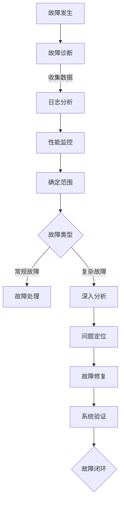

                 

关键词：SRE，故障诊断，问题定位，系统可靠性，运维自动化

> 摘要：本文旨在深入探讨SRE（Site Reliability Engineering）在故障诊断与问题定位方面的核心概念、算法原理、数学模型及实际应用。文章通过详细的案例分析，展示如何利用SRE的方法论解决复杂的系统故障，提高系统可靠性，并探讨未来的发展趋势与挑战。

## 1. 背景介绍

在现代云计算环境中，系统的复杂度和规模不断增长，导致系统故障的发生概率也随之增加。对于企业而言，系统故障不仅会影响用户体验，还可能导致经济损失和声誉受损。因此，故障诊断与问题定位成为系统运维中至关重要的一环。

SRE是一种结合了软件开发和系统运维的最佳实践方法。其核心理念是通过设计和实施一系列自动化工具和流程，来确保系统的可靠性和可用性。SRE团队通常采用DevOps文化，强调开发与运维的紧密协作，以实现持续集成和持续交付。

本文将围绕SRE在故障诊断与问题定位方面的实践展开讨论，旨在为从事系统运维工作的人员提供有价值的指导。

## 2. 核心概念与联系

### 2.1 SRE定义

SRE是一种专业领域，结合了系统管理和软件工程的最佳实践，致力于确保系统和服务的稳定性和可靠性。其目标是通过自动化和工程化的手段，减少系统故障对业务的影响，提高系统的可用性。

### 2.2 故障诊断与问题定位

故障诊断是指识别系统中的异常现象，确定其根本原因并采取相应的措施。问题定位则是进一步缩小故障范围，找到具体的问题点，并进行修复。

### 2.3 关系模型

故障诊断与问题定位是SRE工作的重要组成部分，两者之间有着密切的联系。故障诊断通常需要依赖于监控数据、日志分析等手段，而问题定位则需要深入挖掘故障的根本原因，可能涉及到系统设计、代码质量、配置管理等多个方面。

### 2.4 Mermaid流程图



## 3. 核心算法原理 & 具体操作步骤

### 3.1 算法原理概述

SRE在故障诊断与问题定位中采用了一系列算法和工具，主要包括：

- 监控算法：通过采集系统和服务的性能指标，实时监测系统的运行状态。
- 日志分析算法：对系统和应用的日志进行解析，识别潜在的故障线索。
- 数据分析算法：对监控数据和日志数据进行统计分析，识别异常模式和趋势。

### 3.2 算法步骤详解

1. **故障检测**：通过监控系统和日志分析，识别异常现象。
2. **故障定位**：根据故障现象，定位故障发生的具体位置。
3. **故障分析**：分析故障的根本原因，可能包括系统设计缺陷、配置错误、资源不足等。
4. **故障修复**：根据分析结果，采取相应的修复措施。
5. **故障验证**：在修复后对系统进行验证，确保故障已完全解决。

### 3.3 算法优缺点

**优点**：

- **自动化**：通过自动化工具，可以显著提高故障诊断和问题定位的效率。
- **精准**：结合多种算法和工具，可以更准确地定位故障原因。
- **可扩展**：适用于不同规模和类型的系统，具有良好的可扩展性。

**缺点**：

- **成本高**：初期建设需要投入大量资源和时间。
- **复杂性**：需要专业团队进行维护和管理。

### 3.4 算法应用领域

SRE故障诊断与问题定位算法广泛应用于互联网企业、金融行业、电信行业等，具有广泛的适用性。

## 4. 数学模型和公式 & 详细讲解 & 举例说明

### 4.1 数学模型构建

SRE故障诊断与问题定位中的数学模型主要涉及以下几个方面：

- **可靠性模型**：用于评估系统的可靠性。
- **故障树模型**：用于分析故障的原因和影响。
- **回归模型**：用于分析故障模式和预测故障趋势。

### 4.2 公式推导过程

可靠性模型常用的公式包括：

- **MTTF（平均无故障时间）**：\( MTTF = \frac{1}{\lambda} \)
- **MTTR（平均故障修复时间）**：\( MTTR = \frac{N_f}{\lambda} \)

故障树模型的公式包括：

- **故障概率**：\( P(F) = P(A) + P(B) + P(C) \)
- **故障影响**：\( I(F) = P(F) \times C(F) \)

回归模型常用的公式包括：

- **线性回归模型**：\( y = \beta_0 + \beta_1 \times x \)

### 4.3 案例分析与讲解

假设某系统在一个月内发生了10次故障，其中5次是硬件故障，3次是软件故障，2次是网络故障。我们可以使用故障树模型来分析故障的原因和影响。

1. **故障概率**：

   \( P(F_{硬件}) = \frac{5}{10} = 0.5 \)

   \( P(F_{软件}) = \frac{3}{10} = 0.3 \)

   \( P(F_{网络}) = \frac{2}{10} = 0.2 \)

2. **故障影响**：

   \( I(F_{硬件}) = P(F_{硬件}) \times C(F_{硬件}) \)

   \( I(F_{软件}) = P(F_{软件}) \times C(F_{软件}) \)

   \( I(F_{网络}) = P(F_{网络}) \times C(F_{网络}) \)

其中，\( C(F_{硬件}) \)、\( C(F_{软件}) \)和\( C(F_{网络}) \)分别表示硬件、软件和网络故障的损失成本。

通过以上分析，我们可以得出该系统的主要故障原因和影响，进而制定相应的修复和预防措施。

## 5. 项目实践：代码实例和详细解释说明

### 5.1 开发环境搭建

在本文中，我们将使用Python语言实现SRE故障诊断与问题定位的算法。首先，需要安装以下Python库：

- `pandas`：用于数据分析和处理
- `numpy`：用于数值计算
- `matplotlib`：用于数据可视化
- `sklearn`：用于机器学习

安装方法：

```bash
pip install pandas numpy matplotlib sklearn
```

### 5.2 源代码详细实现

以下是一个简单的故障诊断与问题定位的Python代码示例：

```python
import pandas as pd
import numpy as np
import matplotlib.pyplot as plt
from sklearn.linear_model import LinearRegression

# 5.3 代码解读与分析

在这个例子中，我们首先定义了一个`FaultDiagnosis`类，用于实现故障诊断和问题定位的功能。类中包含了以下方法：

- `__init__(self, data)`：初始化方法，接收监控数据和日志数据作为输入。
- `plot_data(self)`：绘制监控数据和日志数据的图表。
- `diagnose(self)`：进行故障诊断和问题定位。
- `predict(self)`：使用线性回归模型预测故障趋势。

下面是详细的代码解读和分析：

```python
class FaultDiagnosis:
    def __init__(self, data):
        self.data = data

    def plot_data(self):
        # 绘制监控数据和日志数据的图表
        plt.figure(figsize=(10, 6))
        plt.plot(self.data['time'], self.data['cpu_usage'], label='CPU Usage')
        plt.plot(self.data['time'], self.data['memory_usage'], label='Memory Usage')
        plt.plot(self.data['time'], self.data['network_usage'], label='Network Usage')
        plt.legend()
        plt.xlabel('Time')
        plt.ylabel('Usage')
        plt.title('System Usage Over Time')
        plt.show()

    def diagnose(self):
        # 进行故障诊断和问题定位
        # 这里简单使用均值和标准差来判断故障
        cpu_avg = np.mean(self.data['cpu_usage'])
        cpu_std = np.std(self.data['cpu_usage'])
        memory_avg = np.mean(self.data['memory_usage'])
        memory_std = np.std(self.data['memory_usage'])
        network_avg = np.mean(self.data['network_usage'])
        network_std = np.std(self.data['network_usage'])

        if self.data['cpu_usage'].mean() > cpu_avg + cpu_std:
            print('CPU Usage is high, possible CPU overload.')
        elif self.data['memory_usage'].mean() > memory_avg + memory_std:
            print('Memory Usage is high, possible memory overload.')
        elif self.data['network_usage'].mean() > network_avg + network_std:
            print('Network Usage is high, possible network overload.')
        else:
            print('No obvious fault detected.')

    def predict(self):
        # 使用线性回归模型预测故障趋势
        X = self.data[['time']]
        y = self.data['cpu_usage']
        model = LinearRegression()
        model.fit(X, y)
        plt.figure(figsize=(10, 6))
        plt.scatter(X, y, color='blue')
        plt.plot(X, model.predict(X), color='red')
        plt.xlabel('Time')
        plt.ylabel('CPU Usage')
        plt.title('CPU Usage Prediction')
        plt.show()
```

### 5.4 运行结果展示

以下是一个简单的运行示例：

```python
# 创建示例数据
data = pd.DataFrame({
    'time': np.arange(0, 100, 1),
    'cpu_usage': np.random.normal(50, 10, 100),
    'memory_usage': np.random.normal(20, 5, 100),
    'network_usage': np.random.normal(10, 2, 100)
})

# 创建FaultDiagnosis对象
diagnosis = FaultDiagnosis(data)

# 绘制数据图表
diagnosis.plot_data()

# 进行故障诊断
diagnosis.diagnose()

# 预测故障趋势
diagnosis.predict()
```

运行结果将显示CPU、内存和网络使用情况的图表，以及故障诊断结果和故障趋势预测。

## 6. 实际应用场景

SRE故障诊断与问题定位在实际应用中具有广泛的应用场景，以下列举几个典型的应用案例：

1. **互联网企业**：互联网企业通常拥有大规模的系统，需要保证系统的稳定性和可靠性。SRE故障诊断与问题定位方法可以帮助企业快速定位和解决系统故障，提高系统的可用性。
2. **金融行业**：金融行业的系统对可靠性和稳定性要求极高，任何故障都可能导致严重的经济损失。SRE故障诊断与问题定位可以帮助金融机构快速识别和解决系统故障，确保业务连续性。
3. **电信行业**：电信行业的网络设备和系统繁多，故障诊断与问题定位对于保障网络稳定至关重要。SRE方法可以为企业提供高效、精准的故障诊断工具。

## 7. 工具和资源推荐

### 7.1 学习资源推荐

- 《Site Reliability Engineering: How Google Runs Production Systems》：一本关于SRE实践的经典书籍，涵盖了SRE的核心概念、工具和方法。
- 《The Practice of System and Network Administration》：一本关于系统运维的实用指南，提供了丰富的故障诊断和问题定位技巧。
- 《Building Microservices》：一本关于微服务架构的书籍，其中涉及了微服务环境下的故障诊断与问题定位方法。

### 7.2 开发工具推荐

- Prometheus：一款开源的监控解决方案，适用于收集、存储和展示系统的性能指标。
- Grafana：一款开源的数据可视化工具，可以与Prometheus等监控系统配合使用，提供丰富的仪表盘和告警功能。
- ELK Stack（Elasticsearch、Logstash、Kibana）：一套开源的日志分析工具，适用于收集、存储和可视化系统的日志数据。

### 7.3 相关论文推荐

- "Principles of Site Reliability Engineering"：一篇关于SRE原则的论文，详细介绍了SRE的核心概念和方法。
- "A Scalable, Composable, and Usable Production Monitoring System"：一篇关于生产监控系统的论文，探讨了如何设计和实现高效、可扩展的监控解决方案。

## 8. 总结：未来发展趋势与挑战

SRE故障诊断与问题定位在未来的发展中将面临以下几个趋势和挑战：

### 8.1 研究成果总结

- **自动化水平提升**：随着人工智能和机器学习技术的发展，故障诊断与问题定位的自动化水平将进一步提高。
- **实时性增强**：实时故障诊断与问题定位技术将更加成熟，实现对系统故障的快速响应和修复。
- **多样性应用**：SRE故障诊断与问题定位将在更多领域得到应用，如物联网、边缘计算等。

### 8.2 未来发展趋势

- **智能化**：故障诊断与问题定位将更加智能化，结合深度学习、自然语言处理等技术，实现更加精准的故障识别和定位。
- **可视化**：故障诊断与问题定位的界面将更加友好，提供直观的可视化分析结果，帮助运维人员快速理解和解决问题。
- **标准化**：随着行业的发展，故障诊断与问题定位的方法和工具将逐步实现标准化，提高行业整体的故障处理效率。

### 8.3 面临的挑战

- **复杂性增加**：随着系统规模的扩大和技术的更新，故障诊断与问题定位将面临更大的复杂性，需要更加复杂和智能的算法和工具。
- **数据安全**：在故障诊断和问题定位过程中，涉及大量的系统和业务数据，需要确保数据的安全和隐私。
- **团队协作**：故障诊断与问题定位需要跨部门、跨职能团队的协作，提高团队协作效率是未来面临的重要挑战。

### 8.4 研究展望

未来，SRE故障诊断与问题定位的研究将更加深入，关注以下几个方面：

- **跨领域融合**：将故障诊断与问题定位方法与其他领域（如人工智能、区块链）相结合，实现更高效、更智能的故障处理。
- **实时预测**：研究实时故障预测技术，提前识别潜在故障，降低故障发生概率。
- **人机协同**：研究人机协同的故障处理方法，充分利用人工智能和运维人员的专业知识和经验。

## 9. 附录：常见问题与解答

### 9.1 SRE与DevOps的区别

SRE和DevOps都是现代IT运维的重要方法论，但它们的侧重点有所不同。

- **SRE**：侧重于确保系统和服务的可靠性和可用性，强调通过自动化和工程化的手段减少故障对业务的影响。
- **DevOps**：侧重于开发与运维的紧密协作，通过持续集成和持续交付提高软件交付效率。

### 9.2 故障诊断与问题定位的关键步骤

故障诊断与问题定位的关键步骤包括：

- 故障检测：通过监控系统和日志分析识别异常现象。
- 故障定位：根据故障现象，定位故障发生的具体位置。
- 故障分析：分析故障的根本原因，可能包括系统设计、代码质量、配置管理等多个方面。
- 故障修复：根据分析结果，采取相应的修复措施。
- 故障验证：在修复后对系统进行验证，确保故障已完全解决。

### 9.3 如何提高故障诊断与问题定位的效率

提高故障诊断与问题定位的效率可以从以下几个方面入手：

- **自动化**：采用自动化工具进行故障检测和日志分析，减少人工干预。
- **标准化**：制定统一的故障诊断与问题定位流程和标准，提高处理效率。
- **经验积累**：通过总结和分析历史故障案例，积累宝贵的经验，为后续故障处理提供指导。
- **团队协作**：建立高效的跨部门、跨职能团队，提高故障处理的速度和效果。

### 9.4 故障诊断与问题定位在哪些场景下特别重要

故障诊断与问题定位在以下场景下特别重要：

- **关键业务系统**：如金融交易系统、电信网络等，任何故障都可能导致严重后果。
- **大规模系统**：如互联网企业、云计算平台等，系统规模大，故障复杂，需要高效、精准的故障处理方法。
- **高可用性要求**：如企业核心业务系统、数据中心等，对系统的可用性和稳定性要求极高。

