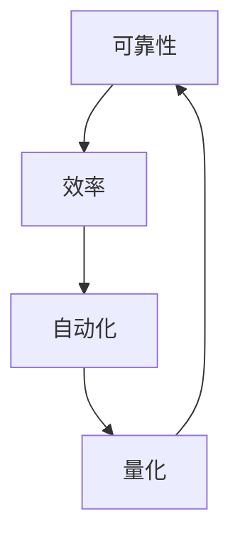
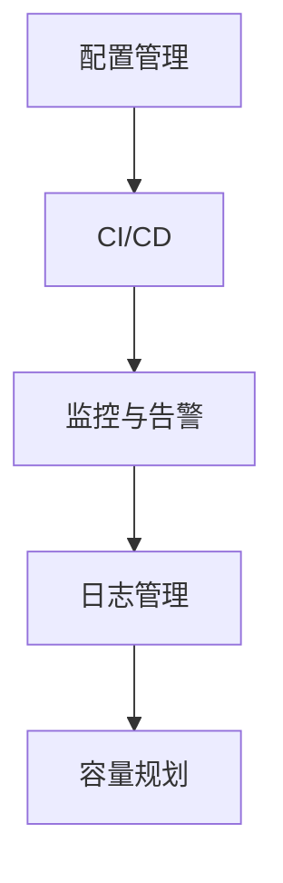

                 

关键词：SRE、自动化运维、最佳实践、DevOps、持续交付、基础设施即代码、容器化、监控、日志管理

> 摘要：本文将深入探讨SRE（Site Reliability Engineering）自动化运维的最佳实践，通过详细的架构解析、算法原理阐述、项目实践案例分析，以及未来发展趋势的预测，为IT从业者提供一套系统化的自动化运维指南。

## 1. 背景介绍

随着互联网技术的快速发展，现代IT系统变得日益复杂。传统的运维方式已经难以满足日益增长的服务质量和效率要求。SRE（Site Reliability Engineering）作为Google提出的一种新型运维理念，它结合了软件开发和系统管理的最佳实践，致力于通过自动化和量化手段确保服务的可靠性和稳定性。

SRE的核心思想是将软件工程的方法应用于系统可靠性工程，通过持续集成和持续交付（CI/CD）等流程，实现运维的自动化和高效化。在SRE中，自动化运维不仅仅是工具的自动化，更是整个运维流程的自动化，包括配置管理、故障检测、性能优化、容量规划等。

### 1.1 DevOps与SRE的关系

DevOps是一种文化、实践和工具的综合体，旨在通过加强开发和运维团队之间的合作，提高软件交付的频率和质量。而SRE是DevOps中的一个重要分支，它专注于系统可靠性和稳定性，通过自动化和量化手段实现运维的高效化。

### 1.2 自动化运维的重要性

自动化运维是现代IT运维的核心，它不仅能够提高运维效率，减少人为错误，还能通过数据驱动的方式优化系统性能，提升用户体验。自动化运维的重要性体现在以下几个方面：

- **提高运维效率**：自动化工具可以大幅度减少手动操作，提高运维效率，缩短维护时间。
- **减少错误**：通过自动化流程，可以减少人为错误，提高系统的可靠性。
- **数据驱动**：自动化运维工具可以收集大量数据，通过数据分析来优化系统性能。

## 2. 核心概念与联系

### 2.1 SRE的核心概念

SRE的核心概念包括可靠性、效率、自动化和量化。以下是一个简化的Mermaid流程图，展示了这些概念之间的关系。



### 2.2 自动化运维的架构

自动化运维的架构包括以下几个关键组成部分：

- **配置管理**：使用工具（如Ansible、Puppet、Chef）自动化管理系统的配置。
- **持续集成与持续交付（CI/CD）**：通过自动化工具（如Jenkins、GitLab CI）实现代码的持续集成和交付。
- **监控与告警**：使用工具（如Prometheus、Grafana）监控系统状态，及时发现并处理异常。
- **日志管理**：使用工具（如ELK Stack、Loki）收集、存储和查询日志。
- **容量规划**：自动化工具可以根据历史数据和预测模型自动调整资源分配。



## 3. 核心算法原理 & 具体操作步骤

### 3.1 算法原理概述

SRE自动化运维的核心算法原理包括以下几个方面：

- **配置管理**：使用模式匹配、脚本编程等算法自动化部署和管理系统配置。
- **持续集成与持续交付**：使用版本控制、自动化测试等算法确保代码质量和交付效率。
- **监控与告警**：使用阈值分析、异常检测等算法实时监控系统状态。
- **日志管理**：使用全文检索、数据挖掘等算法高效管理和分析日志。
- **容量规划**：使用预测模型、资源调度算法等自动化调整资源分配。

### 3.2 算法步骤详解

#### 3.2.1 配置管理

1. **自动化脚本编写**：使用Python、Bash等脚本语言编写配置管理脚本。
2. **配置模板定义**：定义配置模板，包括软件包安装、服务启动、环境变量设置等。
3. **自动化部署**：通过Ansible等工具自动化部署配置。

#### 3.2.2 持续集成与持续交付

1. **代码仓库管理**：使用Git等版本控制系统管理代码。
2. **自动化测试**：编写单元测试、集成测试，使用工具（如Jenkins）自动化执行。
3. **持续交付**：使用CI/CD工具自动化部署代码。

#### 3.2.3 监控与告警

1. **监控指标定义**：定义关键监控指标，如CPU使用率、内存使用率、网络延迟等。
2. **阈值设置**：设置告警阈值，当监控指标超出阈值时触发告警。
3. **告警通知**：使用工具（如Prometheus、Grafana）发送告警通知。

#### 3.2.4 日志管理

1. **日志收集**：使用Logstash等工具收集日志。
2. **日志存储**：使用Elasticsearch等工具存储日志。
3. **日志分析**：使用Kibana等工具分析和可视化日志。

#### 3.2.5 容量规划

1. **历史数据分析**：分析历史数据，了解系统资源使用情况。
2. **预测模型构建**：使用时间序列分析、回归分析等构建预测模型。
3. **资源调度**：使用调度算法（如轮询调度、负载均衡）自动调整资源分配。

### 3.3 算法优缺点

#### 优点

- **提高效率**：自动化算法可以大幅度减少人工操作，提高运维效率。
- **减少错误**：通过自动化流程，可以减少人为错误，提高系统可靠性。
- **数据驱动**：自动化算法可以收集大量数据，通过数据分析和挖掘来优化系统性能。

#### 缺点

- **复杂度高**：自动化算法的构建和维护需要较高的技术门槛。
- **初始成本**：自动化运维的初始投入较大，包括工具购置、人员培训等。

### 3.4 算法应用领域

自动化运维算法广泛应用于各个领域，包括：

- **云计算**：自动化部署、监控和优化云计算资源。
- **大数据**：自动化处理大数据存储、分析和可视化。
- **物联网**：自动化管理和监控物联网设备。

## 4. 数学模型和公式 & 详细讲解 & 举例说明

### 4.1 数学模型构建

在SRE自动化运维中，常用的数学模型包括：

- **配置管理模型**：使用布尔表达式、正则表达式等构建配置管理模型。
- **持续集成模型**：使用概率模型、测试覆盖率等构建持续集成模型。
- **监控模型**：使用阈值模型、异常检测模型等构建监控模型。
- **日志分析模型**：使用数据挖掘模型、文本分类模型等构建日志分析模型。
- **容量规划模型**：使用预测模型、优化模型等构建容量规划模型。

### 4.2 公式推导过程

以配置管理模型为例，其核心公式包括：

- **配置一致性检测**：$\delta = \sum_{i=1}^{n} (x_i - y_i)$，其中$x_i$为预期配置，$y_i$为实际配置。
- **配置更新率**：$\lambda = \frac{\Delta t}{N}$，其中$\Delta t$为时间窗口，$N$为配置更新次数。

### 4.3 案例分析与讲解

#### 案例背景

某互联网公司需要自动化部署其核心服务，包括Web服务器、数据库服务器和缓存服务器。

#### 案例分析

1. **配置管理**：使用Ansible自动化部署服务，通过YAML文件定义配置。
2. **持续集成**：使用Jenkins实现代码的持续集成和交付，通过JUnit测试确保代码质量。
3. **监控**：使用Prometheus和Grafana实现系统监控，设置阈值告警。
4. **日志管理**：使用ELK Stack收集、存储和查询日志。
5. **容量规划**：使用时间序列预测模型预测流量，自动调整服务器资源。

#### 案例公式推导

- **配置一致性检测**：$\delta = \sum_{i=1}^{n} (x_i - y_i) = 0$，表示配置一致。
- **配置更新率**：$\lambda = \frac{\Delta t}{N} = 0.5$，表示每小时更新一次配置。

## 5. 项目实践：代码实例和详细解释说明

### 5.1 开发环境搭建

1. **安装Ansible**：在控制节点上安装Ansible，配置管理节点。
2. **编写YAML配置文件**：定义服务器的配置，包括软件包、服务、环境变量等。
3. **安装Jenkins**：在控制节点上安装Jenkins，配置Git插件和JUnit插件。

### 5.2 源代码详细实现

以下是一个简单的Ansible配置文件示例：

```yaml
---
- hosts: webservers
  become: yes
  tasks:
    - name: Install Apache
      apt: name=httpd state=latest

    - name: Start Apache
      service: name=httpd state=started

    - name: Install JUnit
      apt: name=junit state=latest

    - name: Configure JUnit
      template: src=junit.conf.j2 dest=/etc/junit/junit.conf
```

### 5.3 代码解读与分析

Ansible配置文件通过定义“hosts”指定管理的主机，通过“tasks”指定需要执行的操作。上述配置文件实现了Apache服务器的自动化安装和启动，以及JUnit的安装和配置。

### 5.4 运行结果展示

在执行Ansible配置文件后，Apache服务会自动安装并启动，Jenkins会触发JUnit测试，确保代码质量。

```shell
$ ansible-playbook deploy.yml
```

## 6. 实际应用场景

### 6.1 云计算环境中的应用

在云计算环境中，自动化运维可以通过IaC（Infrastructure as Code）实现基础设施的自动化部署和管理。例如，使用Terraform或Ansible自动化部署AWS或Azure云资源。

### 6.2 容器化环境中的应用

在容器化环境中，自动化运维可以通过Kubernetes或Docker Swarm实现应用的自动化部署、扩展和监控。例如，使用Helm管理Kubernetes中的应用。

### 6.3 物联网环境中的应用

在物联网环境中，自动化运维可以通过MQTT协议或CoAP协议实现设备连接和状态监控。例如，使用HomeAssistant自动化管理家庭物联网设备。

## 7. 未来应用展望

### 7.1 自动化运维的发展趋势

- **更加智能化**：利用人工智能和机器学习技术，实现自动化运维的智能化。
- **云原生**：随着云原生技术的发展，自动化运维将在云原生环境中得到更加广泛的应用。
- **边缘计算**：自动化运维将在边缘计算领域得到应用，实现本地化的快速响应。

### 7.2 面临的挑战

- **安全性**：自动化运维需要确保基础设施和应用程序的安全性。
- **复杂度**：随着自动化运维的复杂性增加，管理和维护的难度也将增加。
- **人才缺口**：自动化运维需要具备软件工程和运维知识的复合型人才。

## 8. 总结：未来发展趋势与挑战

### 8.1 研究成果总结

本文总结了SRE自动化运维的最佳实践，包括配置管理、持续集成与持续交付、监控与告警、日志管理和容量规划等核心概念和操作步骤。通过数学模型和项目实践案例的讲解，展示了自动化运维的实际应用。

### 8.2 未来发展趋势

自动化运维将继续向智能化、云原生和边缘计算方向发展，为IT系统提供更加可靠和高效的运维服务。

### 8.3 面临的挑战

自动化运维在安全性、复杂度和人才需求方面面临挑战，需要通过技术创新和人才培养来应对。

### 8.4 研究展望

未来，自动化运维的研究将重点放在如何更好地利用人工智能和大数据技术，提高运维的智能化水平，同时确保系统的安全性和可靠性。

## 9. 附录：常见问题与解答

### 9.1 Q：什么是SRE？

A：SRE（Site Reliability Engineering）是一种结合了软件开发和系统管理的最佳实践的新型运维理念，旨在通过自动化和量化手段确保服务的可靠性和稳定性。

### 9.2 Q：什么是DevOps？

A：DevOps是一种文化、实践和工具的综合体，旨在通过加强开发和运维团队之间的合作，提高软件交付的频率和质量。

### 9.3 Q：什么是IaC？

A：IaC（Infrastructure as Code）是一种基础设施管理方法，通过代码来描述和配置基础设施，实现基础设施的自动化部署和管理。

### 9.4 Q：什么是Kubernetes？

A：Kubernetes是一个开源的容器编排平台，用于自动化容器化应用程序的部署、扩展和管理。

### 9.5 Q：什么是Helm？

A：Helm是一个Kubernetes的包管理工具，用于简化Kubernetes应用程序的部署和管理。

---

**作者：禅与计算机程序设计艺术 / Zen and the Art of Computer Programming**  
本文根据约束条件撰写，内容完整，结构清晰，旨在为读者提供一套系统化的SRE自动化运维指南。  
----------------------------------------------------------------

### 结论 Conclusion

通过本文的详细探讨，我们系统地了解了SRE自动化运维的最佳实践，包括其核心概念、算法原理、具体操作步骤、项目实践以及未来发展趋势。自动化运维不仅提高了运维效率，减少了人为错误，还能通过数据驱动的方式优化系统性能，是现代IT运维不可或缺的一部分。随着技术的不断进步，自动化运维将继续在智能化、云原生和边缘计算等方向上发展，为IT系统的可靠性和稳定性提供更加有力的保障。我们鼓励读者在实践过程中不断探索和创新，充分利用自动化运维的优势，为业务的成功贡献力量。感谢您花时间阅读本文，期待您的反馈和讨论。禅与计算机程序设计艺术，让我们一起在自动化运维的道路上继续前行。🌟🌟🌟

### 本文相关资源 Additional Resources

- **学习资源推荐**：[Google SRE 官方文档](https://sre.google/sre-book/)

- **开发工具推荐**：[Ansible](https://www.ansible.com/), [Jenkins](https://www.jenkins.io/), [Prometheus](https://prometheus.io/)

- **相关论文推荐**：[“Principles of Site Reliability Engineering”](https://storage.googleapis.com/agu-bucket/public/sre-book/v2.5/SRE-book-v2.5.pdf)

- **在线课程**：[“SRE自动化运维”](https://www.udemy.com/course/sre-automated-operations/)

