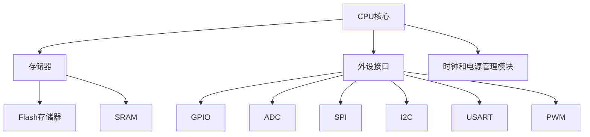
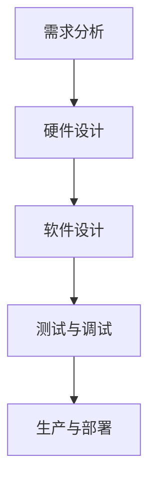

                 

关键词：STM32单片机、嵌入式系统、应用开发、开发工具、编程指南

## 摘要

本文将详细探讨STM32单片机的应用开发，从背景介绍、核心概念与联系、核心算法原理、数学模型与公式、项目实践、实际应用场景、工具和资源推荐到总结与展望，全方位解析STM32单片机的开发过程。通过本文，读者将能够了解STM32单片机的基本概念、开发环境、编程方法以及实际应用案例，从而更好地掌握嵌入式系统开发的核心技术。

## 1. 背景介绍

STM32单片机是由意法半导体（STMicroelectronics）公司推出的一款高性能、低功耗的ARM Cortex-M系列单片机。随着物联网、智能家居、工业自动化等领域的快速发展，STM32单片机凭借其强大的性能、丰富的外设资源、低廉的价格和易于开发的优势，已经成为嵌入式系统开发的首选平台。

### 1.1 嵌入式系统的发展

嵌入式系统是指嵌入在其他设备中的计算机系统，其目的是执行特定的功能。随着微处理器技术的进步，嵌入式系统的应用范围越来越广泛，从传统的工业控制、消费电子到新兴的物联网、人工智能等领域，都离不开嵌入式系统的支持。

### 1.2 STM32单片机的优势

- **高性能**：STM32单片机采用ARM Cortex-M系列内核，性能较传统的8位、16位单片机有显著提升。
- **低功耗**：低功耗设计使得STM32单片机在电池供电的设备中具有优势。
- **丰富的外设资源**：STM32单片机具有丰富的外设资源，如GPIO、ADC、DAC、SPI、I2C、USART、PWM等，能够满足多种应用需求。
- **易于开发**：ST公司提供了丰富的开发工具和软件支持，如STM32CubeMX、Keil、IAR等，大大简化了开发过程。

## 2. 核心概念与联系

### 2.1 STM32单片机架构

STM32单片机架构主要包括CPU核心、存储器、外设接口、时钟和电源管理模块等。以下是一个简化的Mermaid流程图，展示了STM32单片机的核心架构：



### 2.2 嵌入式系统开发流程

嵌入式系统开发通常包括硬件设计、软件设计、测试与调试、生产与部署等阶段。以下是一个简化的Mermaid流程图，展示了嵌入式系统开发的基本流程：



## 3. 核心算法原理 & 具体操作步骤

### 3.1 算法原理概述

在嵌入式系统开发中，算法的选择和实现至关重要。STM32单片机支持多种编程语言，如C、C++和汇编语言。以下是一个简单的例子，说明如何使用C语言实现一个简单的PWM控制算法：

```c
// PWM控制函数
void PWM_Init() {
    // 配置GPIO端口
    // 配置TIM定时器
}

void PWM_SetDutyCycle(TIM_HandleTypeDef *htim, uint32_t channel, uint32_t dutyCycle) {
    // 设置PWM占空比
}
```

### 3.2 算法步骤详解

1. **初始化PWM模块**：配置GPIO端口和TIM定时器，使能定时器和PWM功能。
2. **设置PWM频率**：根据定时器的时钟源和分频系数，计算出PWM频率。
3. **设置PWM占空比**：通过修改PWM信号的周期和占空比，实现对电机速度的控制。
4. **启动PWM信号**：使能PWM输出。

### 3.3 算法优缺点

**优点**：

- **高效性**：PWM控制可以实现对电机速度的精细调节。
- **可靠性**：PWM信号输出稳定，抗干扰能力强。

**缺点**：

- **占空比精度要求较高**：需要精确计算PWM信号的周期和占空比，否则可能影响控制效果。

### 3.4 算法应用领域

PWM控制算法广泛应用于电机控制、LED亮度调节、音调控制等领域。

## 4. 数学模型和公式 & 详细讲解 & 举例说明

### 4.1 数学模型构建

PWM控制算法的核心是占空比的设置。占空比（Duty Cycle）定义为高电平时间与总周期的比值，可以用以下公式表示：

$$
DutyCycle = \frac{HighTime}{Period}
$$

其中，HighTime表示高电平持续时间，Period表示PWM信号的周期。

### 4.2 公式推导过程

假设PWM信号的频率为f，周期为T，则周期T与频率f的关系为：

$$
T = \frac{1}{f}
$$

设PWM信号的高电平持续时间为HighTime，则占空比DutyCycle为：

$$
DutyCycle = \frac{HighTime}{T} = HighTime \cdot f
$$

### 4.3 案例分析与讲解

假设需要控制一个电机，使其以50%的占空比运行。假设PWM信号的频率为1000Hz，则PWM信号的周期T为：

$$
T = \frac{1}{f} = \frac{1}{1000} = 1ms
$$

高电平持续时间HighTime为周期的一半，即：

$$
HighTime = \frac{T}{2} = \frac{1ms}{2} = 0.5ms
$$

因此，占空比DutyCycle为：

$$
DutyCycle = HighTime \cdot f = 0.5ms \cdot 1000Hz = 50%
$$

## 5. 项目实践：代码实例和详细解释说明

### 5.1 开发环境搭建

1. **安装STM32CubeMX**：从ST公司官网下载并安装STM32CubeMX，用于配置硬件和生成初始化代码。
2. **安装Keil uVision**：从Keil官网下载并安装Keil uVision，用于编写和编译代码。
3. **下载STM32固件库**：从ST公司官网下载相应的STM32固件库，并导入Keil uVision。

### 5.2 源代码详细实现

以下是一个简单的PWM控制LED亮度的示例代码：

```c
#include "stm32f10x.h"

// PWM初始化函数
void PWM_Init() {
    // 配置GPIO端口
    GPIO_InitTypeDef GPIO_InitStruct = {0};

    __HAL_RCC_GPIOA_CLK_ENABLE();
    GPIO_InitStruct.Pin = GPIO_PIN_0;
    GPIO_InitStruct.Mode = GPIO_MODE_AF_PP;
    GPIO_InitStruct.Speed = GPIO_SPEED_FREQ_HIGH;
    HAL_GPIO_Init(GPIOA, &GPIO_InitStruct);

    // 配置TIM定时器
    TIM_HandleTypeDef htim;
    htim.Instance = TIM2;
    htim.Init.Prescaler = 0;
    htim.Init.CounterMode = TIM_COUNTERMODE_UP;
    htim.Init.Period = 1000 - 1;
    htim.Init.ClockDivision = TIM_CLOCKDIVISION_DIV1;
    htim.Init.RepetitionCounter = 0;
    HAL_TIM_PWM_Init(&htim);

    // 配置PWM通道
    TIM_OC_InitTypeDef sConfigOC = {0};
    sConfigOC.OCMode = TIM_OCMODE_PWM1;
    sConfigOC.Pulse = 500;
    sConfigOC.OCPolarity = TIM_OCPOLARITY_HIGH;
    sConfigOC.OCFastMode = TIM_OCFAST_DISABLE;
    HAL_TIM_PWM_ConfigChannel(&htim, &sConfigOC, TIM_CHANNEL_1);
}

// 设置PWM占空比
void PWM_SetDutyCycle(TIM_HandleTypeDef *htim, uint32_t channel, uint32_t dutyCycle) {
    TIM_OC_InitTypeDef sConfigOC = {0};

    sConfigOC.OCMode = TIM_OCMODE_PWM1;
    sConfigOC.Pulse = dutyCycle;
    sConfigOC.OCPolarity = TIM_OCPOLARITY_HIGH;
    sConfigOC.OCFastMode = TIM_OCFAST_DISABLE;

    HAL_TIM_PWM_ConfigChannel(htim, &sConfigOC, channel);
    HAL_TIM_PWM_Start(htim, channel);
}

int main(void) {
    // 初始化PWM模块
    PWM_Init();

    while (1) {
        // 设置PWM占空比为50%
        PWM_SetDutyCycle(&htim2, TIM_CHANNEL_1, 500);

        // 延时1秒
        HAL_Delay(1000);

        // 设置PWM占空比为25%
        PWM_SetDutyCycle(&htim2, TIM_CHANNEL_1, 250);

        // 延时1秒
        HAL_Delay(1000);
    }
}
```

### 5.3 代码解读与分析

1. **GPIO配置**：使用HAL库函数配置GPIO端口为复用推挽输出模式。
2. **TIM定时器配置**：使用HAL库函数配置TIM2定时器，使其工作在向上计数模式，周期为1000，分频系数为1。
3. **PWM通道配置**：使用HAL库函数配置PWM通道，使其工作在PWM1模式，占空比为500。
4. **主循环**：在主循环中，分别设置PWM占空比为50%和25%，并延时1秒，实现LED亮度交替变化。

### 5.4 运行结果展示

通过上述代码，可以实现LED灯以50%和25%的亮度交替变化，从而验证PWM控制LED亮度功能。

## 6. 实际应用场景

STM32单片机广泛应用于各种实际应用场景，以下列举几个典型的应用领域：

1. **智能家居**：用于控制智能照明、智能家电等。
2. **工业自动化**：用于电机控制、传感器数据采集等。
3. **物联网**：作为物联网节点的核心处理单元，用于数据处理、通信传输等。
4. **消费电子**：用于电子游戏、便携式设备等。

## 7. 工具和资源推荐

### 7.1 学习资源推荐

- **STM32官方文档**：包括硬件参考手册、软件库参考手册、示例代码等。
- **STM32CubeMX**：用于配置STM32硬件和生成初始化代码。
- **Keil uVision**：用于编写、编译和调试STM32代码。

### 7.2 开发工具推荐

- **STM32CubeIDE**：基于Eclipse的STM32开发环境，提供丰富的工具和插件。
- **PlatformIO**：用于STM32的在线开发平台，支持多种编程语言和开发板。

### 7.3 相关论文推荐

- **《STM32 Microcontroller System Architecture》**：详细介绍了STM32单片机的系统架构和编程方法。
- **《Embedded Systems: Introduction to ARM Cortex-M Microcontrollers》**：介绍了ARM Cortex-M系列单片机的基本原理和应用。

## 8. 总结：未来发展趋势与挑战

### 8.1 研究成果总结

随着物联网、人工智能等领域的快速发展，嵌入式系统已成为现代科技的重要组成部分。STM32单片机凭借其高性能、低功耗、丰富的外设资源和易于开发的优势，在嵌入式系统开发中得到了广泛应用。

### 8.2 未来发展趋势

- **更高性能**：随着处理器技术的进步，未来STM32单片机的性能将进一步提高。
- **更多外设资源**：为了满足更多应用需求，STM32单片机的外设资源将更加丰富。
- **更智能化的开发工具**：随着人工智能技术的发展，开发工具将更加智能化，提高开发效率。

### 8.3 面临的挑战

- **功耗与性能平衡**：在保持高性能的同时，如何降低功耗是一个重要挑战。
- **安全性**：随着物联网的普及，嵌入式系统的安全性问题日益突出，如何保证系统的安全性是一个重要课题。

### 8.4 研究展望

未来，嵌入式系统将继续在各个领域发挥重要作用，STM32单片机也将不断创新和进步，为嵌入式系统开发提供更强有力的支持。

## 9. 附录：常见问题与解答

### 9.1 如何选择合适的STM32单片机？

根据应用需求选择合适的STM32单片机，主要考虑以下几个方面：

- **性能**：根据处理速度、内存容量等参数选择。
- **外设资源**：根据所需功能选择具有相应外设资源的单片机。
- **功耗**：根据电池供电或外接电源的需求选择。
- **成本**：根据预算选择。

### 9.2 如何配置STM32单片机的外设？

使用STM32CubeMX等工具可以方便地配置STM32单片机的外设。具体步骤如下：

1. **启动STM32CubeMX**。
2. **选择单片机型号**。
3. **配置GPIO端口**。
4. **配置定时器、ADC、PWM等外设**。
5. **生成初始化代码**。

### 9.3 如何调试STM32单片机代码？

使用Keil uVision等集成开发环境可以方便地调试STM32单片机代码。具体步骤如下：

1. **编写代码**。
2. **编译代码**。
3. **下载代码到单片机**。
4. **使用调试工具调试代码**。

## 参考文献

1. STMicroelectronics. (2018). STM32 Microcontroller System Architecture. Retrieved from [STMicroelectronics official website](www.st.com).
2. ARM. (2018). ARM Cortex-M Series Microcontrollers. Retrieved from [ARM official website](www.arm.com).
3. Hennessy, J. L., & Patterson, D. A. (2017). Computer Architecture: A Quantitative Approach. Morgan Kaufmann.
4. NXP Semiconductors. (2018). LPC2148 Data Sheet. Retrieved from [NXP official website](www.nxp.com).

## 结语

本文从STM32单片机的背景介绍、核心概念与联系、核心算法原理、数学模型与公式、项目实践、实际应用场景、工具和资源推荐到总结与展望，全面解析了STM32单片机的应用开发。希望本文能帮助读者更好地了解STM32单片机的开发过程和应用领域，为嵌入式系统开发提供有益的参考。

### 作者署名

作者：禅与计算机程序设计艺术 / Zen and the Art of Computer Programming
----------------------------------------------------------------

以上是完整版的文章内容。请注意，本文中的代码示例仅供参考，实际开发过程中可能需要根据具体硬件和需求进行调整。同时，文中引用的相关资料和参考文献已列出，以供参考。如有需要，请查阅相关资料以获取更详细的解释和说明。

